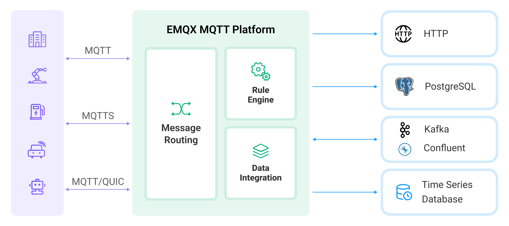

# Rule SQL リファレンス

EMQX のルールでは、データの抽出、フィルタリング、拡張、変換に SQL ベースの構文を使用します。この SQL ライクな構文には、`SELECT` と `FOREACH` の2種類のステートメントがあります。

| ステートメント | 説明                                                  |
| -------------- | ----------------------------------------------------- |
| `SELECT`       | SQL ステートメントの結果が単一メッセージとなる場合に使用します。 |
| `FOREACH`      | 1つの入力メッセージからゼロ個以上のメッセージを生成する場合に使用します。 |

各ルールは正確に1つのステートメントを持つことができます。SQL ステートメントは豊富な組み込み関数を提供しており、簡単な変換やタイムスタンプの作成などが可能です。

また、SQL ステートメントは式内に [jq プログラム](https://stedolan.github.io/jq/) を埋め込むことをサポートしており、必要に応じて複雑なデータ変換を行えます。式は `SELECT` と `FOREACH` ステートメント内に埋め込むことができます。`SELECT` と `FOREACH` ステートメントで参照可能なフィールドについては、[データソースとフィールド](./rule-sql-events-and-fields.md) を参照してください。



## `SELECT` ステートメント

`SELECT` ステートメントは、入力メッセージから特定のフィールドを選択し、フィールド名の変更、データ変換、条件に基づくメッセージのフィルタリングを行います。

ルールエンジン SQL における `SELECT` ステートメントの基本形式は以下の通りです。

```sql
SELECT <fields_expressions> FROM <topic> [WHERE <conditions>]
```

`SELECT` 句で出力に含めるフィールド（メッセージのペイロードおよびメタデータの両方から）を指定し、`WHERE` 句で特定の条件に基づいてメッセージをフィルタリングできます。

### `FROM` 句

`FROM` 句はクエリのデータソースを指定します。特定のトピックや条件に合致するイベントからデータを選択できます。

#### トピックによる選択

例えば、トピックパターン `t/#` と `my/other/topic` にパブリッシュされたすべてのメッセージに適用されるルールを定義する場合、以下のように記述します。

```sql
SELECT clientid, payload.clientid as myclientid FROM "t/#", "my/other/topic"
```

ここで、

- `SELECT` 句は出力に含めるフィールドを指定しています。

  - `clientid`: メタデータ内のクライアントID

  - `payload.clientid`: メッセージペイロード内のクライアントID。ペイロード内のすべてのフィールドは `payload` の下に格納されています。

    - `as` 構文で `payload.clientid` フィールドを `myclientid` として名前変更しています。

#### イベントによる選択

ルールをイベントに紐づけることも可能です。例えば、クライアント `c1` が EMQX に接続を開始した際の IP アドレスとポート番号を取得したい場合、以下のように記述します。

```sql
SELECT peername as ip_port FROM "$events/client_connected" WHERE clientid = 'c1'
```

::: tip

利用可能なすべてのイベントは EMQX ダッシュボードのルール編集時の **Events** タブで確認できます。

:::

### `WHERE` 句

`WHERE` 句は、`FROM` 句で指定したトピックやイベントのフィルターに加えて、メッセージが満たすべき追加条件を指定し、メッセージの絞り込みを行うオプションの方法です。

例えば、トピック `t/#` のメッセージのうち、ユーザー名が `eric` のものだけをフィルタリングする場合は以下のように記述します。

```sql
SELECT * FROM "t/#" WHERE username = 'eric'
```

::: tip

`WHERE` 句で使用するフィールドは、メッセージのメタデータまたはペイロード内に存在するフィールドでなければなりません。そうでない場合はエラーになります。

:::

### 式の利用

[式](#expressions-and-operations)は、`SELECT` や `WHERE` 句内でデータ変換に使用できます。例えば、以下の SQL ステートメントは `clientid` フィールドの値を大文字に変換し、サフィックスを追加して、結果を出力メッセージの `cid` として名前付けしています。

```sql
SELECT (upper(clientid) + '_UPPERCASE_LETTERS') as cid FROM "t/#"
```

次の例は、括弧付きの算術式を使ったデータ変換の例です。

```sql
SELECT (payload.integer_field + 2) * 2 as num FROM "t/#"
```

ドット表記を使って複雑な構造のペイロード内のフィールドにアクセスすることもできます（ペイロードが JSON 形式であることが前提です）。

```sql
SELECT payload.a.b.c.deep as my_field FROM "t/#"
```

以下のステートメントは、`WHERE` 句で等価演算子（=）を使ってフィールドが特定の値を持つかどうかをテストする例です。`SELECT *` はメタデータとペイロードのすべてを出力メッセージに転送します。

```sql
SELECT * FROM "t/#" WHERE payload.x.y = 1
```

`WHERE` 句では `and` と `or` 演算子を使って複雑なブール式を作成できます。

```sql
SELECT * FROM "t/#" WHERE payload.name = "sensor_1" and payload.temperature > 39
```

## `FOREACH` ステートメント

`FOREACH` ステートメントは `SELECT` ステートメントのより一般的な形と考えられます。1つの入力メッセージからゼロ個以上の出力メッセージを生成できます。`FOREACH` ステートメントを使うと、特定条件に基づくデータのフィルタリングと、結果の MQTT トピックやデータブリッジへの出力が可能です。

ルールエンジン SQL における `FOREACH` ステートメントの基本形式は以下の通りです。

```sql
FOREACH <expression_that_evaluates_to_array> [as <name>]
[DO <fields_expressions>]
[INCASE <condition>]
FROM <topic>
[WHERE <condition>]
```

`FOREACH` ステートメントは、`FOREACH` 句で入力メッセージから配列を作成することから始まります。`FROM` と `WHERE` 句は `SELECT` ステートメントの同名句と同じ目的で動作します。`FOREACH` ステートメントには、`FOREACH`、`FROM`、`WHERE` 句に加えて、以下の2つのオプション句があります。

| 句        | 必須/任意 | 説明                                                  |
| --------- | --------- | ----------------------------------------------------- |
| `DO`      | 任意      | `FOREACH` で選択された配列の各要素を変換します。<br /><br />`SELECT` ステートメントの `SELECT` 句に対応し、同じ式を受け入れます。 |
| `INCASE`  | 任意      | 指定した条件に合致しない配列要素をフィルタリングします。<br /><br />`WHERE` 句と同じ式を受け入れます。 |

::: tip

`FOREACH` 句以外のすべての句は `SELECT` ステートメントの対応する句と対応しています。したがって、`FOREACH` ステートメントは前述の通り `SELECT` ステートメントの一般化と見なせます。以下の2つのステートメントは同等です（`jq('.', payload)` はペイロードを配列でラップしています）。

```sql
FOREACH jq('.', payload) as it
DO it.field_1, it.field_2 
FROM "t/#"
```

```sql
SELECT payload.field_1, payload.field_2
FROM "t/#"
```
:::

`FOREACH` 句の `as` 構文は配列の要素に名前を付けるために使われ、`DO` 句内で「現在の」要素を参照しやすくします。`as name` 部分を省略すると、デフォルトで `item` という名前が使われます。

以下は、`FOREACH` ステートメントで2つの値を出力する例です。両方の値は `value` という1つのフィールドのみを持ち、その値はそれぞれメッセージの `field_1` と `field_2` の値です。

```sql 
FOREACH jq('[.field_1, .field_2]', payload) 
DO item as value
FROM "t/#"
```

`FOREACH` ステートメントの入力データは配列形式である必要があります。入力メッセージがすでに配列を含む場合は、直接 `FOREACH` ステートメントを適用できます。

例えば、トピック `t/#` にパブリッシュされたメッセージで、センサーの `idx` が1以上の場合にタイムスタンプ、クライアントID、センサー名、インデックスを出力したい場合は以下のコードを使います。

```sql
FOREACH
    payload.sensors as sensor  
DO
    timestamp,
    clientid,
    upper(sensor.name) as name,
    sensor.idx as idx
INCASE
    sensor.idx >= 1
FROM "t/#"
```

ここで、

- `FOREACH` 句は入力メッセージのペイロード内の `sensors` フィールドを配列として指定し、配列要素に `sensor` という名前を付けています。
- `DO` 句は出力に含めるフィールドを指定しています。
  - `timestamp` は入力メッセージのメタデータからのタイムスタンプです。
  - `clientid` は入力メッセージのメタデータからのクライアントIDです。
  - `sensor.name` は組み込み関数 `upper` で大文字化され、`as` 構文で `name` と名前変更されます。ここでの `sensor` は `FOREACH` 句で選択された配列の現在の要素を指します。
  - `sensor.idx` は `as` 句で `idx` と名前変更されます。
- `INCASE` 句はフィルター条件を追加し、`idx` フィールドの値が1以上のセンサーのみを出力します。
- `FROM` 句はトピックパターン `t/#` にマッチするメッセージを対象としています。

ルールを作成したら、運用前に必ずテストすることをお勧めします。ダッシュボードの UI にはサンプルメッセージでルールをテストできる機能があります。SQL ステートメントのテスト方法については、[ルールのテスト](./rule-get-started.md#test-the-rule) を参照してください。上記のルールは以下の JSON 形式のペイロードでテスト可能です。

```json
{"sensors": [
    {"idx":0, "name":"t0"},
    {"idx":1, "name":"t1"},
    {"idx":2, "name":"t2"}
  ]
}
```

入力メッセージに配列が含まれていない場合は、`jq` 関数を使ってペイロードを配列でラップできます。例えば以下のように記述します。

```sql
FOREACH jq('.', payload) 
DO item.field_1, item.field_2 
FROM "t/#"
```

EMQX は高度な変換のために `jq` 関数をサポートしています。詳細なコード例は [組み込み `jq` 関数](./rule-sql-jq.md) を参照してください。

## 式と演算

EMQX のルール構文では、データ変換やメッセージのフィルタリングに式を使用でき、`SELECT`、`FOREACH`、`DO`、`INCASE`、`WHERE` などの句で利用可能です。この節では式の使い方について説明します。以下は式を構成する演算子の一覧で、他にも多数の[組み込み関数](./rule-sql-builtin-functions.md)が利用可能です。

### 算術演算

| 演算子 | 用途                                   | 戻り値                      |
| ------ | -------------------------------------- | --------------------------- |
| `+`    | 加算、または文字列の連結               | 合計、または連結された文字列 |
| `-`    | 減算                                   | 差分                        |
| `*`    | 乗算                                   | 積                          |
| `/`    | 除算                                   | 商                          |
| `div`  | 整数除算                               | 整数の商                    |
| `mod`  | 剰余                                   | 剰余                        |

### 論理演算

| 演算子 | 用途                     | 戻り値      |
| ------ | ------------------------ | ----------- |
| `>`    | より大きい               | true/false  |
| `<`    | より小さい               | true/false  |
| `<=`   | 以下                     | true/false  |
| `>=`   | 以上                     | true/false  |
| `<>`   | 等しくない               | true/false  |
| `!=`   | 等しくない               | true/false  |
| `=`    | 2つのオペランドが完全に等しいかをチェック（値の比較に使用） | true/false  |
| `=~`   | トピックがトピックフィルターにマッチするかをチェック（トピックマッチング専用） | true/false  |
| `and`  | 論理積                   | true/false  |
| `or`   | 論理和                   | true/false  |

### CASE 式

`CASE` 式は条件付き処理を行うために使用します。`CASE` 式は他言語の if-then-else 文に相当します。以下の例で使い方を示します。

```sql
SELECT
  CASE WHEN payload.x < 0 THEN 0
       WHEN payload.x > 7 THEN 7
       ELSE payload.x
  END as x
FROM "t/#"
```

メッセージが以下の場合、

```json
{"x": 8}
```

出力は以下のようになります。

```json
{"x": 7}
```

## さらなる例

### `SELECT` ステートメントの例

- トピック "t/a" のメッセージからすべてのフィールドを抽出:

    ```sql
    SELECT * FROM "t/a"
    ```

- トピック "t/a" または "t/b" のメッセージからすべてのフィールドを抽出:

    ```sql
    SELECT * FROM "t/a","t/b"
    ```

- トピックが 't/#' にマッチするメッセージからすべてのフィールドを抽出:

    ```sql
    SELECT * FROM "t/#"
    ```

- トピックが 't/#' にマッチするメッセージから qos、username、clientid フィールドを抽出（出力メッセージのペイロードにこれらのフィールドが含まれます）:

    ```sql
    SELECT qos, username, clientid FROM "t/#"
    ```

- ペイロードに username フィールドがあり、その値が 'Steven' のメッセージから username フィールドを抽出（FROM 句で `#` を使うと EMQX に送信されるすべてのメッセージに対してルールが評価されるため推奨されません）:

    ```sql
    SELECT username FROM "#" WHERE username='Steven'
    ```

- 入力メッセージのペイロードの `x` フィールドを抽出し、出力メッセージでフィールド名を `y` に変更。`WHERE` 句で新しいエイリアス `y` を使用。ペイロードが `{"x": 1}` のメッセージにマッチし、`{"x": 2}` にはマッチしません。

    ```sql
    SELECT payload.x as x FROM "tests/test_topic_1" WHERE y = 1
    ```

- ペイロードが `{"x": {"y": 1}}` のメッセージ（例：`{"x": {"y": 1}, "other": "field"}` も含む）にマッチ:

    ```sql
    SELECT * FROM "#" WHERE payload.x.y = 1
    ```

- クライアントID が 'c1' の MQTT クライアントが接続した場合、そのソース IP アドレスとポート番号を抽出:

    ```sql
    SELECT peername as ip_port FROM "$events/client_connected" WHERE clientid = 'c1'
    ```

- トピックが 't/topic' にマッチし、QoS レベルが 1 のすべてのサブスクリプションにマッチ。clientid を出力メッセージに抽出:

    ```sql
    SELECT clientid FROM "$events/session_subscribed" WHERE topic = 'my/topic' and qos = 1
    ```

- 上記例と類似だが、トピックマッチ演算子 `=~` を使い、トピックフィルター 't/#' にマッチ:

    ```sql
    SELECT clientid FROM "$events/session_subscribed" WHERE topic =~ 't/#' and qos = 1
    ```

- キーが "foo" のユーザープロパティを抽出（ユーザープロパティは MQTT 5.0 プロトコルの新機能で、古い MQTT バージョンには該当しません）:

    ```sql
    SELECT pub_props.'User-Property'.foo as foo FROM "t/#"
    ```

::: tip

- `FROM` 句のトピックはダブルクォーテーション（`""`）またはシングルクォーテーション（`''`）で囲む必要があります。
- `WHERE` 句の条件で文字列を使う場合はシングルクォーテーション（`''`）で囲みます。
- `FROM` 句に複数のトピックがある場合はカンマ（`,`）で区切ります。例：`SELECT * FROM "t/1", "t/2"`。
- ペイロードの内部フィールドにアクセスするにはドット記法（`.`）を使用します。例：ネストした JSON 構造のペイロードの場合、`payload.outer_field.inner_field` で `outer_field` の `inner_field` にアクセス可能です。
- ペイロードに対してエイリアスを作成するとパフォーマンスに影響が出るため、`SELECT payload as p` のような使い方は避けてください。
- 一部のエスケープシーケンスは使用時にアンエスケープが必要です。詳細は [unescape 関数](./rule-sql-builtin-functions.md#unescapestring-string---string) を参照してください。
:::

### `FOREACH` ステートメントの例

クライアントID が `c_steve` のメッセージがトピック `t/1` に届くとします。メッセージ本文は JSON 形式で、`sensors` フィールドは複数のオブジェクトを含む配列です。例は以下の通りです。

```json
{
    "date": "2020-04-24",
    "sensors": [
        {"name": "a", "idx":0},
        {"name": "b", "idx":1},
        {"name": "c", "idx":2}
    ]
}
```

#### 例1

この例では、`sensors` 配列の各オブジェクトをトピック `sensors/${idx}`（`${idx}` はオブジェクトのインデックス）に、内容を `${name}`（オブジェクトの名前）として再パブリッシュします。上記の入力例では、以下の3つのメッセージが発行されます。

1. *トピック*: sensors/0  
   *内容*: a  
2. *トピック*: sensors/1  
   *内容*: b  
3. *トピック*: sensors/2  
   *内容*: c  

このルールのアクション設定は以下の通りです。

- *アクションタイプ*: メッセージ再パブリッシュ
- *ターゲットトピック*: `sensors/${idx}`
- *ターゲット QoS*: 2
- *メッセージコンテンツテンプレート*: `${name}`

SQL ステートメントは以下の通りです。

```sql
FOREACH
    payload.sensors
FROM "t/#"
```

この SQL では、`FOREACH` 句で配列 `sensors` を指定しています。`FOREACH` ステートメントは配列の各オブジェクトに対して「メッセージ再パブリッシュ」アクションを実行し、3回実行されます。

#### 例2

この例では、`sensors` 配列のうち `id` フィールドの値が1以上のオブジェクトだけをトピック `sensors/${idx}` に、内容を `clientid=${clientid},name=${name},date=${date}` として再パブリッシュします。上記の入力例では、`id` が0の要素は除外されるため、2つのメッセージが発行されます。

1. *トピック*: sensors/1  
   *内容*: clientid=c_steve,name=b,date=2023-04-24  
2. *トピック*: sensors/2  
   *内容*: clientid=c_steve,name=c,date=2023-04-24  

アクション設定は以下の通りです。

- *アクションタイプ*: メッセージ再パブリッシュ
- *ターゲットトピック*: `sensors/${idx}`
- *ターゲット QoS*: 2
- *メッセージコンテンツテンプレート*: `clientid=${clientid},name=${name},date=${date}`

SQL ステートメントは以下の通りです。

```sql
FOREACH
    payload.sensors
DO
    clientid,
    item.name as name,
    item.idx as idx
INCASE
    item.idx >= 1
FROM "t/#"
```

この SQL では、`FOREACH` 句で配列 `sensors` を指定し、`DO` 句で各操作に必要なフィールドを選択しています。`clientid` はメッセージのメタデータから、`name` と `idx` は現在のセンサーオブジェクトから選択しています。`item` は `sensors` 配列の現在のオブジェクトを表します。`INCASE` 句は配列オブジェクトのフィルター条件を指定し、条件に合わないオブジェクトは無視されます。

`DO` と `INCASE` 句では、`item` で現在のオブジェクトにアクセスできますが、`FOREACH` 句の `as` 構文で変数名をカスタマイズできます。したがって、上記の SQL は以下のようにも書けます。

```sql
FOREACH
    payload.sensors as s
DO
    clientid,
    s.name as name,
    s.idx as idx
INCASE
    s.idx >= 1
FROM "t/#"
```

#### 例3

例2を拡張し、`clientid` フィールドの `c_steve` の `c_` プレフィックスを削除します。

ルールエンジンには `FOREACH`、`DO`、`INCASE` 句内で呼び出せる多数の組み込み関数があります。`c_steve` を `steve` に変換したい場合、例2の SQL を以下のように変更します。

```sql
FOREACH
    payload.sensors as s
DO
    nth(2, tokens(clientid,'_')) as clientid,
    s.name as name,
    s.idx as idx
INCASE
    s.idx >= 1
FROM "t/#"
```

複数の式を `FOREACH` 句に記述できますが、最後の式が配列を指定する必要があります。

例えば、入力メッセージのペイロードが以下のように構造化されている場合、

```json
{
    "date": "2020-04-24",
    "data": {
        "sensors": [
            {"name": "a", "idx":0},
            {"name": "b", "idx":1},
            {"name": "c", "idx":2}
        ]
    }
}
```

`FOREACH` 句でペイロードの `data` に別名を付けてから配列を選択できます。

```sql
FOREACH
    payload.data as d
    d.sensors as s
...
```

これは以下と同等です。

```sql
FOREACH
    payload.data.sensors as s
...
```

この機能は、複雑な構造のペイロードを扱う際に便利です。
