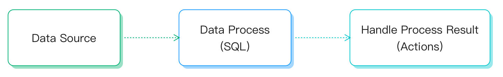

# ルールエンジン

EMQXは、データ処理のためのルールエンジン機能を提供しており、[データ統合](./data-bridges.md)と連携してIoTデータの抽出、フィルタリング、強化、変換、保存を行います。これにより、アプリケーション統合を加速し、ビジネスのイノベーションを促進します。


EMQXのルールエンジンは、特に受信したメッセージの変換や経路変更に有効です。例えば、不要なデータをフィルタリングしたり、変換を行ったり、特定のイベントや条件に基づいてアラートや通知をトリガーするルールを作成できます。

本章では、ルールエンジンの詳細な機能と使い方について解説します。

## ルールエンジンの仕組み

ルールは、**データソース**からデータを取得し、**データ変換**を行い、その結果に対して実行すべき**アクション**を指定します。



- **データソース**：ルールのデータソースはメッセージ、イベント、または外部データシステムが対象となります。ルールのSQLの`FROM`句でデータソースを指定し、`WHERE`句で処理対象となるメッセージに追加の制約を付けます。

  対応するデータソースの種類や`WHERE`句で参照可能なフィールドの詳細は、[データソースとフィールド](./rule-sql-events-and-fields.md)をご参照ください。

- **データ変換**：データ変換は入力メッセージを変換する処理を指します。SQLの`SELECT`句で入力メッセージからデータを抽出・変換します。埋め込みSQLのサンプル文を使って、出力メッセージにタイムスタンプを追加するなど高度な変換も実装可能です。

  SQL構文や組み込みSQL関数の詳細は、[ルールSQLリファレンス](./rule-sql-syntax.md)および[組み込みSQL関数](./rule-sql-builtin-functions.md)をご覧ください。

- **アクション**：入力がルールに従って処理された後、そのSQL実行結果に対して1つ以上のアクションを定義できます。ルールエンジンは順次対応するアクションを実行し、処理結果をデータベースに保存したり、別のMQTTトピックに再パブリッシュしたりします。サポートされているアクションは以下の通りです。

  - [メッセージの再パブリッシュ](./rule-get-started.md#add-republish-action)：処理結果を指定したMQTTトピックにパブリッシュする。
  - [コンソール出力](./rule-get-started.md#add-console-output-action)：処理結果をコンソールやログに出力する。
  - [シンクへの転送](./data-bridges.md#add-forwarding-with-sinks-action)：処理結果をMQTTサービス、Kafka、PostgreSQLなどの外部データシステムに送信する。

EMQXダッシュボードでのルール作成手順については、[ルールの作成](./rule-get-started.md)をご覧ください。

## ルールSQLの例

ルールSQLは、ルールのデータソースを指定し、データ処理の手順を定義するために使用します。以下はSQL文の例です。

```sql
SELECT
    payload.data as d
FROM
    "t/#"
WHERE
    clientid = 'foo'
```

上記SQL文の内容は以下の通りです。

- データソース：トピック`t/#`のメッセージ
- データ処理：メッセージ送信元のクライアントIDが`foo`の場合に、メッセージの内容から`data`フィールドを抽出し、新しい変数`d`に割り当てる

::: tip

`.`構文はデータがJSONまたはMap形式であることが前提です。別のデータ型の場合は、SQL関数を使ってデータ型変換を行う必要があります。

:::

ルールSQL文の形式や使用方法の詳細については、[SQLマニュアル](./rule-sql-syntax.md)を参照してください。

## ルールの典型的な適用シナリオ

- **アクション監視**：スマートホームのスマートロック開発において、ネットワーク障害や電源切れ、破壊行為によりロックがオフラインになると機能異常が発生します。ルールでオフラインイベントを監視し、この障害情報をアプリケーションサービスにプッシュすることで、アクセス層での即時障害検知が可能になります。
- **データフィルタリング**：コネクテッドビークルのトラック車両管理では、車両センサーが大量の稼働データを収集・報告します。アプリケーションプラットフォームは車速が40km/hを超えた場合のデータのみを関心対象とします。この場合、ルールを使って条件付きでメッセージをフィルタリングし、関連するデータだけを業務用メッセージキューに書き込みます。
- **メッセージルーティング**：スマート課金アプリケーションでは、端末デバイスが異なるトピックで業務種別を区別します。ルールを設定することで、課金関連メッセージを課金メッセージキューに振り分け、メッセージ到達時に業務システムへ確認通知を送信します。課金以外の情報は別のメッセージキューに振り分けることで、業務メッセージのルーティング設定を実現します。
- **メッセージのエンコード／デコード**：他のパブリック／プライベートTCPプロトコルアクセスや産業用途などのアプリケーションでは、ルール内のローカル処理機能（EMQX上でカスタム開発可能）を使ってバイナリや特殊フォーマットのメッセージボディをエンコード／デコードします。メッセージをルール経由でサーバーレス関数などの外部計算リソース（ユーザー開発可能）にルーティングし、業務アプリケーションが扱いやすいJSON形式に変換することも可能です。これによりプロジェクト統合の難易度が下がり、迅速なアプリケーション開発・提供が可能になります。

## 主なメリット

EMQXのルールエンジン機能は、ユーザーに以下のメリットを提供します。

**データ処理の簡素化**

SQLライクな構文とストリーム処理機能により、カスタムコードや追加ツールなしでデータのフィルタリング、変換、配信を効率的に行えます。

**リアルタイムの洞察とアクション**

特定条件に基づくアクションのトリガーにより、リアルタイムでの洞察取得と適切な対応が可能です。

**開発時間と労力の削減**

豊富な組み込み機能を備え、カスタムコードやメンテナンスの負担を軽減し、IoTアプリケーション開発を容易にします。

**スケーラビリティと信頼性**

高スループットおよび多数の接続デバイスに対応できる設計で、パフォーマンスや信頼性を損なうことなくIoTソリューションのスケールアップが可能です。
