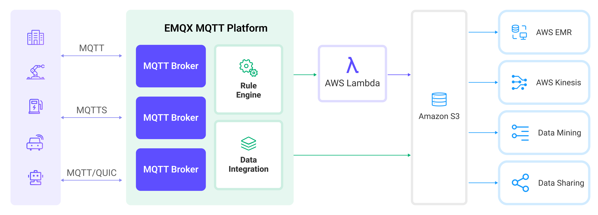
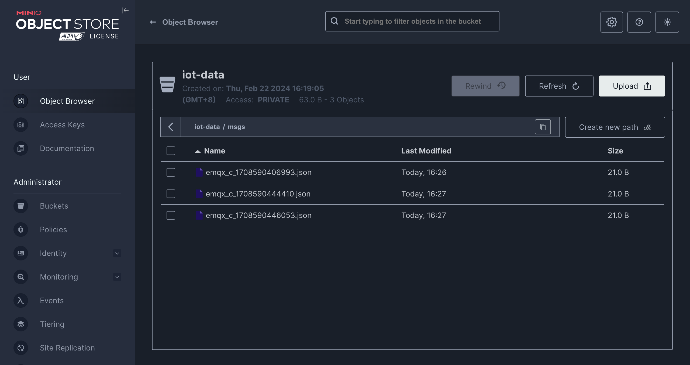

# Amazon S3へのMQTTデータ取り込み
[Amazon S3](https://aws.amazon.com/s3/) は、高い信頼性、安定性、セキュリティを備えたインターネットベースのストレージサービスであり、迅速なデプロイと使いやすさが特徴です。EMQXはMQTTメッセージを効率的にAmazon S3バケットに保存することができ、柔軟なIoTデータストレージ機能を実現します。

本ページでは、EMQXとAmazon S3のデータ連携について詳しく紹介し、ルールおよびSinkの作成方法を実践的に解説します。

:::tip

EMQXはAmazon S3以外にも、S3プロトコルをサポートする以下のストレージサービスに対応しています：

- [MinIO](https://min.io/)：MinIOは高性能な分散オブジェクトストレージシステムです。Amazon S3 API互換のオープンソースオブジェクトストレージサーバーで、プライベートクラウド構築に適しています。
- [Google Cloud Storage](https://cloud.google.com/storage)：Google Cloud StorageはGoogle Cloudの統合オブジェクトストレージで、大量データの保存に対応し、Amazon S3互換のインターフェースを提供します。

用途やビジネスニーズに応じて適切なストレージサービスを選択してください。

:::

## 動作概要

EMQXのAmazon S3データ連携はすぐに使える機能で、複雑なビジネス開発にも簡単に設定可能です。典型的なIoTアプリケーションでは、EMQXがデバイス接続およびメッセージ伝送を担うIoTプラットフォームとして機能し、Amazon S3がメッセージデータの保存プラットフォームとして役割を果たします。



EMQXはルールエンジンとSinkを利用してデバイスのイベントやデータをAmazon S3へ転送します。アプリケーションはAmazon S3からデータを読み込み、さらなるデータ活用を行います。具体的なワークフローは以下の通りです：

1. **デバイスのEMQX接続**：IoTデバイスはMQTTプロトコルで接続成功時にオンラインイベントを発生させます。イベントにはデバイスID、送信元IPアドレスなどの情報が含まれます。
2. **デバイスメッセージのパブリッシュと受信**：デバイスは特定のトピックを通じてテレメトリやステータスデータをパブリッシュします。EMQXはメッセージを受信し、ルールエンジン内で照合します。
3. **ルールエンジンによるメッセージ処理**：組み込みのルールエンジンはトピックマッチングに基づき特定のソースからのメッセージやイベントを処理します。対応するルールをマッチングし、データフォーマット変換、特定情報のフィルタリング、コンテキスト情報の付加などを行います。
4. **Amazon S3への書き込み**：ルールがトリガーされると、メッセージをS3に書き込むアクションが実行されます。Amazon S3 Sinkを使用して処理結果からデータを抽出しS3へ送信します。メッセージはテキストまたはバイナリ形式で保存可能で、複数行の構造化データを単一のCSVまたはJSON Linesファイルにまとめることもできます。これはメッセージ内容やSinkの設定に依存します。

イベントやメッセージデータがAmazon S3に書き込まれた後は、Amazon S3に接続してデータを読み込み、以下のような柔軟なアプリケーション開発が可能です：

- データアーカイブ：デバイスメッセージをAmazon S3のオブジェクトとして長期保存し、コンプライアンス要件やビジネスニーズに対応。
- データ分析：S3のデータをSnowflakeなどの分析サービスに取り込み、予知保全やデバイス効率評価などのデータ分析に活用。

## 特長と利点

EMQXのAmazon S3データ連携を利用することで、以下の特長と利点をビジネスにもたらせます：

- **メッセージ変換**：メッセージはEMQXルール内で多様な処理・変換が可能で、Amazon S3への書き込み前に適切な形に整形でき、後続の保存や利用が容易になります。
- **柔軟なデータ操作**：S3 Sinkを使うことで、特定のデータフィールドだけをAmazon S3バケットに書き込むことができ、バケットやオブジェクトキーの動的設定にも対応し柔軟なデータ保存が可能です。
- **統合されたビジネスプロセス**：S3 SinkによりデバイスデータをAmazon S3の豊富なエコシステムと組み合わせられ、データ分析やアーカイブなど多様なビジネスシナリオを実現します。
- **低コストの長期保存**：データベースと比較して、Amazon S3は高可用性・高信頼性かつコスト効率の良いオブジェクトストレージを提供し、長期保存に適しています。

これらの特長により、効率的で信頼性が高くスケーラブルなIoTアプリケーションを構築し、ビジネスの意思決定や最適化に役立てられます。

## はじめる前に

ここでは、EMQXでAmazon S3 Sinkを作成する前に必要な準備について説明します。

### 前提条件

- [ルール](./rules.md)の理解
- [データ連携](./data-bridges.md)の理解

### S3バケットの準備

EMQXはAmazon S3およびその他のS3互換ストレージサービスをサポートしています。AWSクラウドサービスを利用するか、DockerでMinIOインスタンスを展開できます。

:::: tabs

::: tab Amazon S3

1. [AWS S3コンソール](https://console.amazonaws.cn/s3/home)で、**Create bucket**ボタンをクリックします。バケット名やリージョンなどの必要情報を入力してS3バケットを作成します。詳細な操作は[AWSドキュメント](https://docs.amazonaws.cn/AmazonS3/latest/userguide/creating-bucket.html)を参照してください。
2. バケットの権限設定。バケット作成後、対象バケットを選択し**Permissions**タブをクリックします。用途に応じてパブリック読み書き、プライベートなどの権限を設定できます。
3. アクセスキーの取得。AWSコンソールで**IAM**サービスを検索・選択し、S3用の新規ユーザーを作成してAccess KeyとSecret Keyを取得します。

Amazon S3バケットが作成・設定できたら、EMQXでAmazon S3 Sinkを作成する準備が整いました。

:::

::: tab MinIO

1. DockerでMinIOをインストール・起動します：

   ```bash
   docker run \
      -p 9000:9000 \
      -p 9001:9001 \
      --name minio \
      -e "MINIO_ROOT_USER=admin" \
      -e "MINIO_ROOT_PASSWORD=MyMinIOPassword" \
      minio/minio:RELEASE.2024-02-17T01-15-57Z.fips \
      server /data --console-address ":9001"
   ```

   ポート`9000`はS3 API用、`9001`はMinIO管理インターフェース用です。

   起動後、ブラウザで`http://localhost:9001`にアクセスし、ログイン情報`admin`と`MyMinIOPassword`でMinIOコンソールに入れます。

2. バケット作成。MinIOコンソールで**Administrator** -> **Buckets**に移動し、右上の**Create Bucket +**ボタンをクリック、`iot-data`を入力して**Create Bucket**を押し、バケットを作成します。

3. アクセスキー作成。MinIOコンソールで**User** -> **Access Keys**に移動し、右上の**Create access key +**ボタンをクリック、Access KeyとSecret Keyを入力して**Create**を押し、アクセスキーを作成します。

MinIOのインストールと設定が完了したら、EMQXでAmazon S3 Sinkを作成する準備が整いました。

:::

::::

## コネクターの作成

S3 Sinkを追加する前に、対応するコネクターを作成する必要があります。

1. ダッシュボードの **Integration** -> **Connector** ページに移動します。
2. 右上の **Create** ボタンをクリックします。
3. コネクタータイプとして **Amazon S3** を選択し、次へ進みます。
4. コネクター名を入力します。英数字の組み合わせで、ここでは `my-s3` と入力します。
5. 接続情報を入力します。
   - Amazon S3バケットを使用する場合は以下を入力します：
     - **Host**：リージョンによって異なり、`s3.{region}.amazonaws.com` の形式です。
     - **Port**：`443` を入力します。
     - **Access Key ID** と **Secret Access Key**：AWSで作成したアクセスキーを入力します。
   - MinIOを使用する場合は以下を入力します：
     - **Host**：`127.0.0.1` を入力します。リモートでMinIOを実行している場合は実際のホストアドレスを入力してください。
     - **Port**：`9000` を入力します。
     - **Access Key ID** と **Secret Access Key**：MinIOで作成したアクセスキーを入力します。
6. 残りの設定はデフォルト値のままにします。
7. **Create**をクリックする前に、**Test Connectivity**を押してコネクターがS3サービスに接続できるかテストできます。
8. 下部の **Create** ボタンをクリックしてコネクター作成を完了します。

これでコネクター作成が完了し、次にS3サービスへ書き込むデータを指定するルールとSinkの作成に進みます。

## Amazon S3 Sinkを使ったルールの作成

ここでは、EMQXでソースMQTTトピック`t/#`からのメッセージを処理し、処理結果をS3の`iot-data`バケットに書き込むルールの作成手順を示します。

1. ダッシュボードの **Integration** -> **Rules** ページに移動します。

2. 右上の **Create** ボタンをクリックします。

3. ルールIDに `my_rule` を入力し、SQLエディターに以下のルールSQLを入力します：

   ```sql
   SELECT
     *
   FROM
       "t/#"
   ```

   ::: tip

   SQLに不慣れな場合は、**SQL Examples**や**Enable Debug**をクリックしてルールSQLの学習や結果のテストが可能です。

   :::

4. アクションを追加し、**Action Type**ドロップダウンから`Amazon S3`を選択します。アクションのドロップダウンはデフォルトの`create action`のままにするか、既存のAmazon S3アクションを選択できます。ここでは新しいSinkを作成してルールに追加します。

5. Sinkの名前と説明を入力します。

6. 先ほど作成した`my-s3`コネクターをコネクタードロップダウンから選択します。ドロップダウン横の作成ボタンを押すとポップアップで新規コネクターを素早く作成できます。必要な設定パラメータは[コネクターの作成](#コネクターの作成)を参照してください。

7. **Bucket**に`iot-data`を入力します。このフィールドは`${var}`形式のプレースホルダーもサポートしますが、対応する名前のバケットが事前にS3に作成されている必要があります。

8. 必要に応じて**ACL**を選択し、アップロードされるオブジェクトのアクセス権限を指定します。

9. **Upload Method**を選択します。2つの方法の違いは以下の通りです：

   - **Direct Upload**：ルールがトリガーされるたびに、設定済みのオブジェクトキーと内容に従ってデータを直接S3にアップロードします。バイナリや大きなテキストデータの保存に適していますが、多数のファイルが生成される可能性があります。
   - **Aggregated Upload**：複数のルールトリガーの結果を1つのファイル（CSVなど）にまとめてS3にアップロードします。構造化データの保存に適し、ファイル数を減らし書き込み効率を向上させます。

   選択した方法により設定項目が異なります。以下の通り設定してください：

   :::: tabs type

   ::: tab Direct Upload

   Direct Uploadでは以下の項目を設定します：

   - **Object Key**：バケット内のオブジェクトの保存場所を定義します。`${var}`形式のプレースホルダーをサポートし、`/`でディレクトリ指定も可能です。管理や識別のためにオブジェクトのサフィックスも設定します。ここでは`msgs/${clientid}_${timestamp}.json`と入力します。`${clientid}`はクライアントID、`${timestamp}`はメッセージのタイムスタンプで、各デバイスのメッセージを別オブジェクトに書き込みます。
   - **Object Content**：デフォルトは全フィールドを含むJSONテキスト形式です。`${var}`形式のプレースホルダーをサポートします。ここでは`${payload}`を入力し、メッセージ本文をオブジェクト内容として使用します。オブジェクトの保存形式はメッセージ本文の形式に依存し、圧縮ファイルや画像、その他バイナリ形式もサポートします。

   :::

   ::: tab Aggregate Upload

   Aggregate Uploadでは以下のパラメータを設定します：

   - **Object Key**：オブジェクトの保存パスを指定します。以下の変数が使用可能です：

     - **`${action}`**：アクション名（必須）
     - **`${node}`**：アップロードを行うEMQXノード名（必須）
     - **`${datetime.{format}}`**：集約開始日時。`{format}`でフォーマットを指定（必須）：
       - **`${datetime.rfc3339utc}`**：UTC形式のRFC3339日時
       - **`${datetime.rfc3339}`**：ローカルタイムゾーン形式のRFC3339日時
       - **`${datetime.unix}`**：Unixタイムスタンプ
     - **`${datetime_until.{format}}`**：集約終了日時。フォーマットは上記と同様
     - **`${sequence}`**：同一時間間隔内の集約アップロードのシーケンス番号（必須）

     必須とされるプレースホルダーがテンプレートに含まれていない場合、自動的にS3オブジェクトキーのパスサフィックスとして追加され、重複を避けます。その他のプレースホルダーは無効とみなされます。

   - **Aggregation Type**：現在CSVとJSON Linesをサポートしています。
      - `CSV`：カンマ区切りのCSV形式でS3に書き込みます。
      - `JSON Lines`：[JSON Lines](https://jsonlines.org/)形式でS3に書き込みます。

   - **Column Order**（Aggregation Typeが`CSV`の場合のみ適用）：ドロップダウンでルール結果のカラム順序を調整可能です。生成されるCSVファイルは選択したカラムで先にソートされ、未選択カラムはアルファベット順に続きます。

   - **Max Records**：最大レコード数に達すると1ファイルの集約が完了しアップロードされ、時間間隔がリセットされます。

   - **Time Interval**：時間間隔に達すると、最大レコード数に達していなくても1ファイルの集約が完了しアップロードされ、最大レコード数がリセットされます。

   :::

   ::::

10. **Object Content**を設定します。デフォルトは全フィールドを含むJSONテキスト形式で、`${var}`形式のプレースホルダーをサポートします。ここでは`${payload}`を入力し、メッセージ本文をオブジェクト内容として使用します。この場合、オブジェクトの保存形式はメッセージ本文の形式に依存し、圧縮ファイルや画像、その他バイナリ形式もサポートします。

11. **フォールバックアクション（任意）**：メッセージ配信失敗時の信頼性向上のため、1つ以上のフォールバックアクションを定義できます。プライマリSinkがメッセージ処理に失敗した場合にこれらのアクションがトリガーされます。詳細は[フォールバックアクション](./data-bridges.md#fallback-actions)を参照してください。

12. **詳細設定**を展開し、必要に応じて高度な設定オプションを構成します（任意）。詳細は[詳細設定](#advanced-settings)を参照してください。

13. 残りの設定はデフォルト値のままにし、**Create**ボタンをクリックしてSink作成を完了します。作成成功後、ルール作成画面に戻り、新しいSinkがルールアクションに追加されます。

14. ルール作成画面で**Create**ボタンをクリックし、ルール作成全体を完了します。

これでルールの作成が完了しました。**Rules**ページで新規作成したルールを確認でき、**Actions (Sink)**タブで新しいS3 Sinkも確認できます。

また、**Integration** -> **Flow Designer**をクリックするとトポロジーが表示され、トピック`t/#`のメッセージがルール`my_rule`で解析されS3に書き込まれる流れを視覚的に確認できます。

## ルールのテスト

ここでは、Direct Upload方式で設定したルールのテスト方法を示します。

MQTTXを使ってトピック`t/1`にメッセージをパブリッシュします：

```bash
mqttx pub -i emqx_c -t t/1 -m '{ "msg": "hello S3" }'
```

数件メッセージを送信した後、MinIOコンソールまたはAmazon S3コンソールにアクセスして結果を確認します。

:::: tabs

::: tab Amazon S3コンソール

AWSマネジメントコンソールにログインし、Amazon S3コンソールを開きます：<https://console.aws.amazon.com/s3/>

バケット一覧から`iot-data`バケットを選択して中に入り、オブジェクト一覧で先ほどパブリッシュしたメッセージが`msg`オブジェクトとして正常に書き込まれていることを確認できます。オブジェクト横のチェックボックスを選択し、**Download**を選んでローカルにダウンロードし内容を閲覧可能です。

:::

::: tab MinIOコンソール

`iot-data`バケットを開きます。パブリッシュしたメッセージがMinIOの`msgs`ディレクトリに正常に書き込まれていることが確認できます：



:::

::::

## 詳細設定

ここではS3 Sinkの高度な設定オプションについて説明します。ダッシュボードでSinkを設定する際、**Advanced Settings**を展開し、用途に応じて以下のパラメータを調整できます。

| 項目名                     | 説明                                                                                                         | デフォルト値   |
| -------------------------- | ------------------------------------------------------------------------------------------------------------ | -------------- |
| **Buffer Pool Size**       | EMQXとS3間のデータフローを管理するバッファワーカープロセスの数を指定します。これらのワーカーはデータを一時的に保持・処理し、ターゲットサービスへ送信します。パフォーマンス最適化とスムーズなデータ送信に重要です。 | `16`           |
| **Request TTL**            | バッファに入ったリクエストが有効とみなされる最大時間（秒）を指定します。リクエストはバッファに入った時点からTTLがカウントされ、TTLを超えるか、S3からの応答やアックがタイムリーに得られない場合、リクエストは期限切れとみなされます。 |                |
| **Health Check Interval**  | SinkがS3との接続状態を自動的にヘルスチェックする間隔（秒）を指定します。                                         | `15`           |
| **Max Buffer Queue Size**  | S3 Sinkの各バッファワーカーがバッファリングできる最大バイト数を指定します。バッファワーカーはデータを一時的に保持し、効率的にデータストリームを処理します。システム性能やデータ送信要件に応じて調整してください。 | `256`          |
| **Query Mode**             | 同期（`synchronous`）または非同期（`asynchronous`）のリクエストモードを選択し、メッセージ送信を最適化します。非同期モードではS3への書き込みがMQTTメッセージのパブリッシュ処理をブロックしませんが、クライアントがメッセージをS3到達前に受信する可能性があります。 | `Asynchronous` |
| **In-flight Window**       | 「インフライトキューリクエスト」とは、送信済みで応答やアックをまだ受け取っていないリクエストを指します。この設定はSinkとS3間の通信で同時に存在可能なインフライトリクエストの最大数を制御します。<br/>**Request Mode**が`asynchronous`の場合、同一MQTTクライアントからのメッセージを厳密に順序処理する必要がある場合は、この値を`1`に設定してください。 | `100`          |
| **Min Part Size**          | 集約完了後のパートアップロードの最小チャンクサイズです。アップロード対象データはこのサイズに達するまでメモリに蓄積されます。 | `5MB`          |
| **Max Part Size**          | パートアップロードの最大チャンクサイズです。S3 Sinkはこのサイズを超えるパートのアップロードを試みません。                         | `5GB`          |
