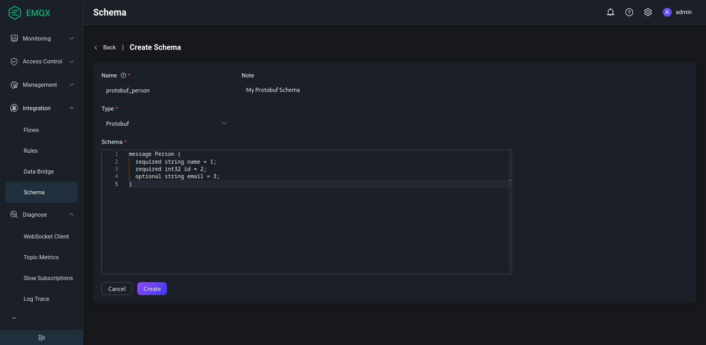

# Schema Registry Example - Protobuf

このページでは、スキーマレジストリとルールエンジンがProtobuf形式のメッセージのエンコードおよびデコードをどのようにサポートするかを示します。

## デコードシナリオ

デバイスがProtobufでエンコードされたバイナリメッセージをパブリッシュし、そのメッセージをルールエンジンでマッチングして、`name`フィールドに対応するトピックに再パブリッシュする必要があります。トピックの形式は `person/${name}` です。

例えば、`name`フィールドが"Shawn"のメッセージをトピック `person/Shawn` に再パブリッシュします。

### スキーマの作成

1. ダッシュボードで、左のナビゲーションメニューから **Integration** -> **Schema** を選択します。

2. 以下のパラメータでProtobufスキーマを作成します：

   - **Name**: `protobuf_person`

   - **Type**: `Protobuf`

   - **Schema**:

     ```protobuf
     message Person {
       required string name = 1;
       required int32 id = 2;
       optional string email = 3;
     }
     ```

3. **Create** をクリックします。



### ルールの作成

1. ダッシュボードで、ナビゲーションメニューから **Integration** -> **Rules** を選択します。

2. **Rules** ページの右上にある **Create** をクリックします。

3. 先ほど作成したスキーマを使って、以下のルールSQL文を記述します：

   ```sql
   SELECT
     schema_decode('protobuf_person', payload, 'Person') as person, payload
   FROM
     "t/#"
   WHERE
     person.name = 'Shawn'
   ```

   ここで重要なのは `schema_decode('protobuf_person', payload, 'Person')` の部分です：

   - `schema_decode` 関数は、`protobuf_person` スキーマに従ってペイロードの内容をデコードします。
   - `as person` はデコードされた値を変数 `person` に格納します。
   - 最後の引数 `Person` は、ペイロード内のメッセージタイプがProtobufスキーマで定義された `Person` 型であることを指定します。

4. **Add Action** をクリックし、**Action** フィールドのドロップダウンリストから `Republish` を選択します。

5. **Topic** フィールドに、送信先トピックとして `person/${person.name}` と入力します。

6. **Payload** フィールドに、メッセージ内容テンプレートとして `${person}` と入力します。

このアクションにより、デコードされた "person" メッセージがJSON形式でトピック `person/${person.name}` に送信されます。`${person.name}` は変数プレースホルダーで、実行時にデコードされたメッセージの `name` フィールドの値に置き換えられます。

### デバイス側コードの準備

ルールを作成したら、テスト用のデータをシミュレートできます。

以下のコードはPython言語を使用してユーザーメッセージを作成し、バイナリデータにエンコードしてからトピック `t/1` に送信します。詳細は[フルコード](https://gist.github.com/thalesmg/3c5fdbae2843d63c2380886e69d6123c)を参照してください。

```python
def publish_msg(client):
    p = person_pb2.Person()
    p.id = 1
    p.name = "Shawn"
    p.email = "shawn@example.com"
    message = p.SerializeToString()
    topic = "t/1"
    print("publish to topic: t/1, payload:", message)
    client.publish(topic, payload=message, qos=0, retain=False)
```

### ルール実行結果の確認

1) ダッシュボードで、**Diagnose** -> **WebSocket Client** を選択します。

2) 現在のEMQXインスタンスの接続情報を入力します。
   - EMQXをローカルで実行している場合は、デフォルト値を使用できます。
   - 認証設定などEMQXのデフォルト設定を変更している場合は、ユーザー名とパスワードの入力が必要になることがあります。

3. **Connect** をクリックして、EMQXインスタンスにMQTTクライアントとして接続します。

4. **Subscription** エリアの **Topic** フィールドに `person/#` と入力し、**Subscribe** をクリックします。

5. Pythonの依存関係をインストールし、デバイス側コードを実行します：

   ```shell
   $ pip3 install protobuf paho-mqtt
   $ protoc --python_out=. person.proto

   $ python3 protobuf_mqtt.py
   Connected with result code 0
   publish to topic: t/1, payload: b'\n\x05Shawn\x10\x01\x1a\x11shawn@example.com'
   ```

6. WebSocket側でトピック `person/Shawn` のメッセージが受信されていることを確認します：

   ```json
   {"name":"Shawn","id":1,"email":"shawn@example.com"}
   ```

## エンコードシナリオ

デバイスがトピック `protobuf_out` をサブスクライブし、Protobufでエンコードされたバイナリメッセージを受信することを期待しています。ルールエンジンを使ってそのようなメッセージをエンコードし、関連するトピックにパブリッシュします。

### スキーマの作成

[デコードシナリオ](#デコードシナリオ)で説明したのと同じスキーマを使用します。

### ルールの作成

1. ダッシュボードで、ナビゲーションメニューから **Integration** -> **Rules** を選択します。

2. **Rules** ページの右上にある **Create** をクリックします。

3. 先ほど作成したスキーマを使って、以下のルールSQL文を記述します：

   ```sql
   SELECT
     schema_encode('protobuf_person', json_decode(payload), 'Person') as protobuf_person
   FROM
     "protobuf_in"
   ```

   ここで重要なのは `schema_encode('protobuf_person', json_decode(payload), 'Person')` の部分です：

   - `schema_encode` 関数は、`protobuf_person` スキーマに従ってペイロードの内容をエンコードします。
   - `as protobuf_person` はエンコードされた値を変数 `protobuf_person` に格納します。
   - 最後の引数 `Person` は、ペイロード内のメッセージタイプがProtobufスキーマで定義された `Person` 型であることを指定します。
   - `json_decode(payload)` は、ペイロードが一般的にJSONエンコードされたバイナリであるため、`schema_encode` の入力としてMap型が必要なために使用します。

4. **Add Action** をクリックし、**Action** フィールドのドロップダウンリストから `Republish` を選択します。

5. **Topic** フィールドに、送信先トピックとして `protobuf_out` と入力します。

6. **Payload** フィールドに、メッセージ内容テンプレートとして `${protobuf_person}` と入力します。

このアクションにより、Protobufでエンコードされたユーザーメッセージがトピック `protobuf_out` に送信されます。`${protobuf_person}` は変数プレースホルダーで、実行時に `schema_encode` の結果（バイナリ値）に置き換えられます。

### デバイス側コードの準備

ルールを作成したら、テスト用のデータをシミュレートできます。

以下のコードはPython言語を使用してユーザーメッセージを作成し、バイナリデータを解析してトピック `protobuf_in` から受信したメッセージを処理します。詳細は[フルコード](https://gist.github.com/thalesmg/c5f03f99f982401d16ef6583e30144fa)を参照してください。

```python
def on_message(client, userdata, msg):
    print("msg payload", msg.payload)
    p = person_pb2.Person()
    p.ParseFromString(msg.payload)
    print(msg.topic+" "+str(p))
```

### ルール実行結果の確認

1) ダッシュボードで、**Diagnose** -> **WebSocket Client** を選択します。

2) 現在のEMQXインスタンスの接続情報を入力します。
   - EMQXをローカルで実行している場合は、デフォルト値を使用できます。
   - 認証設定などEMQXのデフォルト設定を変更している場合は、ユーザー名とパスワードの入力が必要になることがあります。

3. **Connect** をクリックして、EMQXインスタンスにMQTTクライアントとして接続します。

4. **Publish** エリアの **Topic** フィールドに `protobuf_in` と入力し、**Payload** フィールドに以下のメッセージを入力します：

   ```json
   {"name":"Shawn","id":1,"email":"shawn@example.com"}
   ```

5. **Publish** をクリックします。

6. Pythonの依存関係をインストールし、デバイス側コードを実行します：

   ```shell
   $ pip3 install protobuf paho-mqtt
   
   $ python3 protobuf_mqtt_sub.py
   Connected with result code 0
   msg payload b'\n\x05Shawn\x10\x01\x1a\x11shawn@example.com'
   protobuf_out name: "Shawn"
   id: 1
   email: "shawn@example.com"
   ```
