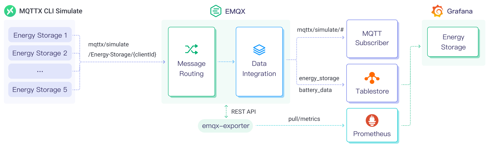
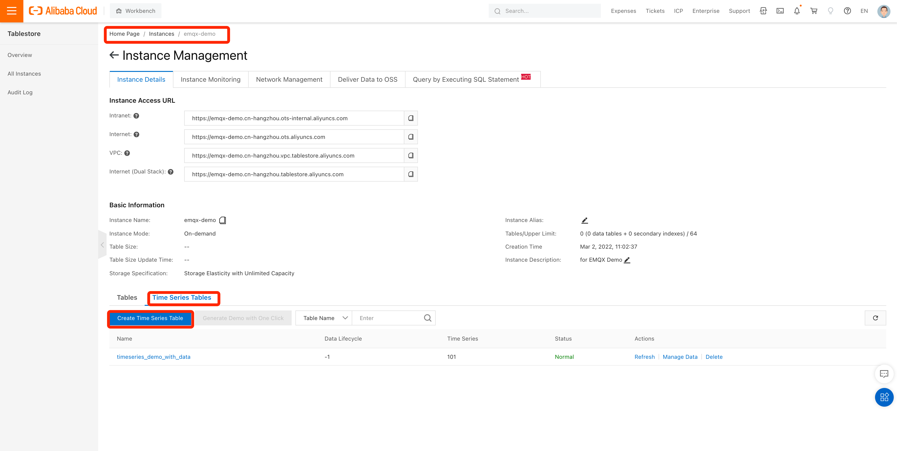
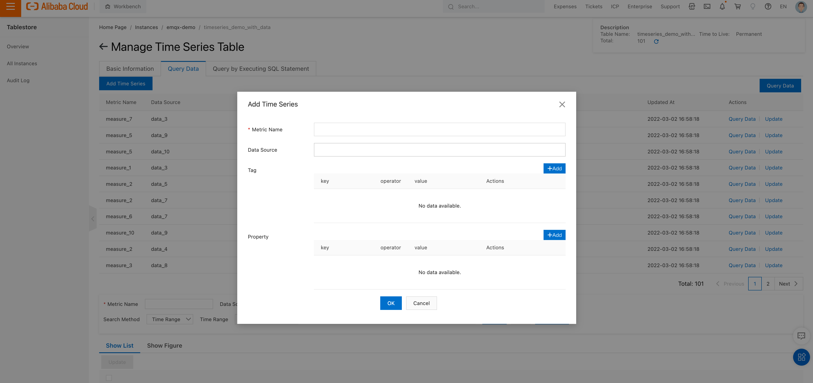

# MQTTデータをTablestoreに取り込む

<<<<<<< HEAD
[Tablestore](https://www.alibabacloud.com/en/product/table-store/pricing?spm=a3c0i.29367734.6737026690.8.78847d3fcEhuVv&_p_lc=1)は、IoTシナリオに最適化されたスケーラブルでサーバーレスなデータベースです。時系列データ、構造化データ、半構造化データを管理するためのワンストップソリューションであるIoTstoreを提供しています。IoT、車載ネットワーク、リスクコントロール、メッセージング、レコメンデーションシステムなどのシナリオに最適です。Tablestoreはコスト効率が高く、高性能なデータストレージを提供し、ミリ秒単位のクエリや検索、柔軟なデータ分析機能を備えています。EMQXはTablestore Cloud、Tablestore OSS、Tablestore Enterpriseとシームレスに統合し、IoTユースケースにおける効率的なデータ管理を可能にします。

## 動作概要

EMQXにおけるTablestoreデータ統合は、EMQXのリアルタイムデータキャプチャおよび転送機能と、Tablestoreの高性能なデータストレージおよび分析機能を組み合わせたものです。組み込みの[ルールエンジン](./rules.md)を活用することで、EMQXからTablestoreへのデータ取り込みと保存のプロセスを簡素化し、複雑なコーディングを不要にします。EMQXはルールエンジンとSinkを介してIoTデバイスのデータをTablestoreに転送し、効率的な保存と分析を実現します。
=======
[Tablestore](https://www.alibabacloud.com/en/product/table-store/pricing?spm=a3c0i.29367734.6737026690.8.78847d3fcEhuVv&_p_lc=1)は、IoTシナリオに最適化されたスケーラブルでサーバーレスなデータベースです。時系列データ、構造化データ、半構造化データを管理するためのワンストップソリューションであるIoTstoreを提供しています。IoT、車載ネットワーク、リスク管理、メッセージング、レコメンデーションシステムなどのシナリオに最適です。Tablestoreはコスト効率に優れ、高性能なデータストレージを提供し、ミリ秒単位のクエリや取得、柔軟なデータ分析機能を備えています。EMQXはTablestore Cloud、Tablestore OSS、Tablestore Enterpriseとシームレスに統合し、IoTユースケースにおける効率的なデータ管理を可能にします。

## 動作概要

EMQXにおけるTablestoreのデータ統合は、EMQXのリアルタイムデータキャプチャおよび送信機能と、Tablestoreの高性能なデータストレージ・分析機能を組み合わせています。組み込みの[ルールエンジン](./rules.md)を活用することで、EMQXからTablestoreへのデータ取り込みと保存のプロセスを簡素化し、複雑なコーディングを不要にします。EMQXはルールエンジンとSinkを通じてIoTデバイスのデータをTablestoreに転送し、効率的な保存と分析を実現します。
>>>>>>> origin/release-6.1

データが保存されると、Tablestoreはレポートやチャート、その他の可視化を生成する強力なツールを提供し、Tablestoreの可視化機能を通じてユーザーに提示されます。

以下の図は、エネルギー貯蔵シナリオにおけるEMQXとTablestore間の典型的なデータ統合アーキテクチャを示しています。



<<<<<<< HEAD
EMQXとTablestoreは、エネルギー消費データをリアルタイムに効率的に収集・分析するための拡張可能なIoTプラットフォームを提供します。このアーキテクチャでは、EMQXがデバイスのアクセス、メッセージの送受信、データのルーティングを担当するIoTプラットフォームとして機能し、Tablestoreがデータの保存および分析プラットフォームとして機能します。ワークフローは以下の通りです。

1. **メッセージのパブリッシュと受信**：エネルギー貯蔵装置や産業用IoTデバイスはMQTTプロトコルを通じてEMQXに正常に接続し、電力消費量、入出力電力などの情報を含むエネルギー消費データを定期的にMQTTプロトコルでパブリッシュします。EMQXがこれらのメッセージを受信すると、ルールエンジン内でマッチング処理を開始します。  
2. **メッセージデータの処理**：組み込みのルールエンジンを使用して、特定のソースからのメッセージをトピックマッチングに基づいて処理できます。メッセージが到着すると、ルールエンジンを通過し、対応するルールとマッチングしてメッセージデータを処理します。例えば、データ形式の変換、特定情報のフィルタリング、メッセージへのコンテキスト情報の付加などです。
3. **Tablestoreへのデータ取り込み**：ルールエンジンで定義されたルールがトリガーとなり、メッセージをTablestoreに書き込む操作が実行されます。Tablestore Sinkは設定可能なフィールドを提供し、書き込むデータ形式を柔軟に定義でき、メッセージの特定フィールドをTablestoreの対応するメジャメントやフィールドにマッピングします。
=======
EMQXとTablestoreは、エネルギー消費データをリアルタイムに効率的に収集・分析するための拡張可能なIoTプラットフォームを提供します。このアーキテクチャでは、EMQXがデバイスのアクセス、メッセージ送信、データルーティングを担当するIoTプラットフォームとして機能し、Tablestoreがデータストレージおよび分析プラットフォームとしてデータの保存と分析を担当します。ワークフローは以下の通りです：

1. **メッセージのパブリッシュと受信**：エネルギー貯蔵デバイスや産業用IoTデバイスはMQTTプロトコルを通じてEMQXに正常に接続し、電力消費量、入出力電力などの情報を含むエネルギー消費データを定期的にMQTTプロトコルでパブリッシュします。EMQXがこれらのメッセージを受信すると、ルールエンジン内でマッチング処理を開始します。  
2. **メッセージデータの処理**：組み込みのルールエンジンを使用して、特定のソースからのメッセージをトピックマッチングに基づいて処理できます。メッセージが到着すると、ルールエンジンを通過し、対応するルールとマッチングしてメッセージデータを処理します。例えば、データフォーマットの変換、特定情報のフィルタリング、文脈情報でのメッセージの拡充などです。
3. **Tablestoreへのデータ取り込み**：ルールエンジンで定義されたルールがメッセージをTablestoreに書き込む操作をトリガーします。Tablestore Sinkは設定可能なフィールドを提供し、書き込むデータフォーマットを柔軟に定義でき、メッセージの特定フィールドをTablestoreの対応するメジャメントやフィールドにマッピングします。
>>>>>>> origin/release-6.1

エネルギー消費データがTablestoreに書き込まれた後、以下のような分析が可能です：

- Grafanaなどの可視化ツールに接続し、データに基づくチャートを生成してエネルギー貯蔵データを表示する。
<<<<<<< HEAD
- ビジネスシステムに接続し、エネルギー貯蔵装置の状態監視やアラートを実施する。
=======
- ビジネスシステムに接続し、エネルギー貯蔵デバイスの状態監視やアラートを行う。
>>>>>>> origin/release-6.1

## 特長と利点

Tablestoreデータ統合は以下の特長と利点を提供します：

<<<<<<< HEAD
- **効率的なデータ処理**：EMQXは大量のIoTデバイス接続とメッセージスループットを処理でき、Tablestoreはデータ書き込み、保存、クエリに優れた性能を発揮します。IoTシナリオのデータ処理ニーズを満たしつつ、システムに過度な負荷をかけません。
- **メッセージ変換**：メッセージはEMQXのルールを通じて広範な処理や変換が可能であり、Tablestoreへの書き込み前に適切に整形できます。
- **スケーラビリティ**：EMQXとTablestoreはどちらもクラスター拡張に対応しており、ビジネスの成長に応じて柔軟に水平拡張が可能です。
- **豊富なクエリ機能**：Tablestoreは最適化された関数、演算子、インデックス技術を備え、時系列データの効率的なクエリと分析を実現し、IoT時系列データから価値ある洞察を正確に抽出します。
- **効率的なストレージ**：Tablestoreは高圧縮率のエンコード方式を採用し、ストレージコストを大幅に削減します。また、異なるデータタイプごとに保存期間をカスタマイズでき、不必要なデータがストレージを占有するのを防ぎます。

## はじめる前に

このセクションでは、Tablestoreデータ統合の作成を開始する前に必要な準備、データベースインスタンスの作成や時系列テーブルの作成・管理について説明します。

::: tip

現在、Tablestoreとのデータ統合はTimeSeriesモデルのみをサポートしています。そのため、以下の手順はTimeSeriesモデルを対象としています。
=======
- **効率的なデータ処理**：EMQXは大量のIoTデバイス接続とメッセージスループットを処理でき、Tablestoreはデータの書き込み、保存、クエリに優れた性能を発揮します。IoTシナリオのデータ処理ニーズを満たしつつ、システムに過度な負荷をかけません。
- **メッセージ変換**：メッセージはEMQXのルールを通じて大規模な処理や変換を経てからTablestoreに書き込まれます。
- **スケーラビリティ**：EMQXとTablestoreはどちらもクラスターのスケールアウトが可能で、ビジネスの成長に応じて柔軟に水平拡張できます。
- **豊富なクエリ機能**：Tablestoreは最適化された関数、演算子、インデックス技術を提供し、タイムスタンプ付きデータの効率的なクエリと分析を可能にし、IoTの時系列データから価値ある洞察を正確に抽出します。
- **効率的なストレージ**：Tablestoreは高圧縮率のエンコーディング方式を採用し、ストレージコストを大幅に削減します。また、データタイプごとに保存期間をカスタマイズでき、不要なデータがストレージを占有するのを防ぎます。

## はじめる前に

このセクションでは、Tablestoreデータ統合の作成を開始する前に必要な準備について説明します。データベースインスタンスの作成や時系列テーブルの作成・管理が含まれます。

::: tip

現在、Tablestoreとのデータ統合はTimeSeriesモデルのみをサポートしています。したがって、以下の手順はTimeSeriesモデルに焦点を当てています。
>>>>>>> origin/release-6.1

:::

### 前提条件

<<<<<<< HEAD
以下を事前にご確認ください。

- EMQXデータ統合の[ルール](./rules.md)に関する理解。
- EMQXにおける[データ統合](./data-bridges.md)の仕組みの知識。
=======
進める前に以下を確認してください：

- EMQXのデータ統合[ルール](./rules.md)の理解
- EMQXにおける[データ統合](./data-bridges.md)の仕組みの知識
>>>>>>> origin/release-6.1

### 時系列テーブルの作成

1. [Tablestoreコンソール](https://account.alibabacloud.com/login/login.htm)にログインします。
2. 時系列モデルのインスタンスを作成します。インスタンス名を`emqx-demo`など任意に指定します。インスタンス作成の詳細は[Tablestore公式ドキュメント](https://www.alibabacloud.com/help/en/tablestore/product-overview/activate-service-and-create-a-instance)を参照してください。
3. **インスタンス管理**ページに移動します。
4. **インスタンス詳細**タブで**時系列テーブル**を選択し、**時系列テーブルの作成**ボタンをクリックします。
<<<<<<< HEAD
5. 時系列テーブル情報を設定し、テーブル名を`timeseries_demo_with_data`など任意に指定して、**確認**をクリックします。
=======
5. 時系列テーブル情報を設定し、テーブル名を`timeseries_demo_with_data`などに指定して**確認**をクリックします。
>>>>>>> origin/release-6.1



### 時系列テーブルの管理

<<<<<<< HEAD
作成した時系列テーブルを管理するには、テーブル名をクリックして**時系列テーブル管理**ページに入ります。ここから、ビジネス要件に応じて以下の操作を行えます。
=======
先ほど作成した時系列テーブルを管理するには、テーブル名をクリックして**時系列テーブルの管理**ページに入ります。ビジネス要件に応じて以下の手順を実行できます：
>>>>>>> origin/release-6.1

1. **データのクエリ**タブをクリックします。

2. **時系列の追加**をクリックします。

   ::: tip

<<<<<<< HEAD
   このステップは任意です。時系列テーブルが存在しない場合、データ書き込み時にTablestoreが自動的に作成します。そのため、本例では時系列の手動操作は示していません。
=======
   この手順は任意です。時系列テーブルがまだ存在しない場合、データ書き込み時にTablestoreが自動的に作成します。そのため、この例では時系列に対する手動操作は示していません。
>>>>>>> origin/release-6.1

   :::



## コネクターの作成

このセクションでは、SinkをTablestoreサーバーに接続するためのコネクターの作成方法を示します。

<<<<<<< HEAD
以下の手順は、EMQXとTablestoreをローカルマシンで実行していることを前提としています。リモート環境で実行している場合は設定を適宜調整してください。
=======
以下の手順はEMQXとTablestoreをローカルマシンで実行していることを前提としています。リモートで実行している場合は設定を適宜調整してください。
>>>>>>> origin/release-6.1

1. EMQXダッシュボードに入り、**Integration** -> **Connectors**をクリックします。
2. ページ右上の**Create**をクリックします。
3. **Create Connector**ページで**Tablestore**を選択し、**Next**をクリックします。
<<<<<<< HEAD
4. **Configuration**ステップで以下を設定します。
   - コネクター名を入力します。英数字の組み合わせで指定してください。例：`my_tablestore`
   - Tablestoreサーバー接続情報を入力します。
     - **Endpoint**：TablestoreインスタンスのアクセスURLを入力します。Tablestoreコンソールのインスタンス詳細ページで確認可能です。デプロイ方法に応じてURLを入力してください。例：パブリックネットワークの場合 `https://emqx-demo.cn-hangzhou.ots.aliyuncs.com`
     - **Instance Name**：接続するTablestoreインスタンス名。例：`emqx-demo`
     - **Access Key ID**：Tablestore認証に使用するAlibaba Cloud発行のAccess Key ID。
     - **Access Key Secret**：Access Key IDに対応する認証用シークレット。
     - **Storage Model Type**：現在は`TimeSeries`のみサポート。
   - TLSパラメータを設定します。TablestoreはHTTPSエンドポイントを使用するため、TLSはデフォルトで有効です。追加設定は不要です。TLS接続オプションの詳細は[外部リソースアクセスのTLS有効化](../network/overview.md#enabling-tls-for-external-resource-access)を参照してください。
5. **Create**をクリックする前に、**Test Connectivity**をクリックしてコネクターがTablestoreサーバーに接続可能かテストできます。
6. ページ下部の**Create**ボタンをクリックしてコネクター作成を完了します。ポップアップで**Back to Connector List**または**Create Rule**を選択できます。ルールとSinkを作成してTablestoreへのデータ転送を指定する場合は、[Tablestore Sink付きルールの作成](#create-a-rule-with-tablestore-sink)を参照してください。
=======
4. **Configuration**ステップで以下を設定します：
   - コネクター名を入力します。英数字の組み合わせで、例：`my_tablestore`
   - Tablestoreサーバー接続情報を入力します：
     - **Endpoint**：TablestoreインスタンスのアクセスURLを入力します。Tablestoreコンソールのインスタンス詳細ページで確認可能です。デプロイ方法に応じてURLを入力してください。例：パブリックネットワークの場合は`https://emqx-demo.cn-hangzhou.ots.aliyuncs.com`
     - **Instance Name**：接続するTablestoreインスタンス名。例：`emqx-demo`
     - **Access Key ID**：Tablestore認証に使用するAlibaba Cloud発行のアクセスキーID
     - **Access Key Secret**：アクセスキーIDに対応するシークレットキー
     - **Storage Model Type**：現在は`TimeSeries`のみサポート
   - TLSパラメータを設定します。TablestoreはHTTPSエンドポイントを使用するためTLSはデフォルトで有効であり、追加設定は不要です。TLS接続オプションの詳細は[外部リソースアクセスのTLS有効化](../network/overview.md#enabling-tls-for-external-resource-access)を参照してください。
5. **Create**をクリックする前に、**Test Connectivity**をクリックしてコネクターがTablestoreサーバーに接続できるかテストできます。
6. ページ下部の**Create**ボタンをクリックしてコネクター作成を完了します。ポップアップダイアログで**Back to Connector List**をクリックするか、**Create Rule**をクリックしてルールとSinkの作成を続行できます。詳細は[Tablestore Sinkを使ったルールの作成](#create-a-rule-with-tablestore-sink)を参照してください。
>>>>>>> origin/release-6.1

## Tablestore Sinkを使ったルールの作成

<<<<<<< HEAD
このセクションでは、EMQXでソースMQTTトピック`t/#`からのメッセージを処理し、処理結果を設定済みのSinkを通じてTablestoreに送信するルールの作成方法を説明します。

1. EMQXダッシュボードにアクセスし、左側ナビゲーションメニューの**Integration** -> **Rules**をクリックします。
=======
このセクションでは、EMQXでソースMQTTトピック`t/#`からのメッセージを処理し、設定済みのSinkを通じてTablestoreに送信するルールの作成方法を示します。

1. EMQXダッシュボードにアクセスし、左ナビゲーションメニューから**Integration** -> **Rules**をクリックします。
>>>>>>> origin/release-6.1

2. ページ右上の**Create**をクリックします。

3. ルール作成ページで、ルールIDに`my_rule`を入力します。

<<<<<<< HEAD
4. **SQL Editor**でルールを設定します。例えば、トピック`t/#`のMQTTメッセージをTablestoreに保存したい場合、以下のSQL構文を使用します。

   ::: tip

   独自のSQL構文を指定する場合、後で設定するSinkのデータ形式に含まれるすべての変数が`SELECT`部分に含まれていることを確認してください。
=======
4. **SQL Editor**でルールを設定します。例えば、トピック`t/#`のMQTTメッセージをTablestoreに保存したい場合、以下のSQL構文を使用できます。

   ::: tip

   独自のSQL構文を指定する場合は、後で設定するSinkのデータフォーマットに含まれるすべての変数が`SELECT`部分に含まれていることを確認してください。
>>>>>>> origin/release-6.1

   :::

   ```sql
   SELECT
     *
   FROM
     "t/#"
   ```

<<<<<<< HEAD
   注：初心者の方は**SQL Examples**や**Enable Test**をクリックしてSQLルールを学習・テストできます。

5. + **Add Action**ボタンをクリックして、ルールがトリガーするアクションを定義します。このアクションにより、EMQXはルールで処理したデータをTablestoreに送信します。

6. **Type of Action**ドロップダウンから`Alibaba Tablestore`を選択します。**Action**はデフォルトの`Create Action`のままにします。既に作成済みのSinkがあれば選択も可能です。本デモでは新規Sinkを作成します。

7. Sinkの名前を入力します。英数字の組み合わせで指定してください。

8. **Connector**ドロップダウンから先ほど作成した`my_tablestore`を選択します。新規コネクターを作成する場合はドロップダウン横のボタンをクリックしてください。設定パラメータは[コネクターの作成](#create-a-connector)を参照してください。
=======
   注：初心者の場合は**SQL Examples**をクリックし、**Enable Test**でSQLルールを学習・テストできます。

5. + **Add Action**ボタンをクリックして、ルールがトリガーするアクションを定義します。このアクションにより、EMQXはルールで処理したデータをTablestoreに送信します。

6. **Type of Action**ドロップダウンリストから`Alibaba Tablestore`を選択します。**Action**はデフォルトの`Create Action`のままにします。すでに作成済みのSinkがあれば選択可能です。この例では新規にSinkを作成します。

7. Sinkの名前を入力します。英数字の組み合わせで指定してください。

8. **Connector**ドロップダウンから先ほど作成した`my_tablestore`を選択します。新規コネクターを作成するにはドロップダウン横のボタンをクリックします。設定パラメータは[コネクターの作成](#create-a-connector)を参照してください。
>>>>>>> origin/release-6.1

9. 以下のフィールドを設定します。

   - **Data Source**：EMQXがメッセージを取得するデータソース。処理対象のデータの起点を示します。特定のトピックやデータストリームを指定します。

<<<<<<< HEAD
   - **Table Name**：データを保存するTablestoreテーブル名。事前に作成したテーブル名を入力します。`${table}`などの変数を使って動的に割り当てることも可能です。

   - **Measurement**：Tablestoreで使用されるメジャメント名で、通常は論理的なデータのグループやカテゴリを示します。例：`temperature_readings`や`sensor_data`。`${measurement}`などの変数も使用可能です。

   - **Storage Model Type**：Tablestoreで使用するデータストレージモデルの種類。現在は時系列データに最適化された`timeseries`のみサポート。

   - **Tags**：Tablestoreの各データエントリに関連付けるキーと値のペア。メタデータやラベルとして利用し、クエリやフィルタリングを容易にします。**Add**をクリックして複数のタグを定義可能です。例：
=======
   - **Table Name**：データを保存するTablestoreのテーブル名。先ほど作成したテーブル名を入力します。`${table}`のような変数を使って動的にテーブル名を割り当てることも可能です。

   - **Measurement**：Tablestoreで使用するメジャメント名。通常は論理的なグループやカテゴリを示します。例：`temperature_readings`や`sensor_data`。`${measurement}`などの変数も利用可能です。

   - **Storage Model Type**：Tablestoreで使用するデータストレージモデルの種類。現在は`timeseries`のみサポートされており、時間ベースのデータに最適化されています。

   - **Tags**：Tablestoreの各データエントリに関連付けられるキーと値のペア。クエリやフィルタリングを容易にするためのメタデータやラベルとして利用します。**Add**をクリックして複数のタグを定義可能です。例：
>>>>>>> origin/release-6.1

     | Key        | Value     |
     | ---------- | --------- |
     | `location` | `office1` |
     | `device`   | `sensor1` |

<<<<<<< HEAD
   - **Fields**：Tablestoreに送信するデータのフィールド一覧。各フィールドはTablestoreテーブルのカラムにマッピングされます。**Add**をクリックして以下を追加します。
     - **Column**：Tablestoreのカラム名。`${column_name}`などの変数を使って定義可能で、後述のメッセージペイロードのフィールドと一致させます。
     - **Message value**：カラムに割り当てる値。`${value}`のような動的参照、`true`などのブール値、`1.3`などの数値、バイナリデータも指定可能です。
     - **Is Int**：カラムが数値型の場合、EMQXはデフォルトで浮動小数点型としてTablestoreに挿入します。整数値として挿入する場合はこのフラグを`true`に設定します。設定ファイル経由では`${isint}`などの変数で動的割り当ても可能です。
     - **Is Binary**：カラムがバイナリの場合、EMQXはデフォルトで文字列型として挿入します。バイナリデータとして挿入する場合はこのフラグを`true`に設定します。設定ファイル経由では`${isbinary}`などの変数で動的割り当ても可能です。
     
   - **Timestamp**：Tablestoreに記録するタイムスタンプで、マイクロ秒単位の整数値です。固定値を指定するか、文字列`NOW`を指定してEMQXがメッセージ処理時に現在時刻を動的に埋め込むことも可能です。`${microsecond_timestamp}`などの変数も使用可能です。

   - **Meta Update Model**：Tablestoreのメタデータ更新戦略を定義します。
     - `MUM_IGNORE`：メタデータ更新を無視し、競合があっても変更しません。
     - `MUM_NORMAL`：通常のメタデータ更新を行います。メタデータが存在しない場合は動的に作成し、既存メタデータと競合があれば上書きされる可能性があります。

10. **フォールバックアクション（任意）**：メッセージ配信失敗時の信頼性向上のため、1つ以上のフォールバックアクションを定義できます。詳細は[フォールバックアクション](./data-bridges.md#fallback-actions)を参照してください。

11. **高度な設定（任意）**：詳細は[高度な設定](#advanced-configurations)を参照してください。
=======
   - **Fields**：Tablestoreに送信するデータのフィールドリスト。各フィールドはTablestoreテーブルのカラムにマッピングされます。**Add**をクリックして以下を追加します：
     - **Column**：Tablestoreのカラム名。`${column_name}`のような変数で定義可能で、後述のメッセージペイロードのフィールドと一致させます。
     - **Message value**：カラムに割り当てる値。`${value}`のような動的参照、`true`などのブール値、`1.3`などの数値、バイナリデータも指定可能です。
     - **Is Int**：カラムが数値型の場合、EMQXはデフォルトで浮動小数点型としてTablestoreに挿入します。整数値として挿入する場合はこのフラグを`true`に設定します。設定ファイル経由では`${isint}`のような変数で動的に割り当て可能です。
     - **Is Binary**：カラムがバイナリの場合、EMQXはデフォルトで文字列型としてTablestoreに挿入します。バイナリデータとして挿入する場合はこのフラグを`true`に設定します。設定ファイル経由では`${isbinary}`のような変数で動的に割り当て可能です。
     
   - **Timestamp**：Tablestoreに記録されるタイムスタンプ。マイクロ秒単位の整数値で指定します。固定値、文字列の"NOW"（メッセージ処理時にEMQXが現在時刻を動的に埋め込む）、`${microsecond_timestamp}`のような変数プレースホルダーで動的割り当てが可能です。

   - **Meta Update Model**：Tablestoreのメタデータ更新戦略を定義します：
     - `MUM_IGNORE`：メタデータの更新を無視し、競合があってもメタデータは変更されません。
     - `MUM_NORMAL`：通常のメタデータ更新を行います。メタデータが存在しない場合は動的に作成され、既存メタデータと競合があれば上書きされる可能性があります。

10. **フォールバックアクション（オプション）**：メッセージ配信失敗時の信頼性向上のため、1つ以上のフォールバックアクションを定義できます。これらはプライマリSinkがメッセージ処理に失敗した場合にトリガーされます。詳細は[フォールバックアクション](./data-bridges.md#fallback-actions)を参照してください。

11. **詳細設定（オプション）**：詳細は[高度な設定](#advanced-configurations)を参照してください。
>>>>>>> origin/release-6.1

12. **Create**をクリックする前に、**Test Connectivity**をクリックしてSinkがTablestoreサーバーに接続可能かテストできます。

<<<<<<< HEAD
13. **Create**をクリックしてSink作成を完了します。**Create Rule**ページに戻ると、**Action Outputs**タブに新しいSinkが表示されます。
=======
13. **Create**をクリックしてSink作成を完了します。ルール作成ページの**Action Outputs**タブに新しいSinkが表示されます。
>>>>>>> origin/release-6.1

14. **Create Rule**ページで設定内容を確認し、**Create**ボタンをクリックしてルールを生成します。

これでルールが正常に作成され、**Rule**ページに新しいルールが表示されます。**Actions(Sink)**タブをクリックすると、新しいTablestore Sinkが確認できます。

<<<<<<< HEAD
また、**Integration** -> **Flow Designer**をクリックしてトポロジーを確認できます。トピック`t/#`のメッセージがルール`my_rule`で解析され、Tablestoreに送信・保存されていることが確認できます。
=======
また、**Integration** -> **Flow Designer**をクリックしてトポロジーを確認できます。トピック`t/#`のメッセージがルール`my_rule`で解析され、Tablestoreに送信・保存されていることがわかります。
>>>>>>> origin/release-6.1

## ルールのテスト

1. MQTTXを使用してトピック`t/1`にメッセージを送信し、オンライン/オフラインイベントをトリガーします。

   ```bash
   mqttx pub -i emqx_c -t t/1 -m '{ "table": "timeseries_demo_with_data", "measurement": "foo", "microsecond_timestamp": 1734924039271024, "column_name": "cc", "value": 1}'
   ```

2. Sinkの稼働状況を確認し、新しい受信メッセージと送信メッセージがそれぞれ1件ずつあることを確認します。

3. [Tablestoreコンソール](https://account.alibabacloud.com/login/login.htm?spm=5176.12901015-2.0.0.1a364b84fgwsH6)にアクセスし、データがTablestoreに書き込まれているか確認します。

   - **Metric Name**にメジャメント名（本デモでは`foo`）を入力します。
   - **Tag**に`location=office1`、`device=sensor1`をクエリ条件として入力し、**Search**をクリックします。

   

## 高度な設定

<<<<<<< HEAD
このセクションでは、TablestoreコネクターおよびSinkの高度な設定オプションについて詳述します。ダッシュボードでコネクターやSinkを設定する際、**Advanced Settings**に移動して以下のパラメータをニーズに合わせて調整できます。

| **フィールド**           | **説明**                                                                                                   | **推奨値** |
| --------------------- | -------------------------------------------------------------------------------------------------------- | --------- |
| Buffer Pool Size      | EMQXとTablestore間のエグレス（送信）タイプのブリッジでデータフローを管理するバッファワーカーの数を指定します。これらのワーカーはデータを一時的に保存し、ターゲットサービスに送信する役割を担います。パフォーマンス最適化やスムーズなデータ送信に重要です。イングレス（受信）データのみを扱うSinkでは無効なので`0`に設定可能です。 | `16`      |
| Request TTL           | バッファに入ったリクエストが有効とみなされる最大時間（秒）を指定します。バッファに入った時点からカウントが始まり、このTTLを超えるか、送信後にTablestoreからの応答やアックがタイムリーに得られない場合、リクエストは期限切れと見なされます。 | `45`      |
| Health Check Interval | SinkがTablestoreへの接続状態を自動でヘルスチェックする間隔（秒）を指定します。                                           | `15`      |
| Max Buffer Queue Size | Tablestore Sinkの各バッファワーカーがバッファリング可能な最大バイト数を指定します。バッファワーカーはデータを一時保存し、効率的なデータフローを実現します。システム性能やデータ転送要件に応じて調整してください。 | `256`     |
| Batch Size            | EMQXからTablestoreへ一度に転送可能なデータバッチのサイズを指定します。サイズを調整することでデータ転送の効率やパフォーマンスを最適化できます。 | `1`       |
| Query Mode            | メッセージ送信を最適化するために`asynchronous`（非同期）または`synchronous`（同期）クエリモードを選択できます。非同期モードではTablestoreへの書き込みがMQTTメッセージのパブリッシュ処理をブロックしませんが、クライアントがメッセージをTablestore到着前に受信する可能性があります。 | `Async`   |
| Inflight Window       | 「インフライトクエリ」とは開始されたがまだ応答やアックを受け取っていないクエリを指します。SinkがTablestoreと通信する際に同時に存在可能なインフライトクエリの最大数を制御します。<br/>**Query Mode**が`async`（非同期）の場合、このパラメータは特に重要です。同一MQTTクライアントからのメッセージを厳密に順序通り処理したい場合は、この値を1に設定してください。 | `100`     |
=======
このセクションでは、TablestoreコネクターおよびSinkの高度な設定オプションについて詳述します。ダッシュボードでコネクターやSinkを設定する際、**Advanced Settings**に移動して以下のパラメータをニーズに合わせて調整してください。

| **フィールド**           | **説明**                                                                                                                      | **推奨値** |
| ------------------------ | ----------------------------------------------------------------------------------------------------------------------------- | ---------- |
| Buffer Pool Size         | EMQXとTablestore間のエグレス型ブリッジでデータフローを管理するために割り当てられるバッファワーカープロセスの数を指定します。これらのワーカーは、データを送信前に一時的に保存・処理します。エグレス（送信）シナリオのパフォーマンス最適化とスムーズなデータ伝送に関連します。イングレス（受信）データのみを扱うSinkでは「0」に設定可能です。 | `16`       |
| Request TTL              | 「Request TTL」（Time To Live）は、リクエストがバッファに入ってから有効とみなされる最大秒数を指定します。このタイマーはリクエストがバッファに入った瞬間からカウントされます。TTLを超えてバッファに滞留するか、送信後にTablestoreからの応答やアックが期限内に得られない場合、リクエストは期限切れとみなされます。 | `45`       |
| Health Check Interval    | SinkがTablestoreとの接続の自動ヘルスチェックを実行する間隔（秒）を指定します。                                                  | `15`       |
| Max Buffer Queue Size    | Tablestore Sinkの各バッファワーカーがバッファリングできる最大バイト数を指定します。バッファワーカーはデータを一時的に保存し、効率的なデータフローを実現します。システムの性能やデータ転送要件に応じて調整してください。 | `256`      |
| Batch Size               | EMQXからTablestoreへ単一の転送操作で送信できるデータバッチのサイズを指定します。サイズを調整することでデータ転送の効率と性能を最適化できます。 | `1`        |
| Query Mode               | メッセージ送信を最適化するために、`asynchronous`または`synchronous`のクエリモードを選択できます。非同期モードでは、Tablestoreへの書き込みがMQTTメッセージのパブリッシュ処理をブロックしません。ただし、クライアントがTablestoreに到達する前にメッセージを受信する可能性があります。 | `Async`    |
| Inflight Window          | 「インフライトクエリ」とは、開始されたがまだ応答やアックを受け取っていないクエリを指します。この設定はSinkがTablestoreと通信する際に同時に存在できるインフライトクエリの最大数を制御します。<br/>**Query Mode**が`async`の場合、このパラメータは特に重要です。同一MQTTクライアントからのメッセージを厳密な順序で処理する必要がある場合は、この値を1に設定してください。 | `100`      |
>>>>>>> origin/release-6.1
