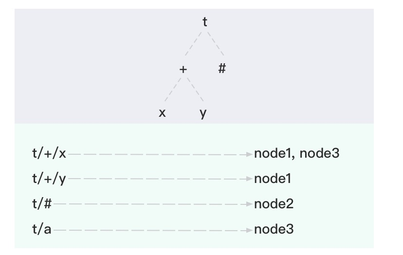

# EMQX クラスタリング

EMQX クラスタリングとは、複数の EMQX ノードを連携させて統一されたシステムとして動作させるデプロイメントを指します。これらのノードはクライアントのセッション、トピックのサブスクリプション、およびルーティング情報を自動的に共有し、シームレスなメッセージ配信と水平スケーラビリティを実現します。

::: tip 注意

クラスタリング機能はトライアル期間中に利用可能です。トライアル終了後は商用ライセンスが必要であり、ライセンスがない場合は機能が無効になります。

:::

本章では、[クラスタリングの利点](#why-use-emqx-clustering)、新しい[Mria と RLOG](./mria-introduction.md) アーキテクチャ、[クラスタの手動または自動作成方法](./create-cluster.md)、[ロードバランシングの実装方法](./lb.md)、およびクラスタ内の[通信セキュリティの確保方法](./security.md)を紹介します。

このアーキテクチャは、MQTT を基盤とした大規模かつミッションクリティカルな IoT およびメッセージングプラットフォームに最適です。

## 章の概要

本章では EMQX クラスタリングの包括的な概要と実際のデプロイメントへの適用方法を解説します。以下の内容を学べます：

- [クラスタリングの利点](#why-use-emqx-clustering)
- [EMQX クラスタリングの動作原理](#how-clustering-in-emqx-works)
- [Mria と RLOG アーキテクチャ](./mria-introduction.md)
- [クラスタの手動または自動作成方法](./create-cluster.md)
- [ノード間通信のセキュリティ確保方法](./security.md)
- [ロードバランシングの実装方法](./lb.md)
- [クラスタ負荷のリバランスとノードの退避方法](./rebalancing.md)
- [システムチューニングとパフォーマンステストの実施方法](../../performance/overview.md)

高可用な MQTT プラットフォームを構築する場合や本番規模の準備をする際に、自信を持って始められるガイドです。

## なぜ EMQX クラスタリングを使うのか

EMQX クラスタリングは、信頼性、スケーラビリティ、およびパフォーマンスを求める大規模かつミッションクリティカルなアプリケーション向けに設計されています。主な利点は以下の通りです：

- **スケーラビリティ**：ノードを追加することで容易にデプロイメントを拡張でき、EMQX は増加する MQTT クライアントとメッセージをサービス停止なく処理可能です。
- **高可用性**：分散アーキテクチャにより単一障害点がなく、1つ以上のノードがオフラインになってもシステムは継続して動作します。
- **ロードバランシング**：MQTT トラフィックとクライアントセッションをノード間で分散し、ボトルネックを防ぎハードウェアの利用効率を最大化します。
- **集中管理**：すべてのノードを単一のダッシュボードまたは API エンドポイントから管理・監視でき、運用と保守が簡素化されます。
- **データの一貫性とセキュリティ**：セッションおよびルーティング状態はノード間で自動的に複製され、一貫性を保ちつつクラスタ全体で安全な通信を維持します。

## EMQX クラスタリングの仕組み

EMQX クラスターは複数のノードで構成され、それぞれが EMQX のインスタンスを実行しています。これらのノードは連携してメッセージのルーティング、MQTT セッションの管理、高可用性とスケーラビリティの確保を行います。各ノードは他のノードと通信し、クライアントのサブスクリプションやルーティング情報を共有することで、どのノードに接続されたクライアントにもメッセージが届くようにします。

この分散設計により、EMQX はミッションクリティカルなメッセージングシステムを最小限のダウンタイムで柔軟に拡張可能です。

### クラスタアーキテクチャの進化

#### EMQX 5.0 以前：Mnesia ベースのクラスタリング

初期の EMQX は Erlang/OTP に組み込まれた Mnesia データベースとフルメッシュトポロジーを利用していました。各ノードは Erlang 分散プロトコル（デフォルトポート：4370）を使い、すべての他ノードと直接 TCP 接続を維持し、密結合のシステムを形成していました。


しかし、このモデルには以下の制約がありました：

- クラスタサイズの増加に伴う高い同期オーバーヘッド
- 5ノード以上のクラスタでの不安定性リスク
- 垂直スケーリングによるスケーラビリティの限界

> EMQX 4.3 はベンチマークテストで 1000万同時接続を達成しましたが、高度なチューニングと高性能ハードウェアが必要でした。詳細は[パフォーマンスレポート](https://www.emqx.com/en/resources/emqx-v-4-3-0-ten-million-connections-performance-test-report)を参照してください。

#### EMQX 5.0 以降：Mria + RLOG

バージョン 5.0 からは、新しい[Mria クラスタアーキテクチャ](./mria-introduction.md)を導入し、より大規模で安定したクラスタをサポートしています。

主な変更点は以下の通りです：

- **Core と Replicant の役割分担**：Core ノードは書き込みと完全なデータ複製を担当し、Replicant ノードは読み取り専用でクライアントセッションを処理します。
- **レプリケーションログ（RLOG）**：Core から Replicant への非同期かつ高スループットなデータ複製を可能にします。
- **スケーラビリティ**：1 クラスタあたり最大 1 億 MQTT 接続をサポートします。


::: tip 注意

厳密な上限はありませんが、EMQX オープンソース版ではクラスタサイズを3ノードに制限することを推奨します。Core タイプのノードのみを使用する場合、小規模なクラスタの方が安定性が高い傾向にあります。

:::

このアーキテクチャを支えるために、EMQX は Erlang/OTP とルーティングおよび配信のための内部データ構造群を利用しています。[Erlang/OTP の基礎](#erlangotp-の基礎)および[クラスタデータ構造](#クラスタデータ構造)の節で、ランタイムの基盤とこれらの構造がクラスタ内でどのように機能するかを説明します。

### Erlang/OTP の基礎

EMQX は分散型の通信システム構築を目的に設計されたランタイムおよびフレームワークである[Erlang/OTP](https://www.erlang.org/)上に構築されています。Erlang では各ランタイムインスタンスを**ノード**と呼び、`<name>@<host>` 形式の名前で識別します。例：`emqx1@192.168.0.10`。

Erlang ノードは TCP 経由で接続し、軽量なメッセージパッシングで通信します。これが EMQX クラスタリングの基盤となっています。各ノードは同じクッキーを使って認証し、接続と認証が完了すると自動的に EMQX クラスタに参加できます。EMQX 5.x 以降では、ノードの役割（Core または Replicant）がデータ複製とルーティングへの参加方法を決定します。

### クラスタデータ構造

分散クラスタ内で効率的にメッセージをルーティングするため、EMQX はサブスクリプションテーブル、ルーティングテーブル、トピックツリーという3つの主要な内部データ構造を使用します。これらは連携して、クライアントが多数のノードに分散していてもメッセージを正しくサブスクライバーに届けます。

#### サブスクリプションテーブル（パーティション化）

各 EMQX ノードはローカルのサブスクリプションテーブルを保持し、MQTT トピックとそのノードに直接接続されたクライアントをマッピングします。データはパーティション化されており、各ノードは自分のクライアントのサブスクリプションのみを保存するため、オーバーヘッドが減りスケーラビリティが向上します。

メッセージがノードにルーティングされると、そのノードはサブスクリプションテーブルを使ってローカルクライアントのうちどれにメッセージを届けるかを判断します。

例：

```
node1:
    topic1 -> client1, client2
    topic2 -> client3

node2:
    topic1 -> client4
```

この例は、同じトピック（`topic1`）に複数ノードでサブスクライバーが存在し、各ノードが独自にローカルマッピングを管理していることを示しています。

#### ルーティングテーブル（Core から複製）

ルーティングテーブルは、どのノードがどのトピックをサブスクライブしているかを追跡します。EMQX 5.x ではこのテーブルは Core ノードのみが管理・複製し、Replicant ノードは RLOG 機構を通じて読み取り専用コピーを受け取ります。

クライアントが任意のノード（通常は Replicant）でトピックをサブスクライブすると、そのサブスクリプションイベントは Core ノードに転送され、クラスタ全体のルーティングテーブルが更新・複製されます。

例：

```
topic1 -> node1, node2
topic2 -> node3
topic3 -> node2, node4
```

#### トピックツリー（Core から複製）

トピックツリーは階層構造で、パブリッシュされたトピックとサブスクリプションパターン（[MQTT ワイルドカード](../../design/mqtt-basics.md#mqtt-topics-and-wildcards)の `+` と `#` を含む）をマッチングするために使われます。これにより EMQX は複雑なトピックフィルターを高速に解決できます。

ルーティングテーブルと同様に、トピックツリーは Core ノードによって複製され Replicant ノードと共有されます。新しいサブスクリプション（例：`client1` が `t/+/x` をサブスクライブ）が来ると、トピックツリーはすべてのノードで更新されます。更新は Core ノードが処理し、その後複製されます。

トピックとサブスクリプションの例：

| クライアント | ノード  | サブスクライブトピック |
| ------------ | ------- | ----------------------- |
| client1      | node1   | t/+/x, t/+/y            |
| client2      | node2   | t/#                     |
| client3      | node3   | t/+/x, t/a              |

これらのサブスクリプションが設定された後、EMQX は以下のトピックツリーとルーティングテーブルを構築します：



#### メッセージ配信フロー

MQTT クライアントがメッセージをパブリッシュすると、そのクライアントが接続しているノード（Core または Replicant）はトピックツリーを使ってメッセージトピックとすべてのサブスクリプションパターンを照合します。次にルーティングテーブルを参照し、マッチするサブスクライバーがいるノードを特定してメッセージを転送します（複数ノードに転送される場合もあります）。受信した各ノードはローカルのサブスクリプションテーブルを参照し、該当するサブスクライバーにメッセージを配信します。

例として、**Client 1** がトピック `t/a` にメッセージをパブリッシュした場合のノード間のルーティングと配信は以下の通りです：

1. **Client 1** は **Node 1** に接続し、トピック `t/a` のメッセージをパブリッシュします。

2. **Node 1** はトピックツリーを確認し、`t/a` が既存のサブスクリプションパターン `t/a` と `t/#` にマッチすることを検出します。

3. **Node 1** はルーティングテーブルを参照し、

   - **Node 2** に `t/#` をサブスクライブするクライアントがいる、
   - **Node 3** に `t/a` をサブスクライブするクライアントがいる、

   ことを特定し、両ノードにメッセージを転送します。

4. **Node 2** はメッセージを受信し、ローカルのサブスクリプションテーブルを確認して `t/#` をサブスクライブするクライアントにメッセージを配信します。

5. **Node 3** はメッセージを受信し、ローカルのサブスクリプションテーブルを確認して `t/a` をサブスクライブするクライアントにメッセージを配信します。

6. メッセージ配信処理が完了します。

EMQX クラスタリングの仕組みをさらに理解するには、[EMQX クラスタリングの設計](../../design/clustering.md)を参照してください。

## クラスタリング機能の概要

EMQX はネイティブの Erlang 分散システムを拡張する [Ekka](https://github.com/emqx/ekka) ライブラリにより、以下の高度なクラスタリング機能を提供します。これにより自動ノード検出、動的クラスタ形成、ネットワーク分断の処理、ノードのクリーンアップなどが可能になります。

### ノード検出と自動クラスタリング

EMQX は複数のノード検出メカニズムをサポートし、多様なデプロイ環境で自動的にクラスタを形成できます：

| 戦略       | 説明                                 |
| ---------- | ------------------------------------ |
| `manual`   | コマンドによる手動クラスタ作成       |
| `static`   | 静的ノードリストによる自動クラスタリング |
| `DNS`      | DNS の A レコードおよび SRV レコードによる自動クラスタリング |
| `etcd`     | etcd を利用した自動クラスタリング    |
| `k8s`      | Kubernetes による自動クラスタリング  |

詳細は[クラスタの作成と管理](./create-cluster.md)を参照してください。

### ネットワーク分断の自動修復

ネットワーク分断自動修復は、ネットワーク分断発生時に手動介入なしでブローカーが自動的に回復する機能であり、ダウンタイムが許されないミッションクリティカルな用途に有用です。

この機能は `cluster.autoheal` 設定で制御され、デフォルトで有効です。

```bash
cluster.autoheal = true
```

有効時、EMQX はクラスタ内ノード間の接続状態を継続的に監視します。ネットワーク分断を検知すると、影響を受けたノードを隔離し、残りのノードで動作を継続します。分断が解消されると、ブローカーは隔離されたノードを自動的にクラスタに再統合します。

### クラスタノードの自動クリーンアップ

クラスタノード自動クリーンアップ機能は、切断されたノードを設定された時間経過後に自動的にクラスタから削除します。この機能によりクラスタの効率的な運用とパフォーマンス劣化の防止が可能です。

デフォルトで有効で、`cluster.autoclean` 設定（デフォルト：`24h`）で制御されます。

```bash
cluster.autoclean = 24h
```

### ノード間セッション

EMQX はノード間のセッション永続化をサポートし、クライアントが一時的に切断してもセッションとサブスクリプションを保持します。

この機能を有効にするには：

- **MQTT 3.x クライアント**：`clean_start = false` を設定
- **MQTT 5.0 クライアント**：`clean_start = false` かつ `session_expiry_interval > 0` を設定

これにより、クライアントが切断してもクライアント ID に紐づく以前のセッションデータが保持されます。再接続時に EMQX は前のセッションを再開し、切断中にキューイングされたメッセージを配信し、サブスクリプションを維持します。

## ネットワーク要件

EMQX クラスタを運用するためのネットワークレイテンシは 10 ミリ秒未満が望ましいです。100 ミリ秒を超えるレイテンシの場合、クラスタは利用できません。

Core ノードは同一のプライベートネットワーク内に配置する必要があります。Mria+RLOG モードでは、Replicant ノードも同一プライベートネットワーク内に配置することを推奨します。

## 次のステップ：EMQX クラスタの作成

以下のセクションを続けて読み、EMQX クラスタの作成方法を学べます：

- [クラスタアーキテクチャ](./mria-introduction.md)
- [クラスタの作成](./create-cluster.md)
- [クラスタセキュリティ](./security.md)
