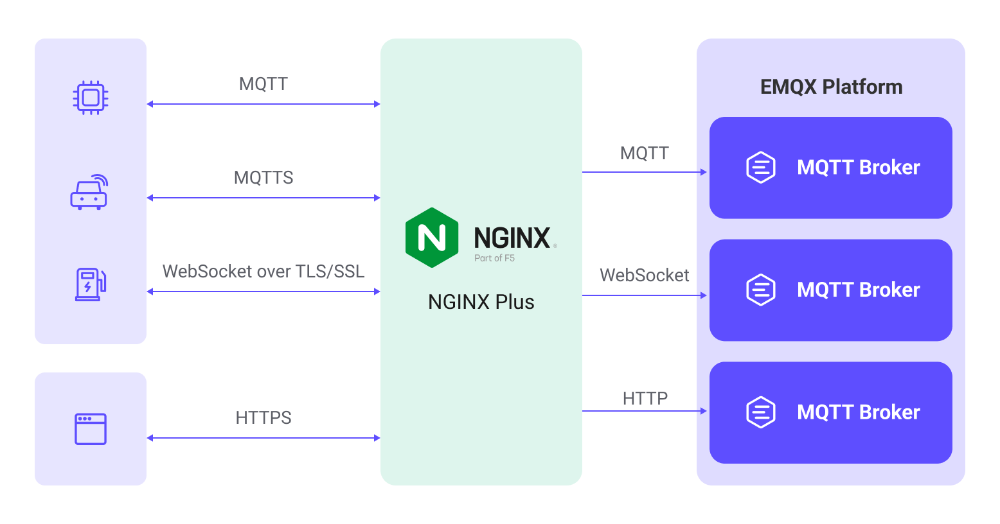

# NGINXによるEMQXクラスターのロードバランス

NGINXは高性能で多機能なサーバソフトウェアであり、ウェブサーバやリバースプロキシサーバとして機能します。さらに、NGINXはロードバランサーとしても動作し、クライアントからのリクエストを複数のバックエンドサーバに分散して負荷分散とパフォーマンスの最適化を実現します。NGINXは特に大量の同時リクエスト処理が重要なIoTアプリケーションに適しています。IoTでは多数のデバイスが存在し、高負荷のリクエスト処理が可能なサーバが求められます。EMQXは複数のMQTTサーバからなる分散クラスターアーキテクチャをネイティブにサポートしています。そのため、NGINXをロードバランサーとして、EMQXクラスターを構成することで高可用性とスケーラビリティを確保できます。

本ページでは、NGINXのインストール方法と、MQTTサーバとしてのEMQXクラスター向けにリバースプロキシおよびロードバランス設定を行う方法を紹介します。また、NGINX Plusを用いたEMQXデプロイの最適化方法も解説します。

## 特長とメリット

NGINXを用いてEMQXクラスターのロードバランスを行うことで、以下のような特長と利点があります。

- リバースプロキシサーバとして、NGINXはMQTTサーバ側に位置し、MQTTクライアントを代表してEMQXクラスターへのMQTT接続要求を開始し、EMQXクラスターの応答をMQTTクライアントに返します。この構成により複数のクラスターを隠蔽し、MQTTクライアントには単一のアクセスポイントを提供します。MQTTクライアントはNGINXとだけ通信すればよく、背後のクラスターの数や構成を意識する必要がありません。これによりシステムの保守性とスケーラビリティが向上します。
- NGINXはMQTTクライアントとEMQXクラスター間のSSL暗号化接続を終端でき、EMQXクラスターの暗号化・復号負荷を軽減します。これによりパフォーマンス向上、証明書管理の簡素化、セキュリティ強化などの利点があります。
- NGINXは柔軟なロードバランス戦略を提供し、クラスター内のどのEMQXノードにリクエストを送るかを制御できます。これによりトラフィックやリクエストの分散が可能となり、パフォーマンスと信頼性が向上します。例えば、スティッキー（sticky）ロードバランスにより同一クライアントのリクエストを同じバックエンドサーバに割り当て、パフォーマンスやセッションの持続性を高められます。



## クイックスタート

このセクションでは、実際の例を用いたDocker Compose構成を紹介し、NGINXの機能を簡単に検証・テストできます。以下の手順で進めてください。

1. サンプルリポジトリをクローンし、`mqtt-lb-nginx`ディレクトリに移動します。

```bash
git clone https://github.com/emqx/emqx-usage-example
cd emqx-usage-example/mqtt-lb-nginx
```

2. Docker Composeでサンプルを起動します。

```bash
docker compose up -d
```

3. [MQTTX](https://mqttx.app) CLIを使い、10個のTCP接続を確立してMQTTクライアント接続をシミュレートします。

```bash
mqttx bench conn -c 10
```

4. NGINXの接続状況とEMQXクライアント接続の分布を確認できます。

   - 以下のコマンドでNGINXの接続監視を表示します。

     ```bash
     $ curl http://localhost:8888/status                                
     Active connections: 11 
     server accepts handled requests
      60 60 65 
     Reading: 0 Writing: 1 Waiting: 0
     ```

     これは現在のアクティブ接続数やサーバのリクエスト処理状況（読み取り、書き込み、待機状態）を示します。

   - 以下のコマンドで各EMQXノードのクライアント接続状況をそれぞれ確認します。

     ```bash
     docker exec -it emqx1 emqx ctl broker stats | grep connections.count
     docker exec -it emqx2 emqx ctl broker stats | grep connections.count
     docker exec -it emqx3 emqx ctl broker stats | grep connections.count
     ```

     これにより各ノードの接続数とアクティブ接続数が表示され、10接続がクラスター内のノードに均等に分散されていることが確認できます。

     ```bash
     connections.count             : 3
     live_connections.count        : 3
     connections.count             : 4
     live_connections.count        : 4
     connections.count             : 3
     live_connections.count        : 3
     ```

以上の手順で、NGINXのロードバランス機能とEMQXクラスター内のクライアント接続分布を検証できます。`emqx-usage-example/mqtt-lb-nginx/nginx.conf`ファイルを編集してカスタム設定の検証も可能です。

## NGINXのインストールと使用方法

このセクションでは、NGINXの詳細なインストールと使用方法を紹介します。

### 前提条件

開始前に、以下の3つのEMQXノードからなるクラスターを作成していることを確認してください。EMQXクラスターの作成方法は[Create a Cluster](./create-cluster.md)を参照してください。

| ノードアドレス           | MQTT TCPポート | MQTT WebSocketポート |
| ------------------------ | -------------- | -------------------- |
| emqx1-cluster.emqx.io    | 1883           | 8083                 |
| emqx2-cluster.emqx.io    | 1883           | 8083                 |
| emqx3-cluster.emqx.io    | 1883           | 8083                 |

本ページの例では、単一のNGINXサーバをロードバランサーとして構成し、これら3つのEMQXノードからなるクラスターにリクエストを転送します。

### NGINXのインストール

デモではUbuntu 22.04 LTS環境にソースコードからNGINXをインストールします。Dockerやバイナリパッケージでのインストールも可能です。

#### 必要な依存パッケージ

NGINXのコンパイル・インストール前に、以下の依存パッケージがシステムにインストールされていることを確認してください。

- GNU CおよびC++コンパイラ
- PCRE（Perl Compatible Regular Expressions）ライブラリ
- zlib圧縮ライブラリ
- OpenSSLライブラリ

Ubuntu環境では以下のコマンドでインストールできます。

```bash
sudo apt-get update
sudo apt-get install build-essential libpcre3-dev zlib1g-dev libssl-dev
```

#### ソースコードのダウンロード

最新の安定版NGINXは[NGINX公式サイト](https://nginx.org/en/download.html)からダウンロード可能です。例：

```bash
wget https://nginx.org/download/nginx-1.24.0.tar.gz
```

#### コンパイル設定

ダウンロード後、ソースコードを展開し、ディレクトリに移動します。

```bash
tar -zxvf nginx-1.24.0.tar.gz
cd nginx-1.24.0
```

以下のコマンドでコンパイルオプションを設定します。

```bash
./configure \
 --with-threads \
 --with-http_stub_status_module \
 --with-http_ssl_module \
 --with-http_realip_module \
 --with-stream \
 --with-stream_ssl_module
```

上記のうち、`--with-http_ssl_module`はSSL対応追加、`--with-stream`および`--with-stream_ssl_module`はTCPリバースプロキシ対応を追加します。

#### コンパイル開始

以下のコマンドでコンパイルを開始します。

```bash
make
```

#### インストール

コンパイル後、以下のコマンドでNGINXをインストールします。

```bash
sudo make install
```

システムのPATHにあるディレクトリにNGINX実行ファイルのシンボリックリンクを作成します。

```bash
sudo ln -s /usr/local/nginx/sbin/nginx /usr/local/bin/nginx
```

### 使い始め

NGINXの設定ファイルはデフォルトで`/usr/local/nginx/conf/nginx.conf`にあります。本ページの設定例をファイル末尾に追記してください。基本的なNGINX操作コマンドは以下の通りです。

設定ファイルの検証：

```bash
sudo nginx -t
```

設定ファイルが正常ならNGINXを起動：

```bash
sudo nginx
```

稼働中のNGINXに設定変更を反映するには、事前に設定検証を行い、リロードします。

```bash
sudo nginx -s reload
```

NGINXを停止するには：

```bash
sudo nginx stop
```

## NGINXのリバースプロキシおよびロードバランス設定

このセクションでは、さまざまなロードバランス要件に応じたNGINX設定方法を説明します。

### MQTTのリバースプロキシ設定

クライアントからのMQTT接続要求をリバースプロキシし、バックエンドMQTTサーバに転送するため、NGINX設定ファイルに以下を記述します。

```bash
stream {
  upstream mqtt_servers {
    # down: 現在サーバが一時的にロードバランス対象外であることを示す
    # max_fails: 許容される失敗リクエスト数（デフォルトは1）
    # fail_timeout: max_failsに達した際のタイムアウト時間（デフォルト10秒）
    # backup: 非バックアップサーバが全てダウンまたはビジー時にリクエストを受けるバックアップサーバ

    server emqx1-cluster.emqx.io:1883 max_fails=2 fail_timeout=10s;
    server emqx2-cluster.emqx.io:1883 down;
    server emqx3-cluster.emqx.io:1883 backup;
  }

  server {
    listen 1883;
    proxy_pass mqtt_servers;

    # このオプションを有効にする場合、対応するバックエンドリスナーもproxy_protocolを有効にする必要あり
    proxy_protocol on;
    proxy_connect_timeout 10s;
    # デフォルトのキープアライブ時間は10分
    proxy_timeout 1800s;
    proxy_buffer_size 3M;
    tcp_nodelay on;
  }
}
```

### MQTT SSLのリバースプロキシ設定

NGINXでMQTTのTLS接続を終端し、暗号化されたMQTTリクエストをバックエンドMQTTサーバに転送して通信の安全性を確保できます。TCPベースの設定にSSL関連パラメータを追加するだけです。

```bash
stream {
  upstream mqtt_servers {
    server emqx1-cluster.emqx.io:1883;
    server emqx2-cluster.emqx.io:1883;
  }

  server {
    listen 8883 ssl;

    ssl_session_cache shared:SSL:10m;
    ssl_session_timeout 10m;
    ssl_certificate /usr/local/nginx/certs/emqx.pem;
    ssl_certificate_key /usr/local/nginx/certs/emqx.key;
    ssl_verify_depth 2;
    ssl_protocols TLSv1 TLSv1.1 TLSv1.2;
    ssl_ciphers HIGH:!aNULL:!MD5;

    # 相互認証を有効にする場合はCA証明書とクライアント証明書検証を追加
    # ssl_client_certificate /usr/local/nginx/certs/ca.pem;
    # ssl_verify_client on;
    # ssl_verify_depth 1;

    proxy_pass mqtt_servers;

    # このオプションを有効にする場合、対応するバックエンドリスナーもproxy_protocolを有効にする必要あり
    proxy_protocol on;
    proxy_connect_timeout 10s;
    # デフォルトのキープアライブ時間は10分
    proxy_timeout 1800s;
    proxy_buffer_size 3M;
    tcp_nodelay on;
  }
}
```

### MQTT WebSocketのリバースプロキシ設定

以下の設定でNGINXがMQTT WebSocket接続をリバースプロキシし、クライアントリクエストをバックエンドMQTTサーバに転送します。`server_name`でHTTPのドメイン名またはIPアドレスを指定してください。

EMQX 6.3.0以降では、WebSocketリスナーはデフォルトで転送されたクライアントアドレスヘッダーを読みません。NGINXが設定する`X-Forwarded-For`ヘッダーを利用するには、各バックエンドEMQXノードの`base.hocon`に以下を追加してください。

```hocon
listeners.ws.default.websocket.proxy_address_header = "x-forwarded-for"
```

```bash
http {
  upstream mqtt_websocket_servers {
    server emqx1-cluster.emqx.io:8083;
    server emqx2-cluster.emqx.io:8083;
  }

  server {
    listen 80;
    server_name mqtt.example.com;

    location /mqtt {
      proxy_pass http://mqtt_websocket_servers;

      proxy_http_version 1.1;
      proxy_set_header Upgrade $http_upgrade;
      proxy_set_header Connection "Upgrade";

      # キャッシュ無効化
      proxy_buffering off;

      proxy_connect_timeout 10s;
      # WebSocket接続タイムアウト
      # この時間内にデータ交換がなければWebSocket接続は自動切断される（デフォルト60秒）
      proxy_send_timeout 3600s;
      proxy_read_timeout 3600s;

      # リバースプロキシの実IP設定
      proxy_set_header Host $host;
      proxy_set_header X-Real-IP $remote_addr;
      proxy_set_header REMOTE-HOST $remote_addr;
      proxy_set_header X-Forwarded-For $remote_addr;
    }
  }
}
```

::: tip
WebSocketの例では、EMQXが`proxy_address_header`設定時に`X-Forwarded-For`ヘッダーの最左（最初）の値を読み取るため、`X-Forwarded-For`を`$remote_addr`で上書きしています。このため、`$proxy_add_x_forwarded_for`は使用しないでください。`$proxy_add_x_forwarded_for`は既存の`X-Forwarded-For`に`$remote_addr`を追加し、クライアントが偽装可能な値が最左に残るためです。詳細は[Forwarded Client Address](../../configuration/listener.md#forwarded-client-address-websocket-listeners)を参照してください。
:::

### MQTT WebSocket SSLのリバースプロキシ設定

NGINXでMQTT WebSocketのTLS接続を終端し、暗号化されたMQTTリクエストをバックエンドMQTTサーバに転送して通信の安全性を確保できます。`server_name`でHTTPのドメイン名またはIPアドレスを指定し、WebSocketベースの設定にSSLおよび証明書関連パラメータを追加するだけです。

```bash
http {
  upstream mqtt_websocket_servers {
    server emqx1-cluster.emqx.io:8083;
    server emqx2-cluster.emqx.io:8083;
  }

  server {
    listen 443 ssl;
    server_name mqtt.example.com;

    ssl_session_cache shared:SSL:10m;
    ssl_session_timeout 10m;
    ssl_certificate /usr/local/nginx/certs/emqx.pem;
    ssl_certificate_key /usr/local/nginx/certs/emqx.key;
    ssl_protocols TLSv1 TLSv1.1 TLSv1.2;
    ssl_ciphers HIGH:!aNULL:!MD5;

    # 相互認証を有効にする場合はCA証明書とクライアント証明書検証を追加
    # ssl_client_certificate /usr/local/nginx/certs/ca.pem;
    # ssl_verify_client on;

    location /mqtt {
        proxy_pass http://mqtt_websocket_servers;
        proxy_http_version 1.1;
        proxy_set_header Upgrade $http_upgrade;
        proxy_set_header Connection "Upgrade";

        # リバースプロキシの実IP設定
        proxy_set_header Host $host;
        proxy_set_header X-Real-IP $remote_addr;
        proxy_set_header REMOTE-HOST $remote_addr;
        proxy_set_header X-Forwarded-For $remote_addr;

        # キャッシュ無効化
        proxy_buffering off;
    }
  }
}
```

### ロードバランス戦略の設定

NGINXは接続の分散方法を制御する複数のロードバランス戦略を提供します。実際の運用ではサーバ性能やトラフィック要件に応じて適切な戦略を選択することが重要です。以下は`upstream`ブロック内で設定可能な代表的なNGINXロードバランス戦略です。

#### ラウンドロビン

デフォルトのロードバランス戦略で、リクエストをバックエンドサーバに順番に均等に分配します。バックエンドサーバの性能がほぼ同等の場合に適しています。

```bash
upstream backend_servers {
  server emqx1-cluster.emqx.io:1883;
  server emqx2-cluster.emqx.io:1883;
  server emqx3-cluster.emqx.io:1883;
}
```

#### 重み付きラウンドロビン

ラウンドロビンに加え、各EMQXノードに異なる重みを割り当ててリクエストの分配比率を調整します。重みの高いサーバがより多くのリクエストを受けます。

```bash
upstream backend_servers {
  server emqx1-cluster.emqx.io:1883 weight=3;
  server emqx2-cluster.emqx.io:1883 weight=2;
  server emqx3-cluster.emqx.io:1883 weight=1;
}
```

#### IPハッシュ

クライアントのIPアドレスを元にハッシュを計算し、同じクライアントからのリクエストを常に同じバックエンドサーバに割り当てます。

```bash
upstream backend_servers {
  ip_hash;
  server emqx1-cluster.emqx.io:1883;
  server emqx2-cluster.emqx.io:1883;
  server emqx3-cluster.emqx.io:1883;
}
```

#### 最小接続数

現在の接続数が最も少ないサーバにリクエストを割り当て、各サーバの負荷をできるだけ均等にします。サーバ性能に差が大きい場合に適しています。

```bash
upstream backend_servers {
  least_conn;
  server emqx1-cluster.emqx.io:1883;
  server emqx2-cluster.emqx.io:1883;
  server emqx3-cluster.emqx.io:1883;
}
```

## NGINX Plusを用いたEMQXデプロイの最適化

このセクションでは、NGINX Plus固有の機能を利用してEMQXデプロイを最適化する方法を紹介します。本ページでコンパイル・インストールしたNGINXでは利用できないため、NGINX Plusの詳細は[こちらのドキュメント](https://www.nginx.com/blog/optimizing-mqtt-deployments-in-enterprise-environments-nginx-plus/)を参照してください。

### MQTTスティッキーセッションロードバランスの設定

「スティッキー」とは、クライアントが再接続した際に同じサーバにルーティングする機能で、セッションの乗っ取りを防ぎます。頻繁に再接続するクライアントや問題のあるクライアントの効率化に役立ちます。

スティッキーを実現するには、サーバが接続要求内のクライアント識別子（通常はクライアントID）を特定する必要があり、ロードバランサーがMQTTパケットを解析します。クライアントIDを取得後、静的クラスターではハッシュでサーバIDに変換したり、ロードバランサーがクライアントIDと宛先ノードIDのマッピングテーブルを保持して柔軟にルーティングします。

以下は設定例です。

```bash
mqtt_preread on;

upstream backend_servers {
    hash $mqtt_preread_clientid consistent;
    server emqx1-cluster.emqx.io:1883;
    server emqx2-cluster.emqx.io:1883;
    server emqx3-cluster.emqx.io:1883;
}
```

上記例は環境に応じて調整が必要な場合があります。設定で使われるモジュール（`ip_hash`や`least_conn`など）はNGINX標準モジュールであり、追加モジュール依存はありません。

### クライアントID置換機能の設定

MQTT通信においてセキュリティは重要です。デバイスはシリアル番号などの機密情報をクライアントIDとして使うことが多く、MQTTサーバのデータベースに保存するとリスクがあります。NGINX PlusはクライアントID置換機能を提供し、NGINX Plus設定で指定した別の値にクライアントIDを置換できます。

以下は設定例です。

```bash
stream {
    mqtt on;

    server {
        listen 1883 ssl;
        ssl_certificate /etc/NGINX/certs/emqx.pem;
        ssl_certificate_key /etc/NGINX/certs/emqx.key;
        ssl_client_certificate /etc/NGINX/certs/ca.crt;      
        ssl_session_cache shared:SSL:10m;
        ssl_verify_client on;
        proxy_pass 10.0.0.113:1883;
        proxy_connect_timeout 1s;  

        mqtt_set_connect clientid $ssl_client_serial;
    }
}
```

この例ではクライアントの相互認証を有効にし、クライアントSSL証明書のシリアル番号をユニーク識別子として抽出し、元のクライアントIDを置換しています。`$ssl_client_s_dn`など他の値を利用することも可能です。

## NGINXパフォーマンスの最適化と監視有効化

このセクションでは、NGINXのパフォーマンスを設定で最適化し、ステータス監視機能を有効にする方法を説明します。

### NGINX基本設定の調整

- `worker_processes`：ワーカープロセス数。サーバのCPUコア数に近い値に設定します。ただし多すぎるとリソース競合を招くため注意が必要です。
- `worker_connections`：単一ワーカープロセスが同時に処理可能な最大接続数。OSの最大ファイルディスクリプタ数を超えないように設定してください。

```bash
worker_processes auto;

events {
 worker_connections 20480;
}
```

### NGINXのマルチNIC対応による大量接続処理

リバースプロキシではNGINXがクライアントとしてバックエンドEMQXノードに接続します。この場合、単一IPアドレスで約6万の長時間接続が最大です。より多くの接続をサポートするには、複数のNGINXサーバを展開するか、複数IPアドレスを設定します。

以下はNGINX組み込みの`split_clients`モジュールを使い、クライアントIPアドレスとポート番号に基づき変数`$multi_ip`を定義して複数IPに分散する例です。使用するIPはローカルで利用可能なものを指定してください。

```bash
stream {
 split_clients "$remote_addr$remote_port" $multi_ip {
    20% 10.211.55.5;
    20% 10.211.55.20;
    20% 10.211.55.21;
    20% 10.211.55.22;
    * 10.211.55.23;
  }

  upstream mqtt_servers {
    server emqx1-cluster.emqx.io:1883;
    server emqx2-cluster.emqx.io:1883;
  }

  server {
    listen 1883;

    proxy_pass mqtt_servers;
    proxy_bind $multi_ip;
  }
}
```

### NGINXステータス監視

NGINXのステータス監視を有効にするには、`http_stub_status_module`モジュールがインストールされている必要があります。インストール済みであれば、以下のようにNGINXのステータス監視を有効にできます。

```bash
http {
  server {
    listen 8888;

    location /status {
      stub_status on;
      access_log off;
    }
  }
}
```

http://localhost:8888/status にアクセスするとステータス情報が取得できます。

```bash
$ curl http://localhost:8888/status
Active connections: 12
server accepts handled requests
 25 25 60
Reading: 0 Writing: 1 Waiting: 1
```

## 付録：主なパラメータの説明

以下は例示した設定で使用される主なパラメータの説明です。これらはバックエンドMQTTサーバへの安定した接続や、NGINX経由でMQTT通信を暗号化・保護し、IoTアプリケーションの通信のプライバシーと整合性を確保するためのベストプラクティスに沿ったものです。

| パラメータ名            | 説明                                                                                   |
| ----------------------- | -------------------------------------------------------------------------------------- |
| proxy_protocol          | PROXYプロトコルを有効にし、NGINXが接続先にリクエストの先頭に追加のプロキシ情報を付加可能にします。これによりEMQXは実際のクライアントIPを取得できます。 |
| proxy_pass              | バックエンドMQTTサーバのアドレスを定義し、クライアントからの全リクエストをここに転送します。                         |
| proxy_connect_timeout   | バックエンドMQTTサーバへの接続確立タイムアウト。指定時間内に接続できない場合、NGINXは接続を中止します。               |
| proxy_timeout           | バックエンドMQTTサーバの応答タイムアウト。指定時間内に応答がない場合、NGINXは接続を切断します。                       |
| proxy_buffer_size       | バックエンドMQTTサーバから受信したデータを格納するバッファサイズ。大容量のデータストリームに対応するため十分なサイズを確保します。 |
| tcp_nodelay             | TCP_NODELAYオプションを有効にし、Nagleアルゴリズムを無効化します。これによりパケット送信のレイテンシを削減し、リアルタイムMQTT通信に有利です。 |
| ssl_session_cache       | 共有SSLセッションキャッシュを設定。SSLセッションの状態を保存し、クライアント再接続時のハンドシェイク高速化に寄与します。`shared:SSL:10m`はキャッシュ名とサイズ（10MB）を指定。 |
| ssl_session_timeout     | SSLセッションのタイムアウトを10分に設定。再利用されないセッションはこの時間後に削除されます。                           |
| ssl_certificate         | SSL証明書ファイルのパス。サーバの身元証明に使用します。                                                       |
| ssl_certificate_key     | SSL証明書に対応する秘密鍵ファイルのパス。                                                               |
| ssl_protocols           | 許可するSSL/TLSプロトコルのバージョンを指定します。                                                       |
| ssl_ciphers             | 許可する暗号化アルゴリズム（暗号スイート）を設定。`HIGH:!aNULL:!MD5`は強力な暗号スイートを指定し、空の暗号スイートやMD5を除外します。 |
| ssl_client_certificate  | クライアント証明書の検証に使用する認証局（CA）証明書ファイルのパス。                                         |
| ssl_verify_client       | クライアント証明書検証を有効化。`on`に設定するとNGINXはクライアントに有効なSSL証明書の提示を要求します。               |
| ssl_verify_depth        | クライアント証明書検証の最大深度を設定。ここでは`1`で、クライアント証明書とCA証明書の1段階のみ検証します。               |

## 参考情報

EMQXはNGINXに関する豊富なリソースを提供しています。以下のリンクもご参照ください。

**ブログ:**

- [NGINX PlusによるEMQXのスティッキーセッション活用：'Client ID'を魔法の鍵に](https://www.emqx.com/en/blog/harnessing-sticky-sessions-for-mqtt-load-balancing-with-nginx-plus)
- [NGINX PlusのクライアントID置換とEMQX EnterpriseによるMQTTアプリケーションのセキュリティ強化](https://www.emqx.com/en/blog/securing-your-mqtt-based-applications-with-nginx-plus-client-id-substitution-and-emqx-enterprise)
- [EMQXとNGINX Plusによるクライアント証明書認証でMQTTセキュリティを向上](https://www.emqx.com/en/blog/elevating-mqtt-security-with-client-certificate-authentication)
