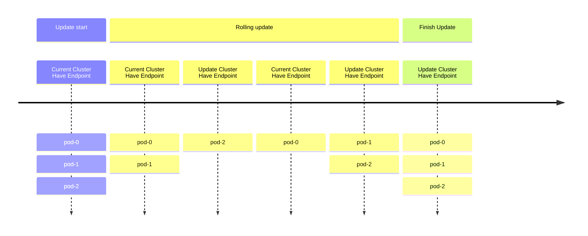
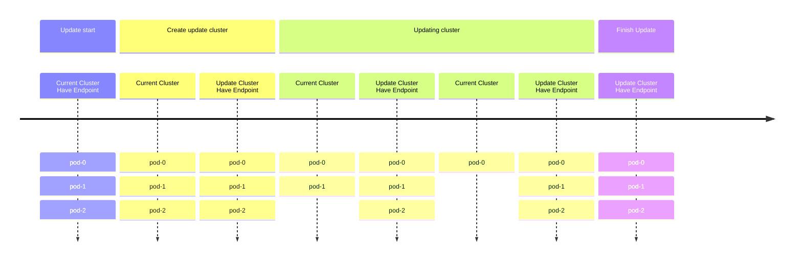

<<<<<<< HEAD
# EMQXクラスターのブルーグリーンアップグレードの実施

## 目的
=======
# Blue-GreenデプロイメントによるEMQXクラスターのエレガントなアップグレード

本ページでは、Blue-Greenデプロイメントを用いてEMQXクラスターをグレースフルにアップグレードする方法を説明します。
>>>>>>> origin/release-5.10

ブルーグリーンデプロイメントによるEMQXクラスターのグレースフルアップグレードを実施します。

<<<<<<< HEAD
## 背景
=======
この機能は `apps.emqx.io/v1beta4 EmqxEnterprise` および `apps.emqx.io/v2beta1 EMQX` のみをサポートしています。
>>>>>>> origin/release-5.10

従来のEMQXクラスターのデプロイメントでは、StatefulSetのデフォルトのローリングアップグレード戦略を用いてEMQX Podを更新することが一般的です。しかし、この方法には以下の2つの問題があります。

<<<<<<< HEAD
* ローリングアップデート中、新旧のPodが対応するServiceにより選択されるため、終了処理中の古いPodにMQTTクライアントが接続され、頻繁な切断と再接続が発生する可能性があります。
* ローリングアップデートの過程では、新しいPodの起動と準備完了に時間がかかるため、任意の時点でサービスを提供できるPodは_N - 1_に制限され、サービスの可用性が低下する恐れがあります。
=======
## 背景

1. 従来のEMQXクラスターのデプロイメントでは、StatefulSetのデフォルトのローリングアップグレード戦略を用いてEMQX Podを更新することが一般的です。しかし、この方法には以下の2つの問題があります。

   1. ローリングアップデート中は、新旧両方のPodが対応するServiceに選択されるため、MQTTクライアントが誤ったPodに接続し、頻繁な切断と再接続が発生する可能性があります。

   2. ローリングアップデートの過程で、新しいPodが起動して準備完了になるまでに時間がかかるため、N - 1のPodしかサービスを提供できず、サービスの可用性が低下する恐れがあります。
>>>>>>> origin/release-5.10



## 解決策

<<<<<<< HEAD
EMQX Operatorはデフォルトでブルーグリーンデプロイメントを実施します。対応するEMQX CRを通じてEMQXクラスターを更新すると、EMQX Operatorがアップグレードを開始します。

アップグレード全体の流れは以下のステップに大別されます。

1. 更新された仕様で新しいEMQXノード群を作成する。
2. 新しいノード群が準備完了したら、Serviceリソースを新しいノード群に切り替え、新規接続が古いノード群にルーティングされないようにする。
3. 既存のMQTT接続を制御された速度で古いノード群から新しいノード群へ安全に移行し、再接続の嵐を回避する。
4. 古いEMQXノード群を段階的にスケールダウンする。
5. アップグレードを完了する。
=======
前述のローリングアップデートの問題に対して、EMQX OperatorはBlue-Greenデプロイメントによるアップグレードソリューションを提供しています。EMQXカスタムリソースを用いてクラスターをアップグレードする際、EMQX Operatorは新しいEMQXクラスターを作成し、新クラスターが準備完了後にKubernetes Serviceを新クラスターに切り替えます。その後、古いEMQXクラスターのPodを段階的に削除してEMQXクラスターの更新を実現します。

古いEMQXクラスターのPodを削除する際、EMQX OperatorはEMQXのノード避難機能を活用して、MQTT接続を希望するレートで新クラスターに移行させることができ、大量の接続が一時的に集中する問題を回避します。

アップグレードの全体的な流れは以下のステップに大別されます。

1. 同一仕様のクラスターを作成する。

2. 新クラスターが準備完了後、Serviceを新クラスターに切り替え、古いクラスターをServiceから外す。この時点で新クラスターがトラフィックを受け始め、古いクラスターの既存接続は影響を受けません。

3. （EMQX Enterprise Editionのみ対応）EMQXのノード避難機能を使い、各ノードの接続を順次避難させる。

4. 古いクラスターを段階的にスケールダウンし、ノード数を0にする。

5. アップグレード完了。
>>>>>>> origin/release-5.10



<<<<<<< HEAD
## 手順
=======
## アップデート戦略の設定
>>>>>>> origin/release-5.10

### アップデート戦略の設定

<<<<<<< HEAD
1. `apps.emqx.io/v2beta1`のEMQX CRを作成し、アップデート戦略を設定します。
=======
`apps.emqx.io/v2beta1` EMQXを作成し、アップデート戦略を設定します。
>>>>>>> origin/release-5.10

  ```yaml
  apiVersion: apps.emqx.io/v2beta1
  kind: EMQX
  metadata:
    name: emqx-ee
  spec:
    image: emqx/emqx:@EE_VERSION@
    config:
      data: |
        license {
          key = "..."
        }
    updateStrategy:
      evacuationStrategy:
        # MQTTクライアントの退避速度（接続数/秒）:
        connEvictRate: 1000
        # MQTTセッションの退避速度（セッション数/秒）:
        sessEvictRate: 1000
        # Pod削除前の待機時間（秒）:
        waitTakeover: 10
      # すべてのノードが準備完了後、アップグレード開始までの待機時間（秒）:
      initialDelaySeconds: 10
      type: Recreate
  ```

<<<<<<< HEAD
2. 上記内容を`emqx-update.yaml`として保存し、`kubectl apply`でデプロイします。

  ```bash
  $ kubectl apply -f emqx-update.yaml
  emqx.apps.emqx.io/emqx-ee created
  ```

3. EMQXクラスターの状態を確認します。

  `STATUS`が`Ready`であることを確認してください。準備完了まで時間がかかる場合があります。

  ```bash
  $ kubectl get emqx
  NAME      STATUS   AGE
  emqx-ee   Ready    8m33s
  ```
=======
`initialDelaySeconds`：全ノードが準備完了後、アップデート開始までの待機時間（単位：秒）。

`waitTakeover`：Pod削除時の間隔時間（単位：秒）。

`connEvictRate`：MQTTクライアントの避難レート。EMQX Enterprise Editionのみサポート（単位：件数/秒）。

`sessEvictRate`：MQTTセッションの避難レート。EMQX Enterprise Editionのみサポート（単位：件数/秒）。

上記内容を `emqx-update.yaml` として保存し、以下のコマンドでEMQXをデプロイします。
>>>>>>> origin/release-5.10

### EMQXクラスターへの接続

[MQTTX](https://mqttx.app/cli)は、MQTT 5.0に対応したオープンソースのコマンドラインクライアントツールで、自動再接続機能を備え、MQTTサービスやアプリケーションの開発・デバッグを支援します。

<<<<<<< HEAD
MQTTXを使ってEMQXクラスターに接続します。
=======
EMQXクラスターの状態を確認し、`STATUS` が `Ready` であることを確認してください。EMQXクラスターが準備完了になるまでには時間がかかる場合があります。

```bash
$ kubectl get emqx

NAME      STATUS   AGE
emqx-ee   Ready    8m33s
```

:::
::: tab apps.emqx.io/v1beta4

`apps.emqx.io/v1beta4 EmqxEnterprise` を作成し、アップデート戦略を設定します。

```yaml
apiVersion: apps.emqx.io/v1beta4
kind: EmqxEnterprise
metadata:
  name: emqx-ee
spec:
  blueGreenUpdate:
    initialDelaySeconds: 60
    evacuationStrategy:
      waitTakeover: 5
      connEvictRate: 200
      sessEvictRate: 200
  template:
    spec:
      emqxContainer:
        image:
          repository: emqx/emqx-ee
          version: 4.4.30
```

`initialDelaySeconds`：全ノードが準備完了後、ノード避難開始までの待機時間（単位：秒）。

`waitTakeover`：全接続が切断された後、クライアントが再接続してセッションを引き継ぐまでの待機時間（単位：秒）。

`connEvictRate`：MQTTクライアントの避難レート（単位：件数/秒）。

`sessEvictRate`：MQTTセッションの避難レート（単位：件数/秒）。

上記内容を `emqx-update.yaml` として保存し、以下のコマンドでEMQX Enterprise Editionクラスターをデプロイします。

```bash
$ kubectl apply -f emqx-update.yaml

emqxenterprise.apps.emqx.io/emqx-ee created
```

EMQXクラスターの状態を確認し、`STATUS` が `Running` であることを確認してください。EMQXクラスターが準備完了になるまでには時間がかかる場合があります。

```bash
$ kubectl get emqxenterprises

NAME      STATUS   AGE
emqx-ee   Running  8m33s
```

:::
::::

## MQTTX CLIを使ったEMQXクラスターへの接続

MQTT X CLIは自動再接続をサポートするオープンソースのMQTT 5.0 CLIクライアントです。純粋なコマンドラインモードのMQTT Xであり、グラフィカルインターフェースを使わずにMQTTサービスやアプリケーションの開発・デバッグを迅速に行うことを目的としています。MQTT X CLIのドキュメントは以下をご参照ください：[MQTTX CLI](https://mqttx.app/cli)。

以下のコマンドを実行してEMQXクラスターに接続します。
>>>>>>> origin/release-5.10

```bash
mqttx bench conn -h ${IP} -p ${PORT} -c 3000
[10:05:21 AM] › ℹ  接続ベンチマークを開始、接続数: 3000、リクエスト間隔: 10ms
✔  成功   [3000/3000] - 接続完了
[10:06:13 AM] › ℹ  完了、合計時間: 31.113秒
```

<<<<<<< HEAD
### アップグレードのトリガー
=======
出力例：
>>>>>>> origin/release-5.10

1. Podテンプレートの任意の変更がEMQX Operatorのアップグレード戦略をトリガーします。

<<<<<<< HEAD
  本例では、Podの`ImagePullPolicy`を変更してアップグレードをトリガーします。
=======
## EMQXクラスターのアップグレード

- Podテンプレートに対する変更はすべてEMQX Operatorのアップグレード戦略をトリガーします。

  > 本記事では、ContainerのImagePullPolicyを変更することでアップグレードをトリガーしています。ユーザーは実際のニーズに応じて変更してください。
>>>>>>> origin/release-5.10

  ```bash
  $ kubectl patch emqx emqx-ee --type=merge -p '{"spec": {"imagePullPolicy": "Never"}}'
  emqx.apps.emqx.io/emqx-ee patched
  ```

<<<<<<< HEAD
2. アップグレードの進行状況を確認します。
=======
- ステータスの確認。
>>>>>>> origin/release-5.10

  ```bash
  $ kubectl get emqx emqx-ee -o json | jq ".status.nodeEvacuationsStatus"
  [
    {
      "connection_eviction_rate": 200,
      "node": "emqx-ee@emqx-ee-54fc496fb4-2.emqx-ee-headless.default.svc.cluster.local",
      "session_eviction_rate": 200,
      "session_goal": 0,
      "connection_goal": 22,
      "session_recipients": [
        "emqx-ee@emqx-ee-5d87d4c6bd-2.emqx-ee-headless.default.svc.cluster.local",
        "emqx-ee@emqx-ee-5d87d4c6bd-1.emqx-ee-headless.default.svc.cluster.local",
        "emqx-ee@emqx-ee-5d87d4c6bd-0.emqx-ee-headless.default.svc.cluster.local"
      ],
      "state": "waiting_takeover",
      "stats": {
        "current_connected": 0,
        "current_sessions": 0,
        "initial_connected": 33,
        "initial_sessions": 0
      }
    }
  ]
  ```

<<<<<<< HEAD
  | フィールド                  | 説明                                                                 |
  |----------------------------|----------------------------------------------------------------------|
  | `node`                     | 現在退避中のノード。                                                  |
  | `state`                    | ノードの退避フェーズ。                                                |
  | `session_recipients`       | MQTTセッションの受け取り先。                                         |
  | `session_eviction_rate`    | 当該ノードのMQTTセッション退避速度（セッション数/秒）。              |
  | `connection_eviction_rate` | 当該ノードのMQTT接続退避速度（接続数/秒）。                          |
  | `initial_sessions`         | 当該ノードの初期セッション数。                                       |
  | `initial_connected`        | 当該ノードの初期接続数。                                             |
  | `current_sessions`         | 当該ノードの現在のセッション数。                                     |
  | `current_connected`        | 当該ノードの現在の接続数。                                           |

3. アップグレード完了まで待機します。
=======
  `connection_eviction_rate`：ノードの避難レート（単位：件数/秒）。

  `node`：現在避難中のノード。

  `session_eviction_rate`：ノードのセッション避難レート（単位：件数/秒）。

  `session_recipients`：セッション避難の受け取り先リスト。

  `state`：ノード避難のフェーズ。

  `stats`：避難中ノードの統計情報。現在の接続数（current_connected）、現在のセッション数（current_sessions）、開始時の接続数（initial_connected）、開始時のセッション数（initial_sessions）を含みます。

- アップグレード完了を待ちます。
>>>>>>> origin/release-5.10

  ```bash
  $ kubectl get emqx
  NAME      STATUS   AGE
  emqx-ee   Ready    8m33s
  ```

<<<<<<< HEAD
  `STATUS`が`Ready`であることを確認してください。MQTTクライアント数やセッション数によってはアップグレードに時間がかかる場合があります。

  アップグレード完了後、`kubectl get pods`で古いEMQXノードが削除されていることを確認できます。

## Grafanaによるモニタリング

以下のモニタリンググラフは、アップグレード中の接続数（例として10,000接続）を示しています。


| ラベル／プレフィックス       | 説明                                                       |
|-----------------------------|------------------------------------------------------------|
| Total                       | 接続の合計数。グラフの最上位の線として表示されます。       |
| `emqx-ee-86f864f975`        | 古いEMQXノード3台の名前プレフィックス。                    |
| `emqx-ee-648c45c747`        | アップグレード済みのEMQXノード3台の名前プレフィックス。    |

このタイムラインは、EMQX Operatorがスムーズなブルーグリーンアップグレードを実施する様子を示しています。アップグレード中も接続数の合計は安定しており（移行速度、サーバーキャパシティ、クライアントの再接続戦略などの要因による）、サーバーの過負荷を防ぎつつサービスの安定性を高めています。
=======
  `STATUS` が `Running` であることを確認してください。EMQXクラスターのアップグレード完了までには時間がかかる場合があります。

  アップグレード完了後は、`$ kubectl get pods` コマンドで古いEMQXノードが削除されていることを確認できます。

## Grafanaによるモニタリング

アップグレード中の接続数のモニタリンググラフ（10,000接続を例としています）は以下の通りです。


Total：接続数の合計で、グラフの最上部の線で表されています。

emqx-ee-86f864f975：アップグレード前の3つのEMQXノードを表すプレフィックス。

emqx-ee-648c45c747：アップグレード後の3つのEMQXノードを表すプレフィックス。

上図のように、EMQX Kubernetes OperatorのBlue-GreenデプロイメントによりKubernetes上でグレースフルなアップグレードを実現しています。このソリューションにより、アップグレード中の接続数の大きな変動（移行速度、サーバー受け入れ速度、クライアントの再接続ポリシーなどに依存）が抑えられ、アップグレードのスムーズさが大幅に向上します。これによりサーバーの過負荷を防ぎ、業務への影響を低減し、サービスの安定性を高めることが可能です。
>>>>>>> origin/release-5.10
