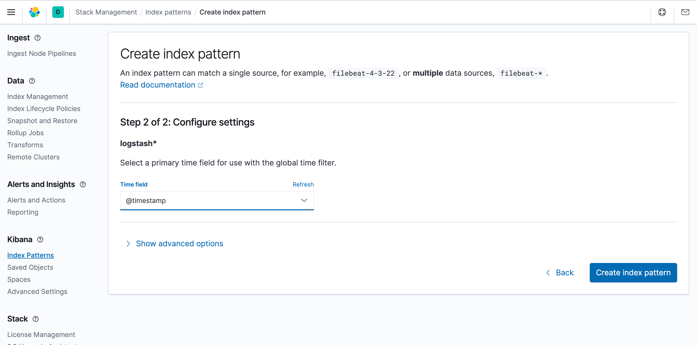
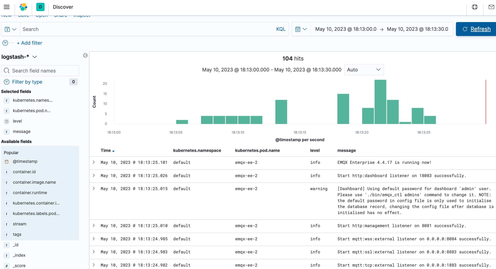

# KubernetesでEMQXログを収集する

## タスク対象

ELKを使用してEMQXクラスターのログを収集します。

## ELKのデプロイ

ELKはElasticsearch、Logstash、Kibanaという3つのオープンソースフレームワークの頭文字を取った略称で、Elastic Stackとも呼ばれます。[Elasticsearch](https://www.elastic.co/elasticsearch/)はLuceneをベースにしたほぼリアルタイム検索プラットフォームフレームワークで、分散型かつRestfulを通じてインタラクティブに利用でき、esとも呼ばれます。[Logstash](https://www.elastic.co/logstash/)はELKの中央データフローエンジンで、異なるターゲット（ファイル／データストレージ／MQ）から異なるフォーマットのデータを収集し、フィルタリング後に異なる宛先（ファイル／MQ／redis／elasticsearch／kafkaなど）へ出力することをサポートします。[Kibana](https://www.elastic.co/kibana/)はesのデータをページ上に表示し、リアルタイム分析機能を提供します。

### シングルノードElasticsearchのデプロイ

シングルノードElasticsearchのデプロイ方法は比較的簡単です。以下のYAMLオーケストレーションファイルを参照して、Elasticsearchクラスターを素早くデプロイできます。

- 以下の内容をYAMLファイルとして保存し、`kubectl apply`コマンドでデプロイします。

  ```yaml
  ---
  apiVersion: v1
  kind: Service
  metadata:
    name: elasticsearch-logging
    namespace: kube-logging
    labels:
      k8s-app: elasticsearch
      kubernetes.io/cluster-service: "true"
      addonmanager.kubernetes.io/mode: Reconcile
  spec:
    ports:
    - port: 9200
      protocol: TCP
      targetPort: db
    selector:
      k8s-app: elasticsearch
  ---
  apiVersion: v1
  kind: ServiceAccount
  metadata:
    name: elasticsearch-logging
    namespace: kube-logging
    labels:
      k8s-app: elasticsearch
      kubernetes.io/cluster-service: "true"
      addonmanager.kubernetes.io/mode: Reconcile
  ---
  kind: ClusterRole
  apiVersion: rbac.authorization.k8s.io/v1
  metadata:
    name: elasticsearch-logging
    labels:
      k8s-app: elasticsearch
      kubernetes.io/cluster-service: "true"
      addonmanager.kubernetes.io/mode: Reconcile
  rules:
  - apiGroups:
    - ""
    resources:
    - "services"
    - "namespaces"
    - "endpoints"
    verbs:
    - "get"
  ---
  kind: ClusterRoleBinding
  apiVersion: rbac.authorization.k8s.io/v1
  metadata:
    namespace: kube-logging
    name: elasticsearch-logging
    labels:
      k8s-app: elasticsearch
      kubernetes.io/cluster-service: "true"
      addonmanager.kubernetes.io/mode: Reconcile
  subjects:
  - kind: ServiceAccount
    name: elasticsearch-logging
    namespace: kube-logging
    apiGroup: ""
  roleRef:
    kind: ClusterRole
    name: elasticsearch
    apiGroup: ""
  ---
  apiVersion: apps/v1
  kind: StatefulSet
  metadata:
    name: elasticsearch-logging
    namespace: kube-logging
    labels:
      k8s-app: elasticsearch
      kubernetes.io/cluster-service: "true"
      addonmanager.kubernetes.io/mode: Reconcile
  spec:
    serviceName: elasticsearch-logging
    replicas: 1
    selector:
      matchLabels:
        k8s-app: elasticsearch
    template:
      metadata:
        labels:
          k8s-app: elasticsearch
      spec:
        serviceAccountName: elasticsearch-logging
        containers:
        - image: docker.io/library/elasticsearch:7.9.3
          name: elasticsearch-logging
          limits:
            cpu: 1000m
            memory: 1Gi
          requests:
            cpu: 100m
            memory: 500Mi
          ports:
          - containerPort: 9200
            name: db
            protocol: TCP
          - containerPort: 9300
            name: transport
            protocol: TCP
          volumeMounts:
          - name: elasticsearch-logging
            mountPath: /usr/share/elasticsearch/data/
          env:
          - name: "NAMESPACE"
            valueFrom:
              fieldRef:
                fieldPath: metadata.namespace
          - name: "discovery.type"
            value: "single-node"
          - name: ES_JAVA_OPTS
            value: "-Xms512m -Xmx2g"
        # Elasticsearchはvm.max_map_countを少なくとも262144に設定する必要があります。
        # OSで既にこれ以上の値が設定されている場合は、このinitコンテナは削除して構いません。
        initContainers:
        - name: elasticsearch-logging-init
          image: alpine:3.6
          command: ["/sbin/sysctl", "-w", "vm.max_map_count=262144"]
          securityContext:
            privileged: true
        - name: increase-fd-ulimit
          image: busybox
          imagePullPolicy: IfNotPresent
          command: ["sh", "-c", "ulimit -n 65536"]
          securityContext:
            privileged: true
        - name: elasticsearch-volume-init
          image: alpine:3.6
          command:
            -chmod
            - -R
            - "777"
            - /usr/share/elasticsearch/data/
          volumeMounts:
          - name: elasticsearch-logging
            mountPath: /usr/share/elasticsearch/data/
    volumeClaimTemplates:
    - metadata:
        name: elasticsearch-logging
      spec:
        storageClassName: ${storageClassName}
        accessModes: [ "ReadWriteOnce" ]
        resources:
          requests:
            storage: 10Gi
  ```
  > `storageClassName`フィールドは`StorageClass`の名前を示します。`kubectl get storageclass`コマンドでKubernetesクラスターに既存のStorageClassを確認するか、必要に応じてStorageClassを作成してください。

- Elasticsearchが準備完了になるまで待ちます。`kubectl get`コマンドでesのPodの状態を確認し、`STATUS`が`Running`であることを確認してください。

  ```bash
  $ kubectl get pod -n kube-logging -l "k8s-app=elasticsearch"
  NAME                        READY   STATUS             RESTARTS   AGE
  elasticsearch-0             1/1     Running            0          16m
  ```

### Kibanaのデプロイ

本記事では`Deployment`を使ってKibanaをデプロイし、収集したログを可視化します。`Service`は`NodePort`を使用します。

- 以下の内容をYAMLファイルとして保存し、`kubectl apply`コマンドでデプロイします。

  ```yaml
  ---
  apiVersion: v1
  kind: Service
  metadata:
    name: kibana
    namespace: kube-logging
    labels:
      k8s-app: kibana
  spec:
    type: NodePort
    ports:
    - port: 5601
      nodePort: 35601
      protocol: TCP
      targetPort: ui
    selector:
      k8s-app: kibana
  ---
  apiVersion: apps/v1
  kind: Deployment
  metadata:
    name: kibana
    namespace: kube-logging
    labels:
      k8s-app: kibana
      kubernetes.io/cluster-service: "true"
      addonmanager.kubernetes.io/mode: Reconcile
  spec:
    replicas: 1
    selector:
      matchLabels:
        k8s-app: kibana
    template:
      metadata:
        labels:
          k8s-app: kibana
        annotations:
          seccomp.security.alpha.kubernetes.io/pod: 'docker/default'
      spec:
        containers:
        - name: kibana
          image: docker.io/kubeimages/kibana:7.9.3
          resources:
            limits:
              cpu: 1000m
            requests:
              cpu: 100m
          env:
            # ESのアクセス先アドレス
            - name: ELASTICSEARCH_HOSTS
              value: http://elasticsearch-logging:9200
          ports:
          - containerPort: 5601
            name: ui
            protocol: TCP
  ```

- Kibanaが準備完了になるまで待ちます。`kubectl get`コマンドでKibanaのPodの状態を確認し、`STATUS`が`Running`であることを確認してください。

  ```bash
  $ kubectl get pod -n kube-logging -l "k8s-app=kibana"
  NAME                        READY   STATUS             RESTARTS   AGE
  kibana-b7d98644-48gtm       1/1     Running            0          17m
  ```

  最後にブラウザで`http://{node_ip}:35601`にアクセスすると、KibanaのWebインターフェースに入れます。

### Filebeatのデプロイ

[Filebeat](https://www.elastic.co/beats/filebeat)は軽量なログ収集コンポーネントで、Elastic Stackの一部です。Logstash、Elasticsearch、Kibanaとシームレスに連携できます。ログを変換・強化したり、Elasticsearchでデータ分析を行ったり、Kibanaでダッシュボードを作成・共有したりする際に、Filebeatはデータを必要な場所に簡単に届けます。

- 以下の内容をYAMLファイルとして保存し、`kubectl apply`コマンドでデプロイします。

  ```yaml
  ---
  apiVersion: v1
  kind: ConfigMap
  metadata:
    name: filebeat-config
    namespace: kube-system
    labels:
      k8s-app: filebeat
  data:
    filebeat.yml: |-
      filebeat.inputs:
      - type: container
        paths:
          # ホスト上のEMQXコンテナのログパス
          - /var/log/containers/^emqx.*.log
        processors:
          - add_kubernetes_metadata:
              host: ${NODE_NAME}
              matchers:
              - logs_path:
                  logs_path: "/var/log/containers/"
      output.logstash:
        hosts: ["logstash:5044"]
        enabled: true
  ---
  apiVersion: v1
  kind: ServiceAccount
  metadata:
    name: filebeat
    namespace: kube-logging
    labels:
      k8s-app: filebeat
  ---
  apiVersion: rbac.authorization.k8s.io/v1beta1
  kind: ClusterRole
  metadata:
    name: filebeat
    labels:
      k8s-app: filebeat
  rules:
  - apiGroups: [""]
    resources:
    - namespaces
    - pods
    verbs:
    - get
    - watch
    - list
  ---
  apiVersion: rbac.authorization.k8s.io/v1beta1
  kind: ClusterRoleBinding
  metadata:
    name: filebeat
  subjects:
  - kind: ServiceAccount
    name: filebeat
    namespace: kube-logging
  roleRef:
    kind: ClusterRole
    name: filebeat
    apiGroup: rbac.authorization.k8s.io
  ---
  apiVersion: apps/v1
  kind: DaemonSet
  metadata:
    name: filebeat
    namespace: kube-logging
    labels:
      k8s-app: filebeat
  spec:
    selector:
      matchLabels:
        k8s-app: filebeat
    template:
      metadata:
        labels:
          k8s-app: filebeat
      spec:
        serviceAccountName: filebeat
        terminationGracePeriodSeconds: 30
        containers:
        - name: filebeat
          image: docker.io/kubeimages/filebeat:7.9.3
          args: [
            "-c", "/etc/filebeat.yml",
            "-e","-httpprof","0.0.0.0:6060"
          ]
          env:
          - name: NODE_NAME
            valueFrom:
              fieldRef:
                fieldPath: spec.nodeName
          - name: ELASTICSEARCH_HOST
            value: elasticsearch
          - name: ELASTICSEARCH_PORT
            value: "9200"
          securityContext:
            runAsUser: 0
          resources:
            limits:
              memory: 1000Mi
              cpu: 1000m
            requests:
              memory: 100Mi
              cpu: 100m
          volumeMounts:
          - name: config
            mountPath: /etc/filebeat.yml
            readOnly: true
            subPath: filebeat.yml
          - name: data
            mountPath: /usr/share/filebeat/data
          - name: varlibdockercontainers
            mountPath: /data/var/
            readOnly: true
          - name: varlog
            mountPath: /var/log/
            readOnly: true
          - name: timezone
            mountPath: /etc/localtime
        volumes:
        - name: config
          configMap:
            defaultMode: 0600
            name: filebeat-config
        - name: varlibdockercontainers
          hostPath:
            path: /data/var/
        - name: varlog
          hostPath:
            path: /var/log/
        - name: inputs
          configMap:
            defaultMode: 0600
            name: filebeat-inputs
        - name: data
          hostPath:
            path: /data/filebeat-data
            type: DirectoryOrCreate
        - name: timezone
          hostPath:
            path: /etc/localtime
  ```

- Filebeatが準備完了になるまで待ちます。`kubectl get`コマンドでFilebeatのPodの状態を確認し、`STATUS`が`Running`であることを確認してください。

  ```bash
  $ kubectl get pod -n kube-logging -l "k8s-app=filebeat"
  NAME             READY   STATUS    RESTARTS   AGE
  filebeat-82d2b   1/1     Running   0          45m
  filebeat-vwrjn   1/1     Running   0          45m
  ```

### Logstashのデプロイ

主にビジネスニーズやログの二次利用に対応するために、Logstashを追加してログのクレンジングを行います。本記事ではLogstashの[Beats Inputプラグイン](https://www.elastic.co/guide/en/logstash/current/plugins-inputs-beats.html)を使ってログを収集し、[Rubyフィルタープラグイン](https://www.elastic.co/guide/en/logstash/current/plugins-filters-ruby.html)でログをフィルタリングします。Logstashは他にも多くの入力およびフィルタープラグインを提供しており、ビジネスニーズに応じて適切なプラグインを設定可能です。

- 以下の内容をYAMLファイルとして保存し、`kubectl apply`コマンドでデプロイします。

  ```yaml
  ---
  apiVersion: v1
  kind: Service
  metadata:
    name: logstash
    namespace: kube-system
  spec:
    ports:
    - port: 5044
      targetPort: beats
    selector:
      k8s-app: logstash
    clusterIP: None
  ---
  apiVersion: apps/v1
  kind: Deployment
  metadata:
    name: logstash
    namespace: kube-system
  spec:
    selector:
      matchLabels:
        k8s-app: logstash
    template:
      metadata:
        labels:
          k8s-app: logstash
      spec:
        containers:
        - image: docker.io/kubeimages/logstash:7.9.3
          name: logstash
          ports:
          - containerPort: 5044
            name: beats
          command:
          - logstash
          - '-f'
          - '/etc/logstash_c/logstash.conf'
          env:
          - name: "XPACK_MONITORING_ELASTICSEARCH_HOSTS"
            value: "http://elasticsearch-logging:9200"
          volumeMounts:
          - name: config-volume
            mountPath: /etc/logstash_c/
          - name: config-yml-volume
            mountPath: /usr/share/logstash/config/
          - name: timezone
            mountPath: /etc/localtime
          resources:
            limits:
              cpu: 1000m
              memory: 2048Mi
            requests:
              cpu: 512m
              memory: 512Mi
        volumes:
        - name: config-volume
          configMap:
            name: logstash-conf
            items:
            - key: logstash.conf
              path: logstash.conf
        - name: timezone
          hostPath:
            path: /etc/localtime
        - name: config-yml-volume
          configMap:
            name: logstash-yml
            items:
            - key: logstash.yml
              path: logstash.yml
  ---
  apiVersion: v1
  kind: ConfigMap
  metadata:
    name: logstash-conf
    namespace: kube-logging
    labels:
      k8s-app: logstash
  data:
    logstash.conf: |-
      input {
        beats {
          port => 5044
        }
      }
      filter {
        ruby {
          code => "
            ss = event.get('message').split(' ')
            len = ss.length()
            level = ''
            index = ''
            msg = ''
            if len == 0 || len < 2
              event.set('level','invalid')
              return
            end
            if ss[1][0] == '['
              l = ss[1].length()
              level = ss[1][1..l-2]
              index = 2
            else
              level = 'info'
              index = 0
            end
            event.set('level',level)
            for i in ss[index..len]
              msg = msg + i
              msg = msg + ' '
            end
            event.set('message',msg)
          "
        }
        if [level] == "invalid" {
          drop {}
        }
      }
      output {
        elasticsearch {
          hosts => ["http://elasticsearch-logging:9200"]
          codec => json
          index => "logstash-%{+YYYY.MM.dd}"
        }
      }
  ---
  apiVersion: v1
  kind: ConfigMap
  metadata:
    name: logstash
    namespace: kube-logging
    labels:
      k8s-app: logstash
  data:
    logstash.yml: |-
      http.host: "0.0.0.0"
      xpack.monitoring.elasticsearch.hosts: http://elasticsearch-logging:9200
  ```

- Logstashが準備完了になるまで待ちます。`kubectl get`コマンドでLogstashのPodの状態を確認し、`STATUS`が`Running`であることを確認してください。

  ```bash
  $ kubectl get pod -n kube-logging -l "k8s-app=logstash"
  NAME             READY   STATUS    RESTARTS   AGE
  filebeat-82d2b   1/1     Running   0          45m
  filebeat-vwrjn   1/1     Running   0          45m
  ```

## EMQXクラスターのデプロイ

EMQXクラスターのデプロイについては、ドキュメント[Deploy EMQX](../getting-started.md)を参照してください。

## ログ収集の検証

- まずKibanaのインターフェースにログインし、メニューのスタック管理モジュールを開き、インデックス管理をクリックすると、すでに収集されたログインデックスが確認できます。

  

- Kibanaでログを検出・閲覧できるようにするため、インデックスマッチを設定します。インデックスパターンを選択し、Createをクリックします。

  

  

- 最後にEMQXクラスターのログが収集されているかを確認します。

  
