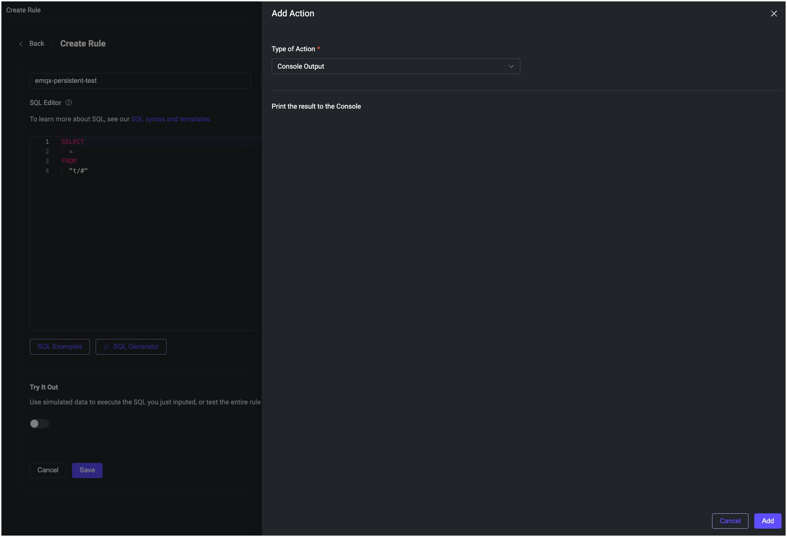
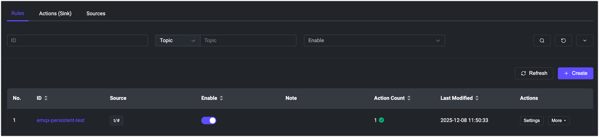

# EMQXクラスターでのパーシステンス有効化

## 目的

<<<<<<< HEAD
`volumeClaimTemplates` フィールドを使用して、EMQXクラスターのコアノード群のパーシステンスを構成します。

## EMQXクラスターのパーシステンス設定

EMQX CRD `apps.emqx.io/v2` は、`.spec.coreTemplate.spec.volumeClaimTemplates` を通じて各コアノードのデータパーシステンスを設定することをサポートしています。

`.spec.coreTemplate.spec.volumeClaimTemplates` フィールドの定義と意味は、Kubernetes APIで定義されている `PersistentVolumeClaimSpec` と一致しています。

`.spec.coreTemplate.spec.volumeClaimTemplates` フィールドを指定すると、EMQXオペレーターはEMQXコンテナの `/opt/emqx/data` ボリュームをPersistent Volume Claim（PVC）でバックアップするように設定します。PVCは指定された[StorageClass](https://kubernetes.io/docs/concepts/storage/storage-classes/)を使用してPersistent Volume（PV）をプロビジョニングします。その結果、EMQX Podが削除されても、関連するPVおよびPVCは保持され、EMQXのランタイムデータが保存されます。

PVおよびPVCの詳細については、[Persistent Volumes](https://kubernetes.io/docs/concepts/storage/persistent-volumes/)のドキュメントを参照してください。

1. 以下の内容をYAMLファイルとして保存し、`kubectl apply` でデプロイします。

   ```yaml
   apiVersion: apps.emqx.io/v2
=======
EMQXクラスターのCoreノード群に対して、`volumeClaimTemplates`フィールドを通じてパーシステンスを設定します。

## EMQXクラスターのパーシステンス設定

EMQX CRD `apps.emqx.io/v2beta1` は、各Coreノードのデータのパーシステンスを `.spec.coreTemplate.spec.volumeClaimTemplates` で設定することをサポートしています。

`.spec.coreTemplate.spec.volumeClaimTemplates` フィールドの定義と意味は、Kubernetes APIで定義されている `PersistentVolumeClaimSpec` と一致しています。

`.spec.coreTemplate.spec.volumeClaimTemplates` フィールドを指定すると、EMQXオペレーターはEMQXコンテナの `/opt/emqx/data` ボリュームをPersistent Volume Claim（PVC）でバックアップするように設定します。PVCは指定された[StorageClass](https://kubernetes.io/docs/concepts/storage/storage-classes/)を利用してPersistent Volume（PV）をプロビジョニングします。その結果、EMQX Podが削除されても、関連付けられたPVおよびPVCは保持され、EMQXのランタイムデータが保存されます。

PVおよびPVCの詳細については、[Persistent Volumes](https://kubernetes.io/docs/concepts/storage/persistent-volumes/)のドキュメントを参照してください。

1. 以下の内容をYAMLファイルとして保存し、`kubectl apply`でデプロイします。

   ```yaml
   apiVersion: apps.emqx.io/v2beta1
>>>>>>> origin/release-6.1
   kind: EMQX
   metadata:
     name: emqx
   spec:
     image: emqx/emqx:@EE_VERSION@
     config:
       data: |
         license {
           key = "..."
         }
     coreTemplate:
       spec:
         volumeClaimTemplates:
           storageClassName: standard
           resources:
             requests:
<<<<<<< HEAD
               storage: 1Gi
=======
               storage: 20Mi
>>>>>>> origin/release-6.1
           accessModes:
             - ReadWriteOnce
         replicas: 3
     listenersServiceTemplate:
       spec:
         type: LoadBalancer
     dashboardServiceTemplate:
       spec:
         type: LoadBalancer
   ```

   ::: tip

<<<<<<< HEAD
   `storageClassName` フィールドを使用して、EMQXデータに適した[StorageClass](https://kubernetes.io/docs/concepts/storage/storage-classes/)を選択してください。`kubectl get storageclass` を実行すると、Kubernetesクラスター内に既存のStorageClassが一覧表示されます。必要に応じてStorageClassを作成してください。

   :::

2. EMQXクラスターが準備完了になるまで待ちます。

   `kubectl get` コマンドでEMQXクラスターのステータスを確認し、`STATUS` が `Ready` になっていることを確認してください。準備完了までに時間がかかる場合があります。
=======
   `storageClassName` フィールドを使って、EMQXデータに適した[StorageClass](https://kubernetes.io/docs/concepts/storage/storage-classes/)を選択してください。`kubectl get storageclass` コマンドでKubernetesクラスター内に存在するStorageClassを一覧表示できます。またはニーズに応じてStorageClassを作成してください。

   :::

2. EMQXクラスターが準備完了になるまで待機します。

   `kubectl get` コマンドでEMQXクラスターの状態を確認し、`STATUS`が`Ready`になっていることを確認してください。準備完了までに時間がかかる場合があります。
>>>>>>> origin/release-6.1

   ```bash
   $ kubectl get emqx emqx
   NAME   STATUS   AGE
   emqx   Ready    10m
   ```

## パーシステンスの検証

1. EMQXダッシュボードでテスト用のルールを作成します。

   ```bash
   external_ip=$(kubectl get svc emqx-dashboard -o json | jq -r '.status.loadBalancer.ingress[0].ip')
   ```

<<<<<<< HEAD
   - `http://${external_ip}:18083` にアクセスしてEMQXダッシュボードにログインします。

   - **Integration** -> **Rules** に移動し、新しいルールを作成します。

   - 簡単なアクションをこのルールに追加します。
=======
   - ブラウザで `http://${external_ip}:18083` にアクセスし、EMQXダッシュボードにログインします。

   - **Integration** -> **Rules** に移動し、新しいルールを作成します。

   - このルールにシンプルなアクションを追加します。
>>>>>>> origin/release-6.1

   - **Save** をクリックしてルールを生成します。以下の図のように表示されます。

     

<<<<<<< HEAD
     ルールが正常に作成されると、ページに `emqx-persistent-test` IDの対応するレコードが表示されます。以下の図を参照してください。

     

2. 既存のEMQXクラスターを削除します。

   以前にクラスターをデプロイした際に使用したファイル（例：`emqx.yaml`）を指定して、以下のコマンドを実行しEMQXクラスターを削除します。
=======
   ルールが正常に作成されると、`emqx-persistent-test` IDを持つ対応するレコードがページに表示されます。以下の図を参照してください。

   

2. 既存のEMQXクラスターを削除します。

   以前にクラスターをデプロイした際に使用したファイル（ここでは`emqx.yaml`）を指定して、以下のコマンドを実行します。
>>>>>>> origin/release-6.1

   ```bash
   $ kubectl delete -f emqx.yaml
   emqx.apps.emqx.io "emqx" deleted
   ```

3. EMQXクラスターを再デプロイします。

<<<<<<< HEAD
   以下のコマンドを実行してEMQXクラスターを再デプロイします。
=======
   以下のコマンドでEMQXクラスターを再デプロイしてください。
>>>>>>> origin/release-6.1

   ```bash
   $ kubectl apply -f emqx.yaml
   emqx.apps.emqx.io/emqx created
   ```

<<<<<<< HEAD
4. EMQXクラスターが準備完了になるまで待ちます。ブラウザでEMQXダッシュボードにアクセスし、以前作成したルールが残っていることを確認します。以下の図のように表示されます。
=======
4. EMQXクラスターが準備完了になるまで待機し、ブラウザでEMQXダッシュボードにアクセスして、以前作成したルールが残っていることを確認します。以下の図のように表示されます。
>>>>>>> origin/release-6.1

   

   古いクラスターで作成した `emqx-persistent-test` ルールが新しいクラスターにも存在していることから、パーシステンス設定が正しく機能していることが確認できます。
