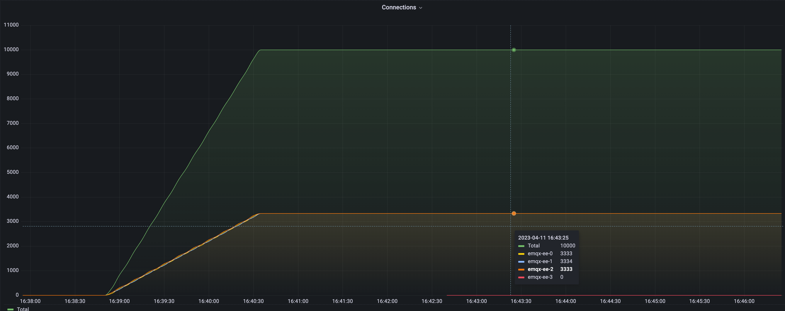
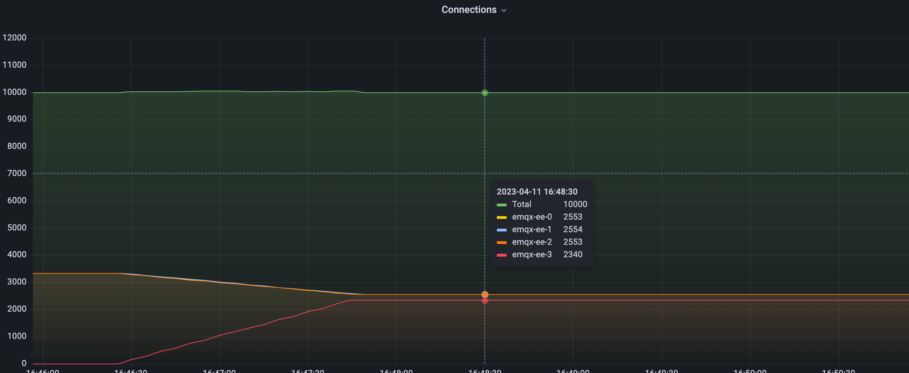

# クラスター負荷リバランス（EMQX Enterprise）

## タスク対象

MQTT接続のリバランス方法。

## なぜ負荷リバランスが必要か

クラスター負荷リバランスとは、クライアント接続およびセッションをあるノード群から別のノード群へ強制的に移行する操作です。ノード間のバランスを取るために移行すべき接続数を自動計算し、高負荷ノードから低負荷ノードへ対応する数の接続およびセッションを移行することで、ノード間の負荷分散を実現します。この操作は通常、新しいノードの参加やノードの再起動後にバランスを取るために必要となります。

リバランスの価値は主に以下の2点です：

- **システムのスケーラビリティ向上**：MQTT接続は永続的な性質を持つため、クラスターのスケールアウト時に既存ノードへの接続が自動的に新ノードへ移行しません。これを解決するために、負荷リバランス機能を使って過負荷ノードから新規追加ノードへ接続をスムーズに移行できます。このプロセスにより、クラスター全体の負荷分散が均等化され、スループット、応答速度、リソース利用率が向上します。
- **運用コスト削減**：負荷が偏っているクラスターでは、一部のノードに過負荷がかかり、他のノードがアイドル状態になることがあります。負荷リバランス機能を使うことでクラスター内の負荷を自動調整し、作業負荷の均等化を図ることで運用コストを削減できます。

EMQXクラスターの負荷リバランスについては、以下のドキュメントを参照してください：[Rebalancing](../../../cluster/rebalancing.md)

## 負荷リバランスの使い方

EMQX Operatorにおけるクラスターリバランスの対応CRDは`Rebalance`であり、その例は以下の通りです：

```yaml
apiVersion: apps.emqx.io/v2beta1
kind: Rebalance
metadata:
   name: rebalance-sample
spec:
   instanceName: emqx-ee
   rebalanceStrategy:
     connEvictRate: 10
     sessEvictRate: 10
     waitTakeover: 10
     waitHealthCheck: 10
     absConnThreshold: 100
     absSessThreshold: 100
     relConnThreshold: "1.1"
     relSessThreshold: "1.1"
```

> Rebalance設定については、以下のドキュメントを参照してください：[Rebalance reference](../api-reference.md#rebalancestrategy)。

## 負荷リバランスのテスト

### リバランス前のクラスター負荷分布

リバランス前に、負荷が偏ったクラスターを構築し、Grafana + PrometheusでEMQXクラスターの負荷を監視しました：



図から、現在のクラスターには4つのEMQXノードがあり、そのうち3つは10,000接続を保持し、残りの1つは0接続であることがわかります。次に、4つのノードの負荷が均等になるようにリバランス操作を実施する方法を示します。

- Rebalanceタスクの提出

```yaml
apiVersion: apps.emqx.io/v1beta4
kind: Rebalance
metadata:
   name: rebalance-sample
spec:
   instanceName: emqx-ee
   instanceKind: EmqxEnterprise
   rebalanceStrategy:
     connEvictRate: 10
     sessEvictRate: 10
     waitTakeover: 10
     waitHealthCheck: 10
     absConnThreshold: 100
     absSessThreshold: 100
     relConnThreshold: "1.1"
     relSessThreshold: "1.1"
```

上記内容を`rebalance.yaml`として保存し、以下のコマンドでRebalanceタスクを提出します：

```bash
$ kubectl apply -f rebalance.yaml
rebalance.apps.emqx.io/rebalance-sample created
```

以下のコマンドでEMQXクラスターのリバランス状況を確認します：

```bash
$ kubectl get rebalances rebalance-sample -o json | jq '.status.rebalanceStates'
{
     "state": "wait_health_check",
     "session_eviction_rate": 10,
     "recipients":[
         "emqx-ee@emqx-ee-3.emqx-ee-headless.default.svc.cluster.local",
     ],
     "node": "emqx-ee@emqx-ee-0.emqx-ee-headless.default.svc.cluster.local",
     "donors":[
         "emqx-ee@emqx-ee-0.emqx-ee-headless.default.svc.cluster.local",
         "emqx-ee@emqx-ee-1.emqx-ee-headless.default.svc.cluster.local",
         "emqx-ee@emqx-ee-2.emqx-ee-headless.default.svc.cluster.local"
     ],
     "coordinator_node": "emqx-ee@emqx-ee-0.emqx-ee-headless.default.svc.cluster.local",
     "connection_eviction_rate": 10
}
```
> `rebalanceStates`フィールドの詳細な説明は、以下のドキュメントを参照してください：[rebalanceStates reference](../api-reference.md#rebalancestate)。

Rebalanceタスクの完了を待ちます：

```bash
$ kubectl get rebalances rebalance-sample
NAME               STATUS      AGE
rebalance-sample   Completed   62s
```

> Rebalanceには3つの状態があります：Processing、Completed、Failed。Processingはリバランスタスクが進行中であること、Completedはリバランスタスクが完了したこと、Failedはリバランスタスクが失敗したことを示します。

### リバランス後のクラスター負荷分布



上図はRebalance完了後のクラスター負荷を示しています。グラフから、リバランス処理が非常にスムーズに行われたことがわかります。データによると、クラスター内の接続総数は依然として10,000であり、リバランス前と一致しています。4つのノードの接続数は変化しており、3つのノードの一部接続が新たに拡張されたノードへ移行されました。リバランス後は4つのノードの負荷が安定し、接続数は約2,500前後で変動しません。

クラスターがバランス状態にある条件は以下の通りです：

```
avg(ソースノードの接続数) < avg(ターゲットノードの接続数) + abs_conn_threshold
または
avg(ソースノードの接続数) < avg(ターゲットノードの接続数) * rel_conn_threshold
```

設定したRebalanceパラメータと接続数を代入すると、`avg(2553 + 2553 + 2554) < 2340 * 1.1`となり、現在のクラスターはバランス状態に達していることがわかります。これにより、Rebalanceタスクはクラスター負荷のリバランスに成功しました。
