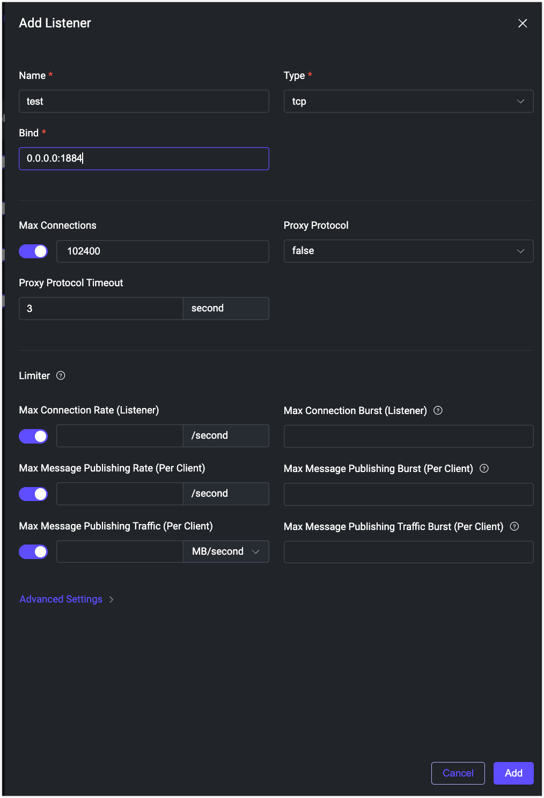
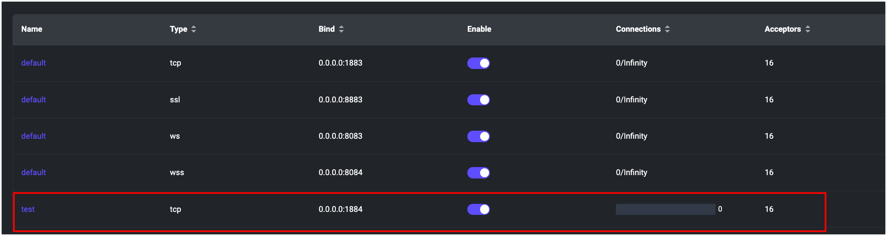

# LoadBalancer経由でEMQXクラスターにアクセスする

## 目的

LoadBalancerタイプのServiceを介してEMQXクラスターにアクセスします。

## EMQXクラスターの設定

EMQX CRD `apps.emqx.io/v2beta1` は以下をサポートしています：
* `.spec.dashboardServiceTemplate` を通じたEMQXダッシュボードServiceの設定
* `.spec.listenersServiceTemplate` を通じたEMQXクラスターリスナーServiceの設定

詳細は[該当ドキュメント](../reference/v2beta1-reference.md#emqxspec)を参照してください。

1. 以下の内容をYAMLファイルとして保存し、`kubectl apply`でデプロイします。

   ```yaml
   apiVersion: apps.emqx.io/v2beta1
   kind: EMQX
   metadata:
     name: emqx
   spec:
     image: emqx/emqx:@EE_VERSION@
     config:
       data: |
         license {
           key = "..."
         }
     listenersServiceTemplate:
       spec:
         type: LoadBalancer
     dashboardServiceTemplate:
       spec:
         type: LoadBalancer
   ```

   ::: tip

   デフォルトで、EMQXはポート1883でMQTT TCPリスナー `tcp-default` を、ポート18083でダッシュボードHTTPリスナーを起動します。

   ユーザーは `.spec.config.data` を通じて新規または既存のリスナーを設定するか、EMQXダッシュボードから管理できます。

   EMQX Operatorはデフォルトのリスナー情報をServiceリソースに自動反映します。ユーザーが設定したServiceとEMQXが設定したリスナーで名前やポートが重複する場合、EMQX Operatorはユーザー設定を優先します。

   :::

2. EMQXクラスターが準備完了になるまで待ちます。

   `kubectl get` でEMQXクラスターの状態を確認し、`STATUS` が `Ready` となっていることを確認してください。完了までに時間がかかる場合があります。

   ```bash
   $ kubectl get emqx emqx
   NAME   STATUS   AGE
   emqx   Ready    10m
   ```

## EMQXダッシュボードから新しいリスナーを追加する

1. 新しいリスナーを追加します。

   - EMQXダッシュボードを開き、**Management** -> **Listeners** に移動します。

   - **Add Listener** をクリックし、名前を `test`、ポートを `1884` に設定して新しいリスナーを追加します。以下の図を参照してください：

     

   - **Add** をクリックしてリスナーを作成します。以下の図のように、新しいリスナーが作成されます。

     

2. 新しいリスナーがServiceに反映されているか確認します。

   ```bash
   kubectl get svc
   
   NAME             TYPE       CLUSTER-IP       EXTERNAL-IP   PORT(S)                                         AGE
   emqx-dashboard   NodePort   10.105.110.235   <none>        18083:32012/TCP                                 13m
   emqx-listeners   NodePort   10.106.1.58      <none>        1883:32010/TCP,1884:30763/TCP                   12m
   ```

   この出力から、ポート1884の新しいリスナーが `emqx-listeners` Serviceリソースに反映されていることがわかります。

## MQTTXを使って新しいリスナーに接続する

1. EMQXリスナーServiceの外部IPを取得します。

   ```bash
   external_ip=$(kubectl get svc emqx-listeners -o json | jq -r '.status.loadBalancer.ingress[0].ip')
   ```

2. MQTTX CLIで新しいリスナーに接続します。

   ```bash
   $ mqttx conn -h ${external_ip} -p 1884
   
   [4/17/2023] [5:17:31 PM] › … Connecting...
   [4/17/2023] [5:17:31 PM] › ✔ Connected
   ```
