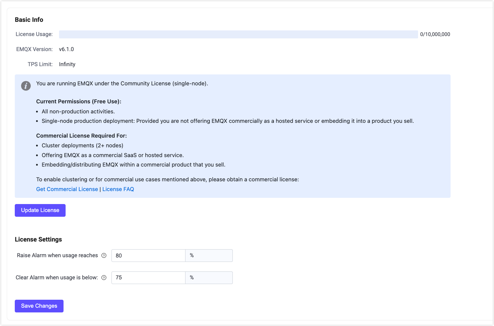

# EMQX Enterprise ライセンスの利用

EMQX 5.9 以降、EMQX は Business Source License (BSL) 1.1 のもとでリリースされており、オープンな開発を可能にしつつ、EMQX の商用利用を保護しています。

::: tip

ライセンス変更の詳細については、[EMQX ライセンス FAQ](https://www.emqx.com/en/content/license-faq) をご参照ください。

:::

インストールパッケージには、限定的な商用利用が許可された単一ノードの Community ライセンスが同梱されています。ただし、EMQX Enterprise を完全な商用利用およびクラスター展開で使用する場合は、商用ライセンスの取得が必須です。

本ページでは、商用ライセンスの取得および EMQX へのインポート手順をご案内します。

## ライセンスの申請

有効なライセンスキーを伴う商用ライセンスを申請するには、EMQ の営業担当者にご連絡いただくか、[お問い合わせ](https://www.emqx.com/en/contact?product=emqx&channel=apply-Licenses) ページのフォームに必要事項を入力してお申し込みください。営業担当者より折り返しご連絡いたします。

購入前に EMQX Enterprise を試用したい場合は、[トライアルライセンス申請ページ](https://www.emqx.com/en/apply-licenses/emqx) からトライアルライセンスを申請できます。申請後、ライセンスファイルが即座にメールで送付されます。

- トライアルライセンスの有効期限は15日間です。
- トライアルライセンスは最大10,000同時セッションをサポートします。

::: tip 注意

トライアル期間中は EMQX Enterprise の全機能が利用可能です。ただし、トライアル期間終了後はクラスタリング機能が無効になります。クラスタリング機能を継続利用するには商用ライセンスの購入が必要です。

トライアルライセンスの EMQX Enterprise は本番環境での利用を許可していません。

:::

トライアル期間の延長をご希望の場合は、営業部門までご連絡ください。

## ライセンス設定の更新と構成

ライセンスファイルの更新およびライセンス接続クォータ使用状況の設定は、EMQX ダッシュボード、コマンドラインインターフェース（CLI）、または設定ファイルから行えます。

### ダッシュボード

1. EMQX ダッシュボードの左側ナビゲーションメニューから **System** -> **License** をクリックします。ライセンスページの **Basic Info** セクションで、ライセンス接続クォータ使用状況、EMQX バージョン、発行情報などを確認できます。

2. **Update License** ボタンをクリックします。ポップアップダイアログにライセンスキーを貼り付け、**Save** をクリックしてください。ページ上のライセンス情報は送信後に自動で更新されます。

   新しいライセンスファイルが有効になったことを確認してください。

3. **License Settings** セクションでは、ライセンスセッションクォータ使用率のウォーターマーク閾値を設定できます。セッション制限の詳細は [セッション制限](#session-limits) を参照してください。

   - **Usage High Watermark**：ライセンスセッションクォータ使用率がこの割合を超えた場合にアラームを発生させる閾値を指定します。
   - **Usage Low Watermark**：ライセンスセッションクォータ使用率がこの割合を下回った場合にアラームを解除する閾値を指定します。

4. **Save Changes** をクリックしてライセンス設定を保存します。

   

#### Community ライセンスへの戻し方

EMQX ダッシュボードでは、デフォルトの単一ノード Community ライセンスに戻すことが可能です。**License** ページの **Remove License** ボタンをクリックし、ポップアップで確認すると現在のライセンスが削除されます。

::: tip 注意

クラスター モードではライセンスの削除はできません。クラスター モードで EMQX を使用している場合は、先にクラスターを解散する必要があります。

:::

Community ライセンスに戻した場合：

- 現在のライセンスはクリアされ、Community ライセンスに置き換えられます。
- 既存のクライアント接続は維持されます。

::: tip 注意

Community ライセンスは完全な商用利用を許可しておらず、単一ノード展開のみをサポートします。ライセンスを削除するとクラスター展開は無効になります。

:::

### CLI

以下のコマンドでも EMQX Enterprise ライセンスの更新が可能です。

```bash
./bin/emqx ctl 

    license info             # ライセンス情報を表示
    license update <License> # 文字列としてライセンスを更新
    license update default   # デフォルトの Community ライセンスに戻す
```

### 設定ファイル

設定ファイルでライセンスファイルを設定することもできます。設定後、[EMQX コマンドラインツール](../admin/cli.md) で `emqx ctl license reload` を実行してライセンスを再読み込みしてください。

```bash
license {
    ## ライセンスキー
    key = "MjIwMTExCjAKMTAKRXZhbHVhdGlvbgpjb250YWN0QGVtcXguaW8KZGVmYXVsdAoyMDIzMDEwOQoxODI1CjEwMAo=.MEUCIG62t8W15g05f1cKx3tA3YgJoR0dmyHOPCdbUxBGxgKKAiEAhHKh8dUwhU+OxNEaOn8mgRDtiT3R8RZooqy6dEsOmDI="
    ## ライセンス接続クォータ使用率アラーム解除の下限ウォーターマーク
    connection_low_watermark = "75%"

    ## ライセンス接続クォータ使用率アラーム発生の上限ウォーターマーク
    connection_high_watermark = "80%"
}
```

実行後、`emqx ctl license info` を実行して新しいライセンスファイルが有効になっていることを確認してください。

<!-- 環境変数 `EMQX_LICENSE__KEY` でライセンスを設定することも可能です。TODO 確認が必要 -->

## ライセンス制限

EMQX Enterprise ライセンスには、本番環境でのライセンス条件遵守を目的とした使用制限が含まれる場合があります。主な制限は以下の通りです。

- セッション制限
- TPS 制限（EMQX 6.0 以降）

### セッション制限

セッション制限は、現在のライセンスのもとで EMQX Enterprise がサポート可能な同時 MQTT クライアント接続（セッション）の最大数を定義します。

- 制限に達すると、新規接続は拒否されます。
- ライセンスクォータを超えたクライアントは、CONNACK 理由コード `151 (0x97)` の「Quota Exceeded」応答を受け取ります。
- セッション使用率が設定された上限ウォーターマークを超えるとアラームが発生します。
- 使用率が下限ウォーターマークを下回るとアラームは自動的に解除されます。

アラームのウォーターマークは EMQX ダッシュボードまたは設定ファイルで設定可能です。

### TPS 制限

EMQX 6.0 以降、ライセンスには TPS（Transactions Per Second：1秒あたりの処理メッセージ数）制限が含まれる場合があります。この制限はクラスター全体で処理される MQTT メッセージ（受信・送信両方）の合計に適用されます。

- TPS 使用率がライセンス制限を超えると EMQX はアラームを発生させます。
- アラームは観測されたピーク TPS を記録しますが、メッセージのトラフィックを制限することはありません。
- アラームは以下のいずれかの操作で解除されるまで継続します。
  - より高い TPS 制限の新しいライセンスが適用される
  - EMQX ダッシュボードまたは CLI から手動でアラームを解除する

この TPS 制限は厳密な制御ではなく、可視化とコンプライアンス目的で設計されています。

::: tip 注意

TPS 制限はライセンスに定義されており、ユーザーが設定や調整を行うことはできません。制限を引き上げるには、より高い TPS 値を持つ新しいライセンスを適用してください。

:::
