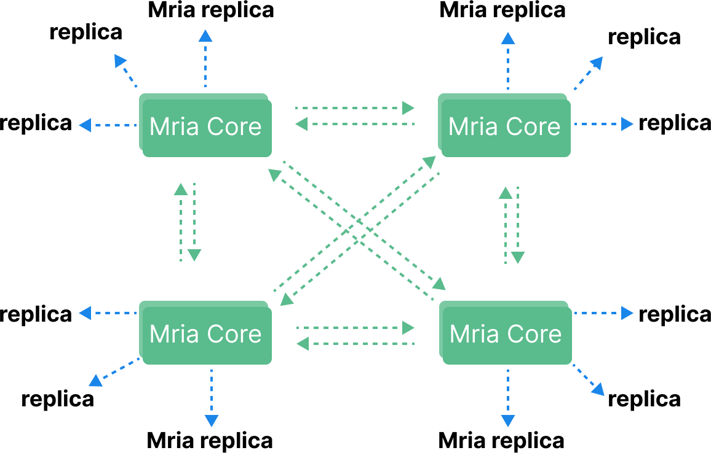

# EMQXクラスタリングの設計

MQTTはステートフルなプロトコルであり、ブローカーは各MQTTセッションの状態情報（サブスクライブされたトピックや未完了のメッセージ送信など）を保持する必要があります。MQTTブローカーのクラスタリングにおける主な課題の一つは、これらの状態をすべてのクラスタノード間で効率的かつ信頼性高く同期・複製することです。

EMQXは高いスケーラビリティとフォールトトレランスを備えたMQTTブローカーであり、複数ノードによるクラスタモードで動作可能です。EMQXのクラスタリングは、IoTメッセージングシステムのスケーラビリティ、可用性、信頼性、管理性を向上させるため、大規模またはミッションクリティカルな用途に推奨されるアプローチです。本ページでは、MQTTブローカーのクラスタリングの必要性とEMQXがどのようにそれを実現し、単一クラスタ内で数百万のユニークなワイルドカードサブスクライバーをサポート可能にしているかを解説します。

EMQX v5クラスタの作成および運用に関する詳細な手順は、[EMQX Cluster](../deploy/cluster/introduction.md)をご参照ください。

## クラスタリングの主要な側面

クラスタ設計において考慮すべき重要な側面はいくつかあります。これらはしばしばクラスタの成功を左右する最重要要素です。以下に簡単にまとめます。

* **集中管理**：クラスタ内のすべてのノードを単一の管理コンソールから監視・制御できるように、集中管理が可能であること。

* **データ整合性**：クラスタ内のすべてのノードがルーティング情報を一貫して保持できること。これはデータを全ノードに複製することで実現されます。

* **容易なスケールアウト**：クラスタ管理の複雑さを減らすため、新しいノードの追加が複雑でないこと。クラスタは新規ノードを自動検出し、クラスタに組み込めること。

* **クラスタのリバランス**：最小限の運用負荷で、各ノードの負荷アンバランスを検知し、負荷の少ないノードへワークロードを再割り当てできること。これにより、1台以上のノードが故障してもクラスタが継続稼働可能となります。

* **大規模クラスタ対応**：システムの需要増加に対応するため、ノードを追加してクラスタを水平スケール可能であること。

* **自動フェイルオーバー**：ノード障害時にクラスタが自動的に検知し、残りのノードにワークロードを再割り当てできること。

* **ネットワークパーティション耐性**：ネットワーク分断が発生してもクラスタが継続稼働可能であること。

以下のセクションで、これらのクラスタリングの主要側面について詳細に説明します。

## 集中管理

EMQXはクラスタ内のすべてのノードを単一の管理コンソールから監視・制御できるため、集中管理が可能です。これにより、多数のデバイスやメッセージの管理が容易になります。管理コンソールはウェブブラウザからアクセスでき、ユーザーフレンドリーなインターフェースを提供します。任意の`core`タイプノードが管理用HTTP APIのエンドポイントとして機能可能です（ノードタイプについては次のセクションで説明します）。

オンライン設定管理機能により、ノードの再起動なしにクラスタ内すべてのノードの設定変更が可能です。これは、ノードの追加や削除などクラスタ設定の変更時に特に有用です。

## データ整合性

MQTTブローカークラスタにおける最も重要な分散データ構造はルーティングテーブルであり、すべてのトピックのルーティング情報を格納します。ルーティングテーブルは、特定のトピックにパブリッシュされたメッセージをどのノードが受信すべきかを決定します。本節では、EMQXがクラスタ内のすべてのノード間でルーティングテーブルの整合性をどのように保証しているかを解説します。

EMQXクラスタは完全なACID（Atomicity, Consistency, Isolation, Durability）トランザクションを活用し、クラスタ内のすべての`core`ノード間でルーティングテーブルの整合性を確保します。また、`core`ノードから`replica`ノードへの非同期複製により、クラスタ全体で最終的に整合した状態を実現しています。

以下でEMQXのデータ整合性の詳細を見ていきましょう。

### データ複製チャネル

EMQXクラスタには2つのデータ複製チャネルがあります。

- メタデータ複製：どのノードがどの（ワイルドカード）トピックをサブスクライブしているかなどのルーティング情報。

- メッセージ配信：あるノードから別のノードへメッセージを転送する際の配信。

下図は、パブリッシュ・サブスクライブのフローにおける2つのデータ複製チャネルを示しています。点線はノード間のメタデータ複製を、実線の矢印はメッセージ配信チャネルを表します。


### EMQXノード間の通信

EMQXはErlang/OTPの組み込みデータベースであるMnesiaを用いてMQTTセッション状態を保存します。データベースおよびメッセージの複製を実現するために、Erlang分散プロトコルとカスタム分散プロトコルを利用してブローカー間のリモートプロシージャコールを行います。

データベース複製チャネルは「Erlang分散」プロトコルにより動作し、各ノードはクライアント兼サーバとして機能します。このプロトコルのデフォルトリッスンポートは4370です。

一方、メッセージ配信チャネルはコネクションプールを用い、各ノードはデフォルトでポート5370（Dockerコンテナ内では5369）をリッスンします。これはErlang分散プロトコルの単一コネクション方式とは異なります。

### ルーティングテーブルの複製

Mnesiaクラスタはフルメッシュトポロジーで設計されており、クラスタ内の各ノードは他のすべてのノードに接続し、常に生存確認を行います。


しかし、フルメッシュトポロジーはクラスタサイズに実用的な制限を課します。
EMQX 5.0未満のバージョンでは、クラスタサイズは5ノード未満に抑えることが推奨されます。
それ以上は、より高性能なマシンを用いる垂直スケールがクラスタの性能と安定性維持に適しています。

ベンチマーク環境では、[EMQX Enterprise 4.3で1,000万同時接続を達成](https://www.emqx.com/en/resources/emqx-v-4-3-0-ten-million-connections-performance-test-report)しています。

顧客からの本番環境の詳細報告は必須ではありませんが、共有された情報によると、最大規模の本番クラスタは7ノード構成です。

大規模Mnesiaクラスタ管理の大きな課題の一つはスプリットブレイン問題のリスクです。これはネットワークパーティションによりノードが複数のサブクラスタに分断され、それぞれが唯一のアクティブクラスタと誤認する状況です。大規模クラスタではネットワークオーバーヘッドがN^2の複雑度を持つため、高負荷時にノードの応答性が低下しやすく、Erlang分散チャネルのヘッドオブラインブロッキングによりハートビート送信が遅延し、スプリットブレインのリスクが増大します。

EMQX v5では、[Mria](https://github.com/emqx/mria)（非同期トランザクションログ複製を備えたMnesiaの拡張版）を導入し、クラスタのスケーラビリティを大幅に改善しました。Mriaは`core`と`replicant`（略して`replica`とも呼ばれる）という2種類のノードロールからなる新しいネットワークトポロジーを採用しています。



EMQX v5クラスタでは、`core`ノードは従来通りのフルメッシュネットワークを形成します。一方、`replicant`ノードは1つ以上の`core`ノードにのみ接続し、互いには接続しません。

### CoreノードとReplicantノード

Coreノードの動作は4.xのMnesiaノードと同様で、完全接続されたクラスタを形成し、各ノードはトランザクションの開始やロック保持などを行います。そのため、EMQX v5でもCoreノードは信頼性の高いデプロイが求められます。

Replicantノードはトランザクション処理に直接関与せず、Coreノードに接続してデータ更新を受動的に複製します。Replicantノードは書き込み操作を行わず、書き込みはCoreノードに委譲されます。また、ReplicantはCoreノードからのデータを完全にローカルに保持するため、読み取り操作の効率が最大化され、EMQXのルーティングレイテンシ削減に寄与します。

Replicantノードは書き込みに参加しないため、Replicantノードが増えても書き込み操作のレイテンシに影響しません。これにより、より大規模なEMQXクラスタの構築が可能となります。

パフォーマンス向上のため、無関係なデータの複製は独立したデータストリームに分割可能です。複数の関連データテーブルは同一のRLOGシャード（複製ログシャード）に割り当てられ、トランザクションはCoreノードからReplicantノードへ順次複製されますが、異なるRLOGシャード間は非同期です。

## 容易なスケールアウト

EMQXは水平スケールが容易にできる設計です。
CLI、API、またはダッシュボードからいつでもクラスタへのノード追加・削除が可能です。

例えば、新しいノードをクラスタに追加するには、以下のようなコマンドを実行するだけです。

```bash
$ emqx ctl cluster join emqx@node1.my.net
```

ここで`emqx@node1.my.net`はクラスタ内の既存ノードの一つです。

また、ダッシュボードからボタン操作で新規ノードのクラスタ参加を招待することもできます。

豊富な管理インターフェースを活用すれば、クラスタ管理をスクリプト化し、DevOpsパイプラインの一部に組み込むことも容易です。

EMQX v5では`replica`ノードがステートレス設計となっており、オートスケーリンググループに配置してより良いDevOps運用が可能です。

## クラスタのリバランス

新規ノードがクラスタに参加すると、初期状態は空の状態です。優れたロードバランサーがあれば、新規接続クライアントは新ノードに接続しやすくなりますが、既存クライアントは依然として旧ノードに接続したままです。

クライアントが短期間で再接続すればクラスタは迅速にバランスを取れますが、再接続がなければクラスタは長期間アンバランスな状態が続きます。

この問題を解決するため、EMQX（4.4以降）は[「クラスタロードリバランシング」](../deploy/cluster/rebalancing.md)機能を導入しました。この機能により、クラスタは過負荷ノードから低負荷ノードへセッションを自動的に移行し、負荷をリバランスできます。

「リバランス」の極端な形態が「避難（evacuation）」であり、特定ノード上のすべてのセッションを移行します。これはクラスタからノードを除去したい場合に有用です。

## クラスタサイズ

数百万の同時接続規模では、単一マシンでの処理は不可能なため、水平スケールが必須です。

EMQX v5の`core`-`replica`クラスタリングアーキテクチャにより、はるかに大規模なクラスタの構築が可能となりました。

ベンチマークでは、23ノードクラスタで5,000万パブリッシャーと5,000万ワイルドカードサブスクライバーをテストしました。詳細は[ブログ記事](https://www.emqx.com/en/blog/reaching-100m-mqtt-connections-with-emqx-5-0)をご覧ください。

なぜワイルドカードかというと、ワイルドカードサブスクリプションはMQTTブローカークラスタのスケーラビリティを評価するゴールドスタンダードであり、基盤となるデータ構造とアルゴリズムを限界まで試すためです。

## 自動フェイルオーバー

MQTTプロトコル仕様にはセッションアフィニティの概念がなく、クライアントはクラスタ内の任意のノードに接続しても、サブスクライブしたトピックのメッセージを受信可能です。
また、MQTTにはサービスディスカバリ機構がないため、クライアントはクラスタノードのアドレスを知っている必要があります。
そのため、クライアントはクラスタ内のすべてのノードのリスト、またはより良い方法として適切なノードへルーティング可能なロードバランサーを設定する必要があります。

EMQXはクラスタ前段にロードバランサーを配置する設計です。ヘルスチェックエンドポイントにより、ロードバランサーはクラスタノードの健全性を検知し、クライアントを適切なノードへルーティングします。

Erlangのノード監視機構を用い、EMQXノードは互いのヘルス状態を監視し、不健全なノードを自動的にクラスタから除外します。

## ネットワークパーティション耐性

ネットワークパーティションが発生すると、クラスタは複数の孤立したサブクラスタに分断され、それぞれが唯一のアクティブクラスタと誤認する「スプリットブレイン」問題が起こります。
本番クラスタはネットワークパーティションから自動的に復旧可能であるべきです。

EMQXの「autoheal」機能はネットワークパーティション後にクラスタを自動修復します。
この機能が有効な場合、パーティション発生後に復旧すると、クラスタ内のノードは以下の手順でクラスタ修復を行います。

1. ノードは最もアップタイムが長いリーダーノードにパーティション情報を報告します。
2. リーダーノードはグローバルなネットスプリットビューを作成し、多数派のノードの中からコーディネーターを選出します。
3. リーダーノードはコーディネーターに少数派のノードに再起動を指示させます。
4. 少数派のすべてのノードに対して再起動を要求します。

## まとめ

本記事では、EMQX v5における新しいクラスタリングアーキテクチャを紹介しました。また、スケーラビリティ、自動フェイルオーバー、ネットワークパーティション耐性など、本番環境に適したMQTTブローカークラスタの主要側面と、それを実現するEMQXの仕組みについて解説しました。
