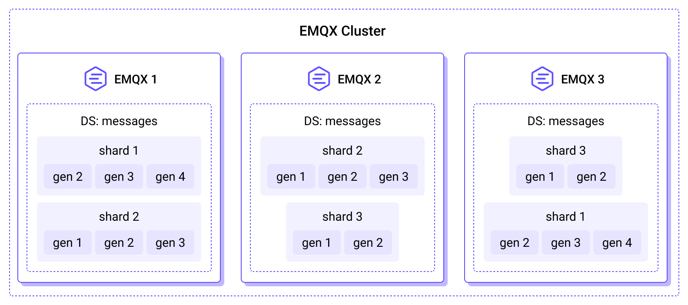
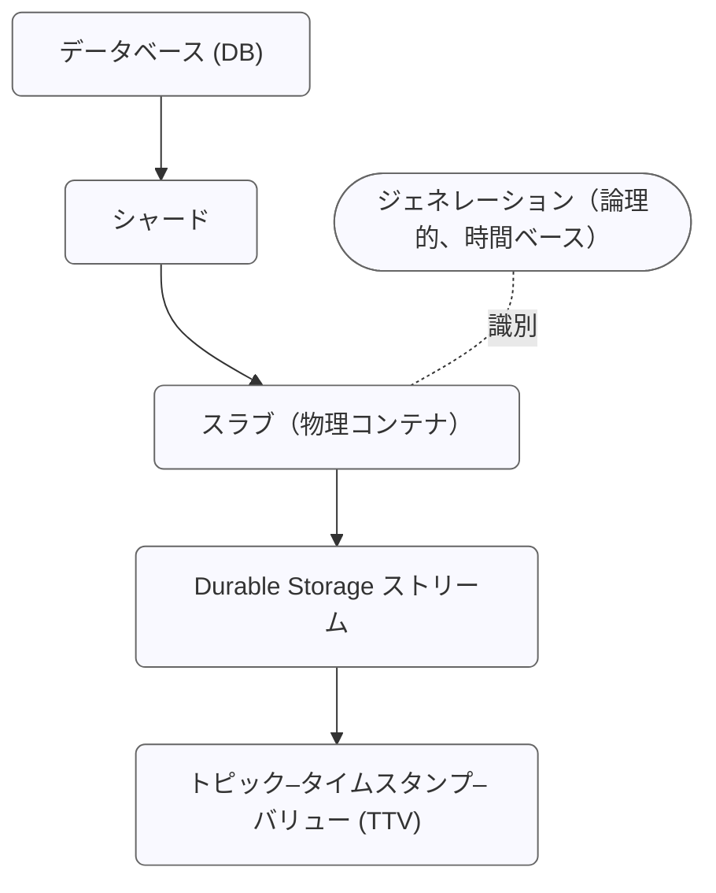

# Durable Storage の設計

EMQX 6.0 では、MQTT メッセージ配信の高信頼性と永続性を確保するために設計された専用のデータベース抽象レイヤーである Optimized Durable Storage（DS）を導入しました。DS はストリーミングサービス（Kafka など）とキー・バリュー・ストアの強みを組み合わせ、MQTT データの保存、再生、管理に対して堅牢かつ高度に最適化された基盤を提供します。

## アーキテクチャ：バックエンドとストレージ階層

Durable Storage は実装に依存しない設計で、バックエンドの概念を用いて異なるデータベース管理システムにデータを分散して保存できます。

### 埋め込みバックエンド

EMQX はサードパーティのサービスに依存しない2つの埋め込みバックエンドを提供しています：

- `builtin_local` バックエンドは RocksDB をストレージエンジンとして使用し、単一ノードのデプロイメント向けです。
- `builtin_raft` バックエンドは `builtin_local` を拡張し、クラスタリングおよび異なるサイト間でのデータレプリケーションをサポートします。

::: warning 重要なお知らせ
埋め込み Durable Storage バックエンドは EMQX のデータディレクトリにローカルファイルシステムを使用する必要があります。NFS や SMB/CIFS のようなネットワークファイルシステムはサポートされません。最高のパフォーマンスを得るために、ソリッドステートドライブ（SSD）ストレージの使用を推奨します。
:::

### データストレージ階層

EMQX の組み込み耐久性機能を支えるデータベースストレージエンジンは、階層的な構造でデータを整理します。以下の図は、EMQX クラスター全体に分散された Durable Storage データベースの配置を示しています。



内部的に、DS は水平スケーラビリティと時間的パーティショニングの両方を考慮した多層階層構造でデータを管理します。この構造はアプリケーションからは透過的であり、分散した EMQX ノード間で効率的なデータ管理を保証します。

DS の完全な階層構造は以下のように表現できます：



#### データベース（DB）

データベースはデータの最上位の論理コンテナです。各 DS データベースは独立しており、自身のシャード、スラブ、ストリームを管理し、必要に応じて作成、管理、削除が可能です。例えば：

- **Sessions DB** は耐久セッション状態を保存します。
- **Messages DB** は対応する MQTT メッセージデータを保持します。

単一の EMQX クラスターは複数の DS データベースをホストできます。

#### シャード

シャードは Durable Storage データベースの水平パーティションです。データはパブリッシャーのクライアント ID に基づいてシャード間に分散され、並列処理と高可用性を実現します。各 EMQX ノードは1つ以上のシャードをホストでき、シャードの総数は EMQX の初回起動時に設定される [n_shards](../durability/managing-replication.md#number-of-shards) パラメータで決定されます。

シャードはレプリケーションの基本単位でもあります。各シャードは `durable_storage.messages.replication_factor` 設定に従い複数ノードにレプリケートされ、すべてのレプリカが同一のメッセージセットを保持して冗長性とフォールトトレランスを確保します。

#### ジェネレーション

ジェネレーションはデータベースの論理的かつ時間ベースのパーティションです。異なる時間帯に書き込まれたデータは別々のジェネレーションにグループ化されます。新しいメッセージは常に現在のジェネレーションに書き込まれ、古いジェネレーションは不変かつ読み取り専用になります。EMQX は以下の主な目的で定期的に新しいジェネレーションを作成します：

1. **後方互換性とデータマイグレーション：** 新しいデータは改良されたエンコーディングで新しいジェネレーションに追加され、古いジェネレーションは不変かつ読み取り専用のまま維持されます。
2. **時間ベースのデータ保持：** 各ジェネレーションが特定の時間範囲に対応するため、期限切れデータはジェネレーション単位で効率的に削除できます。

ジェネレーションはスラブと概念的に関連しますが、物理的なストレージ単位ではありません。代わりに各シャード内のスラブを時間的に区切る境界を定義します。

ジェネレーションは内部的なデータ構造や保存方法が設定されたストレージレイアウトによって異なる場合があります。現在、DS は高スループットのワイルドカードおよび単一トピックのサブスクライブに最適化された単一のレイアウトをサポートしています。将来的には異なるワークロード向けの追加レイアウトが導入される予定です。新しいジェネレーションに使用されるレイアウトは `durable_storage.messages.layout` パラメータで設定し、各レイアウトエンジンは独自の設定オプションを提供します。

#### スラブ

スラブはシャード ID とジェネレーション ID の両方で識別される物理的なデータパーティションです。各スラブは1つ以上の Durable Storage ストリームを格納する耐久コンテナとして機能します。スラブ内のすべてのデータは同じエンコーディングスキーマを共有し、追加のメタデータ保存を不要にします。スラブ内では原子性と一貫性が保証されます。

例：`shard 2, gen 3` はそのジェネレーションの時間範囲内に書き込まれたすべてのストリームを格納する特定のスラブを表します。

#### ストリーム

Durable Storage ストリームは各スラブ内のバッチ処理とシリアライズの論理単位です。ストリームは類似したトピック構造を持つ **トピック–タイムスタンプ–バリュー（TTV）** の組をグループ化し、時間順かつ決定論的なチャンクでデータを読み取れるようにします。単一の Durable Storage ストリームは複数トピックのメッセージを含む場合があり、異なるストレージレイアウトはトピックをストリームにマッピングするための異なる戦略を適用します。

Durable Storage ストリームは Durable Storage におけるサブスクライブとイテレーションの基本単位でもあり、ワイルドカードトピックフィルターの効率的な処理と順序付けられたデータの一貫した再生を可能にします。[耐久セッション](../durability/durability_introduction.md#durable-sessions) はストリームからバッチ単位でメッセージを読み取り、バッチサイズは `durable_sessions.batch_size` 設定パラメータで制御されます。

#### トピック–タイムスタンプ–バリュー（TTV）

最小のストレージ単位であり、単一の MQTT メッセージを表します。各 TTV は以下を含みます：

- **トピック：** MQTT のセマンティクスに従います。
- **タイムスタンプ：** 書き込み時刻または論理的な順序キー。
- **バリュー：** 任意のバイナリデータ。

## Durable Storage データベースグループ

EMQX 6.0.2 以降、Durable Storage はリソース管理と運用の安全性向上のためにデータベースグループの概念を導入しました。

データベースグループは、ノード上の1つ以上の Durable Storage データベースに対して、ディスク容量やメモリバッファなどのストレージリソースを統一的に管理します。デフォルトでは、各 Durable Storage データベースは自身のデータベースグループに割り当てられ、グループ名はデータベース名と同じであり、以前のリリースの挙動を維持します。

データベースグループはデータの構造やアクセス方法を変更しません。論理的なデータモデル（シャード、ジェネレーション、スラブ、ストリーム）は変わらず、リソース管理のためのガバナンスレイヤーとして機能します。グループに単一のデータベースが含まれていても、クォータ適用やリソース会計の一貫した拡張可能な境界を確立します。

### 設計の動機

Durable Storage の永続データは RocksDB の SST（Stored String Table）ファイルに保存されます。書き込み先行ログはサイズが制限されますが、SST ファイルは新規データの書き込みに伴い無制限に増大する可能性があります。

データベースグループは、同一ノード上で動作する Durable Storage データベースの RAM とディスク使用量を明示的に制御し、リソース消費の明確な境界を設けるために導入されました。

データベースグループは以下の課題に対応します：

- 複数のデータベースが共通のディスク使用制限を共有可能にする
- データ永続化前に書き込み受け入れ制御を強制する
- グループレベルの可観測性の基盤を提供する

データベースグループは、特定ノード上にレプリカを持つすべての Durable Storage シャードのリソース使用を制限します。RAM 制限はノードローカルで適用され、グループの総メモリ消費に直接影響します。ディスク制限はローカルレプリカによって書き込まれる SST ファイルに対して適用されます。データはレプリケートされるため、ディスク使用量は論理データサイズではなく物理的なストレージ消費を表します。

### データベースグループモデル

各 Durable Storage データベースは必ず1つのデータベースグループに属します。複数のデータベースが同じグループに属することができ、グループ内のすべてのデータベースは同一のストレージバックエンドを使用する必要があります。

データベースグループは以下の共有リソースを所有・管理します：

- SST ファイルのディスク使用量（ソフトクォータ）
- RocksDB の書き込みバッファ（メモリテーブル）メモリ
- RocksDB のバックグラウンドスレッドプール

リソース使用はデータベースやシャード単位ではなくグループ単位で追跡・強制されます。

概念的には、データベースグループは以下の階層を導入します：

```
データベースグループ
  └── データベース（DB）
        └── シャード
              └── スラブ
                    └── ストリーム
                          └── TTV
```

### ストレージクォータ

Durable Storage はディスク使用量制御の主要メカニズムとしてソフトクォータを使用します。

#### ソフトクォータの強制

ストレージクォータは Durable Storage リーダーが書き込みトランザクションを受け入れる前に適用されます：

1. 書き込みを含むトランザクションが送信されると、リーダーはデータベースグループの現在の SST ディスク使用量をチェックします。
2. クォータを超過する場合、リーダーはトランザクションを拒否します。受け入れた場合は、トランザクションはレプリケートされ、すべてのレプリカに一貫して適用されます。
3. 読み取り専用トランザクションは引き続き受け入れられます。
4. データ削除のみのトランザクションも受け入れられます。

## 書き込みパス

DS へのデータ書き込みは、**追記専用モード**または **ACID トランザクション**のいずれかを使用できます。

### 追記専用モード

このモードはデータの**追記のみ**をサポートし、高スループットシナリオ向けに最小限のオーバーヘッドを提供します。

### ACID トランザクション

トランザクションは **楽観的同時実行制御（OCC）** に基づき、クライアントは通常競合しないデータサブセットで操作すると仮定します。競合が発生した場合は、競合者のうち1つだけがコミットに成功し、他は中止され再試行されます。

**トランザクションの流れ：**

1. **開始：** クライアントプロセス（Tx）がリーダーノードにトランザクションコンテキスト（リーダーのタームと最後にコミットされたシリアル番号を含む）作成を要求します。
2. **操作：** Durable Storage トランザクションは Erlang 関数で表現されます。この関数内でクライアントはデータを読み取り（アクセスしたトピックと時間範囲の情報がトランザクションコンテキストに追加されます）、書き込みや削除をスケジュールできます。コミット前条件（特定の TTV の存在/非存在チェック）も設定可能です。読み取りは即時実行され、スケジュールされた書き込み/削除は完全なコミットとレプリケーション時にのみ反映されます。
3. **送信と検証：** クライアントは操作リストをリーダーに送信します。
   - リーダーは最新のデータスナップショットに対してコミット前条件を検証します。
   - 読み取りが最近の書き込みと競合しないことを確認します。
4. **「調理（準備）」とログ記録：** 成功するとリーダーはトランザクションを「調理」します：
   - 書き込まれた各 TTV をストリームのいずれかに割り当て、必要に応じて新しいストリームを作成します。
   - すべてのレプリカに決定論的に適用可能な低レベルのストレージ変異リストを作成します。
5. **コミット：** 「調理」されたトランザクションのバッチが Raft ログ（`builtin_raft`）または RocksDB の書き込み先行ログ（WAL）に追加されます。
6. **結果：** 成功時にトランザクションプロセスに通知されます。競合があればトランザクションは中止され再試行されます。

**書き込みフラッシュ制御：**

バッファを Raft ログにフラッシュする頻度は以下で制御されます：

- `flush_interval`：調理済みトランザクションがバッファ内に留まる最大時間。
- `max_items`：保留中トランザクションの最大数。
- `idle_flush_interval`：一定時間新規データが追加されなければ早期フラッシュを許可。

以下のシーケンスは `builtin_raft` バックエンド内のトランザクションライフサイクルを示します。


## 読み取りパス

DS からのデータ読み取りはストリームを中心に行われます。

1. MQTT トピックのデータにアクセスするため、リーダーはまず `get_streams` API を使ってトピックに関連付けられたストリームのリストを取得します。この間接的な方法により、DS は類似トピックをグループ化しメタデータ量を最小化します。次に、リーダーは指定した開始時刻で各ストリームの*イテレーター*を作成します。イテレーターはストリーム内の読み取り位置を追跡する小さなデータ構造です。
2. `next` API を使ってデータを読み取り、データチャンクと次のチャンクを指す更新済みイテレーターを受け取ります。

### ワイルドカードトピックフィルターによる読み取り

ワイルドカードトピックフィルターへの効率的なサブスクライブを実現するため、DS は類似構造のトピックを持つ TTV を同じストリームにグループ化します。これは Learned Topic Structure（LTS）アルゴリズムを用いて、トピックを*静的*部分と*変動*部分に分割することで実現されます。

- **例：** クライアントが `metrics/<hostname>/cpu/socket/1/core/16` にデータをパブリッシュすると、LTS アルゴリズムは十分なデータを基に静的トピック部分を `metrics/+/cpu/socket/+/core/+` と推定し、hostname、socket、core を変動部分として扱います。
- **利点：** これにより `metrics/my_host/cpu/#` や `metrics/+/cpu/socket/1/core/+` のような効率的なクエリが可能になります。

### リアルタイムサブスクライブ

リーダーはサブスクライブ機構を使いリアルタイムでデータにアクセスすることもできます。`subscribe` API はイテレーターに基づき、クライアントがポーリングする代わりに DS がサブスクライバーにデータをプッシュします。

DS は2つのサブスクライバープールを維持しています：

- **キャッチアップサブスクライバー** は過去データを読み取り、終端に達するとリアルタイムサブスクライバーに切り替わります。
- **リアルタイムサブスクライブ** はイベントベースで、新規データが DS に書き込まれたときのみアクティブになります。

両プールはストリームとトピックごとにサブスクライバーをグループ化し、複数のサブスクライバーに同時にサービスを提供するためにリソースを共有します。この方法によりディスク読み取りの IOPS を節約し、リモートクライアントへの送信時のネットワーク帯域も削減します。メッセージのバッチ、サブスクライブ ID のリスト、スパースなディスパッチマトリックスがクラスター内のリモートノードに送信され、そこからローカルクライアントにメッセージが配信されます。


## さらなる情報

Durable Storage は EMQX の高信頼性および永続性関連機能のコアデータ基盤として機能し、上位レイヤーの機能に対して統一されたストレージ、再生、一貫性保証を提供します。主な機能には以下が含まれます：

- **[MQTT Durable Sessions](../durability/durability_introduction.md)**：セッション状態と未配信メッセージを永続化する DS ベースのメカニズム。
- **[Message Queue](../message-queue/message-queue-concept.md)**：EMQX クラスター全体で順序付けられたメッセージ配信、メッセージ再生、高可用性を提供する組み込みメッセージキュー機能。
- **[Shared Subscription](../messaging/mqtt-shared-subscription.md)**：同一グループ内の複数サブスクライバー間でメッセージを分散する負荷分散型サブスクライブ機構。
