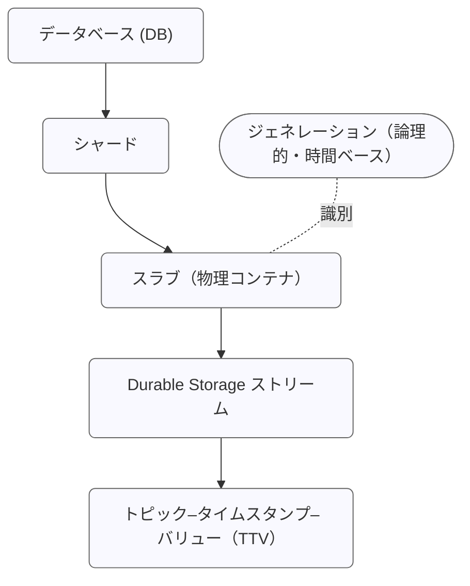

# Durable Storage の設計

EMQX 6.0 では、MQTT メッセージ配信の高い信頼性と永続性を確保するために設計された専用のデータベース抽象レイヤーである Optimized Durable Storage（DS）を導入しました。DS はストリーミングサービス（Kafka など）とキー・バリュー・ストアの強みを組み合わせ、MQTT データの保存、リプレイ、管理に対して堅牢で高度に最適化された基盤を提供します。

## アーキテクチャ：バックエンドとストレージ階層

Durable Storage は実装に依存しない設計で、バックエンドという概念を用いて異なるデータベース管理システムにまたがってデータを保存できます。

### 埋め込みバックエンド

EMQX はサードパーティのサービスに依存しない2つの埋め込みバックエンドを提供しています：

- `builtin_local` バックエンドは RocksDB をストレージエンジンとして使用し、単一ノードのデプロイメント向けです。
- `builtin_raft` バックエンドは `builtin_local` を拡張し、クラスターおよび異なるサイト間でのデータレプリケーションをサポートします。

::: warning 重要なお知らせ
埋め込み Durable Storage バックエンドは EMQX のデータディレクトリにローカルファイルシステムを使用する必要があります。NFS や SMB/CIFS などのネットワークファイルシステムはサポートされていません。最高のパフォーマンスを得るために、ソリッドステートドライブ（SSD）ストレージの使用を推奨します。
:::

### データストレージ階層

EMQX の組み込み耐久性機能を支えるデータベースストレージエンジンは、階層的な構造でデータを整理しています。以下の図は、EMQX クラスター全体に分散された Durable Storage データベースの配置を示しています：


内部的に DS は水平スケーラビリティと時間的パーティショニングの両方を考慮した多層階層構造でデータを管理します。この構造はアプリケーションに対して透過的であり、分散された EMQX ノード間で効率的なデータ管理を保証します。

DS の階層構造は以下のように表現できます：



#### データベース (DB)

データベースはデータの最上位の論理コンテナです。各 DS データベースは独立しており、シャード、スラブ、ストリームを管理し、必要に応じて作成、管理、削除が可能です。例として：

- **Sessions DB** は耐久セッション状態を保存します。
- **Messages DB** は対応する MQTT メッセージデータを保持します。

単一の EMQX クラスターで複数の DS データベースをホストできます。

#### シャード

シャードは Durable Storage データベースの水平パーティションです。データはパブリッシャーのクライアント ID に基づいてシャード間に分散され、並列処理と高可用性を実現します。各 EMQX ノードは1つ以上のシャードをホストでき、シャードの総数は EMQX の初回起動時に設定される [n_shards](../durability/managing-replication.md#number-of-shards) パラメータによって決まります。

シャードはレプリケーションの基本単位でもあります。各シャードは `durable_storage.messages.replication_factor` 設定に従って複数ノードにレプリケートされ、すべてのレプリカが同一のメッセージセットを保持することで冗長性とフォールトトレランスを確保します。

#### ジェネレーション

ジェネレーションはデータベースの論理的かつ時間ベースのパーティションです。異なる時間帯に書き込まれたデータは別々のジェネレーションにまとめられます。新しいメッセージは常に現在のジェネレーションに書き込まれ、古いジェネレーションは不変で読み取り専用になります。EMQX は以下の主な目的で定期的に新しいジェネレーションを作成します：

1. **後方互換性とデータマイグレーション：** 新しいデータは改善されたエンコーディングで新しいジェネレーションに追加され、古いジェネレーションは不変かつ読み取り専用のまま維持されます。
2. **時間ベースのデータ保持：** 各ジェネレーションが特定の時間範囲に対応しているため、期限切れデータはジェネレーション単位で効率的に削除できます。

ジェネレーションはスラブと概念的に関連しますが、物理的なストレージ単位ではありません。代わりに、各シャード内のスラブを整理する時間的境界を定義します。

ジェネレーションは内部的にデータの構造や保存方法が異なる場合があり、これは設定されたストレージレイアウトによります。現在、DS は高スループットのワイルドカードおよび単一トピックサブスクリプションに最適化された単一のレイアウトをサポートしています。将来的には異なるワークロード向けの追加レイアウトが導入される予定です。新しいジェネレーションに使用されるレイアウトは `durable_storage.messages.layout` パラメータで設定し、各レイアウトエンジンは独自の設定オプションを提供します。

#### スラブ

スラブはシャード ID とジェネレーション ID の両方で識別される物理的なデータパーティションです。各スラブは1つ以上の Durable Storage ストリームの耐久コンテナとして機能します。スラブ内のすべてのデータは同一のエンコーディングスキーマを共有し、追加のメタデータ保存を不要にします。スラブ内ではアトミック性と一貫性が保証されます。

例：`shard 2, gen 3` はそのジェネレーションの時間範囲に書き込まれたすべてのストリームを保存する特定のスラブを表します。

#### ストリーム

Durable Storage ストリームは各スラブ内のバッチ処理およびシリアライズの論理単位です。ストリームは類似したトピック構造を持つ **トピック–タイムスタンプ–バリュー（TTV）** の集合をグループ化し、時間順かつ決定論的なチャンクでの読み取りを可能にします。単一の Durable Storage ストリームは複数トピックのメッセージを含むことがあり、異なるストレージレイアウトはトピックをストリームにマッピングする異なる戦略を適用します。

Durable Storage ストリームは Durable Storage におけるサブスクライブおよびイテレーションの基本単位でもあり、ワイルドカードトピックフィルターの効率的な処理と順序付けられたデータの一貫したリプレイを可能にします。[Durable sessions](../durability/durability_introduction.md#durable-sessions) はストリームからバッチ単位でメッセージを読み取り、バッチサイズは `durable_sessions.batch_size` 設定で制御されます。

#### トピック–タイムスタンプ–バリュー（TTV）

最小の保存単位であり、単一の MQTT メッセージを表します。各 TTV は以下を含みます：

- **トピック：** MQTT のセマンティクスに従います。
- **タイムスタンプ：** 書き込み時刻または論理的な順序キー。
- **バリュー：** 任意のバイナリデータ。

## Durable Storage データベースグループ

EMQX 6.0.2 以降、Durable Storage はリソース管理と運用の安全性向上のためにデータベースグループの概念を導入しました。

データベースグループは、ノード上の1つ以上の Durable Storage データベースに対して、ディスク容量やメモリバッファなどのストレージリソースを統一的に管理します。デフォルトでは、各 Durable Storage データベースは自身のデータベースグループに割り当てられ、その名前はデータベース名と同じで、以前のリリースの動作を維持します。

データベースグループはデータの構造やアクセス方法を変更しません。論理的なデータモデル（シャード、ジェネレーション、スラブ、ストリーム）は変わらず、リソース管理のためのガバナンス層として機能します。グループに単一のデータベースしか含まれなくても、クォータの強制やリソース会計の一貫した拡張可能な境界を確立します。

### 設計の動機

Durable Storage の永続データは RocksDB の SST（Stored String Table）ファイルに保存されます。書き込み先行ログはサイズが制限されていますが、SST ファイルは新しいデータの書き込みに伴い無制限に成長する可能性があります。

データベースグループは、同一ノード上で動作する Durable Storage データベースの RAM とディスク使用量を明示的に制御し、リソース消費の明確な境界を設けるために導入されました。

データベースグループは以下の課題に対応します：

- 複数のデータベースが共通のディスク使用制限を共有可能にする
- データ永続化前の書き込み受け入れ制御を強制する
- グループレベルの可観測性の基盤を提供する

データベースグループは、特定ノード上にレプリカを持つすべての Durable Storage シャードのリソース使用を制限します。RAM 制限はノードローカルで強制され、グループの総メモリ消費に直接適用されます。ディスク制限はローカルレプリカが書き込む SST ファイルに制約をかけます。データはレプリケートされるため、ディスク使用量は論理データサイズではなく物理ストレージ消費を表します。

### データベースグループモデル

各 Durable Storage データベースは正確に1つのデータベースグループに属します。複数のデータベースが同じグループに属することができ、グループ内のすべてのデータベースは同一のストレージバックエンドを使用する必要があります。

データベースグループは以下の共有リソースを所有・管理します：

- SST ファイルのディスク使用量（ソフトクォータ）
- RocksDB 書き込みバッファ（メモリテーブル）メモリ
- RocksDB バックグラウンドスレッドプール

リソース使用量はデータベースやシャード単位ではなく、グループ単位で追跡・強制されます。

概念的には、データベースグループは以下の階層を導入します：

```
データベースグループ
  └── データベース (DB)
        └── シャード
              └── スラブ
                    └── ストリーム
                          └── TTV
```

### ストレージクォータ

Durable Storage はディスク使用量制御の主要手段としてソフトクォータを使用します。

#### ソフトクォータの強制

ストレージクォータは Durable Storage リーダーが書き込みトランザクションを受け入れる前に強制されます：

1. 書き込みを含むトランザクションが送信されると、リーダーはデータベースグループの現在の SST ディスク使用量をチェックします。
2. クォータを超える場合、リーダーはトランザクションを拒否します。受理した場合はすべてのレプリカに一貫してレプリケート・適用されます。
3. 読み取り専用トランザクションは引き続き受け入れられます。
4. データ削除のみのトランザクションも受け入れられます。

## 書き込みパス

DS へのデータ書き込みは、**追記専用モード**または **ACID トランザクション**のいずれかを使用できます。

### 追記専用モード

このモードはデータの**追記のみ**をサポートし、高スループットシナリオ向けに最小限のオーバーヘッドを提供します。

### ACID トランザクション

トランザクションは **楽観的同時実行制御（OCC）** に基づき、クライアントは通常競合しないデータサブセットで動作すると想定します。競合が発生した場合、1つのトランザクションのみがコミットに成功し、他は中止され再試行されます。

**トランザクションの流れ：**

1. **開始：** クライアントプロセス（Tx）がリーダーノードにトランザクションコンテキスト（リーダーのタームと最後にコミットされたシリアル番号を含む）作成を要求します。
2. **操作：** Durable Storage トランザクションは Erlang 関数で表されます。この関数内でクライアントはデータを読み取り（アクセスしたトピックと時間範囲の情報がトランザクションコンテキストに追加されます）、書き込みや削除をスケジュールできます。コミット前提条件（特定の TTV の存在/非存在チェック）も設定可能です。読み取りは即時実行され、スケジュールされた書き込み/削除は完全なコミットとレプリケーション時にのみ反映されます。
3. **送信と検証：** クライアントは操作リストをリーダーに送信します。
   - リーダーは最新のデータスナップショットに対して前提条件をチェックします。
   - 読み取りが最近の書き込みと競合しないか検証します。
4. **「調理（準備）」とログ記録：** 成功した場合、リーダーはトランザクションを「調理」します：
   - 書き込まれる各 TTV をストリームのいずれかに割り当て、必要に応じて新規ストリームを作成します。
   - すべてのレプリカで決定論的に適用可能な低レベルのストレージ変異リストを作成します。
5. **コミット：** 「調理済み」トランザクションのバッチが Raft ログ（`builtin_raft`）または RocksDB 書き込み先行ログ（WAL）に追加されます。
6. **結果：** 成功時にトランザクションプロセスに通知されます。競合があればトランザクションは中止され再試行されます。

**書き込みフラッシュ制御：**

バッファを Raft ログにフラッシュする頻度は以下で制御されます：

- `flush_interval`：調理済みトランザクションがバッファに留まる最大時間
- `max_items`：保留中トランザクションの最大数
- `idle_flush_interval`：新規データが追加されなかった場合に早期フラッシュを許可する時間間隔

以下のシーケンスは `builtin_raft` バックエンド内のトランザクションライフサイクルを示します。


## 読み取りパス

DS からのデータ読み取りはストリームを中心に行われます。

1. MQTT トピックのデータにアクセスするため、リーダーはまず `get_streams` API を使用してトピックに関連付けられたストリームのリストを取得します。この間接的な方法により、DS は類似トピックをグループ化し、メタデータ量を最小化します。次にリーダーは各ストリームに対して指定した開始時刻で *イテレーター* を作成します。イテレーターはストリーム内の読み取り位置を追跡する小さなデータ構造です。
2. その後、`next` API を使ってデータを読み取り、データチャンクと次のチャンクを指す更新済みイテレーターを受け取ります。

### ワイルドカードトピックフィルターによる読み取り

ワイルドカードトピックフィルターへの効率的なサブスクライブを実現するため、DS は類似構造のトピックを同じストリームにグループ化します。これは Learned Topic Structure（LTS）アルゴリズムを用いて、トピックを *静的* 部分と *可変* 部分に分割することで実現されます。

- **例：** クライアントが `metrics/<hostname>/cpu/socket/1/core/16` にデータをパブリッシュする場合、十分なデータがあれば LTS アルゴリズムは静的トピック部分を `metrics/+/cpu/socket/+/core/+` と導出し、ホスト名、ソケット、コアを可変部分として扱います。
- **利点：** これにより `metrics/my_host/cpu/#` や `metrics/+/cpu/socket/1/core/+` のような効率的なクエリが可能になります。

### リアルタイムサブスクリプション

リーダーはサブスクリプション機構を使いリアルタイムでデータにアクセスできます。`subscribe` API はイテレーターに基づき、DS がクライアントにポーリングを要求する代わりにデータをプッシュします。

DS は2つのサブスクライバープールを維持しています：

- **キャッチアップサブスクライバー** は過去のデータを読み取り、終端に達するとリアルタイムサブスクライバーに移行します。
- **リアルタイムサブスクリプション** はイベントベースで、新しいデータが DS に書き込まれたときのみアクティブになります。

両プールはストリームとトピックごとにサブスクライバーをグループ化し、複数のサブスクライバーに対してリソースを共有します。この方法によりディスク読み取り時の IOPS を節約し、リモートクライアントへのデータ送信時のネットワーク帯域を削減します。メッセージのバッチ、サブスクリプション ID のリスト、スパースなディスパッチマトリックスがクラスター内のリモートノードに送信され、そこからローカルクライアントにメッセージが配信されます。


## さらに詳しく

Durable Storage は EMQX の高信頼性および永続性関連機能のコアデータ基盤として機能し、上位レイヤーの機能に対して統一された保存、リプレイ、一貫性保証を提供します。主な機能には以下があります：

- **[MQTT Durable Sessions](../durability/durability_introduction.md)**：セッション状態と未配信メッセージを永続化する DS ベースの仕組み。
- **[Message Queue](../message-queue/message-queue-concept.md)**：順序付けられたメッセージ配信、メッセージリプレイ、高可用性を EMQX クラスター全体で提供する組み込みメッセージキュー機能。
- **[Shared Subscription](../messaging/mqtt-shared-subscription.md)**：同一グループ内の複数サブスクライバー間でメッセージを分散するロードバランシングサブスクリプション機構。
