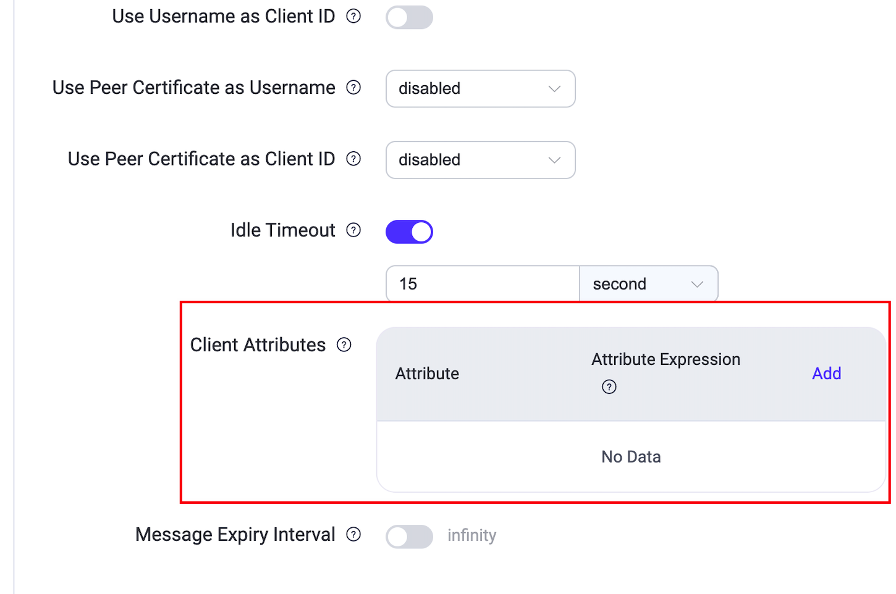

# MQTTクライアント属性

EMQXのクライアント属性は、開発者が異なるアプリケーションシナリオの要件に応じてMQTTクライアントに追加属性を定義・設定できる仕組みを提供します。これらの属性は、EMQX内での認証、認可、データ統合、MQTT拡張機能の強化に不可欠であり、柔軟な開発を支援します。クライアントのメタデータを活用することで、MQTTクライアント識別の柔軟なテンプレート化も可能となり、個別化されたクライアント設定や認証プロセスの効率化を実現し、開発の適応性と効率性を高めます。

## ワークフロー

クライアント属性の設定、保存、利用の流れは以下の通りです。

**1. クライアント属性の設定**

クライアントがEMQXに正常に接続すると、EMQXは接続および認証イベントをトリガーし、この過程であらかじめ定義された設定に基づき[クライアント属性が設定されます](#クライアント属性の設定)。

**2. クライアント属性の保存と破棄**

設定された属性は、クライアントセッションの`client_attrs`フィールドにキー・バリュー形式で保存されます。クライアントセッションが終了すると、これらの属性は削除されます。

永続セッションの場合、クライアントが引き継ぐ際にセッション内のクライアント属性は置き換えられ上書きされます。それ以外にクライアント属性を変更・削除する方法はありません。

**3. クライアント属性の利用**

EMQXの他の機能では、`${client_attrs.NAME}`プレースホルダーを関連設定項目で使用でき、属性値を動的に抽出して設定やデータの一部として利用できます。

## クライアント属性の設定

クライアントがEMQXに正常に接続すると、EMQXは接続および認証イベントをトリガーし、あらかじめ定義された設定に基づいてクライアント属性を設定します。現在、以下の2つの方法がサポートされています。

- クライアントメタデータからの抽出
- クライアント認証プロセス中の設定

### クライアントメタデータからの抽出

事前設定により、ユーザー名やクライアントIDなどのクライアント接続メタデータから部分文字列を抽出・加工し、クライアント属性として設定します。この抽出は認証プロセスの前に行われるため、HTTPリクエストボディテンプレートや認証・認可リクエストのSQLテンプレートなど、後続の処理で属性を利用可能です。

クライアント属性機能は設定ファイルまたはダッシュボードから設定できます。ダッシュボードで属性抽出を設定するには、**Management** -> **MQTT Settings** をクリックし、**Client Attributes** の「Add」をクリックして属性名と属性式を追加します。



ここで、

- **Attribute** は属性名です。
- **Attribute Expression** は属性抽出の設定式です。

属性式は[Variform式](../../guides/configuration/configuration.md#variform-expressions)や[組み込み関数](../../guides/configuration/configuration.md#pre-defined-functions)を使って値を動的に処理できます。例として、

- ドット区切りのクライアントIDのプレフィックスを抽出：`nth(1, tokens(clientid, '.'))`
- ユーザー名の一部を切り出す：`substr(username, 0, 5)`

設定ファイル例は以下の通りです。

```bash
mqtt {
    client_attrs_init = [
        {
            expression = "nth(1, tokens(clientid, '.'))"
            set_as_attr = clientid_prefix
        },
        {
            expression = "substr(username, 0, 5)"
            set_as_attr = sub_username
        }
    ]
}
```

属性式で設定可能な値は以下です。

- `clientid`：クライアントID
- `username`：ユーザー名
- `cn`：TLS証明書のCNフィールド
- `dn`：TLS証明書のDNフィールド
- `user_property.*`：MQTT CONNECTパケットのUser-Propertyから属性値を抽出（例：`user_property.foo`）
- `zone`：MQTTリスナーから継承されたゾーン名

クライアント属性設定の詳細は[EMQX Enterprise Configuration Manual](https://docs.emqx.com/en/enterprise/v@EE_VERSION@/hocon/)を参照してください。

### クライアント認証プロセス中の設定

クライアント認証プロセス中に、認証器から返される情報に基づいてクライアント属性を設定できます。現在サポートされているのは以下です。

- [JWT認証](../../guides/access-control/authn/jwt.md)：トークン発行時のペイロードの`client_attrs`フィールドにクライアント属性を設定
- [HTTP認証](../../guides/access-control/authn/http.md)：HTTP認証成功時のレスポンスの`client_attrs`フィールドにクライアント属性を設定

属性のキーと値は文字列である必要があります。この方法により、認証結果に応じて動的に属性を設定でき、柔軟な運用が可能です。

### 認証データのマージ

両方の方法や複数の認証器でクライアント属性を設定する場合、EMQXは属性名と設定順に基づいて属性をマージします。

- クライアントメタデータから抽出した属性は、認証器が設定した属性で上書きされます。
- 認証チェーン内で複数の認証器が属性を設定した場合、後から設定された属性が前のものを上書きします。

## クライアント属性の活用

EMQXの他機能では、`${client_attrs.NAME}`プレースホルダーを使ってクライアント属性を抽出し、設定やデータの一部として利用できます。現時点ではクライアント認証と認可でのみサポートされており、今後さらに機能が拡充される予定です。

### クライアント認証

SQL文、クエリコマンド、HTTPリクエストボディで[認証プレースホルダー](../../guides/access-control/authn/authn.md#authentication-placeholders)を動的パラメータとして利用できます。例：

```sql
# MySQL/PostgreSQL - 認証クエリSQL
SELECT password_hash, salt, is_superuser FROM mqtt_user WHERE sn = ${client_attrs.sn} LIMIT 1

# HTTP - 認証リクエストボディ
{
 "sn": "${client_attrs.sn}",
 "password": "${password}"
}
```

具体的な使い方は各認証器のドキュメントを参照してください。

::: tip

クライアント認証で使用できる属性は、クライアントメタデータから設定された属性のみです。

:::

### クライアント認可

SQL文、クエリコマンド、トピックで[データクエリプレースホルダー](../../guides/access-control/authz/authz.md#placeholders-in-data-queries)および[トピックプレースホルダー](../../guides/access-control/authz/authz.md#topic-placeholders)を利用できます。

#### 例示シナリオ：

クライアントごとに`role`、`productId`、`deviceId`などのクライアント属性を設定し、認可チェックに利用します。

- **role**：クライアントのアクセス権限を制限し、`admin`ロールのクライアントのみが管理メッセージ（例：`admin/#`にマッチするトピック）のサブスクライブ・パブリッシュを許可。
- **productId**：クライアントが現在の製品に適用されるOTAメッセージ（例：`OTA/{productId}`）のみをサブスクライブ可能に制限。
- **deviceId**：クライアントが自身に属するトピックのみパブリッシュ・サブスクライブ可能に制限。
  - パブリッシュ：`up/{productId}/{deviceId}`
  - サブスクライブ：`down/{productId}/{deviceId}`

[認可 - 組み込みデータベース](../../guides/access-control/authz/mnesia.md)を使い、以下のルールを設定して実現します。

| 権限     | 操作               | トピック                                                     |
| -------- | ------------------ | ------------------------------------------------------------ |
| 許可     | サブスクライブ＆パブリッシュ | `${client_attrs.role}/#`                                    |
| 許可     | サブスクライブ     | `OTA/${client_attrs.productId}`                              |
| 許可     | パブリッシュ       | `up/${client_attrs.productId}/${client_attrs.deviceId}`      |
| 許可     | サブスクライブ     | `down/${client_attrs.productId}/${client_attrs.deviceId}`    |

クライアントIDなどの静的プロパティを直接使うよりも、クライアント属性を活用したこの方法は認可管理をより柔軟にします。これにより、役割、製品、デバイスごとに細かなアクセス権限の制御が可能となります。
