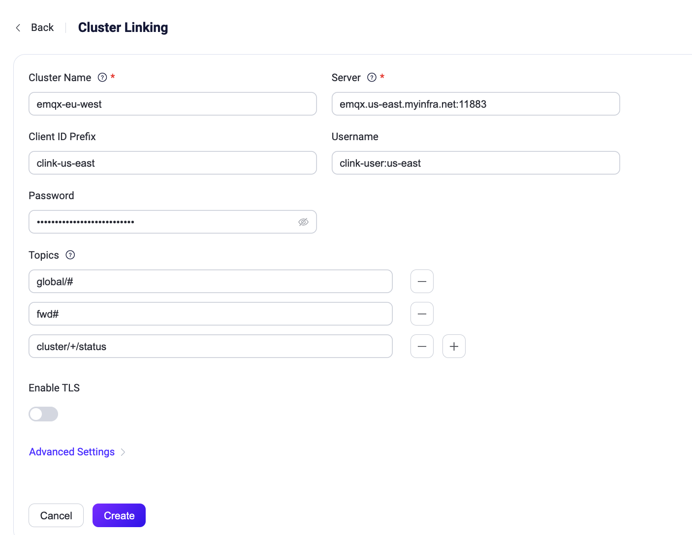

# クラスターリンクの設定

このページでは、EMQXダッシュボード、設定ファイル、およびREST APIを通じてクラスターリンク機能を設定および管理するためのガイドラインを提供します。

## ダッシュボードによるクラスターリンクの設定と管理

EMQXダッシュボードにアクセスし、左メニューから **Management** -> **Cluster Linking** をクリックします。**Cluster Linking** ページの右上にある **Create** をクリックして、クラスターリンクの作成を開始します。



設定ページで、以下の項目を設定します。

- **Cluster Name**：リモートクラスターの名前を入力します。
- **Server**：リモートクラスターのMQTTホストとポートを指定します。
- **Client ID Prefix**：リモートクラスターへのMQTT接続で使用されるClientIDのプレフィックスを定義します。詳細は[Configure MQTT Connections](#configure-mqtt-connections)を参照してください。
- **Username**：リモートクラスターへの認証に必要な場合のユーザー名を入力します。
- **Password**：リモートクラスターへの認証に必要な場合のパスワードを入力します。
- **Topics**：ローカルクラスターがリモートクラスターから受信するメッセージの対象となるMQTTトピックフィルターのリストです。デフォルトでは空です。プラス記号をクリックしてトピックを追加したり、必要に応じて削除して空のままにすることもできます。詳細は[Configure Topics](#configure-topics)を参照してください。
- **Enable TLS**：クラスター間通信にTLS暗号化が必要な場合にこのオプションを有効にします。SSL証明書などの設定を行います。
- **Advanced Settings**：MQTTプロトコルパラメータなどの追加設定を行います。

設定が完了したら **Create** をクリックします。

新しいエントリーがクラスターリンクページに表示され、デフォルトで有効になります。クラスターリンク一覧にはクラスター名、サーバーアドレス、トピック、有効状態などの詳細が表示されます。**Actions** 列の **Settings** または **Delete** ボタンをクリックして設定の変更やエントリーの削除が可能です。

クラスター名をクリックすると **Overview** タブに移動し、メッセージ送受信の統計やクラスターリンクの実行状況を監視できます。ページ右上の削除アイコンをクリックするとクラスターリンクエントリーを完全に削除できます。あるいはスイッチを切り替えて一時的にクラスターリンクを無効化し、設定を保持したまま将来の利用に備えることも可能です。

## 設定ファイルによるクラスターリンクの設定

EMQXの設定ファイル内の `cluster.links` リストに複数のクラスター間リンクを設定できます。各リンクは一意のリモートクラスター名を持ち、個別に有効または無効にできます。

リンクの正常な動作には、各リンクでクラスター名を一貫して設定することが重要です。以下の例では、リモートクラスター名は対応する設定ファイルで `emqx-eu-west` とする必要があります。

```bash
cluster {
  name = "emqx-us-east"
  links = [
    {
      name = "emqx-eu-west"
      server = "emqx.us-east.myinfra.net:11883"
      username = "clink-user:us-east"
      password = "clink-password-no-one-knows"
      clientid = "clink-us-east"
      topics = ["global/#", "fwd/#", "cluster/+/status", ...]
      ssl {
        enable = true
        verify = verify_peer
        certfile = "etc/certs/client/emqx-us-east.pem"
        ...
      }
    }
    ...
  ]
}
```

このリンクが正常に機能するには、リモートの `emqx-eu-west` クラスター側の設定ファイルにも `emqx-us-east` へのリンクが同様に設定されている必要があります。

### リンクの有効化と無効化

設定済みのリンクはデフォルトで有効です。`enable` パラメータを `false` に設定することで無効化できます。

リンクを無効化すると、EMQXはリモートクラスターとの通信を停止します。ただし、この操作はリモートクラスター側の通信停止を自動的に行わないため、リモートクラスターで警告やアラームが発生する可能性があります。これを避けるため、必ず両側でリンクを無効化してください。

### トピックの設定

`topics` パラメータは、ローカルクラスターが関心を持つMQTTトピックフィルターのリストです。ローカルクラスターは、リモートクラスターからこれらのトピックにパブリッシュされたメッセージを受信します。このリストは空にすることもでき、その場合はリモートクラスターからメッセージを受信しません。

### MQTT接続の設定

クラスターリンクは標準のMQTTを基盤プロトコルとして使用し、リモートクラスターのMQTTリスナーエンドポイントを `server` として指定します。

クラスターの規模や設定に応じて、リモートクラスターへの複数のMQTTクライアント接続が確立されることがあり、それぞれのクライアントは一意のClientIDを持つ必要があります。`clientid` パラメータはこれらの接続に対するClientIDのプレフィックスとして機能し、ClientIDの割り当てを制御します。

認証や認可パラメータ（`username`、`password`）など、その他のMQTTプロトコル関連設定も可能です。リモートクラスターはこれらの接続を[認証](../../guides/access-control/authn/authn.md)し、クラスターリンク設定で指定された特定のMQTTトピックに対するパブリッシュを[認可](../../guides/access-control/authz/authz.md)できる必要があります。例えば、上記の設定例では、リモートクラスターは以下のような[ACLルール](../../guides/access-control/authz/file.md)を持つことで正常に動作します。

```erlang
%% クラスターリンクMQTTクライアントに対し"$LINK/#"トピックの操作を許可
{allow, {clientid, {re, "^clink-us-east"}}, all, ["$LINK/#"]}.
...
```

このルールにより、ClientIDが正規表現 `^clink-us-east` にマッチするMQTTクライアントは、`$LINK/` で始まる任意のトピックのパブリッシュおよびサブスクライブが許可されます。`$LINK/` はクラスターリンク関連メッセージの制御トピックプレフィックスであり、サブスクライバーがクラスターリンクの維持・管理に必要なすべての関連メッセージを受信できるようにします。

上記の単一ルールはリンクを機能させるための最小限の設定です。実運用では、非クラスターリンククライアントによる `$LINK/` トピックへのアクセスを禁止し、デフォルト拒否ルールで締める完全な認可設定が必要です。詳細は[Secure Cluster Linking](./security.md)および `authorization.no_match = deny` 設定を参照してください。

クラスターリンクは[TLS接続](../../guides/network/overview.md)をサポートしています。パブリックインターネットや信頼できないネットワーク上でクラスター間通信を行う場合はTLSが必須です。EMQXは相互TLS認証もサポートし、通信の安全性、機密性、信頼性を確保します。

## REST APIによるクラスターリンクの管理

EMQXのクラスターリンクは、クラスター間リンクの管理を行うREST APIを提供し、設定作業やリンク状態の監視が可能です。APIは基本操作と高度な操作の両方をサポートし、管理ニーズに応じた柔軟性を持ちます。

### 基本的なREST API操作

簡易的なユースケース向けに、EMQXは以下のエンドポイントで基本的なREST API操作をサポートします。

- **クラスターリンクの設定**：
  - **エンドポイント**：`PUT /cluster/links`
  - **機能**：必要な設定パラメータを一括で送信し、クラスターリンクの作成または更新を行います。シンプルなホット設定に適しています。
- **クラスターリンク情報の取得**：
  - **エンドポイント**：`GET /cluster/links`
  - **機能**：現在存在するすべてのクラスターリンクの設定と状態を取得します。アクティブなリンクの確認に便利です。

### 高度なCRUD API操作

クラスターリンクの詳細な管理には、以下のCRUD（作成、取得、更新、削除）操作が利用可能です。

| **操作**                      | **エンドポイント**               | **機能**                                                     |
| ----------------------------- | ------------------------------ | ------------------------------------------------------------ |
| **クラスターリンクの作成**    | `POST /cluster/links`          | 新しいクラスターリンクを作成し、初期設定を行います。         |
| **特定クラスターリンクの取得** | `GET /cluster/links/{name}`    | 指定した名前のクラスターリンクの詳細情報を取得します。       |
| **クラスターリンクの更新**    | `PUT /cluster/links/{name}`    | 既存のクラスターリンクの設定を変更し、トピックやサーバーアドレス、認証情報などを更新します。 |
| **クラスターリンクの削除**    | `DELETE /cluster/links/{name}` | 指定したクラスターリンクを削除し、クラスター間接続を終了します。 |

### クラスターリンクの状態とメトリクスの監視

設定以外に、APIはクラスターリンクの状態やパフォーマンスを監視するためのエンドポイントも提供します。

**クラスターリンクの状態取得**：

- **エンドポイント**：`GET /cluster/links` または `GET /cluster/links/{name}`

- **機能**：すべてのクラスターリンクまたは特定リンクの状態を返します。レスポンスには全体の状態（`running`、`stopped`など）や詳細なノード状態情報が含まれます。

- **レスポンス例**：

  ```json
  {
    ...
    "server": "broker.emqx.io:1883",
    "topics": ["t/#"],
    "status": "running",
    "node_status": [
      {"node": "emqx@127.0.0.1", "status": "running"}
    ]
  }
  ```

**クラスターリンクのメトリクス取得**：

- **エンドポイント**：`GET /cluster/links/{name}/metrics`

- **説明**：アクティブルート数（ゲージタイプ）など、クラスターリンクに関連するメトリクスを提供し、リンクの負荷やパフォーマンス評価に役立ちます。

- **レスポンス例**：

  ```json
  {
    "metrics": {"routers": 10240},
    "node_metrics": [{}]
  }
  ```

**特定クラスターリンクのメトリクスリセット**

- **エンドポイント**：`PUT /cluster/links/link/:name/metrics/reset`

- **説明**：指定したクラスターリンクの累積メトリクスをリセットします。リセット後は統計情報がクリアされ、新たに計測が開始されます。設定変更後のパフォーマンス監視やトラブルシューティングに有用です。

- **レスポンス例**：内容なしの `204` ステータスを返します。
