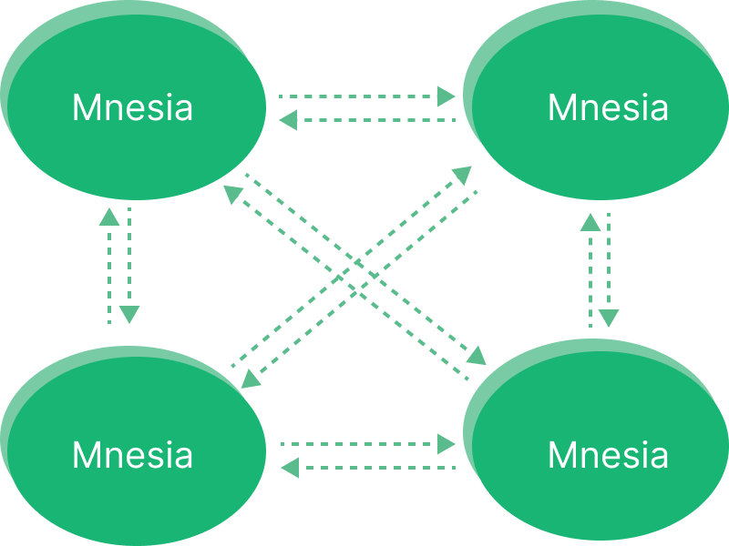
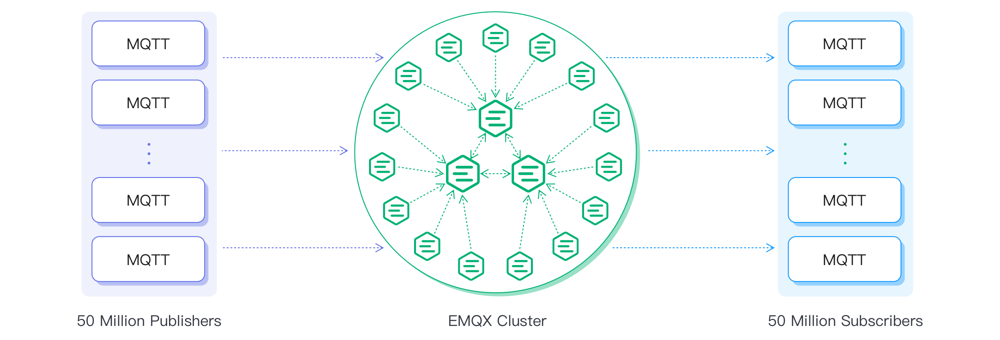

# EMQX クラスタリング

EMQX クラスタリングとは、複数の EMQX ノードが連携して統一されたシステムとして動作するデプロイメントを指します。これらのノードはクライアントのセッション、トピックのサブスクライブ情報、およびルーティング情報を自動的に共有し、シームレスなメッセージ配信と水平スケーラビリティを実現します。

::: tip 注意

クラスタリング機能はトライアル期間中に利用可能ですが、トライアル期間終了後は商用ライセンスの購入が必要です。有効な商用ライセンスがない場合、トライアル期間終了後にクラスタリング機能は無効化されます。

:::

本セクションでは、[クラスタリングの利点](#why-use-emqx-clustering)、[EMQX におけるクラスタリングの仕組み](#how-clustering-in-emqx-works)、および[Mria と RLOG アーキテクチャ](./mria-introduction.md)を紹介します。

このアーキテクチャは、MQTT を基盤とした大規模かつミッションクリティカルな IoT およびメッセージングプラットフォームに最適です。

## 本セクションの内容

本セクションでは、EMQX クラスタリングのアーキテクチャと動作原理について以下を解説します。

- [クラスタリングの利点](#why-use-emqx-clustering)
- [EMQX クラスタリングの動作原理](#how-clustering-in-emqx-works)
- [Mria と RLOG アーキテクチャ](./mria-introduction.md)
- [主要なクラスタリング機能](#clustering-features-overview)
- [EMQX クラスタリングの設計原則](../design/clustering.md)

## なぜ EMQX クラスタリングを使うのか

EMQX クラスタリングは、信頼性、スケーラビリティ、およびパフォーマンスを求める大規模かつミッションクリティカルなアプリケーション向けに設計されています。主な利点は以下の通りです。

- **スケーラビリティ**：ノードを追加することで容易にデプロイメントを拡張でき、増加する MQTT クライアントやメッセージをサービス中断なく処理可能です。
- **高可用性**：分散アーキテクチャにより単一障害点がなく、1つ以上のノードがオフラインになってもシステムはシームレスに稼働し続けます。
- **ロードバランシング**：MQTT トラフィックやクライアントセッションをノード間で分散でき、ボトルネックを防ぎハードウェアの利用効率を最大化します。
- **集中管理**：すべてのノードは単一のダッシュボードや API エンドポイントから管理・監視でき、運用や保守が簡素化されます。
- **データの一貫性とセキュリティ**：セッションおよびルーティング状態はノード間で自動的にレプリケートされ、一貫性が保たれ、クラスタ全体で安全な通信が維持されます。

## EMQX におけるクラスタリングの仕組み

EMQX クラスターは複数のノードで構成され、それぞれが EMQX のインスタンスを実行しています。これらのノードは連携してメッセージのルーティング、MQTT セッションの管理、高可用性およびスケーラビリティを実現します。各ノードは他のノードと通信してクライアントのサブスクライブ情報やルーティング情報を共有し、どのノードに接続しているクライアントにもメッセージが確実に届くようにします。

この分散設計により、EMQX はミッションクリティカルなメッセージングシステムを最小限のダウンタイムで柔軟に拡張可能です。

### クラスターアーキテクチャの進化

#### EMQX 5.0 以前：Mnesia ベースのクラスタリング

初期の EMQX バージョンは Erlang/OTP の組み込みデータベース Mnesia とフルメッシュトポロジーを利用していました。各ノードは Erlang 分散プロトコル（デフォルトポート：4370）を使い、すべての他ノードと直接 TCP 接続を維持し、密結合のシステムを形成していました。



しかし、このモデルには以下の制約がありました。

- クラスターサイズ増加に伴う高い同期オーバーヘッド
- 5ノード以上のクラスタでの不安定性リスク
- スケーラビリティの制限（主に垂直スケーリングで対応）

> EMQX 4.3 はベンチマークテストで1000万同時接続を達成しましたが、これは大規模なチューニングと高性能ハードウェアを必要としました。詳細は[パフォーマンスレポート](https://www.emqx.com/en/resources/emqx-v-4-3-0-ten-million-connections-performance-test-report)を参照してください。

#### EMQX 5.0 以降：Mria + RLOG

バージョン 5.0 からは、新しい[Mria クラスターアーキテクチャ](./mria-introduction.md)を導入し、より大規模かつ安定したクラスタをサポートしています。

主な変更点は以下の通りです。

- **Core ノードと Replicant ノードの役割分担**：Core ノードは書き込みと完全なデータレプリケーションを担当し、Replicant ノードは読み取り専用でクライアントセッションを処理します。
- **レプリケーションログ（RLOG）**：Core から Replicant への非同期かつ高スループットなデータレプリケーションを実現します。
- **スケーラビリティ**：クラスタあたり最大1億 MQTT 接続をサポートします。



::: tip 注意

上限は厳密にはありませんが、EMQX オープンソース版ではクラスタサイズを3ノードに制限することが推奨されます。Core タイプのノードのみを使用した小規模クラスタの方が一般的に安定性が高いです。

:::

このアーキテクチャを支えるため、EMQX は Erlang/OTP とルーティング・配信のための内部データ構造群を利用しています。[Erlang/OTP の基盤](#erlang/otp-foundation)および[クラスタデータ構造](#cluster-data-structures)の節で、ランタイム基盤とこれらの構造のクラスタ内での動作を説明します。

### Erlang/OTP の基盤

EMQX は分散型通信システム構築のために設計されたランタイム兼フレームワークである[Erlang/OTP](https://www.erlang.org/)上に構築されています。Erlang では各ランタイムインスタンスを**ノード**と呼び、`<name>@<host>` の形式で名前付けされます。例：`emqx1@192.168.0.10`。

Erlang ノードは TCP 経由で接続し、軽量なメッセージパッシングで通信します。これが EMQX クラスタリングの基礎となります。各ノードは認証のために同一の cookie を使用する必要があります。接続が確立・認証されると、ノードは自動的に EMQX クラスターに参加可能です。EMQX 5.x 以降では、ノードの役割（Core または Replicant）がデータレプリケーションやルーティングへの参加方法を決定します。

### クラスタデータ構造

分散クラスタ内で効率的にメッセージをルーティングするため、EMQX はサブスクリプションテーブル、ルーティングテーブル、トピックツリーという3つの主要な内部データ構造を使用します。これらは連携して、クライアントが多くのノードに分散していてもメッセージが正しくサブスクライバーにマッチングされることを保証します。

#### サブスクリプションテーブル（パーティション化）

各 EMQX ノードは、自身に直接接続しているクライアントの MQTT トピックとクライアントのマッピングを保持するローカルなサブスクリプションテーブルを管理します。データはパーティション化されており、各ノードは自分のクライアントのサブスクリプションのみを保持するため、オーバーヘッドが低減されスケーラビリティが向上します。

メッセージがノードにルーティングされると、そのノードはサブスクリプションテーブルを参照してローカルのどのクライアントにメッセージを配信すべきかを判断します。

例：

```
node1:
    topic1 -> client1, client2
    topic2 -> client3

node2:
    topic1 -> client4
```

この例は、同じトピック(`topic1`)に複数ノードでサブスクライバーが存在しつつ、各ノードが独自のローカルマッピングを管理していることを示しています。

#### ルーティングテーブル（Core からレプリケート）

ルーティングテーブルは、どのノードがどのトピックをサブスクライブしているかを追跡します。EMQX 5.x では、このテーブルは Core ノードのみが管理・レプリケートし、Replicant ノードは RLOG 機構を通じて読み取り専用コピーを受け取ります。

クライアントが任意のノード（通常は Replicant）でトピックをサブスクライブすると、そのサブスクリプションイベントは Core ノードに転送され、クラスタ全体のルーティングテーブルが更新・レプリケートされます。

例：

```
topic1 -> node1, node2
topic2 -> node3
topic3 -> node2, node4
```

#### トピックツリー（Core からレプリケート）

トピックツリーは階層的な構造で、パブリッシュされたトピックとサブスクリプションパターン（[MQTT ワイルドカード](../../get-started/mqtt-basics.md#mqtt-topics-and-wildcards)の `+` と `#` を含む）をマッチングします。これにより、複雑なトピックフィルターの高速解決が可能です。

ルーティングテーブル同様、トピックツリーも Core ノードによってレプリケートされ、Replicant ノードと共有されます。新しいサブスクリプションが到着すると（例：`client1` が `t/+/x` をサブスクライブ）、トピックツリーは全ノードで更新されます。更新は Core ノードで処理され、その後レプリケートされます。

トピックとサブスクリプションのマッピング例：

| クライアント | ノード  | サブスクライブトピック  |
| ------------ | ------- | ------------------------ |
| client1      | node1   | t/+/x, t/+/y             |
| client2      | node2   | t/#                      |
| client3      | node3   | t/+/x, t/a               |

これらのサブスクリプションが設定された後、EMQX は以下のトピックツリーとルーティングテーブルを構築します。


#### メッセージ配信フロー

MQTT クライアントがメッセージをパブリッシュすると、そのクライアントが接続しているノード（Core または Replicant）はトピックツリーを使ってメッセージトピックとすべてのサブスクリプションパターンを照合します。次にルーティングテーブルを参照して、マッチするサブスクライバーが存在するノードを特定し、メッセージを該当ノードに転送します（複数ノードへの転送もあり得ます）。受信した各ノードはローカルのサブスクリプションテーブルを参照し、該当するサブスクライバーにメッセージを配信します。

例として、**Client 1** がトピック `t/a` にメッセージをパブリッシュした場合のノード間のルーティングと配信の流れは以下の通りです。

1. **Client 1** は **Node 1** に接続し、トピック `t/a` でメッセージをパブリッシュする。

2. **Node 1** はトピックツリーを参照し、`t/a` が既存のサブスクリプションパターン `t/a` と `t/#` にマッチすることを確認する。

3. **Node 1** はルーティングテーブルを参照し、

   - **Node 2** に `t/#` をサブスクライブするクライアントがいる、
   - **Node 3** に `t/a` をサブスクライブするクライアントがいる、

   ことを確認し、メッセージを **Node 2** と **Node 3** の両方に転送する。

4. **Node 2** はメッセージを受信し、ローカルのサブスクリプションテーブルを参照して `t/#` をサブスクライブするクライアントにメッセージを配信する。

5. **Node 3** はメッセージを受信し、ローカルのサブスクリプションテーブルを参照して `t/a` をサブスクライブするクライアントにメッセージを配信する。

6. メッセージ配信処理が完了する。

EMQX クラスタリングの仕組みをより深く理解するには、[EMQX クラスタリングの設計](../design/clustering.md)をお読みください。

## クラスタリング機能の概要

EMQX は、ネイティブの Erlang 分散システムを拡張した[Ekka](https://github.com/emqx/ekka)ライブラリにより、以下の高度なクラスタリング機能を提供します。これにより、ノードの自動検出、動的クラスタ形成、ネットワークパーティションの処理、ノードのクリーンアップなどが可能になります。

### ノード検出と自動クラスタリング

EMQX は複数のノード検出メカニズムをサポートし、多様なデプロイ環境でクラスタを自動形成できます。

| 戦略       | 説明                                  |
| ---------- | ------------------------------------- |
| `manual`   | コマンドによる手動クラスタ作成         |
| `static`   | 静的ノードリストによる自動クラスタ形成  |
| `DNS`      | DNS の A レコードおよび SRV レコードを利用した自動クラスタ形成 |
| `etcd`     | etcd を利用した自動クラスタ形成         |
| `k8s`      | Kubernetes による自動クラスタ形成       |

詳細は[クラスタの作成と管理](../../guides/cluster/create-cluster.md)をご参照ください。

### ネットワークパーティションの自動修復

ネットワークパーティション自動修復は、EMQX がネットワーク分断から手動介入なしに自動回復する機能であり、ダウンタイムが許容されないミッションクリティカルな用途で有用です。

この機能は `cluster.autoheal` 設定で制御され、デフォルトで有効です。

```bash
cluster.autoheal = true
```

有効時、EMQX はクラスタ内ノード間の接続状態を継続的に監視します。ネットワークパーティションが検出されると、影響を受けたノードを分離し、残りのノードで稼働を継続します。パーティションが解消されると、分離されたノードを自動的にクラスタに再統合します。

### クラスタノードの自動クリーンアップ

クラスタノード自動クリーンアップ機能は、切断されたノードを設定された時間経過後に自動的にクラスタから削除します。この機能によりクラスタの効率的な稼働が維持され、パフォーマンス低下を防止します。

この機能はデフォルトで有効で、`cluster.autoclean` 設定で制御されます（デフォルト値：`24h`）。

```bash
cluster.autoclean = 24h
```

### ノード間セッション

EMQX はノード間でのセッション永続化をサポートし、クライアントが一時的に切断してもセッションやサブスクリプションを保持します。

この機能を有効にするには：

- **MQTT 3.x クライアント**：`clean_start = false` を設定
- **MQTT 5.0 クライアント**：`clean_start = false` かつ `session_expiry_interval > 0` を設定

これにより、クライアントが切断してもクライアント ID に紐づく以前のセッションデータを EMQX が保持し、再接続時にセッションを再開、切断中にキューイングされたメッセージを配信し、サブスクリプションを維持します。

## ネットワーク要件

EMQX クラスタの最適なパフォーマンスを確保するため、ネットワークのレイテンシは10ミリ秒未満が推奨されます。レイテンシが100ミリ秒を超える場合、クラスタは利用できなくなります。

Core ノードは同一のプライベートネットワーク内に配置する必要があります。Mria+RLOG モードでは、Replicant ノードも同一プライベートネットワーク内に配置することが推奨されます。

## 次のステップ

以下のアーキテクチャおよびクラスタ管理ガイドを続けてご覧ください。

- [Mria と RLOG アーキテクチャ](./mria-introduction.md)
- [EMQX クラスタリングの設計](../design/clustering.md)
- [EMQX クラスタの作成と管理](../../guides/cluster/create-cluster.md)
