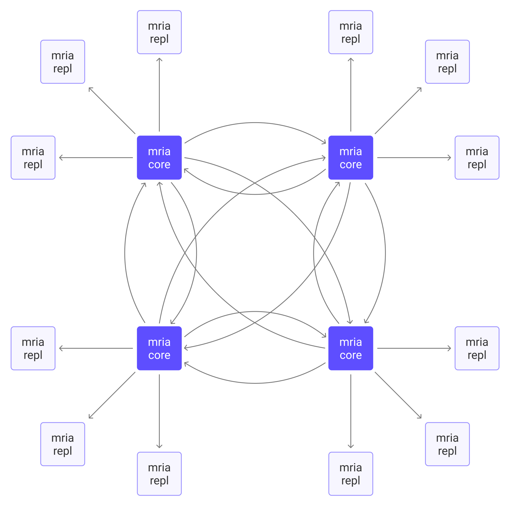

# クラスターアーキテクチャ

<!--ユーザーがすべてのノードをコアノードとして扱うクラスターの操作方法についてのセクションを追加する必要があります-->

EMQX 5.0から、新しい[Mria](https://github.com/emqx/mria)クラスターアーキテクチャが導入され、データレプリケーション機構も再設計されました。これによりEMQXの水平スケーラビリティが大幅に向上し、単一のEMQX 5.0クラスターで最大1億のMQTT接続をサポート可能となった重要な要素の一つです。

本ページでは、新アーキテクチャに基づくEMQXクラスターの展開モデルと、展開時の主な考慮点について紹介します。自動化されたクラスター展開については、[EMQX Kubernetes Operator](https://www.emqx.com/zh/emqx-kubernetes-operator)および[EMQXコアノードとレプリカントノードの設定](https://docs.emqx.com/en/emqx-operator/latest/tasks/configure-emqx-core-replicant.html)のガイドを参照してください。

::: tip 前提知識

まずは[EMQXクラスタリング](./introduction.md)をお読みになることを推奨します。

:::

## Mriaアーキテクチャ概要

MriaはErlangのネイティブデータベースであるMnesiaのオープンソース拡張であり、最終的整合性を実現したデータレプリケーションを可能にします。非同期トランザクションログレプリケーションが有効になると、ノード間接続のトポロジーはMnesiaの**フルメッシュ**モデルからMriaの**メッシュ＋スター**ハイブリッドトポロジーに変わります。



### ノードの役割説明

クラスター内のノードは、コアノードとレプリカントノードの2つの役割に分類されます。

#### コアノード

コアノードはクラスターのフルメッシュ型データレイヤーを形成します。各コアノードは完全かつ最新のデータレプリカを保持し、フォールトトレランスを確保します。つまり、1つでもコアノードが稼働していればデータは失われません。コアノードは基本的に静的かつ永続的であり、頻繁に追加・削除・置換されるオートスケーリングには推奨されません。

#### レプリカントノード

レプリカントノードはコアノードに接続し、そこからのデータ更新を受動的にレプリケートします。書き込み操作は許可されず、すべての書き込みはコアノードに転送され処理されます。ローカルに完全なデータコピーを持つため、レプリカントは高速な読み取りアクセスと低いルーティングレイテンシを提供します。

### Mriaアーキテクチャの利点

Mriaアーキテクチャはリーダーレスレプリケーションとマスター・スレーブレプリケーションの長所を組み合わせ、以下のような利点をもたらします。

- **水平スケーラビリティの向上**：EMQX 5.0は最大23ノードの大規模クラスターをサポートします。
- **クラスターのオートスケーリングが簡素化**：レプリカントノードは動的に追加・削除でき、自動スケーリングに対応します。

EMQX 4.xではすべてのノードがフルメッシュ接続であったため、ノード数増加に伴い同期オーバーヘッドが増大していましたが、EMQX 5.0ではレプリカントノードを読み取り専用にすることでこの問題を回避しています。レプリカントが増えても書き込み効率は低下せず、より大規模なクラスター形成が可能です。

さらに、レプリカントノードは使い捨て可能でスケールイン・アウトが容易な設計となっており、オートスケーリンググループに最適でDevOpsの効率化にも寄与します。

> **注意**：データセットが大きくなると、コアノードから新しいレプリカントへの初期データ同期に多くのリソースを要する場合があります。レプリカントノードのオートスケーリングポリシーは過度に積極的にしないよう注意してください。

## 展開アーキテクチャ

デフォルトではすべてのノードがコアノードの役割を担い、クラスターは[EMQX 4.x](https://docs.emqx.com/en/enterprise/v4.4/getting-started/cluster.html#node-discovery-and-autocluster)と同様の動作をします。これは7ノード以下の小規模クラスターに推奨される構成です。コア＋レプリカントモードはクラスターが7ノードを超える場合にのみ推奨されます。

::: tip 注意

コア＋レプリカントクラスターアーキテクチャはEMQX Enterprise版のみで利用可能です。オープンソース版はコアノードのみのクラスターをサポートします。

:::

::: tip 推奨

クラスターには最低1つのコアノードを含める必要があります。ベストプラクティスとして、3つのコアノード＋N個のレプリカントノードで開始することを推奨します。

:::

ノードの役割割り当ては実際のビジネス要件と想定されるクラスター規模に基づいて行うべきです。

| シナリオ                     | 推奨展開                                                   |
| ---------------------------- | ---------------------------------------------------------- |
| 小規模クラスター（7ノード以下） | コアノードのみで十分。すべてのノードがMQTTトラフィックを処理。 |
| 中規模クラスター             | コアノードがMQTTトラフィックを処理するかはワークロード次第。テスト推奨。 |
| 大規模クラスター（10ノード以上） | コアノードはデータベース層のみ担当。MQTTトラフィックはレプリカントノードが処理し、安定性とスケーラビリティを最大化。 |

## コア＋レプリカントモードの有効化

コア＋レプリカントモードを有効にするには、特定のノードをレプリカントノードとして指定する必要があります。これは`node.role`パラメータを`replicant`に設定することで実現します。加えて、自動クラスター[ディスカバリ戦略](../../guides/cluster/create-cluster.md#node-discovery)（`cluster.discovery_strategy`）を有効にする必要があります。

::: tip

レプリカントノードは`manual`ディスカバリ戦略を使用してコアノードを検出できません。

:::

設定例：

```bash
node {
    ## ノードをレプリカントノードとして設定する場合：
    role = replicant
}
cluster {
    ## 静的ディスカバリ戦略を有効化：
    discovery_strategy = static
    static.seeds = [emqx@host1.local, emqx@host2.local]
}
```

## ネットワークおよびハードウェア要件

### ネットワーク

- コアノード間のネットワークレイテンシは10ms未満が望ましい。100msを超えるとクラスター障害の原因となる可能性があります。
- コアノードは同一プライベートネットワーク内に配置することを強く推奨します。
- レプリカントノードもコアノードと同じプライベートネットワークに配置すべきですが、ネットワーク品質の要件はやや緩やかです。

### CPUおよびメモリ

コアノードはメモリを多く必要としますが、クライアント接続を処理していない場合のCPU使用率は比較的低いです。レプリカントノードはEMQX 4.xと同様のハードウェアサイズを想定し、接続数とメッセージスループットに応じてメモリ要件を見積もってください。

## 監視とデバッグ

<!-- TODO 後続で数値型のGaugeまたはCounterを補足 -->

MriaのパフォーマンスはPrometheusメトリクスまたはErlangコンソールで監視可能です。

### Prometheus指標

Prometheusと連携してクラスターの動作を監視できます。連携方法については[ログと可観測性 - Prometheus連携](../../guides/observability/prometheus.md)を参照してください。

#### コアノード

| 指標名                            | 説明                                                         |
| --------------------------------- | ------------------------------------------------------------ |
| `emqx_mria_last_intercepted_trans` | ノード起動以降にシャードが受信したトランザクション数           |
| `emqx_mria_weight`                | コアノードの瞬間的な負荷                                        |
| `emqx_mria_replicants`            | コアノードに接続しているレプリカントノード数（シャードごとに集計） |
| `emqx_mria_server_mql`            | レプリカントノードに送信待ちのトランザクション数。少ないほど良い。<br />この指標が増加傾向にある場合はコアノードの増設が必要。 |

#### レプリカントノード

| 指標名                          | 説明                                                         |
| ------------------------------- | ------------------------------------------------------------ |
| `emqx_mria_lag`                 | レプリカントが上流のコアノードにどれだけ遅れているかを示す。少ないほど良い。 |
| `emqx_mria_bootstrap_time`      | レプリカントノードの起動時間。正常稼働時は安定しているべき値。        |
| `emqx_mria_bootstrap_num_keys`  | 起動時にコアノードからコピーされたデータベースレコード数。正常稼働時は安定しているべき値。 |
| `emqx_mria_message_queue_len`   | メッセージレプリケーション時のキュー長。0付近が望ましい。           |
| `emqx_mria_replayq_len`         | レプリカントノード内部のリプレイキュー長。少ないほど良い。           |

### コンソールコマンド

Erlangコンソール上で`emqx eval 'mria_rlog:status().'`コマンドを実行してクラスターの稼働状況を監視できます。

EMQXクラスターが正常に稼働している場合、現在のログレベル、処理済みメッセージ数、ドロップされたメッセージ数などのステータス情報が一覧表示されます。

<!--ここにクエリ文と返されるメッセージ例を追加し、Erlangコンソールのリファレンス https://www.erlang.org/doc/man/shell.html へのリンクも検討 -->

参照：[Mriaログとアラーム](../../guides/observability/mria-alarms.md)
