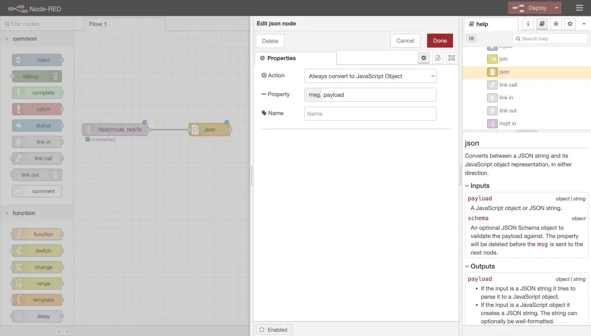
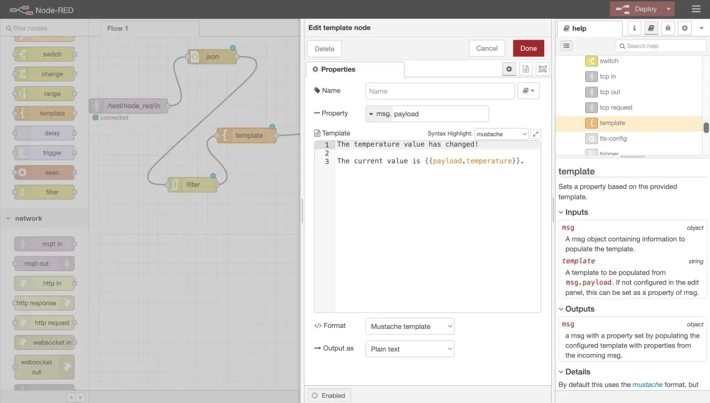

# EMQXでNode-REDを使う

[Node-RED](https://nodered.org/)は、ハードウェアデバイス、API、オンラインサービスをブラウザベースのエディターで接続するためのフローベースプログラミングツールです。視覚的なノードベースのインターフェースを使い、あらかじめ用意されたノードをつなげてデータフローを作成します。Node-REDは組み込みの`mqtt-in`（サブスクライブ）と`mqtt-out`（パブリッシュ）ノードを通じてMQTTをネイティブにサポートしており、EMQXからのIoTデータ処理に人気があります。

本ページでは、Node-REDのインストール方法、EMQXへの接続方法、およびMQTTメッセージを解析、フィルタリング、変換するデータ処理パイプラインの構築方法を説明します。

## 前提条件

- Node.js 18 LTSまたは20 LTS（NPMインストール用）
- EMQXのデプロイメント、またはテスト用にEMQXパブリックブローカーを利用
- テストメッセージ送信用の[MQTTX](https://mqttx.app/)などのMQTTクライアント

## Node-REDのインストール

**NPM経由の場合:**

```bash
npm install -g --unsafe-perm node-red
```

続いてNode-REDを起動します:

```bash
node-red
```

**Docker経由の場合:**

```bash
docker run -it -p 1880:1880 --name mynodered nodered/node-red
```

起動後、ブラウザで`http://127.0.0.1:1880`にアクセスするとNode-REDエディターが開きます。


> Raspberry Piやクラウドデプロイなど、その他のインストールオプションについては[Node-REDドキュメント](https://nodered.org/docs/getting-started/)を参照してください。

## MQTTブローカーのセットアップ

Node-REDが接続するためのMQTTブローカーが必要です。本ガイドではMQTT 3.1、3.1.1、5.0をサポートするEMQXを使用します。

### EMQXパブリックブローカー（テスト用）

独自のブローカーをデプロイせずにすぐにテストしたい場合は、EMQXパブリックブローカーを利用できます。

| パラメーター       | 値                 |
| ------------------ | ------------------ |
| ブローカーアドレス | `broker.emqx.io`   |
| TCPポート          | `1883`             |
| SSL/TLSポート      | `8883`             |
| WebSocketポート    | `8083`             |
| セキュアWebSocketポート | `8084`         |

パブリックブローカーはテストおよびデモ目的のみを想定しています。

### EMQXエンタープライズデプロイメント

本番環境では、独自のEMQXエンタープライズデプロイメントにNode-REDを接続します。ブローカーアドレス、ポート、認証情報は環境に応じて設定してください。

一般的な構成例：

- カスタムブローカーのホスト名またはIPアドレス
- ユーザー名/パスワード認証または相互TLS認証
- トピックに適用されるアクセス制御ルール（ACL）

Node-REDのブローカー接続設定時には、EMQXエンタープライズのリスナーおよび認証設定を参照してください。

> 自己管理型EMQXエンタープライズのほか、フルマネージドMQTTサービスである[EMQX Cloud](https://docs.emqx.com/en/cloud/latest/)（ServerlessまたはDedicated）への接続も可能です。EMQX Cloudから提供されるブローカーアドレス、ポート、認証情報を使用してください。

## 基本的なMQTTフローの構築

以下の手順で、1つのトピックをサブスクライブし、受信したメッセージを別のトピックに転送する最小限のフローを作成します。

### ステップ1: MQTTサブスクライブノードを追加

1. Node-REDエディターの左パレットから**mqtt-in**ノードをキャンバスにドラッグします。

2. ノードをダブルクリックしてプロパティを開きます。

3. **Server**フィールド横の鉛筆アイコンをクリックし、新しいブローカー接続を作成します。

4. **Server**アドレスに`broker.emqx.io`を入力し、**Add**をクリックします。

   

5. **Topic**に`test/node_red/in`を設定します。

6. 必要に応じて**QoS**レベルを設定し、**Done**をクリックします。

   

### ステップ2: MQTTパブリッシュノードを追加

1. **mqtt-out**ノードをキャンバスにドラッグします。

2. ノードをダブルクリックしてプロパティを開きます。

3. ステップ1で設定したブローカーを**Server**ドロップダウンから選択します。

4. **Topic**に`test/node_red/out`を設定します。

5. 必要に応じて**QoS**と**Retain**を設定し、**Done**をクリックします。

   

### ステップ3: 接続とデプロイ

1. **mqtt-in**ノードの出力ポートから**mqtt-out**ノードの入力ポートへワイヤーを引きます。

2. 右上の**Deploy**ボタンをクリックします。

3. 両ノードのステータスが緑色の**connected**を示していることを確認します。

これで、`test/node_red/in`で受信したすべてのメッセージが`test/node_red/out`に転送されるフローが完成しました。


## 高度なデータ処理パイプラインの構築

Node-REDの真価は複数ノードを連結し、データをフィルタリングや変換して再パブリッシュできる点にあります。以下の例では、次の処理を行うパイプラインを構築します。

1. MQTT経由でJSON形式のセンサーデータを受信。
2. 生のペイロードをJavaScriptオブジェクトにパース。
3. 重複する温度データをフィルタリング。
4. 結果をフォーマットして再パブリッシュ。

フロー全体は次の通りです：**mqtt-in** -> **json** -> **rbe** -> **template** -> **mqtt-out**

### ステップ1: JSONノードを追加

1. パレットから**json**ノードをキャンバスにドラッグします。

2. ダブルクリックして設定を開き、**Action**を**常にJavaScriptオブジェクトに変換**に設定します。

3. **Done**をクリックします。

4. **mqtt-in**ノードの出力を**json**ノードの入力に接続します。

これにより、受信したペイロードがJavaScriptオブジェクトにパースされ、下流のノードで`msg.payload.temperature`などの個別フィールドにアクセス可能になります。



### ステップ2: フィルターノードを追加

1. **rbe**（report by exception）ノードをキャンバスにドラッグします。

2. ダブルクリックして設定を開きます。

   - **Mode**を**値が変わらない限りブロック**に設定。
   - **Property**に`msg.payload.temperature`を指定。

3. **Done**をクリックします。

4. **json**ノードの出力を**rbe**ノードの入力に接続します。

このフィルターノードは、前回のメッセージと温度が変わらない場合にメッセージをブロックし、同じ値の繰り返しによる不要なトラフィックを削減します。


### ステップ3: テンプレートノードを追加

1. **template**ノードをキャンバスにドラッグします。

2. ダブルクリックして設定を開き、Mustache構文を用いて出力フォーマットを指定します。例：

   ```
   {"temperature": {{payload.temperature}}, "humidity": {{payload.humidity}}}
   ```

3. **Done**をクリックします。

4. **rbe**ノードの出力を**template**ノードの入力に接続します。



### ステップ4: 出力ノードに接続してデプロイ

1. **template**ノードの出力を**mqtt-out**ノードの入力に接続します。

2. **Deploy**をクリックします。

3. すべてのノードが緑色の**connected**ステータスを示していることを確認します。

> フィルタリングしたデータを再フォーマットせずにそのまま再パブリッシュしたい場合は、**template**ノードを省略し、**rbe**ノードを直接**mqtt-out**ノードに接続してください。


## フローのテスト

MQTTXや任意のMQTTクライアントを使ってパイプラインをテストします。

1. `test/node_red/out`をサブスクライブして処理済みの出力を監視します。

2. `test/node_red/in`にJSONペイロードのテストメッセージをパブリッシュします。例：

   ```json
   {"temperature": 25, "humidity": 60}
   ```

3. 出力トピックにメッセージが現れることを確認します。

4. 同じメッセージを再度パブリッシュします。**rbe**フィルターにより重複が抑制され、出力は現れません。

5. 温度値を変更してパブリッシュします：

   ```json
   {"temperature": 26, "humidity": 60}
   ```

6. このメッセージはフィルターを通過し、出力トピックに表示されることを確認します。


## トラブルシューティング

### ノードが「disconnected」ステータスを表示する

**説明**

- デプロイ後、**mqtt-in**または**mqtt-out**ノードが赤い**disconnected**インジケーターを表示する。

**考えられる原因**

- ブローカーアドレスまたはポートの誤り
- ネットワークファイアウォールがポート`1883`または`8883`をブロックしている
- ブローカーが起動していない

**対処法**

- ノードをダブルクリックし、**Server**横の鉛筆アイコンをクリックしてブローカーアドレスとポートを確認する。
- MQTTXなど別のMQTTクライアントでマシンからブローカーへの基本的な接続をテストする。
- TLSを使用している場合は、正しいポート（`8883`）とCA証明書が設定されているか確認する。

### 入力トピックでメッセージが受信されない

**説明**

- **mqtt-in**ノードは接続済みだがメッセージが届かない。

**考えられる原因**

- パブリッシャーとサブスクライバー間でトピック名が一致していない
- QoSレベルの不整合
- ブローカーのACLルールがサブスクリプションをブロックしている

**対処法**

- パブリッシャーが**mqtt-in**ノードで設定した正確なトピック（`test/node_red/in`）に送信しているか確認する。
- Node-REDのデバッグノードを使い、フローの各段階でメッセージを検査する。
- ブローカーの認証およびACL設定を確認する。

### フィルターノードがすべてのメッセージをブロックする

**説明**

- 温度値が変化しても出力トピックにメッセージが現れない。

**考えられる原因**

- **rbe**ノードのプロパティパスが誤っている
- JSONノードがフィルターの前にペイロードをパースしていない

**対処法**

- **json**ノードが**rbe**ノードの前に配置され、**常にJavaScriptオブジェクトに変換**に設定されているか確認する。
- **rbe**ノードのプロパティが`msg.payload.temperature`（`payload.temperature`ではない）に設定されているか確認する。
- **json**ノードの後に**debug**ノードを追加し、`msg.payload`の構造を確認する。

### 認証に失敗する

**説明**

- デプロイ直後にノードが**disconnected**となり、ブローカーのログに認証エラーが表示される。

**考えられる原因**

- ブローカー設定でユーザー名またはパスワードが不足または誤っている
- トピックに対するACL制限

**対処法**

- ノードをダブルクリックし、ブローカー設定の**Security**タブで正しいユーザー名とパスワードを入力する。
- EMQXの認証設定を確認する。

## さらに詳しく

詳細な解説や追加の例については、ブログ記事[Using Node-RED to Process MQTT Data](https://www.emqx.com/en/blog/using-node-red-to-process-mqtt-data)をご覧ください。
