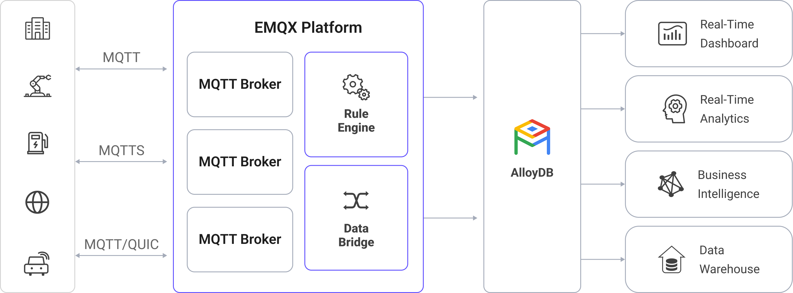

# AlloyDB に MQTT データを取り込む

[AlloyDB for PostgreSQL](https://cloud.google.com/products/alloydb?hl=en) は、Google Cloud が提供する完全マネージドの PostgreSQL 互換データベースサービスであり、厳しいエンタープライズワークロードに対応するよう設計されています。EMQX は AlloyDB とのシームレスな統合をサポートしており、IoT デバイスからの MQTT データをリアルタイムに取り込み、保存できます。EMQX の効率的なメッセージルーティングと AlloyDB の高スループットなトランザクション処理能力およびハイブリッドトランザクショナル／アナリティカル処理（HTAP）エンジンによるリアルタイム分析を活用することで、デバイスの状態取得、イベントのログ記録、洞察に富んだ分析を行う強力なパイプラインを実現します。

本ページでは、EMQX と AlloyDB 間のデータ統合について包括的に紹介し、データ統合の作成および検証に関する実践的な手順を説明します。

## 動作概要

EMQX における AlloyDB データ統合は組み込み機能であり、MQTT ベースの IoT データストリームを AlloyDB の高性能な PostgreSQL 互換データベースに直接取り込みます。組み込みの[ルールエンジン](./rules.md) コンポーネントを利用することで、EMQX から AlloyDB へのデータ取り込みと分析のプロセスを簡素化し、複雑なコーディングを不要にします。AlloyDB Sink を通じて、MQTT メッセージやクライアントイベントを AlloyDB に保存できます。また、イベントに応じて AlloyDB 内のデータを更新または削除する操作をトリガーでき、デバイスのオンライン状態や接続履歴などの情報を記録可能です。

以下の図は、EMQX と AlloyDB 間のデータ統合の典型的なアーキテクチャを示しています。




AlloyDB への MQTT データ取り込みは以下のように動作します：

1. **IoT デバイスが EMQX に接続**：IoT デバイスが MQTT プロトコルを通じて正常に接続されると、オンラインイベントがトリガーされます。イベントにはデバイス ID、送信元 IP アドレス、その他属性情報が含まれます。
2. **メッセージのパブリッシュと受信**：デバイスは特定のトピックにテレメトリや状態データをパブリッシュします。EMQX がこれらのメッセージを受信すると、ルールエンジン内でマッチング処理が開始されます。
3. **ルールエンジンによるメッセージ処理**：EMQX のルールエンジンは、トピックやメッセージ内容に基づいて定義されたルールにマッチさせてイベントやメッセージを処理します。処理にはデータ変換（例：JSON から SQL 用フォーマットへの変換）、フィルタリング、文脈情報によるデータ強化などが含まれ、データベース挿入前に行われます。
4. **AlloyDB への書き込み**：マッチしたルールが AlloyDB に対する SQL 実行をトリガーします。SQL テンプレートを用いて、処理済みデータのフィールドを AlloyDB のテーブルやカラムにマッピング可能です。AlloyDB は並列クエリ実行と組み込みのカラムナーエンジンによる最適化ストレージをサポートしているため、高速かつ即時にクエリ可能な状態でデータを挿入できます。

イベントおよびメッセージデータが AlloyDB に書き込まれた後は、AlloyDB に接続してデータを読み取り、以下のような柔軟なアプリケーション開発が可能です：

- Grafana などの可視化ツールに接続し、データに基づくチャート生成やデータ変化の表示
- AlloyDB とデバイス管理システムや分析モデルを統合し、デバイスの健全性監視、異常検知、アラート発動
- AlloyDB の HTAP 機能を活用し、ライブの IoT データに対して複雑な分析（集計、結合、時系列クエリ）を実行しつつ、新しいデバイステレメトリのリアルタイム処理を継続

## 特長と利点

AlloyDB とのデータ統合により、以下の特長とメリットをビジネスにもたらします：

- **柔軟なイベント処理**：EMQX のルールエンジンを利用することで、AlloyDB はデバイスのライフサイクルイベント（接続、切断、状態変化）を低レイテンシで保存・処理可能です。AlloyDB の並列クエリ実行と独立スケーリングと組み合わせることで、イベントデータをリアルタイムに分析し、デバイス障害や異常、利用傾向を検知できます。
- **メッセージ変換**：メッセージは EMQX のルールを通じて広範な処理・変換を受けてから AlloyDB に書き込まれるため、保存や利用がより便利になります。
- **SQL テンプレートによる柔軟なデータ操作**：EMQX の SQL テンプレートマッピングを使い、構造化された IoT データを AlloyDB のテーブルやカラムに挿入または更新できます。AlloyDB の PostgreSQL 互換性により標準 SQL、JSONB ストレージ、インデックスが利用可能で、AI によるインデックス最適化によりクエリ性能がワークロードの変化に応じて自動改善されます。
- **ビジネスプロセスの統合**：AlloyDB の PostgreSQL エコシステム互換性により、Google Cloud 上またはオンプレミスの ERP、CRM、GIS、カスタム業務システムと直接統合可能です。EMQX と組み合わせることで、複雑なデータパイプラインなしにイベント駆動の自動化や業務プロセスオーケストレーションを実現できます。
- **高度な地理空間機能**：PostgreSQL 拡張機能の PostGIS などを通じて、AlloyDB は地理空間データの保存、インデックス作成、クエリをサポートし、ジオフェンシング、ルート追跡、位置情報分析を可能にします。EMQX の信頼性の高い MQTT 取り込みと組み合わせることで、車両追跡、資産監視などのリアルタイム IoT-GIS ソリューションを構築できます。
- **組み込みのメトリクスと監視**：EMQX は各 AlloyDB Sink のランタイムメトリクスを提供し、AlloyDB は Cloud Monitoring と連携してクエリ性能、ストレージ使用率、レプリカの健全性を監視し、エンドツーエンドの可観測性を確保します。

## はじめる前に

このセクションでは、AlloyDB 統合の作成を開始する前に必要な準備、特に AlloyDB インスタンスの作成およびデータベースとデータテーブルの作成方法について説明します。

### 前提条件

- EMQX データ統合の[ルール](./rules.md)に関する知識
- [データ統合](./data-bridges.md)に関する知識

### AlloyDB でのデータベースとテーブルの作成

EMQX で AlloyDB コネクターを作成する前に、AlloyDB インスタンスが利用可能であること、および IoT データを保存するための必要なデータベースとテーブルが作成されていることを確認してください。

[公式 AlloyDB クイックスタートガイド](https://cloud.google.com/alloydb/docs/quickstart/create-and-connect) に従って以下を実施します：

1. AlloyDB インスタンスを作成します。

   - このセットアップ中に、本例では以下のデータベースユーザー資格情報を定義します：

     - **ユーザー名**：`emqx_user`（接続、挿入、更新、選択の権限を持つ必要があります）

     - **パスワード**：`your_password_here`

   - このユーザーはインスタンスのプロビジョニング時に作成するか、後から SQL、Google Cloud コンソール、または `gcloud` CLI を使って作成可能です。

2. インスタンス内にデータベースを作成します。本例ではデータベース名を `emqx_data` とします。

3. PostgreSQL 互換クライアント（例：`psql`）を使い、上記の資格情報でデータベースに接続します。

4. MQTT メッセージおよびクライアントイベントデータを保存するための2つのテーブルを `emqx_data` データベース内に作成します。

   - 以下の SQL 文を使い、クライアント ID、トピック、QoS、ペイロード、到着時間などのメタデータを含む MQTT メッセージを保存する `t_mqtt_msg` テーブルを作成します：

     ```sql
     CREATE TABLE t_mqtt_msg (
       id SERIAL primary key,
       msgid character varying(64),
       sender character varying(64),
       topic character varying(255),
       qos integer,
       retain integer,
       payload text,
       arrived timestamp without time zone
     );
     ```

   - 以下の SQL 文を使い、クライアントのオンライン／オフラインイベントとタイムスタンプを保存する `emqx_client_events` テーブルを作成します：

     ```sql
     CREATE TABLE emqx_client_events (
       id SERIAL primary key,
       clientid VARCHAR(255),
       event VARCHAR(255),
       created_at TIMESTAMP DEFAULT CURRENT_TIMESTAMP
     );
     ```

## AlloyDB コネクターの作成

AlloyDB Sink を追加する前に、EMQX で AlloyDB コネクターを作成します。コネクターは EMQX が Google Cloud 上の AlloyDB インスタンスに接続する方法を定義します。

1. EMQX ダッシュボードで **Integration** -> **Connector** に移動します。

2. ページ右上の **Create** をクリックします。

3. **Create Connector** ページで **AlloyDB** を選択し、**Next** をクリックします。

4. コネクターの名前を入力します。名前は英数字で始まり、英数字、ハイフン、アンダースコアを含めることができます。例：`my_alloydb`

5. 接続情報を入力します：

   - **Server Host**：Google Cloud 上の AlloyDB インスタンスのホスト名または IP アドレス
   - **Database Name**：EMQX がデータを書き込む AlloyDB 内の対象データベース名。本例では `emqx_data`
   - **Username**：認証および識別に使用する AlloyDB のデータベースユーザー名。本例では `emqx_user`
   - **Password**：`emqx_user` のパスワード
   - **Enable TLS**：暗号化接続を確立する場合はトグルスイッチをオンにします。TLS 接続の詳細は [TLS for External Resource Access](../../guides/network/overview.md#tls-for-external-resource-access) を参照してください。

6. 詳細設定（任意）：接続プールサイズ、アイドルタイムアウト、リクエストタイムアウトなどの追加接続プロパティを設定可能です。

7. **Test Connectivity** をクリックし、EMQX が指定した設定で AlloyDB インスタンスに正常に接続できるか検証します。

8. **Create** をクリックしてコネクターを保存します。

9. 作成後、以下のいずれかを選択できます：

   - **Back to Connector List** をクリックしてすべてのコネクターを表示
   - **Create Rule** をクリックして、このコネクターを使った AlloyDB へのデータ転送ルールをすぐに作成

   詳細な例は以下を参照してください：

   - [メッセージ保存用 AlloyDB Sink を使ったルールの作成](#create-a-rule-with-alloydb-sink-for-message-storage)
   - [イベント記録用 AlloyDB Sink を使ったルールの作成](#create-a-rule-with-alloydb-sink-for-events-recording)

## メッセージ保存用 AlloyDB Sink を使ったルールの作成

このセクションでは、ダッシュボードでソース MQTT トピック `t/#` からのメッセージを処理し、処理済みデータを設定済み Sink を通じて AlloyDB の `t_mqtt_msg` テーブルに保存するルールの作成方法を示します。

1. ダッシュボードの **Integration** -> **Rules** ページに移動します。

2. ページ右上の **Create** をクリックします。

3. ルール ID に `my_rule` を入力し、SQL エディターにルールを入力します。ここではトピック `t/#` の MQTT メッセージを AlloyDB に保存するため、ルールの SELECT 部分で SQL テンプレートで使うすべての変数を含むフィールドを選択していることを確認してください。ルール SQL は以下の通りです：

   ```sql
   SELECT
   *
   FROM
   "t/#"
   ```

   ::: tip

   初心者の場合は **SQL Examples** をクリックし、**Enable Test** を有効にして SQL ルールを学習・テストできます。

   :::

4. + **Add Action** ボタンをクリックしてルールでトリガーされるアクションを定義します。このアクションにより、EMQX はルールで処理したデータを AlloyDB に送信します。

5. **Type of Action** ドロップダウンから AlloyDB を選択し、**Action** ドロップダウンはデフォルトの `Create Action` のままにするか、既存の AlloyDB アクションを選択します。本例では新規 Sink を作成してルールに追加します。

6. Sink の名前と説明をフォームに入力します。

7. **Connector** ドロップダウンから先ほど作成した `my_alloydb` を選択します。新規コネクターを作成する場合はドロップダウン横のボタンをクリックします。設定パラメータの詳細は [AlloyDB コネクターの作成](#create-an-alloydb-connector) を参照してください。

8. **SQL Template** を設定します。以下の SQL 文を使ってデータを挿入します。

   注意：これは[プリプロセス済み SQL](./data-bridges.md#prepared-statement)のため、フィールドは引用符で囲まず、文末にセミコロンを付けないでください。

   ```sql
   INSERT INTO t_mqtt_msg(msgid, sender, topic, qos, payload, arrived) VALUES(
     ${id},
     ${clientid},
     ${topic},
     ${qos},
     ${payload},
     TO_TIMESTAMP((${timestamp} :: bigint)/1000)
   )
   ```

9. **フォールバックアクション（任意）**：メッセージ配信失敗時の信頼性向上のため、1つ以上のフォールバックアクションを定義できます。詳細は [Fallback Actions](./data-bridges.md#fallback-actions) を参照してください。

10. **詳細設定（任意）**：詳細は [Sink の機能](./data-bridges.md#features-of-sink) を参照してください。

11. **Create** をクリックする前に、**Test Connectivity** をクリックして Sink が AlloyDB インスタンスに接続可能かテストできます。

12. **Create** ボタンをクリックして Sink の設定を完了します。新しい Sink が **Action Outputs** に追加されます。

13. **Create Rule** ページで設定内容を確認し、**Save** ボタンをクリックしてルールを生成します。

ルールが正常に作成されたら、**Integration** -> **Rules** ページで新規ルールを確認でき、**Action (Sink)** タブに新規 AlloyDB Sink が表示されます。

また、**Integration** -> **Flow Designer** でトポロジーを確認でき、トピック `t/#` のメッセージがルール `my_rule` によって解析され AlloyDB に書き込まれている様子を可視化できます。

## イベント記録用 AlloyDB Sink を使ったルールの作成

このセクションでは、クライアントのオンライン／オフライン状態を記録し、イベントデータを設定済み Sink を通じて AlloyDB の `emqx_client_events` テーブルに保存するルールの作成方法を示します。

手順は[メッセージ保存用 AlloyDB Sink を使ったルールの作成](#create-a-rule-with-alloydb-sink-for-message-storage)とほぼ同様で、SQL テンプレートと SQL ルールのみ異なります。

オンライン／オフライン状態記録用の SQL ルール文は以下の通りです。

```sql
SELECT
  *
FROM
  "$events/client_connected", "$events/client_disconnected"
```

イベント記録用の SQL テンプレートは以下の通りです。

注意：これは[プリプロセス済み SQL](./data-bridges.md#prepared-statement)のため、フィールドは引用符で囲まず、文末にセミコロンを付けないでください。

```sql
INSERT INTO emqx_client_events(clientid, event, created_at) VALUES (
  ${clientid},
  ${event},
  TO_TIMESTAMP((${timestamp} :: bigint)/1000)
)
```

## ルールのテスト

MQTTX を使い、トピック `t/1` にメッセージを送信してオンライン／オフラインイベントをトリガーします。

```bash
mqttx pub -i emqx_c -t t/1 -m '{ "msg": "hello AlloyDB" }'
```

2つの Sink の稼働状況を確認します。メッセージ保存用 Sink では新規の受信メッセージと送信メッセージがそれぞれ1件ずつあるはずです。イベント記録用 Sink では2件のイベントレコードがあります。

`t_mqtt_msg` データテーブルにデータが書き込まれているか確認します。

```bash
emqx_data=# select * from t_mqtt_msg;
 id |              msgid               | sender | topic | qos | retain |            payload
        |       arrived
----+----------------------------------+--------+-------+-----+--------+-------------------------------+---------------------
  1 | 0005F298A0F0AEE2F443000012DC0002 | emqx_c | t/1   |   0 |        | { "msg": "hello AlloyDB" } | 2023-01-19 07:10:32
(1 row)

```

`emqx_client_events` テーブルにデータが書き込まれているか確認します。

```bash
emqx_data=# select * from emqx_client_events;
 id | clientid |        event        |     created_at
----+----------+---------------------+---------------------
  3 | emqx_c   | client.connected    | 2023-01-19 07:10:32
  4 | emqx_c   | client.disconnected | 2023-01-19 07:10:32
(2 rows)

```
