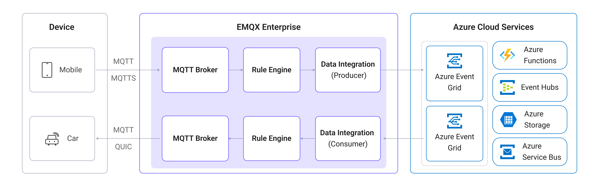

# Azure Event Grid MQTTとのブリッジ

[Azure Event Grid](https://azure.microsoft.com/en-us/products/event-grid)は、Azure上のフルマネージドなイベントルーティングサービスです。そのMQTTブローカー機能により、IoTデバイスとクラウドアプリケーション間で標準ベースの双方向MQTT通信を大規模に実現できます。EMQXはAzure Event Grid向けの組み込みコネクターを提供しており、EMQXとAzure Event Grid間でMQTTデータをブリッジし、Azureのクラウドサービスエコシステムとシームレスに統合できます。

本ページでは、EMQXとAzure Event Grid MQTTの統合について詳細に解説し、SinkおよびSourceの作成と検証手順を実践的に説明します。

## 動作概要

Azure Event Gridとのデータ統合は、EMQXのデバイス接続性とメッセージ送信機能をAzure Event GridのクラウドネイティブMQTTブローカーと組み合わせた標準機能です。EMQXはMQTTクライアントとしてAzure Event Grid MQTTブローカーに接続し、双方向のメッセージ送受信を可能にします。

- **送信メッセージ（Sink）**：EMQXはローカルのMQTTトピックからAzure Event Gridの指定トピックへメッセージをパブリッシュします。
- **受信メッセージ（Source）**：EMQXはAzure Event Gridのトピックをサブスクライブし、受信したメッセージをローカルのEMQXトピックに転送します。

以下の図は統合の典型的なアーキテクチャを示しています：



## 特長とメリット

Azure Event Gridとのデータ統合は以下の特長とメリットを提供します：

- **標準ベースのMQTTブリッジ**：Azure Event GridはMQTT 3.1.1およびMQTT 5.0をサポートし、EMQXは標準MQTTプロトコルでブリッジ接続でき、任意のMQTT互換クライアントやサービスと相互運用可能です。
- **双方向データフロー**：EMQXからAzure Event Gridへのメッセージパブリッシュ（Sink）と、Azure Event GridトピックのサブスクライブおよびEMQXへの転送（Source）の両方をサポートし、柔軟なIoTデータルーティングを実現します。
- **安全な接続**：Azure Event GridはTLSを必須とします。コネクターはTLSをデフォルトで有効化し、クライアント証明書認証もサポートしており、本番環境での推奨認証方式です。
- **柔軟なトピックマッピング**：EMQXのルールエンジンを通じてメッセージのフィルタリング、変換、動的トピックマッピングによる特定Azure Event Gridトピックスペースへのルーティングが可能です。
- **豊富なAzureエコシステム連携**：データがAzure Event Gridに到達すると、Azure Functions、Azure Event Hubs、Azure Storageなど他のAzureサービスへルーティングし、さらなる処理や分析が行えます。

## はじめる前に

### 前提条件

- EMQXのデータ統合[ルール](./rules.md)の知識
- [データ統合](./data-bridges.md)の知識

### Azure Event Gridのセットアップ

EMQXでデータ統合を作成する前に、MQTTブローカーサポートが有効なAzure Event Gridネームスペースをセットアップしてください。以下のMicrosoftドキュメントにステップバイステップの手順があります：

- [Quickstart: Publish and subscribe to MQTT messages using Azure Event Grid namespace](https://learn.microsoft.com/en-us/azure/event-grid/mqtt-publish-and-subscribe-portal)
- [Azure Event Grid MQTT broker overview](https://learn.microsoft.com/en-us/azure/event-grid/mqtt-overview)
- [How to authenticate MQTT clients using a certificate chain](https://learn.microsoft.com/en-us/azure/event-grid/mqtt-certificate-chain-client-authentication)

セットアップ完了後、EMQXでコネクター作成時に必要となる以下の接続情報を控えてください：

- **ホスト名**：Event GridネームスペースのMQTTブローカーホスト名。形式は `<namespace>.ts.<region>.eventgrid.azure.net`。ポートは`8883`です。
- **クライアント証明書と秘密鍵**：Azure Event Gridはクライアント証明書認証を要求します。証明書と秘密鍵をエクスポートし、コネクターのTLS設定時に使用します。
- **トピックスペース**：Azure Event Gridで設定したトピックスペースと権限バインディング。

::: tip

サポートされている認証方式やTLS要件については、[Azure Event Gridドキュメント](https://learn.microsoft.com/en-us/azure/event-grid/mqtt-client-authentication)を参照してください。

:::

## コネクターの作成

EMQXとAzure Event Gridを接続するコネクターの作成手順を示します。

1. EMQXダッシュボードで **Integration** -> **Connectors** をクリックします。

2. ページ右上の **Create** をクリックします。

3. **Create Connector** ページで **Azure Event Grid** を選択し、**Next** をクリックします。

4. コネクター名を入力します。英数字の組み合わせで、例：`my_azure_event_grid`。

5. 接続情報を設定します：

   - **Server Host**：Event GridネームスペースのMQTTブローカーエンドポイントを入力します。例：`myns.northeurope-1.ts.eventgrid.azure.net:8883`。デフォルトポートは`8883`です。
   - **ClientID Prefix**：（任意）EMQXが生成するクライアントIDのプレフィックスを指定します。EMQXは`[prefix]:{connector name}{random string}:{pool index}`形式で一意のクライアントIDを自動生成します。詳細は[接続プールとクライアントID生成ルール](./data-bridge-mqtt.md#connection-pool-and-client-id-generation-rules)を参照してください。
   - **Username** と **Password**：空欄のままにします。Azure Event Grid MQTTはユーザー名/パスワード認証を使用しません。
   - **Keepalive**：キープアライブ間隔（秒）を指定します。デフォルトは`160`秒です。
   - **MQTT Version**：MQTTプロトコルバージョンを選択します。Azure Event GridはMQTT 3.1.1（`v4`）とMQTT 5.0（`v5`）の両方をサポートします。
   - **Static ClientId Entries**：（任意）特定のEMQXノード用に静的クライアントIDを設定します。Azure Event Gridで事前登録されたクライアントIDが必要な場合に有用です。詳細は[静的クライアントIDの設定](./data-bridge-mqtt.md#configure-static-client-ids)を参照してください。

     ::: tip

     静的クライアントIDが定義されている場合、明示的に割り当てられたEMQXノードのみがMQTT接続を開始します。

     :::

   - **Clean Start**：デフォルトで有効。接続ごとに新しいセッションを開始します。
   - **Enable TLS**：必ず有効にします。Azure Event GridはTLSを必須とします。クライアント証明書認証を使用する場合は、ここで証明書と秘密鍵を設定してください。TLS設定の詳細は[外部リソースアクセスのTLS設定](../../guides/network/overview.md#enable-tls-encryption-for-accessing-external-resources)を参照してください。

6. **詳細設定（任意）**：詳細は[コネクターの詳細設定](#connector-advanced-settings)を参照してください。

7. **Create**をクリックする前に、**Test Connectivity**をクリックしてEMQXがAzure Event Gridに接続できるか確認できます。

8. **Create**をクリックしてコネクターの作成を完了します。作成成功ダイアログが表示され、ルールを今すぐ作成するか尋ねられます。**Create Rule**をクリックするとコネクターが事前選択された状態でルール作成画面に進みます。**Back To Connector List**をクリックすると戻って後でルールを作成できます。

## Azure Event Grid Sinkを使ったルールの作成

ローカルEMQXトピック `t/#` からAzure Event GridへMQTTメッセージを転送するルール作成手順を示します。

1. 前項で**Create Rule**をクリックした場合、**Add Action**パネルが自動で開き、**Type of Action**が`Azure Event Grid`、コネクターが事前選択されています。ステップ5へ進んでください。

   それ以外の場合は、EMQXダッシュボードで **Integration** -> **Rules** を開き、右上の **Create** をクリックし、**+ Add Action** をクリックします。

2. 左側の**SQL Editor**にルールIDと以下のSQLを入力し、トピック `t/#` のメッセージをマッチさせます：

   注意：独自のSQL構文を指定する場合は、Sinkが必要とするすべてのフィールドが`SELECT`句に含まれていることを確認してください。

   ```sql
   SELECT
     *
   FROM
     "t/#"
   ```

   ::: tip

   初心者の方は**SQL Examples**をクリックし、**Enable Test**でSQLルールの学習とテストが可能です。

   :::

3. 右側の**Add Action**パネルで、**Type of Action**ドロップダウンから`Azure Event Grid`を選択します。**Action**はデフォルトの`Create Action`のままにします。

4. **Connectors**ドロップダウンから、先ほど作成した`my_azure_event_grid`コネクターを選択します。新規コネクターはドロップダウン横のボタンから作成可能です。設定パラメーターは[コネクターの作成](#コネクターの作成)を参照してください。

5. Sinkの名前と任意の説明を入力します。

6. Azure Event GridへメッセージをパブリッシュするSinkパラメーターを設定します：

   - **Topic**：Azure Event Gridでパブリッシュするトピック。`${var}`プレースホルダーをサポートします。例：`devices/${clientid}/messages`でクライアントIDに基づく動的トピック設定が可能です。
   - **QoS**：パブリッシュメッセージのQoSレベル。`0`、`1`、`2`のいずれか、または`${qos}`のようなプレースホルダーで元メッセージのQoSを継承可能です。
   - **Retain**：`true`、`false`、または`${flags.retain}`のようなプレースホルダーを選択し、リテインフラグを設定します。
   - **Payload**：メッセージペイロードテンプレート。空欄の場合はルール出力全体を転送し、`${payload}`などを指定するとペイロードのみ転送します。

7. **フォールバックアクション（任意）**：メッセージ配信失敗時の信頼性向上のため、1つ以上のフォールバックアクションを定義できます。詳細は[フォールバックアクション](./data-bridges.md#fallback-actions)を参照してください。

8. **詳細設定（任意）**：詳細は[Sinkの詳細設定](#sink-advanced-settings)を参照してください。

9. **Create**をクリックする前に、**Test Connectivity**でSinkがAzure Event Gridに接続できるかテスト可能です。

10. **Create**をクリックしてSink設定を完了します。新しいSinkが**Action Outputs**に追加されます。

11. **Create Rule**ページに戻り、設定内容を確認して**Save**をクリックしルールを生成します。

これでルールが正常に作成されました。**Integration** -> **Rules**ページで新規ルールを確認できます。**Actions(Sink)**タブで新しいAzure Event Grid Sinkを確認可能です。

また、**Integration** -> **Flow Designer**を開くとトポロジーが表示され、トピック `t/#` のメッセージがルール`my_rule`で処理された後、Azure Event Gridへ転送されていることを確認できます。

## Azure Event Grid Sourceを使ったルールの作成

Azure Event Gridからのメッセージをサブスクライブし、ローカルEMQXトピックに転送するルール作成手順を示します。

### Azure Event Grid Sourceの作成とルールへの追加

1. EMQXダッシュボードで **Integration** -> **Rules** を開き、右上の **Create** をクリックします。

2. ルールIDに`my_rule_source`を入力します。

3. ルールのトリガーソースを設定します。ページ右側の**Data Inputs**タブでデフォルトの**Message**入力を削除し、**Add Input**をクリックしてAzure Event Grid Sourceを作成します。

4. **Add Input**ダイアログで、**Input Type**ドロップダウンから`Azure Event Grid`を選択します。**Source**はデフォルトの`Create Source`のままにします。

5. Sourceの名前と説明を入力します。

6. ドロップダウンから`my_azure_event_grid`コネクターを選択します。

7. Azure Event Gridのサブスクライブ用Sourceパラメーターを設定します：

   - **Topic**：Azure Event Gridでサブスクライブするトピック。`+`および`#`ワイルドカードをサポートします。

     ::: tip

     EMQXがクラスター運用中、またはコネクターが接続プール設定の場合は、重複メッセージを避けるため共有サブスクリプションを使用してください。例：`$share/group/devices/#`。

     :::

   - **QoS**：サブスクライブのQoS。`0`または`1`を選択します。

8. **Create**をクリックしてSource作成を完了します。ルールのSQLは自動的に以下のように更新されます：

   ```sql
   SELECT
     *
   FROM
     "$bridges/azure_event_grid:<source_name>"
   ```

### Republishアクションの作成

Azure Event Gridからサブスクライブしたメッセージは自動的にローカルEMQXトピックへ転送されないため、Republishアクションを作成してルーティングします。

1. ルール作成ページ右側の**Action Outputs**タブに切り替え、**Add Action**をクリックします。

2. **Type of Action**ドロップダウンから`Republish`を選択します。

3. Republishパラメーターを設定します：
   - **Topic**：転送先のローカルトピックを入力します。例：`azure/${topic}`で元トピックに`azure/`プレフィックスを付加。
   - **QoS**：`${qos}`を選択して元メッセージのQoSを継承、または固定値を設定。
   - **Retain**：`false`を選択、またはプレースホルダーを使用。
   - **Payload**：`${payload}`を入力してペイロードのみ転送、または空欄でルール出力全体を転送。

4. **Add**をクリックしてアクションを追加し、**Save**をクリックしてルールを生成します。

## ルールのテスト

### Sinkのテスト

[MQTTX](https://mqttx.app/)を使い、EMQXのトピック `t/1` にメッセージをパブリッシュします：

```bash
mqttx pub -i emqx_c -t t/1 -m '{ "msg": "Hello Azure Event Grid" }'
```

Azure Event Grid Sinkの稼働統計を確認すると、新しいマッチ数1件と送信済みメッセージ1件が表示されるはずです。AzureポータルやAzure Event Grid MQTTクライアントでメッセージ受信を検証してください。

### Sourceのテスト

1. ローカルEMQXトピック `azure/#` をサブスクライブします：

   ```bash
   mqttx sub -t azure/# -q 1 -v
   ```

2. Azure Event Gridの認証情報で設定したMQTTクライアントを使い、Azure Event Gridにメッセージをパブリッシュします：

   ```bash
   mqttx pub -t devices/device1/messages -m "hello from azure" \
     -h myns.northeurope-1.ts.eventgrid.azure.net -p 8883 \
     --tls --cert /path/to/client.crt --key /path/to/client.key
   ```

3. EMQXのトピック `azure/devices/device1/messages` にメッセージが転送されていることを確認できます：

   ```bash
   topic: azure/devices/device1/messages
   payload: hello from azure
   ```

## 詳細設定

本節ではAzure Event GridコネクターおよびSinkの詳細設定オプションを説明します。ダッシュボードで設定する際は、**Advanced Settings**を展開して必要に応じて調整してください。

### コネクターの詳細設定

| フィールド名 | 説明 | デフォルト値 |
| --- | --- | --- |
| Message Retry Interval | メッセージ配信失敗時の再試行間隔 | `15`秒 |
| Bridge Mode | 有効化すると、接続がブリッジであることをリモートブローカーに通知するMQTTブリッジモードを使用 | 無効 |
| Max Inflight | 1接続あたり同時に未アックのメッセージ最大数 | `32` |
| Connection Pool Size | Azure Event Gridへの同時MQTT接続数。増加でスループット向上 | `8` |
| Connect Timeout | Azure Event GridへのTCP接続確立最大待機時間 | `10`秒 |
| Start Timeout | 自動起動リソースが正常になるまでの最大待機時間 | `5`秒 |
| Health Check Interval | 接続の自動ヘルスチェック実行間隔 | `15`秒 |
| Health Check Timeout | 各ヘルスチェックの最大許容時間 | `60`秒 |

### Sinkの詳細設定

| フィールド名 | 説明 | デフォルト値 |
| --- | --- | --- |
| Buffer Pool Size | EMQXとAzure Event Grid間のデータフローを処理するバッファワーカー数。負荷が高い場合は増加推奨 | `16` |
| Request TTL | バッファ内でリクエストが有効な最大時間。期限超過した未処理または未アックのリクエストは破棄 | `45`秒 |
| Health Check Interval | Sinkの自動ヘルスチェック実行間隔 | `15`秒 |
| Health Check Interval Jitter | 複数ノードが同時にヘルスチェックしないようランダム遅延を追加。複数アクションやソースで同一コネクター共有時に有効 | `0`ミリ秒 |
| Health Check Timeout | Sinkヘルスチェックの最大許容時間 | `60`秒 |
| Max Buffer Queue Size | 各バッファワーカーが保持可能な最大バイト数。バーストが多い場合は増加推奨 | `256`MB |
| Query Mode | `async`はAzure Event Gridの書き込み確認を待たずにパブリッシュ継続。`sync`は確認後に進行。asyncはスループット向上だが順序保証は低下 | `Async` |
| Inflight Window | 同時に未アックのリクエスト最大数。**Query Mode**が`async`の場合、クライアント毎のメッセージ順序保証には`1`推奨 | `100` |

### Sourceの詳細設定

| フィールド名 | 説明 | デフォルト値 |
| --- | --- | --- |
| Health Check Interval | Sourceの自動ヘルスチェック実行間隔 | `15`秒 |
| Health Check Interval Jitter | 複数ノードが同時にヘルスチェックしないようランダム遅延を追加。複数アクションやソースで同一コネクター共有時に有効 | `0`ミリ秒 |
| Health Check Timeout | Sourceヘルスチェックの最大許容時間 | `60`秒 |
