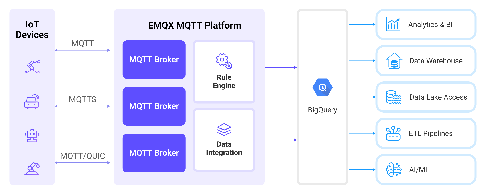

# BigQueryへのMQTTデータ取り込み

[BigQuery](https://cloud.google.com/bigquery?hl=en)は、大量のリレーショナル構造化データ向けのエンタープライズデータウェアハウスです。大規模かつアドホックなSQLベースの分析およびレポーティングに最適化されており、組織の洞察を得るのに最適です。EMQXは、MQTTデータのリアルタイム抽出、処理、分析のためにBigQueryとのシームレスな統合をサポートしています。

本ページでは、EMQXとBigQuery間のデータ統合について包括的に紹介し、データ統合の作成および検証に関する実践的な手順を提供します。

## 動作の仕組み

BigQueryデータ統合は、EMQXの標準機能として提供されており、ユーザーがMQTTデータストリームをGoogle Cloudとシームレスに統合し、その豊富なサービスと機能を活用してIoTアプリケーション開発を支援します。



EMQXはルールエンジンとSinkを介してMQTTデータをBigQueryに転送します。全体の流れは以下の通りです。

1. **IoTデバイスがメッセージをパブリッシュ**：デバイスは特定のトピックを通じてテレメトリやステータスデータをパブリッシュし、ルールエンジンをトリガーします。
2. **ルールエンジンがメッセージを処理**：組み込みのルールエンジンを使用して、特定のソースからのMQTTメッセージをトピックマッチングに基づいて処理します。ルールエンジンは対応するルールにマッチし、データ形式の変換、特定情報のフィルタリング、コンテキスト情報の付加などを行います。
3. **BigQueryへのブリッジング**：ルールはメッセージをBigQueryに転送するアクションをトリガーし、データプロパティ、オーダーキー、MQTTトピックとBigQueryトピックのマッピングを簡単に設定できます。これにより、より豊かなコンテキスト情報と順序保証が提供され、柔軟なIoTデータ処理が可能になります。

## 特長と利点

EMQXとBigQueryの統合により、MQTTデータの堅牢でスケーラブルかつリアルタイムなデータパイプラインが実現します。以下の特長と利点により、IoT分析やデータ駆動型の意思決定が簡素化されます。

- **リアルタイムデータ取り込み**：EMQXからBigQueryへ低レイテンシでMQTTメッセージをシームレスにストリームします。即時処理と分析が必要な時間敏感なアプリケーションに対応します。
- **柔軟なデータマッピング**：MQTTトピックとメッセージペイロードをBigQueryのテーブルやフィールドにカスタマイズしてマッピング可能です。
- **スケーラブルかつサーバレスな分析**：BigQueryのフルマネージドでサーバレスなアーキテクチャを活用し、大規模なIoTデータ分析を実現します。
- **Google Cloudエコシステムとの簡単な統合**：Data Studio、Looker、AI PlatformなどGoogle Cloudサービスとネイティブに連携し、可視化や機械学習を簡単に実装可能です。データ収集から洞察生成までのエンドツーエンドパイプライン構築を簡素化します。

## はじめる前に

このセクションでは、BigQueryデータ統合の作成を開始する前に必要な準備について説明します。

### 前提条件

- EMQXのデータ統合[ルール](./rules.md)の知識
- [データ統合](./data-bridges.md)の知識

### GCPでのサービスアカウントキーの作成

**Service Account JSON**認証を使用する場合、Google Cloudでサービスアカウントを作成し、JSON形式のキーを生成してください。

1. GCPアカウントで[サービスアカウント](https://developers.google.com/identity/protocols/oauth2/service-account#creatinganaccount)を作成します。サービスアカウントには、使用するデータセットおよびテーブルへのアクセス権限が必要です。例えば、「BigQuery Data Editor」ロールを付与して対象データセットやテーブルの読み書きを許可するか、少なくともデータへの読み書きアクセスを確保してください。

2. 作成したサービスアカウントのメールアドレスをクリックします。

3. **Key**タブをクリックし、**Add key**ドロップダウンから**Create new key**を選択してサービスアカウントキーを作成し、JSON形式でダウンロードします。

   ::: tip

   ダウンロードしたサービスアカウントキーは、後でEMQXがBigQueryと認証するために使用するため、安全に保管してください。

   :::

   

### GCPでのWorkload Identity Federationの設定

Workload Identity Federation（WIF）は、長期間有効なサービスアカウントキーを使わずにEMQXがGCPリソースにアクセスできる仕組みです。EMQXは外部IDプロバイダー（例：Microsoft Azure）からトークンを取得し、GCPのSecurity Token Serviceを介して一時的なGCPトークンと交換し、そのトークンでGCPサービスアカウントを代行します。トークンの更新は自動で行われます。

WIFを利用するには、コネクター作成前にGCPプロジェクトで以下を完了してください。

1. Google Cloudコンソールで**IAM & Admin** -> **Workload Identity Federation**に移動し、ワークロードアイデンティティプールを作成し、**Pool ID**と**Project Number**を控えます。

2. プールにプロバイダーを追加し、**Provider ID**を控えます。OIDC認証の場合は、外部IDプロバイダーからOAuth 2.0クライアント認証情報（クライアントID、クライアントシークレット、トークンエンドポイントURI）を取得します。

3. ワークロードアイデンティティプールに、BigQueryデータセットとテーブルにアクセス可能なGCPサービスアカウントの代行権限を付与します。コネクター設定時にサービスアカウントのメールアドレスが必要です。

   ::: tip

   詳細な手順は[Workload Identity Federationの設定](https://cloud.google.com/iam/docs/workload-identity-federation-with-other-providers)をご参照ください。

   :::

**例：Microsoft Azure (Entra ID)**

[Microsoft Entra ID](https://portal.azure.com/)でAPIを公開するアプリケーションを登録し、クライアントシークレットを作成します。コネクター設定時に以下の値を使用します。

| コネクター項目 | 値 |
|---|---|
| **Endpoint URI** | `https://login.microsoftonline.com/<tenant-id>/oauth2/v2.0/token` |
| **OAuth Client ID** | アプリケーション（クライアント）ID、形式は `api://<application-id>` |
| **OAuth Client Secret** | アプリケーション用に生成したクライアントシークレット |
| **OAuth Request Scope** | `api://<application-id>/.default` |

::: tip 注意

`scope`はアプリケーションのaudience（aud）と完全に一致させる必要があります。そうしないとGCP STSとのトークン交換に失敗します。詳細はMicrosoftの[OAuth 2.0クライアント認証フロー](https://learn.microsoft.com/en-us/entra/identity-platform/v2-oauth2-client-creds-grant-flow)をご参照ください。

サービスアカウントにWIFプールへのアクセス権を付与する際は、**Application ID**ではなく**Object ID**をSubject値として使用してください。Object IDはAzureポータルのアプリケーションの概要ページの**Enterprise applications**で確認できます。

:::

### Attached Service Accountの前提条件

**Attached Service Account**認証を使用するには、EMQXがGCP Compute Engineインスタンス上で実行されており、サービスアカウントがインスタンスにアタッチされている必要があります。インスタンスのOAuthアクセススコープがBigQueryへのアクセスを許可していることを確認してください。Googleは`cloud-platform`スコープ（`https://www.googleapis.com/auth/cloud-platform`）の使用を推奨し、IAMロールでサービスアカウントの権限を制限することを推奨しています。サービスアカウントは対象のBigQueryデータセットおよびテーブルへのアクセス権限を持っている必要があります。詳細はGoogle Cloudドキュメントの[サービスアカウント](https://cloud.google.com/compute/docs/access/service-accounts)をご覧ください。

対象のBigQueryデータセットとテーブルは、Compute Engineインスタンスに関連付けられたGCPプロジェクト内に存在する必要があります。EMQXクラスターの場合、すべてのノードがこれらの要件を満たし、同じプロジェクトのCompute Engineインスタンス上で実行されている必要があります。

コネクター起動時に、EMQXは自動的にインスタンスメタデータエンドポイントからGCPプロジェクトIDとアクセストークンを取得します。サービスアカウントキーのアップロードは不要です。

### GCPでのデータセットとテーブルの作成および管理

EMQXでBigQueryデータ統合を設定する前に、GCPで必要なデータセットとテーブルを作成してください。

1. Google Cloudコンソールの**BigQuery** -> **Studio**ページに移動します。詳細は[データのロードとクエリ](https://cloud.google.com/bigquery/docs/quickstarts/load-data-console)クイックスタートガイドをご参照ください。

   ::: tip

   使用予定のサービスアカウントは、対象テーブルの書き込み権限を持っている必要があります。

   :::

2. **Explorer**ペインでケバブアイコン（⋮）をクリックし、**Create dataset**を選択します。データセット名を指定して**Create dataset**をクリックします。

3. データセット作成後、**Explorer**ペインでデータセットをクリックし、**(+) Create table**をクリックします。

   - ソースは「Empty Table」を選択します。

   - テーブル名を入力します。

   - テーブルスキーマを定義します。例えば、**Edit as text**トグルをクリックし、以下のスキーマ定義をテキストフィールドに貼り付けます。

     ```
     clientid:string,payload:bytes,topic:string,publish_received_at:timestamp
     ```

   - **Create table**をクリックして設定を完了します。

4. EMQXが書き込み可能なように権限を設定します。

   - データセットを選択し、**Share**をクリックします。

   - サービスアカウントのメールアドレスをプリンシパルとして追加します。

   - 以下のような適切なロールを割り当てます。

     - データセットに対して「BigQuery Data Viewer」（読み取りアクセス）

     - テーブルに対して「Editor」（読み書きアクセス）

5. テーブル作成後、クエリを実行して確認できます。

   - テーブルをクリックし、**Query**をクリックします。

   - 以下のような簡単なSQL文を実行してテーブルにアクセスできることを確認します。

     ```sql
     SELECT * FROM `my_project.my_dataset.my_tab` LIMIT 1000
     ```

## BigQueryコネクターの作成

BigQuery Producer Sinkアクションを追加する前に、EMQXとBigQuery間の接続を確立するためにBigQueryコネクターを作成する必要があります。

1. EMQXダッシュボードで**Integration** -> **Connector**をクリックします。

2. ページ右上の**Create**をクリックし、コネクター選択画面で**BigQuery**を選択して**Next**をクリックします。

3. 名前と説明を入力します（例：`my_bigquery`）。名前はBigQuery Sinkとコネクターを関連付けるために使用され、クラスター内で一意である必要があります。

4. **Authentication**リストから以下のいずれかの認証方法を選択し、対応するフィールドを設定します。

   - **Service Account JSON**：前述の[サービスアカウントキーの作成](#gcpでのサービスアカウントキーの作成)でエクスポートしたJSON形式のサービスアカウント認証情報をアップロードします。

   - **Workload Identity Federation (WIF)**：以下のフィールドを入力します。この方法はサービスアカウントJSONファイルを使用しません。前提条件は[Workload Identity Federationの設定](#gcpでのworkload-identity-federationの設定)をご参照ください。

     - **GCP Project ID**：コネクターがアクセスするリソースのプロジェクトID。

     - **GCP Project Number**：コネクターがアクセスするリソースのプロジェクト番号。

     - **Service Account Email**：代行するサービスアカウントのメールアドレス。

     - **Workload Identity Pool ID**：WIFトークン交換に使用するワークロードアイデンティティプールのID。

     - **Workload Identity Provider ID**：WIFトークン交換に使用するワークロードアイデンティティプロバイダーのID。

     - **Initial Token Configuration**の下で認証情報タイプを選択し、対応するフィールドを入力します。現在サポートされているのは**OIDC with Client Credentials Grant Type**のみです。

       - **Endpoint URI**：OIDCプロバイダーのOAuthトークンエンドポイントURI。

       - **OAuth Client ID**：OAuthサーバーからトークンを要求するためのクライアントID。

       - **OAuth Client Secret**：OAuthサーバーからトークンを要求するためのクライアントシークレット。

       - **OAuth Request Scope**：OAuthアクセストークンを要求する際に必要な場合の`scope`。

   - **Attached Service Account**：追加のフィールドは不要です。EMQXはインスタンスメタデータエンドポイントからGCPプロジェクトIDとアクセストークンを自動取得します。前提条件は[Attached Service Accountの前提条件](#attached-service-accountの前提条件)をご参照ください。

5. **Create**をクリックする前に、**Test Connectivity**をクリックしてコネクターがBigQueryサーバーに接続できるかテストできます。

6. ページ下部の**Create**ボタンをクリックしてコネクター作成を完了します。ポップアップダイアログで**Back to Connector List**をクリックするか、**Create Rule**をクリックしてBigQueryに転送するデータを指定するルールの作成を続行できます。詳細は[BigQuery Sink付きルールの作成](#create-a-rule-with-bigquery-sink)をご覧ください。

## BigQuery Sink付きルールの作成

このセクションでは、BigQueryに保存するデータを指定するルールの作成方法を示します。

1. EMQXダッシュボードで**Integration** -> **Rules**をクリックします。

2. ページ右上の**Create**をクリックします。

3. ルールIDに`my_rule`を入力します。

4. **SQL Editor**でルールを設定します。例えば、トピック`t/bq`のMQTTメッセージをBigQueryに保存したい場合は、以下のSQL構文を使用します。

   注意：独自のSQL構文を指定する場合、Sinkのペイロードテンプレートで必要なすべてのフィールドを`SELECT`句に含める必要があります。

   ```sql
   SELECT
     clientid,
     topic,
     base64_encode(payload) AS payload,
     timestamp/1000 AS publish_received_at
   FROM
     "t/bq"
   ```

   ::: tip 注意

   BigQueryテーブルのカラムであるフィールドのみを選択してください。そうでない場合、BigQueryは未知のフィールドとして認識しません。

   :::

   ::: tip

   初心者の方は**SQL Examples**をクリックし、**Enable Test**を有効にしてSQLルールを学習・テストできます。

   :::

5. **Add Action**ボタンをクリックし、ルールでトリガーされるアクションを定義します。**Type of Action**ドロップダウンから`BigQuery`を選択し、EMQXがルールで処理したデータをBigQueryに送信するようにします。

6. **Action**ドロップダウンは`Create Action`のままにするか、既存のBigQuery Sinkを選択できます。この例では新しいSinkを作成し、ルールに追加します。

7. **Name**フィールドにSinkの名前を入力します。名前は英数字の組み合わせで指定してください。

8. **Connector**ドロップダウンから先ほど作成した`my_bigquery`を選択します。新しいコネクターを作成する場合は、ドロップダウン横のボタンをクリックしてください。設定パラメーターの詳細は[コネクターの作成](#bigqueryコネクターの作成)をご参照ください。

9. 以下のBigQueryリソースパラメーターを設定します。

   - **Project ID**（任意）：対象のデータセットとテーブルが存在するGCPプロジェクトのIDを入力します。指定すると、この値が選択したコネクターの認証設定から抽出されたプロジェクトIDを上書きし、このSinkにのみ適用されます。空欄の場合は認証設定から取得したプロジェクトIDが使用されます。

   - **Dataset**および**Table**：それぞれ[データセットとテーブルの作成および管理](#gcpでのデータセットとテーブルの作成および管理)で作成した名前を入力します。

12. **フォールバックアクション（任意）**：メッセージ配信失敗時の信頼性向上のために、1つ以上のフォールバックアクションを定義できます。これらはプライマリSinkがメッセージ処理に失敗した場合にトリガーされます。詳細は[フォールバックアクション](./data-bridges.md#fallback-actions)をご覧ください。

13. **詳細設定（任意）**：必要に応じて詳細設定オプションを構成します。詳細は[詳細設定](#advanced-settings)をご参照ください。

14. **Create**をクリックする前に、**Test Connectivity**をクリックしてコネクターがBigQueryサーバーに接続できるかテストできます。

15. **Create**ボタンをクリックしてSinkの設定を完了すると、新しいSinkが**Action Outputs**タブに表示されます。

16. **Create Rule**ページに戻り、**Create**をクリックしてルールを作成します。

これでルールの作成が完了しました。**Integration** -> **Rules**ページで新規作成したルールを確認できます。**Actions(Sink)**タブをクリックすると、新しいBigQuery Sinkが表示されます。

また、**Integration** -> **Flow Designer**をクリックするとトポロジーが表示され、トピック`t/bq`のメッセージがルール`my_rule`で解析されてBigQueryに送信・保存されていることが確認できます。

## ルールのテスト

1. MQTTXを使用してトピック`t/bq`にメッセージを送信します。

   ```bash
   mqttx pub -i emqx_c -t t/bq -m '{ "msg": "hello BigQuery" }'
   ```

2. Sinkの稼働状況を確認し、新規の受信メッセージと送信メッセージが1件ずつあることを確認します。

3. GCPの**BigQuery** -> **Studio**に移動し、テーブルをクリックして**Query**をクリックします。クエリを実行するとメッセージが確認できます。

## 詳細設定

このセクションでは、BigQuery Producer Sinkの詳細設定オプションについて説明します。ダッシュボードでSinkを設定する際に、**Advanced Settings**を展開して以下のパラメーターをニーズに応じて調整できます。

| フィールド名                     | 説明                                                                                         | デフォルト値     |
| -------------------------------- | -------------------------------------------------------------------------------------------- | --------------- |
| **Buffer Pool Size**             | EMQXとBigQuery間のデータフローを管理するバッファワーカープロセスの数を指定します。これらのワーカーはデータを一時的に格納・処理し、ターゲットサービスへの送信を最適化し、スムーズなデータ伝送を保証します。 | `16`            |
| **Request TTL**                  | リクエストTTL（Time To Live）は、リクエストがバッファに入ってから有効とみなされる最大時間（秒）を指定します。TTLを超えてバッファに滞留するか、BigQueryからの応答やアックがタイムリーに得られない場合、そのリクエストは期限切れと判断されます。 | `45`秒          |
| **Health Check Interval**        | SinkがBigQueryとの接続状態を自動的にヘルスチェックする間隔（秒）を指定します。 | `15`秒          |
| **Health Check Interval Jitter** | 複数ノードが同時にヘルスチェックを開始するのを防ぐため、基本のヘルスチェック間隔に加える一様ランダム遅延です。複数のアクションやソースが同じコネクターを共有する場合、ジッターを有効にするとヘルスチェックの開始時刻が分散されます。 | `0`ミリ秒       |
| **Health Check Timeout**         | コネクターがBigQueryとの接続状態をヘルスチェックする際のタイムアウト時間を指定します。 | `60`秒          |
| **Max Buffer Queue Size**        | BigQuery Sinkの各バッファワーカーがバッファリング可能な最大バイト数を指定します。バッファワーカーはデータを一時的に保持し、BigQueryへの送信を効率化します。システム性能やデータ伝送要件に応じて調整してください。 | `256`           |
| **Query Mode**                   | `synchronous`または`asynchronous`のリクエストモードを選択し、メッセージ送信を最適化します。非同期モードではBigQueryへの書き込みがMQTTメッセージのパブリッシュ処理をブロックしませんが、クライアントがBigQuery到達前にメッセージを受信する可能性があります。 | `Async`         |
| **Batch Size**                   | EMQXからBigQueryへ一度に転送するデータバッチの最大サイズを指定します。サイズを調整することでデータ転送の効率と性能を最適化できます。`Batch Size`を`1`に設定すると、データレコードはバッチ化されず個別に送信されます。 | `1000`          |
| **Inflight Window**              | 「インフライトキューリクエスト」とは、送信済みだがまだ応答やアックを受け取っていないリクエストを指します。この設定はSinkがBigQueryと通信中に同時に存在可能なインフライトリクエストの最大数を制御します。**Request Mode**が`asynchronous`の場合、このパラメーターは特に重要です。同一MQTTクライアントからのメッセージを厳密に順序処理したい場合は、`1`に設定してください。 | `100`           |
