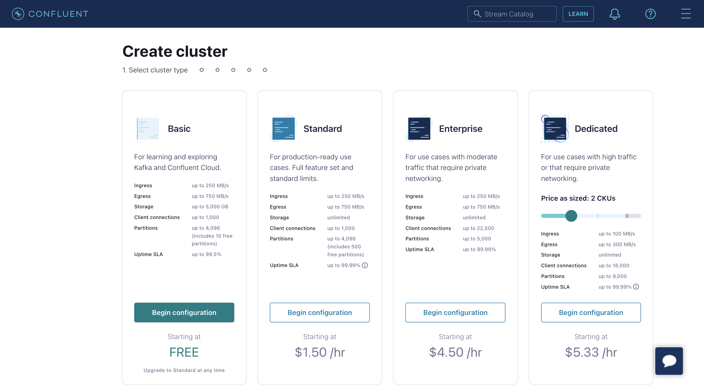
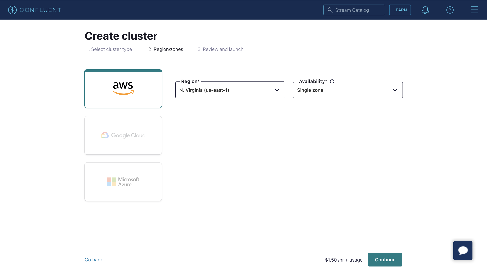

# ConfluentへのMQTTデータストリーム

[Confluent Cloud](https://www.confluent.io/)はApache Kafkaをベースにした、レジリエントでスケーラブルかつフルマネージドのストリーミングデータサービスです。EMQXはルールエンジンとSinkを通じてConfluentとのデータ統合をサポートし、MQTTデータをConfluentに簡単にストリーミングしてリアルタイム処理、保存、分析を実現します。


本ページでは主にConfluent統合の機能と利点を紹介し、Confluent Cloudの設定およびEMQXでのConfluent Producer Sinkの作成方法を案内します。

## 動作概要

Confluentデータ統合はEMQXのすぐに使える機能であり、MQTTベースのIoTデータとConfluentの強力なデータ処理機能を橋渡しします。組み込みの[ルールエンジン](./rules.md)コンポーネントを利用することで、両プラットフォーム間のデータフローと処理を簡素化し、複雑なコーディングを不要にします。

以下の図は自動車IoTにおけるEMQXとConfluentのデータ統合の典型的なアーキテクチャを示しています。


Confluentへのデータの入出力はConfluent Sink（Confluentへのメッセージ送信）とConfluent Source（Confluentからのメッセージ受信）を介して行われます。Confluent Sinkを作成した場合、そのワークフローは以下の通りです：

1. **メッセージのパブリッシュと受信**：車両に接続されたIoTデバイスはMQTTプロトコルを介してEMQXに正常に接続し、定期的に状態データを含むメッセージをパブリッシュします。EMQXがこれらのメッセージを受信すると、ルールエンジン内でマッチング処理を開始します。
2. **メッセージデータの処理**：これらのMQTTメッセージは、組み込みのルールエンジンとメッセージングサーバーの協働により、トピックマッチングルールに従って処理されます。メッセージが到着してルールエンジンを通過すると、事前定義された処理ルールが評価されます。ペイロード変換を指定するルールがあれば、データ形式変換、特定情報のフィルタリング、追加コンテキストによるペイロードの強化などの変換が適用されます。
3. **Confluentへのブリッジ**：ルールエンジンで定義されたルールがトリガーとなり、メッセージをConfluentに転送するアクションが実行されます。Confluent Sink機能を使用して、MQTTトピックはConfluentの事前定義されたKafkaトピックにマッピングされ、すべての処理済みメッセージとデータがこれらのトピックに書き込まれます。

車両データがConfluentに入力されると、以下のように柔軟にデータを活用できます：

- サービスはConfluentと直接統合し、特定トピックのリアルタイムデータストリームを消費してカスタマイズされたビジネス処理を行えます。
- Kafka Streamsを利用してストリーム処理を行い、車両状態をメモリ内で集約・相関させてリアルタイム監視が可能です。
- ConfluentのStream Designerコンポーネントを使い、MySQLやElasticSearchなど外部システムへのデータ出力用コネクターを選択して保存が行えます。

## 機能と利点

Confluentとのデータ統合は以下の機能と利点をビジネスにもたらします：

- **大規模メッセージ伝送の信頼性**：EMQXとConfluent Cloudは共に高信頼なクラスター機構を用い、安定かつ信頼性の高いメッセージ伝送チャネルを確立し、大規模IoTデバイスからのメッセージ損失ゼロを保証します。両者ともノード追加による水平スケールが可能で、リソースを動的に調整して突発的な大規模メッセージにも対応し、メッセージ伝送の可用性を確保します。
- **強力なデータ処理能力**：EMQXのローカルルールエンジンとConfluent Cloudは、デバイスからアプリケーションまでの異なる段階で信頼性の高いストリーミングデータ処理機能を提供します。リアルタイムのデータフィルタリング、形式変換、集約分析などシナリオに応じた処理が可能で、より複雑なIoTメッセージ処理ワークフローを実現し、データ分析アプリケーションのニーズを満たします。
- **強力な統合機能**：Confluent Cloudが提供する多様なコネクターを通じて、EMQXは他のデータベース、データウェアハウス、データストリーム処理システム等と容易に統合でき、迅速なデータ分析アプリケーションのための完全なIoTデータワークフローを構築します。
- **高スループット処理能力**：同期・非同期の両書き込みモードをサポートし、リアルタイム優先や性能優先など異なるシナリオに応じてデータ書き込み戦略を使い分け、レイテンシとスループットのバランスを柔軟に調整できます。
- **効果的なトピックマッピング**：ブリッジ設定を通じて多数のIoTビジネストピックをKafkaトピックにマッピング可能です。EMQXはMQTTユーザープロパティをKafkaヘッダーにマッピングでき、1対1、1対多、多対多の柔軟なトピックマッピング方式を採用し、MQTTトピックフィルター（ワイルドカード）もサポートします。

これらの機能により統合能力と柔軟性が向上し、効果的かつ堅牢なIoTプラットフォームアーキテクチャの構築を支援します。増大するIoTデータは安定したネットワーク接続で伝送され、さらに効果的に保存・管理されます。

## はじめる前に

本セクションではEMQXダッシュボードでConfluentデータ統合を設定するための準備作業を説明します。

### 前提条件

- [ルールエンジン](./rules.md)の理解
- [Sink](./data-bridges.md)の理解

### Confluent Cloudの設定

Confluentデータ統合を作成する前に、Confluent CloudコンソールでConfluentクラスターを作成し、Confluent Cloud CLIを使ってトピックとAPIキーを作成する必要があります。

#### クラスターの作成

1. Confluent Cloudコンソールにログインし、クラスターを作成します。例としてStandardクラスターを選択し、**Begin configuration**をクリックします。



2. リージョン/ゾーンを選択します。デプロイメントリージョンがConfluent Cloudのリージョンと一致していることを確認し、**Continue**をクリックします。



3. クラスター名を入力し、**Launch cluster**をクリックします。


#### Confluent Cloud CLIを使ったトピックとAPIキーの作成

クラスターがConfluent Cloudで稼働したら、**Cluster Overview** -> **Cluster Settings**ページから**Bootstrap server**のURLを取得できます。


Confluent Cloud CLIでクラスターを管理可能です。以下は基本的なCLIコマンドです。

##### Confluent Cloud CLIのインストール

```bash
curl -sL --http1.1 https://cnfl.io/cli | sh -s -- -b /usr/local/bin
```

既にインストール済みの場合は、以下のコマンドで更新できます：

```bash
confluent update
```

##### アカウントにログイン

```bash
confluent login --save
```

##### 環境を選択

```bash
# 環境一覧表示
confluent environment list
# 環境選択
confluent environment use <environment_id>
```

##### クラスターを選択

```bash
# Kafkaクラスター一覧表示
confluent kafka cluster list
# Kafkaクラスター選択
confluent kafka cluster use <kafka_cluster_id>
```

##### APIキーとシークレットの使用

既存のAPIキーを使う場合は、以下のコマンドでCLIに追加します：

```bash
confluent api-key store --resource <kafka_cluster_id>
Key: <API_KEY>
Secret: <API_SECRET>
```

APIキーとシークレットを持っていない場合は、以下のコマンドで作成可能です：

```bash
$ confluent api-key create --resource <kafka_cluster_id>

It may take a couple of minutes for the API key to be ready.
Save the API key and secret. The secret is not retrievable later.
+------------+------------------------------------------------------------------+
| API Key    | YZ6R7YO6Q2WK35X7                                                 |
| API Secret | ****************************************                         |
+------------+------------------------------------------------------------------+
```

追加後、以下のコマンドでAPIキーとシークレットを使用できます：

```bash
confluent api-key use <API_Key> --resource <kafka_cluster_id>
```

##### トピックの作成

`testtopic-in`という名前のトピックを以下のコマンドで作成できます：

```bash
confluent kafka topic create testtopic-in
```

トピック一覧は以下で確認可能です：

```bash
confluent kafka topic list
```

##### トピックへのメッセージ送信（Producer）

以下のコマンドでプロデューサーを作成できます。起動後、メッセージを入力してEnterを押すと、該当トピックにメッセージが送信されます。

```bash
confluent kafka topic produce testtopic-in
```

##### トピックからのメッセージ受信（Consumer）

以下のコマンドでコンシューマーを作成できます。該当トピック内のすべてのメッセージが出力されます。

```bash
confluent kafka topic consume -b testtopic-in
```

## コネクターの作成

Confluent Sinkアクションを追加する前に、EMQXとConfluent Cloud間の接続を確立するためにConfluent Producerコネクターを作成する必要があります。

1. EMQXダッシュボードで**Integration** -> **Connectors**をクリックします。
2. ページ右上の**Create**をクリックし、コネクター選択ページで**Confluent Producer**を選択して**Next**をクリックします。
3. 名前と説明を入力します。例：`my-confluent`。名前はConfluent Sinkとコネクターを関連付けるために使用され、クラスター内で一意でなければなりません。
4. Confluent Cloudへの接続に必要なパラメーターを設定します：
   - **Bootstrap Hosts**：Confluentクラスター設定ページのEndpoints情報に対応。
   - **Username** と **Password**：前述のConfluent Cloud CLIで作成したAPIキーとシークレットを入力。
   - **Request Timeout**：EMQXがConfluentからの応答を待つ最大時間（秒）。デフォルトは`30`秒。タイムアウト超過時は接続が古くなったとみなし再接続します。値が小さすぎると、Confluentがリクエストを受け入れても応答を遅延させる可能性があり、再接続後にバッチを再送して重複メッセージや下流の過剰データが発生する恐れがあります。
   - その他のオプションはデフォルトのままか、ビジネスニーズに応じて設定してください。
5. **Create**ボタンをクリックしてコネクターの作成を完了します。

作成後、コネクターは自動的にConfluent Cloudに接続します。次に、このコネクターを基にルールを作成し、コネクターで設定したConfluentクラスターにデータを転送します。

## Confluent Sinkを使ったルールの作成

このセクションでは、MQTTトピック`t/#`のメッセージを処理し、処理結果をConfluentの`testtopic-in`トピックに送信するルールをEMQXで作成する方法を示します。

1. EMQXダッシュボードに入り、**Integration** -> **Rules**をクリックします。

2. 右上の**Create**をクリックします。

3. ルールIDを入力します。例：`my_rule`。

4. MQTTメッセージをトピック`t/#`からConfluentに転送したい場合、**SQL Editor**に以下の文を入力します。

   注意：独自のSQL構文を指定する場合、`SELECT`部分にSinkが必要とするすべてのフィールドを含めてください。

   ```sql
   SELECT
     *
   FROM
     "t/#"
   ```

   注意：初心者の場合は**SQL Example**や**Enable Test**をクリックしてSQLルールを学習・テストできます。

5. + **Add Action**ボタンをクリックして、ルールでトリガーされるアクションを定義します。**Type of Action**のドロップダウンリストから`Confluent Producer`を選択し、**Action**ドロップダウンはデフォルトの`Create Action`のままか、既存のConfluent Producerアクションを選択します。この例では新規ルールに追加します。

6. Sinkの名前と説明を対応するテキストボックスに入力します。

7. **Connector**ドロップダウンから先ほど作成した`my-confluent`コネクターを選択します。隣のボタンをクリックするとポップアップで新規コネクターを素早く作成可能です。必要な設定パラメーターは[コネクターの作成](#コネクターの作成)を参照してください。

8. Sinkのデータ送信方法を設定します：

   - **Kafka Topic**：`testtopic-in`と入力します。EMQX v5.7.2以降、このフィールドは動的トピック設定もサポートします。詳細は[Kafka動的トピックの設定](./data-bridge-kafka.md#configure-kafka-dynamic-topics)を参照してください。
   - **Kafka Headers**：Kafkaメッセージに関連するメタデータやコンテキスト情報を入力します（任意）。プレースホルダーの値はオブジェクトである必要があります。ヘッダー値のエンコードタイプは**Kafka Header Value Encod Type**ドロップダウンから選択可能です。**Add**をクリックしてキー・バリューのペアを追加できます。
   - **Message Key**：Kafkaメッセージのキー。純粋な文字列か、プレースホルダー（${var}）を含む文字列を入力します。
   - **Message Value**：Kafkaメッセージの値。純粋な文字列か、プレースホルダー（${var}）を含む文字列を入力します。
   - **Partition Strategy**：プロデューサーがKafkaパーティションにメッセージを分配する方法を選択します。
   - **Compression**：Kafkaメッセージ内のレコードを圧縮/解凍するための圧縮アルゴリズムを指定します。

9. **フォールバックアクション（任意）**：メッセージ配信失敗時の信頼性向上のため、1つ以上のフォールバックアクションを定義可能です。プライマリSinkがメッセージ処理に失敗した場合にこれらのアクションがトリガーされます。詳細は[フォールバックアクション](./data-bridges.md#fallback-actions)を参照してください。

10. **詳細設定（任意）**：[詳細設定](#advanced-configuration)を参照してください。

11. **Create**ボタンをクリックしてSinkの作成を完了します。作成後、ページは**Create Rule**に戻り、新しいSinkがルールアクションに追加されます。

12. **Create**ボタンをクリックしてルール全体の作成を完了します。

これでルールが正常に作成され、**Integration** -> **Rules**ページで新規ルールを確認でき、**Actions(Sink)**タブで新規Confluent Producer Sinkも確認できます。

また、**Integration** -> **Flow Designer**をクリックするとトポロジーを表示できます。トポロジーを通じて、トピック`t/#`のメッセージがルール`my_rule`で解析され、Confluentに送信・保存されている様子を直感的に確認できます。

## Confluent Producerルールのテスト

Confluent Producerルールが期待通りに動作するかテストするため、[MQTTX](https://mqttx.app/en)を使ってクライアントがEMQXにMQTTメッセージをパブリッシュするシミュレーションが可能です。

1. MQTTXを使ってトピック`t/1`にメッセージを送信します：

   ```bash
   mqttx pub -i emqx_c -t t/1 -m '{ "msg": "Hello Confluent" }'
   ```

2. **Actions(Sink)**ページでSink名をクリックし統計情報を確認します。Sinkの稼働状況をチェックし、新規の受信メッセージ数と送信メッセージ数がそれぞれ1件あることを確認します。

3. 以下のConfluentコマンドで`testtopic-in`トピックにメッセージが書き込まれているか確認します：

   ```bash
   confluent kafka topic consume -b testtopic-in
   ```

## 詳細設定

本セクションでは、コネクターやSink/Sourceのパフォーマンス最適化やシナリオに応じたカスタマイズ操作のための詳細設定オプションを説明します。対応するオブジェクト作成時に**Advanced Settings**を展開し、ビジネスニーズに応じて以下の設定を行えます。

### コネクター設定

| フィールド                         | 説明                                                         | 推奨値             |
| --------------------------------- | ------------------------------------------------------------ | ------------------ |
| Allow Auto Topic Creation         | （Producerのみ）有効にすると、クライアントがメタデータ取得リクエストを送信した際にKafkaトピックが存在しなければ自動作成を許可します。 | `Disabled`         |
| Connect Timeout                   | TCP接続確立の最大待機時間（認証有効時は認証時間も含む）       | `5`秒              |
| Start Timeout                     | コネクターが自動起動したリソースの正常状態到達を待つ最大秒数。Sinkが接続先リソース（例：Confluentクラスター）の完全稼働を確認してから処理を進めるための設定。 | `5`秒              |
| Health Check Interval             | コネクターの稼働状態チェック間隔                              | `15`秒             |
| Min Metadata Refresh Interval     | Kafkaブローカーとトピックのメタデータ更新を行う最小間隔。小さすぎるとKafkaサーバー負荷増加の恐れあり。 | `3`秒              |
| Metadata Request Timeout          | Kafkaからメタデータ取得時の最大待機時間                       | `5`秒              |
| Socket Send / Receive Buffer Size | ネットワーク伝送性能最適化のためのソケットバッファサイズ管理 | `1`MB              |
| No Delay                          | システムカーネルがTCPソケットを即時送信するか遅延送信するか選択。オンで即時送信、オフで少量送信時に約40msの遅延あり。 | `Enabled`          |
| TCP Keepalive                     | Kafkaブリッジ接続のTCPキープアライブ機能を有効化し、長時間の非通信による接続切断を防止。値は`Idle, Interval, Probes`の3つの数値をカンマ区切りで指定。<br />Idle：接続がアイドル状態になる秒数（Linuxデフォルト7200秒）<br />Interval：キープアライブプローブ間隔秒数（Linuxデフォルト75秒）<br />Probes：応答なしと判断するまでの最大プローブ数（Linuxデフォルト9）<br />例：`240,30,5`は240秒アイドル後にプローブ開始、30秒間隔で最大5回送信し応答なければ切断判定。 | `none`             |

### Confluent Producer Sink設定

| フィールド                         | 説明                                                         | 推奨値             |
| --------------------------------- | ------------------------------------------------------------ | ------------------ |
| Health Check Interval            | Sinkの稼働状態チェック間隔                                   | `15`秒             |
| Max Batch Bytes                  | Kafkaバッチ内で収集するメッセージの最大サイズ（バイト）。Kafkaブローカーのデフォルトは1MBだが、EMQXはKafkaメッセージのエンコードオーバーヘッドを考慮し、特に小さいメッセージが多い場合に備え1MB未満に設定。単一メッセージがこのサイズを超える場合は別バッチで送信。 | `896`KB            |
| Required Acks                    | Kafkaパーティションリーダーがフォロワーから受け取る必要のあるアックの種類：<br />`all_isr`：全てのインシンクレプリカからのアックを要求<br />`leader_only`：リーダーのみからのアックを要求<br />`none`：Kafkaからのアック不要 | `all_isr`          |
| Partition Count Refresh Interval | Kafkaプロデューサーがパーティション数増加を検知する間隔。増加検知後、EMQXは指定の`partition_strategy`に基づき新パーティションをメッセージ送信に組み込む。 | `60`秒             |
| Max Inflight                     | Kafkaプロデューサー（パーティション毎）がアック受信前に送信可能な最大バッチ数。大きいほどスループット向上。ただし1より大きいとメッセージ順序が入れ替わるリスクあり。未アックメッセージ数を制御し負荷バランスを取る。 | `10`秒             |
| Query Mode (Producer)            | 非同期または同期クエリモードを選択し、要件に応じてメッセージ送信を最適化。非同期モードではKafka書き込みがMQTTパブリッシュ処理をブロックしないが、クライアントがKafka到着前にメッセージを受信する可能性あり。 | `Async`            |
| Synchronous Query Timeout        | 同期モード時の最大待機時間。メッセージ送信完了を保証し長時間待機を防止。`Sync`モード時のみ適用。 | `5`秒              |
| Buffer Mode                      | メッセージ送信前のバッファリング方式。メモリバッファリングは送信速度向上に寄与。<br />`memory`：メモリにバッファ。EMQXノード再起動時にメッセージ消失。<br />`disk`：ディスクにバッファ。ノード再起動後もメッセージ保持。<br />`hybrid`：初めはメモリにバッファし、一定サイズ（`segment_bytes`参照）を超えると徐々にディスクにオフロード。メモリモード同様、ノード再起動時にメッセージ消失。 | `memory`           |
| Per-partition Buffer Limit       | Kafkaパーティション毎の最大バッファサイズ（バイト）。上限到達時は古いメッセージを破棄しバッファ空間を確保。メモリ使用量と性能のバランス調整に有効。 | `2`GB              |
| Segment File Bytes               | バッファモードが`disk`または`hybrid`時に適用。メッセージ保存用セグメントファイルのサイズを制御し、ディスクストレージ最適化に影響。 | `100`MB            |
| Memory Overload Protection       | バッファモードが`memory`時に適用。メモリ圧迫時に古いバッファメッセージを自動破棄し、システムの安定性を確保。Linuxシステムのみ有効。 | Disabled           |
| Max Batch Age                    | プロデューサーバッファ内でメッセージが送信されずに保持可能な最大期間。期間超過でバッチ全メッセージが破棄される。切断中のバッファメッセージやアック待ちメッセージにも適用。破棄数は`dropped.expired`メトリクスにカウント。デフォルトの`infinity`は期限切れなし。バッファオーバーフロー時は破棄される可能性あり。 | `infinity`         |
| Max Retries                      | Confluentがリトライ可能なエラー（例：パーティションリーダー変更）を返した際の最大リトライ回数。初回試行とリトライが全て失敗するとバッチ破棄、破棄メッセージは`failed`メトリクスにカウント。明示的なConfluentエラー応答のみリトライ回数に加算。接続喪失による再送は加算されず`max_batch_age`で制限。デフォルト`infinity`は無制限リトライ。 | `infinity`         |
| Reconnect Delay                  | 接続喪失後にプロデューサーがConfluentに再接続を試みるまでの遅延時間。切断中もメッセージはバッファに蓄積されるがバッファ制限と`max_batch_age`の影響を受ける。デフォルトは`2`秒。 | `2`秒              |
| Max Linger Time                  | パーティション毎のプロデューサーがより大きなバッチを作成するために待機する最大時間。全バッファモードに適用。デフォルト`0`は待機なしでメッセージレイテンシ最適化。小さな遅延を許容すればリクエスト数削減可能。ディスクバッファ時はバッファ書き込み前の待機で、IOPS削減のため最低`5ms`推奨。 | `0`ミリ秒          |
| Max Linger Bytes                 | パーティション毎のプロデューサーが待機を終了しバッチ送信する最大バイト数。 | `10`MB             |

### <!-- Confluent Consumer Source設定 -->

## 追加情報

EMQXはConfluent/Kafkaとのデータ統合に関する豊富な学習リソースを提供しています。以下のリンクもご参照ください：

**ブログ：**

- [MQTTとKafkaで構築するコネクテッドビークルのストリーミングデータパイプライン](https://www.emqx.com/en/blog/building-connected-vehicle-streaming-data-pipelines-with-mqtt-and-kafka)
- [MQTTとKafka | IoTメッセージングとストリームデータ統合の実践](https://www.emqx.com/en/blog/mqtt-and-kafka)
- [MQTTパフォーマンスベンチマークテスト：EMQX-Kafka統合](https://www.emqx.com/en/blog/mqtt-performance-benchmark-testing-emqx-kafka-integration)

**ベンチマークレポート：**

- [EMQX Enterpriseパフォーマンスベンチマークテスト：Kafka統合](https://www.emqx.com/en/resources/emqx-enterprise-performance-benchmark-testing-kafka-integration)
