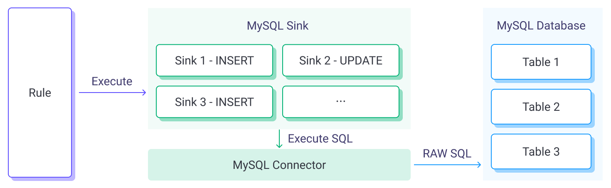
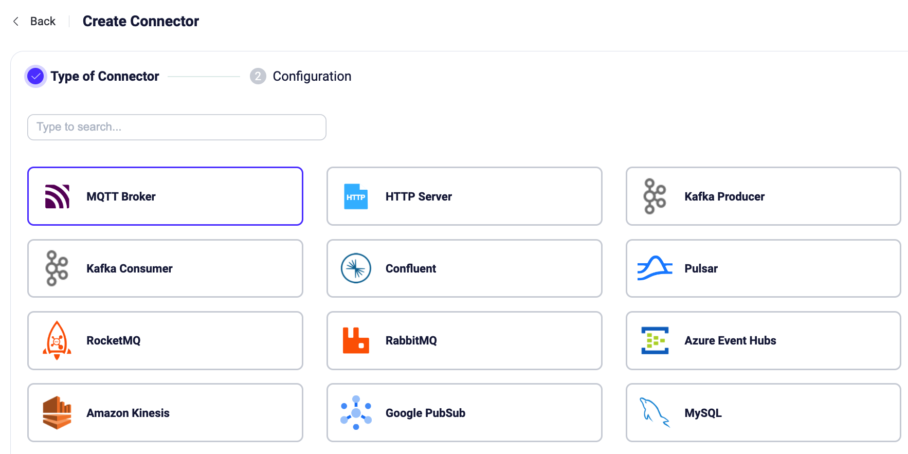
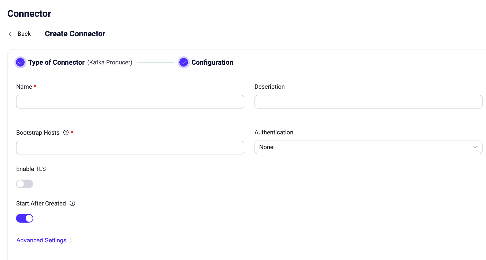
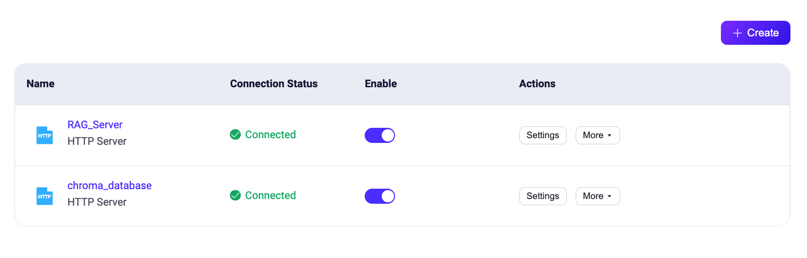
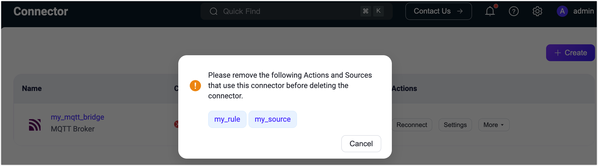

# Connector

EMQXのコネクターはデータ統合における重要な概念であり、Sink/Sourceの基盤となる接続チャネルとして機能し、外部データシステムへの接続に使用されます。

## 基本概念

コネクターは外部データシステムへの接続に特化しています。ユーザーは異なる外部データシステムごとに複数のコネクターを作成でき、1つのコネクターで複数のSink/Sourceへの接続を提供することも可能です。

MySQL Sinkを例にとると、コネクター、ルール、Sinkの関係は以下の図のように示されます。

### 特徴と利点

Sink/Sourceを作成する際、ユーザーは既存のコネクターを選択するだけで、基盤となる接続の詳細を気にする必要がありません。この設計の利点は以下の通りです。

- 接続設定をデータ処理やマッピング設定から分離することで、データ処理フローの設計がよりモジュール化され柔軟になります。
- コネクターの作成・設定はデータ処理フローの設計に影響を与えません。接続情報の変更が必要な場合はコネクター内で修正でき、設定や保守が簡素化されます。
- 複数のSink/Sourceに接続が必要な外部データシステムの場合、1つのコネクターを作成するだけで対応でき、設定作業の重複を避けられます。

## コネクターの作成

データ統合を作成する際は、統合が機能するためにSink/Source用のコネクターを作成する必要があります。コネクターはダッシュボードから作成・管理でき、1つのコネクターを異なるSink/Sourceで再利用可能です。

:::tip

Sink/Source作成の過程でコネクターを作成することもでき、その場合は自動的にコネクター作成プロセスに入ります。

:::

1. ダッシュボードの左ナビゲーションメニューで **Integration** -> **Connectors** をクリックします。

2. ページ右上の **Create** ボタンをクリックし、コネクター作成プロセスに入ります。

3. コネクタータイプ選択ページで必要なコネクターを選択し、**Next** をクリックして接続パラメータを入力します。対応コネクターは[こちら](./data-bridges.md#supported-integrations)を参照してください。

   

4. コネクター設定情報ページで、コネクター名、説明、接続パラメータなど基本情報を入力します。ここでの内容は各Sink/Sourceの使用ドキュメント内のコネクターパラメータ欄を参照しており、繰り返しません。

   

## コネクターの表示と管理

コネクター作成後は、Connectorsページで基本情報を確認できます。有効化・無効化の切り替えや、設定編集、ルール作成、複製、削除などの管理操作はコネクター一覧の **Actions** 列から行えます。

コネクターがSink/Sourceで使用されている場合、コネクター設定の更新はSink/Sourceのリロードを引き起こし、データ処理の中断を招く可能性があります。更新は業務の閑散時間帯に行うことを推奨します。

使用中のコネクターは削除できません。削除するには、まずそのコネクターを使用しているSink/Sourceを削除する必要があります。コネクター削除時には、関連するSink/Sourceを表示する警告ダイアログが表示されます。Sink/Sourceをクリックすると、ルール設定ページに遷移し、そこでSink/Sourceを削除できます。

## コネクターのステータス

ダッシュボード上でコネクターの稼働状況を確認でき、トラブルシューティングや監視に役立ちます。

コネクターのステータスは以下の通りです。

- **Connecting**：ヘルスチェックが行われる前の初期状態で、コネクターが外部データシステムへの接続を試みている状態。
- **Connected**：コネクターが外部データシステムに正常に接続された状態。この状態でヘルスチェックに失敗すると、障害の程度に応じて「connecting」または「disconnected」状態に切り替わることがあります。
- **Disconnected**：ヘルスチェックに失敗し、正常でない状態。設定により定期的に自動再接続を試みる場合があります。
- **Inconsistent**：クラスター内のノード間でコネクターの状態が不整合な状態。例えば、あるノードではconnected、別のノードではdisconnectedとなっている場合など。

## 注意事項 - コネクションプール

一部のコネクターはコネクションプールという再利用可能な接続オブジェクトの集合を提供しています。コネクションプールを利用することで、リクエストごとに接続を再作成する必要がなくなり、リソース消費の削減や接続効率・同時処理性能の向上に寄与します。

コネクションプールのサイズは各EMQXノード上のサイズを指し、EMQXは各ノードに独立したコネクションプールを作成します。EMQXは通常クラスターでデプロイされるため、外部データシステムの接続上限を超える接続数が実際に作成される可能性があります。

例えば、3ノードのEMQXクラスターでコネクターのコネクションプールサイズを8に設定すると、EMQXは3 x 8 = 24接続を作成します。
