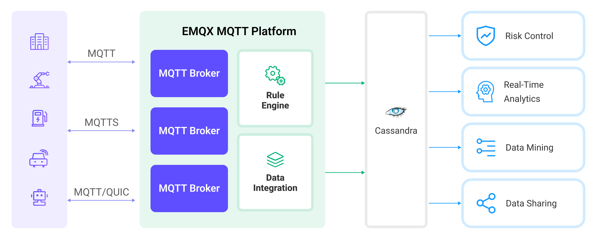

# Cassandra に MQTT データを取り込む

<!-- 提供一段简介，描述支 Sink 的基本工作方式、关键特性和价值，如果有局限性也应当在此处说明（如必须说明的版本限制、当前未解决的问题）。 -->

[Apache Cassandra](https://cassandra.apache.org/_/index.html) は、大規模データセットの処理と高スループットアプリケーションの構築を目的とした、人気のあるオープンソースの分散型 NoSQL データベース管理システムです。EMQX と Apache Cassandra の統合により、メッセージやイベントを Cassandra データベースに保存できるようになり、時系列データの保存、デバイス登録および管理、リアルタイムデータ分析などの機能を実現します。

本ページでは、EMQX と Cassandra 間のデータ統合について包括的に紹介し、データ統合の作成および検証に関する実践的な手順を提供します。

:::tip
現在の実装は Cassandra v3.x のみをサポートしており、v4.x には対応していません。
:::

## 動作の仕組み

Cassandra データ統合は EMQX の標準機能であり、EMQX のデバイス接続およびメッセージ送信機能と Cassandra の強力なデータ保存機能を組み合わせています。組み込みの[ルールエンジン](./rules.md)コンポーネントにより、EMQX から Cassandra へのデータ取り込みを簡素化し、複雑なコーディングを不要にします。

以下の図は、EMQX と Cassandra 間の典型的なデータ統合アーキテクチャを示しています。



Cassandra への MQTT データ取り込みは以下のように動作します：

1. **メッセージのパブリッシュと受信**：接続された車両、IIoT システム、エネルギー管理プラットフォームなどの IoT デバイスは、MQTT プロトコルを通じて EMQX に正常に接続し、特定のトピックに MQTT メッセージをパブリッシュします。EMQX がこれらのメッセージを受信すると、ルールエンジン内でマッチング処理を開始します。
2. **メッセージデータの処理**：メッセージが到着すると、ルールエンジンを通過し、EMQX に定義されたルールによって処理されます。ルールは事前定義された条件に基づき、どのメッセージを Cassandra にルーティングするかを決定します。ペイロード変換が指定されている場合は、データ形式の変換、特定情報のフィルタリング、追加コンテキストによるペイロードの強化などが適用されます。
3. **Cassandra へのデータ取り込み**：ルールエンジンが Cassandra への保存対象メッセージを特定すると、Cassandra への転送アクションをトリガーします。処理済みデータは Cassandra データベースのコレクションにシームレスに書き込まれます。
4. **データの保存と活用**：データが Cassandra に保存されることで、企業はそのクエリ機能を活用して様々なユースケースに対応できます。たとえば、接続車両の分野では、車両の状態管理、リアルタイム指標に基づくルート最適化、資産追跡などに利用可能です。同様に IIoT 環境では、機械の状態監視、メンテナンス予測、生産スケジュールの最適化などに活用されます。

## 特長と利点

Cassandra とのデータ統合は、効率的なデータ送信、保存、活用を実現するための多彩な特長と利点を提供します：

- **大規模時系列データの保存**：EMQX は大量のデバイス接続とメッセージ送信を処理可能です。Cassandra の高いスケーラビリティと分散ストレージ機能を活用し、大規模データセット（時系列データを含む）の保存と管理を実現し、時間範囲に基づくクエリや集計操作をサポートします。
- **リアルタイムデータストリーミング**：EMQX はリアルタイムデータストリームの処理に最適化されており、ソースシステムから Cassandra への効率的かつ信頼性の高いデータ送信を保証します。これにより、即時の洞察やアクションが必要なユースケースに最適なリアルタイム分析が可能です。
- **高可用性の保証**：EMQX と Cassandra はともにクラスター機能を提供します。組み合わせて使用することで、デバイス接続とデータを複数のサーバーに分散可能です。ノード障害時には自動的に他の利用可能なノードに切り替わり、高いスケーラビリティとフォールトトレランスを確保します。
- **柔軟なデータ変換**：EMQX は強力な SQL ベースのルールエンジンを提供し、Cassandra に保存する前にデータを前処理できます。フィルタリング、ルーティング、集計、強化など多様なデータ変換機能をサポートし、ニーズに応じたデータ整形が可能です。
- **柔軟なデータモデル**：Cassandra はカラムベースのデータモデルを採用し、柔軟なスキーマと動的なカラム追加をサポートします。構造化されたデバイスイベントやメッセージデータの保存・管理に適しており、多様な MQTT メッセージデータの格納が容易です。

## はじめる前に

このセクションでは、TimescaleDB データブリッジの作成を開始する前に必要な準備について説明します。Cassandra サーバーのインストール方法やキー スペースおよびテーブルの作成手順も含みます。

### 前提条件

- EMQX データ統合の[ルール](./rules.md)に関する知識
- [データ統合](./data-bridges.md)に関する知識

### Cassandra サーバーのインストール

以下のコマンドで Docker を使って簡単に Cassandra サービスを起動します：

```bash
docker run --name cassa --rm -p 9042:9042 cassandra:3.11.14
```

### キースペースとテーブルの作成

Cassandra 用のデータブリッジを作成する前に、キースペースとテーブルを作成する必要があります。

1. `mqtt` という名前のキースペースを作成します：

```bash
docker exec -it cassa cqlsh "-e CREATE KEYSPACE mqtt WITH REPLICATION = {'class': 'SimpleStrategy', 'replication_factor': 1}"
```

2. Cassandra に `mqtt_msg` テーブルを作成します：

```bash
docker exec -it cassa cqlsh "-e \
    CREATE TABLE mqtt.mqtt_msg( \
        msgid text, \
        topic text, \
        qos int,    \
        payload text, \
        arrived timestamp, \
        PRIMARY KEY(msgid, topic));"
```

## コネクターの作成

このセクションでは、Sink を Cassandra サーバーに接続するためのコネクターの作成方法を説明します。

以下の手順は、EMQX と Cassandra をローカルマシンで実行していることを前提としています。リモートで実行している場合は設定を適宜調整してください。

1. EMQX ダッシュボードに入り、**Integration** -> **Connectors** をクリックします。
2. ページ右上の **Create** をクリックします。
3. **Create Connector** ページで **Cassandra** を選択し、**Next** をクリックします。
4. **Configuration** ステップで以下の情報を設定します：
   - コネクター名を入力します。大文字・小文字の英数字の組み合わせで、例：`my_cassandra`
   - **Servers** に `127.0.0.1:9042`、**Keyspace** に `mqtt` を入力し、その他はデフォルトのままにします。
   - TLS を有効にするかどうかを選択します。TLS 接続オプションの詳細は [TLS for External Resource Access](../../guides/network/overview.md#enabling-tls-for-external-resource-access) を参照してください。
5. **Create** をクリックする前に、**Test Connectivity** をクリックしてコネクターが Cassandra サーバーに接続できるかテストできます。
6. ページ下部の **Create** ボタンをクリックしてコネクターの作成を完了します。ポップアップダイアログで **Back to Connector List** をクリックするか、**Create Rule** をクリックしてルールと Sink の作成を続行できます。詳細は [Create a Rule with Cassandra Sink](#create-a-rule-with-cassandra-sink) を参照してください。

## Cassandra Sink を使ったルールの作成

このセクションでは、ダッシュボードでルールを作成し、ソース MQTT トピック `t/#` からのメッセージを処理して、処理結果を Cassandra テーブル `mqtt_msg` に保存する方法を示します。

1. EMQX ダッシュボードにアクセスし、**Integration** -> **Rules** をクリックします。

2. ページ右上の **Create** をクリックします。

3. ルール ID に `my_rule` を入力し、**SQL Editor** にルールを設定します。トピック `t/#` の MQTT メッセージを Cassandra に転送したい場合、以下の SQL 文を使用できます。

   注意：独自の SQL 文を指定する場合は、Sink が必要とするすべてのフィールドを `SELECT` 部分に含めていることを確認してください。

   ```sql
   SELECT
     *
   FROM
     "t/#"
   ```

   注意：初心者の方は **SQL Examples** と **Enable Test** をクリックして、SQL ルールの学習とテストを行うことができます。

4. **+ Add Action** ボタンをクリックして、ルールによってトリガーされるアクションを定義します。このアクションにより、EMQX はルールで処理したデータを Cassandra に送信します。

5. **Type of Action** ドロップダウンリストから `Cassandra` を選択します。**Action** ドロップダウンはデフォルトの `Create Action` のままにします。既に作成済みの Sink があれば選択可能です。この例では新しい Sink を作成します。

6. Sink の名前を入力します。名前は大文字・小文字の英数字の組み合わせにしてください。

7. **Connector** ドロップダウンから先ほど作成した `my_cassandra` を選択します。隣のボタンから新しいコネクターを作成することも可能です。設定パラメーターの詳細は [Create a Connector](#create-a-connector) を参照してください。

8. Cassandra に `topic`、`id`、`clientid`、`qos`、`payload`、`timestamp` を保存するための **CQL template** を設定します。このテンプレートは Cassandra Query Language で実行され、サンプルは以下の通りです：

   ```sql
   insert into mqtt_msg(msgid, topic, qos, payload, arrived) values (${id}, ${topic}, ${qos}, ${payload}, ${timestamp})
   ```

9. **フォールバックアクション（任意）**：メッセージ配信失敗時の信頼性向上のため、1つ以上のフォールバックアクションを定義できます。これらはプライマリ Sink がメッセージ処理に失敗した場合にトリガーされます。詳細は [Fallback Actions](./data-bridges.md#fallback-actions) を参照してください。

10. **詳細設定（任意）**：必要に応じて **sync** または **async** クエリモードを選択します。詳細は [Features of Sink](./data-bridges.md#features-of-sink) を参照してください。

11. **Create** ボタンをクリックして Sink の設定を完了します。**Create Rule** ページに戻ると、**Action Outputs** タブに新しい Sink が表示されます。

12. **Create Rule** ページで設定内容を確認し、**Create** ボタンをクリックしてルールを作成します。作成したルールはルール一覧に表示され、**status** は `connected` となっているはずです。

これでルールが正常に作成され、**Rule** ページに新しいルールが表示されます。**Actions(Sink)** タブをクリックすると、新しい Cassandra Sink が確認できます。

また、**Integration** -> **Flow Designer** をクリックするとトポロジーを確認でき、トピック `t/#` のメッセージがルール `my_rule` によって解析され Cassandra に送信・保存されていることがわかります。

## ルールのテスト

MQTTX を使ってトピック `t/1` にメッセージを送信します：

```bash
mqttx pub -i emqx_c -t t/1 -m '{ "msg": "Hello Cassandra" }'
```

ルールと Sink の稼働状況を確認すると、統計カウントが多少増加しているはずです。

以下のコマンドでメッセージが Cassandra に保存されているか確認します：

```bash
docker exec -it cassa cqlsh "-e SELECT * FROM mqtt.mqtt_msg;"
```
