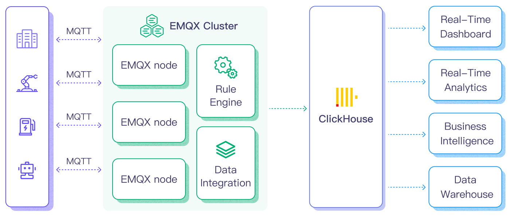

# ClickHouseへのMQTTデータ取り込み

[ClickHouse](https://clickhouse.com/) は、高性能なカラム指向のSQLデータベース管理システム（DBMS）であり、オンライン分析処理（OLAP）に適しています。大量データを低レイテンシで処理・分析することに優れており、優れたクエリ性能、柔軟なデータモデル、スケーラブルな分散アーキテクチャを備えているため、さまざまなデータ分析シナリオに適しています。EMQXはClickHouseとの統合をサポートしており、MQTTメッセージやイベントデータをClickHouseに取り込んで、さらなる分析や処理を行うことが可能です。

## 動作概要

ClickHouseデータ統合は、EMQXに標準搭載された機能であり、MQTTのリアルタイムデータキャプチャと送信機能をClickHouseの強力なデータ処理機能と組み合わせることを目的としています。組み込みの[ルールエンジン](https://docs.emqx.com/en/enterprise/v5.1/data-integration/rules.html)コンポーネントにより、EMQXからClickHouseへのデータ取り込みが簡素化され、複雑なコーディングを必要としません。

以下の図は、EMQXとClickHouse間の典型的なデータ統合アーキテクチャを示しています。



MQTTデータをClickHouseに取り込む流れは以下の通りです：

1. **メッセージのパブリッシュと受信**：産業用IoTデバイスはMQTTプロトコルを介してEMQXに正常に接続し、機械、センサー、製造ラインの稼働状態や計測値、トリガーイベントに基づくリアルタイムMQTTデータをEMQXにパブリッシュします。EMQXがこれらのメッセージを受信すると、ルールエンジン内でマッチング処理を開始します。
2. **メッセージデータの処理**：メッセージが到着すると、ルールエンジンを通過し、EMQXに定義されたルールにより処理されます。ルールは事前に定義された条件に基づき、ClickHouseにルーティングすべきメッセージを判別します。ペイロード変換が指定されている場合は、データ形式の変換、特定情報のフィルタリング、追加コンテキストによるペイロードの強化などの変換が適用されます。
3. **ClickHouseへのデータ取り込み**：ルールエンジンがClickHouseへの保存対象メッセージを特定すると、メッセージをClickHouseに転送するアクションがトリガーされます。処理済みデータはClickHouseデータベースのコレクションにシームレスに書き込まれます。
4. **データの保存と活用**：データがClickHouseに保存されることで、企業はそのクエリ機能を活用して様々なユースケースに対応できます。例えば、物流やサプライチェーン管理分野では、GPSトラッカー、温度センサー、在庫管理システムなどのIoTデバイスからのデータをリアルタイムで監視・分析し、追跡、ルート最適化、需要予測、効率的な在庫管理に役立てることができます。

## 特長とメリット

ClickHouseとのデータ統合は、効率的なデータ送信、保存、活用を実現するために以下のような特長とメリットを提供します：

- **リアルタイムデータストリーミング**：EMQXはリアルタイムデータストリームの処理に最適化されており、ソースシステムからClickHouseへの効率的かつ信頼性の高いデータ送信を保証します。即時の洞察やアクションが求められるユースケースに理想的です。
- **高性能かつスケーラブル**：EMQXの分散アーキテクチャとClickHouseのカラムストレージ形式により、データ量の増加に応じてシームレスにスケール可能です。大規模データセットでも一貫した性能と応答性を維持します。
- **柔軟なデータ変換**：EMQXは強力なSQLベースのルールエンジンを提供し、ClickHouseに保存する前にデータの前処理が可能です。フィルタリング、ルーティング、集約、強化など多様な変換機能をサポートし、ニーズに応じてデータを整形できます。
- **簡単なデプロイと管理**：EMQXはデータソースの設定、データ前処理ルール、ClickHouse保存設定をユーザーフレンドリーなインターフェースで提供し、データ統合プロセスのセットアップと運用管理を簡素化します。
- **高度な分析**：ClickHouseの強力なSQLクエリ言語と複雑な分析関数のサポートにより、IoTデータから価値あるインサイトを得られ、予測分析や異常検知などに活用できます。

## はじめる前に

このセクションでは、EMQXダッシュボードでClickHouseデータ統合を作成する前に必要な準備について説明します。

### 前提条件

- EMQXデータ統合の[ルール](./rules.md)に関する知識
- [データ統合](./data-bridges.md)に関する知識
- UNIXターミナルとコマンドの基本知識

### ClickHouseサーバーの起動

このセクションでは、[Docker](https://www.docker.com/)を使ってClickHouseサーバーを起動する方法を紹介します。

1. 以下の初期化SQL文を含む `init.sql` ファイルを作成します。このファイルはコンテナ起動時にデータベースを初期化するために使用されます。

   ```bash
   cat >init.sql <<SQL_INIT
   CREATE DATABASE IF NOT EXISTS mqtt_data;
   CREATE TABLE IF NOT EXISTS mqtt_data.messages (
      data String,
      arrived TIMESTAMP
   ) ENGINE = MergeTree()
   ORDER BY arrived;
   SQL_INIT
   ```

2. 以下のコマンドでClickHouseサーバーを起動します。このコマンドではデータベース名、ポート番号、ユーザー名、パスワードを指定し、カレントディレクトリの `init.sql` ファイルをDocker内にマウントします。

   ```bash
   docker run \
   --rm \
   -e CLICKHOUSE_DB=mqtt_data \
   -e CLICKHOUSE_USER=emqx \
   -e CLICKHOUSE_DEFAULT_ACCESS_MANAGEMENT=1 \
   -e CLICKHOUSE_PASSWORD=public \
   -p 18123:8123 \
   -p 19000:9000 \
   --ulimit nofile=262144:262144 \
   -v $pwd/init.sql:/docker-entrypoint-initdb.d/init.sql \
   clickhouse/clickhouse-server
   ```

DockerでClickHouseを実行する詳細は[dockerhubのページ](https://hub.docker.com/r/clickhouse/clickhouse-server)をご参照ください。

## コネクターの作成

このセクションでは、SinkをClickHouseサーバーに接続するためのコネクター作成方法を説明します。

以下の手順は、EMQXとClickHouseの両方をローカルマシンで実行していることを前提としています。リモートで実行している場合は設定を適宜調整してください。

1. EMQXダッシュボードに入り、左メニューから **Integration** -> **Connectors** をクリックします。
2. 画面右上の **Create** をクリックします。
3. **Create Connector** ページで **ClickHouse** を選択し、**Next** をクリックします。
4. **Configuration** ステップで以下を設定します：
   - **Connector name**：コネクター名を入力します。英数字の組み合わせで、例：`my_clickhouse`
   - **Server URL**：`http://127.0.0.1:18123`
   - **Database Name**：`mqtt_data`
   - **Username**：`emqx`
   - **Password**：`public`
5. 詳細設定（任意）：[Advanced Configurations](#advanced-configurations)を参照してください。
6. **Create**をクリックする前に、**Test Connectivity** を押してClickHouseサーバーへの接続をテストできます。
7. 画面下部の **Create** ボタンをクリックしてコネクター作成を完了します。ポップアップダイアログで **Back to Connector List** または **Create Rule** を選択して、ルールやSinkの作成を続けられます。詳細は[ClickHouse Sink付きルールの作成](#create-a-rule-with-clickhouse-sink)をご覧ください。

## ClickHouse Sink付きルールの作成

このセクションでは、EMQXダッシュボードでMQTTのソーストピック `t/#` からのメッセージを処理し、処理結果を設定済みのClickHouse Sinkに転送するルールの作成方法を説明します。

1. EMQXダッシュボードの左メニューから **Integration** -> **Rules** をクリックします。
2. 画面右上の **Create** をクリックします。
3. ルールIDを入力します。例：`my_rule`
4. SQLエディターに以下のステートメントを入力します。これはトピックパターン `t/#` にマッチするMQTTメッセージを転送します。

   ```sql
   SELECT
     payload as data,
     now_timestamp() as timestamp
   FROM
     "t/#"
   ```

   注：初心者の方は **SQL Examples** と **Enable Test** をクリックしてSQLルールの学習とテストが可能です。

5. + **Add Action** ボタンをクリックし、ルールによりトリガーされるアクションを定義します。このアクションにより、EMQXはルールで処理したデータをClickHouseに送信します。
6. **Type of Action** ドロップダウンから `ClickHouse` を選択し、**Action** はデフォルトの `Create Action` のままにします。既存のClickHouse Sinkがあれば選択も可能です。この例では新規Sinkを作成します。
7. Sinkの名前を入力します。英数字の組み合わせで指定してください。
8. **Connector** ドロップダウンから先ほど作成した `my_clickhouse` を選択します。新規コネクター作成はドロップダウン横のボタンから可能です。設定パラメータは[コネクター作成](#create-a-connector)を参照してください。
9. **Batch Value Separator** はデフォルトの `,` のままにします。これは複数入力アイテムを区切るための設定で、[バッチモード](./data-bridges.md)を有効にし、ClickHouseのFORMAT構文で別の形式を指定する場合のみ変更が必要です。
10. SQLテンプレートに以下を入力します（[ルールエンジン](./rules.md)を使い、SQLインジェクション対策のために文字列を適切にエスケープしてください）：

    ```sql
    INSERT INTO messages(data, arrived) VALUES ('${data}', ${timestamp})
    ```

    ここで `${data}` と `${timestamp}` はメッセージ内容とタイムスタンプを表し、ルールで後ほど設定します。EMQXは転送前にこれらを対応する内容に置換します。

    SQLテンプレート内でプレースホルダー変数が未定義の場合は、**SQL template** 上部の **Undefined Vars as Null** スイッチでルールエンジンの動作を切り替えられます：

    - **無効（デフォルト）**：ルールエンジンは文字列 `undefined` をデータベースに挿入します。
    - **有効**：未定義変数の場合、`NULL` を挿入します。

      ::: tip

      可能な限りこのオプションは有効にしてください。無効化は後方互換性確保のためのみ推奨されます。

      :::

11. **フォールバックアクション（任意）**：メッセージ配信失敗時の信頼性向上のため、1つ以上のフォールバックアクションを定義できます。これらはメインSinkがメッセージ処理に失敗した際にトリガーされます。詳細は[フォールバックアクション](./data-bridges.md#fallback-actions)を参照してください。
12. 詳細設定（任意）：[Advanced Configurations](#advanced-configurations)を参照してください。
13. **Create** をクリックする前に、**Test Connectivity** ボタンでClickHouseサーバーへの接続確認が可能です。
14. **Create** ボタンをクリックしてSink設定を完了します。**Create Rule** ページに戻ると、新しいSinkが **Action Outputs** タブに表示されます。
15. **Create Rule** ページで設定内容を確認し、**Create** ボタンを押してルールを生成します。作成したルールはルール一覧に表示され、**status** は `connected` となります。

これでルールが正常に作成され、**Rule** ページに新しいルールが表示されます。**Actions(Sink)** タブをクリックすると、新しいClickHouse Sinkが確認できます。

また、**Integration** -> **Flow Designer** をクリックするとトポロジーが表示され、トピック `t/#` のメッセージがルール `my_rule` により解析され、ClickHouseに送信・保存されている様子が確認できます。

## ルールのテスト

EMQXダッシュボード内蔵のWebSocketクライアントを使って、ルールが期待通りに動作するかテストできます。

ダッシュボード左メニューの **Diagnose** -> **WebSocket Client** をクリックし、WebSocketクライアントを開きます。以下の手順でWebSocketクライアントを設定し、トピック `t/test` にメッセージを送信します：

1. 現在のEMQXインスタンスの接続情報を入力します。ローカルでEMQXを実行している場合は、デフォルト値のままで問題ありません（認証設定を変更している場合はユーザー名・パスワードの入力が必要です）。
2. **Connect** をクリックしてクライアントをEMQXに接続します。
3. ページ下部のパブリッシュエリアに以下を入力します：
   - **Topic**：`t/test`
   - **Payload**：`Hello World Clickhouse from EMQX`
   - **QoS**：2
4. **Publish** をクリックしてメッセージを送信します。ClickHouseサーバーのデータベース `mqtt_data` のテーブル `messages` にエントリが挿入されているはずです。以下のコマンドで確認できます：

   ```bash
   curl -u emqx:public -X POST -d "SELECT * FROM mqtt_data.messages" http://localhost:18123
   ```

5. 正常に動作していれば、以下のような結果が表示されます（タイムスタンプは異なります）：

   ```
   Hello World Clickhouse from EMQX        2024-01-17 09:40:06
   ```

## 詳細設定

このセクションでは、EMQX ClickHouseコネクターの詳細設定オプションについて説明します。ダッシュボードでコネクターを設定する際、**Advanced Settings** にて以下のパラメータをニーズに合わせて調整できます。

| **項目**                   | **説明**                                                                                                                     | **推奨値** |
| -------------------------- | ---------------------------------------------------------------------------------------------------------------------------- | ---------- |
| **Connection Pool Size**   | ClickHouseサービスとの接続プールで維持される同時接続数を指定します。この設定はEMQXとClickHouse間のアクティブ接続数を制御し、アプリケーションのスケーラビリティと性能に影響します。<br/>**注意**：適切な接続プールサイズはシステムリソース、ネットワークレイテンシ、ワークロードに依存します。大きすぎるとリソース枯渇、小さすぎるとスループット制限となる場合があります。 | `8`        |
| **Clickhouse Timeout**     | ClickHouseサーバーへの接続確立時にコネクターが待機する最大時間（秒）を指定します。<br/>**注意**：システム性能とリソース利用のバランスを取るため、ネットワーク環境に応じて最適なタイムアウト値をテストすることが推奨されます。 | `15`       |
| **Start Timeout**          | 自動起動されたリソースが正常状態になるまでコネクターが待機する最大時間（秒）を指定します。この設定により、ClickHouseのデータベースインスタンスなどのリソースが完全に稼働し、データ処理準備が整うまで処理を進めないようにします。 | `5`        |
| **Buffer Pool Size**       | EMQXとClickHouse間の送信（egress）タイプSinkでデータフロー管理に割り当てるバッファワーカープロセス数を指定します。これらのワーカーはデータを一時的に保持し、ターゲットサービスへの送信を最適化します。受信（ingress）タイプのブリッジのみの場合は「0」に設定可能です。 | `16`       |
| **Request TTL**            | バッファに入ったリクエストが有効とみなされる最大期間（秒）を指定します。TTLを超えたリクエストや、送信後にClickHouseからの応答・アックがタイムリーに得られない場合、そのリクエストは期限切れと見なされます。 | `45`       |
| **Health Check Interval**  | コネクターがClickHouseとの接続状態を自動的にヘルスチェックする間隔（秒）を指定します。 | `15`       |
| **Max Buffer Queue Size**  | ClickHouseコネクターの各バッファワーカーがバッファリング可能な最大バイト数を指定します。バッファワーカーはデータ送信前の一時保管を担い、システム性能やデータ転送要件に応じて調整してください。 | `256`      |
| **Max Batch Size**         | EMQXからClickHouseへ一度に転送可能なデータバッチの最大サイズを指定します。サイズを調整することでデータ転送の効率と性能を最適化できます。<br />「1」に設定すると、データレコードはバッチ化せず個別に送信されます。 | `1`        |
| **Query Mode**             | メッセージ送信の要件に応じて、`asynchronous`（非同期）または`synchronous`（同期）モードを選択できます。非同期モードではClickHouseへの書き込みがMQTTメッセージのパブリッシュ処理をブロックしませんが、クライアントがClickHouse到着前にメッセージを受信する可能性があります。 | `Async`    |
| **Inflight Window**        | 「インフライトクエリ」とは、開始されたがまだ応答やアックを受け取っていないクエリを指します。この設定は、ClickHouseとの通信時に同時に存在可能なインフライトクエリの最大数を制御します。<br/>**Query Mode** が `async` の場合、同一MQTTクライアントからのメッセージを厳密に順序処理したい場合は、この値を1に設定してください。 | `100`      |

## さらに詳しく

以下のリンクから詳細情報をご覧いただけます：

**ブログ**：

- [EMQX + ClickHouseによるIoTデータ収集と分析の実装](https://www.emqx.com/en/blog/emqx-and-clickhouse-for-iot-data-access-and-analysis)
- [MQTTからClickHouse統合：リアルタイムIoTデータ分析の推進](https://www.emqx.com/en/blog/mqtt-to-clickhouse-integration)
