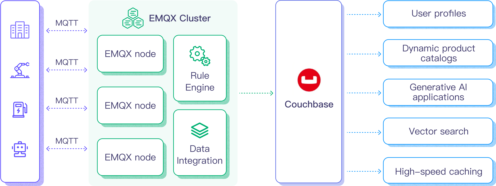
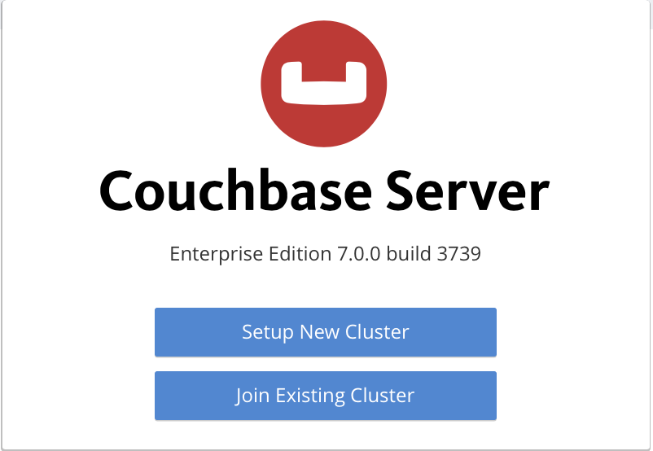
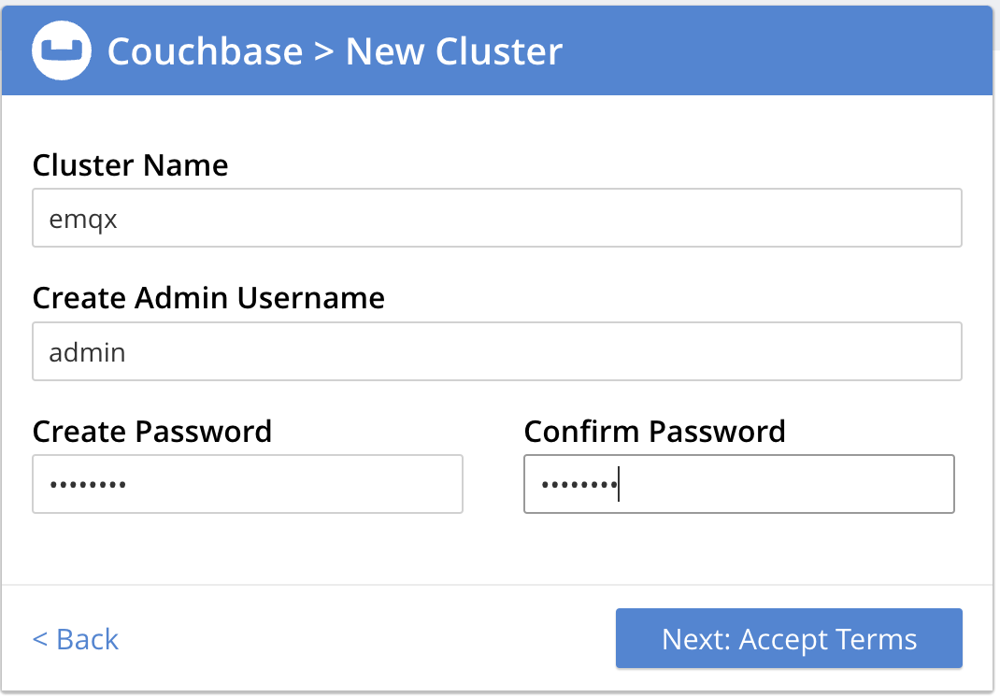
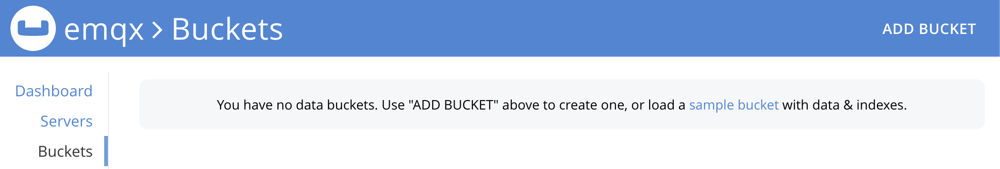

# CouchbaseへのMQTTデータ取り込み

[Couchbase](https://couchbase.com/)は、SQLやACIDトランザクションなどリレーショナルデータベースの強みと、JSONの柔軟性を兼ね備えた多目的分散データベースです。高性能かつスケーラブルな基盤の上に構築されており、ユーザープロファイル、動的製品カタログ、生成AIアプリケーション、ベクター検索、高速キャッシュなど、さまざまな業界で広く利用されています。

## 動作概要

Couchbaseとのデータ統合は、EMQXに標準搭載された機能であり、MQTTのリアルタイムデータ取得・送信機能とCouchbaseの強力なデータ処理機能を組み合わせます。組み込みの[ルールエンジン](./rules.md)コンポーネントにより、EMQXからCouchbaseへのデータ取り込みを簡素化し、複雑なコーディングを不要にします。

以下の図は、EMQXとCouchbase間の典型的なデータ統合アーキテクチャを示しています。



CouchbaseへのMQTTデータ取り込みは以下のように動作します。

1. **メッセージのパブリッシュと受信**：産業用IoTデバイスはMQTTプロトコルを通じてEMQXに正常に接続し、機械、センサー、製品ラインの稼働状態や計測値、トリガーイベントに基づくリアルタイムMQTTデータをEMQXにパブリッシュします。EMQXがこれらのメッセージを受信すると、ルールエンジン内でマッチング処理を開始します。
2. **メッセージデータ処理**：メッセージが到着するとルールエンジンを通過し、EMQXで定義されたルールに従って処理されます。ルールは事前定義された条件に基づき、どのメッセージをCouchbaseへルーティングするかを判定します。ペイロード変換が指定されている場合は、データ形式の変換、特定情報のフィルタリング、追加コンテキストによるペイロードの強化などが適用されます。
3. **Couchbaseへのデータ取り込み**：ルールエンジンがCouchbaseへの保存対象メッセージを特定すると、メッセージをCouchbaseに転送するアクションをトリガーします。処理済みデータはCouchbaseデータベースのデータセットにシームレスに書き込まれます。
4. **データの保存と活用**：データがCouchbaseに保存されることで、企業はクエリ機能を活用し、さまざまなユースケースに対応可能です。例えば動的製品カタログでは、Couchbaseを用いて製品情報の効率的な管理・取得、リアルタイム在庫更新、パーソナライズされた推奨の提供などを実現し、購買体験の向上と売上増加に寄与します。

## 特長と利点

Couchbaseとのデータ統合は、効率的なデータ送信、保存、活用を実現するための多彩な機能と利点を提供します。

- **リアルタイムデータストリーミング**：EMQXはリアルタイムデータストリームの処理に最適化されており、ソースシステムからCouchbaseへの効率的かつ信頼性の高いデータ送信を保証します。即時の洞察やアクションが必要なユースケースに理想的です。
- **高性能かつスケーラブル**：EMQXの分散アーキテクチャとCouchbaseのカラムナー形式ストレージにより、データ量の増加に応じてシームレスにスケール可能です。大規模データセットでも一貫したパフォーマンスと応答性を維持します。
- **柔軟なデータ変換**：EMQXの強力なSQLベースのルールエンジンにより、Couchbaseへの保存前にデータを前処理可能です。フィルタリング、ルーティング、集約、強化など多様な変換機能をサポートし、ニーズに応じたデータ整形が可能です。
- **簡単なデプロイと管理**：EMQXはデータソース設定、前処理ルール、Couchbase保存設定を直感的なインターフェースで提供し、データ統合のセットアップおよび運用管理を簡素化します。
- **高度な分析**：Couchbaseの強力なSQLベースのクエリ言語と複雑な分析機能により、IoTデータから価値ある洞察を得られ、予測分析や異常検知などを実現します。

## はじめる前に

このセクションでは、EMQXダッシュボードでCouchbaseデータ統合を作成する前に必要な準備について説明します。

### 前提条件

- EMQXデータ統合の[ルール](./rules.md)に関する知識
- [データ統合](./data-bridges.md)に関する知識
- UNIXターミナルおよびコマンドの基本知識

### Couchbaseサーバーの起動

このセクションでは、[Docker](https://www.docker.com/)を使ったCouchbaseサーバーの起動方法を紹介します。

1. 以下のコマンドでCouchbaseサーバーを起動します。

   ```bash
   docker run -t --name db -p 8091-8096:8091-8096 -p 11210-11211:11210-11211 couchbase/server:enterprise-7.2.0
   ```

   コマンド実行時にDockerはCouchbase Serverをダウンロード・インストールします。Docker仮想環境でCouchbase Serverが起動すると、以下のメッセージが表示されます。

   ```
   Starting Couchbase Server -- Web UI available at http://<ip>:8091
   and logs available in /opt/couchbase/var/lib/couchbase/logs
   ```

2. ブラウザで `http://localhost:8091` にアクセスし、Couchbase Webコンソールを開きます。



3. **Setup New Cluster** をクリックし、クラスター名を入力します。初期設定として管理者ユーザー名を `admin`、パスワードを `password` に設定してください。



4. 利用規約に同意し、**Finish with Defaults** をクリックしてデフォルト設定で構成を完了します。

5. 設定入力が完了したら、右下の **Save & Finish** ボタンをクリックします。これによりサーバーが設定され、Couchbase Webコンソールのダッシュボードが表示されます。左側のナビゲーションパネルで **Buckets** を選択し、**ADD BUCKET** ボタンをクリックします。



6. バケット名（例：`emqx`）を入力し、**Create** をクリックしてバケットを作成します。

7. デフォルトコレクションに対してプライマリインデックスを作成します。

    ```
    docker exec -t db /opt/couchbase/bin/cbq -u admin -p password -engine=http://127.0.0.1:8091/ -script "create primary index on default:emqx_data._default._default;"
    ```

DockerでのCouchbase起動に関する詳細は、[公式ドキュメントページ](https://docs.couchbase.com/server/current/getting-started/do-a-quick-install.html)をご参照ください。

## コネクターの作成

このセクションでは、SinkをCouchbaseサーバーに接続するためのコネクター作成方法を説明します。

以下の手順は、EMQXとCouchbaseをローカルマシンで動作させていることを前提としています。リモート環境の場合は設定を適宜調整してください。

1. EMQXダッシュボードに入り、**Integration** -> **Connectors** をクリックします。
2. ページ右上の **Create** をクリックします。
3. **Create Connector** ページで **Couchbase** を選択し、**Next** をクリックします。
4. **Configuration** ステップで以下を設定します。
   - **Connector name**：コネクター名を英数字の組み合わせで入力します（例：`my_couchbase`）。
   - **Server Host**：`127.0.0.1`
   - **Username**：`admin`
   - **Password**：`password`
5. 詳細設定（任意）：[詳細設定](#advanced-configurations)を参照してください。
6. **Create** をクリックする前に、**Test Connectivity** を押してCouchbaseサーバーへの接続確認が可能です。
7. ページ下部の **Create** ボタンをクリックしてコネクター作成を完了します。ポップアップダイアログで **Back to Connector List** または **Create Rule** を選択し、ルールとSinkの作成に進めます。詳細は[Create a Rule with Couchbase Sink](#create-a-rule-with-couchbase-sink)を参照してください。

## Couchbase Sinkを用いたルールの作成

このセクションでは、ダッシュボード上でMQTTトピック `t/#` からのメッセージを処理し、処理結果を設定済みのSink経由でCouchbaseに転送するルールの作成方法を説明します。

1. EMQXダッシュボードで左側ナビゲーションメニューから **Integration** -> **Rules** を選択します。
2. ページ右上の **Create** をクリックします。
3. ルールIDを入力します（例：`my_rule`）。
4. SQLエディターに以下のステートメントを入力したままにします。これはトピックパターン `t/#` にマッチするMQTTメッセージを転送します。

   ```sql
   SELECT
     *
   FROM
     "t/#"
   ```

5. + **Add Action** ボタンをクリックし、ルールによってトリガーされるアクションを定義します。このアクションでEMQXはルール処理済みデータをCouchbaseに送信します。
6. **Type of Action** ドロップダウンから `Couchbase` を選択します。**Action** はデフォルトの `Create Action` のままにします。既存のCouchbase Sinkがあれば選択可能ですが、ここでは新規Sinkを作成します。
7. Sink名を英数字の組み合わせで入力します。
8. **Connector** ドロップダウンから先ほど作成した `my_couchbase` を選択します。新規コネクター作成も可能です。設定パラメータは[Create a Connector](#create-a-connector)を参照してください。
9. SQLテンプレートに以下を入力します。

    ```sql
    insert into emqx_data (key, value) values (${.id}, ${.payload})
    ```

    ここで `${.id}` と `${.payload}` はそれぞれMQTTメッセージのIDとペイロードを表し、EMQXが転送前に対応する内容に置き換えます。

10. **フォールバックアクション（任意）**：メッセージ配信失敗時の信頼性向上のため、1つ以上のフォールバックアクションを定義可能です。詳細は[フォールバックアクション](./data-bridges.md#fallback-actions)を参照してください。
11. **詳細設定（任意）**：[詳細設定](#advanced-configurations)を参照してください。
12. **Create** をクリックする前に、**Test Connectivity** ボタンでCouchbaseサーバーへの接続確認が可能です。
13. **Create** ボタンをクリックしSink設定を完了します。**Create Rule** ページの **Action Outputs** タブに新しいSinkが表示されます。
14. **Create Rule** ページで設定内容を確認し、**Create** ボタンを押してルールを生成します。作成したルールはルール一覧に表示され、**status** は接続済みとなります。

これでルール作成は完了です。**Rule** ページで新しいルールを確認できます。**Actions(Sink)** タブをクリックすると、新規Couchbase Sinkが表示されます。

また、**Integration** -> **Flow Designer** を開くとトポロジーが表示され、トピック `t/#` のメッセージがルール `my_rule` によって解析され、Couchbaseに送信・保存されている様子を確認できます。

## ルールのテスト

EMQXダッシュボード内蔵のWebSocketクライアントを使い、ルールが期待通り動作するかテストできます。

ダッシュボード左ナビゲーションの **Diagnose** -> **WebSocket Client** をクリックし、WebSocketクライアントを開きます。以下の手順で設定し、トピック `t/test` にメッセージを送信します。

1. 現在のEMQXインスタンスへの接続情報を入力します。ローカル環境であれば、EMQXのデフォルト設定を変更していなければそのままで構いません（認証設定している場合はユーザー名・パスワードを入力してください）。
2. **Connect** をクリックし、クライアントをEMQXに接続します。
3. パブリッシュエリアに以下を入力します。
   - **Topic**：`t/test`
   - **Payload**：`Hello World Couchbase from EMQX`
   - **QoS**：2
4. **Publish** をクリックしてメッセージを送信します。Couchbaseサーバーの `emqx_data` バケットにアイテムが挿入されているはずです。以下のコマンドで確認できます。

   ```bash
   docker exec -t db /opt/couchbase/bin/cbq -u admin -p password -engine=http://127.0.0.1:8091/ -script "SELECT * FROM emqx_data._default._default LIMIT 5;"
   ```

5. 正常に動作していれば、以下のような結果が表示されます（`requestID`やメトリクスは異なる場合があります）。

    ```
    {
        "requestID": "88be238c-5b63-453d-ac16-c0368a5be2bc",
        "signature": {
            "*": "*"
        },
       "results": [
       {
           "_default": "Hello World Couchbase from EMQX"
       }
       ],
       "status": "success",
       "metrics": {
           "elapsedTime": "3.189125ms",
           "executionTime": "3.098709ms",
           "resultCount": 1,
           "resultSize": 61,
           "serviceLoad": 2
       }
   }
   ```

## 詳細設定

このセクションでは、EMQX Couchbaseコネクターの詳細設定オプションについて説明します。ダッシュボードでコネクターを設定する際、**Advanced Settings** にて以下のパラメータをニーズに合わせて調整可能です。

| **項目**                  | **説明**                                                                                      | **推奨値**           |
| ------------------------- | --------------------------------------------------------------------------------------------- | --------------------- |
| **HTTP Pipelining**       | サーバーに対して個別の応答を待たずに連続して送信可能なHTTPリクエスト数を指定します。<br />正の整数値で、`1`は従来のリクエスト-レスポンスモデル（1リクエスト送信後に応答待ち）を示します。値が大きいほど複数リクエストをまとめて送信でき、ネットワークリソースの効率的利用とラウンドトリップ時間の短縮が可能です。 | `100`                |
| **Connection Pool Size**  | Couchbaseサービスとの接続プールで同時に維持可能な接続数を指定します。<br />システムリソースやネットワークレイテンシ、アプリケーションの負荷に応じて適切に設定してください。大きすぎるとリソース枯渇、小さすぎるとスループット制限の原因になります。 | `8`                   |
| **Connect Timeout**       | Couchbaseサーバーへの接続確立時に待機する最大時間（秒）を指定します。<br />システム性能とリソース利用のバランスを考慮し、ネットワーク状況に応じて最適な値をテストして設定してください。 | `15`                  |
| **Start Timeout**         | 自動起動したリソースが正常状態になるまで待機する最大時間（秒）を指定します。<br />これにより、Couchbaseのデータベースインスタンスなど接続先リソースが完全に稼働し、データ処理可能になるまで処理を進めません。 | `5`                   |
| **Health Check Interval** | Couchbaseへの接続状態を自動的に監視する間隔（秒）を指定します。                                         | `15`                  |
