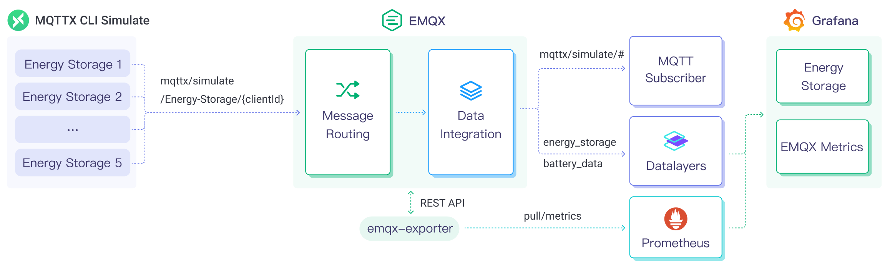

# DatalayersへのMQTTデータ取り込み

Datalayersは、産業用IoT、IoV、エネルギーなどの分野向けに設計されたマルチモーダルかつハイパーコンバージドデータベースです。高いデータスループットと安定したパフォーマンスを備えており、IoTアプリケーションに最適です。EMQXは現在、Sinkを介してDatalayersにメッセージやデータを格納することをサポートしており、データ分析や可視化を容易にしています。

本ページでは、EMQXとDatalayersのデータ連携の詳細な概要を説明し、ルールおよびSinkの作成方法について実践的なガイドを提供します。

## 動作概要

Datalayersデータ連携はEMQXの標準機能であり、EMQXのデバイス接続およびメッセージ転送機能とDatalayersのデータ格納・分析機能を組み合わせています。簡単な設定により、シームレスなMQTTデータ連携を実現可能です。EMQXはルールエンジンとSinkを利用してデバイスデータをDatalayersへ転送し、格納・分析します。Datalayersは分析結果をレポートやチャートなどの形で生成し、Datalayersの可視化ツールを通じてユーザーに表示します。

以下の図は、エネルギー貯蔵シナリオにおけるEMQXとDatalayersの典型的なデータ連携アーキテクチャを示しています。



EMQXとDatalayersは、エネルギー消費データをリアルタイムに効率的に収集・分析するためのスケーラブルなIoTプラットフォームを提供します。このアーキテクチャでは、EMQXがデバイス接続、メッセージ転送、データルーティングを担うIoTプラットフォームとして機能し、Datalayersはデータ格納・分析プラットフォームとしてデータの保存と解析を担当します。具体的なワークフローは以下の通りです。

1. **メッセージのパブリッシュと受信**：MQTTプロトコルで正常に接続されたエネルギー貯蔵デバイスは、電力、入力、出力などのエネルギー消費データを定期的にパブリッシュします。EMQXはこれらのメッセージを受信し、ルールエンジンでマッチングします。
2. **ルールエンジンによるメッセージ処理**：組み込みのルールエンジンは、トピックマッチングに基づいて特定のソースからのメッセージを処理します。メッセージが到着するとルールエンジンを通過し、対応するルールにマッチしてメッセージデータを処理します。例えば、データ形式の変換、特定情報のフィルタリング、コンテキスト情報の付加などを行います。
3. **Datalayersへの書き込み**：ルールエンジンで定義されたルールは、メッセージをDatalayersに書き込むアクションをトリガーします。Datalayers SinkはSQLテンプレートを提供し、書き込むデータ形式を柔軟に定義可能です。メッセージの特定フィールドをDatalayersの対応するテーブルやカラムに格納できます。

エネルギー貯蔵データがDatalayersに書き込まれた後は、[line protocol](https://docs.datalayers.cn/datalayers/latest/development-guide/writing-with-influxdb-line-protocol.html)を活用して柔軟にデータ分析が可能です。例えば：

- Grafanaなどの可視化ツールと連携し、チャートを生成してエネルギー貯蔵データを表示する。
- 業務システムと連携し、エネルギー貯蔵デバイスの状態監視やアラート発報を行う。

## 特長と利点

Datalayersデータ連携は以下の特長と利点を提供します。

- **効率的なデータ処理**：EMQXは多数のIoTデバイス接続とメッセージスループットを処理可能であり、Datalayersはデータ書き込み、格納、クエリに優れているため、IoTシナリオのデータ処理要件をシステム負荷を抑えつつ満たせます。
- **メッセージ変換**：メッセージはEMQXのルールで多様な処理・変換を経てからDatalayersに書き込まれます。
- **スケーラビリティ**：EMQXとDatalayersは共にクラスタリング機能を持ち、ビジネスの拡大に応じて柔軟な水平スケールアウトが可能です。
- **豊富なクエリ機能**：Datalayersはタイムスタンプデータの効率的なクエリ・分析のために最適化された関数、演算子、インデックス技術を提供し、IoT時系列データから価値ある洞察を抽出します。
- **効率的なストレージ**：Datalayersは高圧縮エンコーディング方式を用いてストレージコストを大幅に削減し、不要なデータがストレージを占有しないようにカスタマイズ可能なデータ保持期間も設定可能です。

## はじめる前に

このセクションでは、EMQXでDatalayers Sinkを作成する前の準備として、Datalayersのインストールとセットアップについて説明します。

### 前提条件

- [ルール](./rules.md)の基本知識
- [データ連携](./data-bridges.md)の基本知識
- Datalayers Sinkでのデータ書き込みに使用される[Datalayers Line Protocol](https://docs.datalayers.cn/datalayers/latest/development-guide/writing-with-influxdb-line-protocol.html)の理解

### Datalayersのインストールとセットアップ

1. Dockerを使ってDatalayersをインストールし起動します。詳細な手順は[Install Datalayers](https://docs.datalayers.cn/datalayers/latest/getting-started/docker.html)を参照してください。

   ```bash
   # Datalayersコンテナを起動
   docker run -d --name datalayers -p 8360:8360 -p 8361:8361 datalayers/datalayers:latest
   ```

2. Datalayersサービス起動後、デフォルトのユーザー名・パスワード `admin`/`public` でDatalayers CLIにログインします。CLIでデータベースを作成する手順は以下の通りです。

   - Datalayersコンテナにアクセス：

     ```bash
     docker exec -it datalayers bash
     ```
     
   - Datalayers CLIに入る：

     ```bash
     dlsql -u admin -p public
     ```
     
   - データベースを作成：

     ```sql
     create database mqtt
     ```

## コネクターの作成

このセクションでは、SinkをDatalayersサーバーに接続するためのコネクター作成方法を説明します。

以下の手順はEMQXとDatalayersがローカルで起動していることを前提としています。リモート環境の場合は設定を適宜調整してください。

1. EMQXダッシュボードで、**Integration** -> **Connectors** を開きます。
2. ページ右上の **Create** をクリックします。
3. **Create Connector** ページで **Datalayers** を選択し、**Next** をクリックします。
4. **Configuration** ステップで以下を設定します：
   - コネクター名を入力（大文字・小文字の英数字の組み合わせ推奨）、例：`my_datalayers`
   - Datalayersサーバーの接続情報を入力：
     - サーバーアドレス：`127.0.0.1:8361`
     - [Install and Set Up Datalayers](#install-and-set-up-datalayers)で設定した**Username**、**Password**、**Database**を入力
   - TLSの有効化設定。TLS接続オプションの詳細は[外部リソースアクセスのTLS暗号化有効化](../../operate/network/overview.md#tls-for-external-resource-access)を参照してください。
5. **Create**をクリックする前に、**Test Connectivity**を押してコネクターがDatalayersサーバーに接続できるか確認できます。
6. ページ下部の **Create** ボタンを押してコネクター作成を完了します。ポップアップで **Back to Connector List** または **Create Rule** を選択可能です。ルールとSinkを作成してDatalayersへの転送データを指定する場合は、[Create Datalayers Sink Rules](#create-a-rule-with-datalayers-sink)を参照してください。

## Datalayers Sinkを使ったルールの作成

このセクションでは、EMQXでMQTTトピック `t/#` からのメッセージを処理し、処理結果を設定済みのDatalayers Sinkに送信するルールの作成方法を説明します。

1. ダッシュボード左メニューの **Data Integration** -> **Rules** をクリックします。

2. ルールページ右上の **Create** ボタンを押します。

3. ルールIDに `my_rule` を入力します。

4. SQLエディターに、`t/#` トピックのMQTTメッセージをDatalayersに格納するためのルールを入力します。例：

   ::: tip 注意

   独自のSQLルールを指定する場合は、ルールで選択するフィールド（SELECT部分）が、Datalayers Sinkで指定したデータ書き込みフォーマットに含まれるすべての変数を含んでいることを確認してください。

   :::

   ```sql
   SELECT
     *
   FROM
     "t/#"
   ```

   ::: tip

   SQLに不慣れな場合は、**SQL Examples** や **Enable Debug** をクリックしてルールSQLの学習やテストが可能です。

   :::

5. ルールがトリガーされた際のアクションを指定するため、右側の **Add Action** ボタンをクリックします。これにより、EMQXはルールで処理したデータをDatalayersに転送します。

6. **Action** ドロップダウンリストで `Datalayers` を選択し、**Action** はデフォルトの `Create Action` のままにします。既存のDatalayers Sinkを選択することも可能です。本例では新規Sinkを作成します。

7. Sinkの名前を入力します。名前は大文字・小文字の英数字の組み合わせにしてください。

8. **Connector** ドロップダウンリストから先に作成した `my_datalayers` を選択します。新しいコネクターを作成する場合は、ドロップダウン横のボタンをクリックしてください。設定パラメータは[コネクターの作成](#コネクターの作成)を参照してください。

9. **Time Precision** はデフォルトでミリ秒に設定します。

10. データ解析を定義し、Datalayersにパース・書き込みするための**Data Format**と内容を指定します。`JSON` と `InfluxDB Line Protocol` フォーマットをサポートしています。

    - JSONフォーマットの場合、**Measurement**、**Timestamp**、**Fields**、**Tags**を含むデータ解析方法を定義します。すべてのキー値は変数やプレースホルダーにできます。また、[InfluxDB line protocol](https://docs.datalayers.cn/datalayers/latest/development-guide/writing-with-influxdb-line-protocol.html)に従って設定可能です。**Fields**はCSVファイルによる一括設定もサポートしています。詳細は[バッチ設定](#batch-settings)を参照してください。

    - Line Protocolフォーマットの場合、ステートメントでテーブル、フィールド、タイムスタンプ、タグを指定します。キー・値は定数またはプレースホルダー変数をサポートし、[InfluxDB line protocol](https://docs.datalayers.cn/datalayers/latest/development-guide/writing-with-influxdb-line-protocol.html)に従って設定可能です。

      ::: tip

      Datalayersに書き込むデータはInfluxDB v1のline protocolと完全互換のため、[InfluxDB Line Protocol](https://docs.influxdata.com/influxdb/v1.8/write_protocols/line_protocol_reference/)を参照してデータフォーマットを設定できます。

      例えば、符号付き整数値を入力する場合、プレースホルダーの後に型指示子として `i` を付けます。例：`${payload.int}i`。詳細は[InfluxDB 1.8で整数値を書き込む方法](https://docs.influxdata.com/influxdb/v1.8/write_protocols/line_protocol_reference/#write-the-field-value-1-as-an-integer-to-influxdb)を参照してください。

      :::

      ここではLine Protocolフォーマットを使い、以下のように設定できます。

      ```sql
      devices,clientid=${clientid} temp=${payload.temp},hum=${payload.hum},precip=${payload.precip}i ${timestamp}
      ```

11. **フォールバックアクション（任意）**：メッセージ配信失敗時の信頼性向上のため、1つ以上のフォールバックアクションを定義可能です。プライマリSinkがメッセージ処理に失敗した場合にこれらのアクションがトリガーされます。詳細は[フォールバックアクション](./data-bridges.md#fallback-actions)を参照してください。

12. **Advanced Settings** を展開し、必要に応じて高度なオプションを設定します（任意）。詳細は[高度な設定](#advanced-settings)を参照してください。

13. **Create**をクリックする前に、**Test Connectivity**を押してSinkがDatalayersサーバーに接続できるか確認できます。

14. **Create**を押してSink作成を完了します。**Create Rule**ページに戻ると、**Action Outputs**タブに新しいSinkが表示されます。

15. **Create Rule**ページで設定内容を確認し、**Create**ボタンを押してルールを生成します。

これでルールの作成が完了しました。**Rules**ページで新規ルールを確認でき、**Actions (Sink)**タブには新しいDatalayers Sinkが表示されます。

また、**Integration** -> **Flow Designer**を開くとトポロジーを確認でき、`t/#`トピックのメッセージが`my_rule`ルールで処理され、その結果がDatalayersに格納されていることがわかります。

### バッチ設定

Datalayersでは1つのデータエントリーに数百のフィールドが含まれることが多く、データフォーマット設定が複雑になる場合があります。これを解決するため、EMQXはバッチフィールド設定機能を提供しています。

JSON形式でデータフォーマットを設定する際、CSVファイルからフィールドのキー・バリューを一括インポートできます。

1. **Fields**テーブルの **Batch Settings** ボタンをクリックし、**Import Batch Settings** ポップアップを開きます。

2. 指示に従いバッチ設定テンプレートファイルをダウンロードし、テンプレートにフィールドのキー・バリューを記入します。デフォルトのテンプレート内容は以下の通りです。

   | Field  | Value              | 備考（任意）                                               |
   | ------ | ------------------ | ---------------------------------------------------------- |
   | temp   | ${payload.temp}    |                                                            |
   | hum    | ${payload.hum}     |                                                            |
   | precip | ${payload.precip}i | フィールド値の後に `i` を付けると、Datalayersは整数型として格納します。 |

   - **Field**：フィールドキー。定数または`${var}`形式のプレースホルダーをサポート。
   - **Value**：フィールド値。定数またはプレースホルダーをサポートし、line protocolに従った型指定子の付加も可能。
   - **備考**：CSV内のフィールドコメント用で、EMQXへのインポート対象外。

   バッチ設定CSVファイルは2048行を超えないようにしてください。

3. 記入したテンプレートファイルを保存し、**Import Batch Settings**ポップアップにアップロードして **Import** をクリックし、バッチ設定を完了します。

4. インポート後、**Fields**設定テーブルでフィールドのキー・バリューをさらに調整可能です。

## ルールとSinkのテスト

MQTTXを使って `t/1` トピックにメッセージをパブリッシュします。この操作によりオンライン・オフラインイベントもトリガーされます。

```bash
mqttx pub -i emqx_c -t t/1 -m '{ "temp": "23.5", "hum": "62", "precip": 2}'
```

両方のSinkの稼働統計を確認し、ヒット数と送信成功数がそれぞれ1ずつ増加していることを確認してください。

Datalayers CLIにて以下のコマンドを実行し、データベースにデータが正常に書き込まれているか確認します。

1. Datalayersコンソールに入る：

   ```bash
   docker exec -it datalayers bash
   dlsql -u admin -p public
   ```

2. SQLクエリを実行してデータを確認：

   ```sql
   use mqtt;
   select * from devices;
   ```

## 高度な設定

このセクションでは、DatalayersコネクターおよびSinkで利用可能な高度な設定オプションについて説明します。ダッシュボードでコネクターやSinkを設定する際、**Advanced Settings**を展開して、用途に応じて以下のパラメータを調整可能です。

| 項目名                  | 説明                                                                                                                         | デフォルト値   |
| ----------------------- | ---------------------------------------------------------------------------------------------------------------------------- | -------------- |
| Startup Timeout         | コネクターが自動起動したリソース（例：Datalayersのデータベースインスタンス）が正常状態になるまで待機する最大時間（秒）を指定します。この設定により、接続先リソースが完全に稼働しデータ処理可能であることを確認してから処理を進めます。 | `5`            |
| Buffer Pool Size        | バッファワーカープロセス数を指定します。これらのプロセスはEMQXとDatalayersのエグレス型Sink間のデータフローを管理し、データを一時的に格納・処理してから送信します。エグレスシナリオでのパフォーマンス最適化に重要です。イングレスのみを扱うブリッジの場合は`0`に設定可能です。 | `4`            |
| Request Timeout         | 「Request TTL（Time to Live）」設定で、リクエストがバッファに入ってから有効とみなされる最大時間（秒）を指定します。リクエストがこの時間を超えてバッファに滞留するか、Datalayersからの応答・アックがタイムリーに得られない場合、リクエストは期限切れとみなされます。 | `45`           |
| Health Check Interval   | SinkがDatalayersとの接続状態を自動的にヘルスチェックする間隔（秒）を指定します。                                         | `15`           |
| Max Buffer Queue Size   | Datalayers Sinkの各バッファワーカープロセスがバッファリング可能な最大バイト数を指定します。バッファワーカーはデータ送信前に一時格納し、データストリームを効率的に処理します。システム性能やデータ送信要件に応じて調整してください。 | `1`            |
| Max Batch Request Size  | EMQXからDatalayersへ一度に転送するデータバッチの最大サイズを指定します。このサイズを調整することでデータ転送の効率とパフォーマンスを最適化できます。<br />`1`に設定すると、データレコードはバッチ化せず個別に送信されます。 | `100`          |
| Request Mode            | `synchronous`（同期）または`asynchronous`（非同期）のリクエストモードを選択し、メッセージ送信を要件に応じて最適化します。非同期モードではDatalayersへの書き込みがMQTTメッセージのパブリッシュ処理をブロックしませんが、クライアントがDatalayers到達前にメッセージを受信する可能性があります。 | `Asynchronous` |
| Inflight Queue Window   | 「Inflight queue requests」とは、送信済みで応答・アック待ちのリクエストを指します。この設定はSinkとDatalayers間の通信で同時に存在可能なインフライトリクエストの最大数を制御します。<br/>**Request Mode**が`asynchronous`の場合に特に重要で、同一MQTTクライアントからのメッセージを厳密に順序処理したい場合はこの値を`1`に設定してください。 | `100`          |
