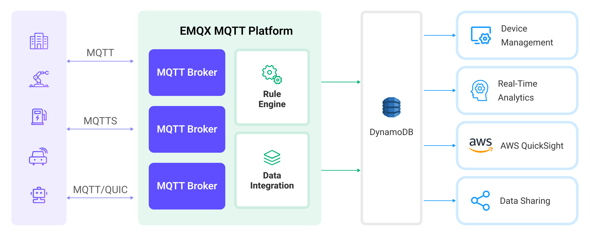

# DynamoDBへのMQTTデータ取り込み

[DynamoDB](https://www.amazonaws.cn/en/dynamodb/)は、AWS上のフルマネージドで高性能なサーバーレスのキー・バリューストア型データベースサービスです。高速でスケーラブルかつ信頼性の高いデータストレージを必要とするアプリケーション向けに設計されています。EMQXはDynamoDBとの統合をサポートしており、MQTTメッセージやクライアントイベントをDynamoDBに保存することで、IoTデバイスの登録・管理やデバイスデータの長期保存およびリアルタイム分析を実現します。DynamoDBデータ統合を通じて、MQTTメッセージやクライアントイベントをDynamoDBに格納できるほか、イベントに応じてDynamoDB内のデータの更新や削除をトリガーし、デバイスのオンライン状態や接続履歴などの情報を記録できます。

本ページでは、EMQXとDynamoDB間のデータ統合について、作成方法と検証手順を含めて包括的に紹介します。

## 動作概要

DynamoDBデータ統合はEMQXの標準機能であり、EMQXのデバイス接続およびメッセージ送受信機能とDynamoDBの強力なデータストレージ機能を組み合わせています。組み込みの[ルールエンジン](./rules.md)コンポーネントにより、EMQXからDynamoDBへのデータ取り込みと管理が簡素化され、複雑なコーディングを不要にします。

以下の図は、EMQXとDynamoDB間の典型的なデータ統合アーキテクチャを示しています。



MQTTデータのDynamoDBへの取り込みは以下のように動作します：

1. **メッセージのパブリッシュと受信**：接続された車両、IIoTシステム、エネルギー管理プラットフォームなどのIoTデバイスは、MQTTプロトコルを通じてEMQXに正常に接続し、特定のトピックにMQTTメッセージをパブリッシュします。EMQXはこれらのメッセージを受信すると、ルールエンジン内でマッチング処理を開始します。
2. **メッセージデータの処理**：メッセージが到着するとルールエンジンを通過し、EMQXで定義されたルールに基づいて処理されます。ルールは事前定義された条件に基づき、どのメッセージをDynamoDBにルーティングするかを決定します。ペイロード変換が指定されている場合は、データ形式の変換、特定情報のフィルタリング、追加コンテキストによるペイロードの強化などが適用されます。
3. **DynamoDBへのデータ取り込み**：ルールエンジンがDynamoDBへの保存対象メッセージを特定すると、メッセージをDynamoDBに転送するアクションをトリガーします。処理済みデータはDynamoDBのテーブルにシームレスに書き込まれます。
4. **データの保存と活用**：DynamoDBに保存されたデータは、様々なユースケースでのクエリに活用できます。例えば、コネクテッドビークル領域では、車両の状態管理、リアルタイム指標に基づくルート最適化、資産追跡などに利用可能です。IIoT環境では、機械の状態監視、メンテナンス予測、生産スケジュールの最適化などに活用されます。

## 特長とメリット

DynamoDBとのデータ統合は、効率的なデータ送信、保存、活用を実現するための多彩な特長とメリットを提供します：

- **リアルタイムデータストリーミング**：EMQXはリアルタイムデータストリームの処理に最適化されており、ソースシステムからDynamoDBへの効率的かつ信頼性の高いデータ送信を保証します。即時のインサイトやアクションが必要なユースケースに最適です。
- **柔軟なデータ変換**：EMQXは強力なSQLベースのルールエンジンを提供し、DynamoDBに保存する前にデータを前処理できます。フィルタリング、ルーティング、集約、エンリッチメントなど多様な変換機能をサポートし、ニーズに応じてデータを整形可能です。
- **柔軟なデータモデル**：DynamoDBはキー・バリューおよびドキュメント型データモデルを採用しており、構造化されたデバイスイベントやメッセージデータの保存・管理に適しています。異なるMQTTメッセージ構造の保存も容易です。
- **強力なスケーラビリティ**：EMQXはクラスターのスケーラビリティを提供し、デバイス接続数やメッセージ量に応じた水平スケーリングが可能です。DynamoDBはサーバーやインフラ管理不要で、基盤リソースの管理とスケーリングを自動で行います。両者の組み合わせにより、高性能かつ高信頼なデータ保存とスケーラビリティを実現します。

## はじめる前に

本節では、DynamoDBデータ統合を作成する前に必要な準備について説明します。認証方法の選択、DynamoDBサーバーのインストール、データテーブルの作成が含まれます。

### 前提条件

- EMQXデータ統合の[ルール](./rules.md)に関する知識
- [データ統合](./data-bridges.md)に関する知識

### 認証方法の選択

EMQX 6.0.4以降、DynamoDBコネクターは以下の認証方法をサポートしています。EMQXのデプロイ環境に応じて選択してください：

- **アクセスキーの手動設定**：対象DynamoDBリソースにアクセス権限を持つAWS Access Key IDとAWS Secret Access Keyを指定します。この方法はローカルデプロイ、非AWS環境、ECSタスクロールやEC2インスタンスロールを使用しないデプロイに適しています。
- **一時認証情報の自動取得**：EMQXがAmazon ECSタスクまたはAmazon EC2インスタンスとして動作している場合、対象DynamoDBリソースにアクセス権限を持つECSタスクロールまたはEC2インスタンスロールを設定します。コネクターの**AWS Access Key ID**および**AWS Secret Access Key**は空欄にします。EMQXはECSタスクロールまたはEC2インスタンスメタデータから一時認証情報を取得し、有効期限前に自動更新します。

::: warning 重要なお知らせ

**AWS Access Key ID**と**AWS Secret Access Key**は両方とも指定するか、両方とも空欄にする必要があります。片方のみ指定するとコネクター設定が無効になります。

:::

### DynamoDBローカルサーバーのインストールとテーブル作成

1. 以下のコマンドでDynamoDBサーバーをローカルで起動します：

   - Access Key ID: `root`
   - Secret Access Key: `public`
   - Region: `us-west-2`

   ```bash
   docker run -d -p 8000:8000 --name dynamodb-local \
     -e AWS_ACCESS_KEY_ID=root \
     -e AWS_SECRET_ACCESS_KEY=public \
     -e AWS_DEFAULT_REGION=us-west-2 \
     amazon/dynamodb-local:2.4.0
   ```

2. テーブル定義ファイルを準備し、カレントディレクトリに`mqtt_msg.json`という名前で保存します。テーブル定義は以下の通りです：

   - `device_id`をハッシュキー（パーティションキー）として定義
   - `timestamp`をレンジキー（ソートキー）として定義
   - `device_id`属性は文字列型（S）
   - `timestamp`属性は数値型（N）

   ```json
   {
       "TableName": "mqtt_msg",
       "AttributeDefinitions": [
           {
               "AttributeName": "device_id",
               "AttributeType": "S"
           },
           {
               "AttributeName": "timestamp",
               "AttributeType": "N"
           }
       ],
       "KeySchema": [
           {
               "AttributeName": "device_id",
               "KeyType": "HASH"
           },
           {
               "AttributeName": "timestamp",
               "KeyType": "RANGE"
           }
       ],
       "ProvisionedThroughput": {
           "ReadCapacityUnits": 5,
           "WriteCapacityUnits": 5
       }
   }
   ```

3. Dockerを使って`aws-cli`コマンドを実行し、上記ファイルを用いて新規テーブルを作成します：

   ```bash
   docker run --rm -v $PWD:/dynamo_data \
       -e AWS_ACCESS_KEY_ID=root \
       -e AWS_SECRET_ACCESS_KEY=public \
       -e AWS_DEFAULT_REGION=us-west-2 \
       amazon/aws-cli:2.15.57 dynamodb create-table \
       --cli-input-json file:///dynamo_data/mqtt_msg.json \
       --endpoint-url http://host.docker.internal:8000
   ```

4. Dockerを使って`aws-cli`コマンドを実行し、テーブル作成が成功したか確認します：

   ```bash
   docker run --rm \
       -e AWS_ACCESS_KEY_ID=root \
       -e AWS_SECRET_ACCESS_KEY=public \
       -e AWS_DEFAULT_REGION=us-west-2 \
       amazon/aws-cli:2.15.57 dynamodb list-tables \
       --endpoint-url http://host.docker.internal:8000
   ```

   テーブル作成が成功していれば、以下のJSONが出力されます。

   ```json
   {
       "TableNames": [
           "mqtt_msg"
       ]
   }
   ```

## コネクターの作成

本節では、SinkをDynamoDBサーバーに接続するためのコネクター作成方法を説明します。

以下の手順は、EMQXとDynamoDBの両方をローカルマシンで実行していることを前提としています。リモート環境で実行している場合は、設定を適宜調整してください。

1. EMQXダッシュボードに入り、**Integration** -> **Connectors**をクリックします。
2. ページ右上の**Create**をクリックします。
3. **Create Connector**ページで**DynamoDB**を選択し、**Next**をクリックします。
4. **Configuration**ステップで以下の情報を設定します：
   - **Connector name**：コネクター名を入力します。大文字・小文字の英数字の組み合わせで、例：`my_dynamodb`。
   - **DynamoDB Region**：`us-west-2`を入力します。
   - **DynamoDB Endpoint**：`http://127.0.0.1:8000`（ローカルの場合）またはDynamoDBサーバーの実際のURLを入力します。
   - **AWS Access Key ID**および**AWS Secret Access Key**：ローカルDynamoDBの例ではそれぞれ`root`と`public`を入力します。ECSタスクロールやEC2インスタンスロールを使用する場合は両方空欄にします。詳細は[認証方法の選択](#認証方法の選択)を参照してください。
5. 詳細設定（任意）：詳細は[Sinkの特長](./data-bridges.md#features-of-sink)を参照してください。
6. **Create**をクリックする前に、**Test Connectivity**をクリックしてコネクターがDynamoDBサーバーに接続できるかテストできます。
7. ページ下部の**Create**ボタンをクリックしてコネクター作成を完了します。ポップアップダイアログで**Back to Connector List**をクリックするか、**Create Rule**をクリックしてSinkを使ったルール作成に進めます。詳細は[メッセージ保存用DynamoDB Sinkのルール作成](#create-a-rule-with-dynamodb-sink-for-message-storage)および[イベント記録用DynamoDB Sinkのルール作成](#create-a-rule-with-dynamodb-sink-for-events-recording)を参照してください。

## メッセージ保存用DynamoDB Sinkのルール作成

本節では、ダッシュボード上でソースMQTTトピック`t/#`からのメッセージを処理し、設定済みSinkを介してDynamoDBテーブル`mqtt_msg`に書き込むルールの作成方法を説明します。

1. EMQXダッシュボードにアクセスし、**Integration** -> **Rules**をクリックします。

2. ページ右上の**Create**をクリックします。

3. ルールIDに`my_rule`を入力します。メッセージ保存用ルールとして、以下のSQL文を**SQL Editor**に入力します。これはトピック`t/#`配下のMQTTメッセージをDynamoDBに保存することを意味します。

   注意：独自のSQL文を指定する場合は、Sinkが必要とする全てのフィールドを`SELECT`句に含めてください。

   ```sql
   SELECT 
     *
   FROM
     "t/#"
   ```

   ::: tip

   初心者の方は**SQL Examples**をクリックし、**Enable Test**でSQLルールの学習とテストが可能です。

   :::

4. + **Add Action**ボタンをクリックし、ルールでトリガーされるアクションを定義します。このアクションにより、EMQXはルールで処理したデータをDynamoDBに送信します。

5. **Type of Action**ドロップダウンから`DynamoDB`を選択します。**Action**はデフォルトの`Create Action`のままにします。既存のSinkがあれば選択可能ですが、ここでは新規Sinkを作成します。

6. Sink名を入力します。大文字・小文字の英数字の組み合わせで指定してください。

7. **Connector**ドロップダウンから先ほど作成した`my_dynamodb`を選択します。新規コネクターを作成する場合はドロップダウン横のボタンをクリックしてください。設定パラメーターは[コネクターの作成](#コネクターの作成)を参照してください。

8. 以下の設定を行います：

   - **Table**：先に作成したテーブル名`mqtt_msg`を入力します。

   - **Hash Key**：`${clientid}`を入力し、クライアントIDをハッシュキーに使用します。

   - **Range Key**（任意）：`${timestamp}`を入力し、メッセージのタイムスタンプをレンジキーに使用します。

   - **Message Template**：デフォルトで空欄のままにします。

     ::: tip

     空欄の場合はメッセージ全体がデータベースに保存されます。実際の値はJSONテンプレートデータです。

     :::

     SQLテンプレート内でプレースホルダー変数が未定義の場合、**Message Template**上部の**Undefined Vars as Null**スイッチでルールエンジンの動作を切り替えられます：

     - **無効**（デフォルト）：ルールエンジンは文字列`undefined`をデータベースに挿入します。

     - **有効**：変数未定義時に`NULL`を挿入可能にします。

       ::: tip

       可能な限りこのオプションは有効にしてください。無効化は後方互換性確保のためのみ推奨されます。

       :::

9. **フォールバックアクション（任意）**：メッセージ配信失敗時の信頼性向上のため、1つ以上のフォールバックアクションを定義できます。これらはプライマリSinkがメッセージ処理に失敗した場合にトリガーされます。詳細は[フォールバックアクション](./data-bridges.md#fallback-actions)を参照してください。

10. **詳細設定（任意）**：必要に応じて**同期（sync）**または**非同期（async）**クエリモードを選択します。詳細は[Sinkの特長](./data-bridges.md#features-of-sink)を参照してください。

11. **Create**をクリックする前に、**Test Connectivity**をクリックしてSinkがサーバーに接続できるかテストします。

12. **Create**ボタンをクリックしてSink設定を完了します。新しいSinkが**Action Outputs**に追加されます。

13. **Create Rule**ページに戻り、設定内容を確認して**Create**をクリックしルールを生成します。

これでDynamoDB Sinkを介したデータ転送ルールが正常に作成されました。**Integration** -> **Rules**ページで新規ルールを確認できます。**Actions(Sink)**タブをクリックすると新しいDynamoDB Sinkが表示されます。

また、**Integration** -> **Flow Designer**を開くとトポロジーが表示され、トピック`t/#`配下のメッセージがルール`my_rule`で解析されDynamoDBに送信・保存されていることが確認できます。

## イベント記録用DynamoDB Sinkのルール作成

本節では、クライアントのオンライン／オフライン状態を記録し、イベントデータを設定済みSink経由でDynamoDBテーブル`mqtt_msg`に書き込むルール作成方法を説明します。

::: tip

便宜上、オンライン／オフラインイベントの受信に`mqtt_msg`トピックを再利用します。

:::

ルールおよびアクション作成手順は[メッセージ保存用DynamoDB Sinkのルール作成](#メッセージ保存用dynamodb-sinkのルール作成)とほぼ同様ですが、SQLルール文が異なります。

オンライン／オフライン状態記録用のSQLルール文は以下の通りです：

```sql
SELECT
  str(event) + timestamp as id, *
FROM 
  "$events/client_connected", "$events/client_disconnected"
```

### ルールのテスト

MQTT Xを使ってトピック`t/1`にメッセージを送信し、オンライン／オフラインイベントをトリガーします。

```bash
mqttx pub -i emqx_c -t t/1 -m '{ "msg": "hello DynamoDB" }'
```

Sinkの稼働状況を確認すると、新規の受信メッセージ1件と送信メッセージ1件、イベントレコード2件があるはずです。

データが`mqtt_msg`テーブルに書き込まれているか確認します。

```bash
docker run --rm -e AWS_ACCESS_KEY_ID=root -e AWS_SECRET_ACCESS_KEY=public -e AWS_DEFAULT_REGION=us-west-2 amazon/aws-cli dynamodb scan --table-name=mqtt_msg --endpoint-url http://host.docker.internal:8000
```

出力例は以下の通りです：

```json
{
    "Items": [
        {
            "metadata": {
                "S": "{\"rule_id\":\"90d98f59\"}"
            },
            "peerhost": {
                "S": "127.0.0.1"
            },
            "clientid": {
                "S": "emqx_c"
            },
            "flags": {
                "S": "{\"retain\":false,\"dup\":false}"
            },
            "node": {
                "S": "emqx@127.0.0.1"
            },
            "qos": {
                "N": "0"
            },
            "payload": {
                "S": "{ \"msg\": \"hello DynamoDB\" }"
            },
            "pub_props": {
                "S": "{\"User-Property\":{}}"
            },
            "publish_received_at": {
                "N": "1678263363503"
            },
            "topic": {
                "S": "t/1"
            },
            "id": {
                "S": "0005F65F239F03FEF44300000BB40002"
            },
            "event": {
                "S": "message.publish"
            },
            "username": {
                "S": "undefined"
            },
            "timestamp": {
                "N": "1678263363503"
            }
        },
        {
            "conn_props": {
                "S": "{\"User-Property\":{},\"Request-Problem-Information\":1}"
            },
            "peername": {
                "S": "127.0.0.1:59582"
            },
            "metadata": {
                "S": "{\"rule_id\":\"703890a5\"}"
            },
            "clientid": {
                "S": "emqx_c"
            },
            "is_bridge": {
                "S": "false"
            },
            "keepalive": {
                "N": "30"
            },
            "proto_ver": {
                "N": "5"
            },
            "proto_name": {
                "S": "MQTT"
            },
            "connected_at": {
                "N": "1678263363499"
            },
            "receive_maximum": {
                "N": "32"
            },
            "sockname": {
                "S": "127.0.0.1:1883"
            },
            "mountpoint": {
                "S": "undefined"
            },
            "node": {
                "S": "emqx@127.0.0.1"
            },
            "id": {
                "S": "client.connected1678263363499"
            },
            "expiry_interval": {
                "N": "0"
            },
            "event": {
                "S": "client.connected"
            },
            "username": {
                "S": "undefined"
            },
            "timestamp": {
                "N": "1678263363499"
            },
            "clean_start": {
                "S": "true"
            }
        },
        {
            "reason": {
                "S": "normal"
            },
            "peername": {
                "S": "127.0.0.1:59582"
            },
            "metadata": {
                "S": "{\"rule_id\":\"703890a5\"}"
            },
            "clientid": {
                "S": "emqx_c"
            },
            "proto_ver": {
                "N": "5"
            },
            "proto_name": {
                "S": "MQTT"
            },
            "sockname": {
                "S": "127.0.0.1:1883"
            },
            "disconn_props": {
                "S": "{\"User-Property\":{}}"
            },
            "node": {
                "S": "emqx@127.0.0.1"
            },
            "id": {
                "S": "client.disconnected1678263363503"
            },
            "event": {
                "S": "client.disconnected"
            },
            "disconnected_at": {
                "N": "1678263363503"
            },
            "username": {
                "S": "undefined"
            },
            "timestamp": {
                "N": "1678263363503"
            }
        }
    ],
    "Count": 3,
    "ScannedCount": 3,
    "ConsumedCapacity": null
}
```
