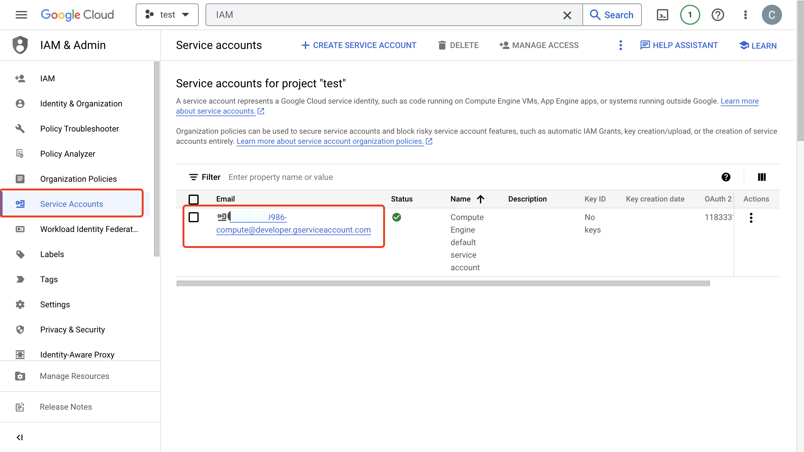

# GCP Pub/Sub への MQTT データ取り込み

[Google Cloud Pub/Sub](https://cloud.google.com/pubsub?hl=en-us) は、非常に高い信頼性とスケーラビリティを実現するために設計された非同期メッセージングサービスです。EMQX は、MQTT データのリアルタイム抽出、処理、分析のために Google Cloud Pub/Sub とのシームレスな統合をサポートしています。Cloud Functions、App Engine、Cloud Run、Kubernetes Engine、Compute Engine などのさまざまな Google Cloud サービスへデータをプッシュできます。また、Google Cloud から MQTT へのデータ配信も可能で、ユーザーが GCP 上で迅速に IoT アプリケーションを構築できるよう支援します。

本ページでは、EMQX と GCP Pub/Sub 間のデータ統合について包括的に紹介し、データ統合の作成と検証に関する実践的な手順を提供します。

## 動作の仕組み

GCP Pub/Sub データ統合は、EMQX の標準機能として提供されており、MQTT データストリームを Google Cloud とシームレスに統合し、IoT アプリケーション開発における豊富なサービスと機能を活用できるよう設計されています。


EMQX はルールエンジンと Sink を介して MQTT データを GCP Pub/Sub に転送します。GCP Pub/Sub のプロデューサー役割の例を挙げると、全体のプロセスは以下の通りです。

1. **IoT デバイスがメッセージをパブリッシュ**: デバイスは特定のトピックを通じてテレメトリや状態データをパブリッシュし、ルールエンジンをトリガーします。
2. **ルールエンジンがメッセージを処理**: 内蔵のルールエンジンは、特定のソースからの MQTT メッセージをトピックマッチングに基づいて処理します。ルールエンジンは対応するルールをマッチングし、データ形式の変換、特定情報のフィルタリング、メッセージへのコンテキスト情報の付加などの処理を行います。
3. **GCP Pub/Sub へのブリッジング**: ルールはメッセージを GCP Pub/Sub に転送するアクションをトリガーします。データプロパティ、オーダーキー、MQTT トピックから GCP Pub/Sub トピックへのマッピングを簡単に設定でき、より豊富なコンテキスト情報と順序保証を提供し、柔軟な IoT データ処理を可能にします。

MQTT メッセージデータが GCP Pub/Sub に書き込まれた後、以下のような柔軟なアプリケーション開発が可能です。

- リアルタイムデータ処理と分析: Dataflow、BigQuery、Pub/Sub のストリーミング機能など、強力な Google Cloud のデータ処理・分析ツールを活用し、メッセージデータのリアルタイム処理と分析を行い、有益なインサイトや意思決定支援を得られます。
- イベント駆動型機能: Cloud Functions や Cloud Run などの Google Cloud イベント処理をトリガーし、動的かつ柔軟な関数トリガーと処理を実現します。
- データ保存と共有: Cloud Storage や Firestore などの Google Cloud ストレージサービスにメッセージデータを送信し、大量データの安全な保存と管理を行います。これにより、他の Google Cloud サービスと連携してデータの共有や分析が可能となり、多様なビジネスニーズに対応できます。

## 特長とメリット

GCP Pub/Sub とのデータ統合は以下の特長とメリットを提供します。

- **堅牢なメッセージングサービス**: EMQX と GCP Pub/Sub は共に高可用性とスケーラビリティを備え、大規模なメッセージストリームの確実な受信、配信、処理を保証します。IoT データのシーケンス管理、メッセージ品質保証、パーシステンスをサポートし、信頼性の高いメッセージ伝送と処理を実現します。
- **柔軟なルールエンジン**: 内蔵のルールエンジンにより、特定のソースメッセージやイベントをトピックマッチングに基づいて処理可能です。メッセージのデータ形式変換、特定情報のフィルタリング、コンテキスト情報の付加などが行えます。これに GCP Pub/Sub を組み合わせることで、さらなる処理や分析が可能です。
- **豊富なコンテキスト情報**: GCP Pub/Sub データ統合を通じて、クライアント属性を Pub/Sub 属性やソートキーにマッピングするなど、メッセージにより豊かなコンテキスト情報を付加できます。これにより、後続のアプリケーション開発やデータ処理でより精緻な分析や処理が可能になります。

まとめると、EMQX と GCP Pub/Sub の統合により、高信頼性かつスケーラブルなメッセージ配信と、データ分析・統合のための豊富なツールやサービスを活用できます。これにより、堅牢な IoT アプリケーションを構築し、イベント駆動型の柔軟なビジネスロジックを実装できます。

## はじめる前に

本セクションでは、GCP Pub/Sub データ統合の作成を開始する前に必要な準備事項を説明します。

### 前提条件

- EMQX データ統合の[ルール](./rules.md)に関する知識
- [データ統合](./data-bridges.md)に関する知識

### GCP でのサービスアカウントキーの作成

**Service Account JSON** 認証を使用する場合は、GCP でサービスアカウントを作成し、JSON 形式のキーを生成してください。

1. GCP アカウントで[サービスアカウント](https://developers.google.com/identity/protocols/oauth2/service-account#creatinganaccount)を作成します。サービスアカウントには、対象トピックへのメッセージの検査/読み取りおよびパブリッシュ権限（例：Pub/Sub Editor ロール）が必要です。

2. 作成したサービスアカウントのメールアドレスをクリックし、**Key** タブを開きます。**Add key** のドロップダウンリストから **Create new key** を選択し、そのアカウントのサービスアカウントキーを作成して JSON 形式でダウンロードします。

   ::: tip

   サービスアカウントキーは後で使用するため安全に保管してください。

   :::

   

### GCP での Workload Identity Federation の設定

Workload Identity Federation（WIF）を使うと、EMQX は長期間有効なサービスアカウントキーを使わずに GCP リソースへアクセスできます。EMQX は外部 ID プロバイダー（例：Microsoft Azure）からのトークンを GCP の Security Token Service を通じて一時的な GCP トークンに交換し、そのトークンでサービスアカウントを代行します。トークンの更新は自動で行われます。

WIF を利用するには、コネクター作成前に GCP プロジェクトで以下を完了してください。

1. Google Cloud コンソールで **IAM & Admin** -> **Workload Identity Federation** に移動し、ワークロードアイデンティティプールを作成し、**Pool ID** と **Project Number** を控えます。

2. プールにプロバイダーを追加し、**Provider ID** を控えます。OIDC ベースの認証の場合は、外部 ID プロバイダーから OAuth 2.0 クライアント資格情報（クライアント ID、クライアントシークレット、トークンエンドポイント URI）を取得します。

3. ワークロードアイデンティティプールに、Pub/Sub トピックにアクセスできる GCP サービスアカウントを代行する権限を付与します。コネクター設定時にサービスアカウントのメールアドレスが必要です。

   ::: tip

   詳細は [Workload Identity Federation の設定](https://cloud.google.com/iam/docs/workload-identity-federation-with-other-providers) を参照してください。

   :::

**例：Microsoft Azure（Entra ID）**

[Microsoft Entra ID](https://portal.azure.com/) で API を公開するアプリケーションを登録し、クライアントシークレットを作成します。コネクター設定時に以下の値を使用します。

| コネクター項目 | 値 |
|---|---|
| **Endpoint URI** | `https://login.microsoftonline.com/<tenant-id>/oauth2/v2.0/token` |
| **OAuth Client ID** | `api://<application-id>` 形式のアプリケーション（クライアント）ID |
| **OAuth Client Secret** | アプリケーション用に生成したクライアントシークレット |
| **OAuth Request Scope** | `api://<application-id>/.default` |

::: tip 注意

`scope` はアプリケーションのオーディエンス（`aud`）と正確に一致させる必要があります。そうしないと GCP STS とのトークン交換に失敗します。詳細は Microsoft のドキュメントの [OAuth 2.0 クライアント資格情報フロー](https://learn.microsoft.com/en-us/entra/identity-platform/v2-oauth2-client-creds-grant-flow) を参照してください。

サービスアカウントに WIF プールへのアクセス権を付与する際は、**Application ID** ではなく **Object ID** を Subject 値として使用してください。Object ID は Azure ポータルのアプリケーションの概要ページの **Enterprise applications** に表示されます。

:::

### Attached Service Account の前提条件

**Attached Service Account** 認証を使用する場合、EMQX はサービスアカウントがアタッチされた GCP Compute Engine インスタンス上で稼働している必要があります。インスタンスの OAuth アクセススコープが Pub/Sub へのアクセスを許可していることを確認してください。Google は `cloud-platform` スコープ（`https://www.googleapis.com/auth/cloud-platform`）の使用を推奨し、IAM ロールでサービスアカウントの権限を制限することを推奨しています。サービスアカウントは対象の Pub/Sub トピックとサブスクリプションへのアクセス権を持っている必要があります。詳細は Google Cloud ドキュメントの [サービスアカウント](https://cloud.google.com/compute/docs/access/service-accounts) を参照してください。

対象の Pub/Sub トピックとサブスクリプションは、Compute Engine インスタンスに関連付けられた GCP プロジェクト内に存在する必要があります。EMQX クラスターの場合、すべてのノードがこれらの要件を満たし、そのプロジェクトの Compute Engine インスタンス上で稼働している必要があります。

コネクター起動時に、EMQX はインスタンスメタデータエンドポイントから GCP プロジェクト ID とアクセストークンを自動取得します。サービスアカウントキーのアップロードは不要です。

### GCP でのトピック作成と管理

EMQX で GCP Pub/Sub データ統合を設定する前に、トピックを作成し、GCP での基本的な管理操作に慣れておく必要があります。

1. Google Cloud コンソールで **Pub/Sub** -> **Topics** ページに移動します。詳細は [トピックの作成と管理](https://cloud.google.com/pubsub/docs/create-topic) を参照してください。

   ::: tip

   サービスアカウントには、そのトピックへのパブリッシュ権限が必要です。

   :::

2. **Topic ID** フィールドにトピックの ID を入力し、**Create topic** をクリックします。

   

3. **Subscriptions** ページに移動し、リスト内の **Topic ID** をクリックします。トピックに対するサブスクリプションを作成します。

   - **Delivery type** で **Pull** を選択します。
   - **Message retention duration** で `7` 日を選択します。

   詳細は [GCP Pub/Sub サブスクリプション](https://cloud.google.com/pubsub/docs/subscriber) を参照してください。

   

4. **Subscription ID** -> **Messages** -> **Pull** をクリックすると、トピックに送信されたメッセージを確認できます。

   

   

## GCP Pub/Sub プロデューサーコネクターの作成

GCP Pub/Sub プロデューサー Sink アクションを追加する前に、EMQX と GCP Pub/Sub 間の接続を確立するための GCP Pub/Sub プロデューサーコネクターを作成する必要があります。

1. EMQX ダッシュボードで **Integration** -> **Connector** をクリックします。
2. ページ右上の **Create** をクリックし、コネクター選択ページで **Google PubSub Producer** を選択して **Next** をクリックします。
3. 名前と説明を入力します（例：`my-pubsubproducer`）。名前は GCP Pub/Sub プロデューサー Sink とコネクターを紐付けるために使用され、クラスター内で一意である必要があります。
4. **Authentication** リストから以下のいずれかの認証方法を選択し、対応する項目を設定します。
   - **Service Account JSON**: [GCP でサービスアカウントキーを作成](#gcp-でのサービスアカウントキーの作成) でエクスポートした JSON 形式のサービスアカウント認証情報をアップロードします。
   - **Workload Identity Federation (WIF)**: 以下の項目を入力します。前提条件は [GCP での Workload Identity Federation の設定](#gcp-での-workload-identity-federation-の設定) を参照してください。
     - **GCP Project ID**: コネクターがアクセスするリソースのプロジェクト ID。
     - **GCP Project Number**: コネクターがアクセスするリソースのプロジェクト番号。
     - **Service Account Email**: 代行するサービスアカウントのメールアドレス。
     - **Workload Identity Pool ID**: WIF トークン交換で使用するワークロードアイデンティティプールの ID。
     - **Workload Identity Provider ID**: WIF トークン交換で使用するワークロードアイデンティティプロバイダーの ID。
     - **Initial Token Configuration** で認証タイプを選択し、対応する項目を入力します。現在サポートされているのは **OIDC with Client Credentials Grant Type** のみです。
       - **Endpoint URI**: OIDC プロバイダーの OAuth トークンエンドポイント URI。
       - **OAuth Client ID**: OAuth サーバーからトークンを要求するためのクライアント ID。
       - **OAuth Client Secret**: OAuth サーバーからトークンを要求するためのクライアントシークレット。
       - **OAuth Request Scope**: OAuth アクセストークン要求時にプロバイダーが必要とする場合の `scope`。
   - **Attached Service Account**: 追加項目は不要です。EMQX はインスタンスメタデータエンドポイントから GCP プロジェクト ID とアクセストークンを自動取得します。前提条件は [Attached Service Account の前提条件](#attached-service-account-の前提条件) を参照してください。
5. **Create** をクリックする前に、**Test Connectivity** をクリックしてコネクターが GCP Pub/Sub サーバーに接続できるかテストできます。
6. ページ下部の **Create** ボタンをクリックしてコネクター作成を完了します。ポップアップダイアログで **Back to Connector List** をクリックするか、**Create Rule** をクリックして Sink を含むルール作成に進み、GCP Pub/Sub に転送するデータを指定できます。詳細は [GCP Pub/Sub プロデューサー Sink を使ったルール作成](#create-a-rule-with-gcp-pub-sub-producer-sink) を参照してください。

## GCP Pub/Sub プロデューサー Sink を使ったルール作成

このセクションでは、GCP Pub/Sub に保存するデータを指定するルールの作成方法を説明します。

1. EMQX ダッシュボードで **Integration** -> **Rules** をクリックします。

2. ページ右上の **Create** をクリックします。

3. ルール ID に `my_rule` を入力します。

4. **SQL Editor** でルールを設定します。例として、トピック `/devices/+/events` の MQTT メッセージを GCP Pub/Sub に保存する場合、以下の SQL を使用します。

   注意: 独自の SQL を指定する場合、Sink のペイロードテンプレートで必要なすべてのフィールドを `SELECT` 部分に含めてください。

   ```sql
   SELECT
     *
   FROM
     "/devices/+/events"
   ```

   注意: 初心者の場合は **SQL Examples** と **Enable Test** をクリックして SQL ルールの学習とテストが可能です。

5. **+ Add Action** ボタンをクリックしてルールでトリガーされるアクションを定義します。**Type of Action** ドロップダウンから `Google PubSub Producer` を選択し、EMQX がルールで処理したデータを GCP Pub/Sub に送信するようにします。

6. **Action** ドロップダウンは `Create Action` のままにするか、既存の GCP Pub/Sub プロデューサー Sink を選択できます。本例では新規 Sink を作成してルールに追加します。

7. **Name** フィールドに Sink の名前を入力します。名前は英数字の組み合わせにしてください。

8. **Connector** ドロップダウンから先ほど作成した `my_pubsubprodcer` を選択します。隣のボタンで新規コネクター作成も可能です。設定パラメーターは [コネクター作成](#create-a-connector) を参照してください。

9. **GCP PubSub Topic** に以下のいずれかを入力します。

   - [GCP でのトピック作成と管理](#gcp-でのトピック作成と管理) で作成したトピック名（例：`my-iot-core`）。EMQX は設定されたサービスアカウントのプロジェクト内でトピックを解決します。
   - `projects/<project-id>/topics/<topic-name>` 形式の完全修飾トピックパス。異なる GCP プロジェクトのトピックにパブリッシュする場合に使用します。そのプロジェクトのトピックに対してサービスアカウントに必要な Pub/Sub 権限を付与してください。

10. **Payload Template** にテンプレートを定義するか空欄のままにします。

    - 空欄の場合、MQTT メッセージの clientid、topic、payload などの可視入力を JSON 形式でエンコードします。
    - 定義したテンプレートを使う場合、`${variable_name}` 形式のプレースホルダーが MQTT コンテキストの対応値に置換されます。例：`${topic}` は MQTT メッセージのトピック `my/topic` に置換されます。

11. **Attributes Template** と **Ordering Key Template** に、送信メッセージの属性やオーダーキーのフォーマットテンプレートを定義します（任意）。

    - **Attributes** はキー・値ともに `${variable_name}` 形式のプレースホルダーを使えます。MQTT コンテキストから値を抽出します。キーのテンプレートが空文字列になる場合、そのキーは GCP Pub/Sub 送信メッセージから省略されます。
    - **Ordering Key** も `${variable_name}` 形式のプレースホルダーを使えます。解決結果が空文字列の場合、GCP Pub/Sub 送信メッセージの `orderingKey` フィールドは設定されません。

12. **フォールバックアクション（任意）**: メッセージ配信失敗時の信頼性向上のため、1つ以上のフォールバックアクションを定義できます。詳細は [フォールバックアクション](./data-bridges.md#fallback-actions) を参照してください。

13. **Advanced Settings** を展開し、必要に応じてオプション設定を行います。詳細は [高度な設定](#advanced-settings) を参照してください。

14. **Create** をクリックする前に、**Test Connectivity** をクリックしてコネクターが GCP Pub/Sub サーバーに接続できるかテストできます。

15. **Create** ボタンをクリックして Sink 設定を完了すると、新しい Sink が **Action Outputs** タブに表示されます。

16. ルール作成ページに戻り、**Create** をクリックしてルールを作成します。

これでルールの作成が完了しました。**Integration** -> **Rules** ページで新規作成したルールを確認できます。**Actions(Sink)** タブで新しい Google PubSub Producer Sink が表示されます。

また、**Integration** -> **Flow Designer** をクリックするとトポロジーが表示され、トピック `/devices/+/events` のメッセージがルール `my_rule` で解析され GCP Pub/Sub に送信・保存されていることが視覚的に確認できます。

## プロデューサールールのテスト

1. MQTTX を使ってトピック `/devices/+/events` にメッセージを送信します。

   ```bash
   mqttx pub -i emqx_c -t /devices/+/events -m '{ "msg": "hello GCP PubSub" }'
   ```

2. Sink の稼働状況を確認し、新規の受信メッセージと送信メッセージがそれぞれ 1 件ずつあることを確認します。

3. GCP の **Pub/Sub** -> **Subscriptions** に移動し、**MESSAGES** タブをクリックするとメッセージが表示されます。

## GCP Pub/Sub コンシューマーコネクターの作成

GCP Pub/Sub コンシューマー Source を追加する前に、EMQX と GCP Pub/Sub 間の接続を確立するための GCP Pub/Sub コンシューマーコネクターを作成する必要があります。

1. EMQX ダッシュボードで **Integration** -> **Connector** をクリックします。
2. ページ右上の **Create** をクリックし、コネクター選択ページで **Google PubSub Consumer** を選択して **Next** をクリックします。
3. 名前と説明を入力します（例：`my-pubsubconsumer`）。名前は GCP Pub/Sub コンシューマー Sink とコネクターを紐付けるために使用され、クラスター内で一意である必要があります。
4. **Authentication** リストから以下のいずれかの認証方法を選択し、対応する項目を設定します。
   - **Service Account JSON**: [GCP でサービスアカウントキーを作成](#gcp-でのサービスアカウントキーの作成) でエクスポートした JSON 形式のサービスアカウント認証情報をアップロードします。
   - **Workload Identity Federation (WIF)**: 以下の項目を入力します。前提条件は [GCP での Workload Identity Federation の設定](#gcp-での-workload-identity-federation-の設定) を参照してください。
     - **GCP Project ID**: コネクターがアクセスするリソースのプロジェクト ID。
     - **GCP Project Number**: コネクターがアクセスするリソースのプロジェクト番号。
     - **Service Account Email**: 代行するサービスアカウントのメールアドレス。
     - **Workload Identity Pool ID**: WIF トークン交換で使用するワークロードアイデンティティプールの ID。
     - **Workload Identity Provider ID**: WIF トークン交換で使用するワークロードアイデンティティプロバイダーの ID。
     - **Initial Token Configuration** で認証タイプを選択し、対応する項目を入力します。現在サポートされているのは **OIDC with Client Credentials Grant Type** のみです。
       - **Endpoint URI**: OIDC プロバイダーの OAuth トークンエンドポイント URI。
       - **OAuth Client ID**: OAuth サーバーからトークンを要求するためのクライアント ID。
       - **OAuth Client Secret**: OAuth サーバーからトークンを要求するためのクライアントシークレット。
       - **OAuth Request Scope**: OAuth アクセストークン要求時にプロバイダーが必要とする場合の `scope`。
   - **Attached Service Account**: 追加項目は不要です。EMQX はインスタンスメタデータエンドポイントから GCP プロジェクト ID とアクセストークンを自動取得します。前提条件は [Attached Service Account の前提条件](#attached-service-account-の前提条件) を参照してください。
5. **Create** をクリックする前に、**Test Connectivity** をクリックしてコネクターが GCP Pub/Sub サーバーに接続できるかテストできます。
6. ページ下部の **Create** ボタンをクリックしてコネクター作成を完了します。ポップアップダイアログで **Back to Connector List** をクリックするか、**Create Rule** をクリックして GCP Pub/Sub コンシューマー Source を含むルール作成に進み、GCP Pub/Sub からデータを取得して EMQX に転送するルールを作成できます。詳細は [GCP Pub/Sub コンシューマー Source を使ったルール作成](#create-a-rule-with-gcp-pub-sub-consumer-source) を参照してください。

## GCP Pub/Sub コンシューマー Source を使ったルール作成

このセクションでは、GCP Pub/Sub からメッセージを取得して EMQX に転送するルールの作成方法を説明します。Google PubSub Consumer Source を作成・設定し、ルールのデータ入力として追加します。さらに Republish アクションをルールに追加し、GCP Pub/Sub から取得したメッセージを EMQX に転送します。

1. EMQX ダッシュボードで **Integration** -> **Rules** をクリックします。

2. ページ右上の **Create** をクリックします。

3. ルール ID に `my_rule_source` を入力します。

4. 右側の **Data Inputs** タブで、デフォルトの Input `Messages` を削除し、**Add Input** をクリックします。

5. **Input Type** ドロップダウンから `Google PubSub Consumer` を選択します。

6. **Source** ドロップダウンはデフォルトの `Create Source` のままにします。本例では新規 Source を作成してルールに追加します。

7. Source の **Name** と（任意で）**Description** を入力します。名前は英数字の組み合わせにしてください（例：`my-gcppubsub-source`）。

8. **Connector** ドロップダウンから先ほど作成した `my_pubsubconsumer` を選択します。隣のボタンで新規コネクター作成も可能です。設定パラメーターは [コネクター作成](#create-a-connector) を参照してください。

9. GCP Pub/Sub から EMQX へメッセージを取得するため、以下の情報を設定します。

   - **GCP PubSub Topic**: トピック名（例：`my-iot-core`）または完全修飾トピックパス（`projects/<project-id>/topics/<topic-name>`）を入力します。トピック名は設定されたサービスアカウントのプロジェクト内で解決されます。異なる GCP プロジェクトのトピックから取得する場合は完全修飾パスを入力し、そのトピックに対してサービスアカウントに必要な Pub/Sub 権限を付与してください。コンシューマーサブスクリプションはサービスアカウントのプロジェクト内に作成され、トピック参照のみ他プロジェクトを指します。
   - **Maximum Messages to Pull**: 1 回のプルリクエストで GCP Pub/Sub から取得する最大メッセージ数を指定します。実際の取得数は指定値以下になる場合があります。

10. **Advanced Settings** を展開し、必要に応じてオプション設定を行います。詳細は [高度な設定](#advanced-settings) を参照してください。

11. **Create** をクリックする前に、**Test Connectivity** をクリックして GCP Pub/Sub サーバーへの接続が成功するかテストできます。

12. **Create** をクリックして Source 作成を完了します。Source はルールの **Data Inputs** タブに追加され、**SQL Editor** のルールは以下のようになります。

    ```sql
    SELECT
      *
    FROM
      "$bridges/gcppubsub:my-gcppubsub-source"
    ```

    注意: 初心者の場合は **SQL Examples** と **Enable Test** をクリックして SQL ルールの学習とテストが可能です。

    `my-gcppubsub-source` からのルール SQL は、以下の GCP Pub/Sub から MQTT トピックへのマッピングテーブルに示すフィールドにアクセスできます。データ処理に応じてルール SQL を調整可能です。本例ではデフォルトの SQL を使用します。

    | フィールド名          | 説明                                                         |
    | --------------------- | ------------------------------------------------------------ |
    | `attributes`          | （任意）文字列のキー・バリューのペアを含むオブジェクト（存在する場合） |
    | `message_id`          | GCP Pub/Sub がこのメッセージに割り当てたメッセージ ID       |
    | `ordering_key`        | （任意）メッセージのオーダーキー（存在する場合）             |
    | `publishing_time`     | GCP Pub/Sub によって定義されたメッセージのタイムスタンプ     |
    | `topic`               | 発信元の GCP Pub/Sub トピック                                |
    | `value`               | （任意）メッセージペイロード（存在する場合）                 |

    **注意**: 各 GCP Pub/Sub から MQTT トピックへのマッピングは、一意の GCP Pub/Sub トピック名を含む必要があります。つまり、同じトピックが複数のマッピングに存在してはなりません。

これで GCP Pub/Sub コンシューマー Source の作成は完了しましたが、メッセージはまだ EMQX に直接パブリッシュされません。次に、[ルールへの Republish アクション追加](#add-republish-action-to-the-rule) の手順を続けて、Republish アクションを作成しルールに追加してください。

### ルールへの Republish アクション追加

このセクションでは、GCP Pub/Sub コンシューマー Source から取得したメッセージを転送し、EMQX トピック `t/1` にパブリッシュするための Republish アクションをルールに追加する方法を説明します。

1. ページ右側の **Action Output** タブを選択し、**Add Action** ボタンをクリックして、**Type of Action** ドロップダウンから `Republish` アクションを選択します。

2. メッセージ再パブリッシュ設定を入力します。

   - **Topic**: MQTT にパブリッシュするトピック。ここでは `t/1` を入力します。

   - **QoS**: `0`、`1`、`2`、`${qos}` のいずれかを選択するか、他のフィールドから QoS を設定するためのプレースホルダーを入力します。`${qos}` を選択すると元のメッセージの QoS に従います。

   - **Retain**: `true` または `false` を選択します。メッセージをリテインメッセージとしてパブリッシュするかどうかを決定します。プレースホルダーも使用可能です。本例では `false` を選択します。

   - **Payload**: 転送メッセージのペイロード生成テンプレートを設定します。空欄の場合はルールの出力結果を転送します。`${.value}` と入力すると GCP Pub/Sub メッセージのペイロードのみを転送します。

     MQTT ペイロードテンプレートのデフォルト値は `${.}` で、利用可能なすべてのデータを JSON オブジェクトとして含みます。例えば、すべてのオプションフィールドを含む GCP Pub/Sub メッセージに対して `${.}` をテンプレートに選択すると以下のようになります。

     ```json
     {
       "attributes": {"attribute_key": "attribute_value"},
       "message_id": "1679665968238",
       "ordering_key": "my-ordering-key",
       "topic": "my-pubsub-topic",
       "publishing_time": "2023-08-18T14:15:18.470Z",
       "value": "my payload"
     }
     ```

     GCP Pub/Sub メッセージのサブフィールドはドット表記でアクセス可能です。例：`${.value}` は GCP Pub/Sub メッセージの値に展開され、`${.attributes.h1}` は存在すれば `h1` 属性キーの値に展開されます。存在しない値は空文字列に置換されます。

   - **MQTT 5.0 メッセージプロパティ**: デフォルトで無効です。詳細設定は [Republish アクションの追加](./rule-get-started.md#add-republish-action) を参照してください。

3. **Create** をクリックしてアクション作成を完了します。作成成功後、ルール作成ページに戻り、Republish アクションが **Action Outputs** タブに追加されます。

4. ルール作成ページで **Create** ボタンをクリックし、ルール全体の作成を完了します。

これでルールの作成が完了しました。**Rules** ページで新規作成したルールを確認できます。**Sources** タブで新しい GCP Pub/Sub コンシューマー Source が表示されます。

また、**Integration** -> **Flow Designer** をクリックするとトポロジーが表示され、GCP Pub/Sub コンシューマー Source からのメッセージが Republish を通じて `t/1` にパブリッシュされる様子を直感的に確認できます。

## GCP Pub/Sub コンシューマールールのテスト

以下の手順で、GCP Pub/Sub コンシューマー Source が GCP Pub/Sub からメッセージを取得し、EMQX の MQTT トピック `t/1` に再パブリッシュすることを検証します。

1. MQTTX CLI を使って EMQX の MQTT トピック `t/1` をサブスクライブします。

   ```bash
   mqttx sub -t t/1 -v
   ```

2. Google Cloud コンソールで **Pub/Sub** -> **Topics** に移動し、`my-iot-core` トピックをクリックして以下のメッセージをパブリッシュします。

   ```json
   {"msg":"hello GCP PubSub"}
   ```

3. MQTTX でトピック `t/1` に以下のメッセージが届くことを確認します。

   ```text
   topic: t/1
   payload: {"msg":"hello GCP PubSub"}
   ```

## 高度な設定

本セクションでは、GCP Pub/Sub コネクター、プロデューサー Sink、コンシューマー Source の高度な設定について説明します。

### コネクターの高度な設定

GCP Pub/Sub プロデューサーおよびコンシューマーコネクターは同じ高度な設定を使用します。

| 項目名 | 説明 | デフォルト値 |
| --- | --- | --- |
| **HTTP Pipelining** | 各レスポンスを待たずに送信可能な HTTP リクエストの最大数。`1` に設定するとレスポンスを待ってから次のリクエストを送信。 | `100` |
| **Connection Pool Size** | コネクションプールに保持する接続数。 | `8` |
| **Connect Timeout** | HTTP 接続確立の最大待機時間。 | `15` 秒 |
| **Max Inactive** | アクティビティなしで再接続を試みるまでの最大時間。 | `10` 秒 |
| **Max Retries** | リクエスト送信時のエラー発生後の最大リトライ回数。 | `2` |
| **Start Timeout** | コネクター作成後に正常状態になるまでの最大待機時間。 | `5` 秒 |
| **Health Check Interval** | コネクターのヘルスチェック間隔。 | `15` 秒 |
| **Health Check Timeout** | ヘルスチェック結果を返す最大時間。タイムアウト時は切断とみなす。 | `60` 秒 |

### プロデューサー Sink とコンシューマー Source 共通の高度な設定

プロデューサー Sink とコンシューマー Source は以下の高度な設定を共有します。**Health Check Interval** のデフォルト値は異なります。

| 項目名 | 説明 | プロデューサー Sink デフォルト | コンシューマー Source デフォルト |
| --- | --- | --- | --- |
| **Request TTL** | リクエストがバッファに入ってからレスポンスまたはアックを受け取るまでの最大時間。期限切れになるとリクエストは失効。 | `45` 秒 | `45` 秒 |
| **Health Check Interval** | Sink または Source のヘルスチェック間隔。 | `15` 秒 | `30` 秒 |
| **Health Check Interval Jitter** | 同じコネクターを共有するアクションやソースが同時にヘルスチェックを開始しないよう、ヘルスチェック間隔に加える一様ランダム遅延。 | `0` ミリ秒 | `0` ミリ秒 |
| **Health Check Timeout** | ヘルスチェック結果を返す最大時間。タイムアウト時は切断とみなす。 | `60` 秒 | `60` 秒 |

### プロデューサー Sink 固有の高度な設定

GCP Pub/Sub プロデューサー Sink は以下の追加の高度な設定を提供します。

| 項目名 | 説明 | デフォルト値 |
| --- | --- | --- |
| **Buffer Pool Size** | GCP Pub/Sub 送信前にデータを格納・処理するバッファワーカーの数。 | `16` |
| **Dispatch Strategy** | ピックキーなしのリクエストをバッファワーカーに割り当てる戦略。`Per Client ID` は同一クライアントのリクエストを同一ワーカーに保持、`Random` はワーカー間で分散。 | `Per Client ID` |
| **Max Buffer Queue Size** | 各バッファワーカーが保持可能な最大データ量。 | `256` MB |
| **Batch Size** | 1 バッチあたりの最大リクエスト数。`1` に設定するとバッチ処理を無効化。 | `1` |
| **Query Mode** | リクエストを同期または非同期で送信するか制御。`Async` モードでは EMQX は GCP Pub/Sub の応答を待たずに処理を継続。 | `Async` |
| **Inflight Window** | **Query Mode** が `Async` の場合、応答を受け取らずに送信可能な最大リクエスト数。MQTT クライアントからのメッセージを厳密な順序で処理する場合は `1` に設定。 | `100` |

### コンシューマー Source 固有の高度な設定

GCP Pub/Sub コンシューマー Source は以下の追加の高度な設定を提供します。

| 項目名 | 説明 | デフォルト値 |
| --- | --- | --- |
| **Ack Deadline** | GCP Pub/Sub が Source からのメッセージアックを待つおおよその時間。期限切れ後はメッセージが再配信される可能性がある。サポート範囲は `10` ～ `600` 秒。 | `60` 秒 |
