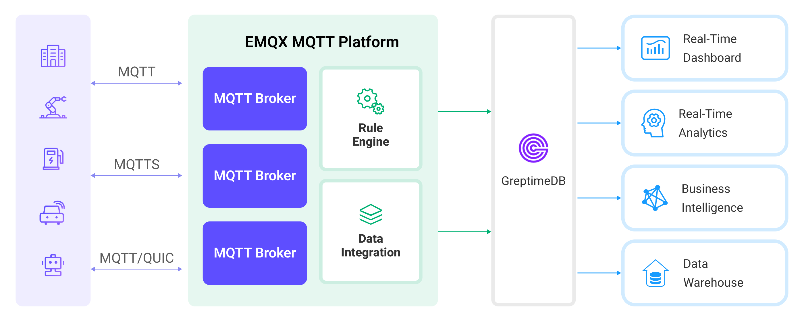

# GreptimeDBへのMQTTデータ取り込み

[GreptimeDB](https://github.com/GreptimeTeam/greptimedb)は、スケーラビリティ、分析機能、効率性に特化したオープンソースの時系列データベースです。クラウド時代のインフラ上で動作するよう設計されており、ユーザーはその弾力性と汎用ストレージの恩恵を受けられます。EMQXは現在、GreptimeDB、GreptimeCloud、GreptimeDB Enterpriseの主流バージョンへの接続をサポートしています。

本ページでは、EMQXとGreptimeDB間のデータ統合について、作成方法と検証手順を含めて包括的に紹介します。

## 動作概要

GreptimeDBデータ統合は、EMQXに組み込まれた機能であり、EMQXのリアルタイムデータキャプチャおよび送信機能と、GreptimeDBのデータ保存・分析機能を組み合わせています。組み込みの[ルールエンジン](./rules.md)コンポーネントにより、EMQXからGreptimeDBへのデータ取り込みが簡素化され、複雑なコーディングを不要にします。ワークフローは以下の通りです。

下図は、EMQXとGreptimeDB間の典型的なデータ統合アーキテクチャを示しています。



1. **メッセージのパブリッシュと受信**：産業用デバイスはMQTTプロトコルを介してEMQXに正常に接続し、定期的にエネルギー消費データをパブリッシュします。このデータには生産ライン識別子や消費値が含まれます。EMQXがこれらのメッセージを受信すると、ルールエンジン内でマッチング処理を開始します。  
2. **ルールエンジンによるメッセージ処理**：組み込みのルールエンジンは、トピックマッチングに基づいて特定のソースからのメッセージを処理します。メッセージが到着すると、ルールエンジンを通過し、対応するルールとマッチングしてメッセージデータを処理します。これにはデータ形式の変換、特定情報のフィルタリング、コンテキスト情報の付加などが含まれます。
3. **GreptimeDBへのデータ取り込み**：ルールエンジンで定義されたルールは、メッセージをGreptimeDBに書き込む操作をトリガーします。GreptimeDB SinkはLine Protocolテンプレートを提供し、特定のメッセージフィールドをGreptimeDBの対応テーブル・カラムに柔軟に書き込むデータ形式を定義可能です。

エネルギー消費データがGreptimeDBに書き込まれた後は、SQL文やPrometheusクエリ言語を使って柔軟にデータ分析が可能です。例えば：

- Grafanaなどの可視化ツールに接続し、エネルギー消費データのグラフを生成・表示する。
- ERPなどのアプリケーションシステムに接続し、生産分析や生産計画の調整を行う。
- 業務システムに接続し、リアルタイムのエネルギー使用分析を実施してデータ駆動型のエネルギー管理を支援する。

## 特長とメリット

GreptimeDBとのデータ統合は、以下の特長と利点をもたらします。

- **使いやすさ**：EMQXとGreptimeDBは共に開発者に優しい設計です。EMQXは標準のMQTTプロトコルに加え、多様な認証、認可、クラスタリング機能を提供します。GreptimeDBは時系列テーブルやスキーマレスアーキテクチャなどユーザーフレンドリーな設計を備えています。両者の統合により、ビジネス統合と開発のスピードが加速します。
- **効率的なデータ処理**：EMQXは多数のIoTデバイス接続とメッセージスループットを効率的に処理可能です。GreptimeDBはデータ書き込み、保存、クエリに優れており、IoTシナリオのデータ処理要件をシステムに負荷をかけずに満たします。
- **メッセージ変換**：メッセージはEMQXのルール内で豊富に処理・変換されてからGreptimeDBに書き込まれます。
- **効率的なストレージとスケーラビリティ**：EMQXとGreptimeDBは共にクラスターのスケールアウト機能を持ち、ビジネスの成長に応じて柔軟に水平スケーリングが可能です。
- **高度なクエリ機能**：GreptimeDBはタイムスタンプデータの効率的なクエリ・分析のために最適化された関数、演算子、インデックス技術を提供し、IoT時系列データから精緻な洞察を抽出できます。

## はじめる前に

本節では、GreptimeDBデータ統合を作成する前に必要な準備、特にGreptimeDBサーバーのインストール方法について説明します。

### 前提条件

- EMQXデータ統合の[ルール](./rules.md)の知識
- [データ統合](./data-bridges.md)の知識

### GreptimeDBサーバーのインストール

1. Dockerを使って[GreptimeDB](https://greptime.com/download)をインストールし、Dockerイメージを起動します。

   ```bash
   # GreptimeDBのDockerイメージを起動
   docker run -p 127.0.0.1:4000-4003:4000-4003 \
     -v "$(pwd)/greptimedb_data:/greptimedb_data" \
     --name greptime --rm \
     greptime/greptimedb:latest standalone start \
     --http-addr 0.0.0.0:4000 \
     --rpc-bind-addr 0.0.0.0:4001 \
     --mysql-addr 0.0.0.0:4002 \
     --postgres-addr 0.0.0.0:4003 \
     --user-provider=static_user_provider:cmd:greptime_user=greptime_pwd
   ```

2. `user-provider`パラメータはGreptimeDBの認証を設定します。ファイルによる設定も可能です。詳細は[ドキュメント](https://docs.greptime.com/user-guide/deployments-administration/authentication/static/)を参照してください。
3. GreptimeDBが起動したら、[http://localhost:4000/dashboard](http://localhost:4000/dashboard)にアクセスしてダッシュボードを利用できます。ユーザー名とパスワードはそれぞれ`greptime_user`と`greptime_pwd`です。

## コネクターの作成

本節では、SinkをGreptimeDBサーバーに接続するためのコネクター作成方法を示します。

以下の手順は、EMQXとGreptimeDBをローカルマシンで実行していることを前提としています。リモート環境の場合は設定を適宜調整してください。

1. EMQXダッシュボードに入り、**Integration** -> **Connectors**をクリックします。
2. 画面右上の**Create**をクリックします。
3. **Create Connector**ページで**GreptimeDB**を選択し、**Next**をクリックします。
4. **Configuration**ステップで以下を設定します：
   - コネクター名を入力します。英数字の組み合わせで、例：`my_greptimedb`。
   - **Server Host**：`127.0.0.1:4001`を入力します。GreptimeCloudに接続する場合はポートを443にして`{url}:443`と入力してください。
   - **Database**：`public`を入力します。GreptimeCloudの場合はサービス名を入力します。
   - **Username**と**Password**：`greptime_user`と`greptime_pwd`を入力します（[GreptimeDBサーバーのインストール](#greptimedbサーバーのインストール)で設定したもの）。GreptimeCloudの場合はサービスのユーザー名とパスワードを入力してください。
5. **Advanced Settings**を展開し、必要に応じて詳細設定を行います（任意）。詳細は[高度な設定](#高度な設定)を参照してください。
6. **Create**をクリックする前に、**Test Connectivity**をクリックしてコネクターがGreptimeDBサーバーに接続できるか確認できます。
7. 画面下部の**Create**ボタンをクリックしてコネクター作成を完了します。ポップアップダイアログで**Back to Connector List**をクリックするか、**Create Rule**をクリックしてGreptimeDB Sinkを使ったルール作成に進めます。詳細は[GreptimeDB Sinkを使ったルール作成](#create-a-rule-with-greptimedb-sink)を参照してください。

## GreptimeDB Sinkを使ったルール作成

本節では、EMQXでMQTTトピック`t/#`からのメッセージを処理し、設定済みのSinkを通じてGreptimeDBに送信するルールの作成方法を示します。

1. EMQXダッシュボードで**Integration** -> **Rules**をクリックします。

2. 画面右上の**Create**をクリックします。

3. ルールIDに`my_rule`を入力し、**SQL Editor**でルールを設定します。ここではトピック`t/#`のMQTTメッセージをGreptimeDBに保存したいため、以下のSQL構文を使用します。

   注意：独自のSQL構文を指定する場合は、Sinkが必要とするすべてのフィールドを`SELECT`句に含めてください。

   ```sql
   SELECT
     *
   FROM
     "t/#"
   ```

   ::: tip

   初心者の方は**SQL Examples**をクリックし、**Enable Test**を有効にしてSQLルールの学習とテストを行うことを推奨します。

   :::

4. + **Add Action**ボタンをクリックし、ルールによりトリガーされるアクションを定義します。このアクションにより、EMQXはルールで処理したデータをGreptimeDBに送信します。

5. **Type of Action**ドロップダウンリストから`GreptimeDB`を選択します。**Action**はデフォルトの`Create Action`のままとします。既にSinkを作成していれば選択も可能です。この例では新規Sinkを作成します。

6. Sinkの名前を入力します。英数字の組み合わせで指定してください。

7. **Connector**ドロップダウンから先ほど作成した`my_greptimedb`を選択します。新規コネクターを作成する場合はドロップダウン横のボタンをクリックしてください。設定パラメータは[コネクターの作成](#コネクターの作成)を参照してください。

8. **Write Syntax**を設定します。これは、データポイントのmeasurement、タグ、フィールド、タイムスタンプをテキスト形式で指定し、[InfluxDB line protocol](https://docs.influxdata.com/influxdb/v2.3/reference/syntax/line-protocol/)の構文に準拠したプレースホルダーをサポートします。GreptimeDBはInfluxDB互換のデータ形式をサポートしています。

   ::: tip

   - GreptimeDBに符号付き整数型の値を書き込む場合は、プレースホルダーの後に`i`を付けます。例：`${payload.int}i`
   - 符号なし整数型の場合は`u`を付けます。例：`${payload.int}u`

   :::

9. **Time Precision**を指定します。デフォルトは`millisecond`です。

10. **Fallback Actions（任意）**：メッセージ配信失敗時の信頼性向上のため、1つ以上のフォールバックアクションを定義可能です。これらはプライマリSinkがメッセージ処理に失敗した際にトリガーされます。詳細は[フォールバックアクション](./data-bridges.md#fallback-actions)を参照してください。

11. **高度な設定（任意）**：同期/非同期クエリモードの選択や、キュー・バッチの有効化を設定できます。詳細は[Sinkの機能](./data-bridges.md#features-of-sink)を参照してください。

12. **Create**をクリックする前に、**Test Connectivity**をクリックしてSinkがGreptimeDBサーバーに接続できるか確認できます。

13. **Create**ボタンをクリックしてSinkの設定を完了します。新しいSinkが**Action Outputs**に追加されます。

14. **Create Rule**ページに戻り、設定内容を確認して**Create**ボタンをクリックしルールを生成します。

これでGreptimeDB Sinkを通じたデータ転送ルールの作成が完了しました。**Integration** -> **Rules**ページで新規作成したルールを確認できます。**Actions(Sink)**タブをクリックすると、新しいGreptimeDB Sinkが表示されます。

また、**Integration** -> **Flow Designer**をクリックするとトポロジーが表示され、トピック`t/#`のメッセージがルール`my_rule`で解析されGreptimeDBに送信・保存されている様子が確認できます。

## ルールのテスト

MQTTクライアントのMQTTXを使い、トピック`t/1`にメッセージを送信してオンライン/オフラインイベントをトリガーします。

```bash
mqttx pub -i emqx_c -t t/1 -m '{ "msg": "hello GreptimeDB" }'
```

Sinkの稼働状況を確認すると、新規の受信メッセージと送信メッセージがそれぞれ1件ずつあるはずです。

GreptimeDBダッシュボードで`SQL`を使い、メッセージがGreptimeDBに書き込まれていることを確認できます。

## 高度な設定

本節では、コネクターのパフォーマンス最適化やシナリオに応じたカスタマイズに役立つ高度な設定オプションを説明します。コネクター作成時に**Advanced Settings**を展開し、以下の設定をビジネス要件に応じて調整してください。

| フィールド名                 | 説明                                                         | デフォルト値   |
| ---------------------------- | ------------------------------------------------------------ | ------------- |
| Time-To-Live (TTL)           | GreptimeDBで自動作成されるテーブルの有効期限設定。           | -             |
| Custom Timestamp Column Name | 定義すると、クエリ時に表示されるカスタムタイムスタンプカラム名を指定可能。 | -             |
| Start Timeout                | 自動起動されたリソースが正常状態になるまでコネクターが待機する最大秒数。リソース作成リクエストに応答する前に、接続先リソースが完全に稼働しデータ処理準備が整っていることを保証するための設定。 | `5`秒         |
| Health Check Interval        | コネクターの稼働状態をチェックする間隔。                     | `15`秒        |
| Health Check Timeout         | GreptimeDBサーバーとの接続に対する自動ヘルスチェックのタイムアウト時間。 | `60`秒        |
