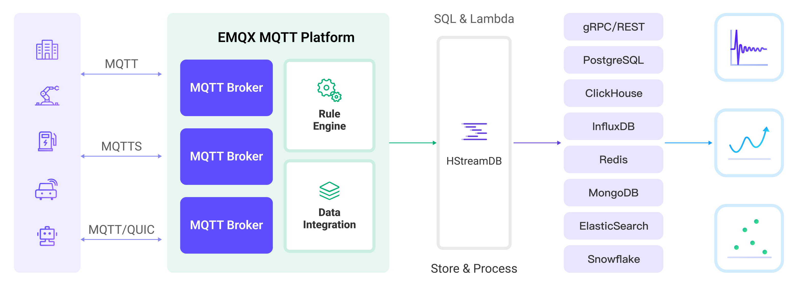

# Stream MQTT Data into HStreamDB

[HStreamDB](https://hstream.io/) は、リアルタイムのメッセージ、イベント、およびその他のデータストリームを効率的に取り込み、保存、処理、配信できるオープンソースのストリーミングデータプラットフォームです。EMQX と HStreamDB の統合により、MQTT メッセージやクライアントイベントを HStreamDB に保存でき、大規模な IoT データの収集、伝送、保存を実現し、標準 SQL やマテリアライズドビューを用いたデータストリームのリアルタイム処理、監視、分析が可能になります。

本ページでは、EMQX と HStreamDB 間のデータ統合について、実践的な手順を交えて包括的に紹介します。

::: tip

HStreamDB データ統合は EMQX 5.2.0 以降でのみサポートされています。

:::

::: tip

HStreamDB データ統合は EMQX 6.0 で削除されます。

:::

## 動作概要

HStreamDB データ統合は EMQX の標準機能であり、EMQX のデバイス接続およびメッセージ伝送機能と、HStreamDB の堅牢なデータ保存・処理機能を組み合わせています。組み込みのルールエンジンコンポーネントにより、両プラットフォーム間のデータストリーミングと処理が簡素化されています。

以下の図は、EMQX と HStreamDB 間のデータ統合の典型的なアーキテクチャを示しています。



EMQX はルールエンジンと設定された Sink を通じて MQTT データを HStreamDB に転送し、全体の流れは以下の通りです。

1. **メッセージのパブリッシュと受信**: IoT デバイスは MQTT プロトコルで正常に接続し、特定のトピックにテレメトリやステータスデータをパブリッシュします。EMQX はこれらのメッセージを受信すると、ルールエンジン内でマッチング処理を開始します。
2. **ルールエンジンによるメッセージ処理**: 組み込みのルールエンジンを用いて、特定のソースからの MQTT メッセージをトピックマッチングに基づき処理します。ルールエンジンは対応するルールにマッチし、データ形式の変換、特定情報のフィルタリング、コンテキスト情報の付加などの処理を行います。
3. **HStreamDB へのデータストリーミング**: ルールはメッセージを HStreamDB に転送するアクションをトリガーし、データは HStreamDB のストリーム名、パーティションキー、レコードに簡単に設定でき、後続のデータ処理や分析を容易にします。

MQTT メッセージデータが Apache HStreamDB に書き込まれた後は、以下のような柔軟なアプリケーション開発が可能です。

- 特定の MQTT メッセージを受信した際に、HStreamDB のルールエンジンコンポーネントを使って対応するアクションやイベントをトリガーし、システム間やアプリケーション間のイベント駆動を実現。
- HStreamDB 内で MQTT データストリームをリアルタイムに分析し、異常検知や特定イベントパターンの検出に基づきアラート通知や対応アクションを実行。
- 複数の MQTT トピックからのデータを統合し、HStreamDB の計算機能を用いてリアルタイム集計や計算、分析を行い、より包括的なデータインサイトを獲得。

## 特長とメリット

HStreamDB とのデータ統合により、以下の特長と利点が得られます。

- **信頼性の高い IoT データメッセージ配信**: EMQX は MQTT メッセージをバッチで確実に HStreamDB に送信でき、IoT デバイスと HStreamDB およびアプリケーションシステムの連携を実現します。
- **MQTT メッセージの変換**: ルールエンジンを利用して、EMQX は MQTT メッセージの抽出、フィルタリング、付加情報の追加、変換を行い、HStreamDB へ送信します。
- **大規模なデータストリーム保存**: HStreamDB は数百万のデータストリームを分散型かつフォールトトレラントなログストレージクラスターで信頼性高く保存し、必要に応じてリアルタイムのデータ更新を再生またはプッシュ可能です。EMQX のメッセージモデルと完全に統合し、大規模な IoT データの収集、伝送、保存を実現します。
- **クラスターとスケーラビリティ**: クラウドネイティブアーキテクチャに基づく EMQX と HStreamDB はオンラインスケールやクラスターの動的な拡張・縮小をサポートし、ビジネスの成長に応じた柔軟な水平スケーリングが可能です。
- **柔軟な処理能力**: HStreamDB では馴染みのある SQL を使って複数のデータストリームのフィルタリング、変換、集計、結合が可能です。標準 SQL とマテリアライズドビューを用いたリアルタイム処理、監視、分析によりリアルタイムのデータインサイトを提供します。
- **高スループットシナリオでの処理能力**: HStreamDB データ統合は同期・非同期の両書き込みモードをサポートし、シナリオに応じてレイテンシとスループットのバランスを柔軟に調整可能です。

## はじめる前に

このセクションでは、HStreamDB データ統合を作成する前に必要な準備、HStreamDB サービスの起動方法やストリームの作成方法について説明します。

以下のサブセクションでは、Linux/MacOS 環境で Docker イメージを使って HStreamDB をインストールし接続する手順を説明します。Docker をインストール済みで、可能であれば Docker Compose v2 を使用してください。その他の HStreamDB および HStreamDB Platform のインストール方法は、[Quickstart with Docker-Compose](https://docs.hstream.io/start/quickstart-with-docker.html) および [Getting Started with HStream Platform](https://docs.hstream.io/start/try-out-hstream-platform.html) を参照してください。

### 前提条件

- EMQX データ統合の [ルール](./rules.md) に関する知識
- [データ統合](./data-bridges.md) に関する知識

### HStreamDB サービスの起動とストリームの作成

::::: tabs

:::: tab HStreamDB TCP サービスの起動とストリーム作成

このセクションでは、ローカルの Docker 環境で単一ノードの HStreamDB TCP サービスを起動し、HStreamDB にストリームを作成する方法を説明します。

::: tip 注意

HStreamDB リソースが接続状態になった後に、ストリームの削除や再作成などの操作を行う場合は、HStreamDB への再接続（HStreamDB リソースの再起動）が必要です。

:::

1. 以下の内容で `docker-compose-tcp.yaml` ファイルを作成します。

   ::: details `docker-compose-tcp.yaml`

   ```yaml
   version: "3.9"

   services:
     hserver:
       image: hstreamdb/hstream:v0.17.0
       container_name: quickstart-tcp-hserver
       depends_on:
         - zookeeper
         - hstore
       ports:
         - "127.0.0.1:6570:6570"
       expose:
         - 6570
       networks:
         - quickstart-tcp
       volumes:
         - /var/run/docker.sock:/var/run/docker.sock
         - /tmp:/tmp
         - data_store:/data/store
       command:
         - bash
         - "-c"
         - |
           set -e
           /usr/local/script/wait-for-storage.sh hstore 6440 zookeeper 2181 600 \
           /usr/local/bin/hstream-server \
           --bind-address 0.0.0.0 --port 6570 \
           --internal-port 6571 \
           --server-id 100 \
           --seed-nodes "$$(hostname -I | awk '{print $$1}'):6571" \
           --advertised-address $$(hostname -I | awk '{print $$1}') \
           --metastore-uri zk://zookeeper:2181 \
           --store-config /data/store/logdevice.conf \
           --store-admin-host hstore --store-admin-port 6440 \
           --store-log-level warning \
           --io-tasks-path /tmp/io/tasks \
           --io-tasks-network quickstart-tcp

     hstore:
       image: hstreamdb/hstream:v0.17.0
       container_name: quickstart-tcp-hstore
       networks:
         - quickstart-tcp
       volumes:
         - data_store:/data/store
       command:
         - bash
         - "-c"
         - |
           set -ex
           # N.B. "enable-dscp-reflection=false" is required for linux kernel which
           # doesn't support dscp reflection, e.g. centos7.
           /usr/local/bin/ld-dev-cluster --root /data/store \
           --use-tcp --tcp-host $$(hostname -I | awk '{print $$1}') \
           --user-admin-port 6440 \
           --param enable-dscp-reflection=false \
           --no-interactive

     zookeeper:
       image: zookeeper:3.8.1
       container_name: quickstart-tcp-zk
       expose:
         - 2181
       networks:
         - quickstart-tcp
       volumes:
         - data_zk_data:/data
         - data_zk_datalog:/datalog

   networks:
     quickstart-tcp:
       name: quickstart-tcp

   volumes:
     data_store:
       name: quickstart_tcp_data_store
     data_zk_data:
       name: quickstart_tcp_data_zk_data
     data_zk_datalog:
       name: quickstart_tcp_data_zk_datalog
   ```

   :::

2. 以下のシェルコマンドを実行して HStreamDB TCP サービスを起動します。

   ```bash
   docker compose -f docker-compose-tcp.yaml up --build
   ```

3. HStream コンテナに入り、`mqtt_connect` と `mqtt_message` という名前のストリームを2つ作成します。

   ::: tip

   HStreamDB の対話型 SQL CLI を使ってストリームを作成することも可能です。`hstream --help` で `hstream` コマンドの使い方を確認してください。

   :::

   ```bash
   $ docker container exec -it quickstart-tcp-hserver bash
   # Stream `mqtt_connect` を作成
   root@9c7ce2f51860:/# hstream stream create mqtt_connect
   +--------------+---------+----------------+-------------+
   | Stream Name  | Replica | Retention Time | Shard Count |
   +--------------+---------+----------------+-------------+
   | mqtt_connect | 1       | 604800 seconds | 1           |
   +--------------+---------+----------------+-------------+
   # Stream `mqtt_message` を作成
   root@9c7ce2f51860:/# hstream stream create mqtt_message
   +--------------+---------+----------------+-------------+
   | Stream Name  | Replica | Retention Time | Shard Count |
   +--------------+---------+----------------+-------------+
   | mqtt_message | 1       | 604800 seconds | 1           |
   +--------------+---------+----------------+-------------+
   # 全ストリーム一覧を表示
   root@9c7ce2f51860:/# hstream stream list
   +--------------+---------+----------------+-------------+
   | Stream Name  | Replica | Retention Time | Shard Count |
   +--------------+---------+----------------+-------------+
   | mqtt_message | 1       | 604800 seconds | 1           |
   +--------------+---------+----------------+-------------+
   | mqtt_connect | 1       | 604800 seconds | 1           |
   +--------------+---------+----------------+-------------+
   ```

::::
:::: tab HStreamDB TLS サービスの起動とストリーム作成

このセクションでは、ローカルの Docker 環境で二ノードの HStreamDB TLS サービスを起動し、HStreamDB にストリームを作成する方法を説明します。

::: tip 注意

HStreamDB リソースが接続状態になった後に、ストリームの削除や再作成などの操作を行う場合は、HStreamDB への再接続（HStreamDB リソースの再起動）が必要です。

:::

::: tip Docker ネットワーク環境と証明書ファイルについて

- この Docker Compose ファイルは `172.100.0.0/24` ネットワークサブネットを Docker ネットワークブリッジとして使用しています。その他のネットワーク構成要件がある場合は、Docker Compose ファイルを適宜修正してください。
- 現バージョンの HStream では、`http_proxy`、`https_proxy`、`all_proxy` などの環境変数をコンテナに設定しないでください。これらの環境変数がコンテナ間通信に影響を与える可能性があります。詳細は [_Docker Network Proxy_](https://docs.docker.com/network/proxy/) を参照してください。
- ルート証明書および自己署名証明書は [_smallstep/step-ca_](https://hub.docker.com/r/smallstep/step-ca) コンテナを使って自動生成され、`172.100.0.10` と `172.100.0.11` の2つのサブジェクト代替名が設定されています。
- その他の証明書要件がある場合は、証明書ファイルを自分で HStreamDB コンテナにマウントするか、[_Configuring step-ca_](https://smallstep.com/docs/step-ca/configuration/index.html) を参照してください。
  - step-ca によるデフォルト設定の証明書は有効期限が1日です。有効期限を変更したい場合は `ca` ディレクトリ内の証明書を削除し、[_step-ca-configuration-options_](https://smallstep.com/docs/step-ca/configuration/#configuration-options) に従って設定を変更してください。

:::

1. 証明書を保存するために `tls-deploy/ca` ディレクトリを作成します。

   ```bash
   mkdir tls-deploy/ca
   ```

2. `tls-deploy` 配下に以下の内容で `docker-compose-tls.yaml` ファイルを作成します。

   ::: details `docker-compose-tls.yaml`

   ```yaml
   version: "3.9"

   services:
     step-ca:
       image: smallstep/step-ca:0.23.0
       container_name: quickstart-tls-step-ca
       networks:
         - quickstart-tls
       volumes:
         - ${step_ca}:/home/step
       environment:
         - DOCKER_STEPCA_INIT_NAME=HStream
         - DOCKER_STEPCA_INIT_DNS_NAMES=step-ca

     generate-hstream-cert:
       image: smallstep/step-ca:0.23.0
       container_name: quickstart-tls-generate-hstream-cert
       depends_on:
         step-ca:
           condition: service_healthy
       networks:
         - quickstart-tls
       volumes:
         - ${step_ca}:/home/step
       command:
         - bash
         - "-c"
         - |
           sleep 1
           if [ -f hstream.crt ]; then exit 0; fi
           step ca certificate "hstream" hstream.crt hstream.key \
           --provisioner-password-file secrets/password --ca-url https://step-ca:9000 \
           --root certs/root_ca.crt \
           --san localhost \
           --san 127.0.0.1 \
           --san 172.100.0.10 \
           --san 172.100.0.11 \
           --san quickstart-tls-hserver-0 \
           --san quickstart-tls-hserver-1

     hserver0:
       image: hstreamdb/hstream:v0.17.0
       container_name: quickstart-tls-hserver-0
       depends_on:
         - generate-hstream-cert
         - zookeeper
         - hstore
       ports:
         - "127.0.0.1:6570:6570"
       networks:
         quickstart-tls:
           ipv4_address: 172.100.0.10
       volumes:
         - /var/run/docker.sock:/var/run/docker.sock
         - /tmp:/tmp
         - data_store:/data/store
         - ${step_ca}:/data/server
       command:
         - bash
         - "-c"
         - |
           set -e
           /usr/local/script/wait-for-storage.sh hstore 6440 zookeeper 2181 600; \
           timeout=60; \
           until ( \
              [ -f /data/server/hstream.crt ] && [ -f /data/server/hstream.key ] \
           ) >/dev/null 2>&1; do
               >&2 echo 'Waiting for tls files ...'
               sleep 1
               timeout=$$((timeout - 1))
               [ $$timeout -le 0 ] && echo 'Timeout!' && exit 1;
           done; \
           /usr/local/bin/hstream-server \
           --bind-address 0.0.0.0 --port 26570 \
           --internal-port 6571 \
           --server-id 100 \
           --seed-nodes "hserver0:6571,hserver1:6573" \
           --advertised-address $$(hostname -I | awk '{print $$1}') \
           --metastore-uri zk://zookeeper:2181 \
           --store-config /data/store/logdevice.conf \
           --store-admin-host hstore --store-admin-port 6440 \
           --io-tasks-path /tmp/io/tasks \
           --io-tasks-network quickstart-tls \
           --tls-cert-path /data/server/hstream.crt \
           --tls-key-path /data/server/hstream.key \
           --advertised-listeners l1:hstream://172.100.0.10:6570 \
           --listeners-security-protocol-map l1:tls

           # NOTE:
           # advertised-listeners ip addr should same as container addr for tls listener

     hserver1:
       image: hstreamdb/hstream:v0.17.0
       container_name: quickstart-tls-hserver-1
       depends_on:
         - zookeeper
         - hstore
       ports:
         - "127.0.0.1:6572:6572"
       expose:
         - 6572
         - 26572
       networks:
         quickstart-tls:
           ipv4_address: 172.100.0.11
       volumes:
         - /var/run/docker.sock:/var/run/docker.sock
         - /tmp:/tmp
         - data_store:/data/store
         - ${step_ca}:/data/server
       command:
         - bash
         - "-c"
         - |
           set -e
           /usr/local/script/wait-for-storage.sh hstore 6440 zookeeper 2181 600; \
           timeout=60; \
           until ( \
              [ -f /data/server/hstream.crt ] && [ -f /data/server/hstream.key ] \
           ) >/dev/null 2>&1; do
               >&2 echo 'Waiting for tls files ...'
               sleep 1
               timeout=$$((timeout - 1))
               [ $$timeout -le 0 ] && echo 'Timeout!' && exit 1;
           done; \
           /usr/local/bin/hstream-server \
           --bind-address 0.0.0.0 --port 26572 \
           --internal-port 6573 \
           --server-id 101 \
           --seed-nodes "hserver0:6571,hserver1:6573" \
           --advertised-address $$(hostname -I | awk '{print $$1}') \
           --metastore-uri zk://zookeeper:2181 \
           --store-config /data/store/logdevice.conf \
           --store-admin-host hstore --store-admin-port 6440 \
           --io-tasks-path /tmp/io/tasks \
           --io-tasks-network quickstart-tls \
           --tls-cert-path /data/server/hstream.crt \
           --tls-key-path /data/server/hstream.key \
           --advertised-listeners l1:hstream://172.100.0.11:6572 \
           --listeners-security-protocol-map l1:tls

           # NOTE:
           # advertised-listeners ip addr should same as container addr for tls listener

     hserver-init:
       image: hstreamdb/hstream:v0.17.0
       container_name: quickstart-tls-hserver-init
       depends_on:
         - hserver0
         - hserver1
       networks:
         - quickstart-tls
       command:
         - bash
         - "-c"
         - |
           timeout=60
           until ( \
               /usr/local/bin/hadmin server --host 172.100.0.10 --port 26570 status && \
               /usr/local/bin/hadmin server --host 172.100.0.11 --port 26572 status \
           ) >/dev/null 2>&1; do
               >&2 echo 'Waiting for servers ...'
               sleep 1
               timeout=$$((timeout - 1))
               [ $$timeout -le 0 ] && echo 'Timeout!' && exit 1;
           done; \
           /usr/local/bin/hadmin server --host hserver0 --port 26570 init

     hstore:
       image: hstreamdb/hstream:v0.17.0
       container_name: quickstart-tls-hstore
       networks:
         - quickstart-tls
       volumes:
         - data_store:/data/store
       command:
         - bash
         - "-c"
         - |
           set -ex
           /usr/local/bin/ld-dev-cluster --root /data/store \
           --use-tcp --tcp-host $$(hostname -I | awk '{print $$1}') \
           --user-admin-port 6440 \
           --no-interactive

     zookeeper:
       image: zookeeper:3.8.1
       container_name: quickstart-tls-zk
       expose:
         - 2181
       networks:
         - quickstart-tls
       volumes:
         - data_zk_data:/data
         - data_zk_datalog:/datalog

   networks:
     quickstart-tls:
       ipam:
         driver: default
         config:
           - subnet: "172.100.0.0/24"
       name: quickstart-tls

   volumes:
     data_store:
       name: quickstart_tls_data_store
     data_zk_data:
       name: quickstart_tls_data_zk_data
     data_zk_datalog:
       name: quickstart_tls_data_zk_datalog
   ```

   :::

   これでディレクトリ構成は以下のようになります。

   ```bash
   $ tree tls-deploy
   tls-deploy
   ├── ca
   └── docker-compose-tls.yaml

   2 directories, 1 file
   ```

3. `tls-deploy` ディレクトリに移動し、以下のシェルコマンドを実行して HStreamDB TLS サービスを起動します。

   ```bash
   env step_ca=$PWD/ca docker compose -f docker-compose-tls.yaml up --build
   ```

4. HStreamDB コンテナに入り、`mqtt_connect` と `mqtt_message` という名前のストリームを2つ作成します。

   :::tip TLS 接続コマンドオプションについて

   HStreamDB TCP サービスと同様に、コマンドラインに `--tls-ca [CA_PATH]` オプションを追加するだけで接続可能です。ノード `quickstart-tls-hserver-1` でコマンドを実行する場合は、docker-compose ファイルで指定されたポートと一致させるために `--port 6572` オプションを追加してください。

   :::

   ```bash
   $ docker container exec -it quickstart-tls-hserver-0 bash
   # Stream `mqtt_connect` を作成
   root@75c9351cbb38:/# hstream --tls-ca /data/server/certs/root_ca.crt stream create mqtt_connect
   +--------------+---------+----------------+-------------+
   | Stream Name  | Replica | Retention Time | Shard Count |
   +--------------+---------+----------------+-------------+
   | mqtt_connect | 1       | 604800 seconds | 1           |
   +--------------+---------+----------------+-------------+
   # Stream `mqtt_message` を作成
   root@75c9351cbb38:/# hstream --tls-ca /data/server/certs/root_ca.crt stream create mqtt_message
   +--------------+---------+----------------+-------------+
   | Stream Name  | Replica | Retention Time | Shard Count |
   +--------------+---------+----------------+-------------+
   | mqtt_message | 1       | 604800 seconds | 1           |
   +--------------+---------+----------------+-------------+
   # 全ストリーム一覧を表示
   root@75c9351cbb38:/# hstream --tls-ca /data/server/certs/root_ca.crt stream list
   +--------------+---------+----------------+-------------+
   | Stream Name  | Replica | Retention Time | Shard Count |
   +--------------+---------+----------------+-------------+
   | mqtt_message | 1       | 604800 seconds | 1           |
   +--------------+---------+----------------+-------------+
   | mqtt_connect | 1       | 604800 seconds | 1           |
   +--------------+---------+----------------+-------------+
   ```

::::
:::::

## コネクターの作成

このセクションでは、Sink を HStreamDB サーバーに接続するためのコネクターを作成する方法を説明します。

以下の手順は、EMQX と HStreamDB をローカルマシンで実行していることを前提としています。リモート環境で実行している場合は設定を適宜調整してください。

1. EMQX ダッシュボードにログインし、**Integration** -> **Connectors** をクリックします。
2. 画面右上の **Create** をクリックします。
3. **Create Connector** ページで **HStreamDB** を選択し、**Next** をクリックします。
4. **Configuration** ステップで以下の情報を設定します（アスタリスク付きは必須項目です）：
   - **Connector name**: コネクター名を入力します。英数字の組み合わせで、例: `my_hstreamdb`
   - **HStreamDB Server URL**: `hstream://127.0.0.1:6570` または実際の HStreamDB のアドレスとポートを指定します。
     - スキームは `http`、`https`、`hstream`、`hstreams` をサポートします。
     - TLS 接続の場合はスキームを `hstreams` または `https` にします。例: `hstreams://127.0.0.1:6570`
   - **HStreamDB Stream Name**: 事前に作成したストリーム名を入力します。
     - クライアントメッセージ保存用は `mqtt_message`
     - イベント記録用は `mqtt_connect`
   - **HStreamDB Partition Key**: HStreamDB のパーティションやノード内でデータの格納先を決定するためのパーティションキーを指定します。例として `${topic}` を入力すると、同一トピックのメッセージが順序を保って書き込まれます。未指定の場合はデフォルトキーが使用され、データはデフォルトのシャードにマッピングされます。
   - **HStreamDB gRPC Timeout**: gRPC リクエストに対して HStreamDB サーバーからの応答を待つ最大時間（秒）を指定します。デフォルトは `30` 秒です。
   - **Enable TLS**: 必要に応じて TLS 接続を有効にできます。有効化した場合は **TLS Verify** を無効にしてください。`tls-deploy/ca` ディレクトリ内で生成した証明書とキーをアップロードします。
     - `ca/hstream.crt` を **TLS Cert** にアップロード
     - `ca/hstream.key` を **TLS Key** にアップロード
     - `ca/certs/root_ca.crt` を **CA Cert** にアップロード
5. 詳細設定（任意）：[Sink の機能](./data-bridges.md#features-of-sink)を参照してください。
6. **Create** をクリックする前に、**Test Connectivity** をクリックしてコネクターが HStreamDB サーバーに接続できるかテストできます。
7. 画面下部の **Create** ボタンをクリックしてコネクターの作成を完了します。ポップアップダイアログで **Back to Connector List** をクリックするか、**Create Rule** をクリックして Sink を使ったルール作成に進めます。詳細は [メッセージ保存用 HStreamDB Sink を使ったルール作成](#create-a-rule-with-hstreamdb-sink-for-message-storage) および [イベント記録用 HStreamDB Sink を使ったルール作成](#create-a-rule-with-hstreamdb-sink-for-events-recording) を参照してください。

## メッセージ保存用 HStreamDB Sink を使ったルール作成

このセクションでは、ダッシュボードでソース MQTT トピック `t/#` からメッセージを処理し、処理済みデータを設定した Sink 経由で HStreamDB ストリーム `mqtt_message` に書き込むルールを作成する方法を説明します。

1. EMQX ダッシュボードで **Integration** -> **Rules** をクリックします。

2. 画面右上の **Create** をクリックします。

3. ルール ID に `my_rule` と入力し、**SQL Editor** に以下のステートメントを設定します。これはトピック `t/#` 以下の MQTT メッセージを HStreamDB に保存することを意味します。

   注意：独自の SQL 文を指定する場合は、Sink が必要とするすべてのフィールドを `SELECT` 部分に含めてください。

   ```sql
   SELECT
     *
   FROM
     "t/#"
   ```

   ::: tip

   初心者の方は **SQL Examples** と **Enable Test** をクリックして SQL ルールを学習・テストできます。

   :::

4. + **Add Action** ボタンをクリックし、ルールがトリガーするアクションを定義します。このアクションにより、EMQX はルールで処理したデータを HStreamDB に送信します。

5. **Type of Action** ドロップダウンリストから `HStreamDB` を選択します。**Action** はデフォルトの `Create Action` のままにします。既に作成済みの Sink があれば選択可能ですが、この例では新規 Sink を作成します。

6. Sink の名前を入力します。英数字の組み合わせで指定してください。

7. **Connector** ドロップダウンから先ほど作成した `my_hstreamdb` を選択します。新規コネクターを作成する場合はドロップダウン横のボタンをクリックします。設定パラメータは [コネクターの作成](#create-a-connector) を参照してください。

8. メッセージを特定トピックに転送するための **HStream Record Template** を以下のテンプレートで設定します。

   ```json
   {"id": ${id}, "topic": "${topic}", "qos": ${qos}, "payload": "${payload}"}
   ```

9. **フォールバックアクション（任意）**: メッセージ配信失敗時の信頼性向上のため、1つ以上のフォールバックアクションを定義できます。詳細は [フォールバックアクション](./data-bridges.md#fallback-actions) を参照してください。

10. **詳細設定（任意）**: 必要に応じて **sync** または **async** クエリモードを選択します。詳細は [Sink の機能](./data-bridges.md#features-of-sink) を参照してください。

11. **Create** をクリックする前に、**Test Connectivity** をクリックして Sink が HStreamDB サーバーに接続できるかテストします。

12. **Create** ボタンをクリックして Sink の設定を完了します。新しい Sink が **Action Outputs** に追加されます。

13. **Create Rule** ページに戻り、設定内容を確認して **Create** をクリックしルールを生成します。

これで、HStreamDB Sink を通じてデータ転送およびオンライン／オフライン状態の記録を行うルールが正常に作成されました。**Integration** -> **Rules** ページで新規ルールを確認でき、**Actions(Sink)** タブで新しい HStreamDB Sink を確認できます。

また、**Integration** -> **Flow Designer** を開くとトポロジーが表示され、トピック `t/#` 以下のメッセージがルール `my_rule` によって解析され HStreamDB に送信・保存されている様子が確認できます。

## イベント記録用 HStreamDB Sink を使ったルール作成

このセクションでは、クライアントのオンライン／オフライン状態を記録し、イベントデータを設定した Sink 経由で HStreamDB ストリーム `mqtt_connect` に書き込むルールの作成方法を説明します。

ルール作成手順は [メッセージ保存用 HStreamDB Sink を使ったルール作成](#メッセージ保存用-hstreamdb-sink-を使ったルール作成) とほぼ同様で、SQL ルール文とストリームレコードテンプレートが異なります。

オンライン／オフライン状態記録用の SQL ルール文は以下の通りです。

```sql
SELECT
  *
FROM
  "$events/client_connected", "$events/client_disconnected"
```

Sink の **Stream Record Template** は以下の通りです。

```sql
{"clientid": "${clientid}", "event_type": "${event}", "event_time": ${timestamp}}
```

## ルールのテスト

MQTTX を使ってトピック `t/1` にメッセージを送信し、オンライン／オフラインイベントをトリガーします。

```bash
mqttx pub -i emqx_c -t t/1 -m '{ "msg": "Hello HStreamDB" }'
```

2つの Sink の動作状況を確認します。

- メッセージ保存用 Sink では、新しい受信メッセージと送信メッセージがそれぞれ1件ずつあるはずです。ストリーム `mqtt_message` にデータが書き込まれているか確認します。

```bash
# ストリーム `mqtt_message` の読み取りを Ctrl-C で停止
root@9c7ce2f51860:/# hstream stream read-stream mqtt_message
timestamp: "1693903488278", id: 1947758763121538-8589934593-0, key: "", record: {"id": 00060498A3B3C4F8F4400100127E0002, "topic": "t/1", "qos": 0, "payload": { "msg": "Hello HStreamDB" }}
^CRead Done.
```

- オンライン／オフライン状態記録用 Sink では、クライアント接続と切断のイベントがそれぞれ2件記録されているはずです。ストリーム `mqtt_connect` に状態記録が書き込まれているか確認します。

```bash
# ストリーム `mqtt_connect` の読み取りを Ctrl-C で停止
root@9c7ce2f51860:/# hstream stream read-stream mqtt_connect
timestamp: "1693903488274", id: 1947758827604597-8589934593-0, key: "", record: {"clientid": "emqx_c", "event_type": "client.connected", "event_time": 1693903488266}
timestamp: "1693903488294", id: 1947758827604597-8589934594-0, key: "", record: {"clientid": "emqx_c", "event_type": "client.disconnected", "event_time": 1693903488271}
^CRead Done.
```
