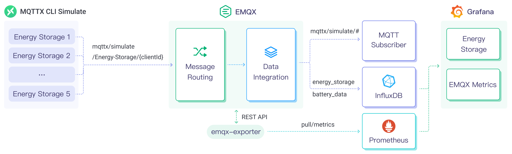

# InfluxDBへのMQTTデータ取り込み

[InfluxDB](https://www.influxdata.com/) は時系列データの保存と解析に特化したデータベースです。高いデータスループット性能と安定した動作により、IoT（モノのインターネット）分野での利用に非常に適しています。EMQXは現在、InfluxDB Cloud、InfluxDB OSS、InfluxDB Enterpriseの主流バージョンとの接続をサポートしています。

本ページでは、EMQXとInfluxDB間のデータ統合について包括的に紹介し、データ統合の作成および検証に関する実践的な手順を提供します。

## 動作概要

InfluxDBデータ統合はEMQXの標準機能であり、EMQXのリアルタイムデータキャプチャおよび転送機能とInfluxDBのデータ保存・解析機能を組み合わせています。組み込みの[ルールエンジン](./rules.md)コンポーネントにより、EMQXからInfluxDBへのデータ取り込みを簡素化し、複雑なコーディングを不要にしています。EMQXはルールエンジンとSinkを介してデバイスデータをInfluxDBに転送し保存・解析を行います。InfluxDBは解析結果をレポートやチャートなどの形で生成し、InfluxDBの可視化ツールを通じてユーザーに提供します。

以下の図は、エネルギー蓄電シナリオにおけるEMQXとInfluxDBの典型的なデータ統合アーキテクチャを示しています。



EMQXとInfluxDBは、エネルギー消費データをリアルタイムに効率的に収集・解析するための拡張可能なIoTプラットフォームを提供します。このアーキテクチャでは、EMQXがデバイスの接続管理、メッセージ転送、データルーティングを担うIoTプラットフォームとして機能し、InfluxDBがデータ保存および解析プラットフォームとして役割を果たします。ワークフローは以下の通りです：

1. **メッセージのパブリッシュと受信**：蓄電デバイスや産業用IoTデバイスはMQTTプロトコルを通じてEMQXに接続し、電力消費量、入出力電力などのエネルギーデータを定期的にパブリッシュします。EMQXはこれらのメッセージを受信すると、ルールエンジン内でマッチング処理を開始します。
2. **メッセージデータ処理**：組み込みのルールエンジンを用いて、特定のトピックにマッチしたメッセージを処理します。メッセージはルールエンジンを通過し、対応するルールとマッチングされ、データ形式の変換、特定情報のフィルタリング、コンテキスト情報の付加などの処理が行われます。
3. **InfluxDBへのデータ取り込み**：ルールエンジンで定義されたルールがトリガーとなり、メッセージをInfluxDBに書き込む操作が実行されます。InfluxDB SinkはLine Protocolテンプレートを提供し、メッセージの特定フィールドをInfluxDBの対応するmeasurementやfieldに柔軟にマッピング可能です。

エネルギー消費データがInfluxDBに書き込まれた後は、Line Protocolを活用して柔軟にデータ解析が可能です。例えば：

- Grafanaなどの可視化ツールと連携し、エネルギーデータのチャートを生成して表示する。
- 業務システムと連携し、蓄電デバイスの状態監視やアラート通知を行う。

## 特長と利点

InfluxDBデータ統合は以下の特長と利点を提供します：

- **効率的なデータ処理**：EMQXは大量のIoTデバイス接続とメッセージスループットを処理可能であり、InfluxDBは高速なデータ書き込み、保存、クエリ性能を備えています。これにより、IoTシナリオのデータ処理要件をシステムに過度な負荷をかけずに満たします。
- **メッセージ変換**：EMQXのルールを用いて、InfluxDBに書き込む前にメッセージを多様に処理・変換可能です。
- **スケーラビリティ**：EMQXとInfluxDBはともにクラスター拡張に対応しており、ビジネスの成長に応じて柔軟に水平拡張できます。
- **豊富なクエリ機能**：InfluxDBは最適化された関数、演算子、インデックス技術を提供し、時系列データの効率的なクエリと解析を実現し、IoTデータから価値あるインサイトを抽出します。
- **効率的なストレージ**：InfluxDBは高圧縮率のエンコード方式を採用し、ストレージコストを大幅に削減します。また、データ種別ごとに保存期間をカスタマイズ可能で、不要なデータによるストレージ占有を防ぎます。

## はじめる前に

本節では、InfluxDBデータ統合の作成に先立ち必要な準備、特にInfluxDBのインストールとセットアップについて説明します。

### 前提条件

- EMQXがInfluxDBにデータを書き込む際に従う[InfluxDB Line Protocol](https://docs.influxdata.com/influxdb/v2.5/reference/syntax/line-protocol/)の知識
- EMQXデータ統合の[ルール](./rules.md)に関する知識
- [データ統合](./data-bridges.md)に関する知識

### InfluxDBのインストールとセットアップ

1. Dockerを使って[InfluxDBをインストール](https://docs.influxdata.com/influxdb/v2.5/install/)し、Dockerイメージを起動します。

```bash
# InfluxDB Dockerイメージを起動するコマンド
docker run --name influxdb -p 8086:8086 influxdb:2.5.1
```

2. InfluxDBが起動したら、ブラウザで [http://localhost:8086](http://localhost:8086) にアクセスし、**Username**、**Password**、**Organization Name**、**Bucket Name** を設定します。
3. InfluxDBのUIで **Load Data** -> **API Token** をクリックし、[全権限トークンの作成](https://docs.influxdata.com/influxdb/v2/install/#create-all-access-tokens)手順に従います。

## コネクターの作成

この節では、SinkをInfluxDBサーバーに接続するためのコネクター作成方法を説明します。

以下の手順はEMQXとInfluxDBをローカルマシンで実行していることを前提としています。リモートで実行している場合は設定を適宜調整してください。

1. EMQXダッシュボードに入り、**Integration** -> **Connectors** をクリックします。

2. ページ右上の **Create** をクリックします。

3. **Create Connector** ページで **InfluxDB** を選択し、**Next** をクリックします。

4. **Configuration** ステップで以下の情報を設定します：

   以下の設定はすべてのInfluxDBバージョン共通です：

   - **Connector Name**：コネクターの一意の名前。英数字のみで、例：`my_influxdb`
   - **Description**（任意）：コネクターの簡単な説明
   - **Server Host**：InfluxDBサーバーのアドレス。例：`127.0.0.1:8086`。InfluxDB Cloudを利用する場合はポート`443`（例：`{url}:443`）を指定し、TLSを有効にしてください。
   - **Version of InfluxDB**：利用するInfluxDBのバージョンを選択。`v1`、`v2`（デフォルト）、`v3`がサポートされています。
   - **Enable TLS**：InfluxDBサーバーがTLS接続を要求する場合に有効化します。詳細は[外部リソースアクセスのTLS有効化](../../guides/network/overview.md#enabling-tls-for-external-resource-access)を参照してください。

   選択したInfluxDBバージョンにより必須設定項目が異なります。以下の表を参照し、[InfluxDBのインストールとセットアップ](#install-and-set-up-influxdb)の設定と一致させてください。

   | 設定項目             | InfluxDB v1           | InfluxDB v2 | InfluxDB v3 |
   | -------------------- | --------------------- | ----------- | ----------- |
   | 認証方式             | ユーザー名 / パスワード | トークン     | トークン     |
   | **トークン**          | -                     | 必須        | 必須        |
   | **ユーザー名**        | 任意                  | -           | -           |
   | **パスワード**        | 任意                  | -           | -           |
   | **組織名**            | -                     | 必須        | -           |
   | **バケット**          | -                     | 必須        | -           |
   | **データベース名**    | 必須                  | -           | 必須        |

   注意：

   - **InfluxDB v1**では、EMQXは指定したデータベースに直接書き込み、ユーザー名/パスワード認証は任意です。
   - **InfluxDB v2**では、組織とバケットモデルを使用し、トークンは指定バケットへの書き込み権限を持つ必要があります。
   - **InfluxDB v3**では、v1に似たデータベースベースのモデルを使用しますが、トークン認証を採用しています。

5. **Create**をクリックする前に、**Test Connectivity**をクリックしてEMQXがInfluxDBサーバーに正常に接続できるか確認できます。

6. **Create**をクリックしてコネクター作成を完了します。

コネクター作成後、**Back to Connector List**を選択するか、**Create Rule**をクリックしてMQTTデータをInfluxDBに転送するルールとSinkを定義できます。詳細は[InfluxDB Sinkを使ったルールの作成](#create-a-rule-with-influxdb-sink)を参照してください。

## InfluxDB Sinkを使ったルールの作成

この節では、EMQXでMQTTトピック `t/#` のメッセージを処理し、設定済みのSinkを通じてInfluxDBに送信するルールの作成方法を説明します。

1. EMQXダッシュボードにアクセスし、左ナビゲーションメニューから **Integration** -> **Rules** をクリックします。

2. ページ右上の **Create** をクリックします。

3. ルール作成ページで、ルールIDに `my_rule` を入力します。

4. **SQL Editor** にルールを設定します。例えば、トピック `t/#` のMQTTメッセージをInfluxDBに保存したい場合、以下のSQLを使用できます。

   ::: tip

   独自のSQL構文を指定する場合は、後で設定するSinkのデータフォーマットに含まれるすべての変数が `SELECT` 部分に含まれていることを確認してください。

   :::

   ```sql
   SELECT
     *
   FROM
     "t/#"
   ```

   注：初心者の方は **SQL Examples** と **Enable Test** をクリックしてSQLルールの学習とテストが可能です。

5. + **Add Action** ボタンをクリックし、ルールがトリガーするアクションを定義します。このアクションにより、EMQXはルールで処理したデータをInfluxDBに送信します。

6. **Type of Action** ドロップダウンリストから `InfluxDB` を選択します。**Action** ドロップダウンはデフォルトの `Create Action` のままにします。既に作成済みのSinkがあれば選択可能です。この例では新しいSinkを作成します。

7. Sinkの名前を入力します。名前は英数字の大文字・小文字を組み合わせてください。

8. **Connector** ドロップダウンから先ほど作成した `my_influxdb` を選択します。新しいコネクターを作成する場合はドロップダウン横のボタンをクリックしてください。設定パラメータは[コネクターの作成](#create-a-connector)を参照してください。

9. **Time Precision** を指定します。デフォルトは `millisecond` です。

10. **Data Format** を `JSON` または `Line Protocol` から選択し、InfluxDBへのデータ解析・書き込み形式を指定します。

    - JSON形式の場合、**Measurement**、**Timestamp**、**Fields**、**Tags** の解析方法を定義します。すべてのキー値は変数やプレースホルダーにできます。また[InfluxDB Line Protocol](https://docs.influxdata.com/influxdb/v2.5/reference/syntax/line-protocol/)に従って設定可能です。**Fields** はCSVファイルによる一括設定もサポートしています。詳細は[一括設定](#batch-setting)を参照してください。
    - Line Protocol形式の場合、InfluxDB Line Protocolの構文に準拠したテキスト形式で、measurement、タグセット、フィールドセット、タイムスタンプを指定し、プレースホルダーも利用可能です。

    ::: tip

    - InfluxDB 1.xまたは2.xに符号付き整数型の値を書き込む場合は、プレースホルダーの後に `i` を付けます。例：`${payload.int}i`。詳細は[InfluxDB 1.8で整数値を書き込む方法](https://docs.influxdata.com/influxdb/v1.8/write_protocols/line_protocol_reference/#write-the-field-value-1-as-an-integer-to-influxdb)を参照してください。
    - 符号なし整数型の値を書き込む場合は、プレースホルダーの後に `u` を付けます。例：`${payload.int}u`。詳細は同上リンクを参照してください。

    :::

11. **フォールバックアクション（任意）**：メッセージ配信失敗時の信頼性向上のため、1つ以上のフォールバックアクションを定義できます。これらはプライマリSinkの処理失敗時にトリガーされます。詳細は[フォールバックアクション](./data-bridges.md#fallback-actions)を参照してください。

12. **詳細設定（任意）**：詳細は[高度な設定](#advanced-configurations)を参照してください。

13. **Create**をクリックする前に、**Test Connectivity**をクリックしてSinkがInfluxDBサーバーに接続可能かテストできます。

14. **Create**をクリックしてSink作成を完了します。ルール作成ページの**Action Outputs**タブに新しいSinkが表示されます。

15. ルール作成ページで設定内容を確認し、**Create**ボタンをクリックしてルールを生成します。

これでルールが作成され、**Rules**ページに新しいルールが表示されます。**Actions(Sink)**タブをクリックすると、新しいInfluxDB Sinkが確認できます。

また、**Integration** -> **Flow Designer**をクリックするとトポロジーが表示され、トピック `t/#` のメッセージがルール `my_rule` によって解析されInfluxDBに送信・保存されている様子が確認できます。

### 一括設定

InfluxDBのデータエントリーは通常数百のフィールドを含むため、データフォーマットの設定は複雑になりがちです。これを解決するため、EMQXはフィールドの一括設定機能を提供しています。

JSON形式でデータフォーマットを設定する際、CSVファイルからフィールドのキー・バリューを一括インポートできます。

1. **Fields**テーブルの**Batch Setting**ボタンをクリックし、**Import Batch Setting**ポップアップを開きます。

2. 指示に従い、一括設定テンプレートファイルをダウンロードし、テンプレートにフィールドのキー・バリューを記入します。デフォルトのテンプレート内容は以下の通りです：

   | Field  | Value              | 備考（任意）                                               |
   | ------ | ------------------ | ---------------------------------------------------------- |
   | temp   | ${payload.temp}    |                                                            |
   | hum    | ${payload.hum}     |                                                            |
   | precip | ${payload.precip}i | フィールド値の末尾に `i` を付けてInfluxDBに整数として保存 |

   - **Field**：フィールドキー。定数または `${var}` 形式のプレースホルダーをサポート。
   - **Value**：フィールド値。定数またはプレースホルダーをサポートし、Line Protocolに従った型識別子の付加も可能。
   - **備考**：CSV内の注釈用で、EMQXにはインポートされません。

   CSVファイルの一括設定データは2048行を超えないようにしてください。

3. 記入済みテンプレートファイルを保存し、**Import Batch Setting**ポップアップにアップロード後、**Import**をクリックして一括設定を完了します。

4. インポート後、**Fields**設定テーブル内でキー・バリューの微調整が可能です。

## ルールのテスト

MQTTクライアントMQTTXを使い、トピック `t/1` にメッセージを送信してオンライン/オフラインイベントをトリガーします。

```bash
mqttx pub -i emqx_c -t t/1 -m '{ "msg": "hello InfluxDB" }'
```

Sinkの稼働状況を確認すると、1件の新規受信メッセージと1件の新規送信メッセージがあるはずです。

InfluxDBのUIでは、**Data Explorer**ウィンドウを通じてメッセージがInfluxDBに書き込まれているか確認できます。

## 高度な設定

本節では、InfluxDBコネクターおよびSinkの高度な設定オプションについて詳述します。ダッシュボードでコネクターやSinkを設定する際、**Advanced Settings**に移動して以下のパラメータをニーズに合わせて調整してください。

| **項目**               | **説明**                                                                                                                     | **推奨値** |
| ---------------------- | ---------------------------------------------------------------------------------------------------------------------------- | ---------- |
| Start Timeout          | コネクターが自動起動したリソース（例：InfluxDBのデータベースインスタンス）が正常な状態になるまで待機する最大秒数です。この設定により、リソースが完全に稼働しデータ処理可能になるまでコネクターが操作を進めないようにします。 | `5`        |
| Buffer Pool Size       | EMQXとInfluxDB間の送信（egress）タイプのブリッジでデータフローを管理するバッファワーカープロセス数を指定します。これらのワーカーは送信前のデータを一時的に保持し処理します。Ingress（受信）専用のSinkではこの設定は不要で、`0`に設定可能です。 | `4`        |
| Request TTL            | バッファに入ったリクエストが有効とみなされる最大秒数です。TTLを超えてバッファに滞留するか、InfluxDBからの応答やアックが得られない場合、リクエストは期限切れと判断されます。 | `45`       |
| Health Check Interval  | SinkがInfluxDB接続のヘルスチェックを自動的に行う間隔（秒）です。                                                                | `15`       |
| Max Buffer Queue Size  | InfluxDB Sinkの各バッファワーカーがバッファリング可能な最大バイト数です。ワーカーはデータ送信前に一時的にデータを保持し、データフローを効率化します。システム性能やデータ転送要件に応じて調整してください。 | `1`        |
| Max Batch Size         | EMQXからInfluxDBへ一度に送信可能なデータバッチの最大サイズです。サイズを調整することでデータ転送の効率と性能を最適化できます。`1`に設定すると、データはバッチ化せず個別に送信されます。 | `100`      |
| Query Mode             | メッセージ送信の最適化のため、`asynchronous`（非同期）または`synchronous`（同期）モードを選択可能です。非同期モードではInfluxDBへの書き込みがMQTTメッセージパブリッシュ処理をブロックしませんが、InfluxDBへの到達前にクライアントがメッセージを受信する可能性があります。 | `Async`    |
| Inflight Window        | 「インフライトクエリ」とは、開始されたが応答やアックをまだ受け取っていないクエリのことです。SinkがInfluxDBと通信する際に同時に存在可能なインフライトクエリの最大数を制御します。<br/>**Query Mode**が`async`の場合、同一MQTTクライアントからのメッセージを厳密に順序処理したい場合はこの値を1に設定してください。 | `100`      |

## 参考情報

以下のリンクもご参照ください：

**ブログ**：

[1時間で構築するEMQX + InfluxDB + GrafanaによるIoTデータ可視化ソリューション](https://www.emqx.com/en/blog/build-emqx-influxdb-grafana-iot-data-visualization-solution-in-one-hour)

[時系列IoTアプリケーションのためのMQTTデータをInfluxDBに統合](https://www.emqx.com/en/blog/building-an-iot-time-series-data-application-with-mqtt-and-influxdb)

[MQTTパフォーマンスベンチマークテスト：EMQX-InfluxDB統合](https://www.emqx.com/en/blog/mqtt-performance-benchmark-testing-emqx-influxdb-integration)
