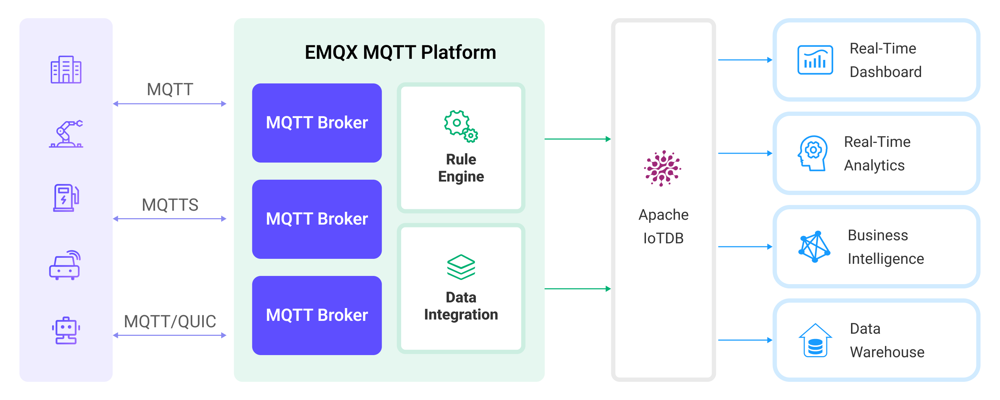

# Apache IoTDBへのMQTTデータ取り込み

[Apache IoTDB](https://iotdb.apache.org/)は、多種多様なIoTデバイスやシステムから生成される膨大な時系列データを効率的に処理するために設計された高性能かつスケーラブルな時系列データベースです。

EMQXはApache IoTDBとのシームレスなデータ統合を提供しており、EMQXがリアルタイムで受信したMQTTメッセージを[REST API V2](https://iotdb.apache.org/UserGuide/latest/API/RestServiceV2.html)経由でIoTDBに転送できます。この統合は一方向のデータフローをサポートし、MQTTデータをIoTDBに書き込むことで効率的な時系列の保存と分析を実現します。

本ページでは、EMQXとApache IoTDBの統合方法を紹介し、統合の作成および検証の手順をステップバイステップで説明します。

## 動作概要

Apache IoTDBデータ統合は、追加のコーディングなしでMQTTベースの時系列データをApache IoTDBに取り込むことができるEMQXの組み込み機能です。EMQXの組み込み[ルールエンジン](./rules.md)を活用することで、データのフィルタリング、変換、転送を簡素化し、IoTDBでの効率的な保存とクエリを可能にします。

以下の図は、EMQXとIoTDB間の典型的なデータ統合アーキテクチャを示しています。<!-- この画像はIoTDB専用に修正が必要です -->



データ統合のワークフローは以下の通りです：

1. **メッセージのパブリッシュと受信**：デバイスはMQTT経由でEMQXに接続し、テレメトリデータ、ステータス更新、イベント情報を含むメッセージをパブリッシュします。ルールエンジンが受信メッセージを評価します。
2. **ルールベースの処理**：定義されたルールにマッチするメッセージが選択され、必要に応じてフィールドのフィルタリング、データ形式の変換、ペイロードの拡充などの変換が適用されます。
3. **データバッファリング**：信頼性向上のため、IoTDBが一時的に利用できない場合はEMQXがメッセージをメモリにバッファします。必要に応じてメモリ圧迫を避けるためにディスクにオフロード可能です。統合またはEMQXノードの再起動時にはバッファデータは保持されません。
4. **IoTDBへのデータ取り込み**：ルールにマッチした場合、EMQXはIoTDB Sinkをトリガーして処理済みデータを転送し、時系列データとしてIoTDBに書き込みます。
5. **データの保存と活用**：IoTDBに保存されたデータは、デバイス監視、資産追跡、予知保全、運用最適化などの下流アプリケーションでクエリや分析に利用できます。

## 特長とメリット

IoTDBとのデータ統合は、効果的なデータ処理と保存を実現するための多彩な特長とメリットを提供します：

- **ノーコードのIoTデータパイプライン**

  組み込みのルールとSinkを利用して、カスタムコードや外部サービスなしでEMQXとApache IoTDB間の完全なMQTT→時系列データパイプラインを構築可能です。

- **MQTTからIoTDBモデルへの柔軟なマッピング**

  TreeモデルとTableモデルの両方をサポートし、デバイスのモデリングやクエリ要件に合った構造でMQTTデータをIoTDBに書き込めます。

- **取り込みと保存の分離**

  EMQXはバースト的かつ高頻度なMQTTトラフィックを吸収し、IoTDBは耐久性のある時系列保存に専念することで、システムの安定性とレジリエンスを向上させます。

- **本番対応のスケーラビリティ**

  デバイス数やデータ量に応じて水平スケール可能で、大規模なIoT、IIoT、エネルギー分野のシナリオに適しています。

- **分析に適した時系列データ**

  IoTDBに書き込まれたデータは直接クエリ、集計、分析できるほか、ビッグデータエンジンと連携して高度な分析や長期的なインサイトを得られます。

## はじめる前に

このセクションでは、EMQXダッシュボードでApache IoTDBデータ統合を作成する前に必要な準備を説明します。

### 前提条件

- EMQXデータ統合の[ルール](./rules.md)に関する知識
- [データ統合](./data-bridges.md)に関する知識

### Apache IoTDBサーバーの起動

ここでは[Docker](https://www.docker.com/)を使ったApache IoTDBサーバーの起動方法を紹介します。IoTDBの設定で`enable_rest_service=true`が有効になっていることを確認してください。

以下のコマンドを実行して、RESTインターフェースが有効なApache IoTDBサーバーを起動します：

```bash
docker run -d --name iotdb-service \
              --hostname iotdb-service \
              -p 6667:6667 \
              -p 18080:18080 \
              -e enable_rest_service=true \
              -e cn_internal_address=iotdb-service \
              -e cn_target_config_node_list=iotdb-service:10710 \
              -e cn_internal_port=10710 \
              -e cn_consensus_port=10720 \
              -e dn_rpc_address=iotdb-service \
              -e dn_internal_address=iotdb-service \
              -e dn_target_config_node_list=iotdb-service:10710 \
              -e dn_mpp_data_exchange_port=10740 \
              -e dn_schema_region_consensus_port=10750 \
              -e dn_data_region_consensus_port=10760 \
              -e dn_rpc_port=6667 \
              apache/iotdb:2.0.5-standalone
```

詳細は[Docker HubのIoTDB実行情報](https://hub.docker.com/r/apache/iotdb)をご覧ください。

### データベースの作成

IoTDBはTreeモデルとTableモデルの2つのデータモデルをサポートしています。データベース作成前に、ConnectorおよびSinkで使用する**SQL Dialect**（TreeまたはTable）を確認し、それに応じたデータベースを作成してください。

- **Treeモデル**の場合はデータベースのみ作成すればよいです。
- **Tableモデル**の場合は、まずデータベースを作成し、その後データ取り込み用のテーブルを作成する必要があります。

詳細な手順はIoTDBユーザーガイドをご参照ください：

- [Treeモデル用のデータベース作成](https://iotdb.apache.org/UserGuide/latest/Basic-Concept/Operate-Metadata_apache.html#_1-1-create-database)
- [Tableモデル用のデータベース作成](https://iotdb.apache.org/UserGuide/latest-Table/Basic-Concept/Database-Management_apache.html#_1-1-create-a-database)
- [Tableモデル用のテーブル作成](https://iotdb.apache.org/UserGuide/latest-Table/Basic-Concept/Table-Management_apache.html#_1-1-create-a-table)

## IoTDBコネクターの作成

Apache IoTDBデータ統合を作成するには、Apache IoTDB SinkとApache IoTDBサーバーを接続するためのコネクターを作成する必要があります。

EMQXはREST APIまたはThriftプロトコルを通じてIoTDBと通信をサポートしています。

1. EMQXダッシュボードで、**Integrations** -> **Connectors** に移動します。

2. 右上の**Create**をクリックします。

3. **Create Connector**ページで**Apache IoTDB**を選択します。

4. コネクターを設定します：

   - **Connector Name**：コネクターの一意な名前を入力します。大文字・小文字の英数字の組み合わせを推奨します。例：`my_iotdb`
   - **Description**：（任意）コネクターの簡単な説明
   - **Driver**：IoTDBへの接続に使用するプロトコルを選択します。
     - `REST API`：IoTDB RESTサービスのエンドポイント（例：`http://localhost:18080`）を**IoTDB REST Service Base URL**に入力します。
     - `Thrift Protocol`：IoTDB Thriftサーバーのアドレスを**Server Host**に入力します。
   - **SQL Dialect**：EMQXがデバイスデータをIoTDBに書き込む際のデータモデルを選択します。
     - `Tree Model`：階層的な時系列パスとしてデータを書き込み、パスベースのデバイス・計測管理に適します。
     - `Table Model`：リレーショナルテーブルにデータを書き込み、デバイスタイプやカテゴリ別の管理に適します。
   - **Database Name**：`Table Model`選択時に接続するデータベース名を指定します。
   - **Username** と **Password**：EMQXがApache IoTDBサーバーに認証するための資格情報を入力します。
   - **IoTDB Version**：Apache IoTDBのバージョンを選択します。
   - **Enable TLS**：Apache IoTDBサーバーへの暗号化接続を有効にします。詳細は[外部リソースアクセスのTLS](../../guides/network/overview.md#tls-for-external-resource-access)を参照してください。
   - 任意のチューニングは[高度な設定](#advanced-configurations)の**Advanced Settings**を参照してください。

5. （任意）**Test Connectivity**をクリックして、コネクターがApache IoTDBサーバーに正常に接続できるか確認します。

6. **Create**をクリックしてコネクターの作成を完了します。

   表示されるダイアログで、**Back to Connector List**または**Create Rule**を選択して、ルールとApache IoTDB Sinkの設定を続行できます。詳細は[ルールとApache IoTDB Sinkの作成](#create-a-rule-and-apache-iotdb-sink)を参照してください。

## Apache IoTDB Sinkを用いたルールの作成

このセクションでは、EMQXでソースMQTTトピック`root/#`からのメッセージを処理し、設定済みのApache IoTDB Sinkを通じて処理結果をApache IoTDBに時系列データとして保存するルールの作成方法を示します。

### SQLを定義したルールの作成

1. EMQXダッシュボードで、**Integration** -> **Rules**に移動します。

2. ページ右上の**Create**をクリックします。

3. ルールIDを入力します。例：`my_rule`

4. **SQL editor**に以下のステートメントを入力し、トピックパターン`root/#`にマッチするMQTTメッセージを転送します：

   ```sql
   SELECT
     *
   FROM
     "root/#"
   ```

   ::: tip

   初心者の方は、**SQL Examples**や**Enable Test**をクリックしてSQLルールの学習やテストが可能です。

   :::

5. 処理結果をIoTDBに書き込むため、ルールにApache IoTDB Sinkを追加します。詳細は[Apache IoTDB Sinkの追加](#add-an-apache-iotdb-sink)を参照してください。

6. **Create Rule**ページで設定内容を確認し、**Save**をクリックしてルールを作成します。

作成されたルールは**Rules**リストに表示されます。**Actions (Sink)**タブをクリックすると、このルールに紐づくIoTDB Sinkを確認できます。

また、**Integrations** -> **Flow Designer**でトポロジーグラフを表示すると、トピック`root/#`からのメッセージが`my_rule`ルールで処理されIoTDBに書き込まれる様子が確認できます。

### Apache IoTDB Sinkの追加

1. 右側の**Add Action**ボタンをクリックして、ルールにマッチした際にトリガーされるアクションを定義します。このアクションは処理済みデータをIoTDBに転送します。

2. **Type of Action**ドロップダウンから`Apache IoTDB`を選択します。**Action**はデフォルトの`Create Action`のままにします。既存のIoTDB Sinkを選択することも可能ですが、本例では新規作成を想定しています。

3. Sinkの名前と説明を入力します。

4. **Connector**ドロップダウンから先ほど作成した`my_iotdb`コネクターを選択します。利用可能なコネクターがない場合は隣のボタンから作成できます。詳細は[IoTDBコネクターの作成](#create-an-iotdb-connector)を参照してください。

5. Sinkの設定を行います：

      * **SQL Dialect**：Apache IoTDB Sinkがデータを書き込む際のSQL方言を選択します。Connectorで選択したSQL Dialectと一致させる必要があります。

        * `Tree Model`：IoTDBの時系列パスとしてデータを書き込みます。各Sinkレコードはデバイスパスに挿入され、計測値はそのデバイス下の個別時系列として書き込まれます。このモデル選択時は**Device ID**フィールドを指定可能です。
        * `Table Model`：IoTDBのリレーショナルテーブルにデータを書き込みます。各Sinkレコードは指定テーブルの行として挿入され、フィールドはテーブルのカラムにマッピングされます。このモデル選択時は**Table**フィールドの指定が必須です。

      * **Device ID**（任意）：IoTDBインスタンスに時系列データを転送・挿入する際のデバイス名として使用する特定のデバイスIDを入力します。

        :::tip

        空欄の場合でも、パブリッシュされたメッセージ内やルール内でデバイスIDを指定可能です。例えば、JSONエンコードされたメッセージに`device_id`フィールドがあれば、その値が出力デバイスIDとなります。ルールエンジンで抽出する場合は以下のようなSQLを使えます：

        ```sql
        SELECT
         payload,
         `my_device` as payload.device_id
        ```

        ただし、このフィールドに固定で設定されたデバイスIDが優先されます。

        :::

      - **Table**：データを書き込むIoTDBのテーブル名を指定します。

      - **Align Timeseries**：デフォルトは無効です。有効にすると、グループ化されたアラインド時系列のタイムスタンプ列がIoTDB内で一度だけ保存され、グループ内の各時系列で重複保存されません。詳細は[Aligned timeseries](https://iotdb.apache.org/UserGuide/V1.1.x/Data-Concept/Data-Model-and-Terminology.html#aligned-timeseries)を参照してください。

      - **Write Data**を設定し、MQTTメッセージからIoTDBデータを生成する方法を指定します。

        **Write Data**セクションでは、必要な数だけ項目を含むテンプレートを定義できます。このテンプレートを用いてMQTTメッセージに適用し、IoTDBデータを生成します。書き込みテンプレートはCSVファイルによる一括設定もサポートしています。詳細は[バッチ設定](#batch-setting)を参照してください。

        例として以下のテンプレートを考えます：

        ::: tip 注意
        
        **Column Category**はSQL Dialectで`Table Model`を選択した場合のみ表示されます。
        
        :::

        | Column Category | Timestamp | Measurement | Data Type | Value    |
        | --------------- | --------- | ----------- | --------- | -------- |
        | field           |           | index       | INT32     | ${index} |
        |                 |           | temperature | FLOAT     | ${temp}  |

        `Timestamp`と`Value`はプレースホルダー構文をサポートし、変数で埋められます。`Timestamp`を省略した場合は、現在のシステム時刻（ミリ秒）が自動的に設定されます。

        例えば、以下のようなMQTTメッセージ構造が考えられます：

          ```json
        {
          "index": "42",
          "temp": "32.67"
          }
          ```

6. **フォールバックアクション**：（任意）メッセージ配信失敗時の信頼性向上のため、1つ以上のフォールバックアクションを定義できます。これらはプライマリSinkがメッセージ処理に失敗した場合にトリガーされます。詳細は[フォールバックアクション](./data-bridges.md#fallback-actions)を参照してください。

7. **高度な設定**：（任意）[高度な設定](#advanced-configurations)を参照してください。

8. （任意）**Test Connectivity**をクリックして、SinkがApache IoTDBサーバーに接続できるかテストします。

### バッチ設定

Apache IoTDBでは、ダッシュボード上で数百件のデータを一括で書き込む設定は困難な場合があります。これに対処するため、EMQXはデータ書き込みのバッチ設定機能を提供しています。

**Write Data**の設定時に、CSVファイルから挿入操作用のフィールドをインポート可能です。

1. **Write Data**テーブルの**Batch Setting**ボタンをクリックし、**Import Batch Setting**ポップアップを開きます。

2. 指示に従ってバッチ設定テンプレートファイルをダウンロードし、テンプレートにデータ書き込み設定を記入します。デフォルトのテンプレート内容は以下の通りです：

   ::: tip 注意

   以下は`Table Model`用のデフォルトテンプレートです。`Tree Model`では**Column Category**列はありません。

   :::

   | Column Category | Timestamp | Measurement | Data Type | Value             | 備考（任意）                                               |
   | --------------- | --------- | ----------- | --------- | ----------------- | ---------------------------------------------------------- |
   | tag             | now       | clientid    | text      | ${clientid}       |                                                            |
   | field           | now       | temp        | float     | ${payload.temp}   | フィールド、値、データ型は必須。データ型はboolean, int32, int64, float, double, textが利用可能 |
   | attribute       | now       | hum         | text      | ${payload.hum}    |                                                            |
   | attribute       | now       | status      | text      | ${payload.status} |                                                            |

   - **Column Category**：カラムのデータモデル。`tag`、`field`、`attribute`がサポートされます。`tag`は文字列である必要があり、`field`または`attribute`が推奨されます。
   - **Timestamp**：`${var}`形式のプレースホルダーをサポートし、タイムスタンプ形式が必要です。以下の特殊文字でシステム時刻を挿入可能です：
     - now：現在のミリ秒タイムスタンプ
     - now_ms：現在のミリ秒タイムスタンプ
     - now_us：現在のマイクロ秒タイムスタンプ
     - now_ns：現在のナノ秒タイムスタンプ
   - **Measurement**：フィールド名
   - **Data Type**：データ型。boolean, int32, int64, float, double, textが選択可能
   - **Value**：書き込むデータ値。定数または`${var}`形式のプレースホルダーをサポートし、データ型と一致する必要があります。
   - **備考**：CSVファイル内のメモ用で、EMQXへのインポート対象外です。

   1MB以下かつ2000行以内のCSVファイルのみサポートされます。

3. 記入したテンプレートファイルを保存し、**Import Batch Setting**ポップアップにアップロード後、**Import**をクリックしてバッチ設定を完了します。

4. インポート後、**Write Data**テーブル内のデータをさらに調整可能です。

## ルールのテスト

EMQXダッシュボードに組み込まれたWebSocketクライアントを使って、Apache IoTDB Sinkとルールをテストできます。

1. ダッシュボード左メニューの**Diagnose** -> **WebSocket Client**をクリックします。

2. 現在のEMQXインスタンスへの接続情報を入力します。

   - ローカルでEMQXを実行している場合はデフォルト値を使用可能です。
   - 認証設定を変更している場合は、ユーザー名とパスワードを入力してください。

3. **Connect**をクリックしてEMQXインスタンスに接続します。

4. 下にスクロールしてパブリッシュエリアを表示し、メッセージにデバイスIDを指定して以下を入力します：

   - **Topic**：`root/sg27`

     :::tip

     トピックが`root`で始まらない場合、自動的に`root`がプレフィックスされます。例えば`test/sg27`にメッセージをパブリッシュすると、デバイス名は`root.test.sg27`になります。ルールとトピックが正しく設定されていることを確認してください。

     :::

   - **Payload**：

     ```json
      {
       "value": "37.6",
       "device_id": "root.sg27"
      }
     ```
     
      ::: tip
     
      `Write Data`テンプレートは以下の通りです：
     
     ```
      now, "temp", float, "${payload.value}"
     ```
     
      :::

   - **QoS**：`2`

7. **Publish**をクリックしてメッセージを送信します。

   Sinkとルールが正常に作成されていれば、メッセージは指定されたApache IoTDBの時系列テーブルにパブリッシュされているはずです。

8. IoTDBのコマンドラインインターフェースでメッセージを確認します。上記のDocker環境の場合、以下のコマンドでサーバーに接続できます：

   ```shell
       $ docker exec -ti iotdb-service /iotdb/sbin/start-cli.sh -h iotdb-service
   ```

9. コンソールで以下を入力します：

   ```sql
   IoTDB> select * from root.sg27
   ```

   以下のようにデータが表示されるはずです：

   ```
   +------------------------+--------------+
   |                    Time|root.sg27.temp|
   +------------------------+--------------+
   |2023-05-05T14:26:44.743Z|          37.6|
   +------------------------+--------------+
   ```

## 高度な設定

このセクションでは、コネクターのパフォーマンス最適化や特定シナリオに応じたカスタマイズのための高度な設定オプションを説明します。コネクター作成時に**Advanced Settings**を展開し、ビジネスニーズに応じて以下の設定を行えます。

| 項目                     | 説明                                                         | 推奨値             |
| ------------------------ | ------------------------------------------------------------ | ------------------ |
| HTTP Pipelining          | サーバーへ連続して応答を待たずに送信できるHTTPリクエスト数を指定します。正の整数値で最大パイプライン数を表します。<br />`1`の場合は従来のリクエスト-レスポンスモデルで、1リクエスト送信後に応答を待ってから次のリクエストを送信します。値が大きいほど複数リクエストをバッチ送信でき、ネットワークリソースの効率的利用と往復時間の削減が可能です。 | `100`              |
| Pool Type                | EMQXとApache IoTDB間の接続管理・分配に用いるアルゴリズム戦略を定義します。<br />`random`は利用可能な接続プールからランダムに接続を選択し、シンプルで均等な分配を提供します。<br />`hash`はハッシュアルゴリズムでリクエストをプール内の接続に一貫してマッピングし、クライアントIDやトピック名に基づくロードバランシングなど決定的な分配が必要な場合に適します。<br />**注意**：適切なプールタイプはユースケースや求める分配特性によります。 | `random`           |
| Connection Pool Size     | Apache IoTDBサービスとの接続プールで維持可能な同時接続数を指定します。システムのスケーラビリティとパフォーマンス管理に役立ちます。<br />**注意**：適切なサイズはシステムリソース、ネットワークレイテンシ、ワークロードに依存します。大きすぎるとリソース枯渇、小さすぎるとスループット制限の原因となります。 | `8`                |
| Connect Timeout          | EMQXがApache IoTDB HTTPサーバーへの接続確立を試みる最大待機時間（秒）を指定します。<br />**注意**：最適なタイムアウト値はシステム性能とリソース利用のバランスに重要で、様々なネットワーク条件でのテストが推奨されます。 | `15`               |
| HTTP Request Max Retries | EMQXとApache IoTDB間の通信でHTTPリクエストが失敗した場合に再試行する最大回数を指定します。 | `2`                |
| Start Timeout            | 自動起動されたリソースが正常状態になるまで待機する最大時間（秒）を指定します。これにより、Apache IoTDBのデータベースインスタンスなど接続リソースが完全に稼働し準備完了となるまで処理を進めません。 | `5`                |
| Buffer Pool Size         | EMQXとApache IoTDB間のイーグレス型ブリッジでデータフロー管理に割り当てるバッファワーカープロセス数を指定します。これらのワーカーは送信前のデータを一時的に保持・処理します。イングレスのみのブリッジでは不要なため`0`に設定可能です。 | `18`               |
| Request TTL              | バッファに入ったリクエストが有効とみなされる最大時間（秒）を指定します。TTLを超えたリクエストや、送信済みでもApache IoTDBからの応答・アックがタイムリーに得られない場合は期限切れと判定されます。 | `45`               |
| Health Check Interval    | Apache IoTDBへの接続状態を自動的に監視する間隔（秒）を指定します。 | `15`               |
| Max Buffer Queue Size    | Apache IoTDBデータ統合における各バッファワーカーがバッファリング可能な最大バイト数を指定します。バッファワーカーはデータ送信前の一時保管を担い、システム性能やデータ転送要件に応じて調整してください。 | `265`              |
| Query Mode               | メッセージ送信の最適化のため、`asynchronous`または`synchronous`のクエリモードを選択可能です。非同期モードではIoTDBへの書き込みがMQTTメッセージのパブリッシュ処理をブロックしませんが、クライアントがIoTDB到着前にメッセージを受信する可能性があります。 | `Async`            |
| Inflight Window          | 応答待ちの「インフライトクエリ」の最大数を制御します。<br />`query_mode`が`async`の場合、同一MQTTクライアントからのメッセージを厳密に順序処理したい場合はこの値を1に設定してください。 | `100`              |

## さらに詳しく

EMQXはApache IoTDBとのデータ統合に関する多くの学習リソースを提供しています。以下のリンクから詳細を確認してください：

**ブログ：**

[IoT向け時系列データベース（TSDB）：欠けていたピース](https://www.emqx.com/en/blog/time-series-database-for-iot-the-missing-piece)
