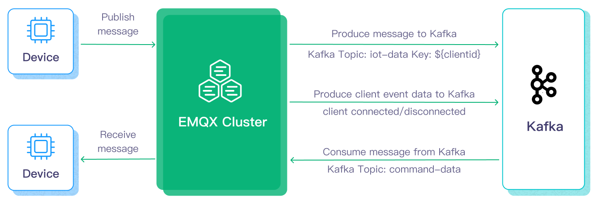
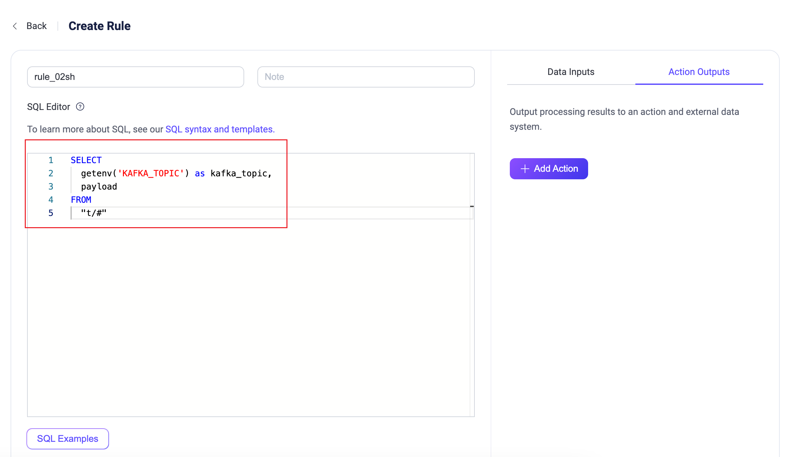

# Apache KafkaへのMQTTデータストリーミング

[Apache Kafka](https://kafka.apache.org/)は、アプリケーションやシステム間でのデータストリームのリアルタイム転送を処理できる、広く利用されているオープンソースの分散イベントストリーミングプラットフォームです。しかし、KafkaはエッジIoT通信向けに設計されておらず、Kafkaクライアントは安定したネットワーク接続とより多くのハードウェアリソースを必要とします。IoTの分野では、デバイスやアプリケーションから生成されるデータは軽量なMQTTプロトコルを使って送信されます。EMQXのKafkaとの統合により、ユーザーはMQTTデータをKafkaにシームレスにストリーミングできます。MQTTデータストリームはKafkaトピックに取り込まれ、リアルタイムの処理、保存、分析が可能です。逆に、KafkaトピックのデータはMQTTデバイスによって消費され、タイムリーなアクションを実現します。



本ページでは、EMQXとKafka間のデータ統合について包括的に紹介し、データ統合の作成と検証方法を実践的に解説します。

## 動作の仕組み

Apache Kafkaとのデータ統合は、MQTTベースのIoTデータとKafkaの強力なデータ処理能力のギャップを埋めるためにEMQXに標準搭載された機能です。組み込みの[ルールエンジン](./rules.md)コンポーネントにより、両プラットフォーム間のデータストリーミングと処理が簡素化され、複雑なコーディングを不要にします。

以下の図は、自動車IoTで使われるEMQXとKafka間の典型的なデータ統合アーキテクチャを示しています。


Apache Kafkaへのデータの流入および流出には、それぞれKafka Sink（Kafkaへメッセージを送信）とKafka Source（Kafkaからメッセージを受信）を作成する必要があります。ここではSinkを例に、そのワークフローを説明します。

1. **メッセージのパブリッシュと受信**: 接続された車載IoTデバイスはMQTTプロトコルを通じてEMQXに正常に接続し、定期的に状態データを含むメッセージをパブリッシュします。EMQXがこれらのメッセージを受信すると、ルールエンジン内でマッチング処理が開始されます。
2. **メッセージデータの処理**: ブローカーと一体化した組み込みのルールエンジンにより、MQTTメッセージはトピックマッチングルールに基づいて処理されます。メッセージが到着するとルールエンジンを通過し、定義されたルールが評価されます。ペイロード変換が指定されている場合は、データ形式の変換、特定情報のフィルタリング、追加コンテキストによるペイロードの強化などが適用されます。
3. **Kafkaへのブリッジ**: ルールエンジンで定義されたルールがメッセージをKafkaに転送するアクションをトリガーします。Kafkaブリッジ機能を使い、MQTTトピックは事前定義されたKafkaトピックにマッピングされ、処理済みのメッセージとデータはKafkaトピックに書き込まれます。

車両データがKafkaに取り込まれた後は、以下のように柔軟にデータを活用できます。

- サービスはKafkaクライアントと直接連携し、特定トピックからリアルタイムデータストリームを消費してカスタマイズされたビジネス処理を実現できます。
- Kafka Streamsを利用してストリーム処理を行い、車両状態をメモリ内で集約・相関させてリアルタイム監視が可能です。
- Kafka Connectコンポーネントを使い、MySQLやElasticSearchなど外部システムへのデータ出力を行い保存できます。

## 特長と利点

Apache Kafkaとのデータ統合は、以下の特長と利点をビジネスにもたらします。

- **信頼性の高い双方向IoTデータメッセージング**: 不安定なモバイルネットワーク上で動作するリソース制約のあるIoTデバイスとKafka間のデータ通信は、不確実なネットワークでのメッセージングに優れたMQTTプロトコルで処理されます。EMQXはMQTTメッセージをバッチでKafkaに転送するだけでなく、バックエンドシステムからのKafkaメッセージをサブスクライブし、接続されたIoTクライアントに配信します。
- **ペイロード変換**: メッセージペイロードは転送中に定義されたSQLルールで処理可能です。例えば、総メッセージ数、成功/失敗配信数、メッセージレートなどのリアルタイムメトリクスを含むペイロードは、Kafkaに取り込む前にデータ抽出、フィルタリング、強化、変換を経ることができます。
- **効果的なトピックマッピング**: 多数のIoTビジネストピックをKafkaトピックにマッピング可能です。EMQXはMQTTユーザープロパティのKafkaヘッダーへのマッピングをサポートし、1対1、1対多、多対多の柔軟なトピックマッピング方法を提供、MQTTトピックフィルター（ワイルドカード）もサポートします。
- **柔軟なパーティション選択戦略**: MQTTトピックやクライアントに基づき、同一Kafkaパーティションへのメッセージ転送をサポートします。
- **高スループット環境での処理能力**: EMQX Kafkaプロデューサーは同期・非同期の両書き込みモードをサポートし、リアルタイム優先と性能優先のデータ書き込み戦略を区別可能で、シナリオに応じてレイテンシとスループットのバランスを柔軟に調整できます。
- **ランタイムメトリクス**: 各SinkおよびSourceの総メッセージ数、成功/失敗数、現在のレートなどのランタイムメトリクスを閲覧可能です。
- **動的設定**: ダッシュボードや設定ファイルからSinkおよびSourceを動的に設定できます。

これらの特長は統合能力と柔軟性を高め、効果的で堅牢なIoTプラットフォームアーキテクチャの構築を支援します。増大するIoTデータ量を安定したネットワーク接続で送信し、さらに効果的に保存・管理できます。

## はじめる前に

このセクションでは、EMQXダッシュボードでKafka SinkおよびSourceを作成する前に必要な準備を説明します。

### 前提条件

- EMQXデータ統合の[ルール](./rules.md)に関する知識
- [データ統合](./data-bridges.md)に関する知識

### Kafkaサーバーのセットアップ

ここではmacOSを例にインストールと起動手順を示します。以下のコマンドでKafkaをインストール・起動できます。

```bash
wget https://archive.apache.org/dist/kafka/3.3.1/kafka_2.13-3.3.1.tgz

tar -xzf  kafka_2.13-3.3.1.tgz

cd kafka_2.13-3.3.1

# KRaftモードでKafkaを起動
KAFKA_CLUSTER_ID="$(bin/kafka-storage.sh random-uuid)"

bin/kafka-storage.sh format -t $KAFKA_CLUSTER_ID -c config/kraft/server.properties

bin/kafka-server-start.sh config/kraft/server.properties
```

詳細な操作手順は、[Kafkaドキュメントのクイックスタート](https://kafka.apache.org/documentation/#quickstart)を参照してください。

### Kafkaトピックの作成

EMQXでデータ統合を作成する前に、関連するKafkaトピックを作成してください。以下のコマンドでKafkaに2つのトピックを作成します。`testtopic-in`（Sink用）と`testtopic-out`（Source用）です。

```bash
bin/kafka-topics.sh --create --topic testtopic-in --bootstrap-server localhost:9092

bin/kafka-topics.sh --create --topic testtopic-out --bootstrap-server localhost:9092
```

## Kafkaプロデューサーコネクターの作成

Kafka Sinkアクションを追加する前に、EMQXとKafka間の接続を確立するためにKafkaプロデューサーコネクターを作成する必要があります。

1. EMQXダッシュボードで **Integration** -> **Connector** をクリックします。
2. ページ右上の **Create** をクリックし、コネクター選択画面で **Kafka Producer** を選択して **Next** をクリックします。
3. 名前と説明を入力します。例：`my-kafka`。名前はKafka Sinkとコネクターを関連付けるために使われ、クラスター内で一意である必要があります。
4. Kafka接続に必要なパラメータを設定します。
   - **Bootstrap Hosts** に `127.0.0.1:9092` を入力します。デモではEMQXとKafkaをローカルマシンで起動している前提です。リモートで起動している場合は適宜調整してください。
   - 他のオプションはデフォルトのままか、ビジネス要件に合わせて設定してください。
   - 暗号化接続を確立する場合は、**Enable TLS** のトグルスイッチをオンにします。TLS接続の詳細は[外部リソースアクセスのTLS](../../operate/network/overview.md#tls-for-external-resource-access)を参照してください。
5. **Create**をクリックする前に、**Test Connection** をクリックしてKafkaサーバーへの接続が成功するかテストできます。
6. **Create** をクリックしてコネクターの作成を完了します。

作成後、コネクターは自動的にKafkaに接続します。次に、このコネクターを基にルールを作成し、Kafkaクラスタへデータを転送します。

## Kafka Sinkを使ったルールの作成

このセクションでは、MQTTトピック `t/#` のメッセージを処理し、処理結果をKafkaの `testtopic-in` トピックに送信するKafka Sinkを使ったルールの作成方法を示します。

1. EMQXダッシュボードで **Integration** -> **Rules** をクリックします。

2. ページ右上の **Create** をクリックします。

3. ルールIDを入力します。例：`my_rule`

4. **SQL Editor** に以下の文を入力します。これはトピック `t/#` のMQTTメッセージをKafkaに転送する例です。

   注意：独自のSQL構文を指定する場合は、Sinkで必要なすべてのフィールドを`SELECT`部分に含めてください。

   ```sql
   SELECT
     *
   FROM
     "t/#"
   ```

   ::: tip

   初心者の方は **SQL Examples** と **Enable Test** をクリックしてSQLルールを学習・テストできます。

   :::

   ::: tip

   EMQX v5.7.2ではルールSQLで環境変数を読み取る機能が追加されました。詳細は[ルールSQLで環境変数を使う](#use-environment-variables)を参照してください。

   :::

5. + **Add Action** ボタンをクリックしてルールでトリガーされるアクションを定義します。**Type of Action** のドロップダウンから `Kafka Producer` を選択し、**Action** はデフォルトの `Create Action` のままか、既存のKafka Producerアクションを選択します。この例では新規プロデューサーアクションを作成しルールに追加します。

6. Sinkの名前と説明を対応するテキストボックスに入力します。

7. **Connector** ドロップダウンから先ほど作成した `my-kafka` コネクターを選択します。隣のボタンをクリックするとポップアップで新規コネクターを素早く作成できます。設定パラメータは[Kafkaプロデューサーコネクターの作成](#create-a-kafka-producer-connector)を参照してください。

8. Sinkのデータ送信方法を設定します。

   - **Kafka Topic**: `testtopic-in` と入力します。EMQX v5.7.2以降、このフィールドは動的トピック設定もサポートします。詳細は[変数テンプレートの使用](#use-variable-templates)を参照してください。
   - **Kafka Headers**: Kafkaメッセージに関連するメタデータやコンテキスト情報を入力します（任意）。プレースホルダーの値はオブジェクトである必要があります。ヘッダー値のエンコードタイプは **Kafka Header Value Encod Type** のドロップダウンから選択可能です。**Add** をクリックしてキー・バリューを追加できます。
   - **Message Key**: Kafkaメッセージのキーを入力します。純粋な文字列か、`${var}` のようなプレースホルダーを含む文字列が使えます。
   - **Message Value**: Kafkaメッセージの値を入力します。純粋な文字列か、`${var}` のようなプレースホルダーを含む文字列が使えます。
   - **Partition Strategy**: プロデューサーがKafkaパーティションにメッセージを分配する方法を選択します。
   - **Compression**: Kafkaメッセージ内のレコードを圧縮/解凍するための圧縮アルゴリズムを指定します。

9. **フォールバックアクション（任意）**: メッセージ配信失敗時の信頼性向上のため、1つ以上のフォールバックアクションを定義できます。詳細は[フォールバックアクション](./data-bridges.md#fallback-actions)を参照してください。

10. **詳細設定（任意）**: [詳細設定](#advanced-configurations)を参照してください。

11. **Create** をクリックしてSinkの作成を完了します。作成後、ページは **Create Rule** に戻り、新しいSinkがルールアクションに追加されます。

12. **Create** をクリックしてルール作成を完了します。

これでルールが正常に作成され、**Integration** -> **Rules** ページで新規ルールを確認でき、**Actions(Sink)** タブで新規Kafka Producer Sinkも確認できます。

また、**Integration** -> **Flow Designer** をクリックしてトポロジーを表示できます。トポロジーを通じて、トピック `t/#` のメッセージがルール `my_rule` によって解析されKafkaに送信・保存されていることが直感的に確認できます。


### Kafka動的トピックの設定

EMQX v5.7.2以降、Kafka Producer Sink設定のKafkaトピックを環境変数や変数テンプレートで動的に設定できます。本節では動的トピック設定の2つのユースケースを紹介します。

#### 環境変数の利用

EMQX v5.7.2は、ルールSQL処理段階で[環境変数](../../operate/configuration/configuration.md#environment-variables)から取得した値をメッセージ内のフィールドに動的に割り当てる機能を追加しました。この機能はルールエンジンの組み込みSQL関数[getenv](../data-integration/rule-sql-builtin-functions.md#system-function)を使い、EMQXの環境変数を取得します。取得した変数値はSQL処理結果にセットされます。この機能の応用例として、Kafka SinkルールアクションのKafkaトピック設定でルール出力結果のフィールドを参照しKafkaトピックを設定できます。以下はその例です。

::: tip 注意

他のシステム環境変数の漏洩を防ぐため、ルールエンジンで使用する環境変数名は必ず `EMQXVAR_` プレフィックスを付ける必要があります。例えば、`getenv`関数で読み取る変数名が`KAFKA_TOPIC`の場合、環境変数名は`EMQXVAR_KAFKA_TOPIC`と設定してください。

:::

1. Kafkaを起動し、`testtopic-in`というKafkaトピックを事前作成します。[はじめる前に](#はじめる前に)の関連手順を参照してください。

2. EMQXを起動し環境変数を設定します。zipインストールの場合、起動時に直接環境変数を指定可能です。例としてKafkaトピック`testtopic-in`を環境変数`EMQXVAR_KAFKA_TOPIC`に設定します。

   ```bash
   EMQXVAR_KAFKA_TOPIC=testtopic-in bin/emqx start
   ```

3. コネクターを作成します。[Kafkaプロデューサーコネクターの作成](#create-a-kafka-producer-connector)を参照してください。

4. Kafka Sinkルールを設定します。**SQL Editor**に以下を入力します。

   ```sql
   SELECT
     getenv('KAFKA_TOPIC') as kafka_topic,
     payload
   FROM
     "t/#"
   ```

   

5. SQLテストを有効にし、環境変数値`testtopic-in`が正しく取得されていることを確認します。

   

6. Kafka Producer Sinkにアクションを追加します。ルール右側の**Action Outputs**で **Add Action** をクリックします。

   - **Connector**: 先ほど作成したコネクター `test-kafka` を選択します。
   - **Kafka Topic**: SQLルール出力に基づき変数テンプレート形式 `${kafka_topic}` で設定します。

   

7. [Kafka Sinkを使ったルールの作成](#create-a-rule-with-kafka-sink)を参照し追加設定を完了し、最後に **Create** をクリックしてルール作成を完了します。

8. [Kafkaプロデューサールールのテスト](#test-kafka-producer-rule)の手順に従い、Kafkaにメッセージを送信します。

   ```bash
   mqttx pub -h 127.0.0.1 -p 1883 -i pub -t t/Connection -q 1 -m 'payload string'
   ```

   メッセージはKafkaトピック `testtopic-in` で受信されるはずです。

   ```bash
   bin/kafka-console-consumer.sh --bootstrap-server 127.0.0.1:9092 \
     --topic testtopic-in

   {"payload":"payload string","kafka_topic":"testtopic-in"}
   {"payload":"payload string","kafka_topic":"testtopic-in"}
   ```

#### 変数テンプレートの利用

**Kafka Topic** フィールドに静的なトピック名を設定する代わりに、変数テンプレートを使って動的にトピックを生成できます。これによりメッセージ内容に基づいてKafkaトピックを構築でき、柔軟なメッセージ処理と分配が可能です。例えば、`device-${payload.device}` のように指定すると、特定デバイスからのメッセージをデバイスIDをサフィックスとするトピック（例：`device-1`）に簡単に送信できます。

この例では、Kafkaに送信されるメッセージペイロードに `device` キーが含まれている必要があります。以下は例のペイロードです。

```json
{
    "topic": "t/devices/data",
    "payload": {
        "device": "1",
        "temperature": 25.6,
        "humidity": 60.2
    }
}
```

このキーが含まれないとトピックのレンダリングに失敗し、回復不能なメッセージドロップが発生します。

また、Kafkaにすべての解決済みトピック（例：`device-1`、`device-2`など）を事前作成しておく必要があります。テンプレートで解決されたトピック名がKafkaに存在しない場合も、回復不能なエラーによりメッセージがドロップされます。

## Kafkaプロデューサールールのテスト

Kafkaプロデューサールールが期待通りに動作するかテストするため、[MQTTX](https://mqttx.app/en)を使ってMQTTメッセージをEMQXにパブリッシュするクライアントをシミュレートできます。

1. MQTTXでトピック `t/1` にメッセージを送信します。

```bash
mqttx pub -i emqx_c -t t/1 -m '{ "msg": "Hello Kafka" }'
```

2. **Actions(Sink)** ページでSink名をクリックし統計情報を確認します。Sinkの稼働状況をチェックし、新規の受信メッセージ数と送信メッセージ数が1件ずつ増えていることを確認します。

3. 以下のコマンドでメッセージがKafkaトピック `testtopic-in` に書き込まれているか確認します。

   ```bash
   bin/kafka-console-consumer.sh --bootstrap-server 127.0.0.1:9092  --topic testtopic-in
   ```

## Kafkaコンシューマーコネクターの作成

Kafka Sourceアクションを追加する前に、EMQXとKafka間の接続を確立するためにKafkaコンシューマーコネクターを作成する必要があります。

1. EMQXダッシュボードで **Integration** -> **Connector** をクリックします。
2. ページ右上の **Create** をクリックします。
3. **Create Connector** ページで **Kafka Consumer** を選択し、**Next** をクリックします。
4. ソースの名前を入力します。大文字・小文字の英数字の組み合わせで、例：`my-kafka-source`。
5. ソースの接続情報を入力します。
   - **Bootstrap Hosts** に `127.0.0.1:9092` を入力します。デモではEMQXとKafkaをローカルマシンで起動している前提です。リモートで起動している場合は適宜調整してください。
   - 他のオプションはデフォルトのままか、ビジネス要件に合わせて設定してください。
   - 暗号化接続を確立する場合は、**Enable TLS** のトグルスイッチをオンにします。TLS接続の詳細は[外部リソースアクセスのTLS](../../operate/network/overview.md#tls-for-external-resource-access)を参照してください。
6. 詳細設定（任意）：[詳細設定](#advanced-configurations)を参照してください。
7. **Create**をクリックする前に、**Test Connection** をクリックしてKafkaサーバーへの接続が成功するかテストできます。
8. **Create** をクリックします。関連するルール作成のオプションが表示されます。[Kafka Consumer Sourceを使ったルールの作成](#create-a-rule-with-kafka-consumer-source)を参照してください。

## Kafka Consumer Sourceを使ったルールの作成

このセクションでは、Kafka Consumer Sourceで転送されたメッセージをさらに処理し、MQTTトピックに再パブリッシュするルールの作成方法を示します。

### ルールSQLの作成

1. EMQXダッシュボードで **Integration** -> **Rules** をクリックします。

2. ページ右上の **Create** をクリックします。

3. ルールIDを入力します。例：`my_rule`

4. Kafkaソース `$bridges/kafka_consumer:<sourceName>` から変換されたメッセージをEMQXに転送する場合、**SQL Editor** に以下の文を入力します。

   注意：独自のSQL構文を指定する場合は、後続の再パブリッシュアクションで必要なすべてのフィールドを`SELECT`部分に含めてください。Kafka Sourceの`SELECT`文では、`ts_type`、`topic`、`ts`、`event`、`headers`、`key`、`metadata`、`value`、`timestamp`、`offset`、`node`などのフィールドが使用可能です。

   ```sql
   SELECT
     *
   FROM
     "$bridges/kafka_consumer:<sourceName>"
   ```

   ::: tip

   初心者の方は **SQL Examples** と **Enable Test** をクリックしてSQLルールを学習・テストできます。

   :::

### Kafka Consumer Sourceをデータ入力として追加

1. ルール作成ページ右側の **Data Inputs** タブを選択し、**Add Input** をクリックします。
2. **Input Type** のドロップダウンから **Kafka Consumer** を選択します。**Source** はデフォルトの `Create Source` のままか、既存のKafka Consumerソースを選択します。この例では新規ソースを作成しルールに追加します。
3. ソースの名前と説明を対応するテキストボックスに入力します。
4. **Connector** ドロップダウンから先ほど作成した `my-kafka-consumer` コネクターを選択します。隣のボタンをクリックするとポップアップで新規コネクターを素早く作成できます。設定パラメータは[Kafkaコンシューマーコネクターの作成](#create-a-kafka-consumer-connector)を参照してください。
5. 以下のフィールドを設定します。

   - **Kafka Topic**: コンシューマーソースがサブスクライブするKafkaトピックを指定します。
   - **Group ID**: このソースのコンシューマーグループIDを指定します。未指定の場合、ソース名に基づき自動生成されます。
   - **Key Encoding Mode** と **Value Encoding Mode**: Kafkaメッセージのキーと値のエンコードモードを選択します。
7. **Offset Reset Policy**: コンシューマーがKafkaトピックパーティションの読み取り開始位置をリセットするポリシーを選択します。

   - `latest` を選択すると、コンシューマーは最新のオフセットから読み取りを開始し、開始前に生成されたメッセージはスキップされます。
   - `earliest` を選択すると、コンシューマーはパーティションの先頭から読み取りを開始し、開始前に生成されたメッセージも含めてすべての履歴データを読み取ります。
8. 詳細設定（任意）：[詳細設定](#advanced-configurations)を参照してください。
9. **Create**をクリックする前に、**Test Connectivity** をクリックしてKafkaサーバーへの接続が成功するかテストできます。
10. **Create** をクリックしてソース作成を完了します。ルール作成ページの **Data Inputs** タブに新規ソースが表示されます。

### 再パブリッシュアクションの追加

1. **Action Outputs** タブを選択し、+ **Add Action** ボタンをクリックしてルールでトリガーされるアクションを定義します。
2. **Type of Action** のドロップダウンから **Republish** を選択します。
3. **Topic** と **Payload** フィールドに、再パブリッシュしたいメッセージのトピックとペイロードを入力します。例として `t/1` と `${.}` を入力します。
   - **Topic** フィールドには `${}` を使って動的にMQTTトピックを指定することも可能です。例：`t/${key}`（注意：`${}`内のパラメータはSQLの`SELECT`文に含まれている必要があります）。
4. **Add** をクリックしてアクションをルールに追加します。
5. ルール作成ページに戻り、**Save** をクリックします。


## Kafka Sourceルールのテスト

Kafkaソースとルールが期待通りに動作するかテストするため、[MQTTX](https://mqttx.app/)を使ってEMQXのトピックにサブスクライブするクライアントをシミュレートし、KafkaプロデューサーでKafkaトピックにデータを生成します。その後、KafkaからのデータがEMQXによってクライアントがサブスクライブするトピックに再パブリッシュされているか確認します。

1. MQTTXでトピック `t/1` をサブスクライブします。

   ```bash
   mqttx sub -t t/1 -v
   ```

2. 新しいコマンドラインウィンドウを開き、以下のコマンドでKafkaプロデューサーを起動します。

   ```bash
   bin/kafka-console-producer --bootstrap-server 127.0.0.1:9092 --topic testtopic-out
   ```

   メッセージ入力を促されます。

3. `{"msg": "Hello EMQX"}` と入力し、`testtopic-out` トピックにメッセージを生成します。

4. MQTTXのサブスクリプションを確認します。Kafkaからの以下のメッセージがトピック `t/1` で受信されるはずです。

   ```json
   {
       "value": "{\"msg\": \"Hello EMQX\"}",
       "ts_type": "create",
       "ts": 1679665968238,
       "topic": "testtopic-out",
       "offset": 2,
       "key": "key",
       "headers": {
           "header_key": "header_value"
       }
   }
   ```

## 詳細設定

このセクションでは、データ統合のパフォーマンス最適化や特定シナリオに応じたカスタマイズのための高度な設定オプションを説明します。コネクター、Sink、Source作成時に **Advanced Settings** を展開し、ビジネス要件に応じて以下の設定を行えます。

| 項目                                     | 説明                                                         | 推奨値             |
| ---------------------------------------- | ------------------------------------------------------------ | ------------------ |
| Min Metadata Refresh Interval            | クライアントがKafkaブローカーやトピックのメタデータを更新する際に待つ最小時間間隔。小さすぎるとKafkaサーバーへの負荷が増加する可能性あり。 | `3` 秒             |
| Metadata Request Timeout                 | Kafkaからメタデータを要求する際の最大待機時間。                 | `5` 秒             |
| Connect Timeout                          | TCP接続確立の最大待機時間。認証が有効な場合は認証時間も含む。     | `5` 秒             |
| Max Wait Time (Source)                   | Kafkaブローカーからのフェッチ応答を待つ最大時間。               | `1` 秒             |
| Fetch Bytes (Source)                     | Kafkaからのフェッチリクエストで取得するバイトサイズ。設定値がKafka内のメッセージサイズより小さいとフェッチ性能に悪影響を与える可能性あり。 | `896` KB           |
| Max Batch Bytes (Sink)                   | Kafkaバッチ内でメッセージを収集する最大サイズ（バイト）。Kafkaブローカーのデフォルトは1MBだが、EMQXはメッセージエンコードのオーバーヘッドを考慮しやや小さめに設定。単一メッセージがこの制限を超える場合は別バッチで送信される。 | `896` KB           |
| Offset Commit Interval (Source)          | 各コンシューマーグループに送信される2回のオフセットコミット要求間の時間間隔。 | `5` 秒             |
| Required Acks (Sink)                     | Kafkaパーティションリーダーがフォロワーから待つアックの種類：<br />`all_isr`: 全てのインシンクレプリカからのアックを要求。<br />`leader_only`: パーティションリーダーのみからのアックを要求。<br />`none`: Kafkaからのアックは不要。 | `all_isr`          |
| Partition Count Refresh Interval (Source)| Kafkaプロデューサーがパーティション数増加を検知する間隔。増加時は指定の`partition_strategy`に基づき新パーティションをメッセージ送信に組み込む。 | `60` 秒            |
| Max Inflight (Sink)                      | Kafkaプロデューサーがアック受信前に送信可能な最大バッチ数（パーティション毎）。値が大きいほどスループット向上が期待できるが、1より大きいとメッセージの順序入れ替わりリスクあり。未アックメッセージ数を制御し負荷バランスを取る。 | `10`               |
| Query Mode (Source)                      | 非同期または同期クエリモードを選択し、異なる要件に応じてメッセージ送信を最適化。非同期モードではKafka書き込みがMQTTパブリッシュをブロックしないが、クライアントがKafka到着前にメッセージを受信する可能性あり。 | `Async`            |
| Synchronous Query Timeout (Sink)          | 同期クエリモード時の最大待機時間。メッセージ送信完了をタイムリーに保証し長時間待機を回避。<br />`Sync`モード時のみ有効。 | `5` 秒             |
| Buffer Mode (Sink)                       | メッセージ送信前にバッファリングするかどうか。メモリバッファリングは送信速度向上に寄与。<br />`memory`: メモリにバッファ。EMQXノード再起動でメッセージは失われる。<br />`disk`: ディスクにバッファ。EMQXノード再起動後もメッセージは保持。<br />`hybrid`: 初めはメモリにバッファし、一定サイズ（`segment_bytes`設定参照）に達すると徐々にディスクにオフロード。メモリモード同様、再起動でメッセージは失われる。 | `memory`           |
| Per-partition Buffer Limit (Sink)        | Kafkaパーティション毎の最大バッファサイズ（バイト）。上限到達時は古いメッセージを破棄してバッファ空間を確保。メモリ使用量と性能のバランス調整に有効。 | `2` GB             |
| Segment File Bytes (Sink)                | バッファモードが`disk`または`hybrid`時に適用。メッセージ保存用のセグメントファイルサイズを制御し、ディスクストレージの最適化に影響。 | `100` MB           |
| Memory Overload Protection (Sink)         | バッファモードが`memory`時に適用。メモリ圧迫時に古いバッファメッセージを自動破棄し、システムの安定性を確保。Linuxのみ有効。 | `Enabled`          |
| Socket Send / Receive Buffer Size        | ネットワーク送受信性能を最適化するためのソケットバッファサイズ。 | `1024` KB          |
| TCP Keepalive                            | Kafkaブリッジ接続のTCPキープアライブ機能を有効化し、長時間のアイドル状態による接続切断を防止。値はカンマ区切りの3つの数値で `Idle, Interval, Probes` の形式：<br />Idle: 接続がアイドル状態である秒数（Linuxデフォルト7200秒）<br />Interval: 各キープアライブプローブ間の秒数（Linuxデフォルト75秒）<br />Probes: 応答なしで接続切断と判断するまでの最大プローブ数（Linuxデフォルト9回）<br />例：`240,30,5` は240秒アイドル後にプローブ開始、30秒間隔で送信、5回応答なしで切断。 | `none`             |
| Max Linger Time                          | パーティション毎のプロデューサーがメッセージをバッチ収集のために待つ最大時間。デフォルト`0`は待機なし。メモリ以外のバッファモードでは`5ms`設定でIOPS削減だがレイテンシ増加。 | `0` ミリ秒         |
| Max Linger Bytes                         | パーティション毎のプロデューサーがメッセージをバッチ収集のために待つ最大バイト数。 | `10` MB            |
| Health Check Interval                    | コネクターの稼働状態をチェックする間隔。                         | `15` 秒            |

## さらに詳しく

EMQXはApache Kafkaとのデータ統合に関する豊富な学習リソースを提供しています。以下のリンクから詳細を学べます。

**ブログ:**

- [MQTTとKafkaでつくるコネクテッドカーのストリーミングデータパイプライン：3分ガイド](https://www.emqx.com/en/blog/building-connected-vehicle-streaming-data-pipelines-with-mqtt-and-kafka)
- [MQTTとKafka：IoTデータ統合の強化](https://www.emqx.com/en/blog/mqtt-and-kafka)
- [MQTTパフォーマンスベンチマークテスト：EMQX-Kafka統合](https://www.emqx.com/en/blog/mqtt-performance-benchmark-testing-emqx-kafka-integration)

**ベンチマークレポート:**

- [EMQX Enterpriseパフォーマンスベンチマークテスト：Kafka統合](https://www.emqx.com/en/resources/emqx-enterprise-performance-benchmark-testing-kafka-integration)

**動画:**

- [EMQX Cloudルールエンジンを使ったデバイスデータのKafkaブリッジ](https://www.emqx.com/en/resources/bridge-device-data-to-kafka-using-the-emqx-cloud-rule-engine)（Cloudルールエンジンに関する動画で、今後より適切な動画に差し替え予定）
