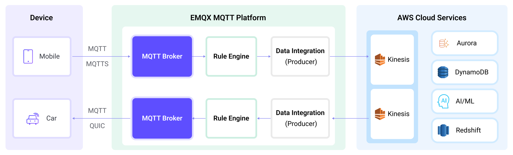

# Amazon Kinesis への MQTT データストリーム

[AWS Kinesis](https://aws.amazon.com/cn/kinesis/) は、AWS 上で提供されるフルマネージドのリアルタイムストリーミングデータ処理サービスであり、ストリーミングデータの収集、処理、分析を容易に行えます。あらゆる規模のストリーミングデータを経済的かつ効率的にリアルタイム処理でき、高い柔軟性を持ち、数十万のソースからの大量ストリーミングデータを低レイテンシで処理可能です。

EMQX は [Amazon Kinesis Data Streams](https://aws.amazon.com/kinesis/data-streams/) とのシームレスな連携をサポートしており、大量の IoT デバイスを接続してリアルタイムのメッセージ収集と送信を実現します。このデータ統合により、Amazon Kinesis Data Streams と接続してリアルタイムデータ分析や複雑なストリーム処理が可能です。

本ページでは、EMQX と Amazon Kinesis 間のデータ統合について包括的に紹介し、データ統合の作成および検証手順を実践的に解説します。

## 動作概要

Amazon Kinesis とのデータ統合は、EMQX の標準機能として提供されており、ユーザーが MQTT データストリームを Amazon Kinesis とシームレスに連携させ、IoT アプリケーション開発における豊富なサービスと機能を活用できるよう設計されています。



EMQX はルールエンジンと Sink を通じて MQTT データを Amazon Kinesis に転送します。全体の流れは以下の通りです。

1. **IoT デバイスがメッセージをパブリッシュ**：デバイスは特定のトピックを通じてテレメトリやステータスデータをパブリッシュし、ルールエンジンをトリガーします。
2. **ルールエンジンがメッセージを処理**：組み込みのルールエンジンは、特定のトピックにマッチする MQTT メッセージを処理します。ルールにマッチしたメッセージは、データ形式の変換、特定情報のフィルタリング、コンテキスト情報の付加などの処理が行われます。
3. **Amazon Kinesis へのブリッジング**：ルールによってトリガーされたアクションでメッセージを Amazon Kinesis に転送します。パーティションキーや書き込み先のデータストリーム、メッセージフォーマットをカスタマイズ可能で、柔軟なデータ統合を実現します。

MQTT メッセージデータが Amazon Kinesis に書き込まれた後、以下のような柔軟なアプリケーション開発が可能です。

- リアルタイムデータ処理と分析：強力な Amazon Kinesis のデータ処理・分析ツールやストリーミング機能を活用し、メッセージデータをリアルタイム処理・分析して有益な洞察や意思決定支援を得られます。
- イベント駆動型機能：Amazon のイベント処理をトリガーし、動的かつ柔軟な機能トリガーや処理を実現します。
- データ保存と共有：メッセージデータを Amazon Kinesis のストレージサービスに送信して大量データを安全に保存・管理し、他の Amazon サービスと連携して共有・分析できます。

## 特長とメリット

EMQX と AWS Kinesis Data Streams のデータ統合は、以下の機能と利点をビジネスにもたらします。

- **信頼性の高いデータ送信と順序保証**：EMQX と AWS Kinesis Data Streams は共に信頼性の高いデータ送信機構を備えています。EMQX は MQTT プロトコルを通じてメッセージの確実な送信を保証し、AWS Kinesis Data Streams はパーティションとシーケンス番号でメッセージの順序を保証します。これにより、デバイスから送信されたメッセージが正確に届き、正しい順序で処理されます。
- **リアルタイムデータ処理**：デバイスからの高頻度データは、EMQX のルール SQL によるリアルタイム一次処理で簡単にフィルタリング、抽出、付加、変換が可能です。AWS Kinesis Data Streams へ送信後は、AWS Lambda や AWS 管理下の Apache Flink と組み合わせてさらなるリアルタイム分析が行えます。
- **弾力的なスケーラビリティ対応**：EMQX は数百万の IoT デバイス接続を容易に実現し、弾力的なスケーラビリティを提供します。AWS Kinesis Data Streams はオンデマンドの自動リソース割り当てと拡張を行います。両者を組み合わせたアプリケーションは接続数やデータ量に応じてスケールし、ビジネスの成長に継続的に対応します。
- **パーシステンスなデータ保存**：AWS Kinesis Data Streams はパーシステンスなデータ保存機能を提供し、毎秒数百万のデバイスデータストリームを信頼性高く保存します。必要に応じて過去データの取得やオフライン分析・処理が可能です。

AWS Kinesis Data Streams を利用したストリーミングデータパイプラインの構築は、EMQX と AWS プラットフォームの統合の難易度を大幅に軽減し、ユーザーにより豊富で柔軟なデータ処理ソリューションを提供します。これにより、EMQX ユーザーは AWS 上で機能的に充実した高性能なデータ駆動型アプリケーションを構築できます。

## はじめる前に

このセクションでは、Amazon Kinesis データ統合を作成する前に必要な準備について説明します。Kinesis サービスのセットアップやデータストリームサービスのエミュレーション方法を含みます。

### 前提条件

- EMQX データ統合の [ルール](./rules.md) に関する知識
- [データ統合](./data-bridges.md) に関する知識

### Amazon Kinesis Data Streams でのストリーム作成

以下の手順で AWS マネジメントコンソールからストリームを作成します（詳細は [こちらのチュートリアル](https://docs.aws.amazon.com/streams/latest/dev/how-do-i-create-a-stream.html) を参照）。

1. AWS マネジメントコンソールにサインインし、[Kinesis コンソール](https://console.aws.amazon.com/kinesis) を開きます。

2. ナビゲーションバーでリージョンセレクターを展開し、リージョンを選択します。

3. **Create data stream** を選択します。

4. **Create Kinesis stream** ページでデータストリーム名を入力し、**On-demand** キャパシティモードを選択します。

### Amazon Kinesis Data Streams のローカルエミュレーション

開発やテストを容易にするため、[LocalStack](https://localstack.cloud/) を使って Amazon Kinesis Data Streams サービスをローカルでエミュレートできます。LocalStack を利用すると、リモートクラウドプロバイダーに接続せずにローカルマシン上で AWS アプリケーションを完全に実行可能です。

1. Docker イメージを使ってインストールおよび起動します。

   ```bash
   # LocalStack Docker イメージをローカルで起動
   docker run --name localstack -p '4566:4566' -e 'KINESIS_LATENCY=0' -d localstack/localstack:2.1
   
   # コンテナにアクセス
   docker exec -it localstack bash
   ```

2. シャード数1のストリーム `my_stream` を作成します。

   ```bash
   awslocal kinesis create-stream --stream-name "my_stream" --shard-count 1
   ```

## コネクターの作成

このセクションでは、Sink を Amazon Kinesis Data Streams サービスに接続するコネクターの作成方法を説明します。

1. EMQX ダッシュボードに入り、**Integration** -> **Connectors** をクリックします。

2. ページ右上の **Create** をクリックします。

3. **Create Connector** ページで **Amazon Kinesis** を選択し、**Next** をクリックします。

4. **Configuration** ステップで以下の情報を設定します。

   - コネクター名を入力します。英大文字・小文字と数字の組み合わせで、例：`my_kinesis`。
   - **Amazon Kinesis Endpoint**：Kinesis サービスの [エンドポイント](https://docs.aws.amazon.com/general/latest/gr/ak.html) を入力します。LocalStack を使う場合は `http://localhost:4566` を入力します。
   - **AWS Access Key ID**：[アクセスキーID](https://docs.aws.amazon.com/powershell/latest/userguide/pstools-appendix-sign-up.html) を入力します。LocalStack 利用時は任意の値で構いません。
   - **AWS Secret Access Key**：[シークレットアクセスキー](https://docs.aws.amazon.com/powershell/latest/userguide/pstools-appendix-sign-up.html) を入力します。LocalStack 利用時は任意の値で構いません。

5. **Create** をクリックする前に、**Test Connectivity** を押してコネクターが Amazon Kinesis Data Streams サービスに接続可能かテストできます。

6. ページ下部の **Create** ボタンをクリックしてコネクター作成を完了します。ポップアップダイアログで **Back to Connector List** をクリックするか、**Create Rule** をクリックしてルールと Sink の作成を続行します。詳細は [Amazon Kinesis Sink を使ったルール作成](#create-a-rule-with-amazon-kinesis-sink) を参照してください。

## Amazon Kinesis Sink を使ったルール作成

このセクションでは、ソース MQTT トピック `t/#` からのメッセージを処理し、処理結果を Amazon データストリーム `my_stream` にストリーミングするルール作成方法を説明します。

1. EMQX ダッシュボードで **Integration** -> **Rules** をクリックします。

2. ページ右上の **Create** をクリックします。

3. ルール ID に `my_rule` を入力します。

4. **SQL Editor** でルールを設定します。トピック `t/#` の MQTT メッセージを Amazon Kinesis Data Streams に保存する場合、以下の SQL 文を使用します。

   注意：独自の SQL 文を指定する場合、Sink のペイロードテンプレートで必要なフィールドを `SELECT` 部分に含めてください。

   ```sql
   SELECT
     *
   FROM
     "t/#"
   ```

   ::: tip

   初心者の方は **SQL Examples** と **Enable Test** をクリックして SQL ルールの学習とテストを行えます。

   :::

5. + **Add Action** ボタンを押して、ルールによりトリガーされるアクションを定義します。このアクションで EMQX はルール処理済みデータを Kinesis に送信します。

6. **Type of Action** ドロップダウンから `Amazon Kinesis` を選択します。**Action** はデフォルトの `Create Action` のままにします。既に作成済みの Sink があれば選択可能ですが、本デモでは新規 Sink を作成します。

7. Sink の名前と説明を入力します。名前は英大文字・小文字と数字の組み合わせにしてください。

8. **Connector** ドロップダウンから先ほど作成した `my_kinesis` を選択します。新規コネクターを作成する場合は、ドロップダウン横のボタンをクリックしてください。設定パラメータは [コネクター作成](#create-a-connector) を参照してください。

9. 以下の情報を入力します。

   - **Amazon Kinesis Stream**：[Amazon Kinesis Data Streams でのストリーム作成](#create-stream-in-amazon-kinesis-data-streams) で作成したストリーム名を入力します。
   - **Partition Key**：このストリームに送信されるレコードに関連付けるパーティションキーを入力します。`${variable_name}` 形式のプレースホルダーも使用可能です（次のステップで例を示します）。

10. **Payload Template** フィールドは空白のままにするか、テンプレートを定義します。

    - 空白の場合、クライアントID、トピック、ペイロードなど MQTT メッセージの全ての可視フィールドを JSON 形式でエンコードします。
    - 定義したテンプレートを使う場合、`${variable_name}` 形式のプレースホルダーは MQTT コンテキストの対応する値で置き換えられます。例：`${topic}` は MQTT メッセージのトピックが `my/topic` なら `my/topic` に置換されます。

11. **フォールバックアクション（任意）**：メッセージ配信失敗時の信頼性向上のため、1つ以上のフォールバックアクションを定義できます。これらはプライマリ Sink がメッセージ処理に失敗した場合にトリガーされます。詳細は [フォールバックアクション](./data-bridges.md#fallback-actions) を参照してください。

12. **詳細設定（任意）**：必要に応じて詳細設定オプションを構成します。詳細は [詳細設定](#advanced-settings) を参照してください。

13. **Create** をクリックする前に、**Test Connectivity** を押して Sink が Amazon Kinesis Data Streams サービスに接続可能かテストできます。

14. **Create** ボタンをクリックして Sink 設定を完了します。新しい Sink が **Action Outputs** に追加されます。

15. **Create Rule** ページに戻り、設定内容を確認して **Create** ボタンを押してルールを生成します。

これで Amazon Kinesis Sink を通じてデータを転送するルールが正常に作成されました。**Integration** -> **Rules** ページで新規ルールを確認できます。**Actions(Sink)** タブをクリックすると、新しい Amazon Kinesis Sink が表示されます。

また、**Integration** -> **Flow Designer** をクリックするとトポロジーが表示され、トピック `t/#` のメッセージがルール `my_rule` によって解析され、Amazon Kinesis Data Streams に送信・保存されていることが確認できます。

## ルールのテスト

1. MQTTX を使ってトピック `t/my_topic` にメッセージを送信します。

   ```bash
   mqttx pub -i emqx_c -t t/my_topic -m '{ "msg": "hello Amazon Kinesis" }'
   ```

2. Sink の稼働状況を確認し、新規の受信メッセージと送信メッセージがそれぞれ1件ずつあることを確認します。

3. [Amazon Kinesis Data Viewer](https://docs.aws.amazon.com/streams/latest/dev/data-viewer.html) にアクセスし、レコード取得時にメッセージが表示されることを確認します。

### LocalStack を使った確認

LocalStack を利用している場合は、以下の手順で受信データを確認します。

1. メッセージ送信前に *ShardIterator* を取得します。

   ```bash
   awslocal kinesis get-shard-iterator --stream-name my_stream --shard-id shardId-000000000000 --shard-iterator-type LATEST
   {
   "ShardIterator": "AAAAAAAAAAG3YjBK9sp0uSIFGTPIYBI17bJ1RsqX4uJmRllBAZmFRnjq1kPLrgcyn7RVigmH+WsGciWpImxjXYLJhmqI2QO/DrlLfp6d1IyJFixg1s+MhtKoM6IOH0Tb2CPW9NwPYoT809x03n1zL8HbkXg7hpZjWXPmsEvkXjn4UCBf5dBerq7NLKS3RtAmOiXVN6skPpk="
   }
   ```

2. MQTTX を使ってトピック `t/my_topic` にメッセージを送信します。

   ```bash
   mqttx pub -i emqx_c -t t/my_topic -m '{ "msg": "hello Amazon Kinesis" }'
   ```

3. レコードを読み取り、受信データをデコードします。

   ```bash
   awslocal kinesis get-records --shard-iterator="AAAAAAAAAAG3YjBK9sp0uSIFGTPIYBI17bJ1RsqX4uJmRllBAZmFRnjq1kPLrgcyn7RVigmH+WsGciWpImxjXYLJhmqI2QO/DrlLfp6d1IyJFixg1s+MhtKoM6IOH0Tb2CPW9NwPYoT809x03n1zL8HbkXg7hpZjWXPmsEvkXjn4UCBf5dBerq7NLKS3RtAmOiXVN6skPpk="
   {
       "Records": [
           {
               "SequenceNumber": "49642650476690467334495639799144299020426020544120356866",
               "ApproximateArrivalTimestamp": 1689389148.261,
               "Data": "eyAibXNnIjogImhlbGxvIEFtYXpvbiBLaW5lc2lzIiB9",
               "PartitionKey": "key",
               "EncryptionType": "NONE"
           }
       ],
       "NextShardIterator": "AAAAAAAAAAFj5M3+6XUECflJAlkoSNHV/LBciTYY9If2z1iP+egC/PtdVI2t1HCf3L0S6efAxb01UtvI+3ZSh6BO02+L0BxP5ssB6ONBPfFgqvUIjbfu0GOmzUaPiHTqS8nNjoBtqk0fkYFDOiATdCCnMSqZDVqvARng5oiObgigmxq8InciH+xry2vce1dF9+RRFkKLBc0=",
       "MillisBehindLatest": 0
   }
   
   echo 'eyAibXNnIjogImhlbGxvIEFtYXpvbiBLaW5lc2lzIiB9' | base64 -d
   { "msg": "hello Amazon Kinesis" }
   ```

## 詳細設定

このセクションでは、Amazon Kinesis Sink の詳細設定オプションについて説明します。ダッシュボードの Sink 設定画面で **Advanced Settings** を展開し、以下のパラメータをニーズに応じて調整できます。

| フィールド名                     | 説明                                                         | デフォルト値  |
| -------------------------------- | ------------------------------------------------------------ | ------------ |
| **Buffer Pool Size**             | EMQX と Kinesis 間のデータフローを管理するバッファワーカープロセスの数を指定します。これらのワーカーはデータを一時的に保存・処理し、ターゲットサービスへの送信を最適化し、スムーズなデータ転送を保証します。 | `16`         |
| **Request TTL**                  | バッファに入ったリクエストが有効とみなされる最大時間（秒）を指定します。リクエストがこの TTL を超えてバッファに滞留したり、送信後に Kinesis からの応答やアックがタイムリーに得られない場合、リクエストは期限切れとみなされます。 | `45` 秒      |
| **Health Check Interval**        | Sink が Kinesis との接続状態を自動的にヘルスチェックする間隔（秒）を指定します。 | `15` 秒      |
| **Health Check Interval Jitter** | 基本のヘルスチェック間隔に加える一様ランダム遅延です。複数ノードが同時にヘルスチェックを開始する確率を減らします。複数のアクションやソースが同じコネクターを共有する場合、ジッターを有効にするとヘルスチェックの開始時刻が微妙にずれます。 | `15` 秒      |
| **Health Check Timeout**         | Kinesis との接続ヘルスチェックのタイムアウト時間（秒）を指定します。 | `60` 秒      |
| **Max Buffer Queue Size**        | Kinesis Sink の各バッファワーカーがバッファリング可能な最大バイト数を指定します。バッファワーカーはデータを一時保存し、Kinesis への送信を効率化します。システム性能やデータ転送要件に応じて調整してください。 | `256`        |
| **Query Mode**                   | メッセージ送信の最適化のため、`synchronous`（同期）または `asynchronous`（非同期）のリクエストモードを選択できます。非同期モードでは Kinesis への書き込みが MQTT メッセージのパブリッシュ処理をブロックしませんが、クライアントがメッセージ到達前に受信する可能性があります。 | `Async`      |
| **Batch Size**                   | EMQX から Kinesis へ一度に送信するデータバッチの最大サイズを指定します。サイズを調整することでデータ転送の効率と性能を最適化できます。<br />「Batch Size」を「1」に設定すると、データレコードはバッチ化せず個別に送信されます。 | `1`          |
| **Inflight Window**             | 「インフライトキューリクエスト」とは、送信済みで応答やアックをまだ受け取っていないリクエストを指します。この設定は Sink と Kinesis 間の通信で同時に存在可能なインフライトリクエストの最大数を制御します。<br/>`Request Mode` が `asynchronous` の場合、特に重要です。同一 MQTT クライアントからのメッセージを厳密に順序処理したい場合は、この値を `1` に設定してください。 | `100`        |
