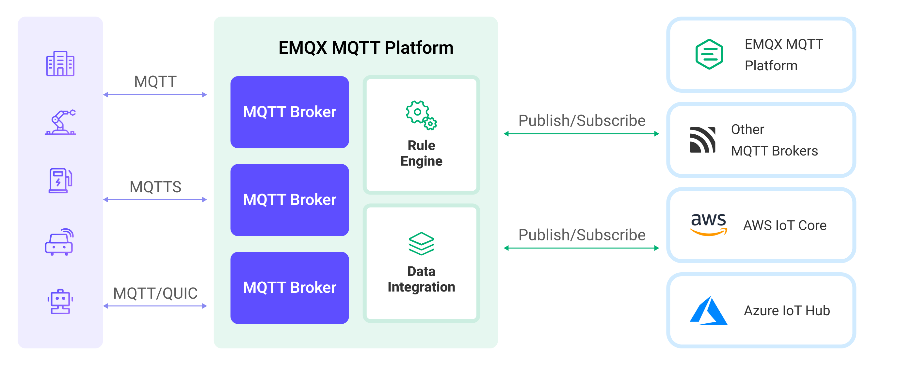

# 他の MQTT サービスとのブリッジ

MQTT ブローカーのデータ統合は、EMQX に別の EMQX クラスターや他の MQTT サービスとメッセージブリッジで接続する機能を提供し、ネットワークやサービスを跨いだデータの相互作用と通信を可能にします。本ページでは、EMQX における MQTT メッセージブリッジの動作原理を紹介し、メッセージブリッジの作成および検証方法について実践的なガイダンスを提供します。

## 動作原理

ブリッジング中、EMQX はクライアントとしてターゲットサービスと MQTT 接続を確立し、パブリッシュ・サブスクライブモデルを通じて双方向のメッセージ送受信を実現します。

- 送信メッセージ（Sink）：ローカルのトピックからリモート MQTT サービスの指定トピックへメッセージをパブリッシュします。
- 受信メッセージ（Source）：リモート MQTT サービスのトピックをサブスクライブし、そのメッセージをローカルの EMQX に転送します。

EMQX は同一接続上で複数のブリッジルールを設定可能で、それぞれ異なるトピックマッピングやメッセージ変換ルールを持ち、メッセージルーティングに類似した機能を実装できます。ブリッジング中はルールエンジンを介してメッセージのフィルタリング、拡充、変換処理も行えます。

以下の図は、EMQX と他の MQTT サービス間のデータ統合の典型的なアーキテクチャを示しています。



## 特徴と利点

MQTT ブローカーのデータ統合は以下の特徴と利点を持ちます。

- **高い互換性**：標準 MQTT プロトコルを使用しているため、AWS IoT Core、Azure IoT Hubs などの各種 IoT プラットフォームや、オープンソースや他業界の MQTT ブローカー、IoT プラットフォームともブリッジ可能です。多様なデバイスやプラットフォームとのシームレスな統合と通信を実現します。
- **双方向データフロー**：EMQX からリモート MQTT サービスへのメッセージパブリッシュと、MQTT サービスからのメッセージサブスクライブおよびローカルパブリッシュの双方向通信をサポートし、異なるシステム間のデータ転送を柔軟かつ制御可能にします。
- **柔軟なトピックマッピング**：MQTT のパブリッシュ・サブスクライブモデルに基づき、トピックにプレフィックスを追加したり、クライアントのコンテキスト情報（クライアント ID、ユーザー名など）を使って動的にトピックを構築したりする柔軟なトピックマッピングを実現します。これにより、特定の要件に応じたメッセージのカスタム処理やルーティングが可能です。
- **高性能**：コネクションプーリングや共有サブスクリプションなどのパフォーマンス最適化オプションを提供し、個々のブリッジクライアントの負荷を軽減、ブリッジのレイテンシ低減とメッセージスループット向上を実現します。これらの最適化により、システム全体のパフォーマンスとスケーラビリティが向上します。
- **ペイロード変換**：SQL ルールを定義してメッセージペイロードを処理可能です。メッセージ転送時にデータ抽出、フィルタリング、拡充、変換などの操作をペイロードに対して実行できます。例えば、リアルタイムメトリクスをペイロードから抽出し、変換・処理してからリモート MQTT ブローカーに配信できます。
- **メトリクス監視**：各 Sink/Source ごとにランタイムメトリクス監視を提供し、総メッセージ数、成功/失敗数、現在のレートなどを確認可能で、Sink/Source のパフォーマンスや状態をリアルタイムで監視・評価できます。

## MQTT 接続情報の準備

::: tip 前提条件

以下を理解していることを確認してください。

- [ルールエンジン](./rules.md)
- [データ統合](./data-bridges.md)

:::

MQTT ブローカーのデータ統合を作成する前に、リモート MQTT サービスの接続情報を取得する必要があります。ここでは EMQX の [オンライン MQTT サーバー](https://www.emqx.com/en/mqtt/public-mqtt5-broker) を例に説明します。

- **MQTT サービスアドレス**：ターゲット MQTT サービスのアドレスとポート。例：`broker.emqx.io:1883`。サポートされる形式は `host:port`、`[IPv6]:port`、`mqtt://host:port`、`mqtt://[IPv6]:port`、`mqtts://host:port`、`mqtts://[IPv6]:port` です。ポート省略時はデフォルトの MQTT ポート `1883` が使用されます。その他の URI スキームはサポートされません。`mqtt` と `mqtts` スキームはアドレス解析のみに使用され、TLS 対応の MQTT リスナーに接続する場合はコネクター設定で TLS を別途構成してください。
- **ユーザー名**：接続に必要なユーザー名。ターゲットサービスが認証不要の場合は空欄で構いません。
- **パスワード**：接続に必要なパスワード。認証不要の場合は空欄で構いません。
- **プロトコルタイプ**：ターゲットサービスが TLS を有効にしているか、TCP/TLS 上の MQTT を使用しているかを確認してください。EMQX の MQTT ブリッジは現時点で MQTT over WebSocket や MQTT over QUIC などのプロトコルはサポートしていません。
- **プロトコルバージョン**：ターゲット MQTT サービスが使用するプロトコルバージョン。EMQX は MQTT 3.1、3.1.1、MQTT 5.0 をサポートしています。

データ統合は EMQX または他の標準 MQTT サーバーとの高い互換性とサポートを提供します。その他の種類の MQTT サービスに接続する場合は、該当サービスのドキュメントを参照して接続情報を取得してください。一般的に多くの IoT プラットフォームは標準的な MQTT アクセス方法を提供しており、それに基づきデバイス情報を上記の MQTT 接続情報に変換できます。

:::tip 注意

EMQX がクラスター運用中、またはコネクションプールが有効な場合、同一のクライアント ID を使って複数ノードが同一 MQTT サービスに接続すると通常デバイス競合が発生します。そのため、MQTT メッセージブリッジでは固定クライアント ID の設定は現在サポートしていません。

:::

## コネクターの作成

ここではリモート MQTT サーバーとの接続を設定する方法をご案内します。

1. ダッシュボードの **Integration** -> **Connector** ページに移動します。

2. ページ右上の **Create** をクリックします。

3. コネクタータイプ一覧から **MQTT Broker** を選択し、**Next** をクリックします。

4. コネクターの **name** を入力します。英数字の組み合わせで、例として `my_mqtt_bridge` を使用します。

5. 接続情報を設定します：
   - **MQTT Broker**：TCP/TLS 上の MQTT のみサポート。MQTT サービスアドレスを入力します。例：`broker.emqx.io:1883`、`[::1]:1883`、`mqtt://broker.emqx.io:1883`。TLS 対応の MQTT リスナーの場合はコネクター設定で TLS を別途構成してください。
   
   - **ClientID Prefix**：空欄でも構いません。実際の運用ではクライアント ID プレフィックスを指定するとクライアント管理が容易になります。EMQX はクライアント ID プレフィックスとコネクションプールサイズに基づき自動的にクライアント ID を生成します。詳細は [コネクションプールとクライアント ID 生成ルール](#connection-pool-and-client-id-generation-rules) を参照してください。
   
   - **Username** と **Password**：MQTT ブローカーが認証を要求する場合は、クライアント ID に対応するユーザー名とパスワードを入力します。認証不要の場合（パブリックブローカーなど）は空欄で構いません。
   
   - **Keepalive**：希望するキープアライブ間隔を指定します。
   
   - **MQTT Version**：ブローカー接続に適したバージョンを選択します。
   
   - **Static ClientId Entries**：Azure IoT Hubs など特定のサービスに接続する際に安定した接続を確保するため、静的クライアント ID を設定できます。詳細は [静的クライアント ID の設定](#configure-static-client-ids) を参照してください。
   
     ::: tip
   
     静的クライアント ID エントリーを定義した場合、明示的に静的クライアント ID が割り当てられた EMQX ノードのみが MQTT 接続を開始します。
   
     :::

その他の設定はデフォルトのままにして、**Create** ボタンをクリックしてコネクターの作成を完了します。作成したコネクターは Sink と Source の両方で使用可能です。次に、このコネクターを基にデータブリッジルールを作成できます。

### コネクションプールとクライアント ID 生成ルール

EMQX は複数のクライアントが同時にブリッジ先 MQTT サービスに接続できるようにします。コネクター作成時に MQTT クライアント接続プールを設定し、そのサイズを指定することでプール内のクライアント接続数を示します。コネクションプールはサーバーリソースを最大限に活用し、より高いメッセージスループットと優れた同時実行性能を実現します。これは高負荷・高同時接続シナリオで重要です。

MQTT プロトコルは MQTT サーバーに接続するクライアントに一意のクライアント ID を要求し、EMQX はクラスター展開可能なため、MQTT ブリッジの各クライアントに一意のクライアント ID を割り当てます。EMQX は以下のパターンに従いクライアント ID を自動生成します。

```bash
[Client ID Prefix]:{Connector Name}{8桁のランダム文字列}:{プール内の接続シーケンス番号}
```

例えば、クライアント ID プレフィックスが `myprefix`、コネクター名が `foo` の場合、実際のクライアント ID は以下のようになります。

```bash
myprefix:foo2bd61c44:1
```

バージョン 5.4.1 以降、EMQX は MQTT クライアント ID の長さを 23 バイトに制限しています。クライアント ID がこの長さを超える場合はハッシュ値に置き換えられます。プレフィックスやコネクター名が長すぎるとユーザー体験が悪化する可能性があります。

この問題に対応するため、バージョン 5.7.1 以降、EMQX は以下のルールを実装しています。

- **プレフィックスなし**：動作は変更なし。長さが 23 バイトを超えるクライアント ID は 23 バイトのハッシュ値に変換されます。
- **プレフィックスあり**：
  - **プレフィックスが最大 19 バイト**：プレフィックスは保持され、残りのクライアント ID 部分は 4 バイトのハッシュ値に変換され、全体の長さは 23 バイト以内に収まります。
  - **プレフィックスが 20 バイト以上**：設定されたプレフィックスを使用し、クライアント ID の短縮は行いません。

### 静的クライアント ID の設定

特定のユースケースでは、統合で使用するクライアント ID が有限の場合があります。この場合、コネクター設定時に個別のノードに静的クライアント ID のセットを割り当てることが可能です。静的クライアント ID を設定するには、EMQX クラスター内の各ノードに対してクライアント ID のリストを提供します。各クライアント ID に対応するユーザー名とパスワードも指定可能です。これは Azure IoT Hubs のように、各デバイス（クライアント ID）に固有の認証情報が必要なシナリオで特に有用です。

静的クライアント ID を設定する手順は以下の通りです。

1. **Static ClientId Entries** セクションで **Add** ボタンをクリックし、新しい静的クライアント ID エントリーを追加します。必要に応じて異なるノードのエントリーを複数追加可能です。

2. 各エントリーで以下の項目を入力します。

   - **Node Name**：クライアント ID を割り当てるノード名。例：`emqx@10.0.0.1`
   - **Client ID**：静的クライアント ID。例：`device1`。必要に応じて複数のクライアント ID を追加可能です。
     - **Username**：（任意）認証用のユーザー名。
     - **Password**：（任意）認証用のパスワード。プラットフォームによりデバイス固有のキー、シークレット、証明書などが使用されます（例：Azure IoT Hubsの認証キー）。

   **設定例**：

   | ノード名            | クライアント ID | ユーザー名（任意） | パスワード（任意） |
   | ------------------- | --------------- | ------------------ | ------------------ |
   | `emqx@10.0.0.1`     | `clientid1`     | `username1`        | `secret1`          |
   |                     | `clientid3`     |                    |                    |
   | `emqx@10.0.0.2`     | `clientid2`     | `username2`        |                    |
   | `emqx@10.0.0.3`     | `clientid4`     |                    |                    |
   |                     | `clientid5`     |                    |                    |

設定ファイルで各ノードごとに `static_clientids` パラメータを定義することも可能です。

静的クライアント ID を設定した場合、これらのクライアント ID を用いた MQTT 接続のみが開始され、`pool_size` や `clientid_prefix` など動的クライアント ID 用の設定は無効になります。

## MQTT ブローカー Sink を使ったルールの作成

ここでは、リモート MQTT サービスに転送するデータを指定するルールの作成方法を示します。

1. ダッシュボードの **Integration** -> **Rules** ページに移動します。

2. ページ右上の **Create** をクリックします。

3. ルール ID に `my_rule` と入力します。

4. **SQL Editor** に、`t/#` トピックからの MQTT メッセージをリモート MQTT サーバーに保存するルールを入力します。ルール SQL は以下の通りです。

   ```sql
   SELECT
     *
   FROM
     "t/#"
   ```

   MQTTv5 プロトコルを使用している場合、`pub_props` フィールドをルール SQL に含めると、パブリッシュプロパティがそのままリモートブローカーに転送されます。上記の `SELECT * FROM t/#` の例が該当します。

   ユーザープロパティを動的に追加したい場合は、ルールの出力に含める `pub_props` フィールドに追加可能です。例えば以下のルールは、ペイロードからキーと値を取得してユーザープロパティを追加します。

   ```sql
   SELECT
     *,
     map_put(concat('User-Property.', payload.extra_key), payload.extra_value, pub_props) as pub_props
   FROM
     't/#'
   ```

5. **Action Type** ドロップダウンから `MQTT Broker` を選択し、**Action** ドロップダウンはデフォルトの `Create Action` のままにします。この操作で新しい Sink が作成され、ルールに追加されます。

6. Sink の名前と説明をフォームに入力します。

7. **Connector** ドロップダウンから先ほど作成した `my_mqtt_bridge` コネクターを選択します。あるいは、ドロップダウン横の作成ボタンをクリックして新規コネクターを作成し、[コネクターの作成](#create-a-connector)の設定パラメータを利用できます。

8. EMQX から外部 MQTT サービスにメッセージをパブリッシュするための Sink 情報を設定します。

   - **Topic**：外部 MQTT サービスにパブリッシュするトピック。`${var}` プレースホルダーをサポート。ここでは `pub/${topic}` と入力し、元のトピックに `pub/` プレフィックスを付けて転送します。例えば元のメッセージトピックが `t/1` の場合、外部 MQTT サービスに転送されるトピックは `pub/t/1` となります。
   - **QoS**：メッセージパブリッシュの QoS。ドロップダウンから `0`、`1`、`2`、`${qos}` を選択可能。ここでは元メッセージの QoS に従うため `${qos}` を選択します。
   - **Retain**：メッセージをリテインとしてパブリッシュするかを設定。`true`、`false`、`${flags.retain}` を選択可能。ここでは元メッセージのリテインフラグに従うため `${flags.retain}` を選択します。
   - **Payload**：転送メッセージのペイロード生成テンプレート。デフォルトは空欄でルール出力結果を転送。ここでは `${payload}` と入力し、ペイロードのみ転送します。

9. **フォールバックアクション（任意）**：メッセージ配信失敗時の信頼性向上のため、1つ以上のフォールバックアクションを定義可能です。詳細は [フォールバックアクション](./data-bridges.md#fallback-actions) を参照してください。

10. その他の設定はデフォルトのままにし、**Create** ボタンをクリックして Sink の作成を完了します。作成後はルール作成ページに戻り、新しい Sink がルールのアクション出力に追加されます。

11. ルール作成ページ下部の **Create** ボタンをクリックしてルール作成を完了します。

これでルールの作成が完了しました。**Integration** -> **Rules** ページで新規作成したルールを確認できます。**Actions(Sink)** タブをクリックすると新しい MQTT ブローカー Sink が表示されます。

また、**Integration** -> **Flow Designer** をクリックするとトポロジーを確認できます。トポロジーは `t/#` トピックのメッセージがルール `my_rule` によって処理され、リモート MQTT ブローカーに送信される様子を視覚的に表現しています。

## MQTT ブローカー Sink を使ったルールのテスト

[MQTTX CLI](https://mqttx.app/zh/cli) を使って、EMQX の `t/#` トピックから外部 MQTT サービスの `pub/${topic}` トピックにメッセージがブリッジされるルールをテストできます。EMQX の `t/1` トピックにメッセージをパブリッシュすると、外部 MQTT サービスの `pub/t/1` トピックにメッセージが転送されるはずです。

1. 外部 MQTT サービスで `pub/#` トピックをサブスクライブします。

   ```bash
   mqttx sub -t pub/# -q 1 -h broker.emqx.io -v
   ```

2. MQTTX で `t/1` トピックにメッセージをパブリッシュします。

   ```bash
   mqttx pub -t t/1 -m "hello world" -r
   ```

3. MQTTX で `pub/t/1` トピックをサブスクライブすると、EMQX から外部 MQTT サービスにメッセージが正常に転送されたことが確認できます。

   ```bash
   [2024-1-31] [16:43:13] › topic: pub/t/1
   payload: hello world
   ```

4. ステップ1を繰り返すと、MQTTX で `pub/t/1` トピックのリテインメッセージも受信できます。

   ```bash
   [2024-1-31] [16:44:29] › topic: pub/t/1
   payload: hello world
   retain: true
   ```

## MQTT ブローカー Source を使ったルールの作成

ここでは、リモート MQTT サービスからローカル EMQX へデータを転送するルール作成方法を示します。MQTT Source とメッセージ再パブリッシュアクションを作成し、リモート MQTT サービスから EMQX へのサブスクライブと受信データの転送を実現します。

### MQTT ブローカー Source の作成とルールへの追加

1. ダッシュボードの **Integration** -> **Rules** ページに移動します。

2. ページ右上の **Create** をクリックします。

3. ルール ID に `my_rule_source` と入力します。

4. ルールのトリガーソース（データ入力）を設定します。ページ右側の **Data Inputs** タブでデフォルトの **Message** タイプ入力を削除し、**Add Input** をクリックして MQTT Source を作成します。

5. **Add Input** ポップアップで、**Input Type** ドロップダウンから `MQTT Broker` を選択し、Source ドロップダウンはデフォルトの `Create Source` のままにします。この操作で新しい Source が作成され、ルールに追加されます。

6. Source の名前と説明をフォームに入力します。

7. 先に作成した `my_mqtt_bridge` コネクターをドロップダウンから選択します。あるいは、ドロップダウン横の作成ボタンで新規コネクターを作成し、[コネクターの作成](#create-a-connector)の設定パラメータを利用できます。

8. 外部 MQTT サービスから EMQX へのサブスクライブを完了するため、Source 情報を設定します。

   - **Topic**：サブスクライブするトピック。`+` と `#` のワイルドカードをサポートします。

     ::: tip

     EMQX がクラスター運用中、またはコネクターがコネクションプールを設定している場合は、重複メッセージを防ぐため共有サブスクリプションを使用する必要があります。

     :::

     ここでは `$share/1/f/#` と入力し、`f/#` にマッチするすべてのメッセージをサブスクライブします。

   - **QoS**：サブスクライブの QoS。ドロップダウンから `0` または `1` を選択します。

   - **No Local**：同じコネクターでパブリッシュしたメッセージがこの Source でサブスクライブされるトピックに対して、リモート MQTT ブローカーがメッセージを再転送しないようにするオプションです。デフォルトは無効で、MQTT 5.0 接続時のみ有効です。

   - **Retain As Published**：上流 MQTT ブローカーが転送するメッセージの元のリテインフラグを保持します。有効にするとリテインフラグが保持され、無効の場合はクリアされます。デフォルトは有効で、MQTT 5.0 接続時のみ有効です。

9. その他の設定はデフォルトのままにし、**Create** ボタンをクリックして Source の作成を完了し、ルールのデータ入力に追加します。ルール SQL は以下のように変更されます。

   ```sql
   SELECT
     *
   FROM
     "$bridges/mqtt:my_source"
   ```

   MQTT Source から以下のフィールドを抽出可能で、SQL を調整してデータ処理を行えます。デフォルトの SQL は本例に十分です。

   | フィールド名                   | 説明                                                         |
   | ----------------------------- | ------------------------------------------------------------ |
   | topic                         | 発信元のメッセージトピック                                   |
   | server                        | 接続された Source のサーバーアドレス                         |
   | retain                        | 上流 MQTT ブローカーから受信したメッセージのリテインフラグ。**Retain As Published** が無効の場合は `false` |
   | qos                           | メッセージの QoS（サービス品質）                             |
   | pub_props                     | MQTT 5.0 メッセージプロパティオブジェクト（ユーザープロパティペアやその他属性を含む） |
   | pub_props.User-Property-Pairs | キーと値のペアを含むユーザープロパティペアの配列。例：`{"key":"foo", "value":"bar"}` |
   | pub_props.User-Property       | キーと値のペアを含むユーザープロパティオブジェクト。例：`{"foo":"bar"}` |
   | pub_props.*                   | その他のメッセージプロパティのキーと値。例：`Content-Type: JSON` |
   | payload                       | メッセージ内容                                               |
   | message_received_at           | メッセージ受信タイムスタンプ（ミリ秒）                      |
   | id                            | メッセージ ID                                                |
   | dup                           | メッセージが重複かどうか                                    |

MQTT Source の作成は完了しましたが、サブスクライブしたデータはまだローカル EMQX に直接パブリッシュされません。次に、Source がサブスクライブしたメッセージをローカル EMQX に転送するためのメッセージ再パブリッシュアクションを作成します。

### 再パブリッシュアクションの作成

1. ルール作成ページの右側 **Action Outputs** タブに切り替え、**Add Action** ボタンをクリックします。**Type of Action** ドロップダウンから `Republish` アクションを選択します。

2. メッセージ再パブリッシュの設定を行います。
   - **Topic**：`sub/${topic}` と入力し、元のトピックに `sub/` プレフィックスを付けて転送します。例えば元のメッセージトピックが `f/1` の場合、EMQX に転送されるトピックは `sub/f/1` となります。
   - **QoS**：`0`、`1`、`2`、`${qos}` から選択可能。プレースホルダーで他のフィールドから QoS を設定可能です。ここでは元メッセージの QoS に従うため `${qos}` を選択します。
   - **Retain**：`true` または `false` を選択し、メッセージをリテインとしてパブリッシュするかを決定します。プレースホルダーで他のフィールドからリテインフラグを設定可能です。ここでは `false` を選択します。
     - データソースが MQTT Source のため、`${flags.retain}` はここでは使用できません。
     - `${retain}` を入力して MQTT Source が受信したリテインフラグに従うことも可能です。MQTT 5.0 接続の場合は Source で **Retain As Published** を有効にしてください。
   - **Payload**：転送メッセージのペイロード生成に使用。デフォルトは空欄でルール出力結果を転送。ここでは `${payload}` と入力し、ペイロードのみ転送します。

3. **Add** ボタンをクリックしてアクション作成を完了します。ルール作成ページに戻り、新しいアクションが **Action Outputs** タブに追加されます。

4. ルール作成ページ下部の **Create** ボタンをクリックしてルール作成を完了します。

これでルールの作成が完了しました。**Integration** -> **Rules** ページで新規作成したルールを確認でき、**Source** タブで新しい MQTT Source を確認できます。

また、**Integration** -> **Flow Designer** をクリックするとトポロジーを確認できます。トポロジーでは MQTT Source からのメッセージが再パブリッシュアクションを通じて `sub/${topic}` に転送される様子が視覚的に示されています。

## MQTT ブローカー Source を使ったルールのテスト

[MQTTX CLI](https://mqttx.app/zh/cli) を使って、外部 MQTT サービスの `f/#` トピックから EMQX の `sub/${topic}` トピックにメッセージがブリッジされるルールをテストできます。外部 MQTT サービスの `f/1` トピックにメッセージをパブリッシュすると、EMQX の `sub/f/1` トピックにメッセージが転送されるはずです。

1. EMQX の `sub/#` トピックをサブスクライブします。

   ```bash
   mqttx sub -t sub/# -q 1 -v
   ```

2. MQTTX で外部 MQTT サービスの `f/1` トピックにメッセージをパブリッシュします。

   ```bash
   mqttx pub -t f/1 -m "I'm from broker.emqx.io" -r -h broker.emqx.io
   ```

3. MQTTX で `sub/f/1` トピックにパブリッシュされたメッセージを確認し、外部 MQTT サービスから EMQX へのメッセージ転送が成功したことを示します。

   ```bash
   [2024-1-31] [16:49:22] › topic: sub/f/1
   payload: I'm from broker.emqx.io
   ```
