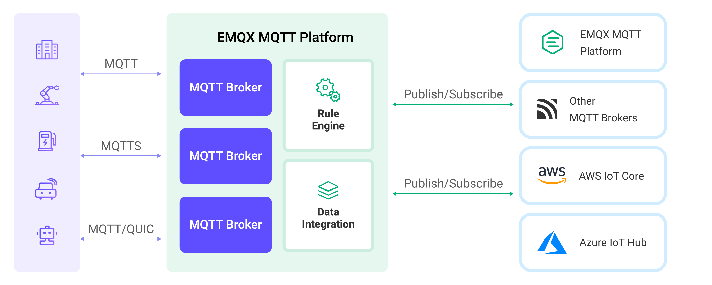

# 他の MQTT サービスとのブリッジ

MQTT ブローカーのデータ統合は、EMQX に別の EMQX クラスターや他の MQTT サービスへの接続機能を提供し、メッセージブリッジを実現します。これにより、ネットワークやサービスを跨いだデータの相互作用と通信が可能になります。本ページでは、EMQX における MQTT メッセージブリッジの動作原理を紹介し、メッセージブリッジの作成および検証に関する実践的なガイダンスを提供します。

## 動作原理

ブリッジング中、EMQX はターゲットサービスとクライアントとして MQTT 接続を確立し、パブリッシュ・サブスクライブモデルを通じて双方向のメッセージ伝送を実現します：

- 送信メッセージ（Sink）：ローカルのトピックからリモート MQTT サービスの指定トピックへメッセージをパブリッシュする。
- 受信メッセージ（Source）：リモート MQTT サービスのトピックをサブスクライブし、そのメッセージをローカルの EMQX に転送する。

EMQX は同一接続上で複数のブリッジングルールを設定可能で、それぞれ異なるトピックマッピングやメッセージ変換ルールを持ち、メッセージルーティングに類似した機能を実装しています。ブリッジング中は、ルールエンジンを介してメッセージのフィルタリング、拡充、変換処理を行うことも可能です。

以下の図は、EMQX と他の MQTT サービス間のデータ統合の典型的なアーキテクチャを示しています：



## 特徴と利点

MQTT ブローカーのデータ統合は以下の特徴と利点を備えています：

- **幅広い互換性**：標準 MQTT プロトコルを使用しているため、AWS IoT Core、Azure IoT Hubs を含む様々な IoT プラットフォームとブリッジ可能であり、オープンソースや他の業界 MQTT ブローカー、IoT プラットフォームもサポートします。これにより、多様なデバイスやプラットフォームとのシームレスな統合と通信が可能です。
- **双方向データフロー**：双方向のデータフローをサポートし、EMQX からリモート MQTT サービスへのメッセージパブリッシュ、および MQTT サービスからのメッセージサブスクライブとローカルパブリッシュを可能にします。この双方向通信機能により、異なるシステム間のデータ転送がより柔軟かつ制御可能になります。
- **柔軟なトピックマッピング**：MQTT のパブリッシュ・サブスクライブモデルに基づき、柔軟なトピックマッピングを実装しています。トピックにプレフィックスを追加したり、クライアントのコンテキスト情報（クライアントID、ユーザー名など）を使って動的にトピックを構築したりできます。この柔軟性により、特定のニーズに応じたメッセージ処理やルーティングが可能です。
- **高性能**：接続プーリングや共有サブスクリプションなどのパフォーマンス最適化オプションを提供し、個々のブリッジクライアントの負荷を軽減、ブリッジングのレイテンシ低減とメッセージスループット向上を実現します。これらの最適化により、システム全体のパフォーマンスとスケーラビリティが向上します。
- **ペイロード変換**：SQL ルールを定義することでメッセージペイロードの処理が可能です。つまり、メッセージ伝送中にデータ抽出、フィルタリング、拡充、変換などの操作をペイロードに対して実行できます。例えば、リアルタイムのメトリクスをペイロードから抽出し、変換・処理してからリモート MQTT ブローカーに届けることができます。
- **メトリクス監視**：各 Sink/Source ごとにランタイムのメトリクス監視が提供され、総メッセージ数、成功/失敗数、現在のレートなどを確認可能です。これにより、ユーザーは Sink/Source のパフォーマンスや状態をリアルタイムで監視・評価できます。

## MQTT 接続情報の準備

::: tip 前提条件

以下を理解していることを確認してください：

- [ルールエンジン](./rules.md)
- [データ統合](./data-bridges.md)

:::

MQTT ブローカーのデータ統合を作成する前に、リモート MQTT サービスの接続情報を取得する必要があります。ここでは EMQX の [オンライン MQTT サーバー](https://www.emqx.com/en/mqtt/public-mqtt5-broker) を例に説明します：

- **MQTT サービスアドレス**：ターゲット MQTT サービスのアドレスとポート。例：`broker.emqx.io:1883`。
  - サポートされる形式は `host:port`、`[IPv6]:port`、`mqtt://host:port`、`mqtt://[IPv6]:port`、`mqtts://host:port`、`mqtts://[IPv6]:port` です。ポートが省略された場合、EMQX はデフォルトの MQTT ポート `1883` を使用します。その他の URI スキームはサポートされません。
  - TLS はコネクター設定で別途構成します。アドレススキームと TLS 設定の関係は以下の通りです：
    - アドレスが明示的に `mqtts://` を使用している場合は TLS を有効にする必要があります。そうでない場合、**接続テスト**は失敗し、コネクターは起動できません。
    - アドレスが `mqtt://` で TLS が有効な場合は TLS 設定が優先され、EMQX は TLS 接続を行い警告をログに出します。
    - スキームなしのアドレスの場合、TLS 設定により TLS 使用の有無が決まります。
- **ユーザー名**：接続に必要なユーザー名。ターゲットサービスが認証不要の場合は空欄で構いません。
- **パスワード**：接続に必要なパスワード。ターゲットサービスが認証不要の場合は空欄で構いません。
- **プロトコルタイプ**：ターゲットサービスが TLS を有効にしているか、TCP/TLS 上の MQTT を使用しているかを確認してください。EMQX MQTT ブリッジは現時点で MQTT over WebSocket や MQTT over QUIC などのプロトコルはサポートしていません。
- **プロトコルバージョン**：ターゲット MQTT サービスが使用するプロトコルバージョン。EMQX は MQTT 3.1、3.1.1、および MQTT 5.0 をサポートしています。

データ統合は EMQX や他の標準 MQTT サーバーとの互換性とサポートが優れています。その他のタイプの MQTT サービスに接続する場合は、該当サービスのドキュメントを参照して接続情報を取得してください。一般的に多くの IoT プラットフォームは標準的な MQTT アクセス方法を提供しており、それに基づいてデバイス情報を上記の MQTT 接続情報に変換できます。

::: tip 注意

EMQX がクラスター運用中、または接続プールが有効な場合、同一クライアントIDを使って複数ノードが同じ MQTT サービスに接続すると、デバイスの競合が発生しやすくなります。そのため、MQTT メッセージブリッジでは現時点で固定クライアントIDの設定をサポートしていません。

:::

## コネクターの作成

ここではリモート MQTT サーバーとの接続を設定する方法を説明します。

1. ダッシュボードの **Integration** -> **Connector** ページに移動します。

2. ページ右上の **Create** をクリックします。

3. コネクタータイプ一覧から **MQTT Broker** を選択し、**Next** をクリックします。

4. コネクターの **名前** を入力します。英数字の組み合わせで、例として `my_mqtt_bridge` などが挙げられます。

5. 接続情報を設定します：
   - **MQTT Broker**：MQTT コネクターは TCP/TLS 上の MQTT のみをサポートします。MQTT サービスアドレスを入力します。例：`broker.emqx.io:1883`、`[::1]:1883`、`mqtt://broker.emqx.io:1883`。
   - **Enable TLS**：TLS 対応の MQTT リスナーに接続する場合はこのオプションを有効にします。アドレスが明示的に `mqtts://` の場合は必須です。スキームなしのアドレスの場合、この設定が TLS 利用の有無を決定します。
   - **ClientID Prefix**：空欄でも構いません。実際にはクライアントIDプレフィックスを指定するとクライアント管理が容易になります。EMQX はクライアントIDプレフィックスと接続プールのサイズに基づいてクライアントIDを自動生成します。詳細は [接続プールとクライアントID生成ルール](#connection-pool-and-client-id-generation-rules) を参照してください。
   - **Username** と **Password**：MQTT ブローカーが認証を要求する場合は、クライアントIDに対応するユーザー名とパスワードを入力します。認証不要（パブリックブローカーなど）の場合は空欄で構いません。
   - **Keepalive**：希望するキープアライブ間隔を指定します。
   - **MQTT Version**：ブローカー接続に適したバージョンを選択します。
   - **Static ClientId Entries**：Azure IoT Hubs などのサービスに接続する際に安定した接続を確保するために、静的クライアントIDを設定できます。設定方法は [静的クライアントIDの設定](#configure-static-client-ids) を参照してください。

     ::: tip

     静的クライアントIDエントリーが定義されている場合、静的クライアントIDが割り当てられた EMQX ノードのみが MQTT 接続を開始します。

     :::

その他の設定はデフォルトのままにして、**Create** ボタンをクリックしコネクターの作成を完了します。作成したコネクターは Sink と Source の両方で使用可能です。次に、このコネクターを基にデータブリッジルールを作成できます。

### 接続プールとクライアントID生成ルール

EMQX は複数のクライアントが同時にブリッジ先 MQTT サービスに接続できるようにします。コネクター作成時に MQTT クライアント接続プールを設定し、そのサイズを指定できます。接続プールはサーバーリソースを最大限活用し、メッセージスループットと同時接続性能を向上させ、高負荷・高同時接続シナリオに対応します。

MQTT プロトコルはサーバーに接続するクライアントに一意のクライアントIDを要求します。EMQX はクラスター展開が可能なため、MQTT ブリッジの各クライアントに一意のクライアントIDを割り当てます。EMQX は以下のパターンでクライアントIDを自動生成します：

```bash
[Client ID Prefix]:{Connector Name}{8桁のランダム文字列}:{プール内接続のシーケンス番号}
```

例として、クライアントIDプレフィックスが `myprefix`、コネクター名が `foo` の場合、実際のクライアントIDは以下のようになります：

```bash
myprefix:foo2bd61c44:1
```

バージョン 5.4.1 以降、EMQX は MQTT クライアントIDの長さを最大 23 バイトに制限しています。これを超える場合はハッシュ値に置き換えられます。プレフィックスやコネクター名が長すぎるとユーザー体験が悪化する可能性があります。

この問題に対処するため、バージョン 5.7.1 以降では以下のルールを実装しています：

- **プレフィックスなし**：動作は変わらず、長い（23バイト超）クライアントIDは 23 バイトにハッシュ化されます。
- **プレフィックスあり**：
  - **プレフィックスが19バイト以下**：プレフィックスは保持され、それ以外の部分は 4 バイトのハッシュに変換され、全体の長さを23バイト以内に収めます。
  - **プレフィックスが20バイト以上**：設定されたプレフィックスをそのまま使用し、クライアントIDの短縮は行いません。

### 静的クライアントIDの設定

特定のユースケースでは、統合に使用するクライアントIDが有限の場合があります。その場合、コネクター設定時に個々のノードに静的クライアントIDセットを割り当てることが可能です。静的クライアントIDを設定するには、EMQX クラスターの各ノードごとにクライアントIDのリストを提供します。各クライアントIDには対応するユーザー名とパスワードを指定できます。これは Azure IoT Hubs のように、各デバイス（クライアントID）が固有の認証情報を必要とするシナリオで特に有用です。

静的クライアントIDを設定する手順は以下の通りです：

1. **Static ClientId Entries** セクションで **Add** ボタンをクリックし、新しい静的クライアントIDエントリーを追加します。必要に応じて複数のノードのエントリーを追加可能です。

2. 各エントリーに以下の項目を入力します：

   - **Node Name**：クライアントIDを割り当てるノード名。例：`emqx@10.0.0.1`。
   - **Client ID**：静的クライアントIDを入力。例：`device1`。必要に応じて複数のクライアントIDを追加可能です。
     - **Username**：（任意）認証用のユーザー名。
     - **Password**：（任意）認証用のパスワード。プラットフォームによりデバイス固有のキー、シークレット、証明書などが使用されます（例：Azure IoT Hubs の認証キー）。

   **設定例**：

   | ノード名           | クライアントID | ユーザー名（任意） | パスワード（任意） |
   | ------------------ | -------------- | ------------------ | ------------------ |
   | `emqx@10.0.0.1`    | `clientid1`    | `username1`        | `secret1`          |
   |                    | `clientid3`    |                    |                    |
   | `emqx@10.0.0.2`    | `clientid2`    | `username2`        |                    |
   | `emqx@10.0.0.3`    | `clientid4`    |                    |                    |
   |                    | `clientid5`    |                    |                    |

設定ファイルでノードごとに `static_clientids` パラメータを個別に定義することも可能です。

静的クライアントIDが設定されている場合、これらのクライアントIDを使用した MQTT 接続のみが開始されます。`pool_size` や `clientid_prefix` など動的クライアントIDに関する設定は無効になります。

## MQTT ブローカー Sink を使ったルールの作成

ここでは、リモート MQTT サービスへ転送するデータを指定するルールの作成方法を示します。

1. ダッシュボードの **Integration** -> **Rules** ページに移動します。

2. ページ右上の **Create** をクリックします。

3. ルールIDに `my_rule` を入力します。

4. **SQL エディター**に、`t/#` トピックからの MQTT メッセージをリモート MQTT サーバーに保存するルールを入力します。SQL は以下の通りです：

   ```sql
   SELECT
     *
   FROM
     "t/#"
   ```

   MQTTv5 プロトコルを使用している場合、`pub_props` フィールドをルール SQL に含めると、パブリッシュプロパティがそのままリモートブローカーに転送されます。上記の `SELECT * FROM t/#` の例がこれに該当します。

   ユーザープロパティを動的に追加したい場合は、ルールの出力に含める `pub_props` フィールドに追加できます。例えば、以下のルールはペイロードからキーと値を取得してユーザープロパティを追加します：

   ```sql
   SELECT
     *,
     map_put(concat('User-Property.', payload.extra_key), payload.extra_value, pub_props) as pub_props
   FROM
     't/#'
   ```

5. アクションを追加し、**Action Type** ドロップダウンから `MQTT Broker` を選択します。**Action** ドロップダウンはデフォルトの `Create Action` のままにします。この操作で新しい Sink が作成され、ルールに追加されます。

6. Sink の名前と説明をフォームに入力します。

7. **Connector** ドロップダウンから先ほど作成した `my_mqtt_bridge` コネクターを選択します。必要に応じて、ドロップダウン横の作成ボタンから新しいコネクターを作成することも可能です（[コネクターの作成](#create-a-connector) を参照）。

8. EMQX から外部 MQTT サービスへメッセージをパブリッシュする Sink 情報を設定します：

   - **Topic**：外部 MQTT サービスにパブリッシュするトピック。`${var}` プレースホルダーをサポートします。ここでは `pub/${topic}` と入力し、元のトピックに `pub/` プレフィックスを付けて転送します。例えば元のメッセージトピックが `t/1` の場合、外部 MQTT サービスに転送されるトピックは `pub/t/1` となります。
   - **QoS**：メッセージパブリッシュの QoS。ドロップダウンから `0`、`1`、`2`、`${qos}` のいずれかを選択可能です。ここでは元のメッセージの QoS に従うため `${qos}` を選択します。
   - **Retain**：メッセージをリテインとしてパブリッシュするかどうか。`true`、`false`、`${flags.retain}` を選択可能で、他のフィールドからリテインフラグを設定するプレースホルダーも使えます。ここでは元のメッセージのリテインフラグに従うため `${flags.retain}` を選択します。
   - **Payload**：転送メッセージのペイロード生成に使うテンプレート。デフォルトは空欄でルールの出力結果を転送します。ここでは `${payload}` を入力し、ペイロードのみを転送します。

9. **フォールバックアクション（任意）**：メッセージ配信失敗時の信頼性向上のため、1つ以上のフォールバックアクションを定義できます。詳細は [フォールバックアクション](./data-bridges.md#fallback-actions) を参照してください。

10. その他の設定はデフォルトのままにして、**Create** ボタンをクリックし Sink の作成を完了します。作成後はルール作成ページに戻り、新しい Sink がルールのアクション出力に追加されます。

11. ルール作成ページ下部の **Create** ボタンをクリックし、ルール作成を完了します。

これでルールが正常に作成されました。**Integration** -> **Rules** ページで新規ルールを確認できます。**Actions(Sink)** タブをクリックすると、新しい MQTT ブローカー Sink が表示されます。

また、**Integration** -> **Flow Designer** をクリックするとトポロジーを確認できます。トポロジーは、`t/#` トピックのメッセージがルール `my_rule` によって処理され、リモート MQTT ブローカーに送信される様子を視覚的に表現しています。

## MQTT ブローカー Sink を使ったルールのテスト

[MQTTX CLI](https://mqttx.app/zh/cli) を使って、EMQX の `t/#` トピックから外部 MQTT サービスの `pub/${topic}` トピックへメッセージがブリッジされるルールをテストできます。EMQX の `t/1` トピックにメッセージをパブリッシュすると、外部 MQTT サービスの `pub/t/1` トピックに転送されるはずです。

1. 外部 MQTT サービスで `pub/#` トピックをサブスクライブします：

   ```bash
   mqttx sub -t pub/# -q 1 -h broker.emqx.io -v
   ```

2. MQTTX で `t/1` トピックにメッセージをパブリッシュします：

   ```bash
   mqttx pub -t t/1 -m "hello world" -r
   ```

3. MQTTX で `pub/t/1` トピックをサブスクライブすると、メッセージが受信でき、EMQX から外部 MQTT サービスへの転送が成功したことが確認できます：

   ```bash
   [2024-1-31] [16:43:13] › topic: pub/t/1
   payload: hello world
   ```

4. ステップ1を繰り返すと、`pub/t/1` トピックのリテインメッセージも MQTTX で確認できます：

   ```bash
   [2024-1-31] [16:44:29] › topic: pub/t/1
   payload: hello world
   retain: true
   ```

## MQTT ブローカー Source を使ったルールの作成

ここでは、リモート MQTT サービスからローカル EMQX へデータを転送するルールの作成方法を示します。MQTT Source とメッセージ再パブリッシュアクションを作成し、リモート MQTT サービスから EMQX へのサブスクライブとデータ転送を実現します。

### MQTT ブローカー Source の作成とルールへの追加

1. ダッシュボードの **Integration** -> **Rules** ページに移動します。

2. ページ右上の **Create** をクリックします。

3. ルールIDに `my_rule_source` を入力します。

4. ルールのトリガーソース（データ入力）を設定します。ページ右側の **Data Inputs** タブで、デフォルトの **Message** タイプ入力を削除し、**Add Input** をクリックして MQTT Source を作成します。

5. **Add Input** ポップアップで、**Input Type** ドロップダウンから `MQTT Broker` を選択し、Source ドロップダウンはデフォルトの `Create Source` のままにします。この操作で新しい Source が作成され、ルールに追加されます。

6. Source の名前と説明をフォームに入力します。

7. 先ほど作成した `my_mqtt_bridge` コネクターをドロップダウンから選択します。必要に応じて、ドロップダウン横の作成ボタンから新しいコネクターを作成可能です（[コネクターの作成](#create-a-connector) を参照）。

8. Source 情報を設定し、外部 MQTT サービスから EMQX へのサブスクライブを完了します：

   - **Topic**：サブスクライブするトピック。`+` と `#` のワイルドカードをサポートします。

     ::: tip

     EMQX がクラスター運用中、またはコネクターが接続プールを使用している場合は、重複メッセージを避けるため共有サブスクリプションを使用する必要があります。

     :::

     ここでは `$share/1/f/#` と入力し、`f/#` にマッチする全メッセージをサブスクライブします。

   - **QoS**：サブスクライブの QoS。ドロップダウンから `0` または `1` を選択します。

   - **No Local**：同じコネクターでパブリッシュしたメッセージをこの Source がサブスクライブしている場合に、リモート MQTT ブローカーがそれらのメッセージを Source に再転送しないようにするオプションです。デフォルトは無効で、コネクターが MQTT 5.0 を使用している場合のみ有効です。

   - **Retain As Published**：上流 MQTT ブローカーから転送されるメッセージの元のリテインフラグを保持するオプションです。無効の場合、上流ブローカーはリテインフラグをクリアします。デフォルトは有効で、コネクターが MQTT 5.0 を使用している場合のみ有効です。

9. その他の設定はデフォルトのままにして、**Create** ボタンをクリックし Source の作成を完了します。これにより Source がルールのデータ入力に追加されます。ルール SQL は以下のように変更されます：

   ```sql
   SELECT
     *
   FROM
     "$bridges/mqtt:my_source"
   ```

   ルール SQL は MQTT Source から以下のフィールドを抽出可能で、データ処理のために SQL を調整できます。デフォルトの SQL は本例に十分です。

   | フィールド名                    | 説明                                                      |
   | ----------------------------- | --------------------------------------------------------- |
   | topic                         | 元のメッセージトピック                                   |
   | server                        | 接続された Source のサーバーアドレス                      |
   | retain                        | 上流 MQTT ブローカーから受信したメッセージのリテインフラグ。**Retain As Published** が無効の場合は `false` |
   | qos                           | メッセージの QoS（サービス品質）                          |
   | pub_props                     | MQTT 5.0 メッセージプロパティオブジェクト（ユーザープロパティペアなどを含む） |
   | pub_props.User-Property-Pairs | キーと値のペアを含むユーザープロパティペアの配列、例：`{"key":"foo", "value":"bar"}` |
   | pub_props.User-Property       | キーと値のペアを含むユーザープロパティオブジェクト、例：`{"foo":"bar"}` |
   | pub_props.*                   | その他のメッセージプロパティのキーと値のペア、例：`Content-Type: JSON` |
   | payload                       | メッセージ内容                                            |
   | message_received_at           | メッセージ受信タイムスタンプ（ミリ秒）                   |
   | id                            | メッセージID                                              |
   | dup                           | メッセージが重複かどうか                                  |

これで MQTT Source の作成は完了しましたが、サブスクライブしたデータはローカル EMQX に直接パブリッシュされません。次に、Source がサブスクライブしたメッセージをローカル EMQX に転送するためのメッセージ再パブリッシュアクションを作成します。

### 再パブリッシュアクションの作成

1. ルール作成ページの右側 **Action Outputs** タブに切り替え、**Add Action** ボタンをクリックします。**Type of Action** ドロップダウンから `Republish` アクションを選択します。

2. メッセージ再パブリッシュの設定を行います：
   - **Topic**：`sub/${topic}` と入力し、元のトピックに `sub/` プレフィックスを付けて転送します。例えば元のメッセージトピックが `f/1` の場合、EMQX に転送されるトピックは `sub/f/1` となります。
   - **QoS**：`0`、`1`、`2`、`${qos}` から選択可能です。プレースホルダーを使って他フィールドから QoS を設定することもできます。ここでは元のメッセージの QoS に従うため `${qos}` を選択します。
   - **Retain**：`true` または `false` を選択し、メッセージをリテインとしてパブリッシュするかを決定します。プレースホルダーを使って他フィールドからリテインフラグを設定することも可能です。ここでは `false` を選択します。
     - データソースが MQTT Source のため、`${flags.retain}` はここでは使用できません。
     - `${retain}` を入力して MQTT Source が受信したリテインフラグに従うことも可能です。MQTT 5.0 接続の場合は Source で **Retain As Published** を有効にして上流のリテインフラグを保持してください。
   - **Payload**：転送メッセージのペイロード生成に使用します。デフォルトは空欄でルールの出力結果を転送します。ここでは `${payload}` を入力し、ペイロードのみを転送します。

3. **Add** ボタンをクリックしアクション作成を完了します。ルール作成ページに戻り、新しいアクションが **Action Outputs** タブに追加されます。

4. ルール作成ページ下部の **Create** ボタンをクリックし、ルール作成を完了します。

これでルールが正常に作成されました。**Integration** -> **Rules** ページで新規ルールを確認できます。**Source** タブをクリックすると、新しい MQTT Source が表示されます。

また、**Integration** -> **Flow Designer** をクリックするとトポロジーを確認できます。トポロジーでは MQTT Source からのメッセージが再パブリッシュアクションを通じて `sub/${topic}` に転送されている様子が視覚的に示されています。

## MQTT ブローカー Source を使ったルールのテスト

[MQTTX CLI](https://mqttx.app/zh/cli) を使って、外部 MQTT サービスの `f/#` トピックから EMQX の `sub/${topic}` トピックへメッセージがブリッジされるルールをテストできます。外部 MQTT サービスの `f/1` トピックにメッセージをパブリッシュすると、EMQX の `sub/f/1` トピックに転送されるはずです。

1. EMQX の `sub/#` トピックをサブスクライブします：

   ```bash
   mqttx sub -t sub/# -q 1 -v
   ```

2. MQTTX を使って外部 MQTT サービスの `f/1` トピックにメッセージをパブリッシュします：

   ```bash
   mqttx pub -t f/1 -m "I'm from broker.emqx.io" -r -h broker.emqx.io
   ```

3. MQTTX で `sub/f/1` トピックにパブリッシュされたメッセージを確認できれば、外部 MQTT サービスから EMQX への転送が成功したことを示します：

   ```bash
   [2024-1-31] [16:49:22] › topic: sub/f/1
   payload: I'm from broker.emqx.io
   ```
