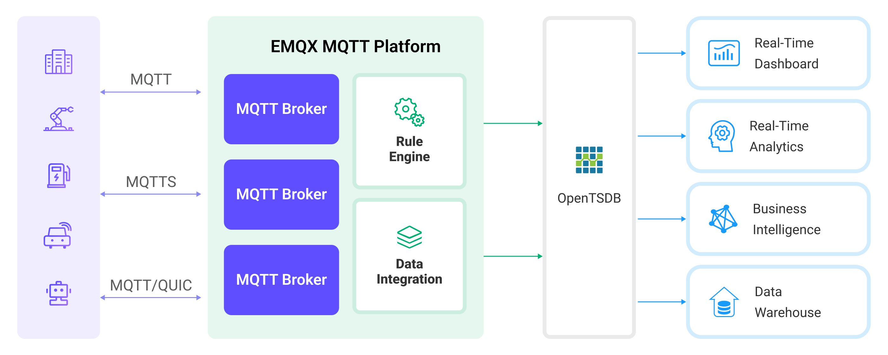

# OpenTSDBへのMQTTデータ取り込み

[OpenTSDB](http://opentsdb.net/)はスケーラブルで分散型の時系列データベースです。EMQXはOpenTSDBとの連携をサポートしており、MQTTメッセージをOpenTSDBに保存して後続の分析や取得に利用できます。

本ページでは、EMQXとOpenTSDB間のデータ連携について包括的に紹介し、データ連携の作成と検証方法を実践的に解説します。

## 動作概要

OpenTSDBデータ連携はEMQXの標準機能であり、EMQXのリアルタイムデータキャプチャと転送機能をOpenTSDBのデータ保存・分析機能と組み合わせています。組み込みの[ルールエンジン](./rules.md)コンポーネントにより、EMQXからOpenTSDBへのデータ取り込みを簡素化し、複雑なコーディングを不要にします。

以下の図はEMQXとOpenTSDB間の典型的なデータ連携アーキテクチャを示しています：



EMQXはルールエンジンとSinkを通じてデバイスデータをOpenTSDBに挿入します。OpenTSDBは豊富なクエリ機能を提供し、レポートやグラフなどのデータ分析結果の生成をサポートします。産業用エネルギー管理シナリオを例にすると、ワークフローは以下の通りです：

1. **メッセージのパブリッシュと受信**：産業用デバイスはMQTTプロトコルでEMQXに正常に接続し、定期的にエネルギー消費データをパブリッシュします。このデータには生産ライン識別子やエネルギー消費値が含まれます。EMQXがこれらのメッセージを受信すると、ルールエンジン内でマッチング処理を開始します。
2. **ルールエンジンによるメッセージ処理**：組み込みのルールエンジンはトピックマッチングに基づき特定のソースからのメッセージを処理します。メッセージが到着するとルールエンジンを通過し、対応するルールと照合されてメッセージデータが処理されます。これにはデータフォーマットの変換、特定情報のフィルタリング、メッセージへのコンテキスト情報付加などが含まれます。
3. **OpenTSDBへのデータ取り込み**：ルールエンジンで定義されたルールがトリガーとなり、メッセージをOpenTSDBに書き込む操作が実行されます。

データがOpenTSDBに書き込まれた後は、以下のように柔軟に活用できます：

- Grafanaなどの可視化ツールと接続し、エネルギー貯蔵データを表示するグラフを生成する。
- 業務システムと連携し、エネルギー貯蔵装置の状態監視やアラート発報に利用する。

## 特長と利点

OpenTSDBデータ連携は以下の特長と利点を提供します：

- **効率的なデータ処理**：EMQXは膨大なIoTデバイス接続数とメッセージスループットを処理可能であり、OpenTSDBはデータ書き込み・保存・クエリに優れた性能を発揮します。これによりIoTシナリオのデータ処理要件をシステム負荷を抑えつつ満たせます。
- **メッセージ変換**：メッセージはEMQXのルールを通じて多様な処理や変換を経てからOpenTSDBに書き込まれます。
- **大規模データ保存**：EMQXとOpenTSDBを連携することで、大量のデバイスデータを直接OpenTSDBに保存できます。OpenTSDBは大規模時系列データの保存・クエリに特化したデータベースであり、IoTデバイスが生成する膨大な時系列データを効率的に扱えます。
- **豊富なクエリ機能**：OpenTSDBの最適化されたストレージ構造とインデックスにより、数十億のデータポイントの高速書き込み・クエリが可能です。リアルタイム監視や分析、可視化が求められるIoTデバイスデータの用途に非常に適しています。
- **スケーラビリティ**：EMQXとOpenTSDBは共にクラスター拡張が可能であり、ビジネスの成長に応じて柔軟に水平拡張できます。

## はじめる前に

本節ではOpenTSDBデータ連携の作成を始める前に必要な準備、特にOpenTSDBサーバーのセットアップ方法について説明します。

### 前提条件

- EMQXデータ連携の[ルール](./rules.md)に関する知識
- [データ連携](./data-bridges.md)に関する知識

### OpenTSDBのインストール

Dockerを使ってOpenTSDBをインストールし、Dockerイメージを起動します（現時点ではx86プラットフォームのみ対応）。

```bash
docker pull petergrace/opentsdb-docker

docker run -d --name opentsdb -p 4242:4242 petergrace/opentsdb-docker
```

## コネクターの作成

本節ではSinkをOpenTSDBサーバーに接続するためのコネクター作成方法を示します。

以下の手順はEMQXとOpenTSDBをローカルマシン上で実行していることを前提としています。リモートで稼働している場合は設定を適宜調整してください。

1. EMQXダッシュボードに入り、**Integration** -> **Connectors**をクリックします。
2. ページ右上の**Create**をクリックします。
3. **Create Connector**ページで**OpenTSDB**を選択し、**Next**をクリックします。
4. **Configuration**ステップで以下を設定します：
   - コネクター名を入力します。英大文字・小文字と数字の組み合わせで、例：`my_opentsdb`
   - **Server Host**に`http://127.0.0.1:4242`を入力します。OpenTSDBサーバーがリモートの場合は実際のURLを指定してください。
   - その他のオプションはデフォルトのままにします。
5. 詳細設定（任意）：詳細は[Sinkの特長](./data-bridges.md#features-of-sink)を参照してください。
6. **Create**をクリックする前に、**Test Connectivity**をクリックしてコネクターがOpenTSDBサーバーに接続できるかテストできます。
7. ページ下部の**Create**ボタンをクリックしてコネクター作成を完了します。ポップアップダイアログで**Back to Connector List**または**Create Rule**をクリックして、OpenTSDBに転送するデータを指定するルールとSinkの作成を続けられます。詳細は[OpenTSDB Sink付きルールの作成](#create-a-rule-with-opentsdb-sink)を参照してください。

## OpenTSDB Sink付きルールの作成

本節では、ダッシュボードでMQTTトピック`t/#`からのメッセージを処理し、処理済みデータを設定済みのSink経由でOpenTSDBに保存するルールの作成方法を示します。

1. EMQXダッシュボードで**Integration** -> **Rules**をクリックします。

2. ページ右上の**Create**をクリックします。

3. ルールIDに`my_rule`を入力し、**SQL Editor**に以下の文を設定します。これはトピック`t/#`配下のMQTTメッセージをOpenTSDBに保存することを意味します。

   注意：独自のSQL構文を指定する場合は、Sinkで必要な全てのフィールドが`SELECT`句に含まれていることを確認してください。

   ```sql
   	SELECT
     		payload.metric as metric, payload.tags as tags, payload.value as value
   	FROM
     		"t/#"
   ```

   注意：初心者の方は**SQL Examples**をクリックし、**Enable Test**でSQLルールの学習とテストが可能です。

4. **+ Add Action**ボタンをクリックし、ルールでトリガーされるアクションを定義します。このアクションによりEMQXはルールで処理したデータをOpenTSDBに送信します。

5. **Type of Action**ドロップダウンから`OpenTSDB`を選択します。**Action**はデフォルトの`Create Action`のままにします。既に作成済みのSinkがあれば選択可能です。本デモでは新規Sinkを作成します。

6. Sinkの名前を入力します。英大文字・小文字と数字の組み合わせで指定してください。

7. **Connector**ドロップダウンから先ほど作成した`my_opentsdb`を選択します。隣のボタンで新規コネクターを作成することも可能です。設定パラメータは[コネクターの作成](#create-a-connector)を参照してください。

8. **Write Data**欄で、MQTTメッセージをOpenTSDBが要求する形式に正しく変換して書き込む方法を指定します。例えばクライアントが以下のデータを報告するとします：

   - トピック：`t/opents`
   - ペイロード：

   ```json
   {
     "metric": "cpu",
     "tags": {
       "host": "serverA"
     },
     "value": 12
   }
   ```

   提供されたペイロードのデータ形式に基づき、以下の情報を設定します：

   - **Timestamp**：OpenTSDBはデータポイントの時刻を記録するためタイムスタンプが必要です。MQTTメッセージにタイムスタンプがない場合、EMQXのSink設定で現在時刻をタイムスタンプとして使用するか、クライアントの報告データ形式にタイムスタンプフィールドを追加する必要があります。
   - **Metric**：例では`"metric": "cpu"`がメトリック名`cpu`を示しています。
   - **Tags**：タグはメトリックに関する追加情報を表します。ここでは`"tags": {"host": "serverA"}`で、このメトリックデータがホスト`serverA`からのものであることを示します。
   - **Value**：実際のメトリック値です。例では`"value": 12`でメトリック値が12であることを示しています。

9. **フォールバックアクション（任意）**：メッセージ配信失敗時の信頼性向上のため、1つ以上のフォールバックアクションを定義できます。これらはプライマリSinkがメッセージ処理に失敗した際にトリガーされます。詳細は[フォールバックアクション](./data-bridges.md#fallback-actions)を参照してください。

10. **詳細設定（任意）**：必要に応じて**sync**または**async**クエリモードを選択します。詳細は[Sinkの特長](./data-bridges.md#features-of-sink)の該当設定情報を参照してください。

11. **Create**をクリックする前に、**Test Connectivity**をクリックしてSinkがOpenTSDBサーバーに接続可能かテストできます。

12. **Create**ボタンをクリックしてSink設定を完了します。新しいSinkが**Action Outputs**に追加されます。

13. **Create Rule**ページに戻り、設定内容を確認して**Create**ボタンをクリックしルールを生成します。

これでOpenTSDB Sink経由でデータ転送を行うルールが正常に作成されました。**Integration** -> **Rules**ページで新規作成ルールを確認できます。**Actions(Sink)**タブをクリックすると新しいOpenTSDB Sinkが表示されます。

また、**Integration** -> **Flow Designer**をクリックするとトポロジーが表示され、トピック`t/#`配下のメッセージがルール`my_rule`で解析されOpenTSDBに送信・保存されている様子が確認できます。

## ルールのテスト

MQTTXを使ってトピック`t/opents`にメッセージをパブリッシュします。

```bash
mqttx pub -i emqx_c -t t/opents -m '{"metric":"cpu","tags":{"host":"serverA"},"value":12}'
```

Sinkの稼働状況を確認すると、新規の受信メッセージ数と送信メッセージ数が1つずつ増えているはずです。

OpenTSDBにデータが書き込まれているか確認します：

```bash
curl -X POST -H "Accept: Application/json" -H "Content-Type: application/json" http://localhost:4242/api/query -d '{
    "start": "1h-ago",
    "queries": [
        {
            "aggregator": "last",
            "metric": "cpu",
            "tags": {
                "host": "*"
            }
        }
    ],
    "showTSUIDs": "true",
    "showQuery": "true",
    "delete": "false"
}'
```

クエリ結果の整形済み出力例は以下の通りです：

```json
[
  {
    "metric": "cpu",
    "tags": {
      "host": "serverA"
    },
    "aggregateTags": [],
    "query": {
      "aggregator": "last",
      "metric": "cpu",
      "tsuids": null,
      "downsample": null,
      "rate": false,
      "filters": [
        {
          "tagk": "host",
          "filter": "*",
          "group_by": true,
          "type": "wildcard"
        }
      ],
      "percentiles": null,
      "index": 0,
      "rateOptions": null,
      "filterTagKs": [
        "AAAB"
      ],
      "explicitTags": false,
      "useFuzzyFilter": true,
      "preAggregate": false,
      "rollupUsage": null,
      "rollupTable": "raw",
      "showHistogramBuckets": false,
      "useMultiGets": true,
      "tags": {
        "host": "wildcard(*)"
      },
      "histogramQuery": false
    },
    "tsuids": [
      "000001000001000001"
    ],
    "dps": {
      "1683532519": 12
    }
  }
]
```
