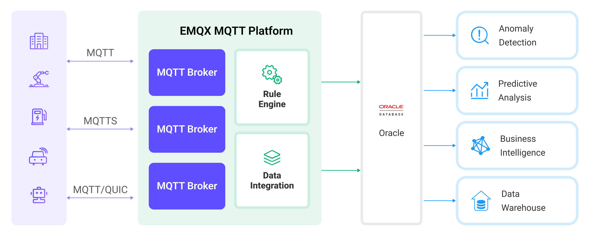

# Oracle Database に MQTT データを取り込む

[Oracle Database](https://www.oracle.com/database/) は、企業や組織のさまざまな規模・種類で広く利用されている主要なリレーショナル商用データベースソリューションの一つです。EMQX は Oracle Database との統合をサポートしており、MQTT メッセージやクライアントイベントを Oracle Database に保存できます。これにより、複雑なデータパイプラインや分析プロセスの構築、データ管理や分析、デバイス接続管理、ERP や CRM など他のエンタープライズシステムとの統合が可能になります。

本ページでは、EMQX と Oracle Database 間のデータ統合について包括的に紹介し、データ統合の作成および検証に関する実践的な手順を提供します。

## 動作の仕組み

Oracle Database とのデータ統合は、MQTT ベースの IoT データと Oracle Database の強力なデータストレージ機能をつなぐために EMQX に標準搭載された機能です。組み込みの[ルールエンジン](./rules.md)コンポーネントを利用することで、EMQX から Oracle Database へのデータ取り込みを簡素化し、複雑なコーディングを不要にします。

以下の図は、EMQX と Oracle Database 間のデータ統合の典型的なアーキテクチャを示しています。



Oracle Database への MQTT データ取り込みは以下のように動作します：

1. **メッセージのパブリッシュと受信**：産業用 IoT デバイスは MQTT プロトコルを介して EMQX に正常に接続し、機械、センサー、製品ラインの稼働状態、測定値、またはトリガーされたイベントに基づくリアルタイムの MQTT データを EMQX にパブリッシュします。EMQX がこれらのメッセージを受信すると、ルールエンジン内でマッチング処理を開始します。  
2. **メッセージデータの処理**：メッセージが到着するとルールエンジンを通過し、EMQX に定義されたルールに従って処理されます。ルールは事前定義された条件に基づき、どのメッセージを Oracle Database にルーティングするかを決定します。ペイロード変換が指定されている場合は、データ形式の変換、特定情報のフィルタリング、追加コンテキストによるペイロードの強化などの変換が適用されます。
3. **Oracle Database へのデータ取り込み**：ルールはメッセージの Oracle Database への書き込みをトリガーします。SQL テンプレートを利用して、ルール処理結果からデータを抽出し SQL を構築、Oracle Database に送信して実行します。これにより、メッセージの特定フィールドを対応するデータベースのテーブルおよびカラムに書き込んだり更新したりできます。
4. **データの保存と活用**：データが Oracle Database に保存されることで、企業はそのクエリ機能を活用してさまざまなユースケースに対応できます。たとえば、Oracle の高度な分析・予測機能を利用して IoT データから価値ある情報やインサイトを抽出できます。

## 特長と利点

Oracle Database とのデータ統合は、効率的なデータ送信、保存、活用を実現するための多彩な特長と利点を提供します：

- **リアルタイムデータストリーミング**：EMQX はリアルタイムデータストリームの処理に最適化されており、ソースシステムから Oracle Database への効率的かつ信頼性の高いデータ送信を保証します。即時のインサイトやアクションが求められるユースケースに理想的です。
- **高性能かつスケーラブル**：EMQX のクラスターおよび分散アーキテクチャは増加するデバイス接続数やメッセージ送信量に対応可能です。Oracle はデータパーティショニング、データレプリケーションと冗長化、クラスター化、高可用性など多様な拡張・スケーリングソリューションを提供し、柔軟で信頼性の高い高性能データベース環境を実現します。
- **柔軟なデータ変換**：EMQX は強力な SQL ベースのルールエンジンを備えており、Oracle Database に保存する前にデータを前処理できます。フィルタリング、ルーティング、集約、強化など多様なデータ変換機構をサポートし、ニーズに応じてデータを整形可能です。
- **簡単なデプロイと管理**：EMQX はデータソース設定、データ前処理ルール、Oracle Database 保存設定のためのユーザーフレンドリーなインターフェースを提供し、データ統合プロセスのセットアップと継続的な管理を容易にします。
- **高度な分析機能**：Oracle Database の強力な SQL クエリ言語と複雑な分析関数のサポートにより、ユーザーは IoT データから価値あるインサイトを得て、予測分析や異常検知などを実現できます。

## はじめる前に

このセクションでは、Oracle Database データ統合の作成を開始する前に必要な準備、Oracle Database サーバーのセットアップやデータテーブルの作成方法について説明します。

### 前提条件

- EMQX データ統合の[ルール](./rules.md)に関する知識
- [データ統合](./data-bridges.md)に関する知識

### Oracle Database サーバーのインストール

Docker を使って Oracle Database サーバーをインストールし、Docker イメージを起動します。

```bash
# ローカルで Oracle Database Docker イメージを起動する場合
docker run --name oracledb -p 1521:1521 -d oracleinanutshell/oracle-xe-11g:1.0.0

# リモートで Oracle Database Docker イメージを起動する場合
docker run --name oracledb -p 1521:1521 -e ORACLE_ALLOW_REMOTE=true -d oracleinanutshell/oracle-xe-11g:1.0.0

# パフォーマンスを考慮してディスク非同期 IO を無効化したい場合：
docker run --name oracledb -p 1521:1521 -e ORACLE_DISABLE_ASYNCH_IO=true -d oracleinanutshell/oracle-xe-11g:1.0.0

# コンテナにアクセス
docker exec -it oracledb bash

# デフォルトデータベース "XE" に接続
# ユーザー名: "system"
# パスワード: "oracle"
sqlplus
```

### データテーブルの作成

以下の SQL 文を使用して、Oracle Database にメッセージ ID、クライアント ID、トピック、QoS、リテインフラグ、メッセージペイロード、メッセージ到着時刻を保存するデータテーブル `t_mqtt_msgs` を作成します。

```sql
CREATE TABLE t_mqtt_msgs (
  msgid VARCHAR2(64),
  sender VARCHAR2(64),
  topic VARCHAR2(255),
  qos NUMBER(1),
  retain NUMBER(1),
  payload NCLOB,
  arrived TIMESTAMP
);
```

また、クライアント ID、イベントタイプ、イベント作成時刻を保存するデータテーブル `t_emqx_client_events` を作成するには、以下の SQL 文を使用します。

```sql
CREATE TABLE t_emqx_client_events (
  clientid VARCHAR2(255),
  event VARCHAR2(255),
  created_at TIMESTAMP
);
```

## コネクターの作成

このセクションでは、Sink を Oracle Database サーバーに接続するためのコネクターの作成方法を説明します。

以下の手順は、EMQX と Oracle Database の両方をローカルマシンで実行していることを前提としています。リモートで実行している場合は設定を適宜調整してください。

1. EMQX ダッシュボードに入り、**Integration** -> **Connectors** をクリックします。
2. ページ右上の **Create** をクリックします。
3. **Create Connector** ページで **Oracle Database** を選択し、**Next** をクリックします。
4. **Configuration** ステップで以下の情報を設定します：
   - **Connector name**：コネクターの名前を入力します。大文字・小文字の英数字の組み合わせが推奨されます。例：`my_oracle`
   - **Server Host**：Oracle Database サーバーがローカルの場合は `127.0.0.1:1521` を入力し、リモートの場合は実際のホスト名を入力します。
   - **Database Name**：`XE` を入力します。
   - **Oracle Database SID**：`XE` を入力します。
   - **Username**：`system` を入力します。
   - **Password**：`oracle` を入力します。
   - **Role**：Oracle データベースに接続する際のロールを選択します。
     - **normal**：特別なロールを使用しません。
     - **sysdba**：高度な権限を持つシステムデータベース管理者ロールを使用します。
5. 詳細設定（任意）：詳細は[Sink の特長](./data-bridges.md#features-of-sink)を参照してください。
6. **Create** をクリックする前に、**Test Connectivity** をクリックしてコネクターが Oracle Database サーバーに接続できるかテストできます。
7. ページ下部の **Create** ボタンをクリックしてコネクターの作成を完了します。ポップアップダイアログで **Back to Connector List** をクリックするか、**Create Rule** をクリックして Sink を使ったルールの作成に進めます。ルール作成の詳細は、[メッセージ保存用 Oracle Database Sink のルール作成](#create-a-rule-with-oracle-database-sink-for-message-storage) および [イベント記録用 Oracle Database Sink のルール作成](#create-a-rule-with-oracle-database-sink-for-events-recording) を参照してください。

## メッセージ保存用 Oracle Database Sink のルール作成

このセクションでは、ソース MQTT トピック `t/#` からのメッセージを処理し、処理済みデータを設定済み Sink を介して Oracle データテーブル `t_mqtt_msgs` に保存するルールをダッシュボードで作成する方法を示します。

1. EMQX ダッシュボードにアクセスし、**Integration** -> **Rules** をクリックします。

2. ページ右上の **Create** をクリックします。

3. ルール ID に `my_rule` と入力し、**SQL Editor** に以下の SQL 文を入力します。これはトピック `t/#` 配下の MQTT メッセージを Oracle Database に保存することを意味します。

   注意：独自の SQL 文を指定する場合は、Sink が必要とするすべてのフィールドを `SELECT` 部分に含めていることを確認してください。

   ```sql
   SELECT 
     *
   FROM
     "t/#"
   ```

   注意：初心者の方は **SQL Examples** と **Enable Test** をクリックして SQL ルールの学習やテストが可能です。

4. + **Add Action** ボタンをクリックして、ルールによってトリガーされるアクションを定義します。このアクションにより、EMQX はルールで処理したデータを Oracle Database に送信します。

5. **Type of Action** ドロップダウンリストから `Oracle Database` を選択します。**Action** ドロップダウンはデフォルトの `Create Action` のままにします。すでに作成済みの Oracle Database Sink を選択することも可能ですが、この例では新規 Sink を作成します。

6. Sink の名前を入力します。名前は大文字・小文字の英数字の組み合わせにしてください。

7. **Connector** ドロップダウンから先ほど作成した `my_oracle` を選択します。隣のボタンをクリックして新規コネクターを作成することも可能です。設定パラメータは[コネクターの作成](#create-a-connector)を参照してください。

8. 使用する機能に応じて **SQL Template** を設定します。

   注意：これは[プリプロセス済み SQL](./data-bridges.md#prepared-statement)なので、フィールドは引用符で囲まず、文末にセミコロンを書かないでください。

   ```sql
   INSERT INTO t_mqtt_msgs(msgid, sender, topic, qos, retain, payload, arrived) VALUES(
     ${id},
     ${clientid},
     ${topic},
     ${qos},
     ${flags.retain},
     ${payload},
     TO_TIMESTAMP('1970-01-01 00:00:00', 'YYYY-MM-DD HH24:MI:SS') + NUMTODSINTERVAL(${timestamp}/1000, 'SECOND')
   )
   ```

9. **フォールバックアクション（任意）**：メッセージ配信失敗時の信頼性向上のため、1つ以上のフォールバックアクションを定義できます。詳細は[フォールバックアクション](./data-bridges.md#fallback-actions)を参照してください。

10. **詳細設定（任意）**：必要に応じて **sync** または **async** クエリモードを選択します。詳細は[Sink の特長](./data-bridges.md#features-of-sink)の関連設定情報を参照してください。

11. **Create** をクリックする前に、**Test Connectivity** をクリックして Sink が Oracle Database サーバーに接続できるかテストします。

12. **Create** ボタンをクリックして Sink の設定を完了します。新しい Sink が **Action Outputs** に追加されます。

13. **Create Rule** ページに戻り、設定内容を確認してから **Create** ボタンをクリックしてルールを生成します。

これで Oracle Database Sink を通じてデータを転送するルールが正常に作成されました。**Integration** -> **Rules** ページで新規作成したルールを確認できます。**Actions(Sink)** タブをクリックすると、新しい Oracle Database Sink が表示されます。

また、**Integration** -> **Flow Designer** をクリックしてトポロジーを確認すると、トピック `t/#` 配下のメッセージがルール `my_rule` によって解析され、Oracle Database に送信・保存されていることがわかります。

## イベント記録用 Oracle Database Sink のルール作成

このセクションでは、クライアントのオンライン／オフライン状態を記録し、イベントデータを設定済み Sink を介して Oracle データテーブル `t_emqx_client_events` に保存するルールの作成方法を示します。

ルール作成手順は[メッセージ保存用 Oracle Database Sink のルール作成](#メッセージ保存用-oracle-database-sink-のルール作成)とほぼ同様ですが、SQL ルール文と SQL テンプレートが異なります。

オンライン／オフライン状態記録用の SQL ルール文は以下の通りです：

```sql
SELECT
  *
FROM
  "$events/client_connected", "$events/client_disconnected"
```

Sink 用の SQL テンプレートは以下の通りです：

注意：これは[プリプロセス済み SQL](./data-bridges.md#prepared-statement)なので、フィールドは引用符で囲まず、文末にセミコロンを書かないでください。

```sql
INSERT INTO t_emqx_client_events(clientid, event, created_at) VALUES (
  ${clientid},
  ${event},
  TO_TIMESTAMP('1970-01-01 00:00:00', 'YYYY-MM-DD HH24:MI:SS') + NUMTODSINTERVAL(${timestamp}/1000, 'SECOND')
)
```

## ルールのテスト

MQTTX を使ってトピック `t/1` にメッセージを送信し、オンライン／オフラインイベントをトリガーします。

```bash
mqttx pub -i emqx_c -t t/1 -m '{ "msg": "hello Oracle Database" }'
```

2つの Sink の稼働状況を確認すると、新規の受信メッセージと送信メッセージがそれぞれ1件ずつ、またイベントレコードが2件追加されているはずです。

`t_mqtt_msgs` データテーブルにデータが書き込まれているか確認します。

```sql
SELECT * FROM t_mqtt_msgs;

MSGID                            SENDER TOPIC QOS RETAIN PAYLOAD                            ARRIVED
-------------------------------- ------ ----- --- ------ ---------------------------------- ----------------------------
0005FA6CE9EF9F24F442000048100002 emqx_c t/1   0   0      { "msg": "hello Oracle Database" } 28-APR-23 08.22.51.760000 AM
```

`t_emqx_client_events` テーブルにデータが書き込まれているか確認します。

```sql
SELECT * FROM t_emqx_client_events;

CLIENTID EVENT               CREATED_AT
-------- ------------------- ----------------------------
emqx_c   client.connected    28-APR-23 08.22.51.757000 AM
emqx_c   client.disconnected 28-APR-23 08.22.51.760000 AM
```
