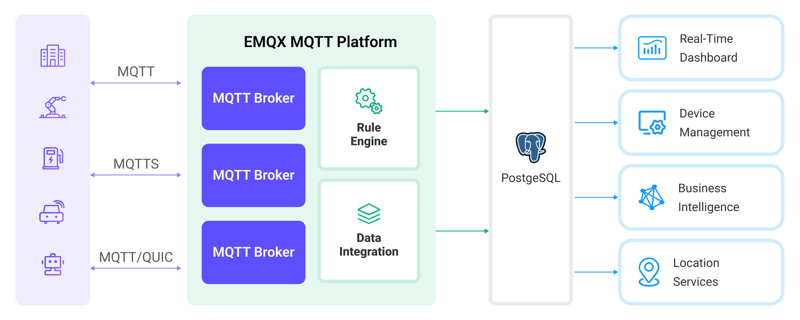

# PostgreSQLへのMQTTデータ取り込み

[PostgreSQL](https://www.postgresql.org/)は、世界で最も高度なオープンソースのリレーショナルデータベースであり、シンプルなアプリケーションから複雑なデータ処理まで対応可能な強力なデータ処理能力を備えています。EMQXはPostgreSQLとの統合をサポートしており、IoTデバイスからのリアルタイムデータストリームを効率的に処理できます。この統合により、大規模なデータ保存、正確なクエリ、複雑なデータ関連分析が可能となり、データの整合性も確保されます。EMQXの効率的なメッセージルーティングとPostgreSQLの柔軟なデータモデルを活用することで、デバイスの状態監視、イベント追跡、操作監査が容易になり、企業に深いデータ洞察と強力なビジネスインテリジェンス支援を提供します。

本ページでは、EMQXとPostgreSQL間のデータ統合について包括的に紹介し、ルールとシンクの作成手順を実践的に解説します。

::: tip
本ページの内容はMatrixDBにも適用可能です。
:::

## 動作概要

PostgreSQLデータ統合は、EMQXに標準搭載された機能であり、MQTTベースのIoTデータとPostgreSQLの強力なデータ保存機能を橋渡しします。組み込みの[ルールエンジン](./rules.md)コンポーネントにより、EMQXからPostgreSQLへのデータ取り込みを簡素化し、複雑なコーディングを不要にします。

以下の図は、EMQXとPostgreSQL間の典型的なデータ統合アーキテクチャを示しています。



PostgreSQLへのMQTTデータ取り込みの流れは以下の通りです。

- **IoTデバイスがEMQXに接続**：IoTデバイスがMQTTプロトコルを介して正常に接続されると、オンラインイベントがトリガーされます。イベントにはデバイスID、送信元IPアドレスなどの情報が含まれます。
- **メッセージのパブリッシュと受信**：デバイスは特定のトピックにテレメトリや状態データをパブリッシュします。EMQXがこれらのメッセージを受信すると、ルールエンジン内でマッチング処理が開始されます。
- **ルールエンジンによるメッセージ処理**：組み込みのルールエンジンにより、特定のソースからのメッセージやイベントをトピックマッチングに基づいて処理します。ルールエンジンは対応するルールをマッチングし、データ形式の変換、特定情報のフィルタリング、コンテキスト情報の付加などの処理を行います。
- **PostgreSQLへの書き込み**：ルールによりメッセージのPostgreSQLへの書き込みがトリガーされます。SQLテンプレートを活用し、ルール処理結果からデータを抽出してSQLを構築し、PostgreSQLで実行します。これにより、メッセージの特定フィールドを対応するテーブルやカラムに書き込みまたは更新できます。

イベントおよびメッセージデータがPostgreSQLに書き込まれた後は、PostgreSQLに接続してデータを読み取り、以下のような柔軟なアプリケーション開発が可能です。

- Grafanaなどの可視化ツールに接続し、データに基づくグラフを生成してデータ変化を表示。
- デバイス管理システムに接続し、デバイス一覧や状態を確認、異常なデバイス挙動を検知して潜在的な問題を迅速に解消。

## 特長と利点

PostgreSQLは豊富な機能を持つ人気のオープンソースリレーショナルデータベースです。PostgreSQLとのデータ統合により、以下の特長と利点が得られます。

- **柔軟なイベント処理**：EMQXルールエンジンを通じて、PostgreSQLはデバイスのライフサイクルイベントを処理可能であり、IoTアプリケーション実装に必要な各種管理・監視タスクの開発を大幅に容易にします。イベントデータを分析することで、デバイス故障や異常挙動、トレンド変化を迅速に検知し、適切な対応が可能です。
- **メッセージ変換**：メッセージはEMQXルールを介して広範な処理・変換が可能であり、PostgreSQLへの書き込みや利用をより便利にします。
- **柔軟なデータ操作**：PostgreSQLデータブリッジが提供するSQLテンプレートにより、特定フィールドのデータをPostgreSQLの対応テーブル・カラムに簡単に書き込み・更新でき、柔軟なデータ保存・管理が実現します。
- **業務プロセスの統合**：PostgreSQLデータブリッジを活用することで、デバイスデータをPostgreSQLの豊富なエコシステムアプリケーションと統合可能です。ERP、CRM、その他カスタム業務システムとの連携により、高度な業務プロセスや自動化を実現します。
- **IoTとGIS技術の融合**：PostgreSQLはGISデータの保存・クエリ機能を提供し、地理空間インデックス、ジオフェンシングとアラート、リアルタイム位置追跡、地理情報処理などをサポートします。EMQXの信頼性の高いメッセージ伝送機能と組み合わせることで、車両などのモバイルデバイスからの地理位置情報を効率的に処理・分析し、リアルタイム監視、インテリジェントな意思決定、業務最適化を可能にします。
- **ランタイムメトリクス**：各シンクのランタイムメトリクス（総メッセージ数、成功／失敗数、現在のレートなど）を閲覧可能です。

柔軟なイベント処理、広範なメッセージ変換、柔軟なデータ操作、リアルタイム監視・分析機能を通じて、効率的で信頼性が高くスケーラブルなIoTアプリケーションを構築し、ビジネスの意思決定と最適化に役立てられます。

## はじめる前に

このセクションでは、PostgreSQLデータベースシンクを作成する前に必要な準備、PostgreSQLサーバーのセットアップやデータテーブルの作成方法について説明します。

### 前提条件

- EMQXデータ統合の[ルール](./rules.md)に関する知識
- [データ統合](./data-bridges.md)に関する知識

### PostgreSQLのインストール

Dockerを使ってPostgreSQLをインストールし、Dockerイメージを起動します。

```bash
# PostgreSQLのDockerイメージを起動し、パスワードをpublicに設定
docker run --name PostgreSQL -p 5432:5432 -e POSTGRES_PASSWORD=public -d postgres

# コンテナにアクセス
docker exec -it PostgreSQL bash

# コンテナ内でPostgreSQLサーバーに接続し、設定したパスワードを入力
psql -U postgres -W

# データベースを作成し、選択

CREATE DATABASE emqx_data;

\c emqx_data;
```

### データテーブルの作成

以下のSQL文を使い、PostgreSQLデータベースに`t_mqtt_msg`テーブルを作成します。このテーブルはクライアントID、トピック、ペイロード、メッセージの到着時間を保存します。

```sql
CREATE TABLE t_mqtt_msg (
  id SERIAL primary key,
  msgid character varying(64),
  sender character varying(64),
  topic character varying(255),
  qos integer,
  retain integer,
  payload text,
  arrived timestamp without time zone
);
```

また、クライアントID、イベントタイプ、作成時間を保存する`emqx_client_events`テーブルを作成します。

```sql
CREATE TABLE emqx_client_events (
  id SERIAL primary key,
  clientid VARCHAR(255),
  event VARCHAR(255),
  created_at TIMESTAMP DEFAULT CURRENT_TIMESTAMP
);
```

## コネクターの作成

PostgreSQLシンクを追加する前に、PostgreSQLコネクターを作成する必要があります。ここではEMQXとPostgreSQLがローカルマシンで動作していることを想定しています。リモートで動作している場合は設定を適宜調整してください。

1. EMQXダッシュボードにアクセスし、**Integration** -> **Connector**をクリックします。
2. ページ右上の**Create**をクリックします。
3. **Create Connector**ページで**PostgreSQL**を選択し、**Next**をクリックします。
4. シンクの名前を入力します。名前は英数字の組み合わせとしてください。例：`my_psql`。
5. 接続情報を入力します。

   - **Server Host**：`127.0.0.1:5432`（PostgreSQLサーバーがリモートの場合は実際のホスト名を入力）
   - **Database Name**：`emqx_data`
   - **Username**：`postgres`
   - **Password**：`public`
   - **Enable TLS**：暗号化接続を行う場合はトグルをオンにします。TLS接続の詳細は[外部リソースアクセスのTLS](../../guides/network/overview.md#tls-for-external-resource-access)を参照してください。
6. 詳細設定（任意）：詳細は[シンクの機能](./data-bridges.md#features-of-sink)を参照してください。
7. **Create**をクリックする前に、**Test Connectivity**をクリックしてコネクターがPostgreSQLサーバーに接続可能かテストできます。
8. ページ下部の**Create**ボタンをクリックしてコネクター作成を完了します。ポップアップダイアログで**Back to Connector List**をクリックするか、**Create Rule**をクリックしてシンクを使ったルール作成を続行できます。詳細は[メッセージ保存用PostgreSQLシンクのルール作成](#create-a-rule-with-postgresql-sink-for-message-storage)および[イベント記録用PostgreSQLシンクのルール作成](#create-a-rule-with-postgresql-for-events-recording)を参照してください。

:::tip 注意

EMQX v5.7.1で**Disable Prepared Statements**オプションが追加されました。PGBouncerのトランザクションモードやSupabaseなど、プリペアドステートメントをサポートしないPostgreSQLサービスを使用する場合は、詳細設定でこのオプションを有効にしてください。

:::

## メッセージ保存用PostgreSQLシンクのルール作成

このセクションでは、Dashboard上でソースMQTTトピック`t/#`からのメッセージを処理し、処理済みデータを設定したシンク経由でPostgreSQLの`t_mqtt_msg`テーブルに保存するルールの作成方法を説明します。

1. Dashboardの**Integration** -> **Rules**ページに移動します。

2. 右上の**Create**をクリックします。

3. ルールIDに`my_rule`を入力し、SQLエディターにルールを入力します。ここでは`t/#`トピックのMQTTメッセージをPostgreSQLに保存する例です。ルールのSELECT部分で選択したフィールドがSQLテンプレート内で使用する変数をすべて含むようにしてください。ルールSQLは以下の通りです。

   ```sql
   SELECT
   *
   FROM
   "t/#"
   ```

   ::: tip

   初心者の方は**SQL Examples**をクリックし、**Enable Test**を有効にしてSQLルールの学習とテストが可能です。

   :::

4. + **Add Action**ボタンをクリックし、ルールでトリガーされるアクションを定義します。このアクションにより、EMQXはルールで処理したデータをPostgreSQLに送信します。

5. **Type of Action**ドロップダウンからPostgreSQLを選択し、**Action**ドロップダウンはデフォルトの`Create Action`のままにするか、既存のPostgreSQLアクションを選択します。本例では新規シンクを作成しルールに追加します。

6. シンクの名前と説明を入力します。

7. **Connector**ドロップダウンから先に作成した`my_psql`を選択します。新規コネクターはドロップダウン横のボタンから作成可能です。設定パラメーターは[コネクターの作成](#コネクターの作成)を参照してください。

8. **SQL Template**を設定します。以下のSQL文を使ってデータを挿入します。

   注意：これは[プリプロセス済みSQL](./data-bridges.md#prepared-statement)のため、フィールドは引用符で囲まず、文末にセミコロンを付けないでください。

   ```sql
   INSERT INTO t_mqtt_msg(msgid, sender, topic, qos, payload, arrived) VALUES(
     ${id},
     ${clientid},
     ${topic},
     ${qos},
     ${payload},
     TO_TIMESTAMP((${timestamp} :: bigint)/1000)
   )
   ```

9. **フォールバックアクション（任意）**：メッセージ配信失敗時の信頼性向上のため、1つ以上のフォールバックアクションを定義可能です。詳細は[フォールバックアクション](./data-bridges.md#fallback-actions)を参照してください。

10. **詳細設定（任意）**：詳細は[シンクの機能](./data-bridges.md#features-of-sink)を参照してください。

11. **Create**をクリックする前に、**Test Connectivity**をクリックしてシンクがPostgreSQLサーバーに接続可能かテストできます。

12. **Create**ボタンをクリックし、シンク設定を完了します。新しいシンクが**Action Outputs**に追加されます。

13. **Create Rule**ページに戻り、設定内容を確認して**Create**をクリックしルールを生成します。

これでルールが正常に作成されました。**Integration** -> **Rules**ページで新規ルールを確認でき、**Action (Sink)**タブで新規PostgreSQLシンクも確認可能です。

また、**Integration** -> **Flow Designer**を開くとトポロジーが表示され、`t/#`トピックのメッセージがルール`my_rule`で解析されPostgreSQLに書き込まれている様子を可視化できます。

## イベント記録用PostgreSQLシンクのルール作成

このセクションでは、クライアントのオンライン／オフライン状態を記録し、イベントデータを設定したシンク経由でPostgreSQLの`emqx_client_events`テーブルに保存するルールの作成方法を説明します。

手順は[メッセージ保存用PostgreSQLシンクのルール作成](#メッセージ保存用postgresqlシンクのルール作成)とほぼ同様ですが、SQLテンプレートとルールSQLが異なります。

オンライン／オフライン状態記録用のルールSQLは以下の通りです。

```sql
SELECT
  *
FROM
  "$events/client_connected", "$events/client_disconnected"
```

イベント記録用SQLテンプレートは以下の通りです。

注意：これは[プリプロセス済みSQL](./data-bridges.md#prepared-statement)のため、フィールドは引用符で囲まず、文末にセミコロンを付けないでください。

```sql
INSERT INTO emqx_client_events(clientid, event, created_at) VALUES (
  ${clientid},
  ${event},
  TO_TIMESTAMP((${timestamp} :: bigint)/1000)
)
```

## ルールのテスト

MQTTXを使ってトピック`t/1`にメッセージを送信し、オンライン／オフラインイベントをトリガーします。

```bash
mqttx pub -i emqx_c -t t/1 -m '{ "msg": "hello PostgreSQL" }'
```

2つのシンクの稼働状況を確認します。メッセージ保存用シンクでは新規受信メッセージ数1件、新規送信メッセージ数1件があるはずです。イベント記録用シンクでは2件のイベント記録があります。

`t_mqtt_msg`データテーブルにデータが書き込まれているか確認します。

```bash
emqx_data=# select * from t_mqtt_msg;
 id |              msgid               | sender | topic | qos | retain |            payload
        |       arrived
----+----------------------------------+--------+-------+-----+--------+-------------------------------+---------------------
  1 | 0005F298A0F0AEE2F443000012DC0002 | emqx_c | t/1   |   0 |        | { "msg": "hello PostgreSQL" } | 2023-01-19 07:10:32
(1 row)
```

`emqx_client_events`テーブルにデータが書き込まれているか確認します。

```bash
emqx_data=# select * from emqx_client_events;
 id | clientid |        event        |     created_at
----+----------+---------------------+---------------------
  3 | emqx_c   | client.connected    | 2023-01-19 07:10:32
  4 | emqx_c   | client.disconnected | 2023-01-19 07:10:32
(2 rows)
```
