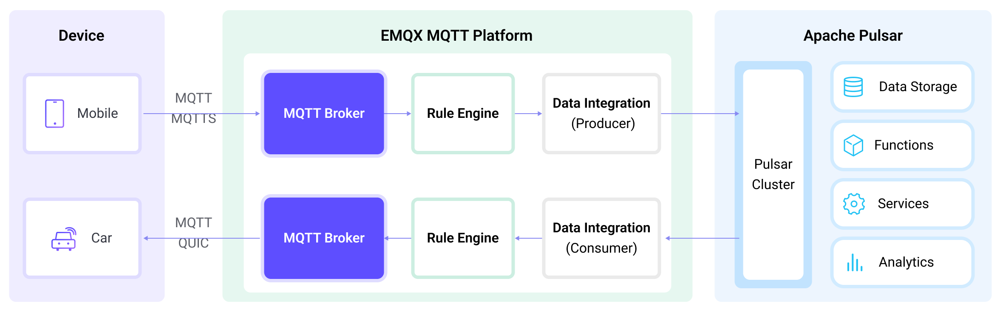

# Apache PulsarへのMQTTデータストリーミング

[Apache Pulsar](https://pulsar.apache.org/)は、アプリケーションやシステム間でリアルタイムのデータストリームを効率的に送信するために設計された、人気のあるオープンソースの分散イベントストリーミングプラットフォームです。Apache Pulsarは、より高いスケーラビリティ、より高速なスループット、そして低いレイテンシを提供します。IoTアプリケーションでは、デバイスから生成されるデータは通常、軽量なMQTTプロトコルを使って送信されます。Apache PulsarとEMQXのデータ統合により、ユーザーはMQTTデータを簡単にApache Pulsarへストリーミングし、他のデータシステムと連携してIoTデバイスから生成されるデータのリアルタイム処理、保存、分析を行うことが可能です。

本ページでは、EMQXとPulsar間のデータ統合の詳細な概要と、データ統合の作成および検証に関する実践的な手順を提供します。

## 動作原理

Apache Pulsarとのデータ統合は、EMQXの標準機能であり、EMQXのデバイス接続およびメッセージ送信能力とPulsarの強力なデータ処理能力を組み合わせています。組み込みのルールエンジンコンポーネントにより、両プラットフォーム間のデータストリーミングおよび処理プロセスが簡素化されます。これにより、複雑なコーディングなしでMQTTデータをPulsarに送信し、Pulsarの強力な機能を活用してデータ処理を行うことができ、IoTデータの管理と活用がより効率的かつ便利になります。



EMQXはルールエンジンと設定されたSinkを通じてMQTTデータをApache Pulsarに転送し、その全体の流れは以下の通りです：

1. **メッセージのパブリッシュと受信**：IoTデバイスはMQTTプロトコルを通じて正常に接続を確立し、特定のトピックにテレメトリおよびステータスデータをパブリッシュします。EMQXがこれらのメッセージを受信すると、ルールエンジン内でマッチング処理を開始します。
2. **ルールエンジンによるメッセージ処理**：組み込みのルールエンジンを使い、特定のソースからのMQTTメッセージをトピックマッチングに基づいて処理します。ルールエンジンは対応するルールをマッチングし、データフォーマット変換、特定情報のフィルタリング、コンテキスト情報の付加などの処理を行います。
3. **Apache Pulsarへのデータストリーミング**：ルールがトリガーされると、メッセージをPulsarに転送するアクションが実行されます。データはPulsarのメッセージキーおよび値に簡単にマッピング可能です。MQTTトピックもPulsarトピックにマッピングでき、データの整理や識別が容易になり、後続のデータ処理や分析を促進します。

MQTTメッセージデータがApache Pulsarに書き込まれた後は、以下のような柔軟なアプリケーション開発が可能です：

- Pulsarのコンシューマーアプリケーションを作成し、これらのメッセージをサブスクライブして処理します。ビジネスニーズに応じて、MQTTデータを他のデータソースと関連付けたり集約したり変換したりして、リアルタイムのデータ同期と統合を実現できます。
- 特定のMQTTメッセージを受信した際に、Pulsarのルールエンジンコンポーネントを利用して対応するアクションやイベントをトリガーし、システム間やアプリケーション間のイベント駆動機能を実現します。
- Pulsar内でMQTTデータストリームをリアルタイムに分析し、異常や特定のイベントパターンを検出してアラート通知を行ったり、条件に応じた対応アクションを実行したりします。
- 複数のMQTTトピックからのデータを統合して単一のデータストリームに集約し、Pulsarの計算能力を活用してリアルタイムの集計、計算、分析を行い、より包括的なデータインサイトを得ることができます。

## 特長とメリット

Pulsarとのデータ統合により、以下の特長と利点がビジネスにもたらされます：

- **信頼性の高いIoTデータメッセージ配信**：EMQXはMQTTメッセージをバッチ処理で確実にPulsarへ送信でき、IoTデバイスとPulsarおよびアプリケーションシステムの統合を可能にします。
- **MQTTメッセージの変換**：ルールエンジンを利用して、EMQXはMQTTメッセージのフィルタリングや変換が可能です。メッセージはPulsarに送信される前にデータ抽出、フィルタリング、付加情報の付与、変換処理を受けられます。
- **柔軟なトピックマッピング**：Pulsar SinkはMQTTトピックをPulsarトピックに柔軟にマッピングでき、Pulsarメッセージのキー（Key）および値（Value）の設定も簡単に行えます。
- **柔軟なパーティション選択**：Pulsar SinkはMQTTトピックやクライアントに基づいて異なる戦略でPulsarのパーティションを選択可能で、データの整理や識別に柔軟性を提供します。
- **高スループットシナリオでの処理能力**：Pulsar Sinkは同期および非同期の書き込みモードをサポートし、シナリオに応じてレイテンシとスループットのバランスを柔軟に調整できます。

## はじめる前に

このセクションでは、EMQXダッシュボードでPulsarデータ統合を作成する前に必要な準備について説明します。

### 前提条件

- EMQXのデータ統合に関する[ルール](./rules.md)の知識
- [データ統合](./data-bridges.md)に関する知識

### Pulsarのインストール

DockerでPulsarを起動します。

```bash
docker run --rm -it -p 6650:6650 --name pulsar apachepulsar/pulsar:2.11.0 bin/pulsar standalone -nfw -nss
```

詳細な操作手順は、[Pulsarドキュメントのクイックスタート](https://pulsar.apache.org/docs/2.11.x/getting-started-home/)を参照してください。

### Pulsarトピックの作成

EMQXでデータ統合を作成する前に、対象のPulsarトピックを作成しておく必要があります。以下のコマンドで、`public`テナント、`default`ネームスペースに1パーティションの`my-topic`というトピックを作成します。

```bash
docker exec -it pulsar bin/pulsar-admin topics create-partitioned-topic persistent://public/default/my-topic -p 1
```

## コネクターの作成

このセクションでは、SinkをPulsarサーバーに接続するためのコネクターを作成する方法を説明します。

以下の手順は、EMQXとPulsarをローカルマシンで実行していることを前提としています。リモートで実行している場合は、設定を適宜調整してください。

1. EMQXダッシュボードに入り、**Integration** -> **Connectors**をクリックします。
2. ページ右上の**Create**をクリックします。
3. **Create Connector**ページで**Pulsar**を選択し、**Next**をクリックします。
4. **Configuration**ステップで以下の情報を設定します：
   - コネクター名を入力します。大文字・小文字の英数字の組み合わせで、例：`my_pulsar`。
   - **Bridge Role**はデフォルトで`Producer`が選択されています。
   - Pulsarサーバーへの接続およびメッセージ書き込み情報を設定します：
     - **Servers**に`pulsar://localhost:6650`を入力します。リモート環境の場合は適宜調整してください。
     - **Authentication**で認証方式を選択します：`none`、`Basic auth`、または`token`。`Basic auth`の場合、EMQXは`Username`と`Password`を`:`で連結して認証文字列を作成します。
     - **Enable TLS**：暗号化接続を確立する場合はトグルスイッチをオンにします。TLS接続の詳細は[外部リソースアクセスのTLS](../../guides/network/overview.md#tls-for-external-resource-access)を参照してください。
5. 詳細設定（任意）：[高度な設定](#advanced-configurations)を参照してください。
6. **Create**をクリックする前に、**Test Connectivity**をクリックしてコネクターがPulsarサーバーに接続できるかテストできます。
7. ページ下部の**Create**ボタンをクリックしてコネクター作成を完了します。ポップアップダイアログで**Back to Connector List**をクリックするか、**Create Rule**をクリックしてルールとSinkの作成を続行できます。詳細は[Create a Rule with Pulsar Sink](#create-a-rule-with-pulsar-sink)を参照してください。

## Pulsar Sinkを使ったルールの作成

このセクションでは、ダッシュボードでソースMQTTトピック`t/#`からのメッセージを処理し、処理済みデータを設定したSink経由でPulsarトピック`my-topic`に保存するルールの作成方法を説明します。

1. EMQXダッシュボードで、**Integration** -> **Rules**をクリックします。

2. ページ右上の**Create**をクリックします。

3. ルールIDを入力します（例：`my_rule`）。

4. **SQL Editor**に以下のステートメントを入力します。これはトピック`t/#`のMQTTメッセージをPulsarに保存する例です。

   注意：独自のSQL構文を指定する場合は、Sinkで必要なすべてのフィールドが`SELECT`句に含まれていることを確認してください。

   ```sql
   SELECT
     *
   FROM
     "t/#"
   ```

   注意：初心者の方は**SQL Examples**をクリックし、**Enable Test**でSQLルールの学習とテストが可能です。

5. **+ Add Action**ボタンをクリックして、ルールによってトリガーされるアクションを定義します。このアクションにより、EMQXはルールで処理されたデータをPulsarに送信します。

6. **Action Type**のドロップダウンリストから`Pulsar`を選択します。

7. **Action**ドロップダウンはデフォルトの`Create Action`のままにします。既に作成済みのSinkがあれば選択可能です。この例では新しいSinkを作成します。

8. Sinkの名前を入力します。名前は大文字・小文字の英数字の組み合わせで指定してください。

9. **Connector**ドロップダウンから先ほど作成した`my_pulsar`を選択します。新規コネクターを作成する場合は、ドロップダウン横のボタンをクリックしてください。設定パラメーターは[Create a Connector](#create-a-connector)を参照してください。

10. Sinkの以下のオプションを設定します：

    - **Pulsar Topic Name**：先に作成した`persistent://public/default/my-topic`を入力します。注意：ここでは変数はサポートされていません。
    - **Partition Strategy**：プロデューサーがメッセージをPulsarのパーティションに振り分ける方法を選択します：`random`、`roundrobin`、または`key_dispatch`。
    - **Compression**：Pulsarメッセージ内のレコードを圧縮／解凍するための圧縮アルゴリズムを指定します。選択肢は`no_compression`、`snappy`、`zlib`です。
    - **Retention Period**：Pulsarトピックにパブリッシュされたメッセージの保持期間を定義します。この設定により、メッセージがサブスクライバーによって消費可能な期間を制御できます。デフォルトは`infinity`で、メッセージの自動期限切れはありません。秒数を指定すると、その時間を超えたメッセージは自動的に期限切れとなりトピックから削除されます。
    - **Message Key**：Pulsarメッセージのキー。プレーン文字列またはプレースホルダー（${var}）を含む文字列を入力します。
    - **Message Value**：Pulsarメッセージの値。プレーン文字列またはプレースホルダー（${var}）を含む文字列を入力します。

11. **フォールバックアクション（任意）**：メッセージ配信失敗時の信頼性向上のため、1つ以上のフォールバックアクションを定義できます。プライマリSinkがメッセージ処理に失敗した場合にこれらのアクションがトリガーされます。詳細は[フォールバックアクション](./data-bridges.md#fallback-actions)を参照してください。

12. **詳細設定（任意）**：[高度な設定](#advanced-configurations)を参照してください。

13. **Create**をクリックする前に、**Test Connectivity**をクリックしてコネクターがPulsarサーバーに接続できるかテスト可能です。

14. **Create**ボタンをクリックしてSinkの設定を完了します。新しいSinkが**Action Outputs**に追加されます。

15. **Create Rule**ページに戻り、設定内容を確認して**Create**ボタンをクリックし、ルールを生成します。

以上でルールの作成が完了しました。**Integration** -> **Rules**ページで新規作成したルールを確認できます。**Actions(Sink)**タブをクリックすると、新しいPulsar Sinkが表示されます。

また、**Integration** -> **Flow Designer**をクリックするとトポロジーを確認でき、トピック`t/#`のメッセージがPulsarに送信・保存されていることがわかります。

## ルールのテスト

MQTTXを使ってトピック`t/1`にメッセージを送信します：

```bash
mqttx pub -i emqx_c -t t/1 -m '{ "msg": "Hello Pulsar" }'
```

Sinkの稼働状況を確認すると、新規の受信メッセージ数と送信メッセージ数が1件ずつ増えているはずです。

以下のPulsarコマンドで、メッセージが`persistent://public/default/my-topic`に書き込まれているか確認します：

```bash
docker exec -it pulsar bin/pulsar-client consume -n 0 -s mysubscriptionid -p Earliest persistent://public/default/my-topic
```

## 高度な設定

このセクションでは、Pulsar Sinkのパフォーマンスを最適化し、特定のシナリオに合わせて動作をカスタマイズするための高度な設定オプションを説明します。Sink作成時に**Advanced Settings**を展開し、ビジネスニーズに応じて以下の設定を行えます。

| 項目                             | 説明                                                         | 推奨値             |
| -------------------------------- | ------------------------------------------------------------ | ------------------ |
| Max Inflight                    | プロデューサーが各パーティションに送信できるメッセージバッチの最大数。<br/>この数を増やすとスループットが向上します。 | `10`               |
| Sync Publish Timeout            | 同期パブリッシュ操作で、メッセージが正常に配信されたことを確認するために待機する最大時間（秒）。<br/>このタイムアウトは、配信問題やネットワーク障害時にパブリッシャーが無限にブロックされるのを防ぎ、データの信頼性を確保します。 | `3` 秒             |
| Socket Send Buffer Size         | ネットワーク送信性能を最適化するためのソケットバッファサイズを管理します。 | `1` MB             |
| Batch Size                     | 1つのPulsarメッセージ内にバッチングされる個別リクエストの最大数を指定します。 | `100`              |
| Max Batch Bytes                | Pulsarバッチ内で収集されるメッセージの最大サイズ（バイト単位）。通常、Pulsarブローカーのデフォルトは1MBですが、EMQXのデフォルト値はメッセージエンコードのオーバーヘッドを考慮し、1MBより少し小さく設定されています。非常に小さいメッセージの場合でも、単一メッセージがこの制限を超えると別バッチで送信されます。 | `900` KB           |
| Query Mode                    | メッセージ送信を最適化するために、`asynchronous`または`synchronous`のクエリモードを選択できます。非同期モードでは、Pulsarへの書き込みがMQTTメッセージのパブリッシュ処理をブロックしません。ただし、クライアントがPulsar到着前にメッセージを受信する可能性があります。 | `Async`            |
| Buffer Mode                   | メッセージを送信前にバッファリングするかどうかを定義します。メモリバッファリングは送信速度を向上させます。<br/>`memory`：メッセージはメモリにバッファされ、EMQXノード再起動時に失われます。<br/>`disk`：メッセージはディスクにバッファされ、EMQXノード再起動後も保持されます。<br/>`hybrid`：最初はメモリにバッファし、一定サイズ（`segment_bytes`設定参照）に達すると徐々にディスクにオフロードします。メモリモード同様、ノード再起動時にメッセージは失われます。 | `memory`           |
| Pulsar Per-partition Buffer Limit | 各Pulsarパーティションの最大バッファサイズ（バイト単位）。この制限に達すると、古いメッセージが破棄されてバッファスペースが確保されます。<br/>メモリ使用量とパフォーマンスのバランスを取るための設定です。 | `2` GB             |
| Segment File Bytes            | バッファモードが`disk`または`hybrid`の場合に適用される設定で、メッセージ保存用の分割ファイルサイズを制御し、ディスクストレージの最適化レベルに影響します。 | `100` MB           |
| Memory Overload Protection    | バッファモードが`memory`の場合に適用される設定で、高メモリ圧迫時にEMQXが古いバッファメッセージを自動破棄し、システムの安定性を保ちます。<br/>**注意**：Linuxシステムのみ有効です。 | `disabled`         |
| Start Timeout                 | コネクターが自動起動したリソースの正常状態を待機する最大時間（秒）を指定します。これにより、Polarなどのインスタンスが完全に稼働し、データ処理準備が整うまで操作を進めないようにします。 | `5` 秒             |
| Health Check Interval         | Sinkの稼働状態をチェックする間隔時間（秒）です。 | `1` 秒             |
