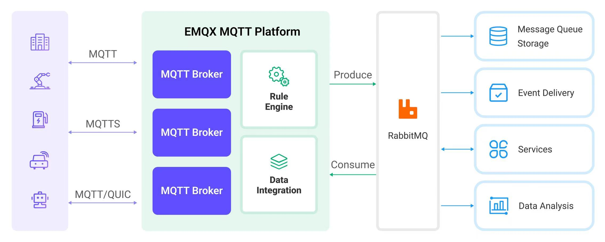

# RabbitMQへのMQTTデータ取り込み

[RabbitMQ](https://www.rabbitmq.com/)は、Advanced Message Queuing Protocol（AMQP）を実装した広く使われているオープンソースのメッセージブローカーです。分散システム間のメッセージングに対して堅牢かつスケーラブルなプラットフォームを提供します。EMQXはRabbitMQとの統合をサポートしており、MQTTメッセージやイベントをRabbitMQに転送できます。また、RabbitMQサーバーからデータを取得し、EMQXの特定のトピックにパブリッシュすることも可能で、RabbitMQからMQTTへのメッセージ配信を実現します。

本ページでは、EMQXとRabbitMQ間のデータ統合について詳細に解説し、実際の作成および検証手順を紹介します。

## 動作の仕組み

RabbitMQデータ統合は、MQTTベースのIoTデータとRabbitMQの強力なメッセージキュー処理機能の橋渡しを目的としたEMQXの標準機能です。組み込みの[ルールエンジン](./rules.md)コンポーネントにより、EMQXからRabbitMQへのデータ取り込みをコード不要で簡単に行えます。

RabbitMQ Sinkを例に、以下の図はEMQXとRabbitMQ間の典型的なデータ統合アーキテクチャを示しています。



MQTTデータをRabbitMQに取り込む流れは以下の通りです。

1. **メッセージのパブリッシュと受信**：産業用IoTデバイスはMQTTプロトコルを介してEMQXに正常に接続し、リアルタイムのMQTTデータをEMQXにパブリッシュします。EMQXがこれらのメッセージを受信すると、ルールエンジン内でマッチング処理を開始します。
2. **メッセージデータの処理**：メッセージが到着すると、ルールエンジンを通過し、EMQXで定義されたルールによって処理されます。ルールは事前定義された条件に基づき、RabbitMQへルーティングすべきメッセージを判別します。ペイロード変換が指定されている場合は、データ形式の変換、特定情報のフィルタリング、追加コンテキストによるペイロードの強化などが適用されます。
3. **RabbitMQへのメッセージ取り込み**：ルールの処理が完了すると、メッセージをRabbitMQに転送するアクションがトリガーされます。処理済みのメッセージはシームレスにRabbitMQに書き込まれます。
4. **データの永続化と活用**：RabbitMQはメッセージをキューに保存し、適切なコンシューマーに配信します。メッセージは他のアプリケーションやサービスで消費され、データ分析、可視化、保存などのさらなる処理に利用されます。

## 特長とメリット

RabbitMQとのデータ統合は、以下の特徴と利点をもたらします。

- **信頼性の高いIoTデータメッセージ配信**：EMQXはデバイスからクラウドへの信頼性の高い接続とメッセージ配信を保証し、RabbitMQはメッセージの永続化とサービス間の信頼性の高い配信を担い、各プロセスでデータの信頼性を確保します。
- **MQTTメッセージの変換**：ルールエンジンを使い、EMQXはMQTTメッセージの抽出、フィルタリング、強化、変換を行い、RabbitMQに送信します。
- **柔軟なメッセージマッピング**：RabbitMQデータ統合はMQTTトピックをRabbitMQのルーティングキーやエクスチェンジに柔軟にマッピング可能で、MQTTとRabbitMQ間のシームレスな統合を実現します。
- **高可用性とクラスター対応**：EMQXとRabbitMQはどちらも高可用なメッセージブローカークラスターの構築をサポートし、ノード障害時でもサービス継続が可能です。クラスター機能を活用することで優れたスケーラビリティも提供します。
- **高スループット環境での処理能力**：RabbitMQデータ統合は同期・非同期の書き込みモードをサポートし、シナリオに応じてレイテンシとスループットのバランスを柔軟に調整できます。

## はじめる前に

このセクションでは、RabbitMQデータ統合を作成する前に必要な準備について説明します。RabbitMQサーバーの起動やテスト用エクスチェンジ・キューの作成方法を含みます。

### 前提条件

- EMQXデータ統合の[ルール](./rules.md)に関する知識
- [データ統合](./data-bridges.md)および[リパブリッシュアクション](./rule-get-started.md#add-republish-action)に関する知識
- UNIXターミナルおよびコマンドの基本知識

### RabbitMQサーバーの起動

ここでは[Docker](https://www.docker.com/)を使ったRabbitMQサーバーの起動方法を紹介します。

以下のコマンドを実行して、管理プラグインが有効なRabbitMQサーバーを起動します。管理プラグインにより、WebインターフェースでRabbitMQを監視できます。

```bash
docker run -it --rm --name rabbitmq -p 127.0.0.1:5672:5672 -p 127.0.0.1:15672:15672 rabbitmq:3.11-management
```

詳細は[Docker HubのRabbitMQのページ](https://hub.docker.com/_/rabbitmq)をご覧ください。

### メッセージ受信用のエクスチェンジとキューの作成

RabbitMQサーバー起動後、RabbitMQ管理Webインターフェースを使って、EMQXから転送されるメッセージを受け取るためのテスト用エクスチェンジとキューを作成します。既にテスト用のエクスチェンジとキューがある場合はこのセクションをスキップできます。

1. ブラウザで http://localhost:15672/ にアクセスし、RabbitMQ管理Webインターフェースを開きます。ログイン画面で以下のデフォルト認証情報を入力し、**Login**をクリックします。
   - **Username**: `guest`
   - **Password**: `guest`
2. 上部メニューの**Exchanges**タブをクリックします。**Add a new exchange**を展開し、以下の情報を入力します。
   * **Name**: `test_exchange`
   * **Type**: ドロップダウンから`direct`を選択
   * **Durability**: `Durable`を選択（RabbitMQ再起動後もエクスチェンジが残る）
   * **Auto delete**: `No`
   * **Internal**: `No`
   * **Arguments**: 空欄のまま

3. **Add exchange**ボタンをクリックしてテスト用エクスチェンジを作成します。
4. 上部メニューの**Queues**タブをクリックします。**Add a new queue**を展開し、以下の情報を入力します。
   * **Type**: `Default for virtual host`
   * **Name**: `test_queue`
   * **Durability**: `Durable`を選択（キューを永続化）
   * **Arguments**: 空欄のまま
5. **Add queue**ボタンをクリックしてテスト用キューを作成します。新しい`test_queue`が**All queues**に表示されます。
6. キュー名`test_queue`をクリックし詳細ページを開きます。**Bindings**を展開し、**Add binding to this queue**セクションに以下を入力します。
   * **From exchange**: `test_exchange`
   * **Routing key**: `test_routing_key`
   * **Arguments**: 空欄のまま
7. **Bind**ボタンをクリックして、`test_queue`を`test_exchange`に指定したルーティングキーでバインドします。

### メッセージ送信用のキュー作成

RabbitMQ管理Webインターフェースを使い、RabbitMQメッセージ送信用のキューを作成します。

1. RabbitMQ管理Webインターフェースにログインします。
2. 上部メニューの**Queues**タブをクリックし、**Add a new queue**を展開して以下を入力します。
   * **Type**: `Default for virtual host`
   * **Name**: `message-send`
   * **Durability**: `Durable`を選択（永続化）
   * **Arguments**: 空欄のまま

3. **Add queue**ボタンをクリックし、`message-send`キューを作成します。**All queues**に表示されます。

## コネクターの作成

このセクションでは、Rabbit Sink/SourceをRabbitMQサーバーに接続するためのコネクター作成手順を示します。

以下の手順はEMQXとRabbitMQをローカルマシンで動作させていることを前提としています。RabbitMQが別の環境にある場合は設定を適宜調整してください。

1. ダッシュボードに入り、**Integration** -> **Connectors**をクリックします。
2. 画面右上の**Create**をクリックします。
3. **Create Connector**ページで**RabbitMQ**を選択し、**Next**をクリックします。
4. コネクター名を入力します。大文字・小文字の英数字の組み合わせで、例：`my_rabbitmq`。
5. 接続情報を入力します。
   - **Servers**: `host[:port]`形式のRabbitMQノードをカンマ区切りで入力します。例：`rmq1:5672,rmq2:5672`。1つのノードへの接続が失敗した場合、EMQXはリスト内の次のノードに接続を試みます。異なる接続プールワーカーはリストの異なる位置から開始し、接続を分散します。

     ::: tip
     EMQX 6.0.4以降、複数のRabbitMQノードを設定可能です。フェイルオーバーは接続確立時に発生し、確立済みのAMQP接続はノード間で移動しません。従来の`server`と`port`で単一ノードを指定する設定も引き続き互換性があります。
     :::

   - **Port**: Serversでポート指定がないノードのデフォルトポート。デフォルトは`5672`。
   - **Username**: `guest`
   - **Password**: `guest`
   - **Virtual Host**: RabbitMQの仮想ホスト。デフォルトは`/`。
   - 暗号化接続を行う場合は、**Enable TLS**をオンにします。TLS接続の詳細は[外部リソースアクセスのTLS](../../guides/network/overview.md#tls-for-external-resource-access)を参照してください。

6. **Create**をクリックする前に、**Test Connectivity**でRabbitMQサーバーへの接続確認が可能です。
7. 画面下部の**Create**をクリックしてコネクター作成を完了します。ポップアップで**Back to Connector List**または**Create Rule**を選択可能です。**Create Rule**を選ぶと以下の選択肢があります。
   - **Action Outputs**: RabbitMQ Sinkを指定してデータ転送ルールを作成。詳細は[Create a Rule with RabbitMQ Sink](#create-a-rule-with-rabbitmq-sink)を参照。
   - **Data Inputs**: RabbitMQ Sourceを指定してルール作成。詳細は[Create a Rule with RabbitMQ Source](#create-a-rule-with-rabbitmq-source)を参照。

## RabbitMQ Sinkを使ったルール作成

このセクションでは、ダッシュボードでMQTTのソーストピック`t/#`からメッセージを処理し、処理結果をRabbitMQのキュー`test_queue`に転送するSink付きルールの作成方法を示します。

### SQLを定義したルール作成

1. EMQXダッシュボードで、**Integration -> Rules**をクリックします。
2. 画面右上の**Create**をクリックします。
3. ルールIDを入力します。例：`my_rule`
4. SQLエディタに以下の文を入力します。トピックパターン`t/#`にマッチするMQTTメッセージを転送します。

   ```sql
   SELECT
     payload,
     now_timestamp() as timestamp
   FROM
     "t/#"
   ```

   ::: tip

   初心者の方は**SQL Examples**をクリックし、**Enable Test**でSQLルールの学習とテストが可能です。

   :::

5. ルールにアクションを追加し、Sinkを設定します。詳細は[Add RabbitMQ Sink to the Rule](#add-rabbitmq-sink-to-the-rule)を参照してください。
6. アクション追加後、**Action Outputs**セクションに新しいSinkが表示されます。**Create Rule**ページで**Save**をクリックしてルール作成を完了します。

これでルールが正常に作成されました。**Rules**ページで新規ルールを確認でき、**Actions (Sink)**タブに新しいRabbitMQ Sinkが表示されます。

また、**Integration** -> **Flow Designer**でトポロジーを確認できます。トポロジーは、トピック`t/#`のメッセージがルール`my_rule`で解析されてRabbitMQに書き込まれる流れを視覚的に示します。

### RabbitMQ Sinkの追加

このセクションでは、処理結果をRabbitMQに書き込むためのSinkをルールに追加する方法を示します。

1. **Create Rule**ページの**Action Outputs**セクションで**Add Action**をクリックし、ルールでトリガーされるアクションを定義します。このアクションにより、EMQXはルールで処理したデータをRabbitMQに送信します。
2. **Type of Action**ドロップダウンから`RabbitMQ`を選択します。**Action**はデフォルトの`Create Action`のままにします。既存のSinkを選択することも可能ですが、ここでは新規作成します。
3. Sinkの名前を入力します。大文字・小文字の英数字の組み合わせで指定してください。
4. **Connector**ドロップダウンから`my_rabbitmq`を選択します。新規作成する場合は隣のボタンから作成可能です。設定パラメータは[Create a Connector](#create-a-connector)を参照してください。
5. Sinkの設定を以下のように行います。

   * **Exchange**: 事前に作成した`test_exchange`を入力します。メッセージはこのエクスチェンジにパブリッシュされます。

       ::: tip 注意

       RabbitMQにエクスチェンジが存在していることを確認してください。存在しない場合、アクションは一時的に動作しなくなり、定期的に再接続を試みます。
       :::

   * **Routing Key**: 事前に作成した`test_routing_key`を入力します。RabbitMQのメッセージパブリッシュ時のルーティングキーです。

       ::: tip

       エクスチェンジやルーティングキーはテンプレート値として設定可能で、プレースホルダーを使い受信したMQTTメッセージのペイロードから動的に値を抽出してルーティングできます。

       例：ルーティングキーをペイロードのフィールドに基づいて動的に設定する場合、`${payload.akey}`のように設定します。これによりペイロード内の`akey`フィールドの値がルーティングキーとして使われます。

       **注意**：バッチモードでは、エクスチェンジとルーティングキーのテンプレート値はバッチ内の全メッセージで一定でなければなりません。これにより一貫したルーティングが保証され、バッチ処理時の競合を回避します。
       :::

   * **Virtual Host**: RabbitMQの仮想ホスト。デフォルトは`/`。
   * **Message Delivery Mode**ドロップダウンから`non_persistent`または`persistent`を選択します。

     * `non_persistent`（デフォルト）：メッセージはディスクに永続化されず、RabbitMQの再起動やクラッシュ時に失われる可能性があります。
     * `persistent`：メッセージはディスクに永続化され、RabbitMQの再起動やクラッシュ時にも耐久性があります。

       ::: tip

       RabbitMQの再起動時にメッセージが失われないようにするには、キューとエクスチェンジもDurable（永続化）に設定する必要があります。詳細はRabbitMQの[ドキュメント](https://www.rabbitmq.com/documentation.html)を参照してください。

       :::

   * **Wait for Publish Confirmations**：デフォルトで有効。RabbitMQへのメッセージパブリッシュ成功を確認します。

     ::: tip

     このオプションを有効にすると、RabbitMQブローカーはメッセージ受信をアック（ACK）してから成功とみなすため、メッセージ配信の信頼性が向上します。

     :::

   * **Headers Template**および**Properties Template**：テンプレートを使ってRabbitMQのカスタムヘッダーやプロパティを定義できます。詳細は[Set Headers and Properties Templates](#set-headers-and-properties-templates)を参照してください。
   * **Payload Template**：デフォルトは空文字列で、メッセージペイロードはJSON形式のテキストとしてそのままRabbitMQに転送されます。

     プレースホルダーを使ってカスタムペイロードフォーマットを定義することも可能です。例えば、MQTTメッセージのペイロードとタイムスタンプを含めたい場合は以下のように設定します。

     ```json
      {"payload": "${payload}", "timestamp": ${timestamp}}
     ```

     このテンプレートは、受信したMQTTメッセージのペイロードとタイムスタンプを含むJSON形式のメッセージを生成します。`${payload}`や`${timestamp}`はプレースホルダーで、実際の値に置き換えられます。

6. **フォールバックアクション（任意）**：メッセージ配信失敗時の信頼性向上のため、1つ以上のフォールバックアクションを定義可能です。詳細は[Fallback Actions](./data-bridges.md#fallback-actions)を参照してください。
7. **詳細設定（任意）**：

   - **Publish Confirmation Timeout**：デフォルト30秒。パブリッシャーがブローカーのアックを待つ最大時間です。
   - 必要に応じて**sync**または**async**クエリモードを選択します。詳細は[Features of Sink](./data-bridges.md#features-of-sink)を参照してください。

8. **Create**をクリックする前に、**Test Connectivity**でSinkがRabbitMQサーバーに接続可能か確認できます。
9. **Create**をクリックしてSink設定を完了します。作成成功後、ルール作成ページに戻り、新しいSinkが**Action Outputs**に追加されます。

#### HeadersおよびPropertiesテンプレートの設定

EMQX 6.0以降、RabbitMQ Sinkアクション作成時にカスタムのRabbitMQヘッダーおよびプロパティを定義可能です。これにより、メッセージにメタデータを付加し、RabbitMQ内での互換性やルーティングの柔軟性が向上します。

これらのフィールドはルールSQLの結果変数（例：`${payload.device_id}`）を使ったテンプレート指定が可能です。ヘッダーやプロパティのテンプレートは任意で、空欄の場合はメタデータは追加されません。

##### Headersテンプレートの設定方法

RabbitMQヘッダーとして1つ以上のキー・バリューのペアを追加できます。これらはユーザー定義のメタデータで、RabbitMQのコンシューマーが解釈可能です。

- **Key**：ヘッダー名。文字列で指定。
- **Value**：キーに対応する値。静的文字列またはテンプレート変数を使用可能。

例：MQTTペイロードのデバイスIDを含める場合

| Key         | Value                  |
| ----------- | ---------------------- |
| `device_id` | `${payload.device_id}` |

##### Propertiesテンプレートの設定方法

RabbitMQは標準的なメッセージプロパティセットをサポートします。EMQXではこれらを定義して、コンテンツタイプや相関IDなどのメッセージレベルのメタデータを付与できます。

- **Key**：以下の有効なプロパティキーから選択（無効なキーは無視されます）。
- **Value**：静的値またはテンプレート変数を設定。

有効なプロパティキー：

- `content_type`
- `content_encoding`
- `priority`
- `correlation_id`
- `reply_to`
- `expiration`
- `message_id`
- `timestamp`
- `type`
- `user_id`
- `app_id`
- `cluster_id`

例：コンテンツタイプとアプリケーションIDを指定する場合

| Key            | Value              |
| -------------- | ------------------ |
| `content_type` | `application/json` |
| `app_id`       | `my_iot_app`       |

##### 利用例

MQTTメッセージペイロードが以下の場合：

```json
{
  "device_id": "sensor-123",
  "status": "ok"
}
```

以下の設定を行うと、

- ヘッダーに`device_id`をMQTTペイロードから設定
- プロパティに静的値`app_id`を設定

設定例：

**Headers Template**:

| Key         | Value                  |
| ----------- | ---------------------- |
| `device_id` | `${payload.device_id}` |

**Properties Template**:

| Key      | Value    |
| -------- | -------- |
| `app_id` | `my_app` |

この設定により、RabbitMQに転送されるすべてのメッセージに対し、

- コンシューマー向けのカスタムメタデータ（Headers）
- メッセージ処理やデバッグ用の標準メタデータ（Properties）

が付加されます。

## RabbitMQ Sink付きルールのテスト

EMQXダッシュボードの組み込みWebSocketクライアントを使い、ルールとSinkの動作をテストできます。

1. ダッシュボード左メニューの**Diagnose** -> **WebSocket Client**をクリックします。
2. 現在のEMQXインスタンスへの接続情報を入力します。
   - ローカルでEMQXを実行している場合はデフォルト値を使用可能です。
   - 認証設定を変更している場合はユーザー名・パスワードを入力してください。
3. **Connect**をクリックしてEMQXに接続します。
4. 下にスクロールしてパブリッシュエリアに以下を入力します。
   * **Topic**: `t/test`
   * **Payload**: `Hello World RabbitMQ from EMQX`
   * **QoS**: `2`
5. **Publish**をクリックしてメッセージを送信します。

   Sinkとルールが正常に作成されていれば、指定したエクスチェンジに指定ルーティングキーでメッセージがパブリッシュされます。

6. http://localhost:15672 のRabbitMQ管理コンソールにアクセスし、**Queues**セクションに移動します。

   ::: tip

   デフォルト設定の場合、ユーザー名・パスワードともに`guest`を使用してください。

   :::

7. メッセージが適切なキューにルーティングされていることを確認します。キューをクリックし、**Get Message(s)**ボタンを押すと詳細メッセージ内容を確認できます。


## RabbitMQ Sourceを使ったルール作成

このセクションでは、RabbitMQキューからEMQXへデータを転送するルール作成方法を示します。RabbitMQ Sourceとメッセージリパブリッシュアクションの両方を作成し、RabbitMQサービスからメッセージを消費してEMQXに転送します。

1. ダッシュボードの**Integration** -> **Rules**ページに移動します。
2. 画面右上の**Create**をクリックします。
3. ルールIDに`my_rule_source`を入力します。
4. ルールをトリガーするソース（Data Inputs）を設定します。画面右側の**Data Inputs**タブをクリックし、デフォルトの`Messages`入力を削除後、**Add Input**をクリックしてRabbitMQ Sourceを作成します。
5. **Add Input**ポップアップで、**Input Type**ドロップダウンから`RabbitMQ`を選択します。**Source**ドロップダウンはデフォルトの`Create Source`のままにします。この例では新規Sourceを作成してルールに追加します。
6. Sourceの**Name**と（任意で）**Description**を入力します。名前は大文字・小文字の英数字の組み合わせで、例：`my-rabbitmq-source`。
7. **Connector**ドロップダウンから先に作成した`my-rabbitmq`コネクターを選択します。隣の作成ボタンから新規コネクターを作成することも可能です。設定パラメータは[Create a Connector](#create-a-connector)を参照してください。
8. RabbitMQからEMQXへメッセージを消費するためのSource情報を設定します。

   - **Queue**: 先にRabbitMQで作成した`message-send`キュー名を入力。
   - **No Ack**: RabbitMQの`no_ack`モードでメッセージを消費するか選択。`no_ack`を有効にすると、RabbitMQはメッセージをコンシューマーの処理完了を待たずに即座にキューから削除します。
   - **Wait for Publish Confirmations**: メッセージパブリッシャーのアックを待つかどうかを指定。

9. 詳細設定（任意）：デフォルト値を使用。
10. **Create**をクリックしてSource作成を完了し、ルールのデータ入力に追加します。同時にルールSQLは以下のように変更されます。

    ```sql
    SELECT
    *
    FROM
    "$bridges/rabbitmq:my-rabbitmq-source"
    ```

    ルールSQLはRabbitMQ Sourceから以下のフィールドにアクセス可能で、SQLを調整してデータ処理が行えます。ここではデフォルトSQLを使用します。

    | フィールド名 | 説明                                                        |
    | :----------- | :---------------------------------------------------------- |
    | payload      | RabbitMQメッセージの内容                                    |
    | event        | イベントトピック。形式は`$bridges/rabbitmq:<source name>` |
    | metadata     | ルールID情報                                                |
    | timestamp    | メッセージがEMQXに到着したタイムスタンプ                    |
    | node         | メッセージが到着したEMQXノード名                            |
    | queue        | メッセージを消費したキュー名                                |
    | exchange     | メッセージがルーティングされたエクスチェンジ名              |
    | routing_key  | エクスチェンジからキューへメッセージをルーティングするためのルーティングキー |

これでRabbitMQ Sourceの作成は完了しましたが、サブスクライブしたデータは直接EMQXにパブリッシュされません。次に、SourceのメッセージをEMQXに転送するためのメッセージリパブリッシュアクションを作成します。


### ルールへのリパブリッシュアクション追加

このセクションでは、RabbitMQ Sourceから消費したメッセージをEMQXトピック`t/1`にパブリッシュするためのリパブリッシュアクションの追加方法を示します。

1. 画面右側の**Action Output**タブを選択し、**Add Action**をクリックします。**Type of Action**ドロップダウンから`Republish`アクションを選択します。
2. メッセージリパブリッシュの設定を入力します。

   - **Topic**: MQTTにパブリッシュするトピック。ここでは`t/1`を入力。
   - **QoS**: `0`、`1`、`2`、`${qos}`のいずれかを選択、または他のフィールドからQoSを設定するためのプレースホルダーを入力可能。`${qos}`を選択すると元のメッセージのQoSを引き継ぎます。
   - **Retain**: `true`または`false`を選択。メッセージをリテインメッセージとしてパブリッシュするかどうか。プレースホルダーも利用可能。ここでは`false`を選択。
   - **Payload**: 転送メッセージのペイロード生成用テンプレート。空欄の場合はルールの出力結果をそのまま転送。ここでは`${payload}`を入力し、ペイロードのみを転送。
   - **MQTT 5.0 Message Properties**: デフォルトで無効。詳細は[Add Republish Action](./rule-get-started.md#add-republish-action)を参照。

3. **Create**をクリックしてアクション作成を完了します。成功するとルール作成ページに戻り、リパブリッシュアクションが**Action Outputs**タブに追加されます。
4. ルール作成ページで**Create**をクリックし、ルール全体を作成します。

これでルールが正常に作成されました。**Rules**ページで新規ルールを確認でき、**Sources**タブで新しいRabbitMQ Sourceも確認できます。

また、**Integrate** -> **Flow Designer**でトポロジーを表示可能です。トポロジーにより、RabbitMQ Sourceからのメッセージがリパブリッシュを通じて`t/1`にパブリッシュされる流れが直感的に把握できます。

## RabbitMQ Source付きルールのテスト

1. [MQTTX CLI](https://mqttx.app/cli)を使い、トピック`t/1`をサブスクライブします。

   ```bash
   mqttx sub -t t/1
   ```

2. 以下のコマンドでRabbitMQにメッセージを生成できます。

   ```bash
   rabbitmqadmin --username=guest --password=guest \
        publish routing_key=message-send \
        payload="{ \"msg\": \"Hello EMQX\"}"
   ```

   - `publish`はメッセージをパブリッシュするコマンドです。
   - `routing_key=message-send`はメッセージのルーティングキーを指定します。この例ではキュー名をルーティングキーに使用しています。
   - `payload="{ \"msg\": \"Hello EMQX\"}"`はメッセージ内容を指定します。

   または、RabbitMQ管理インターフェースからもメッセージをパブリッシュ可能です。

   1. 上部メニューの**Queues**タブをクリック。
   2. **Name**列の`message-send`をクリックして詳細ページを開く。
   3. **Publish message**を展開し、**Payload**欄に`"Hello EMQX"`を入力し、**Publish message**ボタンをクリック。

3. MQTTXで以下のような出力が表示されます。

   ```bash
   [2024-2-23] [16:59:28] › payload: {"payload":{"msg":"Hello EMQX"},"event":"$bridges/rabbitmq:my-rabbitmq-source","metadata":{"rule_id":"rule_0ly1"},"timestamp":1708678768449,"node":"emqx@127.0.0.1"}
   ```
