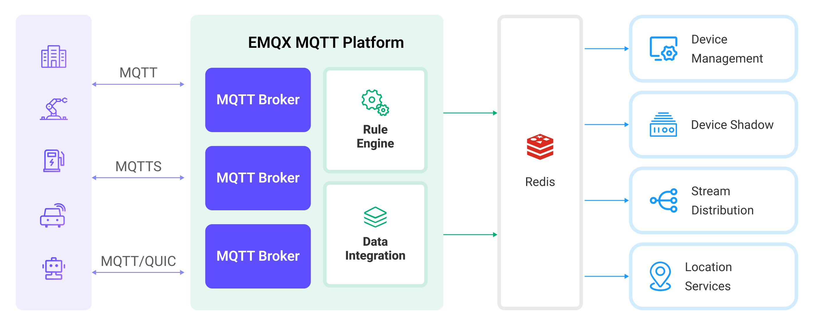

# RedisへのMQTTデータ取り込み

[Redis](https://redis.io/)は、オープンソースのインメモリデータストアであり、データベース、キャッシュ、ストリーミングエンジン、メッセージブローカーとして数百万の開発者に利用されています。EMQXはRedisとの統合をサポートしており、MQTTメッセージやクライアントイベントをRedisに保存できます。Redisデータ統合により、メッセージのキャッシュやクライアントイベントの統計にRedisを活用可能です。

本ページでは、EMQXとRedis間のデータ統合について詳細に解説し、データ統合の作成および検証手順を実践的に説明します。

## 動作の仕組み

Redisデータ統合はEMQXの標準機能であり、EMQXのリアルタイムデータキャプチャと転送機能を、Redisの豊富なデータ構造および高性能なキー・バリュー読み書き性能と組み合わせます。組み込みの[ルールエンジン](./rules.md)コンポーネントにより、EMQXからRedisへのデータ取り込みが簡素化され、複雑なコーディングを不要にします。

以下の図は、EMQXとRedis間の典型的なデータ統合アーキテクチャを示しています。



RedisへのMQTTデータ取り込みは以下のように動作します。

1. **メッセージのパブリッシュと受信**：産業用IoTデバイスはMQTTプロトコルを介してEMQXに正常に接続し、機械やセンサー、製品ラインの稼働状態や計測値、トリガーイベントに基づくリアルタイムMQTTデータをEMQXにパブリッシュします。EMQXはこれらのメッセージを受信すると、ルールエンジン内でマッチング処理を開始します。
2. **メッセージデータの処理**：メッセージが到着するとルールエンジンを通過し、EMQXで定義されたルールに基づき処理されます。ルールは事前定義された条件により、どのメッセージをRedisにルーティングするかを決定します。ペイロード変換が指定されている場合は、データ形式の変換、特定情報のフィルタリング、追加コンテキストによるペイロードの強化などが適用されます。
3. **Redisへのデータ取り込み**：ルールエンジンがデータを処理した後、キャッシュやカウントなどの操作を行うために設定済みのRedisコマンドを実行するアクションをトリガーします。
4. **データの保存と活用**：Redisに保存されたデータを読み取ることで、企業はRedisの豊富なデータ操作機能を活用し、様々なユースケースを実現できます。例えば物流分野では、デバイスの最新状態取得やGPS地理情報解析を行い、リアルタイムデータ分析やソートなどの処理を実施可能です。これによりリアルタイム追跡やルート推奨などの機能が実現します。

## 特長とメリット

Redisとのデータ統合は、効率的なデータ伝送、処理、活用を実現するための多彩な特長とメリットを提供します。

- **高性能かつスケーラブル**：EMQXの分散アーキテクチャとRedisのクラスター機能により、データ量の増加に応じてシームレスにスケール可能です。大規模データセットでも一貫した性能と応答性を確保します。
- **リアルタイムデータストリーム**：EMQXはリアルタイムデータストリーム処理に特化しており、デバイスからRedisへの効率的かつ信頼性の高いデータ伝送を保証します。Redisは高速なデータ操作を実行でき、リアルタイムデータキャッシュに最適なデータストレージコンポーネントです。
- **リアルタイムデータ分析**：Redisはデバイス接続数やメッセージパブリッシュ数、特定のビジネス指標などのリアルタイムメトリクス計算に利用可能です。一方、EMQXはリアルタイムメッセージ伝送と処理を担い、データ分析のためのリアルタイムデータ入力を提供します。
- **地理情報解析**：Redisは地理空間データ構造とコマンドを備え、地理情報の格納やクエリが可能です。EMQXの強力なデバイス接続機能と組み合わせることで、物流、コネクテッドカー、スマートシティなど多様なIoTアプリケーションに広く応用できます。

## はじめる前に

本節では、Redisデータ統合を作成する前に必要な準備、特にRedisサーバーのセットアップ方法について説明します。

### 前提条件

- EMQXデータ統合の[ルール](./rules.md)に関する知識
- [データ統合](./data-bridges.md)に関する知識

### Redisサーバーのインストール

Dockerを使ってRedisをインストールし、起動します。

```bash
# Redisコンテナを起動し、パスワードをpublicに設定
docker run --name redis -p 6379:6379 -d redis --requirepass "public"

# コンテナにアクセス
docker exec -it redis bash

# Redisサーバーにアクセスし、AUTHコマンドで認証
redis-cli
127.0.0.1:6379> AUTH public
OK

# インストールを検証
127.0.0.1:6379> set emqx "Hello World"
OK
127.0.0.1:6379> get emqx
"Hello World"
```

これでRedisのインストールが完了し、`SET`および`GET`コマンドで動作確認ができました。その他のRedisコマンドについては[Redis Commands](https://redis.io/commands/)を参照してください。

## コネクターの作成

本節では、Redis SinkをRedisサーバーに接続するためのコネクター作成手順を示します。

以下の手順はEMQXとRedisをローカルマシンで実行している場合を想定しています。Redisが別環境にある場合は設定を適宜調整してください。

1. ダッシュボードに入り、**Integration** -> **Connectors**をクリックします。
2. ページ右上の**Create**をクリックします。
3. **Create Connector**ページで**Redis**を選択し、**Next**をクリックします。
4. コネクター名を入力します。名前は英数字の組み合わせとしてください。例：`my_redis`
5. ビジネスニーズに応じて**Redis Mode**を設定します。例：`single`
6. 接続情報を入力します。
   - **Server Host**: `127.0.0.1:6379`を入力
   - **Username**: `admin`を入力
   - **Password**: `public`を入力
   - **Database ID**: `0`を入力
   - その他のオプションはビジネスニーズに応じて設定してください。
   - 暗号化接続を行う場合は、**Enable TLS**のトグルをオンにします。TLS接続の詳細は[TLS for External Resource Access](../../guides/network/overview.md#tls-for-external-resource-access)を参照してください。
8. **Create**をクリックする前に、**Test Connectivity**をクリックしてコネクターがRedisサーバーに接続できるか確認できます。
9. ページ下部の**Create**ボタンをクリックしてコネクター作成を完了します。ポップアップダイアログで**Back to Connector List**をクリックするか、**Create Rule**をクリックしてルールおよびSinkの作成に進めます。詳細は[Create a Rule and Redis Sink](#create-a-rule-and-redis-sink)を参照してください。

## Redis Sink付きルールの作成

本節では、各クライアントの最新メッセージをキャッシュし、メッセージ破棄統計を収集するルールの作成方法を示します。

メッセージキャッシュと統計機能のために、2つの異なるRedis Sinkを作成する必要があります。作成するSinkの種類に応じて、以下の**Redisコマンドテンプレート**の設定手順に従ってください。

1. EMQXダッシュボードで**Integration** -> **Rules**をクリックします。

2. ページ右上の**Create**をクリックします。

3. ルールIDに`cache_to_redis`を入力し、使用する機能に応じて**SQL Editor**に以下のルールを設定します。

   - メッセージキャッシュ用ルールを作成する場合、以下のステートメントを入力します。これはトピック`t/#`配下のMQTTメッセージをRedisに保存することを意味します。

     注意：独自のSQL構文を指定する場合は、Sinkで必要なすべてのフィールドが`SELECT`句に含まれていることを確認してください。

     ```bash
     SELECT
       *
     FROM
       "t/#"
     ```

   - メッセージ破棄統計用ルールを作成する場合、以下のステートメントを入力します。

     ```bash
     SELECT
       *
     FROM
       "$events/message_dropped", "$events/delivery_dropped"
     ```

     EMQXルールでは2種類のメッセージ破棄イベントが定義されており、これらのイベントをトリガーとしてRedisに記録可能です。

     | イベント                                   | トピック                   | パラメーター                                                   |
     | ---------------------------------------- | -------------------------- | ------------------------------------------------------------ |
     | 転送中にメッセージが破棄される           | $events/message_dropped    | [$events/message_dropped](./rule-sql-events-and-fields.md#events-message-dropped) |
     | 配信中にメッセージが破棄される           | $events/delivery_dropped   | [$events/delivery_dropped](./rule-sql-events-and-fields.md#events-delivery-dropped) |

   ::: tip

   初心者の方は**SQL Examples**をクリックし、**Enable Test**を有効にしてSQLルールの学習とテストを行うことを推奨します。

   :::

4. + **Add Action**ボタンをクリックし、ルールによりトリガーされるアクションを定義します。このアクションにより、EMQXはルールで処理したデータをRedisに送信します。

5. **Type of Action**のドロップダウンリストから`Redis`を選択します。**Action**はデフォルトの`Create Action`のままにします。既存のSinkがある場合は選択も可能です。本例では新規Sinkを作成します。

6. Sinkの名前を入力します。名前は英数字の組み合わせとしてください。

7. **Connector**ドロップダウンから`my_redis`を選択します。隣のボタンから新規コネクター作成も可能です。設定パラメーターは[Create a Connector](#create-a-connector)を参照してください。

8. 使用する機能に応じて**Redis Command Template**を設定します。

   - メッセージキャッシュ用Sinkを作成する場合、Redisの[HSET](https://redis.io/commands/hset/)コマンドとハッシュデータ構造を用いてメッセージを保存します。データ形式は`clientid`をキーとし、`username`、`payload`、`timestamp`などのフィールドを格納します。Redis内の他のキーと区別するため、`emqx_messages`プレフィックスを付け、`:`で区切ります。

     ```bash
     # HSET key field value [field value...]
     HSET emqx_messages:${clientid} username ${username} payload ${payload} timestamp ${timestamp}
     ```

   - メッセージ破棄統計用Sinkを作成する場合、以下の[HINCRBY](https://redis.io/commands/hincrby/)コマンドを使用し、各トピックごとに破棄されたメッセージ数を集計します。

     ```bash
     # HINCRBY key field increment
     HINCRBY emqx_message_dropped_count ${topic} 1
     ```

     コマンド実行ごとに対応するカウンターが1ずつ増加します。

9. **フォールバックアクション（任意）**：メッセージ配信失敗時の信頼性向上のため、1つ以上のフォールバックアクションを定義可能です。フォールバックアクションはプライマリSinkがメッセージ処理に失敗した場合にトリガーされます。詳細は[Fallback Actions](./data-bridges.md#fallback-actions)を参照してください。

10. **詳細設定（任意）**：必要に応じて**sync**または**async**クエリモードを選択します。詳細は[Features of Sink](./data-bridges.md#features-of-sink)を参照してください。

11. **Create**をクリックする前に、**Test Connectivity**をクリックしてSinkがRedisサーバーに接続できるか確認可能です。

12. **Create**ボタンをクリックし、Sinkの設定を完了します。新しいSinkが**Action Outputs**に追加されます。

13. **Create Rule**ページに戻り、設定内容を確認します。**Create**ボタンをクリックしてルールを生成します。

これでRedis Sink付きルールの作成が完了しました。**Integration** -> **Rules**ページで新規作成したルールを確認できます。**Actions(Sink)**タブをクリックすると、新しいRedis Sinkが表示されます。

また、**Integration** -> **Flow Designer**をクリックするとトポロジーを確認でき、トピック`t/#`配下のメッセージがルール`my_rule`で解析されRedisに送信・保存されていることがわかります。

<!-- TODO 5.5 少了一个规则 -->

## ルールのテスト

MQTTXを使ってトピック`t/1`にメッセージを送信し、メッセージキャッシュイベントをトリガーします。もしトピック`t/1`にサブスクライバーがいなければ、メッセージは破棄され、メッセージ破棄ルールがトリガーされます。

```bash
mqttx pub -i emqx_c -u emqx_u -t t/1 -m '{ "msg": "hello Redis" }'
```

2つのSinkの稼働状況を確認すると、1件の新規マッチと1件の正常送信メッセージがあるはずです。

メッセージがキャッシュされているか確認します。

```bash
127.0.0.1:6379> HGETALL emqx_messages:emqx_c
1) "username"
2) "emqx_u"
3) "payload"
4) "{ \"msg\": \"hello Redis\" }"
5) "timestamp"
6) "1675263885119"
```

テストを再実行すると、`timestamp`フィールドが更新されているはずです。

破棄されたメッセージが集計されているか確認します。

```bash
127.0.0.1:6379> HGETALL emqx_message_dropped_count
1) "t/1"
2) "1"
```

テストを繰り返すと、`t/1`に対応するカウンターの数値も増加します。
