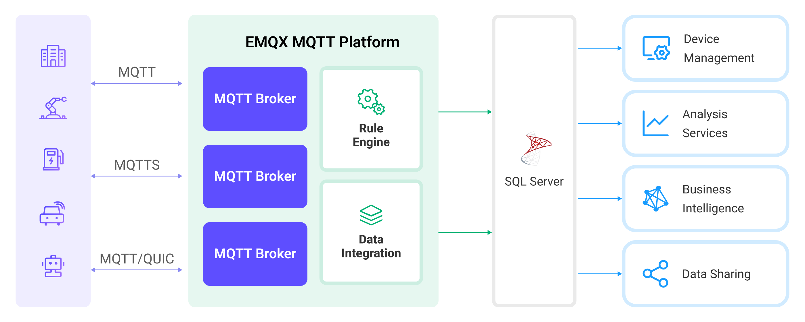

# Microsoft SQL Server への MQTT データ取り込み

[SQL Server](https://www.microsoft.com/en-us/sql-server/) は、企業や組織の規模や種類を問わず広く利用されている主要な商用リレーショナルデータベースソリューションの一つです。EMQX は SQL Server との連携をサポートしており、MQTT メッセージやクライアントイベントを SQL Server に保存することが可能です。これにより、複雑なデータパイプラインや分析処理の構築、データ管理・分析、デバイス接続管理、ERP、CRM、BI などの他の企業システムとの統合が容易になります。

本ページでは、EMQX と Microsoft SQL Server 間のデータ統合について詳しく解説し、データ統合の作成と検証に関する実践的な手順を提供します。

::: tip

Microsoft SQL Server とのデータ統合は EMQX Enterprise 5.0.3 以降でサポートされています。

:::

## 動作概要

Microsoft SQL Server とのデータ統合は EMQX の標準機能として提供されており、EMQX のデバイス接続およびメッセージ送信機能と Microsoft SQL Server の強力なデータ保存機能を組み合わせています。組み込みの[ルールエンジン](./rules.md)コンポーネントと Sink を通じて、MQTT メッセージやクライアントイベントを Microsoft SQL Server に保存できます。さらに、イベントにより Microsoft SQL Server 内のデータの更新や削除をトリガーできるため、デバイスのオンライン状態や接続履歴などの情報を記録可能です。この統合により、EMQX から SQL Server へのデータ取り込みが簡素化され、複雑なコーディングなしでデータの保存・管理が行えます。

以下の図は、EMQX と SQL Server 間の典型的なデータ統合アーキテクチャを示しています。



Microsoft SQL Server への MQTT データ取り込みは以下のように動作します：

1. **メッセージのパブリッシュと受信**：産業用 IoT デバイスは MQTT プロトコルを通じて EMQX に正常に接続し、機械、センサー、製造ラインの稼働状態や計測値、トリガーイベントに基づくリアルタイム MQTT データを EMQX にパブリッシュします。EMQX はこれらのメッセージを受信すると、ルールエンジン内でマッチング処理を開始します。
2. **メッセージデータの処理**：メッセージが到着するとルールエンジンを通過し、EMQX で定義されたルールにより処理されます。ルールは事前に定義された条件に基づき、どのメッセージを Microsoft SQL Server にルーティングするかを決定します。ペイロード変換が指定されている場合は、データ形式の変換、特定情報のフィルタリング、ペイロードへの追加コンテキスト付加などの変換処理が適用されます。
3. **SQL Server へのデータ取り込み**：ルールによりメッセージの書き込みが Microsoft SQL Server にトリガーされます。SQL テンプレートを用いてルール処理結果からデータを抽出し、SQL を構築して SQL Server に送信・実行することで、メッセージの特定フィールドを対応するデータベースのテーブル・カラムに書き込んだり更新したりします。
4. **データの保存と活用**：Microsoft SQL Server にデータが保存された後、企業はそのクエリ機能を活用して様々なユースケースに対応できます。

## 特長とメリット

Microsoft SQL Server とのデータ統合は、効率的なデータ送信、保存、活用を実現するための多彩な特長とメリットを提供します：

- **リアルタイムデータストリーミング**：EMQX はリアルタイムデータストリーム処理に最適化されており、ソースシステムから Microsoft SQL Server への効率的かつ信頼性の高いデータ送信を保証します。即時の洞察やアクションが必要なユースケースに理想的です。
- **高性能かつスケーラブル**：EMQX と Microsoft SQL Server はいずれも拡張性と信頼性を備え、大規模な IoT データ処理に対応可能です。需要の増加に応じて水平・垂直の無停止拡張が可能で、IoT アプリケーションの継続性と信頼性を確保します。
- **柔軟なデータ変換**：EMQX は強力な SQL ベースのルールエンジンを提供し、Microsoft SQL Server に保存する前にデータを前処理できます。フィルタリング、ルーティング、集約、エンリッチメントなど多様な変換機構をサポートし、組織のニーズに応じてデータを整形可能です。
- **高度な分析機能**：Microsoft SQL Server は Analysis Services による多次元データモデル構築など強力な分析機能を備え、複雑なデータ分析やデータマイニングを支援します。また、Reporting Services によるレポート作成・公開も可能で、IoT データの洞察や分析結果を関係者に提供できます。

## はじめる前に

このセクションでは、Microsoft SQL Server とのデータ統合を作成する前に必要な準備について説明します。ODBC ドライバーのインストールと設定、Microsoft SQL Server のインストールと接続、データベースおよびデータテーブルの作成方法を含みます。

### 前提条件

- EMQX データ統合の[ルール](./rules.md)に関する知識
- [データ統合](./data-bridges.md)に関する知識

### ODBC ドライバーのインストールと設定

Microsoft SQL Server データベースにアクセスするために ODBC ドライバーを設定する必要があります。ODBC ドライバーとしては、FreeTDS または Microsoft 提供の msodbcsql18 ドライバーのいずれかを使用できます。

EMQX は `odbcinst.ini` の設定で指定された DSN 名を用いてドライバーの動的ライブラリのパスを判断します。以下の例では DSN 名を `ms-sql` としています。詳細は [Connection Properties](https://learn.microsoft.com/en-us/sql/connect/odbc/linux-mac/connection-string-keywords-and-data-source-names-dsns?view=sql-server-ver16#connection-properties) を参照してください。

::: tip 注意

DSN 名は任意に設定可能ですが、英字のみの使用を推奨します。また、DSN 名は大文字・小文字を区別します。

:::

#### msodbcsql18 ドライバーを ODBC ドライバーとしてインストール・設定する方法

<!-- TODO: コマンドや Dockerfile のタグバージョンを更新 -->

msodbcsql18 ドライバーを使用する場合は、Microsoft の公式手順を参照してください：

- [Microsoft ODBC ドライバーのインストール（Linux）](https://learn.microsoft.com/en-us/sql/connect/odbc/linux-mac/installing-the-microsoft-odbc-driver-for-sql-server?view=sql-server-ver16&tabs=alpine18-install%2Calpine17-install%2Cdebian8-install%2Credhat7-13-install%2Crhel7-offline)
- [Microsoft ODBC ドライバーのインストール（macOS）](https://learn.microsoft.com/en-us/sql/connect/odbc/linux-mac/install-microsoft-odbc-driver-sql-server-macos?view=sql-server-ver16)

Microsoft の EULA 条件により、EMQX が提供する Docker イメージには msodbcsql18 ドライバーは含まれていません。Docker や Kubernetes で使用する場合は、EMQX Enterprise が提供するイメージをベースに ODBC ドライバーをインストールした新しいイメージを作成する必要があります。新しいイメージを使用することにより、[Microsoft SQL Server EULA](https://go.microsoft.com/fwlink/?linkid=857698) に同意したものとみなされます。

以下の手順で新しいイメージをビルドしてください。

1. 以下の Dockerfile を使用して新しいイメージをビルドします。

   この例のベースイメージは `emqx/emqx-enterprise:5.8.1` です。必要な EMQX Enterprise バージョンに応じてビルドするか、最新版の `emqx/emqx-enterprise:latest` を使用してください。

```dockerfile
FROM emqx/emqx-enterprise:5.8.1

USER root

RUN apt-get -qq update && apt-get install -yqq curl gpg && \
    . /etc/os-release && \
    curl -fsSL https://packages.microsoft.com/keys/microsoft.asc | gpg --dearmor -o /usr/share/keyrings/microsoft-prod.gpg && \
    curl -fsSL "https://packages.microsoft.com/config/${ID}/${VERSION_ID}/prod.list" > /etc/apt/sources.list.d/mssql-release.list && \
    apt-get -qq update && \
    ACCEPT_EULA=Y apt-get install -yqq msodbcsql18 unixodbc-dev && \
    sed -i 's/ODBC Driver 18 for SQL Server/ms-sql/g' /etc/odbcinst.ini && \
    apt-get clean && \
    rm -rf /var/lib/apt/lists/*

USER emqx
```

2. 以下のコマンドで新しいイメージをビルドします。

   ```bash
   docker build -t emqx/emqx-enterprise:5.8.1-msodbc .
   ```

3. ビルド後、`docker image ls` コマンドでローカルイメージ一覧を確認できます。必要に応じてイメージのアップロードや保存も可能です。

::: tip 注意

この例で msodbcsql18 ドライバーをインストールした場合、`odbcinst.ini` の DSN 名は `ms-sql` となっています。必要に応じて DSN 名は変更可能です。

:::

#### FreeTDS を ODBC ドライバーとしてインストール・設定する方法

ここでは、主要なディストリビューションで FreeTDS を ODBC ドライバーとしてインストール・設定する方法を紹介します。

MacOS での FreeTDS ODBC ドライバーのインストールと設定例：

```bash
$ brew install unixodbc freetds
$ vim /usr/local/etc/odbcinst.ini
# 以下の内容を追加
[ms-sql]
Description = ODBC for FreeTDS
Driver      = /usr/local/lib/libtdsodbc.so
Setup       = /usr/local/lib/libtdsodbc.so
FileUsage   = 1
```

CentOS での FreeTDS ODBC ドライバーのインストールと設定例：

```bash
$ yum install unixODBC unixODBC-devel freetds freetds-devel perl-DBD-ODBC perl-local-lib
$ vim /etc/odbcinst.ini
# 以下の内容を追加
[ms-sql]
Description = ODBC for FreeTDS
Driver      = /usr/lib64/libtdsodbc.so
Setup       = /usr/lib64/libtdsS.so.2
Driver64    = /usr/lib64/libtdsodbc.so
Setup64     = /usr/lib64/libtdsS.so.2
FileUsage   = 1
```

Ubuntu での FreeTDS ODBC ドライバーのインストールと設定例（Ubuntu 20.04 を例に、他バージョンは公式 ODBC ドキュメントを参照）：

```bash
$ apt-get install unixodbc unixodbc-dev tdsodbc freetds-bin freetds-common freetds-dev libdbd-odbc-perl liblocal-lib-perl
$ vim /etc/odbcinst.ini
# 以下の内容を追加
[ms-sql]
Description = ODBC for FreeTDS
Driver      = /usr/lib/x86_64-linux-gnu/odbc/libtdsodbc.so
Setup       = /usr/lib/x86_64-linux-gnu/odbc/libtdsS.so
FileUsage   = 1
```

### Microsoft SQL Server のインストールと接続

このセクションでは、Docker イメージを使って Linux/MacOS 上で Microsoft SQL Server 2019 を起動し、`sqlcmd` で接続する方法を説明します。その他のインストール方法については、[Microsoft SQL Server インストールガイド](https://learn.microsoft.com/en-us/sql/database-engine/install-windows/install-sql-server?view=sql-server-ver16)を参照してください。

1. Docker で Microsoft SQL Server をインストールし、以下のコマンドでコンテナを起動します。パスワードは `mqtt_public1` を使用します。Microsoft SQL Server のパスワードポリシーについては [Password Complexity](https://learn.microsoft.com/en-us/sql/relational-databases/security/password-policy?view=sql-server-ver16#password-complexity) を参照してください。

   注意：環境変数 `ACCEPT_EULA=Y` を指定して Docker コンテナを起動することで、Microsoft の EULA 条件に同意したことになります。詳細は [End-User Licensing Agreement](https://go.microsoft.com/fwlink/?linkid=857698) をご覧ください。

   ```bash
   # Microsoft SQL Server Docker イメージを起動し、パスワードを `mqtt_public1` に設定
   $ docker run --name sqlserver -p 1433:1433 -e ACCEPT_EULA=Y -e MSSQL_SA_PASSWORD=mqtt_public1 -d mcr.microsoft.com/mssql/server:2022-CU15-ubuntu-22.04
   ```

2. コンテナにアクセスします。

   ```bash
   docker exec -it sqlserver bash
   ```

3. コンテナ内で事前設定したパスワードを入力してサーバーに接続します。パスワード入力時は文字が表示されません。入力後、Enter キーを押してください。

   ```bash
   $ /opt/mssql-tools18/bin/sqlcmd -S localhost -U sa -P mqtt_public1 -N -C
   1>
   ```

   ::: tip

   Microsoft が提供する Microsoft SQL Server コンテナには `mssql-tools18` パッケージがインストールされていますが、実行ファイルは `$PATH` に含まれていません。そのため、`sqlcmd` を実行する際はパスを指定する必要があります。この例の Docker デプロイではパスは `/opt` です。

   `mssql-tools18` の使い方の詳細は [sqlcmd-utility](https://learn.microsoft.com/en-us/sql/tools/sqlcmd/sqlcmd-utility?view=sql-server-ver16) を参照してください。

   :::

これで Microsoft SQL Server 2022 インスタンスのデプロイと接続が完了しました。

### データベースとデータテーブルの作成

前節で作成した接続を使い、以下の SQL 文でデータテーブルを作成します。

::: tip

ODBC インターフェースの制限により、CJK 文字や絵文字などの Unicode 文字を書き込む場合は、挿入前にバイナリ形式に変換する関数を使用する必要があります。テーブル作成時には Unicode 文字を格納するカラムの型を `NVARCHAR` に設定してください。

:::

- MQTT メッセージを保存するためのデータテーブルを作成します。メッセージ ID、トピック、QoS、ペイロード、パブリッシュ時刻を含みます。

  ```sql
  CREATE TABLE dbo.t_mqtt_msg (id int PRIMARY KEY IDENTITY(1000000001,1) NOT NULL,
                               msgid   VARCHAR(64) NULL,
                               topic   VARCHAR(100) NULL,
                               qos     tinyint NOT NULL DEFAULT 0,
                               payload VARCHAR(100) NULL,
                               arrived DATETIME NOT NULL DEFAULT CURRENT_TIMESTAMP);
  GO
  ```

- クライアントのオンライン／オフライン状態を記録するためのデータテーブルを作成します。

  ```sql
  CREATE TABLE dbo.t_mqtt_events (id int PRIMARY KEY IDENTITY(1000000001,1) NOT NULL,
                                  clientid VARCHAR(255) NULL,
                                  event_type VARCHAR(255) NULL,
                                  event_time DATETIME NOT NULL DEFAULT CURRENT_TIMESTAMP);
  GO
  ```

## コネクターの作成

このセクションでは、Sink を Microsoft SQL Server に接続するためのコネクターの作成方法を説明します。

以下の手順は、EMQX と Microsoft SQL Server の両方をローカルマシンで実行していることを前提としています。リモート環境で実行している場合は、設定を適宜調整してください。

1. EMQX ダッシュボードに入り、**Integration** -> **Connectors** をクリックします。

2. ページ右上の **Create** をクリックします。

3. **Create Connector** ページで **Microsoft SQL Server** を選択し、**Next** をクリックします。

4. **Configuration** ステップで以下の情報を設定します：
   - **Connector name**：コネクター名を入力します。英大文字・小文字と数字の組み合わせで、例：`my_sqlserver`

   - **Server Host**：`127.0.0.1:1433` または Microsoft SQL Server がリモートの場合はその URL を入力します。

     ::: tip

     Named Instance を使用している場合は、インスタンスが動作するポート番号を明示的に指定する必要があります。ドライバーは指定されたポートでインスタンスに接続し、ヘルスチェック時に EMQX はインスタンス名を推測します。

     Server Host にインスタンス名（例：`MYSERVER\SQL2022`）のみを指定しても、正しいインスタンスに接続できる保証はありません。必ずポート設定を確認してください。

     :::

   - **Database Name**：`master` を入力します。

   - **Username**：`sa` を入力します。

   - **Password**：事前設定したパスワード `mqtt_public1` または実際のパスワードを入力します。

   - **SQL Server Driver Name**：`ms-sql` を入力します。これは `odbcinst.ini` で設定した DSN 名です。

5. 詳細設定（任意）：詳細は [Features of Sink](./data-bridges.md#features-of-sink) を参照してください。

6. **Create** をクリックする前に、**Test Connectivity** をクリックしてコネクターが Microsoft SQL Server に接続できるかテストできます。

7. ページ下部の **Create** ボタンをクリックしてコネクターの作成を完了します。ポップアップダイアログで **Back to Connector List** をクリックするか、**Create Rule** をクリックして Sink を使ったルール作成を続行できます。ルール作成の詳細は [Create a Rule with Microsoft SQL Server Sink for Message Storage](#create-a-rule-with-microsoft-sql-server-sink-for-message-storage) および [Create a Rule with Microsoft SQL Server Sink for Events Recording](#create-a-rule-with-microsoft-sql-server-sink-for-events-recording) を参照してください。

## Microsoft SQL Server Sink を使ったメッセージ保存ルールの作成

このセクションでは、Dashboard でソース MQTT トピック `t/#` からのメッセージを処理し、処理済みデータを設定済み Sink 経由で Microsoft SQL Server のテーブル `dbo.t_mqtt_msg` に保存するルールの作成方法を示します。

1. EMQX Dashboard で **Integration** -> **Rules** をクリックします。

2. ページ右上の **Create** をクリックします。

3. ルール ID に `my_rule` と入力します。メッセージ保存用のルールを作成するため、**SQL Editor** に以下の文を入力します。これはトピック `t/#` 配下の MQTT メッセージを Microsoft SQL Server に保存することを意味します。

   注意：独自の SQL 文を指定する場合は、Sink が必要とするすべてのフィールドを `SELECT` 部分に含めていることを確認してください。

   ```sql
   SELECT
     *
   FROM
     "t/#"
   ```

   ::: tip

   ODBC インターフェースの制限により、CJK 文字や絵文字などの Unicode 文字を書き込む場合は、挿入前にバイナリ形式に変換する関数を使用する必要があります。

   ルール作成時に組み込み関数を使って文字列を UTF-16 リトルエンディアンエンコードのバイナリ文字列に変換できます。例：

   ```sql
   SELECT
     sqlserver_bin2hexstr(str_utf16_le(payload)) as payload,
     *
   FROM
     "t/#"
   ```

   :::

   ::: tip

   初心者の方は **SQL Examples** と **Enable Test** をクリックして SQL ルールの学習とテストを行うことを推奨します。

   :::

4. + **Add Action** ボタンをクリックし、ルールにトリガーされるアクションを定義します。このアクションにより、EMQX はルールで処理したデータを Microsoft SQL Server に送信します。

5. **Type of Action** ドロップダウンリストから `Microsoft SQL Server` を選択します。**Action** ドロップダウンはデフォルトの `Create Action` のままにします。既に作成済みの Microsoft SQL Server Sink を選択することも可能ですが、ここでは新規 Sink を作成します。

6. Sink の名前を入力します。名前は英大文字・小文字と数字の組み合わせとしてください。

7. **Connector** ドロップダウンから先に作成した `my_sqlserver` を選択します。新しいコネクターを作成する場合はドロップダウン横のボタンをクリックしてください。設定パラメーターは[コネクターの作成](#コネクターの作成)を参照してください。

8. メッセージ保存用の **SQL Template** を以下の SQL 文で設定します。

   注意：これは前処理済みの SQL なので、フィールドは引用符で囲まず、文末にセミコロンを付けないでください。

   ```sql
   insert into dbo.t_mqtt_msg(msgid, topic, qos, payload) values ( ${id}, ${topic}, ${qos}, ${payload} )
   ```

   ::: tip

   ODBC インターフェースの制限により、CJK 文字や絵文字などの Unicode 文字を書き込む場合は、挿入前にバイナリ形式に変換する関数を使用する必要があります。

   SQL テンプレート内で `CONVERT` 関数を使い、Microsoft SQL Server 側で対応するバイナリデータを文字列に変換可能です。

   ```sql
   insert into dbo.t_mqtt_msg(msgid, topic, qos, payload) values ( ${id}, ${topic}, ${qos}, CONVERT(NVARCHAR(100), ${payload}) )
   ```

   :::

   SQL テンプレート内に未定義のプレースホルダー変数がある場合は、**SQL template** 上部の **Undefined Vars as Null** スイッチでルールエンジンの動作を設定できます：

   - **Disabled**（デフォルト）：ルールエンジンは文字列 `undefined` をデータベースに挿入します。

   - **Enabled**：変数が未定義の場合、ルールエンジンは `NULL` をデータベースに挿入します。

     ::: tip

     可能な限りこのオプションは有効にしてください。無効にするのは後方互換性を保つ場合のみです。

     :::

9. **フォールバックアクション（任意）**：メッセージ配信失敗時の信頼性向上のため、1つ以上のフォールバックアクションを定義できます。詳細は [Fallback Actions](./data-bridges.md#fallback-actions) を参照してください。

10. 詳細設定（任意）：詳細は [Features of Sink](./data-bridges.md#features-of-sink) を参照してください。

11. **Create** をクリックする前に、**Test Connectivity** をクリックして Sink が Microsoft SQL Server に接続できるかテストできます。

12. **Create** ボタンをクリックして Sink の設定を完了します。新しい Sink が **Action Outputs** に追加されます。

13. **Create Rule** ページに戻り、設定内容を確認して **Create** ボタンをクリックしルールを生成します。

これで Microsoft SQL Server Sink 用のルール作成が完了しました。**Integration** -> **Rules** ページで新規作成したルールを確認できます。**Actions(Sink)** タブをクリックすると、新しい Microsoft SQL Server Sink が表示されます。

また、**Integration** -> **Flow Designer** をクリックするとトポロジーが表示され、トピック `t/#` 配下のメッセージがルール `my_rule` により解析され Microsoft SQL Server に送信・保存されていることが確認できます。

## Microsoft SQL Server Sink を使ったイベント記録ルールの作成

このセクションでは、クライアントのオンライン／オフライン状態を記録し、イベントデータを設定済み Sink 経由で Microsoft SQL Server のテーブル `dbo.t_mqtt_events` に保存するルールの作成方法を示します。

手順は[メッセージ保存ルールの作成](#microsoft-sql-server-sink-を使ったメッセージ保存ルールの作成)とほぼ同様ですが、SQL テンプレートと SQL ルールが異なります。

オンライン／オフライン状態記録用のルール SQL 文は以下の通りです。

```sql
SELECT
  *,
  floor(timestamp / 1000) as s_shift,
  timestamp div 1000 as ms_shift
FROM
  "$events/client_connected", "$events/client_disconnected"
```

イベント記録用の SQL テンプレートは以下の通りです。

```sql
insert into dbo.t_mqtt_events(clientid, event_type, event_time) values ( ${clientid}, ${event}, DATEADD(MS, ${ms_shift}, DATEADD(S, ${s_shift}, '19700101 00:00:00:000') ) )
```

## ルールのテスト

MQTT X を使ってトピック `t/1` にメッセージを送信し、オンライン／オフラインイベントをトリガーします。

```bash
mqttx pub -i emqx_c -t t/1 -m '{ "msg": "hello SQL Server" }'
```

Microsoft SQL Server Sink の稼働状況を確認します。

- メッセージ保存用 Sink では、新たに 1 件のマッチングと 1 件の送信済みメッセージがあるはずです。`dbo.t_mqtt_msg` テーブルにデータが書き込まれているか確認してください。

```bash
1> SELECT * from dbo.t_mqtt_msg
2> GO
id          msgid                                                            topic                                                                                                qos payload                                                                                              arrived
----------- ---------------------------------------------------------------- ---------------------------------------------------------------------------------------------------- --- ---------------------------------------------------------------------------------------------------- -----------------------
 1000000001 0005F995096D9466F442000010520002                                 t/1                                                                                                    0 { "msg": "Hello SQL Server" }                                                                        2023-04-18 04:49:47.170

(1 rows affected)
1>
```

- オンライン／オフライン状態記録用 Sink では、新たに 2 件のイベント（クライアント接続・切断）が記録されているはずです。`dbo.t_mqtt_events` テーブルに状態記録が書き込まれているか確認してください。

```bash
1> SELECT * from dbo.t_mqtt_events
2> GO
id          clientid                                                         event_type                                                                                                                                                                                                    event_time
----------- ---------------------------------------------------------------- ------------------------------------------------------------------------------------------------------------------------------------------------------------------------------------------------------------- -----------------------
 1000000001 emqx_c                                                           client.connected                                                                                                                                                                                              2023-04-18 04:49:47.140
 1000000002 emqx_c                                                           client.disconnected                                                                                                                                                                                           2023-04-18 04:49:47.180

(2 rows affected)
1>
```
