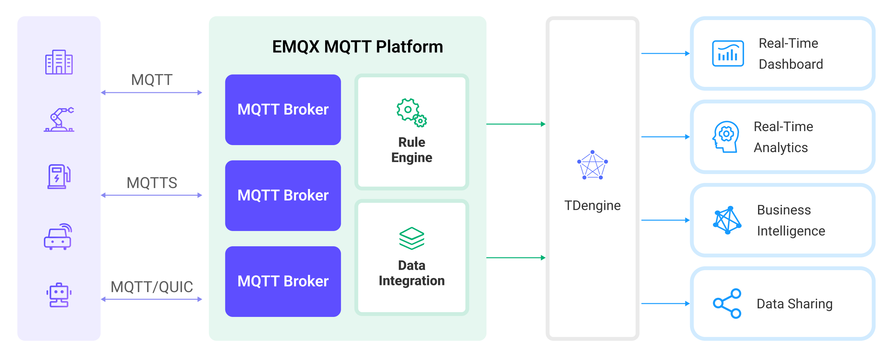
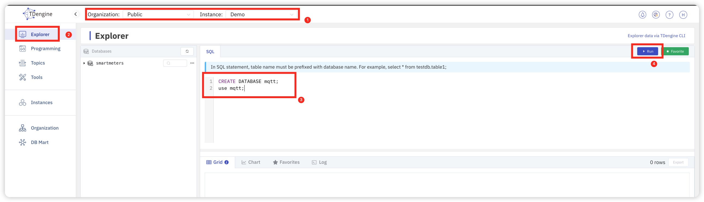
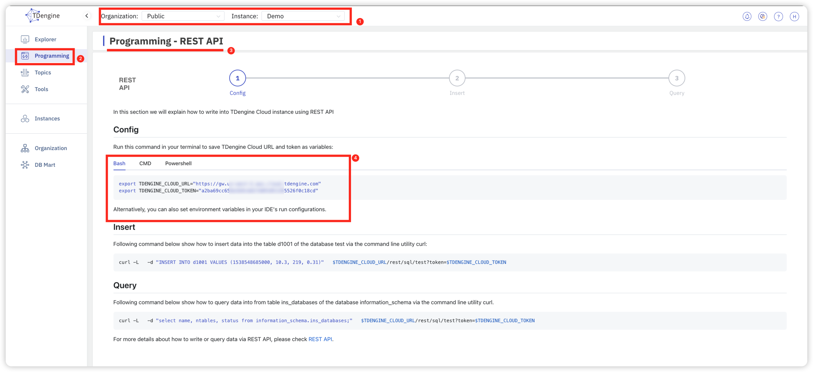

# TDengineへのMQTTデータ取り込み

[TDengine](https://tdengine.com/)は、IoT（モノのインターネット）および産業用IoT（IIoT）シナリオに特化して設計・最適化されたビッグデータプラットフォームです。中核には高性能な時系列データベースがあり、クラスター指向のアーキテクチャ、クラウドネイティブ設計、ミニマリスティックなアプローチが特徴です。EMQXはTDengineとの統合をサポートしており、多数のデバイスやデータコレクターからの大量データの送信、保存、分析、配信を可能にします。これにより、ビジネス運用状態のリアルタイム監視や早期警告が実現し、リアルタイムのビジネスインサイトを提供します。

本ページでは、EMQXとTDengine間のデータ統合について包括的に紹介し、実際の作成および検証手順を解説します。

## 動作概要

TDengineデータ統合はEMQXに組み込まれた機能です。組み込みの[ルールエンジン](./rules.md)コンポーネントを利用することで、EMQXからTDengineへのデータ取り込みが簡素化され、複雑なコーディングを不要にします。EMQXはルールエンジンとSinkを通じてデバイスデータをTDengineに転送します。TDengineデータ統合により、MQTTメッセージやクライアントイベントをTDengineに保存可能です。さらに、TDengine内のデータ更新や削除をイベントでトリガーでき、デバイスのオンライン状態や過去のオンライン／オフラインイベントの記録が可能になります。

以下の図は、産業用IoTにおけるEMQXとTDengineの典型的なデータ統合アーキテクチャを示しています。



産業用エネルギー消費管理シナリオを例に、ワークフローは以下の通りです：

1. **メッセージのパブリッシュと受信**：産業用デバイスはMQTTプロトコルでEMQXに正常に接続し、定期的にエネルギー消費データをパブリッシュします。このデータには生産ライン識別子やエネルギー消費値が含まれます。EMQXがこれらのメッセージを受信すると、ルールエンジン内でマッチング処理を開始します。
2. **ルールエンジンによるメッセージ処理**：組み込みのルールエンジンは、トピックマッチングに基づき特定のソースからのメッセージを処理します。メッセージが到着するとルールエンジンを通過し、対応するルールとマッチングしてメッセージデータを処理します。これにはデータ形式の変換、特定情報のフィルタリング、コンテキスト情報の付加などが含まれます。
3. **TDengineへのデータ取り込み**：ルールエンジンで定義されたルールがメッセージをTDengineに書き込む操作をトリガーします。TDengine SinkはSQLテンプレートを提供し、特定のメッセージフィールドをTDengineの対応テーブルおよびカラムに柔軟に書き込むデータ形式を定義可能です。

エネルギー消費データがTDengineに書き込まれた後は、標準SQLと強力な時系列拡張機能を用いてリアルタイムにデータ分析が可能となり、多数のサードパーティのバッチ分析、リアルタイム分析、レポートツール、AI/MLツール、可視化ツールとシームレスに連携できます。例えば：

- Grafanaなどの可視化ツールに接続し、エネルギー消費データのチャート表示を行う。
- ERPやPower BIなどのアプリケーションシステムに接続し、生産分析や生産計画の調整を行う。
- ビジネスシステムに接続し、リアルタイムのエネルギー使用分析を実施してデータ駆動のエネルギー管理を促進する。

## 特長と利点

TDengineデータ統合は以下の特長と利点をビジネスにもたらします：

- **効率的なデータ処理**：EMQXは多数のIoTデバイス接続とメッセージスループットを効率的に処理可能です。TDengineはデータ書き込み、保存、クエリに優れ、IoTシナリオのデータ処理ニーズをシステム負荷を抑えつつ満たします。
- **メッセージ変換**：メッセージはEMQXルール内で豊富な処理や変換を経てからTDengineに書き込まれます。
- **クラスターおよびスケーラビリティ**：EMQXとTDengineはクラスター機能をサポートし、クラウドネイティブアーキテクチャ上に構築されています。クラウドプラットフォームの弾力的なストレージ、コンピューティング、ネットワーク資源をフル活用し、ビジネスの成長に合わせた柔軟な水平スケーリングが可能です。
- **高度なクエリ機能**：TDengineはタイムスタンプデータの効率的なクエリおよび分析のために最適化された関数、演算子、インデックス技術を提供し、IoT時系列データから正確なインサイトを抽出できます。

## はじめる前に

本節では、TDengineデータ統合の作成を始める前に必要な準備、TDengineサーバーのセットアップやデータテーブルの作成方法について説明します。

### 前提条件

- EMQXデータ統合の[ルール](./rules.md)に関する知識
- [データ統合](./data-bridges.md)に関する知識

### TDengineの起動およびデータベース作成

TDengineを起動またはTDengineサービスに接続し、データベースを作成するには以下の2つの方法があります。

:::: tabs

::: tab Docker

```bash
# TDengineのDockerイメージを起動する
docker run --name TDengine -p 6041:6041 tdengine/tdengine

# コンテナにアクセスする
docker exec -it TDengine bash

# コンテナ内でTDengineサーバーを起動
taos

# データベースを作成し選択する
CREATE DATABASE mqtt;

use mqtt;
```

:::

::: tab TDengine Cloud

[TDengine Cloud](https://cloud.tdengine.com/)を利用している場合は、コンソールにログインし、インスタンスを選択して左側の**Explorer**をクリックしSQL実行ページに入ります。以下のステートメントを実行してデータベースを作成してください。

```bash
# データベース作成と選択

CREATE DATABASE mqtt;

use mqtt;
```



:::

::::

### TDengineでデータテーブルを作成

メッセージ保存と状態記録のために、TDengineデータベース内に2つのデータテーブルを作成します。

1. 以下のSQL文で、クライアントID、トピック、ペイロード、作成時間を保存するデータテーブル `t_mqtt_msg` を作成します。

```sql
   CREATE TABLE t_mqtt_msg (
       ts timestamp,
       msgid NCHAR(64),
       mqtt_topic NCHAR(255),
       qos TINYINT,
       payload BINARY(1024),
       arrived timestamp
     );
```

2. 以下のSQL文で、クライアントID、イベントタイプ、作成時間を保存するデータテーブル `emqx_client_events` を作成します。

```sql
     CREATE TABLE emqx_client_events (
         ts timestamp,
         clientid VARCHAR(255),
         event VARCHAR(255)
       );
```

## コネクターの作成

本節では、SinkをTDengineサーバーに接続するためのコネクター作成方法を示します。

1. EMQXダッシュボードに入り、**Integration** -> **Connectors**をクリックします。

2. 画面右上の**Create**をクリックします。

3. **Create Connector**ページで**TDengine**を選択し、**Next**をクリックします。

4. **Configuration**ステップで、接続先に応じて以下の情報を設定します。

   :::: tabs

   ::: tab TDengineに接続

   以下の設定はEMQXとTDengineをローカルマシンで動作させている場合の例です。リモート環境の場合は適宜調整してください。

   - **Connector name**：コネクター名を入力します。英数字の組み合わせで、例：`my_tdengine`。
   - **Server Host**：`http://127.0.0.1:6041` またはリモートのTDengineサーバーURL。
   - **Database Name**：`mqtt` を入力。
   - **Username**：`root` を入力。
   - **Password**：`taosdata` を入力。
   - **Token**：空欄のまま。コネクターは**Username**と**Password**で認証を試みます。

   :::

   ::: tab TDengine Cloudに接続

   1. TDengine Cloudコンソールページで正しい**Instance**を選択します。

   2. 左メニューの**Programming**に移動し、**REST API**接続方法を選択します。以下の画像のように接続用URLとTokenが取得できます。

      

   3. 以下のコネクター設定情報を入力します：

      - **Connector name**：英数字の組み合わせで名前を入力（例：`my_tdengine`）。
      - **Server Host**：TDengine Cloudが提供する`TDENGINE_CLOUD_URL`の値を入力。例：`https://gw.***.cloud.tdengine.com`。
      - **Database Name**：`mqtt`。
      - **Username**：空欄。
      - **Password**：空欄。
      - **Token**：TDengine Cloudが提供する`TDENGINE_CLOUD_TOKEN`の値を入力。例：`a2ba69cc6****f0c18cd`。

      :::

      ::::

5. 詳細設定（任意）：詳細は[Sinkの機能](./data-bridges.md#features-of-sink)を参照してください。

6. **Create**をクリックする前に、**Test Connectivity**をクリックしてコネクターがTDengineサーバーに接続可能かテストできます。

7. 画面下の**Create**ボタンをクリックしてコネクター作成を完了します。ポップアップダイアログで**Back to Connector List**をクリックするか、**Create Rule**をクリックしてSinkを使ったルール作成に進めます。詳細は[メッセージ保存用のTDengine Sinkを使ったルール作成](#create-a-rule-with-tdengine-sink-for-message-storage)および[イベント記録用のTDengine Sinkを使ったルール作成](#create-a-rule-with-tdengine-sink-for-events-recording)を参照してください。

## メッセージ保存用のTDengine Sinkを使ったルール作成

本節では、ダッシュボードでMQTTトピック `t/#` からのメッセージを処理し、処理済みデータを設定済みSink経由でTDengineのデータテーブル `t_mqtt_msg` に保存するルールの作成方法を示します。

1. EMQXダッシュボードに入り、**Integration** -> **Rules**をクリックします。

2. 画面右上の**Create**をクリックします。

3. ルールIDに `my_rule` と入力し、**SQL Editor**でメッセージ保存用のルールを作成します。例えば以下のステートメントはトピック `t/#` 配下のMQTTメッセージをTDengineに保存します。

   注意：独自のSQL構文を指定する場合は、Sinkが必要とするすべてのフィールドを`SELECT`句に含めてください。

   ```sql
     SELECT
       *,
       now_timestamp('millisecond')  as ts
     FROM
       "t/#"
   ```

   ::: tip

   初心者の方は**SQL Examples**や**Enable Test**をクリックしてSQLルールの学習やテストを行うことを推奨します。

   :::

4. + **Add Action**ボタンをクリックして、ルール発動時にトリガーされるアクションを定義します。このアクションによりEMQXはルールで処理したデータをTDengineに送信します。

5. **Type of Action**ドロップダウンリストから`TDengine`を選択します。**Action**はデフォルトの`Create Action`のままにします。既に作成済みのTDengine Sinkを選択することも可能ですが、本デモでは新規Sinkを作成します。

6. Sinkの名前を入力します。英数字の組み合わせで指定してください。

7. **Connector**ドロップダウンから先ほど作成した`my_tdengine`を選択します。隣のボタンから新規コネクター作成も可能です。設定パラメータは[コネクターの作成](#create-a-connector)を参照してください。

8. Sinkの**SQL Template**を設定します。以下のSQLを使ってデータ挿入を完了できます。CSVファイルによるバッチ設定もサポートしています。詳細は[バッチ設定](#batch-setting)を参照してください。

   ::: tip

   EMQX 5.1.1で破壊的変更があります。それ以前のバージョンでは文字列型の値は自動的に引用符で囲まれていましたが、5.1.1以降はユーザーが手動で引用符を付ける必要があります。

   :::

   ```sql
   INSERT INTO t_mqtt_msg(ts, msgid, mqtt_topic, qos, payload, arrived)
       VALUES (${ts}, '${id}', '${topic}', ${qos}, '${payload}', ${timestamp})
   ```

   SQLテンプレート内でプレースホルダー変数が未定義の場合、**SQL template**上部の**Undefined Vars as Null**スイッチでルールエンジンの挙動を切り替えられます：

   - **Disabled**（デフォルト）：ルールエンジンは文字列`undefined`をデータベースに挿入します。
   - **Enabled**：変数が未定義の場合、ルールエンジンは`NULL`を挿入します。

     ::: tip

     可能な限りこのオプションは有効にしてください。無効化は後方互換性確保のためのみ推奨されます。

     :::

9. **フォールバックアクション（任意）**：メッセージ配信失敗時の信頼性向上のため、1つ以上のフォールバックアクションを定義可能です。詳細は[フォールバックアクション](./data-bridges.md#fallback-actions)を参照してください。

10. **詳細設定（任意）**：必要に応じて**sync**または**async**クエリモードを選択します。詳細は[Sinkの機能](./data-bridges.md#features-of-sink)を参照してください。

11. **Create**をクリックする前に、**Test Connectivity**をクリックしてSinkがTDengineに接続可能かテストできます。

12. **Create**ボタンをクリックしてSink設定を完了します。新しいSinkが**Action Outputs**に追加されます。

13. **Create Rule**ページに戻り、設定内容を確認して**Create**をクリックしルールを生成します。

これでTDengine Sink用のルールが正常に作成されました。**Integration** -> **Rules**ページで新規ルールを確認できます。**Actions(Sink)**タブをクリックすると新しいTDengine Sinkが表示されます。

また、**Integration** -> **Flow Designer**をクリックしてトポロジーを確認すると、トピック `t/#` 配下のメッセージがルール`my_rule`で解析され、TDengineに送信・保存されていることがわかります。

### バッチ設定

TDengineでは1つのデータエントリーに数百のデータポイントを含むことがあり、SQL文の記述が複雑になる場合があります。この課題を解決するため、EMQXはSQLのバッチ設定機能を提供しています。

SQLテンプレート編集時に、バッチ設定機能を使ってCSVファイルから挿入操作用のフィールドをインポート可能です。

1. **SQL Template**下の**Batch Setting**ボタンをクリックし、**Import Batch Setting**ポップアップを開きます。

2. 指示に従いバッチ設定テンプレートファイルをダウンロードし、テンプレート内のフィールドのキーと値のペアを入力します。テンプレートファイルのデフォルト内容は以下の通りです：

   | Field      | Value             | Char Value | 備考（任意）          |
   | ---------- | ----------------- | ---------- | --------------------- |
   | ts         | now               | FALSE      | 例                     |
   | msgid      | ${id}             | TRUE       |                       |
   | mqtt_topic | ${topic}          | TRUE       |                       |
   | qos        | ${qos}            | FALSE      |                       |
   | temp       | ${payload.temp}   | FALSE      |                       |
   | hum        | ${payload.hum}    | FALSE      |                       |
   | status     | ${payload.status} | FALSE      |                       |

   - **Field**：フィールドキー。定数または`${var}`形式のプレースホルダーをサポート。
   - **Value**：フィールド値。定数または`${var}`形式のプレースホルダーをサポート。SQLでは文字列型は引用符で囲む必要がありますが、テンプレートファイルでは不要です。文字列型かどうかは`Char Value`列で指定します。
   - **Char Value**：フィールドが文字列型かどうかを指定し、インポート時にSQL生成時に引用符を付加します。文字列型なら`TRUE`または`1`、そうでなければ`FALSE`または`0`を記入します。
   - **備考**：CSVファイル内のメモ用で、EMQXへのインポート対象ではありません。

   CSVファイルのデータ行数は2048行を超えないようにしてください。

3. 入力済みテンプレートファイルを保存し、**Import Batch Setting**ポップアップにアップロードして**Import**をクリックしバッチ設定を完了します。

4. インポート後、**SQL Template**内でテーブル名設定やSQLコードのフォーマットなどをさらに調整可能です。

## イベント記録用のTDengine Sinkを使ったルール作成

本節では、クライアントのオンライン／オフライン状態を記録し、イベントデータを設定済みSink経由でTDengineテーブル `emqx_client_events` に保存するルール作成方法を示します。

ルール作成手順は[メッセージ保存用のTDengine Sinkを使ったルール作成](#メッセージ保存用のtdengine-sinkを使ったルール作成)とほぼ同様ですが、SQLルール文とSQLテンプレートが異なります。

オンライン／オフライン状態記録用のSQLルール文は以下の通りです：

```sql
SELECT
      *,
      now_timestamp('millisecond')  as ts
    FROM
      "$events/client_connected", "$events/client_disconnected"
```

Sink用のSQLテンプレートは以下の通りです：

注意：フィールドは引用符で囲まず、SQL文の末尾にセミコロン（`;`）を付けないでください。

```sql
INSERT INTO emqx_client_events(ts, clientid, event) VALUES (
      ${ts},
      '${clientid}',
      '${event}'
    )
```

## ルールのテスト

MQTTXを使ってトピック `t/1` にメッセージを送信し、オンライン／オフラインイベントをトリガーします。

```bash
mqttx pub -i emqx_c -t t/1 -m '{ "msg": "hello TDengine" }'
```

2つのSinkの稼働状況を確認すると、新規の受信メッセージ1件、送信メッセージ1件、イベントレコード2件があるはずです。

`t_mqtt_msg`データテーブルにデータが書き込まれているか確認します。

```bash
taos> select * from t_mqtt_msg;
           ts            |             msgid              |           mqtt_topic           | qos  |            payload             |         arrived         |
==============================================================================================================================================================
 2023-02-13 06:10:53.787 | 0005F48EB5A83865F440000014F... | t/1                            |    0 | { "msg": "hello TDengine" }    | 2023-02-13 06:10:53.787 |
Query OK, 1 row(s) in set (0.002968s)
```

`emqx_client_events`テーブル：

```bash
taos> select * from emqx_client_events;
           ts            |            clientid            |             event              |
============================================================================================
 2023-02-13 06:10:53.777 | emqx_c                         | client.connected               |
 2023-02-13 06:10:53.791 | emqx_c                         | client.disconnected            |
Query OK, 2 row(s) in set (0.002327s)
```
