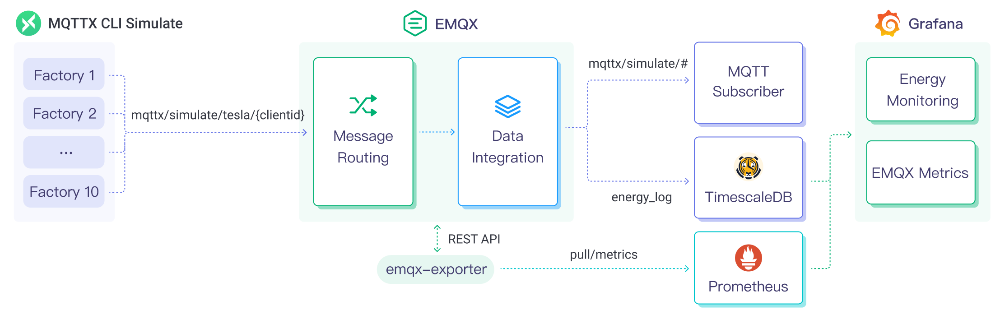
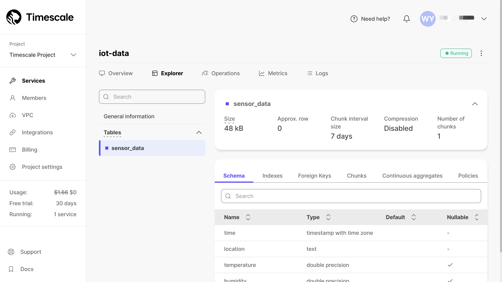

# TimescaleDBへのMQTTデータ取り込み

[TimescaleDB](https://www.timescale.com/)（Timescale）は、時系列データの保存と分析に特化したデータベースです。優れたデータスループットと信頼性の高いパフォーマンスにより、IoT（モノのインターネット）分野に最適であり、IoTアプリケーション向けに効率的かつスケーラブルなデータ保存と分析ソリューションを提供します。

本ページでは、EMQXとTimescaleDB間のデータ統合について包括的に紹介し、データ統合の作成および検証に関する実践的な手順を提供します。

## 動作の仕組み

TimescaleDBデータ統合は、EMQXに組み込まれた機能であり、EMQXのリアルタイムデータキャプチャと送信能力とTimescaleDBのデータ保存および分析能力を組み合わせています。組み込みの[ルールエンジン](./rules.md)コンポーネントにより、EMQXからTimescaleDBへのデータ取り込みが簡素化され、複雑なコーディングを不要にします。

以下の図は、産業用IoTにおけるEMQXとTimescaleDBのデータ統合の典型的なアーキテクチャを示しています。



EMQXとTimescaleDBは、エネルギー消費データをリアルタイムに効率的に収集・分析するためのスケーラブルなIoTプラットフォームを提供します。このアーキテクチャでは、EMQXがデバイスアクセス、メッセージ送信、データルーティングを担当するIoTプラットフォームとして機能し、TimescaleDBがデータ保存および分析プラットフォームとしてデータの保存と分析を担います。

EMQXはルールエンジンとSinkを通じてデバイスデータをTimescaleDBに転送します。TimescaleDBはSQL文を用いてデータを分析し、レポートやチャートなどの分析結果を生成し、TimescaleDBの可視化ツールを通じてユーザーに表示します。ワークフローは以下の通りです：

1. **メッセージのパブリッシュと受信**：産業用デバイスはMQTTプロトコルを使ってEMQXに正常に接続し、定期的にエネルギー消費データをパブリッシュします。このデータには生産ラインの識別子やエネルギー消費値が含まれます。EMQXがこれらのメッセージを受信すると、ルールエンジン内でマッチング処理を開始します。
2. **ルールエンジンによるメッセージ処理**：組み込みのルールエンジンは、トピックマッチングに基づき特定のソースからのメッセージを処理します。メッセージが到着すると、ルールエンジンを通過し、対応するルールとマッチングし、メッセージデータを処理します。これにはデータ形式の変換、特定情報のフィルタリング、コンテキスト情報によるメッセージの付加などが含まれます。
3. **TimescaleDBへのデータ取り込み**：ルールエンジンで定義されたルールがメッセージをTimescaleDBに書き込む操作をトリガーします。TimescaleDB SinkはSQLテンプレートを提供し、特定のメッセージフィールドをTimescaleDBの対応するテーブルやカラムに柔軟に書き込むことができます。

エネルギー消費データがTimescaleDBに書き込まれた後は、SQL文を用いて柔軟にデータ分析が可能です。例えば：

- Grafanaなどの可視化ツールに接続し、チャートを生成してエネルギー消費データを表示する。
- ERPなどのアプリケーションシステムに接続し、生産分析や生産計画の調整を行う。
- ビジネスシステムに接続し、リアルタイムのエネルギー使用分析を行い、データ駆動型のエネルギー管理を支援する。

## 特長とメリット

EMQXのTimescaleDBデータ統合は、以下の特長と利点をビジネスにもたらします：

- **効率的なデータ処理**：EMQXは多数のIoTデバイス接続とメッセージスループットを効率的に処理可能です。TimescaleDBはデータの書き込み、保存、クエリに優れており、IoTシナリオのデータ処理要件をシステムに負荷をかけずに満たします。
- **メッセージ変換**：メッセージはEMQXのルール内で豊富な処理や変換を経てからTimescaleDBに書き込まれます。
- **効率的な保存とスケーラビリティ**：EMQXとTimescaleDBはどちらもクラスターのスケールアウト機能を備えており、ビジネスの成長に合わせて柔軟に水平スケールできます。
- **高度なクエリ機能**：TimescaleDBはタイムスタンプデータの効率的なクエリと分析のために最適化された関数、演算子、インデックス技術を提供し、IoT時系列データから精密な洞察を抽出可能です。

## はじめる前に

このセクションでは、TimescaleDBデータ統合の作成を開始する前に必要な準備、TimescaleDBのインストールおよびデータテーブルの作成について説明します。

### 前提条件

- EMQXデータ統合の[ルール](./rules.md)に関する知識
- [データ統合](./data-bridges.md)に関する知識

### Timescaleのインストールとデータテーブルの作成

EMQXはセルフホストのTimescaleDBまたはクラウド上のTimescaleサービスとの統合をサポートしています。Timescaleサービスをクラウドサービスとして利用するか、Dockerを使ってTimescaleDBインスタンスをデプロイできます。

:::: tabs
::: tab Timescale Service

1. Timescaleアカウントをお持ちでない場合は、[Timescaleアカウントの作成](https://docs.timescale.com/getting-started/latest/services/#create-your-timescale-account)を参照してアカウントを作成してください。

2. Timescaleポータルにログインし、[Timescaleサービスの作成](https://docs.timescale.com/getting-started/latest/services/#create-your-first-service)を行います。サービスのパスワードを保存してください。

3. サービス概要ページから接続情報を取得します。EMQXで必要な項目は、**Database name**、**Host**、**Port**、**Username**です。

4. `psql client`で[サービスに接続](https://docs.timescale.com/getting-started/latest/services/#connect-to-your-service)します。

   ```bash
   # サービスURLで接続
   psql "postgres://tsdbadmin@xxxxx.xxxxx.tsdb.cloud.timescale.com:32541/tsdb?sslmode=require"
   # 前のステップで保存したパスワードを使用
   Password for user tsdbadmin:
   ```

5. クライアントからのメッセージデータを保存するためのテーブル`sensor_data`を作成します。

   ```sql
   CREATE TABLE sensor_data (
       time        TIMESTAMPTZ       NOT NULL,
       location    TEXT              NOT NULL,
       temperature DOUBLE PRECISION  NULL,
       humidity    DOUBLE PRECISION  NULL
   );

   SELECT create_hypertable('sensor_data', 'time');
   ```

テーブルが正常に作成されると、サービスの**Explorer**タブで`sensor_data`テーブルの情報を確認できます。



:::

::: tab TimescaleDB Docker

1. Docker環境がない場合は、[Dockerのインストール](https://docs.docker.com/install/)を参照してください。

2. DockerでTimescaleDBコンテナを作成し、`POSTGRES_PASSWORD`環境変数でデータベースのパスワードを設定します。

   ```bash
   docker run -d --name timescaledb \
       -p 5432:5432 \
       -e POSTGRES_PASSWORD=public \
       timescale/timescaledb:latest-pg13
   ```

3. クライアントデータを保存するためのデータベースを作成します。

   ```bash
   docker exec -it timescaledb psql -U postgres

   ## tsdbデータベースを作成
   > CREATE database tsdb;

   > \c tsdb;
   ```

4. クライアントからのメッセージデータを保存するためのテーブル`sensor_data`を作成します。

   ```sql
   CREATE TABLE sensor_data (
       time        TIMESTAMPTZ       NOT NULL,
       location    TEXT              NOT NULL,
       temperature DOUBLE PRECISION  NULL,
       humidity    DOUBLE PRECISION  NULL
   );

   SELECT create_hypertable('sensor_data', 'time');
   ```

:::
::::

## コネクターの作成

TimescaleDB Sinkを作成する前に、TimescaleDBサービスに接続するためのTimescaleDBコネクターを作成する必要があります。

以下の手順は、EMQXとTimescaleDB（セルフホストの場合）をローカルマシンで実行していることを前提としています。リモートで実行している場合は設定を適宜調整してください。

1. EMQXダッシュボードにアクセスし、左側のナビゲーションメニューから **Integration** -> **Connector** をクリックします。
2. ページ右上の **Create** をクリックします。
3. コネクター一覧から **TimescaleDB** を選択し、**Next** をクリックします。
4. **Connector Name** に名前を入力します。例：`my-timescale`。名前は大文字・小文字の英数字の組み合わせにしてください。
5. TimescaleDBのデプロイ方法に応じて接続情報を入力します。Dockerでデプロイしている場合は、**Server Host** に`127.0.0.1:5432`、**Database Name** に`tsdb`、**Username** に`postgres`、**Password** に`public`を入力します。
6. 詳細設定（任意）：詳細は[Sinkの機能](./data-bridges.md#features-of-sink)を参照してください。
7. **Create**をクリックする前に、**Test Connectivity**をクリックしてコネクターがTimescaleDBサーバーに接続できるかテストできます。
8. **Create**ボタンをクリックしてコネクターの作成を完了します。

これでTimescaleDBコネクターが作成されました。次に、ルールとSinkを作成して、TimescaleDBデータベースに書き込むデータを指定します。

## TimescaleDB Sinkを用いたルールの作成

このセクションでは、DashboardでMQTTトピック`t/#`からのメッセージを処理し、処理結果を設定したSink経由でTimescaleDBに送信するルールの作成方法を示します。

1. EMQXダッシュボードにアクセスし、左側のナビゲーションメニューから **Integration** -> **Rules** をクリックします。

2. ページ右上の **+ Create** をクリックします。

3. ルール作成ページで、ルールIDに`my_rule`を入力します。

4. **SQL Editor**に以下のSQLルールを入力し、トピック`t/#`のMQTTメッセージをTimescaleDBに保存します：

   ```sql
   SELECT
     payload.temp as temp,
     payload.humidity as humidity,
     payload.location as location
   FROM
       "t/#"
   ```

   注：初心者の方は、**SQL Examples**をクリックし、**Enable Test**を有効にしてSQLルールの学習とテストが可能です。

5. **+ Add Action**ボタンをクリックして、ルールがトリガーされた際のアクションを定義します。**Type of Action**ドロップダウンリストから`TimescaleDB`を選択すると、EMQXはルールで処理したデータをTimescaleDBに送信します。

   **Action**ドロップダウンは`Create Action`のままにするか、既存のTimescaleDBアクションを選択できます。この例では新しいSinkを作成してルールに追加します。

6. **Name**および**Description**テキストボックスにSinkの名前と説明を入力します。

7. **Connector**ドロップダウンから先ほど作成した`my-timescale`を選択します。新しいコネクターを作成する場合は、ドロップダウン横のボタンをクリックしてください。設定パラメータの詳細は[コネクターの作成](#コネクターの作成)を参照してください。

8. 以下のSQL文を使って**SQL Template**を設定します。

   注：これは前処理済みのSQLなので、フィールドは引用符で囲まず、文末にセミコロンを付けないでください。

   ```sql
     INSERT INTO
    sensor_data (time, location, temperature, humidity)
     VALUES
      (NOW(), ${location}, ${temp}, ${humidity})
   ```

9. **フォールバックアクション（任意）**：メッセージ配信失敗時の信頼性を向上させたい場合、1つ以上のフォールバックアクションを定義できます。これらはプライマリSinkがメッセージ処理に失敗した際にトリガーされます。詳細は[フォールバックアクション](./data-bridges.md#fallback-actions)を参照してください。

10. **詳細設定（任意）**：[詳細設定](#advanced-configurations)を参照してください。

11. **Add**ボタンをクリックしてSinkの設定を完了します。ルール作成ページの**Action Outputs**タブに新しいSinkが表示されます。

12. ルール作成ページで設定内容を確認し、**Create**ボタンをクリックしてルールを生成します。作成したルールはルール一覧に表示され、**status**は`connected`となっているはずです。

これでルールが正常に作成され、**Rule**ページに新しいルールが表示されます。**Actions(Sink)**タブをクリックすると、新しいTimescaleDB Sinkが確認できます。

また、**Integration** -> **Flow Designer**をクリックするとトポロジーが表示され、トピック`t/#`のメッセージがルール`my_rule`で解析されTimescaleDBに送信・保存されていることが確認できます。

### ルールのテスト

MQTTXを使ってトピック`t/1`にメッセージを送信し、同時にオンライン/オフラインイベントをトリガーします：

```bash
mqttx pub -i emqx_c -t t/1 -m '{"temp":24,"humidity":30,"location":"hangzhou"}'
```

Sinkの稼働状況を確認すると、1件の新しいMatchedおよびSent Successfullyメッセージが表示されるはずです。

TimescaleDBの`sensor_data`テーブルを確認すると、新しいレコードが挿入されています：

```bash
tsdb=# select * from sensor_data;
             time              | location | temperature | humidity
-------------------------------+----------+-------------+----------
 2023-07-10 08:28:48.813988+00 | hangzhou |          24 |       30
 2023-07-10 08:28:57.737768+00 | hangzhou |          24 |       30
 2023-07-10 08:28:58.599537+00 | hangzhou |          24 |       30
(3 rows)
```

## 詳細設定

このセクションでは、TimescaleDB Sinkの詳細設定オプションについて説明します。DashboardでSinkを設定する際、**Advanced Settings**に移動して以下のパラメータをニーズに合わせて調整できます。

| **項目**                   | **説明**                                                                                                   | **推奨値**             |
| -------------------------- | ---------------------------------------------------------------------------------------------------------- | ---------------------- |
| **Connection Pool Size**   | Timescaleサービスとの接続プールで維持可能な同時接続数を指定します。このオプションは、EMQXとTimescaleDB間のアクティブな接続数を制御し、アプリケーションのスケーラビリティとパフォーマンスを管理します。<br/>**注意**：適切な接続プールサイズは、システムリソース、ネットワークレイテンシ、アプリケーションのワークロードに依存します。大きすぎるとリソース枯渇の恐れがあり、小さすぎるとスループットが制限されます。 | `8`                    |
| **Start Timeout**          | コネクターが自動起動したリソースが正常な状態になるまで待機する最大秒数です。この設定により、TimescaleDBなどの接続先リソースが完全に稼働し、データ処理準備が整うまで処理を進めないようにします。 | `5`                    |
| **Buffer Pool Size**       | EMQXとTimescaleDB間の出口（egress）タイプSinkでデータフローを管理するバッファワーカープロセスの数を指定します。これらのワーカーはデータ送信前に一時的にデータを保持・処理します。入口（ingress）タイプのSinkのみの場合は、この値を`0`に設定可能です。 | `16`                   |
| **Request TTL**            | バッファに入ったリクエストが有効とみなされる最大秒数（Time To Live）を指定します。TTLを超えてバッファに滞留するか、送信後にTimescaleDBから適切な応答やアック（ACK）が得られない場合、リクエストは期限切れと判断されます。 | `45`                   |
| **Health Check Interval**  | SinkがTimescaleDBとの接続状態を自動的にヘルスチェックする間隔（秒）を指定します。 | `15`                   |
| **Max Buffer Queue Size**  | TimescaleDB Sinkの各バッファワーカーがバッファリング可能な最大バイト数を指定します。バッファワーカーはデータ送信前に一時的にデータを保持し、データフローを効率化します。システムの性能やデータ転送要件に応じて調整してください。 | `256`                  |
| **Max Batch Size**         | EMQXからTimescaleDBへ一度の転送で送信するデータバッチの最大サイズを指定します。サイズを調整することでデータ転送の効率とパフォーマンスを最適化できます。<br />`1`に設定すると、データレコードはバッチ化せず個別に送信されます。 | `1`                    |
| **Query Mode**             | メッセージ送信の要件に応じて`asynchronous`または`synchronous`のクエリモードを選択可能です。非同期モードではTimescaleDBへの書き込みがMQTTメッセージのパブリッシュ処理をブロックしませんが、クライアントがメッセージをTimescaleDB到達前に受信する可能性があります。 | `Async`                |
| **Inflight Window**        | 「インフライトクエリ」とは、送信済みでまだ応答やアック（ACK）を受け取っていないクエリを指します。この設定はTimescaleDBとの通信時に同時に存在可能なインフライトクエリの最大数を制御します。<br/>**Query Mode**が`async`の場合、同一MQTTクライアントからのメッセージを厳密な順序で処理したい場合は、この値を`1`に設定してください。 | `100`                  |

## さらに詳しく

以下のリンクから詳細情報を参照できます：

**ブログ**：

[MQTTパフォーマンスベンチマークテスト：EMQX-TimescaleDB統合](https://www.emqx.com/en/blog/mqtt-performance-benchmark-series-emqx-timescaledb-integration)

[MQTTとTimescaleで産業用エネルギー監視向けIoT時系列データアプリケーションを構築](https://www.emqx.com/en/blog/build-an-iot-time-series-data-application-for-energy-storage-with-mqtt-and-timescale)
