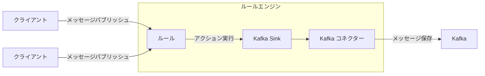
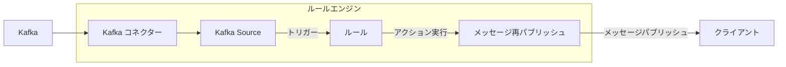

# データ統合

EMQXは、MQTTプロトコルを通じてIoTデバイスを接続し、リアルタイムでメッセージを送受信するMQTTメッセージングプラットフォームです。これを基盤として、EMQXのデータ統合は外部データシステムとの接続を導入し、デバイスと他のビジネスシステムのシームレスな統合を可能にします。

データ統合はSinkおよびSourceコンポーネントを用いて外部データシステムと接続します。SinkはMySQL、Kafka、HTTPサービスなどの外部データシステムへメッセージを送信するために使用され、SourceはMQTT、Kafka、GCP PubSubなどの外部データシステムからメッセージを受信するために使用されます。

この仕組みにより、EMQXは単なるIoTデバイス間のメッセージ送信を超え、デバイスが生成するデータをビジネス全体のエコシステムに有機的に統合できます。これにより、IoTアプリケーションの適用シナリオが広がり、デバイスとビジネスシステム間の相互作用が豊かで多様になります。

::: tip 注意

- EMQX v5.4.0以降、従来のデータブリッジはデータフローの方向に応じて分割され、それぞれSinkとSourceに名称変更されました。

- 現時点でEMQXがSourceとしてサポートする外部データシステムは以下の通りです：

  - MQTTサービス
  - Kafka
  - GCP PubSub

:::

本ページでは、SinkおよびSourceの動作原理、対応する外部データシステム、主な機能、管理方法について包括的に解説します。

## 動作原理

EMQXのデータ統合は標準機能として提供されています。MQTTメッセージングプラットフォームとして、EMQXはMQTTプロトコル経由でIoTデバイスからデータを受信します。内蔵のルールエンジンを利用し、受信データはルールエンジンに設定されたルールによって処理されます。ルールは処理済みデータを設定されたSink/Sourceを通じて外部データシステムに転送するアクションをトリガーします。Dashboard上の[Rules](./rule-get-started.md)や[Flowデザイナー](../flow-designer/introduction.md)を使えば、コーディング不要で簡単にルール作成、アクションの紐付け、Sink/Sourceの作成が可能です。

### 内蔵ルールエンジン

様々なIoTデバイスやシステムからのデータソースは多種多様なデータ型やフォーマットを持ちます。EMQXはSQLベースの強力な内蔵ルールエンジンを備えており、データ処理と配信の中核コンポーネントです。ルールエンジンは条件判定、文字列操作、データ型変換、圧縮/解凍など多彩な機能を持ち、複雑なデータを柔軟に処理できます。

クライアントが特定イベントをトリガーしたり、メッセージがEMQXに到達した際、ルールエンジンは事前定義されたルールに従いリアルタイムでデータを処理します。データ抽出、フィルタリング、付加情報追加、フォーマット変換などを行い、処理済みデータを指定されたSinkに転送します。

ルールエンジンの詳細な動作は[ルールエンジン](./rules.md)章をご参照ください。

### Sink

Sinkはルールの[アクション](./rules.md)として追加されるデータ出力コンポーネントです。デバイスがイベントをトリガーしたりメッセージがEMQXに到着すると、システムは該当ルールをマッチングし実行、データをフィルタリング・処理します。ルールエンジンで処理されたデータは指定されたSinkに転送されます。Sink内では`${var}`や`${.var}`構文を使いデータから変数を抽出し、SQL文やデータテンプレートを動的に生成するなどの処理を設定できます。その後、対応する[コネクター](./connector.md)を通じて外部データシステムにデータを送信し、メッセージ保存、データ更新、イベント通知などの操作を実現します。



Sinkでサポートされる変数抽出構文は以下の通りです：

- `${var}`：ルールの出力結果から変数を抽出する構文です。例：`${topic}`。ネストした変数を抽出する場合はドット`.`を使います。例：`${payload.temp}`。抽出対象の変数が出力結果に含まれていない場合は文字列`undefined`が返されます。
- `${.}`, `${.var}`：`${.}`はルールの全出力結果を含むJSON文字列を抽出し、`${.var}`は`${var}`と同じ意味です。

### Source

Sourceはデータ入力コンポーネントであり、ルールの[データソース](./rule-sql-events-and-fields.md)として機能し、ルールSQLで選択されます。

SourceはMQTTやKafkaなどの外部データシステムからメッセージをサブスクライブまたはコンシュームします。コネクター経由で新しいメッセージが到着すると、ルールエンジンは対応するルールをマッチングし実行、データをフィルタリング・処理します。処理済みデータは指定したEMQXトピックにパブリッシュされ、クラウドコマンド配信などの操作が可能になります。



## 対応統合

EMQXは以下の種類のデータシステムとのデータ統合をサポートしています：

**デフォルト**

- [MQTT](./data-bridge-mqtt.md)
- [Webhook](./webhook.md)/[HTTPServer](./data-bridge-webhook.md)

**クラウド**

- [Amazon Kinesis](./data-bridge-kinesis.md)
- [Azure EventHub](./data-bridge-azure-event-hub.md)
- [GCP PubSub](./data-bridge-gcp-pubsub.md)

**TSDB**

- [Apache IoTDB](./data-bridge-iotdb.md)
- [InfluxDB](./data-bridge-influxdb.md)
- [OpenTSDB](./data-bridge-opents.md)
- [TimescaleDB](./data-bridge-timescale.md)
- [Datalayers](./data-bridge-datalayers.md)

**SQL**

- [Cassandra](./data-bridge-cassa.md)
- [Microsoft SQL Server](./data-bridge-sqlserver.md)
- [MySQL](./data-bridge-mysql.md)
- [Oracle](./data-bridge-oracle.md)
- [PostgreSQL](./data-bridge-pgsql.md)
- [Lindorm](./lindorm.md)
- [Doris](./apache-doris.md)
- [AlloyDB](./alloydb.md)
- [CockroachDB](./cockroachdb.md)
- [Redshift](./redshift.md)

**NoSQL**

- [ClickHouse](./data-bridge-clickhouse.md)
- [Couchbase](./data-bridge-couchbase.md)
- [DynamoDB](./data-bridge-dynamo.md)
- [Greptime](./data-bridge-greptimedb.md)
- [MongoDB](./data-bridge-mongodb.md)
- [Redis](./data-bridge-redis.md)
- [TDengine](./data-bridge-tdengine.md)
- [Elasticsearch](./elasticsearch.md)

**メッセージキュー**

- [Apache Kafka/Confluent](./data-bridge-kafka.md)
- [Pulsar](./data-bridge-pulsar.md)
- [RabbitMQ](./data-bridge-rabbitmq.md)
- [RocketMQ](./data-bridge-rocketmq.md)

**その他**

- [SysKeeper](./syskeeper.md)
- [Amazon S3](./s3.md)
- [Amazon S3 Tables](./s3-tables.md)
- [Azure Blob Storage](./azure-blob-storage.md)
- [Snowflake](./snowflake.md)
- [Disk Log](./disk-log.md)
- [BigQuery](./bigquery.md)
- [Databricks](./databricks.md)

## Sinkの特徴

Sinkは以下の機能により使い勝手を向上させ、データ統合のパフォーマンスと信頼性をさらに高めます。全てのSinkがこれらの機能を完全に実装しているわけではありません。詳細な対応状況は各Sinkのドキュメントをご参照ください。

### 非同期リクエストモード

非同期リクエストモードは、メッセージのパブリッシュ・サブスクライブ処理がSinkの実行速度に影響されないように設計されています。ただし、非同期モードを有効にすると、サブスクライバーがメッセージを受信した時点で、まだ外部データシステムへの書き込みが完了していない場合があります。

EMQXはデータ処理効率を高めるため、デフォルトで非同期リクエストモードを有効にしています。メッセージの配信タイミングに厳密な要件がある場合は、非同期モードを無効にしてください。

`max_inflight`パラメータも非同期リクエスト時のメッセージ順序に影響します。一部のSinkにこのパラメータがあり、非同期モードで同一MQTTクライアントからのメッセージを順序通りに処理する必要がある場合は、必ずこの値を1に設定してください。

### バッチモード

バッチモードは複数のデータエントリをまとめて外部データ統合システムに書き込む機能です。バッチモードを有効にすると、EMQXは各リクエストのデータ（単一エントリ）を一時的に蓄積し、一定時間経過または一定数のデータが溜まった段階でまとめてターゲットデータシステムに書き込みます（いずれも設定可能）。

**メリット：**

- 書き込み効率の向上：単一メッセージ書き込みに比べ、データベースシステムがメッセージをキャッシュや前処理できるため、書き込み効率が向上します。
- ネットワークレイテンシの低減：バッチ書き込みによりネットワーク送信回数が減り、レイテンシが低減します。

**課題：**

書き込み遅延：設定された時間またはエントリ数に達するまで書き込みが保留されるため遅延が発生します。これらの設定はパラメータで調整可能です。

### バッファキュー

バッファキューはSinkに一定のフォールトトレランスを提供し、データ安全性向上のため有効化を推奨します。

各リソース接続（MQTT接続ではありません）にはバッファキュー長（容量サイズ）があり、この長さを超えたデータはFIFO原則に従い破棄されます。

#### バッファファイルの場所

Kafka Sinkの場合、ディスクキャッシュファイルは`data/kafka`に配置され、その他のSinkは`data/bufs`に配置されます。

実運用では`data`ディレクトリを高性能ディスクにマウントしスループットを向上させることが可能です。

### プリペアドステートメント

MySQLやPostgreSQLなどのSQLデータベースでは、SQLテンプレートはフィールド変数を明示的に指定することなくプリプロセスされて実行されます。

直接SQLを実行する場合は、topicとpayloadを文字列型、qosを整数型としてシングルクォートで明示的に指定する必要があります：

```sql
INSERT INTO msg(topic, qos, payload) VALUES('${topic}', ${qos}, '${payload}');
```

しかし、プリペアドステートメントをサポートするSinkでは、SQLテンプレートは**クォートなし**で記述する必要があります：

```sql
INSERT INTO msg(topic, qos, payload) VALUES(${topic}, ${qos}, ${payload});
```

これによりフィールド型の自動推論に加え、SQLインジェクションを防止しセキュリティを強化します。

### フォールバックアクション

EMQX 5.9.0以降、任意のアクションに対してフォールバックアクションのセットを定義可能です。プライマリアクションがメッセージ処理に失敗した場合、これらのフォールバックアクションがトリガーされます。この仕組みはデータの信頼性と可観測性を向上させ、メッセージを別のSinkや再パブリッシュアクションなどの二次ターゲットにリダイレクトできます。

フォールバックアクションの用途例：

- 失敗したメッセージをバックアップデータシステム（例：別のSink）に転送
- 監視トピックへの失敗メッセージ再パブリッシュによるトラブルシューティングやアラート
- プライマリアクションの一時的障害時のデータ損失最小化

#### 主な特徴

- フォールバックアクションはプライマリアクションがメッセージ処理に失敗した場合のみトリガーされます。失敗には配信エラー、バッファオーバーフロー、リクエストTTL切れが含まれます。
- フォールバックアクションは自身の設定に関わらず常に非同期リクエストモードで動作します。
- 定義された全てのフォールバックアクションは同時にトリガーされます。EMQXは順次試行や最初の成功で停止しません。
- フォールバックアクションは通常アクションと同じバッファリング機構を共有し、メッセージはリクエストTTLまたはバッファオーバーフローまでリトライされます。
- フォールバックアクションはさらに別のフォールバックアクションをトリガーしません。フォールバックアクション自身が失敗しても、そのフォールバックは実行されません。
- フォールバックアクションによるメッセージ処理はプライマリアクションや元のルールのメトリクスに影響しません。

#### フォールバックアクションの定義例

HTTPアクション`my_http`に対してフォールバックアクションを定義し、既存のMQTTアクション`fallback`を利用する例です。

```hcl
actions {
  http {
    my_http {
      fallback_actions = [
        {kind = reference, type = mqtt, name = fallback},
        {
          kind = republish,
          args {
            topic = "fallback/republish/topic"
            qos = 1
            payload = "${payload}"
          }
        }
      ]
      # その他の設定は省略
    }
  }
  mqtt {
    fallback {
      fallback_actions = [
        {kind = reference, type = mqtt, name = another_fallback}
      ]
      # その他の設定は省略
    }
  }
}
```

この例では：

- HTTPアクション`my_http`が失敗した場合、メッセージは
  - MQTTアクション`fallback`に転送され、
  - トピック`fallback/republish/topic`に再パブリッシュされます。
- `fallback`が失敗しても、`fallback`内で定義されたフォールバックアクション`another_fallback`は**トリガーされません**。フォールバックアクションは再帰的な連鎖をサポートしません。
- もし`fallback`が別のルールのプライマリアクションとしてトリガーされ失敗した場合、そのルールのフォールバック（`another_fallback`）が適用されます。

## Sinkのステータスと統計情報

Dashboard上でSinkの稼働状況や統計情報を確認し、正常に動作しているか把握できます。

### 稼働ステータス

Sinkは以下のステータスを持ちます：

- `connecting`：ヘルスチェック前の初期状態で、ブリッジが外部データシステムへの接続を試行中。
- `connected`：Sinkが正常に接続され稼働中。ヘルスチェック失敗時は障害の程度に応じて`connecting`または`disconnected`に遷移。
- `disconnected`：ヘルスチェックに失敗し非正常状態。設定により自動再接続を試みる場合あり。
- `stopped`：手動で無効化された状態。
- `inconsistent`：クラスター内ノード間でSinkステータスに不一致がある状態。

### 稼働統計情報

EMQXはデータ統合の稼働統計を以下のカテゴリで提供します：

- Matched（カウンター）
- Sent Successfully（カウンター）
- Sent Failed（カウンター）
- Dropped（カウンター）
- Late Reply（カウンター）
- Inflight（ゲージ）
- Queuing（ゲージ）


#### Matched

`matched`はSinkにルーティングされたリクエスト/メッセージ数をカウントします。状態に関わらずカウントされます。各メッセージは他のメトリクスで最終的に計上されるため、`matched = success + failed + inflight + queuing + late_reply + dropped`となります。

#### Sent Successfully

`success`は外部データシステムに正常に受信されたメッセージ数をカウントします。`retried.success`は`success`のサブカウントで、少なくとも1回再配信されたメッセージ数を追跡します。したがって`retried.success <= success`です。

#### Sent Failed

`failed`は外部データシステムへの受信に失敗したメッセージ数をカウントします。`retried.failed`は`failed`のサブカウントで、少なくとも1回再配信されたメッセージ数を追跡します。したがって`retried.failed <= failed`です。

#### Dropped

`dropped`は配信試行なしに破棄されたメッセージ数をカウントします。複数の詳細カテゴリが含まれ、それぞれ破棄理由を示します。計算式は`dropped = dropped.expired + dropped.queue_full + dropped.resource_stopped + dropped.resource_not_found`です。

- `expired`：キューイング中にメッセージのTTLが切れた。
- `queue_full`：キューが最大容量に達し、メモリオーバーフロー防止のため破棄された。
- `resource_stopped`：Sinkが停止中に配信を試みたメッセージ。
- `resource_not_found`：Sinkが存在しない状態で配信を試みたメッセージ。稀に発生し、Sink削除時の競合状態が原因。

#### Late Reply

`late_reply`はメッセージ送信を試みたが、基盤ドライバーからの応答がメッセージTTL切れ後に届いた場合にインクリメントされます。

::: tip
`late_reply`はメッセージが成功したか失敗したかを示しません。不明な状態です。外部データシステムへの挿入に成功した可能性もあれば失敗、あるいは接続タイムアウトの可能性もあります。
:::

#### Inflight

`inflight`はバッファリング層内で現在送信待ちのメッセージ数を示すゲージです。

#### Queuing

`queuing`はバッファリング層に受信済みでまだ外部データシステムに送信されていないメッセージ数を示すゲージです。
